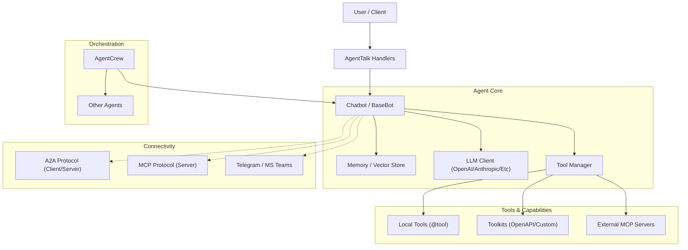

# AI-Parrot

**AI-Parrot** is an async-first Python framework for building, extending, and orchestrating AI Agents and Chatbots. Built on top of `navigator-api`, it provides a unified interface for interacting with various LLM providers, managing tools, conducting agent-to-agent (A2A) communication, and serving agents via the Model Context Protocol (MCP).

Whether you need a simple chatbot, a complex multi-agent orchestration workflow, or a robust production-ready AI service, AI-Parrot exposes the primitives to build it efficiently.

## Monorepo Structure

AI-Parrot is organized as a **monorepo** with four packages:

| Package | PyPI Name | Description |
|---------|-----------|-------------|
| `packages/ai-parrot` | `ai-parrot` | Core framework: agents, clients, memory, orchestration |
| `packages/ai-parrot-tools` | `ai-parrot-tools` | Tool and toolkit implementations (Jira, AWS, Slack, etc.) |
| `packages/ai-parrot-loaders` | `ai-parrot-loaders` | Document loaders for RAG pipelines (PDF, YouTube, audio, etc.) |
| `packages/ai-parrot-pipelines` | `ai-parrot-pipelines` | Specialized pipelines such as planogram compliance workflows |

The core package (`ai-parrot`) provides the base abstractions (`AbstractTool`, `AbstractToolkit`, `@tool`) and lightweight built-in tools. Heavy tool implementations, document loaders, and specialized pipelines are split into their own packages so you only install what you need.

---

## Installation

### Core framework

```bash
uv pip install ai-parrot
```

### Quick Setup (CLI)

After installing, use the `parrot` CLI to configure your environment interactively:

```bash
# Interactive setup wizard — select LLM provider, enter API keys, generate .env
parrot setup

# Initialize configuration directory structure (env/ and etc/)
parrot conf init
```

The `parrot setup` wizard will guide you through:
1. Selecting an LLM provider (OpenAI, Anthropic, Google, etc.)
2. Entering your API credentials
3. Writing them to the correct `.env` file
4. Optionally creating a starter Agent and bootstrap files (`app.py`, `run.py`)

Additional CLI commands:

```bash
# Start an MCP server from a YAML config
parrot mcp --config server.yaml

# Deploy an autonomous agent as a systemd service
parrot autonomous create --agent my_agent.py
parrot autonomous install --agent my_agent.py --name my-agent
```

### LLM Providers

Install only the providers you need:

```bash
# Google Gemini
uv pip install "ai-parrot[google]"

# OpenAI / GPT
uv pip install "ai-parrot[openai]"

# Anthropic / Claude
uv pip install "ai-parrot[anthropic]"

# Groq
uv pip install "ai-parrot[groq]"

# X.AI / Grok
uv pip install "ai-parrot[xai]"

# All LLM providers at once
uv pip install "ai-parrot[llms]"
```

Additional providers supported out of the box (no extra install needed):
- **HuggingFace** (`hf`) — uses the HuggingFace Inference API
- **vLLM** (`vllm`) — connects to a local vLLM server
- **OpenRouter** (`openrouter`) — routes to any model via OpenRouter API
- **Ollama / Local** — via OpenAI-compatible endpoints

### Embeddings & Vector Stores

```bash
# Sentence transformers, FAISS, ChromaDB, etc.
uv pip install "ai-parrot[embeddings]"
```

### Tools

```bash
# Install the tools package
uv pip install ai-parrot-tools

# Or with specific tool extras
uv pip install "ai-parrot-tools[jira]"
uv pip install "ai-parrot-tools[aws]"
uv pip install "ai-parrot-tools[slack]"
uv pip install "ai-parrot-tools[finance]"
uv pip install "ai-parrot-tools[all]"       # All tool dependencies
```

Available tool extras: `jira`, `slack`, `aws`, `docker`, `git`, `analysis`, `excel`, `sandbox`, `codeinterpreter`, `pulumi`, `sitesearch`, `office365`, `scraping`, `finance`, `db`, `flowtask`, `google`, `arxiv`, `wikipedia`, `weather`, `messaging`.

### Document Loaders

```bash
# Install the loaders package
uv pip install ai-parrot-loaders

# Or with specific loader extras
uv pip install "ai-parrot-loaders[youtube]"
uv pip install "ai-parrot-loaders[pdf]"
uv pip install "ai-parrot-loaders[audio]"
uv pip install "ai-parrot-loaders[all]"     # All loader dependencies
```

Available loader extras: `youtube`, `audio`, `pdf`, `web`, `ebook`, `video`.

### Pipelines

```bash
# Install the pipelines package
uv pip install ai-parrot-pipelines
```

Backward-compatible imports from `parrot.pipelines` continue to work when the package is installed.

### Platform & Security Tools

AI-Parrot includes tools for **cloud security auditing** and **infrastructure management**. These tools rely on external Docker images that must be installed before use:

```bash
# Security tools
parrot install cloudsploit    # AWS security scanner (CloudSploit)
parrot install prowler        # Cloud security posture management

# Platform tools
parrot install pulumi         # Infrastructure as Code CLI
```

The `parrot install` command pulls and configures the required Docker containers automatically, so the tools are ready to be used by your agents.

---

## Quick Start

Create a simple weather chatbot in just a few lines of code:

```python
import asyncio
from parrot.bots import Chatbot
from parrot.tools import tool

# 1. Define a tool
@tool
def get_weather(location: str) -> str:
    """Get the current weather for a location."""
    return f"The weather in {location} is Sunny, 25C"

async def main():
    # 2. Create the Agent
    bot = Chatbot(
        name="WeatherBot",
        llm="openai:gpt-4o",  # Provider:Model
        tools=[get_weather],
        system_prompt="You are a helpful weather assistant."
    )

    # 3. Configure (loads tools, connects to memory)
    await bot.configure()

    # 4. Chat!
    response = await bot.ask("What's the weather like in Madrid?")
    print(response)

if __name__ == "__main__":
    asyncio.run(main())
```

### Using LLM Clients Directly

Beyond the `Chatbot` abstraction, you can access any LLM provider client directly for lower-level operations like image generation, embeddings, or custom completion calls:

```python
import asyncio
from parrot.clients.google.client import GoogleGenAIClient
from parrot.models.outputs import ImageGenerationPrompt
from parrot.models.google import GoogleModel

async def main():
    prompt = ImageGenerationPrompt(
        prompt="A realistic passport-style photo with white background",
        styles=["photorealistic", "high resolution"],
        model=GoogleModel.IMAGEN_3.value,
        aspect_ratio="16:9",
    )

    client = GoogleGenAIClient()
    async with client:
        response = await client.image_generation(prompt_data=prompt)
        for img_path in response.images:
            print(f"Image saved to: {img_path}")

if __name__ == "__main__":
    asyncio.run(main())
```

Each provider client (`GoogleGenAIClient`, `OpenAIClient`, `AnthropicClient`, etc.) implements `AbstractClient` and can be used as an async context manager. This gives you full access to provider-specific features — image generation, audio transcription, structured outputs — while still benefiting from AI-Parrot's unified configuration and credential management.

---

## Running as a Server

AI-Parrot is not only a library — it is also a full **aiohttp-based application server** that exposes your agents as REST APIs, WebSocket endpoints, and more. This is powered by [Navigator](https://github.com/phenobarbital/navigator-api), an async web framework built on aiohttp.

### How it works

When you run `parrot setup`, it generates two files:

- **`app.py`** — Defines your application handler, registers agents with `BotManager`, and configures routes.
- **`run.py`** — The entry point that starts the aiohttp server.

**app.py** (generated by `parrot setup`):

```python
from parrot.manager import BotManager
from parrot.conf import STATIC_DIR
from parrot.handlers import AppHandler
from agents.my_agent import MyAgent


class Main(AppHandler):
    app_name: str = "Parrot"
    enable_static: bool = True
    staticdir: str = STATIC_DIR

    def configure(self) -> None:
        self.bot_manager = BotManager()
        self.bot_manager.register(MyAgent())
        self.bot_manager.setup(self.app)
```

**run.py** (generated by `parrot setup`):

```python
from navigator import Application
from app import Main

app = Application(Main, enable_jinja2=True)

if __name__ == "__main__":
    app.run()
```

### Built-in endpoints

Once the server starts, `BotManager.setup()` automatically registers these routes:

| Endpoint | Method | Description |
|----------|--------|-------------|
| `/api/v1/agents/chat/{agent_id}` | POST | Chat with an agent (JSON, HTML, or Markdown response) |
| `/api/v1/agents/chat/{agent_id}` | PATCH | Configure tools/MCP servers for a session |
| `/api/v1/bot_management` | GET | List registered bots |
| `/api/v1/bot_management/{bot}` | GET/POST/PATCH/DELETE | CRUD operations on bots |
| `/api/v1/agent_tools` | GET | List available tools |
| `/api/v1/ai/client` | GET | LLM provider configuration |
| `/ws/userinfo` | WebSocket | Real-time user notifications |

### Starting the server

**Development** (single process, auto-reload):

```bash
python run.py
```

The server starts on `http://0.0.0.0:5000` by default (configurable via `APP_HOST` / `APP_PORT` environment variables).

**Production** (Gunicorn with async workers):

```bash
# Install gunicorn
uv pip install "ai-parrot[deploy]"

# Run with aiohttp-compatible workers
gunicorn run:app \
    --worker-class aiohttp.worker.GunicornUVLoopWebWorker \
    --workers 4 \
    --bind 0.0.0.0:5000 \
    --timeout 360
```

The long timeout (360s) accommodates agent queries that involve multi-step tool execution or LLM calls.

### Talking to your agents via REST

Once the server is running, any registered agent is accessible via HTTP:

```bash
# Chat with an agent
curl -X POST http://localhost:5000/api/v1/agents/chat/my-agent \
  -H "Content-Type: application/json" \
  -d '{"message": "What is the weather in Madrid?"}'

# Request markdown output
curl -X POST "http://localhost:5000/api/v1/agents/chat/my-agent?output_format=markdown" \
  -H "Content-Type: application/json" \
  -d '{"message": "Summarize the latest news"}'
```

---

## Architecture

AI-Parrot is designed with a modular architecture enabling agents to be both consumers and providers of tools and services.



---

## Core Concepts

### Agents (`Chatbot`)

The `Chatbot` class is your main entry point. It handles conversation history, RAG (Retrieval-Augmented Generation), and the tool execution loop.

```python
bot = Chatbot(
    name="MyAgent",
    model="anthropic:claude-3-5-sonnet-20240620",
    enable_memory=True
)
```

### Tools

#### Functional Tools (`@tool`)

The simplest way to create a tool. The docstring and type hints are automatically used to generate the schema for the LLM.

```python
from parrot.tools import tool

@tool
def calculate_vat(amount: float, rate: float = 0.20) -> float:
    """Calculate VAT for a given amount."""
    return amount * rate
```

#### Class-Based Toolkits (`AbstractToolkit`)

Group related tools into a reusable class. All public async methods become tools.

```python
from parrot.tools import AbstractToolkit

class MathToolkit(AbstractToolkit):
    async def add(self, a: int, b: int) -> int:
        """Add two numbers."""
        return a + b

    async def multiply(self, a: int, b: int) -> int:
        """Multiply two numbers."""
        return a * b
```

#### OpenAPI Toolkit (`OpenAPIToolkit`)

Dynamically generate tools from any OpenAPI/Swagger specification.

```python
from parrot.tools import OpenAPIToolkit

petstore = OpenAPIToolkit(
    spec="https://petstore.swagger.io/v2/swagger.json",
    service="petstore"
)

# Now your agent can call petstore_get_pet_by_id, etc.
bot = Chatbot(name="PetBot", tools=petstore.get_tools())
```

### Orchestration (`AgentCrew`)

Orchestrate multiple agents to solve complex tasks using `AgentCrew`.

**Supported Modes:**
- **Sequential**: Agents run one after another, passing context.
- **Parallel**: Independent tasks run concurrently.
- **Flow**: DAG-based execution defined by dependencies.
- **Loop**: Iterative execution until a condition is met.

```python
from parrot.bots.orchestration import AgentCrew

crew = AgentCrew(
    name="ResearchTeam",
    agents=[researcher_agent, writer_agent]
)

# Define a Flow — Writer waits for Researcher to finish
crew.task_flow(researcher_agent, writer_agent)

await crew.run_flow("Research the latest advancements in Quantum Computing")
```

### Scheduling (`@schedule`)

Give your agents agency to run tasks in the background.

```python
from parrot.scheduler import schedule, ScheduleType

class DailyBot(Chatbot):
    @schedule(schedule_type=ScheduleType.DAILY, hour=9, minute=0)
    async def morning_briefing(self):
        news = await self.ask("Summarize today's top tech news")
        await self.send_notification(news)
```

---

## Connectivity & Exposure

### Agent-to-Agent (A2A) Protocol

Agents can discover and talk to each other using the A2A protocol.

**Expose an Agent:**
```python
from parrot.a2a import A2AServer

a2a = A2AServer(my_agent)
a2a.setup(app, url="https://my-agent.com")
```

**Consume an Agent:**
```python
from parrot.a2a import A2AClient

async with A2AClient("https://remote-agent.com") as client:
    response = await client.send_message("Hello from another agent!")
```

### Model Context Protocol (MCP)

AI-Parrot has first-class support for MCP.

**Consume MCP Servers:**
```python
mcp_servers = [
    MCPServerConfig(
        name="filesystem",
        command="npx",
        args=["-y", "@modelcontextprotocol/server-filesystem", "/home/user"]
    )
]
await bot.setup_mcp_servers(mcp_servers)
```

**Expose Agent as MCP Server:**
Allow Claude Desktop or other MCP clients to use your agent as a tool.

### Platform Integrations

Expose your bots natively to chat platforms:
- **Telegram**
- **Microsoft Teams**
- **Slack**
- **WhatsApp**

---

## Supported LLM Providers

| Provider | Extra | Identifier | Example |
|----------|-------|------------|---------|
| OpenAI | `openai` | `openai` | `openai:gpt-4o` |
| Anthropic | `anthropic` | `anthropic`, `claude` | `anthropic:claude-sonnet-4-20250514` |
| Google Gemini | `google` | `google` | `google:gemini-2.0-flash` |
| Groq | `groq` | `groq` | `groq:llama-3.3-70b-versatile` |
| X.AI / Grok | `xai` | `grok` | `grok:grok-3` |
| HuggingFace | *(included)* | `hf` | `hf:meta-llama/Llama-3-8B` |
| vLLM | *(included)* | `vllm` | `vllm:model-name` |
| OpenRouter | *(included)* | `openrouter` | `openrouter:anthropic/claude-sonnet-4` |
| Ollama | *(included)* | via OpenAI endpoint | — |

---

## Contributing

### Development setup (from source)

AI-Parrot uses **`uv`** as its package manager and provides a **Makefile** to simplify common tasks.

```bash
git clone https://github.com/phenobarbital/ai-parrot.git
cd ai-parrot

# Create the virtual environment (Python 3.11)
make venv
source .venv/bin/activate

# Full dev install — all packages, all extras, dev tools
make develop

# Run tests
make test
```

#### Makefile targets

The Makefile covers the entire development lifecycle. Run `make help` for the full list.

**Development install variants:**

| Target | What it installs |
|--------|-----------------|
| `make develop` | All packages + all extras + dev tools (full environment) |
| `make develop-fast` | All packages, base deps only (no torch/tensorflow/whisperx) |
| `make develop-ml` | Embeddings + audio loaders (heavy ML stack) |

**Production install variants:**

| Target | What it installs |
|--------|-----------------|
| `make install` | All packages, base deps only (no extras) |
| `make install-core` | Core with LLM clients + vector stores |
| `make install-tools` | Core + tools with common extras (jira, slack, aws, etc.) |
| `make install-tools-all` | Core + tools with ALL extras |
| `make install-loaders` | Core + loaders with common extras (youtube, web, pdf) |
| `make install-loaders-all` | Core + loaders with ALL extras (includes whisperx, pyannote) |
| `make install-all` | Everything with ALL extras |

**Other useful targets:**

```bash
make format          # Format code with black
make lint            # Lint with pylint + black --check
make test            # Run pytest + mypy
make build           # Build all packages (sdist + wheel)
make release         # Build + publish to PyPI
make lock            # Regenerate uv.lock
make clean           # Remove build artifacts
make generate-registry  # Regenerate TOOL_REGISTRY from source
make bump-patch      # Bump patch version (syncs across all packages)
```

#### Manual install (without Make)

If you prefer not to use Make:

```bash
uv venv --python 3.11 .venv
source .venv/bin/activate

# Full install
uv sync --all-packages --all-extras

# Or selective extras
uv sync --extra google --extra openai
```

### Project layout

```
ai-parrot/
├── packages/
│   ├── ai-parrot/           # Core framework
│   │   └── src/parrot/
│   ├── ai-parrot-tools/     # Tool implementations
│   │   └── src/parrot_tools/
│   └── ai-parrot-loaders/   # Document loaders
│       └── src/parrot_loaders/
├── tests/
├── examples/
├── Makefile                  # Build, install, test, release shortcuts
└── pyproject.toml            # Workspace root
```

### Releasing to PyPI

AI-Parrot publishes three packages on every GitHub release:

| Package | PyPI Project | Build Method |
|---------|-------------|-------------|
| `ai-parrot` | [ai-parrot](https://pypi.org/p/ai-parrot) | cibuildwheel (Cython + Rust/Maturin) |
| `ai-parrot-tools` | [ai-parrot-tools](https://pypi.org/p/ai-parrot-tools) | uv build (pure Python) |
| `ai-parrot-loaders` | [ai-parrot-loaders](https://pypi.org/p/ai-parrot-loaders) | uv build (pure Python) |

The release workflow (`.github/workflows/release.yml`) runs 3 parallel build jobs and a single deploy job:

```
release event
    ├── build-core   — cibuildwheel for ai-parrot (Cython + Rust)
    ├── build-tools  — uv build for ai-parrot-tools
    ├── build-loaders — uv build for ai-parrot-loaders
    └── deploy       — twine upload all artifacts to PyPI
```

**To create a release:**

1. Bump the version in each package's `pyproject.toml` (or use `make bump-patch` to sync all three).
2. Create a GitHub release — the workflow triggers automatically on the `release: created` event.

**First-time PyPI setup (required once):**

- Create `ai-parrot-tools` and `ai-parrot-loaders` projects on [PyPI](https://pypi.org) under the same account as `ai-parrot`.
- Ensure the `NAV_AIPARROT_API_SECRET` GitHub secret holds a PyPI API token with **upload scope for all 3 projects**. A scoped token per project or a single account-level token both work.

**Independent versioning:**

Each package has its own version number in its `pyproject.toml`. All three are built and published on the same release event — there is no requirement to keep versions in sync.

---

### Guidelines

- All code must be **async-first** — no blocking I/O in async contexts
- Use **type hints** and **Google-style docstrings** on all public APIs
- Use **Pydantic** models for structured data
- Run `pytest` after any logic change
- Tools with heavy dependencies must use **lazy imports** to avoid bloating the core

### Issues & Support

- **Issues**: [GitHub Tracker](https://github.com/phenobarbital/ai-parrot/issues)
- **Discussion**: [GitHub Discussions](https://github.com/phenobarbital/ai-parrot/discussions)

---

## License

MIT

---
*Built with care by the AI-Parrot Team*
