# WhatsApp + AutonomousOrchestrator Integration

Complete guide for connecting WhatsApp as an input channel to AI-Parrot's `AutonomousOrchestrator` via the WhatsApp Bridge and Redis Pub/Sub.

## Architecture

```mermaid
graph LR
    U["📱 WhatsApp User"] -->|message| WA[WhatsApp Cloud]
    WA -->|whatsmeow| B["🔌 WhatsApp Bridge<br/>(Go Service)"]
    B -->|PUBLISH| R[(Redis Pub/Sub<br/>whatsapp:messages)]
    R -->|SUBSCRIBE| H["WhatsAppRedisHook"]
    H -->|HookEvent| O["AutonomousOrchestrator"]
    O -->|ask / run_flow| A["Agent / Crew"]
    A -->|response| O
    O -->|send_reply| H
    H -->|HTTP POST /send| B
    B -->|whatsmeow| WA
    WA -->|reply| U
```



### Message Flow

1. User sends WhatsApp message → **Bridge** receives via `whatsmeow`
2. Bridge publishes `IncomingMessage` JSON to Redis channel `whatsapp:messages`
3. `WhatsAppRedisHook` subscribes, filters, routes → emits `HookEvent`
4. `AutonomousOrchestrator._handle_hook_event()` creates `ExecutionRequest`
5. Agent/Crew processes the task, returns response
6. If `auto_reply=True`, response is POSTed back via Bridge `/send` endpoint

---

## Prerequisites

| Component | Purpose | Default |
|-----------|---------|---------|
| Redis 7+ | Message broker (Pub/Sub) | `redis://localhost:6379` |
| WhatsApp Bridge | Go service (whatsmeow) | `http://localhost:8765` |
| AI-Parrot | Python orchestration | `http://localhost:8000` |

---

## 1. Infrastructure Setup

### Option A: Docker Compose (recommended)

The project includes a ready-to-use `docker-compose.yml`:

```bash
# Start all services (Redis + Bridge + App)
docker compose up -d

# View Bridge logs (QR code will appear here)
docker compose logs -f whatsapp-bridge
```

Services defined in [`docker-compose.yml`](../docker-compose.yml):

| Service | Container | Port | Notes |
|---------|-----------|------|-------|
| `redis` | `parrot-redis` | 6379 | `redis:7-alpine` with AOF persistence |
| `whatsapp-bridge` | `parrot-whatsapp-bridge` | 8765 | Auto-builds from `services/whatsapp-bridge/` |
| `ai-parrot` | `parrot-app` | 8000 | Connects to Redis + Bridge |

### Option B: Makefile Targets (local dev)

```bash
# Build Bridge binary from Go source
make build-whatsapp-bridge

# Run Bridge locally (Redis must be running separately)
make run-whatsapp-bridge

# Or build and run via Docker
make docker-whatsapp-bridge
```

### Option C: Manual Setup

```bash
# Terminal 1: Redis
docker run -p 6379:6379 redis:7-alpine

# Terminal 2: WhatsApp Bridge
cd services/whatsapp-bridge
go mod download
go run main.go

# Terminal 3: Your Python application
source .venv/bin/activate
python examples/whatsapp_orchestrator.py
```

---

## 2. WhatsApp Authentication

The Bridge authenticates via QR code scanning (first time only — session persists in SQLite):

### Web QR (recommended)

Open `http://localhost:8765/qr` in your browser.
A page with the QR code and live authentication status appears.

### Terminal QR

The QR code also prints to the terminal where the Bridge runs.

### Verification

```bash
# Check bridge health
curl http://localhost:8765/health
```

Expected response when authenticated:

```json
{
  "success": true,
  "data": {
    "connected": true,
    "authenticated": true,
    "logged_in": true
  }
}
```

---

## 3. Hook Configuration

### `WhatsAppRedisHookConfig`

Defined in [`parrot/autonomous/hooks/models.py`](../parrot/autonomous/hooks/models.py):

| Field | Type | Default | Description |
|-------|------|---------|-------------|
| `name` | `str` | `"whatsapp_hook"` | Hook instance name |
| `enabled` | `bool` | `True` | Enable/disable |
| `target_type` | `str` | `"agent"` | Default target: `"agent"` or `"crew"` |
| `target_id` | `str` | `None` | Default agent/crew name |
| `redis_url` | `str` | `"redis://localhost:6379"` | Redis connection URL |
| `channel` | `str` | `"whatsapp:messages"` | Redis Pub/Sub channel |
| `bridge_url` | `str` | `"http://localhost:8765"` | Bridge HTTP URL |
| `auto_reply` | `bool` | `True` | Send responses back via WhatsApp |
| `command_prefix` | `str` | `""` | Required message prefix (e.g., `"!"`, `"/"`) |
| `allowed_phones` | `List[str]?` | `None` | Phone whitelist (`None` = allow all) |
| `allowed_groups` | `List[str]?` | `None` | Group name whitelist |
| `routes` | `List[Dict]?` | `None` | Routing rules (see below) |

### Routing Rules

Routes are checked in order (first match wins). Each route is a dict:

```python
{
    "name": "sales",                        # Human-readable label
    "keywords": ["precio", "comprar"],      # Match if any keyword in message
    "phones": ["14155551234"],              # Match if sender phone matches
    "target_id": "SalesAgent",             # Override target agent/crew
    "target_type": "agent"                 # Override target type
}
```

- **Phone match** has higher priority than keyword match within the same route.
- If no route matches, the default `target_id` is used.

### Factory Helpers

Three convenience functions in [`parrot/autonomous/hooks/models.py`](../parrot/autonomous/hooks/models.py):

```python
from parrot.autonomous.hooks import (
    create_simple_whatsapp_hook,
    create_multi_agent_whatsapp_hook,
    create_crew_whatsapp_hook,
)

# Single agent — all messages go to one agent
config = create_simple_whatsapp_hook("CustomerService", allowed_phones=["14155552671"])

# Multi-agent — route by keywords or phone numbers
config = create_multi_agent_whatsapp_hook(
    default_agent="GeneralAgent",
    routes=[
        {"name": "sales", "keywords": ["precio", "buy"], "target_id": "SalesAgent"},
        {"name": "vip",   "phones": ["14155551234"],      "target_id": "VIPAgent"},
    ],
)

# Crew — route to an AgentCrew
config = create_crew_whatsapp_hook("research_team", command_prefix="!")
```

---

## 4. Python Usage Examples

### Example 1: Single Agent

```python
"""Minimal WhatsApp → single agent setup."""
import asyncio
from parrot.autonomous.orchestrator import AutonomousOrchestrator
from parrot.autonomous.hooks import WhatsAppRedisHook, create_simple_whatsapp_hook
from parrot.registry import AgentRegistry
from parrot.bots.agent import BasicAgent


async def main():
    # 1. Create and register agent
    agent = BasicAgent(
        name="CustomerService",
        llm="google:gemini-2.0-flash-exp",
        system_instructions="You are a helpful customer service agent. Be concise.",
    )
    await agent.configure()

    registry = AgentRegistry()
    registry.register_bot(agent)

    # 2. Create orchestrator
    orchestrator = AutonomousOrchestrator(
        agent_registry=registry,
        redis_url="redis://localhost:6379",
    )

    # 3. Configure and register WhatsApp hook
    config = create_simple_whatsapp_hook(
        agent_name="CustomerService",
        allowed_phones=["14155552671"],
        command_prefix="!",
    )
    hook = WhatsAppRedisHook(config=config)
    orchestrator.add_hook(hook)

    # 4. Start (blocks until stopped)
    await orchestrator.start()
    print("Orchestrator running. Send WhatsApp messages like: !hello")

    try:
        await asyncio.Event().wait()  # Run forever
    finally:
        await orchestrator.stop()


if __name__ == "__main__":
    asyncio.run(main())
```

### Example 2: Multi-Agent with Routing

```python
"""Route WhatsApp messages to different agents by keywords."""
import asyncio
from parrot.autonomous.orchestrator import AutonomousOrchestrator
from parrot.autonomous.hooks import WhatsAppRedisHook, create_multi_agent_whatsapp_hook
from parrot.registry import AgentRegistry
from parrot.bots.agent import BasicAgent


async def main():
    registry = AgentRegistry()

    # Create specialized agents
    for name, instructions in [
        ("SalesAgent",   "You handle pricing and purchase inquiries."),
        ("SupportAgent", "You handle technical support and troubleshooting."),
        ("GeneralAgent", "You handle general questions."),
    ]:
        agent = BasicAgent(
            name=name,
            llm="google:gemini-2.0-flash-exp",
            system_instructions=instructions,
        )
        await agent.configure()
        registry.register_bot(agent)

    # Multi-agent routing
    config = create_multi_agent_whatsapp_hook(
        default_agent="GeneralAgent",
        routes=[
            {
                "name": "sales",
                "keywords": ["precio", "comprar", "price", "buy"],
                "target_id": "SalesAgent",
                "target_type": "agent",
            },
            {
                "name": "support",
                "keywords": ["ayuda", "error", "help", "bug"],
                "target_id": "SupportAgent",
                "target_type": "agent",
            },
        ],
    )

    orchestrator = AutonomousOrchestrator(
        agent_registry=registry,
        redis_url="redis://localhost:6379",
    )
    orchestrator.add_hook(WhatsAppRedisHook(config=config))
    await orchestrator.start()

    print("Multi-agent router running:")
    print("  'precio del plan' → SalesAgent")
    print("  'necesito ayuda'  → SupportAgent")
    print("  'hola mundo'      → GeneralAgent")

    try:
        await asyncio.Event().wait()
    finally:
        await orchestrator.stop()


if __name__ == "__main__":
    asyncio.run(main())
```

### Example 3: Crew Execution

```python
"""Route WhatsApp messages to an AgentCrew."""
import asyncio
from parrot.autonomous.orchestrator import AutonomousOrchestrator
from parrot.autonomous.hooks import WhatsAppRedisHook, create_crew_whatsapp_hook
from parrot.manager import BotManager


async def main():
    # BotManager handles crew registrations
    bot_manager = BotManager()

    # Register a crew (assumes crew YAML or programmatic setup)
    # await bot_manager.register_crew("research_team", crew_definition)

    config = create_crew_whatsapp_hook(
        crew_id="research_team",
        command_prefix="!",
    )

    orchestrator = AutonomousOrchestrator(
        bot_manager=bot_manager,
        redis_url="redis://localhost:6379",
    )
    orchestrator.add_hook(WhatsAppRedisHook(config=config))
    await orchestrator.start()

    print("Crew router running. Send: !investigate quantum computing")

    try:
        await asyncio.Event().wait()
    finally:
        await orchestrator.stop()


if __name__ == "__main__":
    asyncio.run(main())
```

---

## 5. The HookEvent Payload

When `WhatsAppRedisHook` receives a message, it emits a `HookEvent` with this payload structure:

```python
{
    # User identification
    "from": "14155552671",
    "from_name": "John Doe",
    "user_id": "14155552671",

    # Message content
    "content": "hello, I need help",           # After prefix stripping
    "original_content": "!hello, I need help",  # Original message
    "message_id": "3EB0A1B2C3D4E5F6",

    # Group info
    "is_group": False,
    "group_name": "",

    # Session management
    "session_id": "whatsapp_14155552671",       # Per-phone sessions
    # For groups: "whatsapp_group_{name}_{phone}"

    # Routing
    "matched_route": "support",                 # Or None if default

    # Auto-reply config
    "reply_via_bridge": True,
    "bridge_config": {
        "phone": "14155552671",
        "bridge_url": "http://localhost:8765",
        "auto_reply": True,
    },

    # Raw data from Bridge
    "raw_data": { ... },  # Full IncomingMessage JSON
}
```

---

## 6. Bridge API Reference

The Go Bridge exposes these HTTP endpoints:

### `GET /health`

Returns connection and authentication status.

### `POST /send`

Send a WhatsApp message:

```bash
curl -X POST http://localhost:8765/send \
  -H "Content-Type: application/json" \
  -d '{"phone": "14155552671", "message": "Hello from AI!"}'
```

Response:

```json
{"success": true, "data": {"message_id": "3EB0...", "timestamp": "2026-02-15T..."}}
```

### `GET /qr`

Interactive HTML page with QR code and WebSocket-based auth status.

### `GET /qr.png`

Raw QR code image (PNG).

### `WebSocket /ws`

Real-time QR code and authentication events.

---

## 7. Redis Message Format

The Bridge publishes to `whatsapp:messages` with this JSON schema (`IncomingMessage` struct from [`main.go`](../services/whatsapp-bridge/main.go)):

```json
{
  "from": "14155552671",
  "from_name": "John Doe",
  "content": "Hello!",
  "type": "text",
  "media": "",
  "timestamp": 1739577200,
  "message_id": "3EB0A1B2C3D4E5F6",
  "is_group": false,
  "group_name": "",
  "extra": {}
}
```

Supported `type` values: `text`, `image`, `audio`, `video`, `document`, `unknown`.

> **Note:** The hook currently only processes `type: "text"` messages only.

---

## 8. Debugging

### Monitor Redis messages

```bash
redis-cli SUBSCRIBE whatsapp:messages
```

### Check orchestrator stats

```python
stats = orchestrator.get_stats()
print(stats["components"]["hooks"])
# {"total": 1, "enabled": 1, "by_type": {"whatsapp_redis": 1}}
```

### Enable debug logging

```python
import logging
logging.getLogger("parrot.hooks.whatsapp_hook").setLevel(logging.DEBUG)
```

### Verify Bridge connectivity from Python

```python
import aiohttp

async def check_bridge():
    async with aiohttp.ClientSession() as session:
        async with session.get("http://localhost:8765/health") as resp:
            data = await resp.json()
            print(f"Connected: {data['data']['connected']}")
            print(f"Authenticated: {data['data']['authenticated']}")
```

---

## 9. Environment Variables

| Variable | Default | Description |
|----------|---------|-------------|
| `REDIS_URL` / `REDIS_SERVICES_URL` | `redis://localhost:6379` | Redis connection |
| `WHATSAPP_BRIDGE_URL` | `http://localhost:8765` | Bridge HTTP URL |
| `WHATSAPP_BRIDGE_ENABLED` | `true` | Enable/disable WhatsApp tool |
| `BRIDGE_PORT` | `8765` | Bridge listen port (Go side) |

---

## 10. File Reference

```
ai-parrot/
├── docker-compose.yml                          # ← Redis + Bridge + App
├── Makefile                                    # ← build/run targets
├── services/whatsapp-bridge/
│   ├── main.go                                 # ← Bridge Go source
│   ├── Dockerfile                              # ← Multi-stage build
│   ├── go.mod / go.sum                         # ← Go dependencies
├── parrot/autonomous/
│   ├── orchestrator.py                         # ← AutonomousOrchestrator
│   └── hooks/
│       ├── base.py                             # ← BaseHook ABC
│       ├── models.py                           # ← HookEvent, configs, factories
│       ├── manager.py                          # ← HookManager
│       ├── whatsapp_redis.py                   # ← WhatsAppRedisHook
│       └── __init__.py                         # ← Public exports
└── examples/
    └── whatsapp_orchestrator.py                # ← Working example
```

---

## Troubleshooting

| Problem | Solution |
|---------|----------|
| QR code expired | Restart Bridge: `docker compose restart whatsapp-bridge` |
| "No QR code available" on `/qr` | Bridge may already be authenticated — check `/health` |
| Messages not arriving | Verify Redis subscription: `redis-cli SUBSCRIBE whatsapp:messages` |
| `AttributeError: auto_reply` | Update `WhatsAppRedisHookConfig` in `models.py` (see this guide) |
| Bridge unhealthy | Check Go logs: `docker compose logs whatsapp-bridge` |
| Auth lost after restart | Session stored in `data/whatsapp/whatsapp.db` — ensure volume is mounted |
