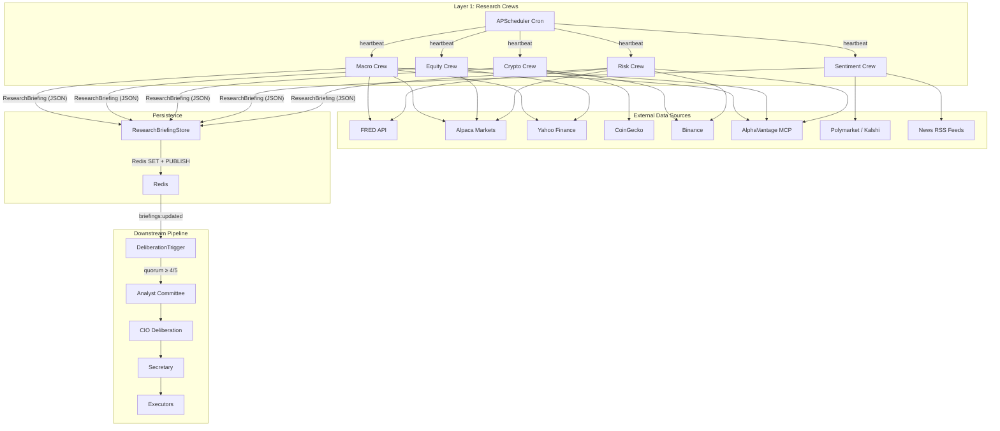

# Autonomous Research Agent

> A multi-agent deliberation system for autonomous financial data collection,
> analysis, and algorithmic trading decisions.

---

## Table of Contents

- [Architecture Overview](#architecture-overview)
- [System Layers](#system-layers)
- [Research Crews](#research-crews)
  - [Crew Schedule](#crew-schedule)
  - [Tool Inventory per Crew](#tool-inventory-per-crew)
  - [MCP Servers](#mcp-servers)
- [Core Components](#core-components)
  - [FinanceResearchService](#financeresearchservice)
  - [ResearchBriefingStore](#researchbriefingstore)
  - [DeliberationTrigger](#deliberationtrigger)
- [Configuration](#configuration)
  - [Environment Variables](#environment-variables)
  - [Redis](#redis)
- [Starting the System](#starting-the-system)
  - [Quick Start](#quick-start)
  - [Programmatic Startup](#programmatic-startup)
  - [Production Startup](#production-startup)
- [Data Flow](#data-flow)
- [Extending the System](#extending-the-system)

---

## Architecture Overview

The system is organised as a **six-layer agent council**.  Each layer feeds
data downstream, culminating in trade execution — or, during development,
a mocked log.

```
┌─────────────────────────────────────────────────────────────────────┐
│  Layer 1 │ Research Crews (5 crews, cron-driven data collection)    │
│  Layer 2 │ Analyst Committee (5 specialised analysts)              │
│  Layer 3 │ CIO Deliberation (multi-round contradiction detection)  │
│  Layer 4 │ Secretary (Investment Memo synthesis)                   │
│  Layer 5 │ Executors (Alpaca · Binance · Kraken)                   │
│  Layer 6 │ Monitoring (Portfolio Manager + Performance Tracker)     │
└─────────────────────────────────────────────────────────────────────┘
```

The **Autonomous Research Agent** focuses on **Layer 1** — five autonomous
research crews that collect market data on cron schedules, persist
structured briefings to Redis, and trigger downstream deliberation when
a quorum of fresh data is available.


## System Layers

| Layer | Agents | Responsibility |
|-------|--------|----------------|
| **1 — Research** | 5 crews | Cron-driven data collection via domain tools |
| **2 — Analysis** | 5 analysts | Interpret briefings, produce `AnalystReport` |
| **3 — CIO** | 1 CIO | Multi-round deliberation, contradiction detection |
| **4 — Secretary** | 1 secretary | Synthesise `InvestmentMemo` from CIO output |
| **5 — Execution** | 3–4 executors | Platform-specific order placement (Alpaca, Binance, Kraken) |
| **6 — Monitoring** | 2 agents | Portfolio tracking, performance attribution |

All 18 agents are created via `create_all_agents()` in
`parrot.finance.agents`.


## Research Crews

Each crew is an `Agent` instance with a dedicated system prompt,
an LLM model recommendation, and a set of domain-specific tools.

| Crew ID | Domain | Description |
|---------|--------|-------------|
| `research_crew_macro` | Macroeconomics | Fed rates, Treasury yields, CPI, PCE, unemployment, VIX, DXY, M2 |
| `research_crew_equity` | Equities & ETFs | SPY, QQQ, sector ETFs, earnings calendar, price movements |
| `research_crew_crypto` | Cryptocurrency | BTC/ETH/SOL prices, funding rates, DeFi TVL, on-chain data |
| `research_crew_sentiment` | Sentiment & Flow | Fear & Greed indices, news sentiment, prediction markets |
| `research_crew_risk` | Risk Metrics | VIX, yield curve, stress indices, cross-asset correlations |


### Crew Schedule

Schedules are defined in `DEFAULT_HEARTBEATS` as APScheduler cron
expressions:

| Crew | Cron Expression | Human-readable |
|------|----------------|----------------|
| Macro | `0 6,12,18 * * *` | 3x daily at 06:00, 12:00, 18:00 UTC |
| Equity | `0 7,13 * * 1-5` | 2x daily at 07:00, 13:00 UTC (weekdays only) |
| Crypto | `0 */4 * * *` | Every 4 hours |
| Sentiment | `0 */6 * * *` | Every 6 hours |
| Risk | `0 8,14,20 * * *` | 3x daily at 08:00, 14:00, 20:00 UTC |


### Tool Inventory per Crew

Each crew is equipped with domain-specific toolkits, registered lazily
at startup via `configure_research_tools()`.

#### Macro Crew

| Tool | Source | Data |
|------|--------|------|
| `FredAPITool` | FRED API | Fed Funds, 10Y/2Y Treasury, CPI, PCE, employment, VIX, DXY, M2 |
| `AlpacaMarketsToolkit` | Alpaca | Index quotes, daily bars |
| `YFinanceTool` | Yahoo Finance | Macro ETF data, yield curves |
| `MarketWatchRSSTool` | MarketWatch | Macro headlines |
| `PredictionMarketToolkit` | Polymarket / Kalshi | Event probabilities |
| **AlphaVantage MCP** | AlphaVantage | Economic indicators, forex, commodities |

#### Equity Crew

| Tool | Source | Data |
|------|--------|------|
| `AlpacaMarketsToolkit` | Alpaca | Quotes, bars, market data |
| `TechnicalAnalysisTool` | Internal | RSI, MACD, Bollinger Bands |
| `YFinanceTool` | Yahoo Finance | Financials, earnings, options |
| `MarketWatchRSSTool` | MarketWatch | Equity news |
| **AlphaVantage MCP** | AlphaVantage | Fundamentals, earnings, technicals |

#### Crypto Crew

| Tool | Source | Data |
|------|--------|------|
| `CoingeckoToolkit` | CoinGecko | Prices, market cap, volumes |
| `BinanceToolkit` | Binance | Order books, funding rates |
| `DefiLlamaToolkit` | DeFiLlama | TVL, protocol data |
| `CryptoQuantToolkit` | CryptoQuant | On-chain metrics |
| `CoinTelegraphTool` | CoinTelegraph | Crypto news + summaries |
| `CoindeskTool` | Coindesk | Crypto news |
| `RSSCryptoTool` | RSS feeds | Aggregated crypto news |

#### Sentiment Crew

| Tool | Source | Data |
|------|--------|------|
| `CNNFearGreedTool` | CNN | Traditional market Fear & Greed |
| `FearGreedTool` | alternative.me | Crypto Fear & Greed |
| `CMCFearGreedTool` | CoinMarketCap | CMC Fear & Greed |
| `MarketauxToolkit` | Marketaux | News sentiment scores |
| `MarketWatchRSSTool` | MarketWatch | Flow narrative |
| `YFinanceTool` | Yahoo Finance | Options put/call ratio |
| `PredictionMarketToolkit` | Polymarket / Kalshi | Crowd wisdom signal |

#### Risk Crew

| Tool | Source | Data |
|------|--------|------|
| `FredAPITool` | FRED API | VIX, yield curve, financial stress |
| `AlpacaMarketsToolkit` | Alpaca | Equity prices for correlation |
| `BinanceToolkit` | Binance | Crypto prices for correlation |
| `YFinanceTool` | Yahoo Finance | Cross-asset correlation data |
| **AlphaVantage MCP** | AlphaVantage | Cross-asset data, volatility |


### MCP Servers

Remote Model Context Protocol servers are registered asynchronously
after local tools.  The currently integrated MCP server:

| MCP Server | Crews | Transport | URL |
|------------|-------|-----------|-----|
| AlphaVantage | macro, equity, risk | SSE | `https://mcp.alphavantage.co/mcp?apikey=...` |

The `AlphaVantageFunctions` enum is automatically injected into the
tool schema via `_patch_alphavantage_tools()` in `parrot.mcp.integration`.

Additional MCP servers can be added to the `mcp_map` in
`configure_research_tools()` following the same pattern.


## Core Components

### FinanceResearchService

**Module:** `parrot.finance.research.service`

An `AgentService` subclass that:

1. Registers all 5 research crews with the `BotManager`.
2. Configures per-crew tools via `configure_research_tools()`.
3. Runs cron-scheduled heartbeats that invoke `agent.ask(prompt)`.
4. Pipes LLM output through `ResearchOutputParser` into the
   `ResearchBriefingStore`.

```python
from parrot.finance.research import FinanceResearchService

service = FinanceResearchService(
    bot_manager=bot_manager,
    redis_url="redis://localhost:6379",
)
await service.start()
```

### ResearchBriefingStore

**Module:** `parrot.finance.research.briefing_store`

Redis-backed persistence for `ResearchBriefing` dataclasses:

- **SET** operations store the latest briefing per crew with a TTL.
- **PUBLISH** on the `briefings:updated` channel notifies downstream
  consumers (primarily the `DeliberationTrigger`).
- Freshness checks report which crew briefings are within their
  staleness window.

### DeliberationTrigger

**Module:** `parrot.finance.research.trigger`

Monitors briefing freshness and auto-fires the full deliberation →
execution pipeline when conditions are met.

| Mode | Behaviour |
|------|-----------|
| `quorum` (default) | Triggers when ≥ 4 of 5 crews have fresh data |
| `all_fresh` | Triggers only when all 5 crews are fresh |
| `scheduled` | Triggers on a fixed cron schedule |
| `manual` | Only triggers via `force_trigger()` |

**Staleness windows** (default):

| Crew | Window |
|------|--------|
| Macro | 12 hours |
| Equity | 8 hours |
| Crypto | 6 hours |
| Sentiment | 8 hours |
| Risk | 8 hours |

**Safety features:**

- Redis distributed lock prevents concurrent cycles in multi-process.
- Debounce interval (default: 2 hours) prevents rapid re-triggering.
- Dry-run mode logs what would happen without executing.

```python
trigger = DeliberationTrigger(
    briefing_store=service.briefing_store,
    redis=redis_client,
    mode="quorum",
    quorum_threshold=4,
    dry_run=True,  # safe for development
)
await trigger.start()
```


## Configuration

### Environment Variables

The following keys must be set in `env/.env` or your environment:

| Variable | Required | Description |
|----------|----------|-------------|
| `REDIS_URL` | Yes | Redis connection string (default: `redis://localhost:6379`) |
| `ALPHAVANTAGE_API_KEY` | Yes | AlphaVantage API key for MCP server |
| `ALPACA_API_KEY` | Yes | Alpaca Markets API key |
| `ALPACA_SECRET_KEY` | Yes | Alpaca Markets secret key |
| `FRED_API_KEY` | Yes | FRED (Federal Reserve) API key |
| `COINMARKETCAP_API_KEY` | Recommended | CoinMarketCap API key |
| `ETHERSCAN_API_KEY` | Optional | Etherscan API key |
| `MARKETAUX_API_KEY` | Optional | Marketaux news sentiment API key |
| `BINANCE_API_KEY` | Optional | Binance API key (read-only) |
| `BINANCE_API_SECRET` | Optional | Binance API secret |
| `POLYMARKET_CLOB_URL` | No | URL override only — public API, no key needed (default: `https://clob.polymarket.com`) |
| `KALSHI_API_URL` | No | URL override only — public API, no key needed (default: `https://api.elections.kalshi.com/trade-api/v2`) |

### Redis

Redis is used for:

1. **Briefing storage** — persisted `ResearchBriefing` JSON with TTL.
2. **Pub/sub** — `briefings:updated` channel for trigger notifications.
3. **Distributed lock** — prevents concurrent deliberation cycles.
4. **Cycle history** — stores `CycleResult` records for monitoring.

Ensure Redis ≥ 6.0 is running and accessible at `REDIS_URL`.


## Starting the System

### Quick Start

The fastest way to run the system with mocked execution (no real trades):

```bash
# 1. Activate the virtual environment
source .venv/bin/activate

# 2. Ensure Redis is running
redis-cli ping  # should return PONG

# 3. Set required environment variables (or ensure they're in env/.env)
export REDIS_URL=redis://localhost:6379

# 4. Start the system
python -m parrot.finance.main
```

This starts:
1. **BotManager** with all 18 finance agents registered.
2. **FinanceResearchService** with cron-scheduled heartbeats.
3. **ResearchBriefingStore** connected to Redis.
4. **DeliberationTrigger** in `quorum` mode with a **mocked** pipeline.

The system runs until `Ctrl-C` (SIGINT) or SIGTERM.

### Programmatic Startup

For integration into a larger application:

```python
import asyncio
from parrot.finance.main import boot_trading_system

asyncio.run(boot_trading_system(
    redis_url="redis://my-redis:6379",
    mode="quorum",
))
```

Or for more control over individual components:

```python
from parrot.manager import BotManager
from parrot.finance.agents import create_all_agents
from parrot.finance.research import (
    FinanceResearchService,
    ResearchBriefingStore,
    DeliberationTrigger,
    configure_research_tools,
)

# 1. Create and register agents
bot_manager = BotManager()
agents = create_all_agents()
for agent_id, agent in agents.items():
    bot_manager.register(agent_id, agent)

# 2. Attach domain-specific tools to each research crew
tool_counts = await configure_research_tools(bot_manager)
# → {'research_crew_macro': 8, 'research_crew_equity': 7, ...}

# 3. Start the research service
service = FinanceResearchService(
    bot_manager=bot_manager,
    redis_url="redis://localhost:6379",
)
await service.start()

# 4. Configure and start the deliberation trigger
trigger = DeliberationTrigger(
    briefing_store=service.briefing_store,
    redis=service._redis,
    mode="quorum",          # or "all_fresh", "scheduled", "manual"
    quorum_threshold=4,     # number of fresh crews needed
    dry_run=False,          # set True for safe development mode
)
await trigger.start()

# 5. Force a cycle manually (bypasses quorum/debounce)
result = await trigger.force_trigger()

# 6. Shutdown
await trigger.stop()
await service.stop()
```

### Production Startup

> [!WARNING]
> The default entrypoint (`main.py`) uses a **mocked execution layer**
> that only logs — no real trades are placed.  To enable real execution,
> replace `_mock_pipeline_factory` with `_default_pipeline_factory` from
> `parrot.finance.research.trigger`.

```python
# Production: wire the real pipeline
from parrot.finance.research.trigger import _default_pipeline_factory

trigger = DeliberationTrigger(
    briefing_store=briefing_store,
    redis=redis_client,
    mode="quorum",
    pipeline_factory=_default_pipeline_factory,
    dry_run=False,
)
```


## Data Flow




## Extending the System

### Adding a New Tool to a Crew

1. Create a lazy factory in `parrot/finance/research/service.py`:

```python
def _make_my_tool():
    from parrot.tools.my_tool import MyTool
    return MyTool()
```

2. Add it to the appropriate crew in the `tool_map`:

```python
"research_crew_macro": [
    # ... existing tools ...
    (_make_my_tool, "My Tool (description)"),
],
```

### Adding a New MCP Server

1. Create a config factory:

```python
def _my_mcp_config():
    from parrot.mcp.integration import create_http_mcp_server
    return create_http_mcp_server(
        name="my-server",
        url="https://mcp.example.com/sse",
    )
```

2. Add it to the `mcp_map` in `configure_research_tools()`:

```python
mcp_map = {
    "research_crew_equity": [
        (_my_mcp_config, "My MCP Server (description)"),
    ],
}
```

### Adding a New Research Crew

1. Create the agent factory in `parrot/finance/agents/research.py`.
2. Add a system prompt in `parrot/finance/prompts.py`.
3. Add a heartbeat config in `DEFAULT_HEARTBEATS`.
4. Add a crew prompt in `CREW_PROMPTS`.
5. Map tools in `configure_research_tools()`.
6. Register the crew in `create_all_agents()`.

---

**Module Reference:**

| Module | Description |
|--------|-------------|
| `parrot.finance` | Top-level package with public API |
| `parrot.finance.agents` | Agent factory functions (18 agents) |
| `parrot.finance.research.service` | `FinanceResearchService` + tool registration |
| `parrot.finance.research.briefing_store` | Redis-backed briefing persistence |
| `parrot.finance.research.trigger` | `DeliberationTrigger` + cycle management |
| `parrot.finance.main` | CLI entrypoint (`boot_trading_system`) |
| `parrot.finance.swarm` | `CommitteeDeliberation` + `run_full_cycle` |
| `parrot.finance.execution` | `ExecutionOrchestrator` + `OrderQueue` |
| `parrot.finance.guards` | Anti-hallucination `DeterministicGuard` |
| `parrot.finance.fsm` | Order and pipeline state machines |
| `parrot.finance.schemas` | All Pydantic models and enums |
| `parrot.mcp.integration` | MCP server factories (AlphaVantage, etc.) |
