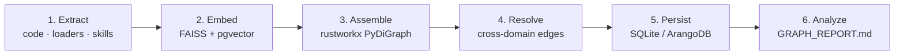

# GraphIndex — Structured Knowledge Graph Indexing

GraphIndex turns code, documents and skills into a **single typed knowledge
graph** that agents can search, traverse, explain and *write back to*. Where
[PageIndex](pageindex.md) gives one document a hierarchical tree, GraphIndex
spans **many sources at once** and links them with typed edges — including
edges it *infers* across domains (a design doc that explains a class, a skill
that references a module).

> [!TIP]
> The code pass is **deterministic and LLM-free**: tree-sitter parses the
> files, `rustworkx` assembles the graph in-process, Louvain/Leiden finds
> communities and centrality identifies "god nodes". No API keys, no
> database and no embedding model are required for `parrot-graphindex`.

---

## Table of Contents

- [Quick Start](#quick-start)
- [The Six-Stage Pipeline](#the-six-stage-pipeline)
- [Graph Schema](#graph-schema)
- [Building Programmatically](#building-programmatically)
- [Incremental Ingest](#incremental-ingest)
- [Persistence Backends](#persistence-backends)
- [Temporal API (Postgres only)](#temporal-api-postgres-only)
- [Hybrid Retrieval (Postgres only)](#hybrid-retrieval-postgres-only)
- [Analytics and the Graph Report](#analytics-and-the-graph-report)
- [The Agent Toolkit](#the-agent-toolkit)
- [Persistent Graph Memory](#persistent-graph-memory)
- [GraphIndexLoader](#graphindexloader)
- [How GraphIndex Relates to PageIndex and the LLM Wiki](#how-graphindex-relates-to-pageindex-and-the-llm-wiki)
- [Installation](#installation)

---

## Quick Start

The fastest way to see a graph is the standalone CLI, which covers the local
code path only:

```bash
# Index the current repository into ./graphindex/
parrot-graphindex .

# Choose an output directory and a nicer title
parrot-graphindex ./src -o ./graphindex --title "My Service"

# Tighter communities, skip detection entirely, or use an ignore file
parrot-graphindex . --resolution 1.4
parrot-graphindex . --no-communities
parrot-graphindex . --ignore-file .graphindexignore

# Equivalent module invocation
python -m parrot.knowledge.graphindex .
```

Three artefacts land in the output directory:

| Artefact | What it is |
|---|---|
| `graph.html` | Interactive force-directed map — communities as colours, god nodes highlighted. Renders offline. |
| `graph.json` | The serialized graph, for programmatic reuse. |
| `GRAPH_REPORT.md` | Deterministic report: god nodes, communities, surprising connections, suggested questions. |

CLI flags:

| Flag | Meaning |
|---|---|
| `-o`, `--output` | Output directory (default `<path>/graphindex`). |
| `--tenant` | Tenant id used to namespace node ids (default `default`). |
| `--no-communities` | Skip community detection; nodes render uncoloured. |
| `--resolution` | Louvain resolution γ — above `1.0` finds smaller, tighter communities. |
| `--ignore-file` | Path to a `.graphindexignore` (gitignore syntax). |
| `--title` | Graph title for the HTML page header. |
| `--no-cdn-fallback` | Fail rather than referencing the ECharts CDN when the offline asset is missing. |
| `-v`, `--verbose` | Debug logging. |

The heavier semantic pass over documents, PDFs and media — which *does* use a
model — lives in the full `GraphIndexBuilder` pipeline described below.

---

## The Six-Stage Pipeline

`GraphIndexBuilder` wires six stages into a single `build()` call:



1. **Extract** — `CodeExtractor` (tree-sitter), `LoaderExtractor`
   (ai-parrot loaders, for PDFs/DOCX/web/transcripts) and `SkillExtractor`
   (`SKILL.md` definitions) run concurrently and emit `UniversalNode` /
   `UniversalEdge`.
2. **Embed** — batch embedding via the configured embedding model into a
   FAISS index (hot) and pgvector (persistent).
3. **Assemble** — `GraphAssembler` builds a `rustworkx` `PyDiGraph` in-process
   from the node and edge streams.
4. **Resolve** — `resolve_cross_domain()` infers edges between domains by
   cosine similarity; every edge it creates is stamped
   `provenance=INFERRED` so inference is never mistaken for extraction.
5. **Persist** — through `GraphIndexPersistence` (ArangoDB + pgvector) or
   `SQLitePersistence` (single-file, local-first).
6. **Analyze** — centrality, communities, surprising connections and the
   generated `GRAPH_REPORT.md`.

---

## Graph Schema

Every node and edge is a Pydantic model from
`parrot.knowledge.graphindex.schema`.

### Node kinds

| `NodeKind` | Meaning |
|---|---|
| `DOCUMENT` | Top-level document (PDF, DOCX, web page, transcript…). |
| `SECTION` | Hierarchical section within a document (a PageIndex path). |
| `SYMBOL` | Code element — module, class, function, variable. |
| `CONCEPT` | Abstract concept extracted from content. |
| `RATIONALE` | Design rationale from a docstring or tagged comment. |
| `SKILL` | Skill definition parsed from a `SKILL.md`. |
| `WIKI_PAGE` | LLM-generated wiki page (see [LLM Wiki](llm-wiki.md)). |
| `RUN` | An agent/crew execution — work lineage. |
| `CLAIM` | A discrete assertion produced by a run. |

### Edge kinds

| `EdgeKind` | Meaning |
|---|---|
| `CONTAINS` | Parent–child containment (document→section, class→method). |
| `REFERENCES` | One node cites or imports another. |
| `DEFINES` | A module or document provides the authoritative definition. |
| `MENTIONS` | Cross-domain **inferred** link. |
| `EXPLAINS` | A rationale or docstring explains a symbol. |
| `EXTENDS` | Odoo model inheritance via `_inherit` / `_inherits`. |
| `PRODUCED` | A run produced a claim or node. |
| `ABOUT` | A claim is about an entity. |
| `SUPPORTED_BY` | A claim is supported by a source or page. |
| `CONTRADICTS` | Two claims or entities conflict. |

!!! note "Contradictions are surfaced, never hidden"
    `CONTRADICTS` edges are deliberately promoted by the context builder and
    the grounding evaluator. A knowledge graph that quietly drops conflicting
    claims is worse than one that shows both.

### Provenance

Every node and edge carries a `Provenance` value, so a consumer can always
tell how a fact got there:

| `Provenance` | How it was created |
|---|---|
| `EXTRACTED` | Read directly out of source material. |
| `INFERRED` | Derived from embedding similarity during cross-domain resolution. |
| `AMBIGUOUS` | Extraction was attempted but the result is uncertain (dynamic code features, malformed input). |
| `ASSERTED` | Authored by an agent or a human; attribution lives in `AssertionMeta`. |

---

## Building Programmatically

`SourceConfig` describes *what* to index; `TenantContext` describes *for whom*.

```python
from pathlib import Path

from parrot.knowledge.graphindex.builder import GraphIndexBuilder
from parrot.knowledge.graphindex.schema import SourceConfig

sources = SourceConfig(
    code_paths=["packages/ai-parrot/src/parrot"],
    loader_sources=["docs/architecture/09-ontologic-rag.md"],
    skill_paths=[".agent/skills"],
    ignore_file=".graphindexignore",
    tenant_id="acme",
)

builder = GraphIndexBuilder(
    persistence=persistence,           # GraphIndexPersistence or SQLitePersistence
    embedder=embedder,                 # GraphIndexEmbedder
    output_dir=Path("./graphindex"),
    detect_communities_enabled=True,
    community_algorithm="leiden",      # or "louvain"
    export_html_enabled=True,
)

result = await builder.build(sources, ctx)
print(result.node_count, result.edge_count, result.inferred_edge_count)
print(result.report_path, result.graph_html_path, result.graph_json_path)
```

`build()` returns a `BuildResult`:

| Field | Meaning |
|---|---|
| `tenant_id` | Tenant that was indexed. |
| `node_count` / `edge_count` | Totals persisted. |
| `inferred_edge_count` | Subset with `provenance=INFERRED`. |
| `report_path` | Generated `GRAPH_REPORT.md`, if any. |
| `graph_html_path` / `graph_json_path` | HTML/JSON export paths when export ran. |
| `projection_report` | OKF sidecar projection summary, when projection ran. |
| `errors` | Non-fatal errors collected during the run. |

Notable `GraphIndexBuilder` options:

- **`pageindex_toolkit`** — when set, hierarchical loader sources are also
  persisted as PageIndex trees, and each `SECTION` node carries a
  `content_ref` resolving to its body. The tree name is exposed on the
  `DOCUMENT` node as `domain_tags['pageindex_tree_id']`.
- **`resolution_config`** — the similarity threshold and edge caps used by
  cross-domain resolution.
- **`ignore_file`** — a `.graphindexignore` in gitignore syntax.

---

## Incremental Ingest

A full reindex is rarely what you want after editing one file.
`ingest_document()` reprocesses a single URI and atomically replaces that
document's slice of the graph:

```python
ingest = await builder.ingest_document("docs/architecture/09-ontologic-rag.md", ctx)
print(ingest.nodes_replaced, ingest.edges_replaced)

# Reports are regenerated lazily, on demand
report_path = await builder.regenerate_report(ctx)
```

The SQLite backend tracks `mtime`/`sha1` per file in a `files` table, so
`is_stale()` lets callers skip untouched sources.

---

## Persistence Backends

| Backend | Class | Bitemporal | Hybrid retrieval | Use it when |
|---|---|---|---|---|
| **SQLite** | `SQLitePersistence` | No (`t = now()` only) | No | Local-first, single file per tenant. WAL journal mode, FTS5/BM25 lexical search over nodes, incremental staleness tracking. This is what agent graph memory uses. |
| **ArangoDB + pgvector** | `GraphIndexPersistence` | No (`t = now()` only) | No | Multi-tenant server deployments where the graph is shared, and embeddings live in pgvector. |
| **Postgres** (FEAT-520) | `PostgresPersistence` | **Yes** — engine-enforced (`tstzrange` + `EXCLUDE`) | **Yes** — `hybrid_retrieve` | One shared `graphindex.*` schema serving BOTH the graph plane (`PostgresPersistence`) and the wiki retrieval plane (`PostgresWikiStore`, see [LLM Wiki](llm-wiki.md)). The only backend with temporal queries and one-pass hybrid retrieval. |

All three expose the same core surface — `persist_graph()`,
`replace_document_slice()`, `is_stale()`, `load_graph()` — so the builder is
agnostic to which one it was handed (duck-typed, never `isinstance`). The
Postgres backend ADDITIONALLY exposes `as_of()`/`history()`/`diff()`
(temporal) and `hybrid_retrieve()` (one-pass graph+KNN+FTS) — callers
feature-detect these via `hasattr()`; SQLite and ArangoDB do not grow them.

### Audited writes

Agent writes do not go straight to the backend. `GraphPublisher` takes a
validated `GraphUpdate` (nodes + edges + attribution), stamps `AssertionMeta`
onto anything unattributed, and applies the batch as **one audited,
revertible commit**, returning a `CommitReceipt`. That is what makes
`graph_history()` and `revert_write()` possible. On the Postgres backend the
pre-image capture, the commit row, and every mutation happen inside ONE
database transaction — a mid-apply crash rolls back everything, including
the audit trail itself.

---

## Temporal API (Postgres only)

`PostgresPersistence` is bitemporal from the schema up: `node_versions.
validity` is a `tstzrange` protected by a GiST `EXCLUDE` constraint, so the
database itself rejects two overlapping versions of the same concept — the
invariant is enforced by the engine, not by ingest discipline. Corrections
close the current version's range and insert a new row; content is never
`UPDATE`d.

```python
from datetime import datetime, timezone

# Snapshot the graph as it existed at a point in time
nodes, edges = await persistence.as_of(ctx, datetime(2026, 6, 1, tzinfo=timezone.utc))

# Every version of one concept, oldest first
versions = await persistence.history(ctx, concept_id="acme:widget")

# Structured diff — version changes + incident-edge deltas, never raw text
diff = await persistence.diff(ctx, "acme:widget", t1, t2)
print(diff.version_changes, diff.edges_added, diff.edges_removed)
```

`as_of`/`history`/`diff` all reject naive `datetime` inputs (`ValueError`) —
every temporal parameter is `timestamptz`. `SQLitePersistence` and
`GraphIndexPersistence` do NOT grow these methods; callers feature-detect
via `hasattr(persistence, "as_of")` rather than an `isinstance` check.

---

## Hybrid Retrieval (Postgres only)

`hybrid_retrieve` runs three optional legs — temporal graph expansion (from
seed `concept_id`s), pgvector KNN, and `ts_rank_cd` full-text search — as
CTEs of **one SQL statement** against the same `as_of` snapshot, fused with
Reciprocal Rank Fusion (`Σ w_leg/(60+rank_leg)`) in SQL. Cross-encoder
re-ranking then runs in Python through the existing `parrot.rerankers` seam.

```python
candidates = await persistence.hybrid_retrieve(
    ctx,
    seeds=["acme:widget"],           # graph leg
    query_embedding=query_vec,        # KNN leg
    fts_terms="widget pricing",       # FTS leg
    limit=20,
    reranker=my_reranker,             # optional
)
for c in candidates:
    print(c.concept_id, c.score, c.signals, c.evidence)
```

At least one of `seeds` / `query_embedding` / `fts_terms` is required
(`ValueError` otherwise). `HybridCandidate.signals` exposes each leg's
per-candidate contribution for debuggability; `HybridCandidate.evidence`
carries `(body_ref, byte_offset)` pairs from the graph edges that connected
the candidate into the seed hood. The method is named `hybrid_retrieve`,
**not** `hybrid_search` — that name is reserved by `PgVectorStore.
hybrid_search` (`ai-parrot-embeddings`, SQLAlchemy-based, dense+ColBERT),
which this backend does not use or import from (`parrot.stores.postgres`
is out of scope for FEAT-520 — asyncpg is the only driver, zero SQLAlchemy).

---

## Analytics and the Graph Report

`compute_analytics()` produces an `AnalyticsResult`, and `generate_report()`
renders it to `GRAPH_REPORT.md`. Beyond centrality it computes deliberate
*gap* signals:

- **God nodes** — highest-centrality nodes; the things everything depends on.
- **Communities** — Louvain or Leiden clusters, with derived labels and a
  cohesion score.
- **Surprising connections** — ranked cross-community links that a reader
  would not have predicted.
- **Knowledge gaps** — `find_isolated_nodes()`, `find_sparse_communities()`,
  `find_bridge_nodes()`.
- **Suggested questions** — generated prompts worth asking of this corpus.

Insights can be triaged: `dismiss_insight()` marks one reviewed, and
`list_unreviewed_insights()` returns what is still outstanding.

---

## The Agent Toolkit

`GraphIndexToolkit` (from the `ai-parrot-tools` distribution,
`parrot_tools.graphindex.toolkit`) exposes the graph to an agent as tools.
Read tools are always available; write tools are wired when a publisher is
attached.

**Search and navigation**

| Tool | Purpose |
|---|---|
| `find_node(query)` | Locate a node by name or description. |
| `search_hybrid(query, top_k)` | Lexical + vector search over nodes. |
| `search_with_expansion(...)` | Seed search, then expand along edges within a budget. |
| `find_references(node_id)` | Who points at this node. |
| `get_neighborhood(node_id, depth)` | The subgraph around a node. |
| `traverse(...)` / `shortest_path(from_id, to_id)` | Follow typed edges explicitly. |
| `explain(node_id)` | Natural-language explanation of a node in context. |

**Structure and analytics**

| Tool | Purpose |
|---|---|
| `find_central_nodes(...)` | God nodes by centrality. |
| `list_communities(min_size)` / `find_community(node_id)` | Cluster structure. |
| `relevance(node_a, node_b)` / `neighborhood_by_relevance(...)` | Signal-based relevance rather than raw hops. |
| `find_isolated_nodes(...)`, `find_sparse_communities(...)`, `find_bridge_nodes(...)` | Knowledge-gap discovery. |
| `export_graph_html(...)` | Render the interactive map. |

**Writing knowledge back**

| Tool | Purpose |
|---|---|
| `create_node(...)` / `create_concept(...)` | File new knowledge. |
| `link_nodes(...)` / `unlink_nodes(...)` | Assert or retract typed edges. |
| `attach_summary(node_id, summary)` / `tag_node(node_id, key, value)` | Enrich an existing node. |
| `merge_nodes(...)` | Collapse duplicates. |
| `extract_knowledge(text, source_uri)` | Turn free text into nodes and edges. |
| `ground_claim(claim)` | Check a claim against the graph, surfacing contradictions. |
| `graph_history(...)` / `revert_write(commit_id)` | Audit and undo. |

**Temporal & hybrid (Postgres-backed durable plane only, FEAT-520)**

These four tools are excluded from tool generation entirely — not merely
error-returning — unless the toolkit's `publisher.persistence` exposes the
temporal surface (`hasattr(persistence, "as_of")`, duck-typed per spec D5).
Building the toolkit with `build_graph_memory_toolkit(backend="postgres",
...)` (see [Persistent Graph Memory](#persistent-graph-memory)) unlocks them.

| Tool | Purpose |
|---|---|
| `graph_as_of(timestamp)` | Snapshot the graph as it existed at a point in time. |
| `graph_concept_history(concept_id)` | Every version of ONE concept over time — distinct from `graph_history` above (durable WRITE-commit log, not per-concept version history). |
| `graph_diff(concept_id, t1, t2)` | Structured version + incident-edge diff between two points in time. |
| `graph_hybrid_retrieve(query, seeds)` | One-pass graph+FTS retrieval. Fusion weights and result limits are FIXED operator configuration — never exposed as tool parameters, so the agent picks WHAT to search for, never HOW (brainstorm D6). |

---

## Persistent Graph Memory

The write path is productized so an agent can open a durable graph in one
call — *the agent forgets, the graph does not*:

```python
from pathlib import Path
from parrot.knowledge.graphindex import build_graph_memory_toolkit

toolkit = await build_graph_memory_toolkit(
    db_dir=Path("~/.parrot/agents/my-agent/graph_memory"),
    agent_id="my-agent",
    tenant_id="default",
)
```

It loads the SQLite plane, assembles the in-memory `rustworkx` graph, embeds
the loaded nodes (the offline `HashingGraphEmbedder` by default, so no model
is needed) and wires a `GraphPublisher` so every write persists as an audited
commit.

Pass `backend="postgres"` for the FEAT-520 bitemporal, shared-schema plane
instead (unlocks the toolkit's temporal/hybrid tools, above):

```python
toolkit = await build_graph_memory_toolkit(
    tenant_id="default",
    agent_id="my-agent",
    backend="postgres",
    dsn="postgres://...",       # defaults to GRAPHINDEX_PG_DSN / default_dsn
    schema="graphindex",
)
```

`db_dir` is only required (and only used) for `backend="sqlite"` — the
Postgres backend has no per-tenant directory; its shared schema is not
tenant-partitioned in v1.

### Config keys (Postgres backend)

| Key | Purpose | Default |
|---|---|---|
| `GRAPHINDEX_PG_DSN` | asyncpg DSN. Also gates live tests. | `parrot.conf.default_dsn` |
| `GRAPHINDEX_PG_SCHEMA` | Schema name. | `graphindex` |
| `GRAPHINDEX_EMBEDDING_DIM` | pgvector column dimension. | `1536` |
| `GRAPHINDEX_FTS_REGCONFIG` | Namespace-prefix → Postgres FTS regconfig map (declarative, never hardcoded in SQL). | `{"legal:": "spanish", "sym:": "simple"}` |
| `GRAPHINDEX_ANN_INDEX_KIND` | `"hnsw"` or `"ivfflat"` — see `artifacts/logs/feat-520-oq3-spike.md` for the measured tradeoff. | `ivfflat` |

For bots, `GraphMemoryMixin` does the same declaratively:

```python
from parrot.knowledge.graphindex import GraphMemoryMixin

class MyAgent(GraphMemoryMixin, BasicAgent):
    enable_graph_memory = True

    async def configure(self, *args, **kwargs):
        await super().configure(*args, **kwargs)
        await self._configure_graph_memory()
```

The plane defaults to `AGENTS_DIR/{agent_id}/graph_memory` — the same
convention as `kb/`, `skills/` and `episodic_data` — and is overridable via
`graph_memory_path`. Set `graph_memory_inject_context` to have task-relevant
subgraph context injected before each ask.

---

## GraphIndexLoader

`GraphIndexLoader` wraps the full pipeline in the standard `AbstractLoader`
interface, so a graph build can sit inside an ordinary ingestion flow:

```python
from parrot.knowledge.graphindex import GraphIndexLoader

loader = GraphIndexLoader(source=["./src", "./docs"])
documents = await loader.load()   # one Document per graph node

# Native artefacts stay available
loader.nodes, loader.edges, loader.build_result
```

ArangoDB persistence is optional. With credentials (explicit kwargs, an
`arango` dict, or `ARANGODB_*` environment variables) the graph is persisted;
without them an in-process no-op persistence is used — the pipeline still
runs and the assembled graph is exposed in memory, but nothing is written to a
database.

---

## How GraphIndex Relates to PageIndex and the LLM Wiki

These three are layers of the same knowledge story, not competitors:

| Layer | Unit of work | Answers |
|---|---|---|
| **[PageIndex](pageindex.md)** | One document | *Where inside this document is the answer?* — hierarchical, vectorless tree navigation. |
| **GraphIndex** | A whole corpus | *How do these things relate?* — typed nodes and edges across code, docs and skills. |
| **[LLM Wiki](llm-wiki.md)** | A durable page set | *What have we already established?* — agent-authored, cross-linked pages that survive the session. |

The [LLM Wiki](llm-wiki.md) composes all three, and the
[complete guide](guides/llm-wiki-guide.md) walks through building, querying,
federating and wiring it into coding assistants.

---

## Installation

As of FEAT-471, `rustworkx`, `networkx`, `pathspec`, `aiosqlite` and
`orjson` are core `ai-parrot` dependencies — `wikitoolkit` ships in core
(`[project.scripts]`) and imports them unconditionally. That means a
plain core install is already enough for the `wikitoolkit` retrieval
commands (`status`, `query`, `page`, `related`) and the `wikitoolkit` MCP
server:

```bash
pip install ai-parrot
```

`wikitoolkit build`'s *accuracy* features — tree-sitter grammars for
PHP/JS/TS/Rust/Perl and Leiden community detection — still need the
opt-in extras:

```bash
pip install "ai-parrot[graphindex]"
```

That now pulls only `tree-sitter` and `tree-sitter-languages`
(`faiss-cpu`, `rustworkx`, `networkx`, `pathspec`, `aiosqlite`, `orjson`
are all core already).

For the full LLM Wiki stack — GraphIndex extras plus per-language
scanners plus Leiden community detection — install the composite extra:

```bash
pip install "ai-parrot[wiki]"
```

In this uv workspace, use `uv sync --extra wiki` instead — a bare
`uv sync` produces an *exact* environment with no default extras, so it
will **uninstall** the tree-sitter grammars and Leiden packages from your
dev venv if you had them. Retrieval/MCP usage keeps working either way
(those deps are core); re-run `uv sync --extra wiki` when you need
`wikitoolkit build`'s accuracy features back.

---

## See also

- [PageIndex — Tree-Based RAG](pageindex.md)
- [LLM Wiki — an agent-maintained knowledge repository](llm-wiki.md)
- [LLM Wiki — Complete Guide](guides/llm-wiki-guide.md)
- [WikiToolkit as Claude Code infrastructure](wiki-claude-code.md)
- [Architecture — Ontologic RAG](architecture/09-ontologic-rag.md)
- Runnable example: `examples/graphindex/`
