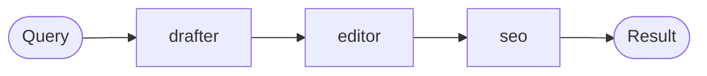
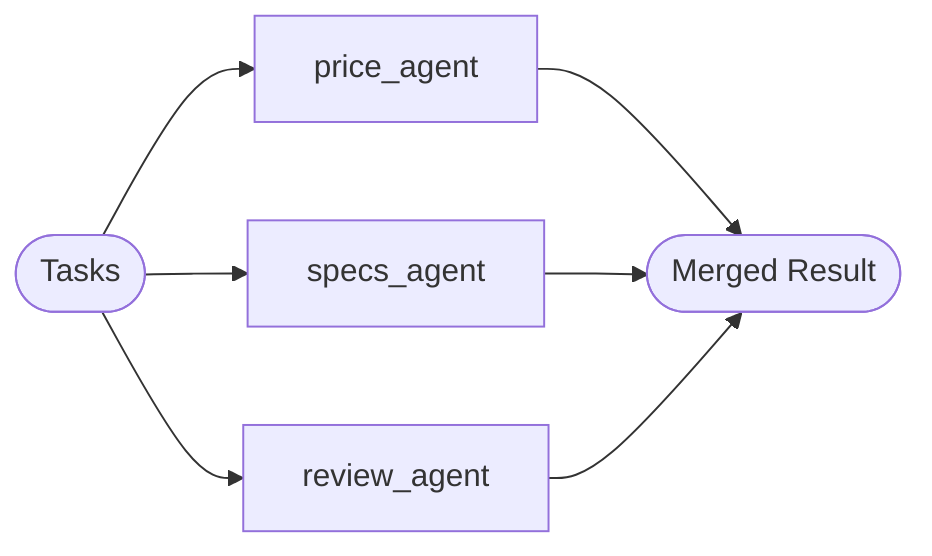
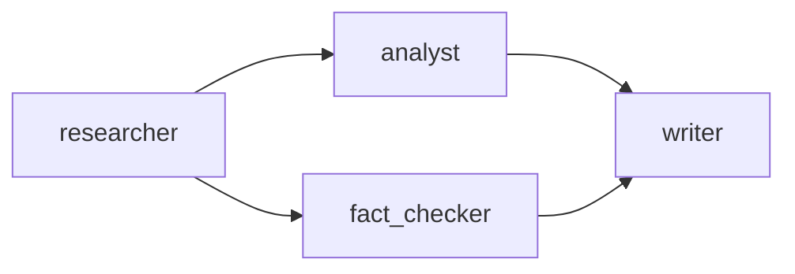

# AgentCrew User Guide

`AgentCrew` is AI-Parrot's multi-agent orchestrator. It lets you form a **crew**
of heterogeneous agents and run them in one of four execution modes —
sequential pipeline, parallel fan-out, DAG flow, or iterative loop — with a
single, consistent API.

For node-level details used by the flow mode, see the
[Node Types Reference](node-types.md).  
For AI-Parrot's lower-level DAG executor with explicit edge control, see the
[AgentsFlow User Guide](agentsflow.md).

---

## What is AgentCrew?

`AgentCrew` coordinates multiple agents toward a shared goal. Each agent in the
crew is a specialist; the crew decides the execution topology:

- **Sequential** — agents run one after another; each sees the previous output.
- **Parallel** — agents run concurrently on independent tasks; results merged.
- **Flow** — agents run as a dependency-declared DAG; automatic wave scheduling.
- **Loop** — agents iterate until a natural-language condition is satisfied.

`AgentCrew` is the right tool when:

- You have a clear pipeline of specialist agents (sequential).
- You want concurrent research from independent agents (parallel).
- You have a complex workflow with branching but do not need custom edge logic (flow).
- You need to refine output iteratively until a quality threshold is met (loop).

For scenarios that require custom conditional routing, per-edge predicates, or
HITL decision gates, use `AgentsFlow` directly instead.

---

## Quick Start

```python
import asyncio
from parrot.bots.flows import AgentCrew
from parrot.bots import Agent
from parrot.clients.openai import OpenAIClient

client = OpenAIClient(model="gpt-4o-mini")

researcher = Agent(
    client=client,
    name="researcher",
    system_prompt="You research topics and produce concise summaries.",
)
writer = Agent(
    client=client,
    name="writer",
    system_prompt="You turn research notes into polished prose.",
)

crew = AgentCrew(agents=[researcher, writer])

result = asyncio.run(crew.run_sequential("Summarize the history of asyncio in Python"))
print(result.output)
```

---

## Creating a Crew

### Constructor

```python
from parrot.bots.flows import AgentCrew

crew = AgentCrew(
    agents=[agent_a, agent_b, agent_c],  # list of Agent / Chatbot instances
    name="MyResearchCrew",               # optional display name
)
```

**Key attributes after construction:**

| Attribute | Description |
|---|---|
| `agents` | Dict mapping `agent_id → agent` |
| `workflow_graph` | Internal DAG used by `run_flow()` |
| `execution_memory` | `ExecutionMemory` instance tracking results |

### Adding Agents Dynamically

```python
crew = AgentCrew()
crew.add_agent(researcher)
crew.add_agent(writer)
```

`add_agent()` uses the agent's `name` attribute as the key. You can also
supply an explicit ID:

```python
crew.add_agent(researcher, agent_id="research-specialist")
```

To remove an agent:

```python
crew.remove_agent("research-specialist")
```

### Sharing Tools Across All Agents

Use `add_shared_tool()` to give every agent in the crew access to a tool:

```python
from parrot.tools import tool

@tool
def get_stock_price(ticker: str) -> str:
    """Return the current price for a stock ticker."""
    # ... implementation ...
    return f"{ticker}: $123.45"

crew.add_shared_tool(get_stock_price)
```

### Building from a Definition

For declarative configuration (e.g., loading a crew from JSON or YAML),
use `from_definition()` with a `CrewDefinition` model:

```python
from parrot.bots.flows import AgentCrew
from parrot.models.crew_definition import CrewDefinition

def agent_factory(agent_config):
    return Agent(client=..., **agent_config)

def tool_factory(tool_name):
    return get_stock_price  # return the tool by name

crew_def = CrewDefinition(
    name="MarketResearchCrew",
    agents=[
        {"id": "researcher", "system_prompt": "Research the topic."},
        {"id": "writer", "system_prompt": "Write a report."},
    ],
    workflow=[["researcher", "writer"]],
)

crew = AgentCrew.from_definition(
    crew_def,
    class_resolver=agent_factory,
    tool_resolver=tool_factory,
)
```

!!! tip
    `CrewDefinition` can also be loaded from a JSON file, making it easy to
    version-control your crew configurations outside of Python code.

---

## Execution Modes

### Sequential Execution (`run_sequential`)

> Agents run in registration order. Each agent receives the output of the
> previous agent as part of its context.

**When to use:** Refine output through specialist stages — draft → edit →
optimize → publish.

**Parameters:**

| Parameter | Type | Default | Description |
|---|---|---|---|
| `query` | `str` | required | The initial prompt / task for the first agent |
| `user_id` | `Optional[str]` | `None` | User identifier for session tracking |
| `pass_full_context` | `bool` | `True` | Each agent sees all previous outputs (not just the last) |

**Example:**

```python
import asyncio
from parrot.bots.flows import AgentCrew
from parrot.bots import Agent
from parrot.clients.openai import OpenAIClient

client = OpenAIClient(model="gpt-4o-mini")

drafter = Agent(client=client, name="drafter",
                system_prompt="Write a first draft on the given topic.")
editor = Agent(client=client, name="editor",
               system_prompt="Edit the draft for grammar and clarity.")
seo = Agent(client=client, name="seo",
            system_prompt="Optimize the content for SEO without altering its meaning.")

crew = AgentCrew(agents=[drafter, editor, seo])

result = asyncio.run(crew.run_sequential(
    query="Write a guide to Python type hints",
    pass_full_context=True,
))
print(result.output)
```

**Pipeline flow:**



---

### Parallel Execution (`run_parallel`)

> Agents run concurrently on independent tasks. All results are merged into
> a single `FlowResult`.

**When to use:** Fan-out research tasks that are independent of each other —
price, specs, and reviews for a product all at once.

**Task format:** Each task is a `dict` with at least `agent_id` and `query`.

| Parameter | Type | Default | Description |
|---|---|---|---|
| `tasks` | `List[Dict[str, Any]]` | required | One task per agent |
| `all_results` | `Optional[bool]` | `True` | Include all agent outputs in the result |

**Example:**

```python
import asyncio
from parrot.bots.flows import AgentCrew
from parrot.bots import Agent
from parrot.clients.openai import OpenAIClient

client = OpenAIClient(model="gpt-4o-mini")

price_agent = Agent(client=client, name="price_agent",
                    system_prompt="Find current prices for the given product.")
specs_agent = Agent(client=client, name="specs_agent",
                    system_prompt="Find technical specs for the given product.")
review_agent = Agent(client=client, name="review_agent",
                     system_prompt="Summarize customer reviews for the given product.")

crew = AgentCrew(agents=[price_agent, specs_agent, review_agent])

tasks = [
    {"agent_id": "price_agent",  "query": "Current price of iPhone 16 Pro"},
    {"agent_id": "specs_agent",  "query": "Technical specs of iPhone 16 Pro"},
    {"agent_id": "review_agent", "query": "Customer reviews of iPhone 16 Pro"},
]

result = asyncio.run(crew.run_parallel(tasks, all_results=True))

for agent_id, agent_result in result.responses.items():
    print(f"\n--- {agent_id} ---")
    print(agent_result)
```

**Fan-out topology:**



---

### Flow Execution (`run_flow`)

> Agents run as a DAG. Dependencies are declared with `task_flow()`. The
> crew automatically parallelizes agents whose dependencies are satisfied.

**When to use:** Complex workflows with explicit data dependencies between agents.

**Building the DAG with `task_flow()`:**

```python
# task_flow(source, [targets]) declares that source must complete before targets
crew.task_flow("researcher", ["analyst", "fact_checker"])
crew.task_flow("analyst",    ["writer"])
crew.task_flow("fact_checker", ["writer"])
```

This produces:



`analyst` and `fact_checker` run in parallel once `researcher` finishes.
`writer` starts only after both complete.

**Parameters:**

| Parameter | Type | Default | Description |
|---|---|---|---|
| `initial_task` | `str` | required | Prompt given to the first agent in the DAG |
| `user_id` | `Optional[str]` | `None` | User identifier |

**Full example:**

```python
import asyncio
from parrot.bots.flows import AgentCrew
from parrot.bots import Agent
from parrot.clients.openai import OpenAIClient

client = OpenAIClient(model="gpt-4o-mini")

researcher   = Agent(client=client, name="researcher",
                     system_prompt="Research the topic and gather raw data.")
analyst      = Agent(client=client, name="analyst",
                     system_prompt="Analyze the research data for trends.")
fact_checker = Agent(client=client, name="fact_checker",
                     system_prompt="Verify factual claims in the research.")
writer       = Agent(client=client, name="writer",
                     system_prompt="Write a final report from the analysis and verified facts.")

crew = AgentCrew(agents=[researcher, analyst, fact_checker, writer])

# Declare the DAG
crew.task_flow("researcher",   ["analyst", "fact_checker"])
crew.task_flow("analyst",      ["writer"])
crew.task_flow("fact_checker", ["writer"])

# Optional: validate before running
assert asyncio.run(crew.validate_workflow()), "Workflow has cycles or missing agents"

result = asyncio.run(crew.run_flow("Analyze the impact of AI on software engineering jobs"))
print(result.output)
```

**Visualization:**

```python
# Print an ASCII representation of the workflow DAG
crew.visualize_workflow()
```

!!! tip
    Call `crew.validate_workflow()` before production runs to catch DAG
    cycles or references to non-existent agents early.

---

### Loop Execution (`run_loop`)

> Agents run iteratively until a natural-language condition is satisfied or
> `max_iterations` is reached.

**When to use:** Iterative refinement tasks where quality is checked against
a condition — e.g., "the code compiles and all tests pass" or "the report
is under 500 words".

**Parameters:**

| Parameter | Type | Default | Description |
|---|---|---|---|
| `initial_task` | `str` | required | Initial prompt for the first iteration |
| `condition` | `str` | required | Natural-language stop condition evaluated after each iteration |
| `max_iterations` | `int` | (crew default) | Maximum number of loop iterations |
| `pass_full_context` | `bool` | `True` | Each iteration includes previous outputs |

**Example:**

```python
import asyncio
from parrot.bots.flows import AgentCrew
from parrot.bots import Agent
from parrot.clients.openai import OpenAIClient

client = OpenAIClient(model="gpt-4o-mini")

coder  = Agent(client=client, name="coder",
               system_prompt="Write or improve Python code to implement the requirement.")
tester = Agent(client=client, name="tester",
               system_prompt="Review the code, identify bugs, and suggest fixes.")

crew = AgentCrew(agents=[coder, tester])

result = asyncio.run(crew.run_loop(
    initial_task="Implement a binary search function in Python",
    condition="The code is correct, has docstrings, and passes edge cases",
    max_iterations=5,
))
print(result.output)
print(f"Converged in {result.metadata.get('iterations', '?')} iterations")
```

---

### Universal Dispatcher (`run`)

> Automatically selects the appropriate execution mode based on the
> arguments you provide.

**When to use:** When you want a single entry point that dispatches to
the right mode at runtime.

```python
# Dispatches to run_sequential
result = await crew.run(query="Summarize this topic", mode="sequential")

# Dispatches to run_parallel
result = await crew.run(tasks=[...], mode="parallel")

# Dispatches to run_flow
result = await crew.run(initial_task="Analyze this", mode="flow")

# Dispatches to run_loop
result = await crew.run(
    initial_task="Refine this",
    condition="Output is under 200 words",
    mode="loop",
)
```

---

## Results & Synthesis

All execution modes return a `FlowResult` object:

```python
result = await crew.run_sequential(...)

result.output      # Final output string (last agent's output)
result.responses   # Dict[agent_id, str] — every agent's output
result.status      # "completed" | "failed" | "partial"
result.errors      # List of error messages, if any
```

### Generating Reports with `summary()`

`AgentCrew` inherits `SynthesisMixin`, which provides the `summary()` method
for generating structured reports from execution results.

=== "Full Report (no LLM)"

    Concatenates all agent outputs in execution order. Fast, deterministic,
    and does not consume LLM tokens.

    ```python
    report = await crew.summary(mode="full_report")
    print(report)
    # Produces a Markdown document with each agent's output
    ```

=== "Executive Summary (LLM-powered)"

    An LLM iteratively summarizes results in chunks and produces a final
    executive summary. Requires an LLM to be configured on the crew.

    ```python
    summary = await crew.summary(
        mode="executive_summary",
        summary_prompt="Highlight key risks and recommendations for a C-level audience.",
    )
    print(summary)
    ```

### Accessing Individual Agent Results

```python
writer_result = crew.get_agent_result("writer")
print(writer_result.output)
print(writer_result.status)   # "completed" | "failed"
```

---

## Hooks

Register callbacks that fire when the crew completes or encounters an error:

```python
async def on_done(result):
    print(f"Crew finished with status: {result.status}")
    # e.g., save to database, send notification

async def on_fail(error):
    print(f"Crew failed: {error}")

crew.on_complete(on_done)
crew.on_error(on_fail)
```

!!! note
    Both `on_complete` and `on_error` accept async callables. Multiple
    callbacks can be registered; they fire in registration order.

---

## Execution Memory

`AgentCrew` maintains an `ExecutionMemory` object that persists the results
and execution order across the entire run. This is used internally by
`summary()` and `ask()`, but you can access it directly for custom tooling.

```python
from parrot.bots.flows import ExecutionMemory

# After a run:
snapshot = crew.get_memory_snapshot()
# Returns a dict: {agent_id: NodeResult, ...}

# Clear memory between runs (e.g., in a server that reuses crew instances)
crew.clear_memory()
```

!!! warning
    `clear_memory()` resets all in-memory results. Call it before re-using
    a crew instance for a new, unrelated query if you do not want results
    from the previous run to influence synthesis.

---

## Visualization

`AgentCrew` provides two helpers for inspecting the workflow DAG:

```python
# Print an ASCII visualization of the DAG to stdout
crew.visualize_workflow()

# Validate: check for cycles, isolated nodes, missing agent references
is_valid = await crew.validate_workflow()
if not is_valid:
    print("Workflow has issues — check for cycles or missing agents")
```

Sample `visualize_workflow()` output:

```
researcher
  ├── analyst
  │     └── writer
  └── fact_checker
        └── writer
```

---

## When to Use AgentCrew vs AgentsFlow

| Capability | AgentCrew | AgentsFlow |
|---|---|---|
| Sequential pipeline | Yes (`run_sequential`) | Yes (linear edges) |
| Parallel fan-out | Yes (`run_parallel`) | Yes (parallel edges) |
| DAG execution | Yes (`run_flow` + `task_flow`) | Yes (`add_node` + `add_edge`) |
| Iterative loop | Yes (`run_loop`) | No |
| Custom edge conditions | No | Yes (`on_success`, `on_error`, `on_timeout`, `on_condition`) |
| HITL decision gates | No (use AgentsFlow) | Yes (`InteractiveDecisionNode`) |
| LLM-powered decisions | No (use AgentsFlow) | Yes (`DecisionNode`) |
| In-graph synthesis | Via `summary()` (post-run) | Yes (`SynthesisNode`) |
| Definition-based build | Yes (`from_definition`) | Yes (`from_definition`) |
| Memory & synthesis | Yes (SynthesisMixin) | No |
| Per-run `ask()` | Yes | No |

**Rule of thumb:**

- Choose **AgentCrew** when your workflow maps cleanly to one of the four
  execution modes and you want built-in memory, synthesis, and the `ask()`
  interface.
- Choose **AgentsFlow** when you need fine-grained edge conditions, conditional
  routing, HITL gates, or per-edge predicates that go beyond what `task_flow()`
  can express.

---

## See Also

- [AgentsFlow User Guide](agentsflow.md) — DAG-first flow construction
- [Node Types Reference](node-types.md) — node types used in `run_flow()` mode
