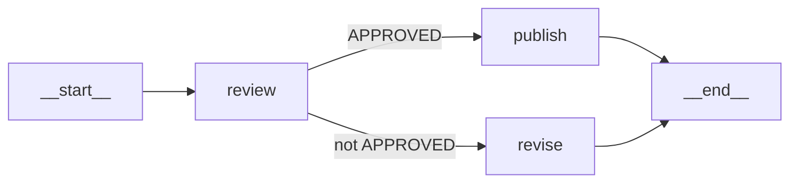
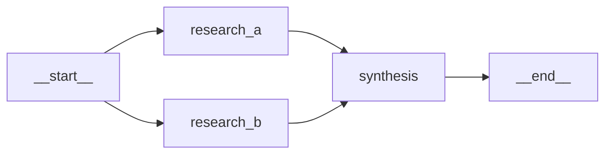

# AgentsFlow User Guide

`AgentsFlow` is AI-Parrot's DAG-first flow executor. Unlike `AgentCrew`'s
`run_flow()` mode — which derives a DAG from `task_flow()` declarations —
`AgentsFlow` gives you **explicit edge control**: you wire every transition,
specify conditions for each edge, and attach custom predicates or CEL
expressions for conditional routing.

For a reference of every node type you can use in a flow, see the
[Node Types Reference](node-types.md).  
For a higher-level orchestrator with built-in pipeline/parallel/loop modes
and synthesis, see the [AgentCrew User Guide](agentcrew.md).

---

## What is AgentsFlow?

`AgentsFlow` is an **event-driven DAG executor** with a per-node finite
state machine (FSM) and wave-based scheduling. Each node transitions through
`idle → ready → running → completed/failed/blocked` independently. The
scheduler fires the next wave of nodes as soon as all their incoming edges
are resolved.

Key properties:

- **Explicit edges** — you call `add_edge()` for every transition.
- **Five edge conditions** — `always`, `on_success`, `on_error`, `on_timeout`,
  `on_condition` — each can carry a Python callable or CEL expression predicate.
- **OR-join semantics** — a node dispatches when all incoming edges are resolved
  and at least one fired; if none fired, the node is skipped.
- **Event-driven telemetry** — lifecycle events emitted at every state transition.
- **Declarative or programmatic** — build flows in Python or from a
  `FlowDefinition` model.

---

## Quick Start

A minimal two-agent linear flow:

```python
import asyncio
from parrot.bots.flows import AgentsFlow, AgentNode, StartNode, EndNode
from parrot.bots import Agent
from parrot.clients.openai import OpenAIClient

client = OpenAIClient(model="gpt-4o-mini")

researcher = Agent(client=client, name="researcher",
                   system_prompt="Research and summarize the given topic.")
writer = Agent(client=client, name="writer",
               system_prompt="Turn research notes into a polished article.")

flow = AgentsFlow(name="research_pipeline")
flow.add_node(StartNode(node_id="__start__"))
flow.add_node(AgentNode(node_id="research", agent=researcher))
flow.add_node(AgentNode(node_id="write",    agent=writer))
flow.add_node(EndNode(node_id="__end__"))

flow.add_edge("__start__", "research")
flow.add_edge("research",  "write")
flow.add_edge("write",     "__end__")

result = asyncio.run(flow.run_flow("Explain the history of asyncio in Python"))
print(result.output)
```

---

## Building a Flow Programmatically

### Adding Nodes

```python
from parrot.bots.flows import AgentsFlow, AgentNode, StartNode, EndNode

flow = AgentsFlow(name="my_flow")
flow.add_node(StartNode(node_id="__start__"))
flow.add_node(AgentNode(node_id="step_a", agent=agent_a))
flow.add_node(AgentNode(node_id="step_b", agent=agent_b))
flow.add_node(EndNode(node_id="__end__"))
```

!!! note
    `add_node()` raises `ValueError` if a node with the same `node_id` is
    already present in the flow.

### Adding Edges

```python
# Unconditional edge (default)
flow.add_edge("__start__", "step_a")

# Only traverse if step_a succeeded
flow.add_edge("step_a", "step_b", condition="on_success")

# Only traverse if step_a failed
flow.add_edge("step_a", "fallback", condition="on_error")

# Only traverse if step_a timed out
flow.add_edge("step_a", "timeout_handler", condition="on_timeout")

# Conditional edge with a Python predicate
flow.add_edge("step_a", "step_b",
              condition="on_condition",
              predicate=lambda ctx: ctx.get("score", 0) > 0.8)

# Conditional edge with a CEL expression
flow.add_edge("step_a", "retry",
              condition="on_condition",
              predicate="result.status == 'partial'")
```

`add_edge()` returns a `FlowEdge` dataclass:

```python
from parrot.bots.flows.flow.flow import FlowEdge

edge: FlowEdge = flow.add_edge("step_a", "step_b")
print(edge.from_, edge.to, edge.condition)
```

### Edge Conditions Reference

| Condition | When the edge fires |
|---|---|
| `"always"` | Always (default) |
| `"on_success"` | Source node completed without error |
| `"on_error"` | Source node raised an exception |
| `"on_timeout"` | Source node exceeded its timeout |
| `"on_condition"` | The `predicate` callable or CEL expression returns `True` |

---

## Building from a Definition

For declarative, serializable flow construction use `FlowDefinition`,
`NodeDefinition`, and `EdgeDefinition`.

```python
import asyncio
from parrot.bots.flows import (
    AgentsFlow,
    FlowDefinition, NodeDefinition, EdgeDefinition,
)

definition = FlowDefinition(
    flow_id="content_pipeline",
    nodes=[
        NodeDefinition(id="__start__",  type="start"),
        NodeDefinition(id="research",   type="agent", agent_ref="researcher_agent"),
        NodeDefinition(id="write",      type="agent", agent_ref="writer_agent"),
        NodeDefinition(id="__end__",    type="end"),
    ],
    edges=[
        EdgeDefinition(from_="__start__", to="research"),
        EdgeDefinition(from_="research",  to="write"),
        EdgeDefinition(from_="write",     to="__end__"),
    ],
)

flow = AgentsFlow.from_definition(definition, agent_registry=registry)
result = asyncio.run(flow.run_flow("Explain quantum computing"))
```

### NodeDefinition Fields

| Field | Type | Description |
|---|---|---|
| `id` | `str` | Unique node identifier |
| `type` | `str` | Node type key from `NODE_REGISTRY` (e.g., `"agent"`, `"decision"`) |
| `agent_ref` | `Optional[str]` | Agent name in the `AgentRegistry` (required for `type="agent"`) |
| `instruction` | `Optional[str]` | Prompt override for this node |
| `config` | `Dict[str, Any]` | Type-specific configuration |
| `max_retries` | `int` | Retry count on failure (default: 3) |
| `pre_actions` | `List[ActionDefinition]` | Actions before `execute()` |
| `post_actions` | `List[ActionDefinition]` | Actions after `execute()` |

### EdgeDefinition Fields

| Field | Type | Description |
|---|---|---|
| `from_` | `str` | Source node `id` |
| `to` | `str` | Target node `id` |
| `condition` | `str` | One of the five edge conditions (default: `"always"`) |
| `predicate` | `Optional[str]` | CEL expression for `on_condition` edges |

### JSON Format

`FlowDefinition` is a Pydantic model, so it can be serialized to and from JSON:

```python
import json
from parrot.bots.flows import FlowDefinition

# Save
with open("flow.json", "w") as f:
    f.write(definition.model_dump_json(indent=2))

# Load
with open("flow.json") as f:
    definition = FlowDefinition.model_validate_json(f.read())
```

---

## Running a Flow

### Basic Execution

```python
result = await flow.run_flow("Analyze the EV market")

print(result.output)    # Final output (last completed node's output)
print(result.status)    # "completed" | "failed" | "partial"
print(result.errors)    # List of error messages
```

### FlowContext

`run_flow()` accepts either a plain string (used as the initial prompt) or
a `FlowContext` object for richer initialization:

```python
from parrot.bots.flows import FlowContext

ctx = FlowContext(
    task="Analyze the EV market",
    user_id="user-123",
    session_id="session-456",
    metadata={"region": "EU", "year": 2025},
)

result = await flow.run_flow(ctx)
```

### `on_complete` Callbacks

Pass async callbacks via `on_complete` to trigger side effects after the
flow finishes:

```python
async def save_results(result):
    print(f"Flow completed with status: {result.status}")

result = await flow.run_flow(ctx, on_complete=(save_results,))
```

---

## Node Lifecycle & Events

Each node transitions through a per-node FSM:

```
idle → ready → running → completed
                       → failed
                       → blocked   (skipped — no incoming edge fired)
```

The scheduler emits the following events at each transition:

| Event | Triggered when |
|---|---|
| `"flow_started"` | `run_flow()` begins |
| `"node_started"` | A node begins executing |
| `"node_completed"` | A node finishes successfully |
| `"node_failed"` | A node raises an exception |
| `"node_skipped"` | A node is blocked (no incoming edge fired) |
| `"flow_completed"` | `run_flow()` finishes |

### Attaching Event Listeners

```python
async def on_event(event: str, node_id: str, info: dict):
    if event == "node_completed":
        print(f"[{node_id}] completed in {info.get('duration_ms', 0):.0f}ms")
    elif event == "node_failed":
        print(f"[{node_id}] FAILED: {info.get('error')}")

flow.add_node_event_listener(on_event)
```

You can also pass listeners at construction time:

```python
flow = AgentsFlow(name="my_flow", on_node_event=on_event)
```

The `info` dict carries:

| Key | Available on | Description |
|---|---|---|
| `"flow"` | All events | Flow name |
| `"context"` | All events | The `FlowContext` for this run |
| `"node_count"` | `flow_started` | Number of nodes in the graph |
| `"duration_ms"` | `node_completed`, `node_failed` | Execution time in milliseconds |
| `"error"` | `node_failed` | Error message string |
| `"error_type"` | `node_failed` | Exception class name |
| `"status"` | `flow_completed` | Final status string |

!!! note
    Exceptions raised inside an event listener are caught and logged — they
    never propagate to the flow scheduler.

---

## Pre/Post Actions

Add lifecycle hooks to individual nodes without modifying their `execute()`
logic:

```python
from parrot.bots.flows import AgentNode

node = AgentNode(node_id="researcher", agent=agent)

async def before_execute(prompt: str, **ctx):
    print(f"[researcher] prompt: {prompt[:80]}")

async def after_execute(**ctx):
    print("[researcher] done")

node.add_pre_action(before_execute)
node.add_post_action(after_execute)
```

Pre/post actions are ideal for cross-cutting concerns: logging, metrics,
input validation, or output post-processing.

---

## Conditional Routing

### Branching Pattern

Route the flow to different branches based on the output of a node:

```python
import asyncio
from parrot.bots.flows import AgentsFlow, AgentNode, StartNode, EndNode

flow = AgentsFlow(name="approval_flow")
flow.add_node(StartNode(node_id="__start__"))
flow.add_node(AgentNode(node_id="review", agent=reviewer))
flow.add_node(AgentNode(node_id="publish", agent=publisher))
flow.add_node(AgentNode(node_id="revise",  agent=reviser))
flow.add_node(EndNode(node_id="__end__"))

flow.add_edge("__start__", "review")

# Route based on reviewer output
flow.add_edge("review", "publish",
              condition="on_condition",
              predicate=lambda ctx: "APPROVED" in str(ctx.get("result", "")))
flow.add_edge("review", "revise",
              condition="on_condition",
              predicate=lambda ctx: "APPROVED" not in str(ctx.get("result", "")))

flow.add_edge("publish", "__end__")
flow.add_edge("revise",  "__end__")

result = asyncio.run(flow.run_flow("Review this blog post: ..."))
```

**Branch topology:**



### Fan-Out / Fan-In

Run multiple agents in parallel and synthesize their outputs:

```python
flow = AgentsFlow(name="parallel_research")
flow.add_node(StartNode(node_id="__start__"))
flow.add_node(AgentNode(node_id="research_a", agent=researcher_a))
flow.add_node(AgentNode(node_id="research_b", agent=researcher_b))
flow.add_node(AgentNode(node_id="synthesis",  agent=synthesizer))
flow.add_node(EndNode(node_id="__end__"))

# Fan-out
flow.add_edge("__start__", "research_a")
flow.add_edge("__start__", "research_b")

# Fan-in (synthesis waits for both research nodes)
flow.add_edge("research_a", "synthesis")
flow.add_edge("research_b", "synthesis")

flow.add_edge("synthesis", "__end__")
```

**Wave scheduling:**



`research_a` and `research_b` run in the same wave. `synthesis` starts
in the next wave, once both complete.

!!! warning "Known limitation with conditional fan-out"
    When a branching predicate can route to multiple terminal nodes, and only
    one branch fires, the unvisited `EndNode` may block the flow from
    completing cleanly. Use a `SynthesisNode` or a shared convergence node
    to merge branches before reaching `__end__`. See the
    [Decision Node Usage Guide](../DECISION_NODE_USAGE.md) for documented
    workarounds.

---

## Error Handling & Retries

### `on_error` Edges

Route to a recovery node when a node fails:

```python
flow.add_edge("risky_node", "success_path",  condition="on_success")
flow.add_edge("risky_node", "fallback_node", condition="on_error")
```

### `on_timeout` Edges

Handle timeout separately from general errors:

```python
# AgentNode with a 30-second timeout
flow.add_node(AgentNode(node_id="slow_agent", agent=slow_agent, timeout=30.0))

flow.add_edge("slow_agent", "result_node",   condition="on_success")
flow.add_edge("slow_agent", "timeout_node",  condition="on_timeout")
flow.add_edge("slow_agent", "error_node",    condition="on_error")
```

### Retry Policy

Set `max_retries` in `NodeDefinition` to retry a node automatically on failure
before triggering the `on_error` edge:

```python
NodeDefinition(
    id="unreliable_api",
    type="agent",
    agent_ref="api_agent",
    max_retries=3,  # Retry up to 3 times before emitting on_error
)
```

---

## Comparison: AgentCrew.run_flow vs AgentsFlow.run_flow

| Feature | `AgentCrew.run_flow()` | `AgentsFlow.run_flow()` |
|---|---|---|
| DAG construction | `task_flow()` (implicit edges) | `add_edge()` (explicit edges) |
| Edge conditions | None (always) | `always`, `on_success`, `on_error`, `on_timeout`, `on_condition` |
| Conditional routing | Not supported | Yes (predicates + CEL) |
| HITL decision gates | Not supported | Yes (`InteractiveDecisionNode`) |
| LLM decision nodes | Not supported | Yes (`DecisionNode`) |
| In-graph synthesis | Via `summary()` (post-run) | Yes (`SynthesisNode`) |
| Iterative loop | `run_loop()` on `AgentCrew` | Not supported |
| Memory & synthesis | Yes (SynthesisMixin) | No |
| `ask()` interface | Yes | No |
| Definition-based build | `from_definition(CrewDefinition)` | `from_definition(FlowDefinition)` |
| Retry policy | No | Yes (per `NodeDefinition.max_retries`) |
| Event listeners | No | Yes (`add_node_event_listener`) |
| Pre/post actions | No | Yes (per node) |

**Choose `AgentsFlow` when you need any of:**

- Custom edge conditions (on_error, on_timeout, on_condition)
- Branching with predicate-based routing
- HITL decision gates
- LLM-powered multi-agent decisions
- Fine-grained retry and timeout policies
- Node lifecycle event telemetry

**Choose `AgentCrew.run_flow()` when:**

- Your topology is a simple dependency DAG without conditional edges
- You want built-in memory, synthesis, and `ask()` after the run
- You need iterative loop execution alongside flow execution

---

## See Also

- [Node Types Reference](node-types.md) — all node types, registry, custom nodes
- [AgentCrew User Guide](agentcrew.md) — sequential/parallel/flow/loop orchestration
- [Decision Node Usage Guide](../DECISION_NODE_USAGE.md) — deep dive on decision nodes
