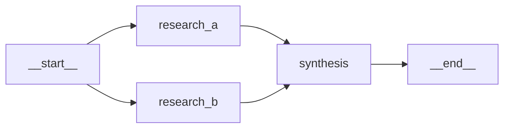

# Node Types Reference

AI-Parrot's orchestration layer is built on a registry of composable node types. Every
node in an `AgentsFlow` graph is an instance of one of these types. This page documents
each registered node type — its fields, configuration, and usage pattern — so you can
build flows with confidence.

For the high-level guide on `AgentsFlow` construction, see the
[AgentsFlow User Guide](agentsflow.md).  
For the comprehensive `AgentCrew` guide, see the
[AgentCrew User Guide](agentcrew.md).

---

## Node Registry

AI-Parrot uses a central `NODE_REGISTRY` dictionary that maps string keys to node
classes. When you build a flow from a definition (using `FlowDefinition`), each
`NodeDefinition.type` field is looked up in this registry to instantiate the correct
class.

```python
from parrot.bots.flows.flow.flow import NODE_REGISTRY, register_node

# Inspect all registered node types
print(list(NODE_REGISTRY.keys()))
# ['agent', 'start', 'end', 'decision', 'interactive_decision', 'synthesis']
```

### Registering a Node Type

Use the `@register_node` decorator to add a class to the registry:

```python
from parrot.bots.flows.flow.flow import register_node
from parrot.bots.flows import Node

@register_node("my_custom_node")
class MyCustomNode(Node):
    ...
```

!!! note
    Built-in nodes are registered automatically when the `parrot.bots.flows` package
    is imported. You only need to call `@register_node` for your own custom types.

---

## Base Node (`Node`)

All node types inherit from `Node`, a **frozen Pydantic model** defined in
`parrot.bots.flows.core.node`. Because it is frozen, node fields are immutable after
construction — you configure a node once and then add it to a flow.

```python
from parrot.bots.flows import Node
```

**Key fields:**

| Field | Type | Description |
|---|---|---|
| `node_id` | `str` | Unique identifier for the node within a flow |

**Pre/Post action hooks:**

`Node` provides lifecycle hooks that run before and after the node's main `execute()`
call. Use them for logging, validation, or side effects without modifying node logic.

```python
from parrot.bots.flows import AgentNode

node = AgentNode(node_id="researcher", agent=my_agent)

async def log_start(prompt: str, **ctx):
    print(f"[researcher] starting with: {prompt[:80]}")

async def log_done(**ctx):
    print("[researcher] done")

node.add_pre_action(log_start)
node.add_post_action(log_done)
```

**Method signatures:**

```python
def add_pre_action(self, action: ActionCallback) -> None
def add_post_action(self, action: ActionCallback) -> None
async def run_pre_actions(self, prompt: str = "", **ctx) -> None
```

---

## AgentNode (`"agent"`)

> Wraps an AI agent in a flow node, giving it a per-node FSM, dependency tracking,
> and a configurable timeout.

This is the primary building block for most flows. Each `AgentNode` holds an agent
(anything implementing `AgentLike`) and executes it when its dependencies are satisfied.

```python
from parrot.bots.flows import AgentNode
from parrot.bots import Agent
```

**Fields:**

| Field | Type | Default | Description |
|---|---|---|---|
| `node_id` | `str` | required | Unique node identifier |
| `agent` | `AgentLike` | required | The agent to execute |
| `dependencies` | `Set[str]` | `set()` | IDs of nodes that must complete before this one |
| `successors` | `Set[str]` | `set()` | IDs of nodes that this node feeds into |
| `timeout` | `Optional[float]` | `None` | Execution timeout in seconds |

**Usage:**

```python
import asyncio
from parrot.bots.flows import AgentsFlow, AgentNode, StartNode, EndNode
from parrot.bots import Agent
from parrot.clients.openai import OpenAIClient

client = OpenAIClient(model="gpt-4o-mini")

researcher = Agent(
    client=client,
    system_prompt="You are a market research specialist.",
)
summarizer = Agent(
    client=client,
    system_prompt="You are a summarization expert.",
)

# Create nodes
start = StartNode(node_id="__start__")
research_node = AgentNode(node_id="research", agent=researcher, timeout=60.0)
summary_node = AgentNode(node_id="summary", agent=summarizer)
end = EndNode(node_id="__end__")

# Build the flow
flow = AgentsFlow()
flow.add_node(start)
flow.add_node(research_node)
flow.add_node(summary_node)
flow.add_node(end)

flow.add_edge("__start__", "research")
flow.add_edge("research", "summary")
flow.add_edge("summary", "__end__")

result = asyncio.run(flow.run_flow("Analyze the EV market in 2025"))
print(result.output)
```

**Notes:**

- `AgentNode.execute()` passes the `FlowContext` and the outputs of all dependency
  nodes (`DependencyResults`) to the agent.
- Setting `timeout` raises `asyncio.TimeoutError` after the given seconds; use an
  `on_timeout` edge to route the flow on timeout.

---

## StartNode (`"start"`)

> Virtual entry point for a flow. Every `AgentsFlow` must have exactly one `StartNode`.

The `StartNode` does not run any agent logic — it simply marks where the flow begins.
Its `node_id` defaults to `"__start__"` as a convention (though any ID is valid).

```python
from parrot.bots.flows import StartNode
```

**Fields:**

| Field | Type | Default | Description |
|---|---|---|---|
| `node_id` | `str` | `"__start__"` | Unique node identifier |

**Usage:**

```python
flow = AgentsFlow()
flow.add_node(StartNode(node_id="__start__"))
# ... add other nodes ...
flow.add_edge("__start__", "first_agent")
```

!!! tip
    When building from a `FlowDefinition`, use `type: "start"` in the node definition
    and the registry will automatically create a `StartNode`.

---

## EndNode (`"end"`)

> Virtual exit point for a flow. Every `AgentsFlow` must have at least one `EndNode`.

Like `StartNode`, `EndNode` runs no agent logic — it marks the natural termination
point of the flow. Its `node_id` defaults to `"__end__"`.

```python
from parrot.bots.flows import EndNode
```

**Fields:**

| Field | Type | Default | Description |
|---|---|---|---|
| `node_id` | `str` | `"__end__"` | Unique node identifier |

**Usage:**

```python
flow.add_node(EndNode(node_id="__end__"))
flow.add_edge("last_agent", "__end__")
```

!!! note
    A flow that has conditional routing may have multiple terminal nodes. If the
    only path to `__end__` is blocked by a failed node, the flow ends when no
    further nodes can run. See the
    [Decision Node Usage Guide](../DECISION_NODE_USAGE.md) for details on
    handling multiple terminal paths.

---

## DecisionNode (`"decision"`)

> An LLM-powered decision gate that routes a flow based on agent votes or structured
> decision logic.

`DecisionNode` wraps the `DecisionFlowNode` with three operating modes — **CIO**,
**BALLOT**, and **CONSENSUS** — each offering a different decision-making strategy.

```python
from parrot.bots.flows import DecisionFlowNode, BinaryDecision
from parrot.bots.flows.flow.nodes import (
    DecisionNodeConfig,
    DecisionMode,        # CIO, BALLOT, CONSENSUS
    DecisionType,        # BINARY, APPROVAL, MULTI_CHOICE, CUSTOM
    DecisionResult,
    EscalationPolicy,
    VoteWeight,          # EQUAL, SENIORITY, CONFIDENCE, CUSTOM
)
```

### Decision Modes

=== "CIO Mode"

    A single coordinator agent makes the decision. Best for binary yes/no routing
    or when one authoritative agent should decide.

    ```python
    from parrot.bots.flows.flow.nodes import DecisionNodeConfig, DecisionMode, DecisionType

    config = DecisionNodeConfig(
        mode=DecisionMode.CIO,
        decision_type=DecisionType.BINARY,
        question="Should we proceed with the investment?",
        coordinator_agent_name="cio_agent",
    )
    ```

=== "BALLOT Mode"

    Multiple agents vote independently; results are aggregated by count or weight.
    Best for diverse perspectives without cross-pollination.

    ```python
    config = DecisionNodeConfig(
        mode=DecisionMode.BALLOT,
        decision_type=DecisionType.APPROVAL,
        question="Approve this content for publication?",
        vote_weight_strategy=VoteWeight.EQUAL,
    )
    ```

=== "CONSENSUS Mode"

    Agents read each other's decisions across multiple revision rounds; a
    coordinator synthesizes the final call. Best for nuanced decisions
    requiring deliberation.

    ```python
    config = DecisionNodeConfig(
        mode=DecisionMode.CONSENSUS,
        decision_type=DecisionType.MULTI_CHOICE,
        question="Which market strategy should we pursue?",
        coordinator_agent_name="strategy_coordinator",
        cross_pollination_rounds=2,
    )
    ```

**DecisionNodeConfig fields:**

| Field | Type | Description |
|---|---|---|
| `mode` | `DecisionMode` | CIO, BALLOT, or CONSENSUS |
| `decision_type` | `DecisionType` | BINARY, APPROVAL, MULTI_CHOICE, or CUSTOM |
| `question` | `str` | The question agents must decide on |
| `coordinator_agent_name` | `Optional[str]` | Required for CIO and CONSENSUS modes |
| `vote_weight_strategy` | `VoteWeight` | How to weight votes in BALLOT/CONSENSUS |
| `cross_pollination_rounds` | `int` | Revision rounds in CONSENSUS mode |

**Full example:**

```python
import asyncio
from parrot.bots.flows import (
    AgentsFlow, AgentNode, StartNode, EndNode, DecisionFlowNode, BinaryDecision,
)
from parrot.bots.flows.flow.nodes import DecisionNodeConfig, DecisionMode, DecisionType
from parrot.bots import Agent
from parrot.clients.openai import OpenAIClient

client = OpenAIClient(model="gpt-4o-mini")
analyst = Agent(client=client, name="analyst_agent",
                system_prompt="You analyze business proposals.")
approver = Agent(client=client, name="approver_agent",
                 system_prompt="You approve or reject proposals.")

decision_node = DecisionFlowNode(
    node_id="approval_gate",
    config=DecisionNodeConfig(
        mode=DecisionMode.CIO,
        decision_type=DecisionType.BINARY,
        question="Is the proposal viable for investment?",
        coordinator_agent_name="approver_agent",
    ),
    agents={"approver_agent": approver},
)

execute_node = AgentNode(node_id="execute", agent=analyst)
reject_node = AgentNode(node_id="reject", agent=analyst)
end = EndNode(node_id="__end__")

flow = AgentsFlow()
flow.add_node(StartNode(node_id="__start__"))
flow.add_node(AgentNode(node_id="analyze", agent=analyst))
flow.add_node(decision_node)
flow.add_node(execute_node)
flow.add_node(reject_node)
flow.add_node(end)

flow.add_edge("__start__", "analyze")
flow.add_edge("analyze", "approval_gate")

# Route based on BinaryDecision outcome
flow.add_edge("approval_gate", "execute",
              condition="on_condition",
              predicate=lambda ctx: ctx.get("decision") == BinaryDecision.YES)
flow.add_edge("approval_gate", "reject",
              condition="on_condition",
              predicate=lambda ctx: ctx.get("decision") == BinaryDecision.NO)

flow.add_edge("execute", "__end__")
flow.add_edge("reject", "__end__")

result = asyncio.run(flow.run_flow("Analyze proposal: expand to Asian markets"))
```

!!! warning
    For a deep dive on `DecisionNode` configuration, voting strategies, and known
    limitations with conditional branches, see the
    [Decision Node Usage Guide](../DECISION_NODE_USAGE.md).

---

## InteractiveDecisionNode (`"interactive_decision"`)

> A Human-in-the-Loop (HITL) gate that pauses flow execution and waits for a human
> decision before continuing.

`InteractiveDecisionFlowNode` extends `DecisionFlowNode` with escalation to a human
operator when agent confidence is insufficient or when the decision requires human
oversight.

```python
from parrot.bots.flows import InteractiveDecisionFlowNode
```

**Escalation policies:**

```python
from parrot.bots.flows.flow.nodes import EscalationPolicy

policy = EscalationPolicy(
    enabled=True,
    confidence_threshold=0.7,   # Escalate when confidence < 70%
    max_wait_seconds=300,        # Timeout after 5 minutes
)
```

**Usage pattern:**

```python
from parrot.bots.flows import InteractiveDecisionFlowNode
from parrot.bots.flows.flow.nodes import DecisionNodeConfig, DecisionMode, DecisionType, EscalationPolicy

hitl_node = InteractiveDecisionFlowNode(
    node_id="human_approval",
    config=DecisionNodeConfig(
        mode=DecisionMode.CIO,
        decision_type=DecisionType.APPROVAL,
        question="Please approve or reject this content before publishing.",
        coordinator_agent_name="review_agent",
    ),
    agents={"review_agent": review_agent},
    escalation_policy=EscalationPolicy(
        enabled=True,
        confidence_threshold=0.8,
    ),
)
```

!!! note
    `InteractiveDecisionFlowNode` is the node class registered under the
    `"interactive_decision"` key and is also exported as `InteractiveDecisionNode`
    (a backward-compatible alias) from `parrot.bots.flows`.

---

## SynthesisNode (`"synthesis"`)

> An in-graph LLM summarization node that aggregates the outputs of its dependency
> nodes and produces a synthesized result.

`SynthesisNode` is useful when you need to consolidate the results of multiple parallel
branches before continuing the flow — rather than aggregating in post-processing.

```python
# SynthesisNode is accessible via NODE_REGISTRY["synthesis"]
# or by using type="synthesis" in a FlowDefinition
from parrot.bots.flows.flow.flow import NODE_REGISTRY
SynthesisNode = NODE_REGISTRY["synthesis"]
```

**Usage (definition-based):**

```python
from parrot.bots.flows import AgentsFlow, FlowDefinition, NodeDefinition, EdgeDefinition

definition = FlowDefinition(
    flow_id="research_and_synthesize",
    nodes=[
        NodeDefinition(node_id="__start__", type="start"),
        NodeDefinition(node_id="research_a", type="agent",
                       agent_id="researcher_a"),
        NodeDefinition(node_id="research_b", type="agent",
                       agent_id="researcher_b"),
        NodeDefinition(node_id="synthesis", type="synthesis",
                       config={"synthesis_prompt": "Combine findings into one report."}),
        NodeDefinition(node_id="__end__", type="end"),
    ],
    edges=[
        EdgeDefinition(from_="__start__", to="research_a"),
        EdgeDefinition(from_="__start__", to="research_b"),
        EdgeDefinition(from_="research_a", to="synthesis"),
        EdgeDefinition(from_="research_b", to="synthesis"),
        EdgeDefinition(from_="synthesis", to="__end__"),
    ],
)

flow = AgentsFlow.from_definition(definition, agent_registry=registry)
```

**Flow topology:**



!!! tip
    `SynthesisNode` is particularly effective in fan-out/fan-in patterns where
    multiple parallel branches must be consolidated before downstream nodes
    can proceed.

---

## CrewAgentNode

> A crew-specific variant of `AgentNode` used internally by `AgentCrew` for its
> `run_flow()` DAG execution mode.

`CrewAgentNode` extends `AgentNode` with additional context-building logic tailored to
`AgentCrew`'s shared-state and context-passing conventions. Advanced users who integrate
`AgentCrew` with custom `AgentsFlow` pipelines may encounter this node type.

```python
from parrot.bots.flows import CrewAgentNode
```

**Additional methods:**

| Method | Description |
|---|---|
| `_build_prompt(ctx, deps)` | Constructs the prompt from `FlowContext` + dependency results |
| `_format(input_data)` | Static helper — formats a dict of agent inputs into a prompt string |

**When to use `CrewAgentNode` directly:**

In most cases you do not need to use `CrewAgentNode` directly — `AgentCrew.run_flow()`
handles it internally. Use it if you:

- Are building a hybrid flow where some nodes are `AgentCrew`-managed and others are
  plain `AgentsFlow` nodes.
- Need the crew-specific context formatting in a custom `AgentsFlow` pipeline.

!!! warning
    `CrewAgentNode` is not registered in `NODE_REGISTRY` and cannot be created from
    a `FlowDefinition`. It is instantiated programmatically.

---

## Creating Custom Node Types

You can extend `Node` to create your own node types and register them with
`@register_node` so they are available in `FlowDefinition`.

```python
from typing import Any
from pydantic import Field
from parrot.bots.flows import Node, FlowContext
from parrot.bots.flows.flow.flow import register_node

# Import result types from core
from parrot.bots.flows.core.result import NodeResult

@register_node("http_fetch")
class HttpFetchNode(Node):
    """Fetches a URL and returns the response body as the node result."""

    url: str = Field(..., description="The URL to fetch")
    timeout: float = Field(default=30.0, description="Request timeout in seconds")

    async def execute(
        self,
        ctx: FlowContext,
        deps: Any,
        **kwargs: Any,
    ) -> NodeResult:
        import aiohttp
        async with aiohttp.ClientSession() as session:
            async with session.get(self.url, timeout=aiohttp.ClientTimeout(total=self.timeout)) as resp:
                body = await resp.text()
        return NodeResult(output=body, node_id=self.node_id, status="completed")
```

After defining `HttpFetchNode`, it is available under the `"http_fetch"` key in
`NODE_REGISTRY`:

```python
from parrot.bots.flows import FlowDefinition, NodeDefinition, EdgeDefinition, AgentsFlow

definition = FlowDefinition(
    flow_id="web_research",
    nodes=[
        NodeDefinition(node_id="__start__", type="start"),
        NodeDefinition(node_id="fetch", type="http_fetch",
                       config={"url": "https://example.com/data.json"}),
        NodeDefinition(node_id="__end__", type="end"),
    ],
    edges=[
        EdgeDefinition(from_="__start__", to="fetch"),
        EdgeDefinition(from_="fetch", to="__end__"),
    ],
)
```

**Custom node requirements:**

1. Inherit from `Node` (Pydantic `BaseModel`, frozen).
2. Implement `async def execute(self, ctx, deps, **kwargs) -> NodeResult`.
3. Decorate with `@register_node("<key>")` before using in a `FlowDefinition`.
4. Return a `NodeResult` with `output`, `node_id`, and `status`.

!!! tip
    Custom nodes can use `add_pre_action()` / `add_post_action()` for cross-cutting
    concerns (logging, metrics, tracing) without modifying the `execute()` method.

---

## Node Registry Summary

| Registry Key | Class | Module | Description |
|---|---|---|---|
| `"agent"` | `AgentNode` | `parrot.bots.flows.core.node` | Wraps an AI agent |
| `"start"` | `StartNode` | `parrot.bots.flows.core.node` | Flow entry point |
| `"end"` | `EndNode` | `parrot.bots.flows.core.node` | Flow exit point |
| `"decision"` | `DecisionNode` | `parrot.bots.flows.flow.flow` | LLM-powered decision gate |
| `"interactive_decision"` | `InteractiveDecisionFlowNode` | `parrot.bots.flows.flow.flow` | HITL decision gate |
| `"synthesis"` | `SynthesisNode` | `parrot.bots.flows.flow.flow` | In-graph LLM summarization |

---

## Edge Conditions

Edge conditions control when a directed edge in the flow graph is traversed. They are
set via `AgentsFlow.add_edge()`:

```python
flow.add_edge(from_="node_a", to="node_b", condition="on_success")
```

| Condition | Description |
|---|---|
| `"always"` | Edge is always traversed (default) |
| `"on_success"` | Only traversed if the source node completed successfully |
| `"on_error"` | Only traversed if the source node raised an error |
| `"on_timeout"` | Only traversed if the source node timed out |
| `"on_condition"` | Traversed when the `predicate` callable returns `True` |

For `"on_condition"`, supply a `predicate` — either a Python callable or a CEL
expression string:

```python
# Python callable predicate
flow.add_edge("decision", "execute",
              condition="on_condition",
              predicate=lambda ctx: ctx.get("approved") is True)

# CEL expression string (requires CELPredicateEvaluator)
flow.add_edge("decision", "reject",
              condition="on_condition",
              predicate="result.confidence < 0.5")
```

---

## See Also

- [AgentCrew User Guide](agentcrew.md) — multi-agent orchestration with four execution modes
- [AgentsFlow User Guide](agentsflow.md) — DAG-first flow construction and execution
- [Decision Node Usage Guide](../DECISION_NODE_USAGE.md) — deep dive on decision nodes
