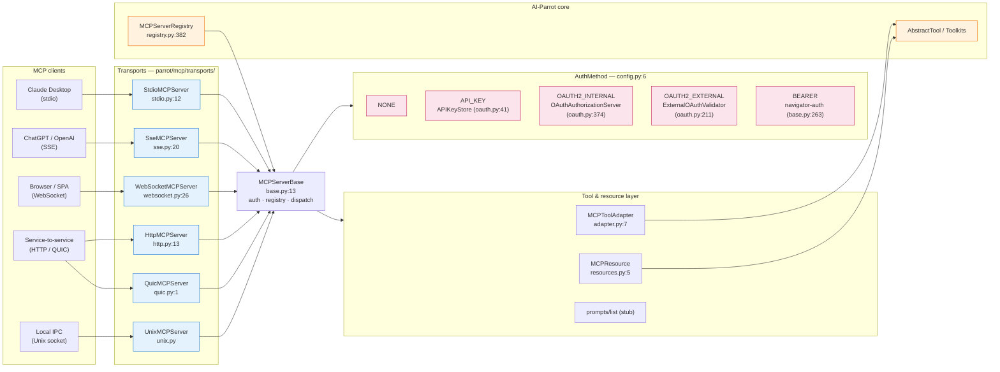

# 1. MCP Server — exposing tools as a service

> Part of the [Exposure, Interoperability & Hardening](README.md) set.
> Previous: [Index](README.md) · Next: [A2A](02-a2a.md)

AI-Parrot can act as an **MCP server** so that any MCP-compatible client
(Claude Desktop, ChatGPT, Cursor, internal agents, custom apps) consumes
its toolkits. The MCP layer lives under `parrot/mcp/`.

## 1.1 Architecture



## 1.2 Server topology

A single `MCPServer` factory dispatches to a transport-specific
implementation, all sharing a common base:

```
parrot/mcp/
├── server.py              MCPServer factory (server.py:33)
├── adapter.py             MCPToolAdapter — AbstractTool → MCP tool
├── resources.py           MCPResource dataclass
├── client.py              MCP client + AuthCredential
├── transports/
│   ├── base.py            MCPServerBase (auth + tool registry + dispatch)
│   ├── stdio.py           StdioMCPServer
│   ├── http.py            HttpMCPServer
│   ├── sse.py             SseMCPServer
│   ├── websocket.py       WebSocketMCPServer (SEP-1288 aligned)
│   ├── unix.py            UnixMCPServer
│   └── quic.py            QuicMCPServer (HTTP/3, msgpack optional)
└── registry.py            MCPServerRegistry — descriptor catalogue
```

Every transport inherits from `MCPServerBase` (`transports/base.py:13`),
which is responsible for authentication negotiation, the tool registry
(`self.tools: dict[str, MCPToolAdapter]`), resource handling, and JSON-RPC
dispatch (`tools/list`, `tools/call`, `resources/list`, `resources/read`,
`prompts/list`).

## 1.3 Supported transports

| Transport     | Class                  | Use case                                                       |
|---------------|------------------------|----------------------------------------------------------------|
| **stdio**     | `StdioMCPServer`       | Local CLI clients (Claude Desktop, IDE integrations).          |
| **HTTP**      | `HttpMCPServer`        | Service-to-service over corporate networks; SSL optional.      |
| **SSE**       | `SseMCPServer`         | OpenAI / ChatGPT MCP connector (RFC-8030-style server push).   |
| **WebSocket** | `WebSocketMCPServer`   | Browser clients and full-duplex agents; per-session sockets.   |
| **Unix**      | `UnixMCPServer`        | Same-host IPC; lowest overhead.                                |
| **QUIC**      | `QuicMCPServer`        | High-throughput, multiplexed, optional MessagePack framing.    |

Each transport exposes the same MCP semantics; the choice is purely about
network reachability and latency.

## 1.4 Tool exposure

Tools are not re-implemented for MCP — they are **adapted** at runtime by
`MCPToolAdapter` (`mcp/adapter.py:7`):

- `to_mcp_tool_definition()` (`adapter.py:14`) reads the tool's Pydantic
  arguments schema and emits `{name, description, inputSchema}`.
- `execute()` (`adapter.py:32`) delegates to `tool._execute(**arguments)`
  and converts the resulting `ToolResult` into MCP `{content, isError}`.

Registration is done via `MCPServerBase.register_tool()` /
`register_tools()` (`base.py:156` / `base.py:177`). Both honour
`allowed_tools` / `blocked_tools` filters declared on the server config —
this is the **first gate** in the hardening chain (see
[chapter 5](05-hardening.md#54-tool-and-resource-access-control)).

## 1.5 Resources and prompts

Resources are first-class. `MCPResource` (`mcp/resources.py:5`) is a
dataclass `{uri, name, description, mime_type}`, registered with an async
`read_handler` via `MCPServerBase.register_resource()` (`base.py:36`). The
calculator example (`mcp_servers/calculator_server.py:219`) exposes
`calculator://help` as text and `calculator://operations` as JSON.

The prompts dispatcher (`base.py:97`) is currently a stub returning
`[]`. Prompt registration is the next planned extension point.

## 1.6 Authentication modes

MCP authentication is encoded in `AuthMethod` (`parrot/mcp/config.py:6`).
Mode is selected per-server, not per-tool, but tool gating is delegated
to PBAC (see [chapter 5](05-hardening.md)).

| Mode             | Mechanism                                                                                                                                              |
|------------------|--------------------------------------------------------------------------------------------------------------------------------------------------------|
| `NONE`           | Open access. Development and trusted localhost only.                                                                                                   |
| `API_KEY`        | `APIKeyStore` (`parrot/mcp/oauth.py:41`). `mcp_key_*` tokens with TTL and scopes; `validate_key()` (`oauth.py:119`) plus session audit logging.        |
| `OAUTH2_INTERNAL`| Built-in authorization server (`OAuthAuthorizationServer`, `oauth.py:374`): RFC 7591 dynamic client registration, RFC 6749 auth-code + PKCE (S256).    |
| `OAUTH2_EXTERNAL`| Token introspection against an external IdP (`ExternalOAuthValidator`, `oauth.py:211`) — RFC 7662, audience-aware, 5-min token cache.                  |
| `BEARER`         | Delegates to `navigator-auth` session middleware (`base.py:263`). The validated user is exposed to handlers as `request["mcp_user"]`.                  |

Client side (`parrot/mcp/client.py`) carries an `AuthScheme` enum and an
`AuthCredential` builder covering Bearer, API key, Basic, OAuth2, mTLS
and AWS SigV4.

The well-known endpoints exposed by the internal OAuth server are:

```
GET  /.well-known/oauth-authorization-server
POST /oauth/register
GET  /oauth/authorize
POST /oauth/token
```

This makes the MCP server compatible with Claude.ai's MCP connector
(which expects RFC 7591 / 8414).

## 1.7 Server registry

`MCPServerRegistry` (`parrot/mcp/registry.py:382`) declaratively catalogues
both **embedded** servers (factories that wrap parrot toolkits) and
**remote** clients (NetSuite OAuth2 PKCE, Perplexity API key, Chrome
DevTools, etc.). Each entry is an `MCPServerDescriptor` listing
parameters, categories and the factory method, and feeds the
configuration UI used by the Telegram and MS Teams integrations.

## 1.8 Reference servers

| Name              | File                                              | Transport | Auth        |
|-------------------|---------------------------------------------------|-----------|-------------|
| Calculator        | `mcp_servers/calculator_server.py`                | stdio     | none        |
| Jira              | `examples/jira_mcp_server.py`                     | http/sse  | api_key     |
| WebSocket sample  | `examples/mcp_websocket_server.py`                | ws        | oauth (int) |
| SSE sample        | `examples/test_sse_mcp.py`                        | sse       | none        |
| AI-Parrot generic | `examples/agents/ai_parrot_mcp_server.py`         | stdio/http| optional    |

Pre-registered remote MCP clients in `registry.py`: NetSuite (OAuth2
PKCE), Perplexity (API key), Chrome DevTools.
