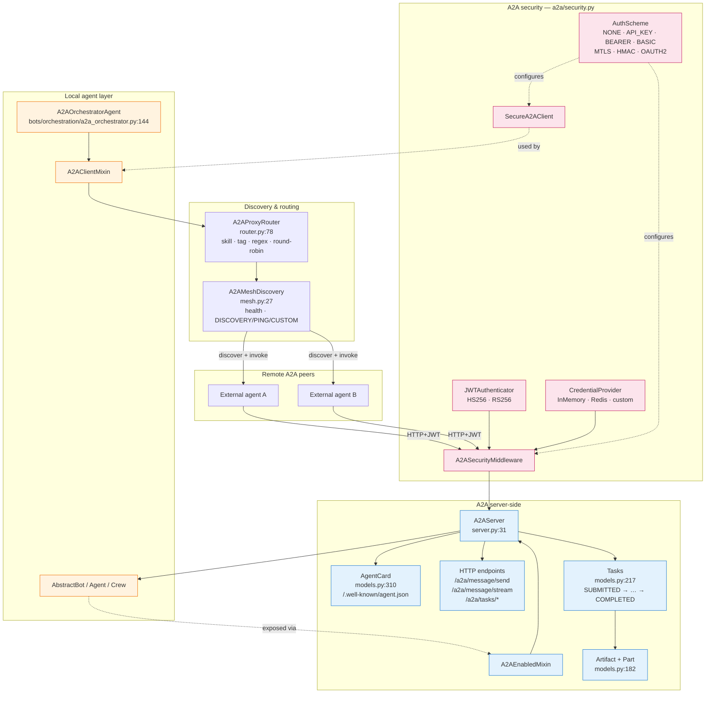

# 2. A2A — exposing agents and orchestrators as services

> Part of the [Exposure, Interoperability & Hardening](README.md) set.
> Previous: [MCP Server](01-mcp-server.md) · Next: [Toolkits](03-toolkits.md)

Where MCP exposes **tools**, A2A (Agent-to-Agent) exposes **agents**:
self-describing services that accept goals, run reasoning loops, and
return artefacts. AI-Parrot ships a custom A2A v0.3 stack under
`parrot/a2a/`.

## 2.1 Architecture



## 2.2 Components

```
parrot/a2a/
├── server.py              A2AServer + A2AEnabledMixin
├── client.py              A2AClient
├── mixin.py               A2AClientMixin (consume remote agents as tools)
├── models.py              AgentCard, AgentSkill, AgentCapabilities, Task, Artifact
├── security.py            JWTAuthenticator, A2ASecurityMiddleware, SecureA2AClient
├── mesh.py                A2AMeshDiscovery (multi-agent registry + health)
└── router.py              A2AProxyRouter (rule / skill / tag / round-robin)
```

The most important class for exposure is `A2AServer` (`a2a/server.py:31`).
Wrapping any `AbstractBot` produces an aiohttp service:

```python
a2a = A2AServer(my_agent)
a2a.setup(app, url="https://my-agent.example.com")
```

The mixin form `A2AEnabledMixin.setup_a2a(app)` is the recommended path
for agents that are themselves an aiohttp application.

## 2.3 Discovery — Agent Card

`AgentCard` (`models.py:310`) is the public manifest. It lists name,
description, version, `skills`, `capabilities` (streaming, push
notifications, state-transition history), input / output modes (text,
JSON…), and `protocolVersion: "0.3"`. It is built from agent metadata —
including auto-discovered tools from `agent.tool_manager` — by
`get_agent_card()` (`server.py:137` / `server.py:178`) and served at:

```
GET /.well-known/agent.json
```

This makes any AI-Parrot agent discoverable by any A2A-compatible peer.

## 2.4 HTTP surface

Once `setup()` runs, the server registers (`server.py:119`):

| Method | Path                                | Purpose                                |
|--------|-------------------------------------|----------------------------------------|
| GET    | `/.well-known/agent.json`           | AgentCard discovery                    |
| POST   | `/a2a/message/send`                 | Synchronous one-shot message           |
| POST   | `/a2a/message/stream`               | Streaming response (SSE)               |
| GET    | `/a2a/tasks`                        | List tasks                             |
| GET    | `/a2a/tasks/{task_id}`              | Poll task status                       |
| POST   | `/a2a/tasks/{task_id}/cancel`       | Cancel a task                          |
| GET    | `/a2a/tasks/{task_id}/subscribe`    | Server-push updates                    |

`Task` (`models.py:217`) has the standard lifecycle `SUBMITTED → WORKING
→ {COMPLETED | FAILED | CANCELLED | INPUT_REQUIRED | REJECTED}`.
`Artifact` (`models.py:182`) carries arbitrary `Part` payloads (text,
files, structured data). Tasks are kept in the `_tasks` dict on the
server (`server.py:239`); for production deployments swap that for a
durable store.

## 2.5 Streaming

`POST /a2a/message/stream` returns SSE chunks. If the underlying agent
implements `ask_stream()` (`server.py:396`), tokens are forwarded
verbatim; otherwise the server falls back to a single chunked
non-streaming response (`server.py:400`). Streaming combines naturally
with the WebSocket voice handler ([chapter 4](04-interaction-surface.md))
— an A2A agent can be the *brain* behind a real-time voice session.

## 2.6 Orchestration over A2A

Crews are first-class A2A services. `A2AOrchestratorAgent`
(`bots/orchestration/a2a_orchestrator.py:144`) inherits both
`A2AClientMixin` (consume remote peers) and `OrchestratorAgent`. It
supports the full set of execution modes (`orchestrator.py:63`):

```
RULES_ONLY · LLM_ONLY · HYBRID · PARALLEL · SEQUENTIAL · CONSENSUS · FIRST_SUCCESS
```

The router (`a2a/router.py:78`, `A2AProxyRouter`) selects peers by skill
match, tag, regex, or round-robin. `A2AMeshDiscovery` (`mesh.py:27`)
holds the live registry, runs health checks (`DISCOVERY`, `PING`,
`CUSTOM`), and feeds the orchestrator with the current set of healthy
agents.

A typical hybrid flow:

```python
orchestrator = A2AOrchestratorAgent(name="HybridOrchestrator")
await orchestrator.add_a2a_agent("http://search-agent.local:8082",
                                 register_as_tool=True)
await orchestrator.add_a2a_agent("http://finance-agent.local:8083",
                                 register_as_tool=True)
response = await orchestrator.ask(
    "Research X and run a Monte Carlo simulation against it")
```

Each remote agent appears to the orchestrator as a tool; the local LLM
picks them like any other.

## 2.7 Authentication

The same security primitives apply to outgoing and incoming traffic:

- `AuthScheme` (`a2a/security.py:105`) — `NONE`, `API_KEY`, `BEARER`,
  `BASIC`, `MTLS`, `HMAC`, `OAUTH2`.
- `JWTAuthenticator` (`security.py:890`) — HS256 / RS256 with token
  factory `create_token(agent_name, permissions=["skill:*"], expires_in=…)`.
- `CredentialProvider` (`security.py:313`) — pluggable backend
  (`InMemory`, `Redis`, custom). Stores per-agent permissions.
- `A2ASecurityMiddleware` (`security.py:1327`) — aiohttp middleware
  installed on the server side; enforces auth and per-skill ACLs.
- `SecureA2AClient` (`security.py:1599`) — drop-in `A2AClient` replacement
  with auto-auth and token refresh.

A typical hardened server:

```python
credentials = InMemoryCredentialProvider()
await credentials.register_agent("DataBot", permissions=["skill:*"])

jwt = JWTAuthenticator(secret_key=settings.A2A_SECRET, issuer="parrot-mesh")
sec = A2ASecurityMiddleware(jwt_authenticator=jwt,
                             credential_provider=credentials)
app = web.Application(middlewares=[sec.middleware])
```

## 2.8 Reference scripts

| File                                                                     | What it shows                                          |
|--------------------------------------------------------------------------|--------------------------------------------------------|
| `examples/a2a_examples/a2a_server.py`                                    | Two agents on ports 8081–8082, JWT-protected.          |
| `examples/a2a_examples/a2a_client.py`                                    | JWT-authenticated discovery + skill invocation.        |
| `examples/crew/a2a_orchestrator_example.py`                              | Hybrid local + remote orchestrator.                    |
| `examples/crew/a2a_multi_agent_system.py`                                | Multi-agent system with router and mesh.               |
