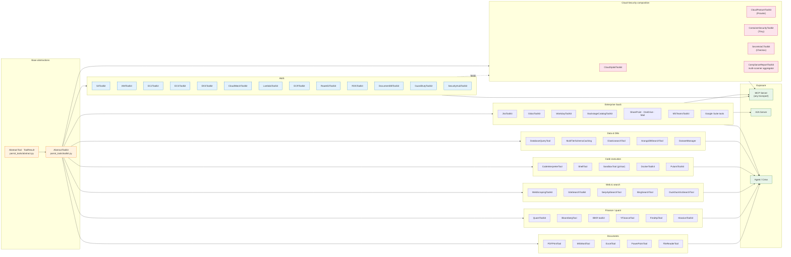

# 3. Toolkits for third-party services and Cloud-Security composition

> Part of the [Exposure, Interoperability & Hardening](README.md) set.
> Previous: [A2A](02-a2a.md) · Next: [Interaction surface](04-interaction-surface.md)

This chapter is a curated catalogue of toolkits in
`packages/ai-parrot-tools/src/parrot_tools/` that are most useful as
**building blocks for vendor-specific MCP servers** or for composing
domain agents (e.g. cloud-security audit, ERP integration, finance
research). Every toolkit inherits from `AbstractToolkit`
(`parrot_tools/toolkit.py`); each public async method automatically
becomes an agent tool through introspection — meaning a single
`MCPServer(toolkit=...)` line yields a fully functional MCP service.

## 3.1 Composition map



## 3.2 Atlassian / Jira

- `jiratoolkit.py` → **`JiraToolkit`** — issues, projects, transitions
  over basic / token / OAuth1 auth.
- `parrot/auth/jira_oauth.py:86` → **`JiraOAuthManager`** — Atlassian
  3LO with CSRF nonce, distributed token-refresh lock, cloud-id
  discovery, Redis-backed per-user token storage.

Recommended composition: `MCPServer(transport="sse", auth="oauth2_external")`
+ `JiraToolkit` → drop-in Atlassian MCP server.

## 3.3 Odoo ERP

- `odoo/toolkit.py` → **`OdooToolkit`** — Odoo 14–19+, JSON-2 / XML-RPC
  auto-detection, bulk CRUD, external-id upsert via `import_records`,
  binary upload helper.

## 3.4 AWS — service-by-service

| Toolkit                      | Class                  | Surface                                                  |
|------------------------------|------------------------|----------------------------------------------------------|
| `aws/s3.py`                  | `S3Toolkit`            | Buckets, ACL/policy, encryption, public-access analysis. |
| `aws/iam.py`                 | `IAMToolkit`           | Roles, users, policies, key audit, priv-esc detection.   |
| `aws/ec2.py`                 | `EC2Toolkit`           | Instance lifecycle, SGs, ENIs.                           |
| `aws/ecs.py`                 | `ECSToolkit`           | Clusters, services, tasks.                               |
| `aws/eks.py`                 | `EKSToolkit`           | EKS provisioning + management.                           |
| `aws/cloudwatch.py`          | `CloudWatchToolkit`    | Logs, metrics, alarms.                                   |
| `aws/route53.py`             | `Route53Toolkit`       | DNS records, health checks.                              |
| `aws/rds.py`                 | `RDSToolkit`           | Instances, snapshots, backups.                           |
| `aws/documentdb.py`          | `DocumentDBToolkit`    | DocumentDB management.                                   |
| `aws/lambda_func.py`         | `LambdaToolkit`        | Functions, versions, aliases.                            |
| `aws/ecr.py`                 | `ECRToolkit`           | Image registry + lifecycle.                              |
| `aws/guardduty.py`           | `GuardDutyToolkit`     | Threat findings + remediation.                           |
| `aws/securityhub.py`         | `SecurityHubToolkit`   | Aggregated findings + posture.                           |

## 3.5 Cloud Security composition

The Cloud-Security pattern is the strongest illustration of toolkit
composition. The five toolkits below cover scanning, IaC linting,
container image analysis, and unified compliance reporting:

| Toolkit                                         | Class                       | Engines                                  |
|-------------------------------------------------|-----------------------------|------------------------------------------|
| `cloudsploit/toolkit.py`                        | `CloudSploitToolkit`        | CloudSploit scanner orchestration.       |
| `security/cloud_posture_toolkit.py`             | `CloudPostureToolkit`       | Prowler (AWS / Azure / GCP / K8s).       |
| `security/container_security_toolkit.py`        | `ContainerSecurityToolkit`  | Trivy (images, FS, git, K8s, IaC).       |
| `security/secrets_iac_toolkit.py`               | `SecretsIaCToolkit`         | Checkov (Terraform, CFN, K8s, Helm…).    |
| `security/compliance_report_toolkit.py`         | `ComplianceReportToolkit`   | Multi-scanner aggregation + framework mapping. |

A cloud-security agent is built by registering all five plus the
relevant `aws/*` toolkits, exposing the composite as an MCP server, and
gating the destructive actions through PBAC
([chapter 5](05-hardening.md#54-tool-and-resource-access-control)).

## 3.6 Microsoft 365 and Google

- **MS Teams**: `msteams.py` → `MSTeamsToolkit` (messages, adaptive
  cards, meetings via Graph API).
- **O365 / SharePoint / OneDrive**: `o365/bundle.py` → `SharePointToolkit`,
  `OneDriveToolkit`, `o365/mail.py`.
- **Google**: `googlesearch.py`, `googlelocation.py`, `googleroutes.py`,
  `googlesitesearch.py`, `googlevoice.py`, all sharing
  `google/base.py:GoogleToolArgsSchema` + `GoogleAuthMode` (service
  account / user / cached).

## 3.7 Database & data

- `database/` + `databasequery.py` → `DatabaseQueryTool` (multi-DB SQL).
- `multidb.py` → `MultiTierSchemaCaching` (in-memory → vector → live).
- `elasticsearch.py`, `arangodbsearch.py`, `querytoolkit.py`.
- `dataset_manager/` → multi-source dataset loading.

## 3.8 Code execution and sandboxing

- `codeinterpreter/tool.py` → `CodeInterpreterTool` (analysis, doc-gen,
  test generation).
- `shell_tool/tool.py` → `ShellTool` — interactive PTY shell with
  plan-mode DAG + parallel command orchestration.
- `sandboxtool.py` → `SandboxTool` — gVisor (`runsc`) kernel-level
  isolation for LLM-generated code.
- `docker/toolkit.py` → `DockerToolkit` (container lifecycle + Compose).
- `pulumi/toolkit.py` → `PulumiToolkit` (IaC plan / apply / destroy).

## 3.9 Web & scraping

- `scraping/toolkit.py` → `WebScrapingToolkit` (Playwright/Selenium with
  AI-driven extraction).
- `sitesearch/toolkit.py`, `webapp_tool.py`, `serpapi.py`,
  `bingsearch.py`, `googlesearch.py`, `ddgsearch.py`.

## 3.10 Messaging, finance, HR and documents

| Domain         | Toolkits                                                                                                    |
|----------------|-------------------------------------------------------------------------------------------------------------|
| Messaging      | `messaging/whatsapp.py`, `notification.py`, `zoomtoolkit.py`.                                               |
| HR / ERP       | `workday/tool.py` (`WorkdayToolkit`, OAuth2 + Redis cache, multi-WSDL).                                     |
| Finance        | `quant/toolkit.py` (`QuantToolkit`), `bloomberg.py`, `ibkr/`, `yfinance.py`, `fred_api.py`, `massive/`.      |
| Documents      | `pdfprint.py`, `msword.py`, `excel.py`, `powerpoint.py`, `doc_converter.py`, `file/`, `file_reader.py`.     |
| DevTools       | `gittoolkit.py` (`GitToolkit`), `backstage/toolkit.py` (`BackstageCatalogToolkit`), `flowtask/tool.py`.     |
| Navigator      | `navigator/toolkit.py` → `NavigatorToolkit` (Programs, Modules, Dashboards, Widgets — extends Postgres).     |

## 3.11 Recipe — composing a vendor MCP server

```python
from parrot.mcp.server import MCPServer
from parrot_tools.jiratoolkit import JiraToolkit

toolkit = JiraToolkit(host=..., username=..., api_token=...)

server = MCPServer(
    name="atlassian-mcp",
    transport="sse",                     # ChatGPT-compatible
    auth="oauth2_external",              # delegate to corporate IdP
    allowed_tools=["jira_search_issues", "jira_get_issue",
                   "jira_create_issue", "jira_transition"],
)
server.register_tools(toolkit.get_tools())
await server.serve(host="0.0.0.0", port=8765)
```

The exact same shape works for Odoo, AWS, CloudSploit, Workday or any
combination thereof.
