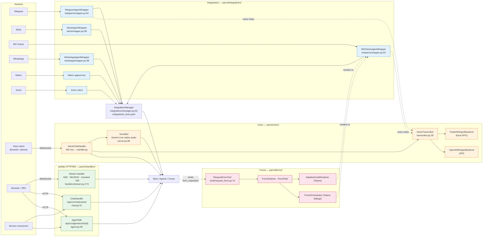

# 4. Interaction surface — WebSockets, audio, integrations

> Part of the [Exposure, Interoperability & Hardening](README.md) set.
> Previous: [Toolkits](03-toolkits.md) · Next: [Hardening](05-hardening.md)

AI-Parrot speaks to humans through a deliberately polyglot front. Every
channel resolves down to the same agent / chatbot abstractions; the
channel only shapes the I/O envelope.

## 4.1 Channel topology

## 4.2 Integrations

| Channel      | Entry point                                                            | Highlights                                                                                                                                              |
|--------------|------------------------------------------------------------------------|---------------------------------------------------------------------------------------------------------------------------------------------------------|
| Telegram     | `parrot/integrations/telegram/wrapper.py:62` — `TelegramAgentWrapper`  | Text, photos, documents, **voice notes (STT)**, inline keyboards, commands (`/ask`, `/login`, `/add_mcp` …), groups & supergroups, crew routing.        |
| Slack        | `parrot/integrations/slack/wrapper.py:68` — `SlackAgentWrapper`        | Events API + Socket Mode, files, buttons / select menus, threads, async background processing.                                                          |
| MS Teams     | `parrot/integrations/msteams/wrapper.py:63` — `MSTeamsAgentWrapper`    | Bot Framework, Adaptive Cards, **voice transcription**, multi-step **wizard dialogs** via `FormOrchestrator` (`dialogs/orchestrator.py:1`).             |
| WhatsApp     | `parrot/integrations/whatsapp/wrapper.py:38` — `WhatsAppAgentWrapper`  | Meta Cloud API, 24-hour messaging-window tracking, per-user sessions, phone allowlist.                                                                  |
| Matrix       | `parrot/integrations/matrix/appservice.py`                             | Appservice protocol, A2A transport, multi-agent crew coordinator (`matrix/crew/coordinator.py`), real-time streaming.                                   |
| Zoom         | `parrot/integrations/zoom/client.py`                                   | Proof-of-concept client wrapper.                                                                                                                        |
| Filesystem   | `parrot/transport/filesystem/{channel,transport,cli}.py`               | File-based channels for testing and local development.                                                                                                  |

Per-bot configuration lives in `integrations_bots.yaml`; the manager
(`integrations/manager.py:60`) keeps `telegram_bots`, `slack_bots`,
`msteams_bots`, `whatsapp_bots` registries.

OAuth flows initiated from chat (Jira sign-in from Telegram, etc.) go
through the centralised registry in `integrations/oauth2/` and the
provider-specific implementations in `integrations/oauth2/jira_provider.py`
and `parrot/auth/jira_oauth.py`.

## 4.3 Audio and voice

Voice uses a unified service `VoiceTranscriber` (`parrot/voice/transcriber/transcriber.py:30`)
with two pluggable backends:

- `FasterWhisperBackend` (`faster_whisper_backend.py:21`) — local GPU
  inference. Models `tiny / base / small / medium / large-v3`, devices
  `cuda / cpu / auto`, precisions `float16 / int8 / float32`. Zero API
  cost.
- `OpenAIWhisperBackend` (`openai_backend.py:23`) — Whisper API with
  exponential backoff for rate limits.

Supported audio formats (`transcriber.py:62`): `.ogg`, `.mp3`, `.wav`,
`.m4a`, `.webm`, `.mp4`, `.flac` — covering Telegram OPUS, MS Teams
attachments and arbitrary file uploads.

For real-time bidirectional audio, the **VoiceBot** stack
(`parrot/voice/server.py:66`) integrates Google Gemini Live native-audio
models (`gemini-2.5-flash-native-audio-preview`) with VAD, streaming
mode and buffered mode, all driven over WebSocket (§4.4).

## 4.4 WebSocket endpoints

Three independent WebSocket surfaces are exposed:

- **Voice chat** — `parrot/voice/handler.py:VoiceChatHandler`. Routes
  `GET /ws` (or `/api/v1/voice/ws`). JSON message protocol with frames
  `auth`, `start_session`, `audio_chunk` (base64), `send_text`,
  `start_recording`. JWT carried in `Sec-WebSocket-Protocol` or in the
  body. Supports streaming and buffered modes, VAD, **tool execution
  inside a voice turn**.
- **Slack Socket Mode** — `slack/socket_handler.py:SlackSocketHandler`.
  Outbound WebSocket to Slack's gateway for firewall-restricted
  deployments (no inbound HTTP needed).
- **Agent stream** — `handlers/stream.py:173`. `GET /bots/{bot_id}/stream/ws`
  for raw streaming of agent responses; companion endpoints `…/sse`,
  `…/ndjson`, `…/chunked` for HTTP variants.

## 4.5 HTTP API

The aiohttp surface mounted under `/api/v1/` covers:

| Endpoint                                          | Handler                              | Notes                                                                  |
|---------------------------------------------------|--------------------------------------|------------------------------------------------------------------------|
| `POST /api/v1/chat/{chatbot_name}`                | `ChatHandler` (`handlers/chat.py:41`) | RAG + vector search, model override, multipart files, custom methods.  |
| `POST /api/v1/agents/chat/{agent_id}`             | `AgentTalk` (`handlers/agent.py:55`) | Multi-format output (JSON / HTML / Markdown / Terminal), PBAC context. |
| `PATCH /api/v1/agents/chat/{agent_id}`            | `AgentTalk`                          | Configure ToolManager + MCP servers (`agent.py:1602`).                 |
| `PUT /api/v1/agents/chat/{agent_id}`              | `AgentTalk`                          | Reset / update agent state (`agent.py:1726`).                          |
| `GET /api/v1/agents/chat/`                        | `AgentTalk`                          | List available agents (`agent.py:1824`).                               |
| `POST /bots/{bot_id}/stream/{sse|ndjson|chunked}` | streaming handlers                   | Plain HTTP streaming variants.                                         |

## 4.6 Forms and interactive UI

`parrot/forms/` provides a platform-agnostic form schema:

- `schema.py:19` — `FormField`, `FormSection`, `FormSchema` (text, select,
  multi-select, date, file, group, array). Conditional visibility and
  validation are first-class.
- `tools/request_form.py:74` → `RequestFormTool` — when an agent needs
  parameters it can't infer, it emits `ToolResult(status="form_requested",
  metadata={"form": schema})`. The wrapping integration (Teams Adaptive
  Card, Telegram inline keyboard, web SPA) renders the form, validates
  the answer, and resumes the original tool call. The MS Teams adapter
  (`msteams/dialogs/`) ships ready-made simple / wizard / conversational
  presets and a `FormOrchestrator`.

This is what powers the "ask-clarifying-question" UX in chat platforms
without bolting custom dialog logic onto each integration.
