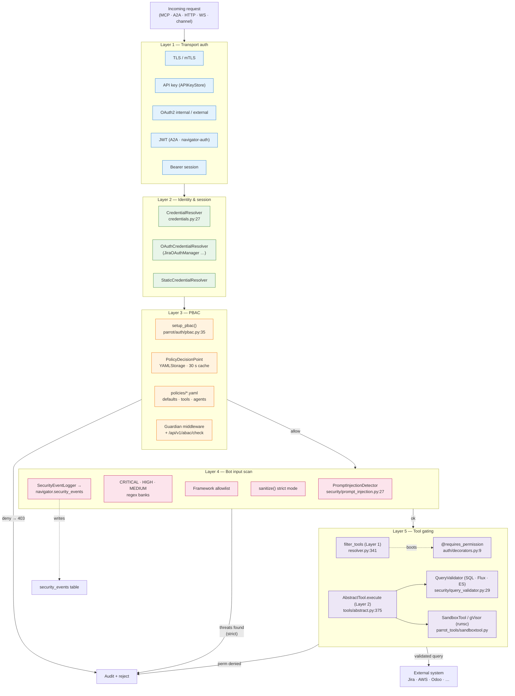

# 5. Hardening — anti-prompt-injection, PBAC and tool gating

> Part of the [Exposure, Interoperability & Hardening](README.md) set.
> Previous: [Interaction surface](04-interaction-surface.md) · Next: [Cross-cutting](06-cross-cutting.md)

Hardening is layered: every request crosses **transport auth → user
session → PBAC policy → tool-level resolver → injection scanner →
sandboxed execution**, in that order. Each layer can deny independently
and is logged.

## 5.1 Defence-in-depth pipeline



## 5.2 Authentication backends

`parrot/auth/credentials.py:27` defines the resolver hierarchy:

- `CredentialResolver` — abstract base.
- `OAuthCredentialResolver` (`credentials.py:49`) — per-user OAuth 2.0
  tokens (delegates to providers like `JiraOAuthManager`).
- `StaticCredentialResolver` (`credentials.py:81`) — legacy basic /
  token credentials for service accounts.

`JiraOAuthManager` (`parrot/auth/jira_oauth.py:86`) is the reference
implementation of a 3LO flow — CSRF state nonce with 10-minute Redis
TTL, distributed refresh lock to avoid token loss under concurrency,
cloud-id discovery via `accessible-resources`, identity resolution via
`/rest/api/3/myself`, and per-`channel:user_id` token storage in Redis
with 90-day TTL. Rotating refresh tokens are handled at lines 31–45.

The protocol matrix actually wired up today:

| Protocol           | Implementation                                                                              |
|--------------------|---------------------------------------------------------------------------------------------|
| OAuth 2.0 (Jira)   | `JiraOAuthManager` — Atlassian 3LO + Redis store.                                           |
| API key (static)   | `StaticCredentialResolver` (token).                                                         |
| Basic auth         | `StaticCredentialResolver` (username/password).                                             |
| MCP API key        | `APIKeyStore` (`mcp/oauth.py:41`) — TTL + scopes.                                           |
| MCP OAuth internal | `OAuthAuthorizationServer` (`mcp/oauth.py:374`) — RFC 7591 + PKCE.                          |
| MCP OAuth external | `ExternalOAuthValidator` (`mcp/oauth.py:211`) — RFC 7662 introspection + audience checks.   |
| A2A JWT/Bearer/mTLS| `JWTAuthenticator` + `A2ASecurityMiddleware` (`a2a/security.py:890`, `:1327`).              |
| Bearer (Navigator) | navigator-auth session middleware (`mcp/transports/base.py:263`).                           |

## 5.3 Anti-prompt-injection

`parrot/security/prompt_injection.py:27` ships the
`PromptInjectionDetector`. It is **defence in depth** rather than a
silver bullet: regex pattern banks plus a framework allowlist that
strips AI-Parrot's own metadata wrappers before scanning, to avoid
self-flagging.

Pattern severity is split in three (`prompt_injection.py:33–86`):

- **CRITICAL** — direct instruction override, memory wipe, role
  hijacking, "ignore all previous…" variants.
- **HIGH** — system role impersonation, `<system>` tag injection,
  instruction replacement.
- **MEDIUM** — prompt extraction probes, instruction-disclosure asks.

`sanitize()` (`prompt_injection.py:191`) returns
`(sanitized_text, threats)`. In `strict=True` mode, CRITICAL + HIGH
matches are replaced before the prompt reaches the LLM. Detector output
is recorded by `SecurityEventLogger` (`prompt_injection.py:222`) which
writes to `navigator.security_events` (`prompt_injection.py:289`) with
threat severity, the original and sanitised inputs, and request
metadata.

The detector is invoked from `AbstractBot.post_login()` so every
incoming message — Telegram voice transcript, Slack DM, HTTP chat call —
is screened before tools fire.

## 5.4 PBAC — Policy-Based Access Control

`parrot/auth/pbac.py:35` (`setup_pbac`) wires the navigator-auth
PolicyEvaluator into the aiohttp app:

- Loads YAML policies from `policies/` and per-agent overrides from
  `policies/agents/` (`pbac.py:132`).
- Builds a `PDP` backed by `YAMLStorage` with a short cache TTL (default
  30 s, `pbac.py:115`) so time-dependent rules respond quickly.
- Registers Guardian middleware and the ABAC REST endpoint
  `POST /api/v1/abac/check` (`pbac.py:188`).

Policy language (YAML):

- **Resources**: `agent:*`, `agent:finance_*`, `tool:jira_*`, `kb:*`,
  `uri:*`, `mcp:*`.
- **Actions**: `agent:chat`, `agent:configure`, `tool:execute`,
  `tool:list`, `kb:query`.
- **Subjects**: groups and roles, with optional `exclude_groups`.
- **Conditions**: time-based (e.g. `is_business_hours: true` —
  `agents.yaml:42`).
- **Priority**: higher first; DENY wins at equal priority.
- **Default effect**: `deny` (defaults.yaml:14) — deny-by-default.

Stock policies shipped under `policies/`:

| File              | Purpose                                                                  |
|-------------------|--------------------------------------------------------------------------|
| `defaults.yaml`   | Baseline allow for `list` / `discover`; superuser unrestricted.          |
| `tools.yaml`      | `engineering → jira_*`, `devops → all`, `finance → financial_*`, contractor deny. |
| `agents.yaml`     | Agent chat / configure with business-hours conditions and contractor deny.|

## 5.5 Tool and resource access control

Two enforcement points:

**Layer 1 — prevention (filtering).** `PBACPermissionResolver.filter_tools()`
(`parrot/auth/resolver.py:341` / `:371`) is invoked when an agent boots a
session. It batch-evaluates the agent's tool list against
`PolicyEvaluator.filter_resources()`. Forbidden tools never reach the
LLM, so the model cannot even mention them.

**Layer 2 — reactive check.** Even if a tool slips through, every call
goes through `AbstractTool.execute()` (`parrot/tools/abstract.py:375`):

```python
pctx     = kwargs.pop("_permission_context", None)
resolver = kwargs.pop("_resolver", None)
required = getattr(self, "_required_permissions", [])
if resolver and pctx and required:
    if not await resolver.can_execute(pctx, self.name, required):
        return ToolResult(status="forbidden", ...)
```

Tools declare their permissions with the `@requires_permission(*perms)`
decorator (`parrot/auth/decorators.py:9`) — OR semantics. Tools without
declared permissions are unrestricted by design; PBAC remains the policy
gate for those.

The MCP layer plugs into the same flow via `allowed_tools` / `blocked_tools`
on the server, plus the per-call resolver injection performed by the
HTTP / SSE / WS handlers.

## 5.6 A2A and skill ACLs

`A2ASecurityMiddleware` (`a2a/security.py:1327`) does authentication +
per-skill authorisation. The `CredentialProvider` stores per-agent
permission strings (`skill:analyze_data`, `skill:*`); the middleware
matches the requested skill against them before the agent is invoked.

## 5.7 Rate limiting, audit and query safety

- **Rate limiting** — `SecurityPolicy.rate_limit` and `rate_limit_burst`
  (`a2a/security.py:19`); enforced before authorisation
  (`security.py:253`).
- **Audit** — `SecurityEventLogger` (prompt injection),
  `PBACPermissionResolver.can_execute()` warnings on denial
  (`resolver.py:331`), navigator-auth Guardian access logs.
- **Query validator** — `parrot/security/query_validator.py:29` parses
  SQL via `sqlglot`, rejects DDL, and forces `WHERE` + PK presence on
  `UPDATE` / `DELETE`. Flux queries with `to()` / `delete()` are
  rejected. Elasticsearch DSL gets a structural sanity check.

## 5.8 Secrets handling

Three storage strategies:

1. **Redis** — Jira OAuth tokens keyed `jira:oauth:{channel}:{user_id}`
   (`jira_oauth.py:37`), `JiraTokenSet` Pydantic model.
2. **Environment** — `AWS_ACCESS_KEY_ID`, `AWS_SECRET_ACCESS_KEY`,
   `AWS_DEFAULT_REGION` (`security/base_executor.py:48`).
3. **Static config** — `StaticCredentials` (`credentials.py:70`).

There is currently **no native Vault / Secrets-Manager integration** —
that is the obvious next hardening step for production deployments
(see [chapter 6](06-cross-cutting.md#63-open-work)).

## 5.9 Tool-side defensive helpers

Under `packages/ai-parrot-tools/src/parrot_tools/security/`:

- `BaseExecutor` (`base_executor.py:25`) — abstract CLI scanner runner
  (Docker or direct), supports AWS / GCP / Azure profile injection.
- `BaseParser` (`base_parser.py:15`) — normaliser for Prowler / Trivy /
  Checkov outputs into a unified `ScanResult` + `SecurityFinding` model.

These are what `ContainerSecurityToolkit` and friends use under the hood
and what makes the unified `ComplianceReportToolkit` possible
([chapter 3](03-toolkits.md#35-cloud-security-composition)).
