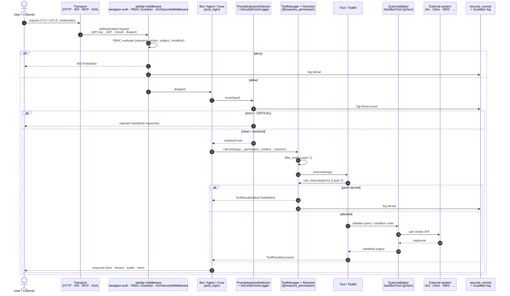
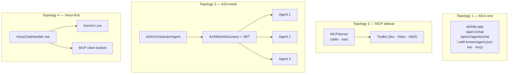

# 6. Cross-cutting concerns and reference deployment

> Part of the [Exposure, Interoperability & Hardening](README.md) set.
> Previous: [Hardening](05-hardening.md) · Next: [AgentCrew](07-agentcrew.md)

## 6.1 End-to-end request path

The diagram below traces a single user message from any channel down to
the external vendor and back, naming every layer it crosses.

## 6.2 Deployment topologies

- **All-in-one HTTP service** — single aiohttp app exposing
  `/api/v1/chat`, `/api/v1/agents/chat`, `/.well-known/agent.json`, the
  voice WebSocket, and an MCP HTTP/SSE endpoint. Good fit for internal
  copilots.
- **MCP-only sidecar** — `MCPServer(transport="stdio"|"sse")` packaged
  as a vendor connector (Atlassian-MCP, Odoo-MCP, AWS-MCP). PBAC and
  prompt-injection are still active because they live on the toolkit /
  agent layer.
- **A2A mesh** — multiple agents registered through `A2AMeshDiscovery`
  with `JWTAuthenticator` and an orchestrator routing through
  `A2AProxyRouter`.
- **Voice-first agent** — VoiceChatHandler WebSocket fronting a
  `MCPClient` toolset with Gemini Live native audio.

## 6.3 Open work

- Prompt-injection detector currently regex-only; a classifier-based
  second stage is the natural next step.
- Vault / Secrets-Manager backend for `CredentialResolver`.
- Durable task store for `A2AServer._tasks` (today in-memory).
- Rate limiting on MCP transports (today only on A2A).
- Prompt registry on the MCP `prompts/list` dispatcher (currently a
  stub).

## 6.4 Pointers for reviewers

| Concern                 | Read first                                                     |
|-------------------------|---------------------------------------------------------------|
| Add a new MCP transport | `parrot/mcp/transports/base.py` + an existing transport file. |
| Add a new auth backend  | `parrot/auth/credentials.py` and `parrot/mcp/oauth.py`.       |
| Expose a crew over A2A  | `parrot/a2a/server.py` and `bots/orchestration/a2a_orchestrator.py`. |
| Add a vendor toolkit    | `parrot_tools/abstract.py` + `parrot_tools/toolkit.py` + an existing toolkit (e.g. `jiratoolkit.py`). |
| Tighten policies        | `policies/*.yaml` and `parrot/auth/pbac.py`.                  |
| Harden a tool           | `@requires_permission` in `parrot/auth/decorators.py`, plus PBAC YAML. |
