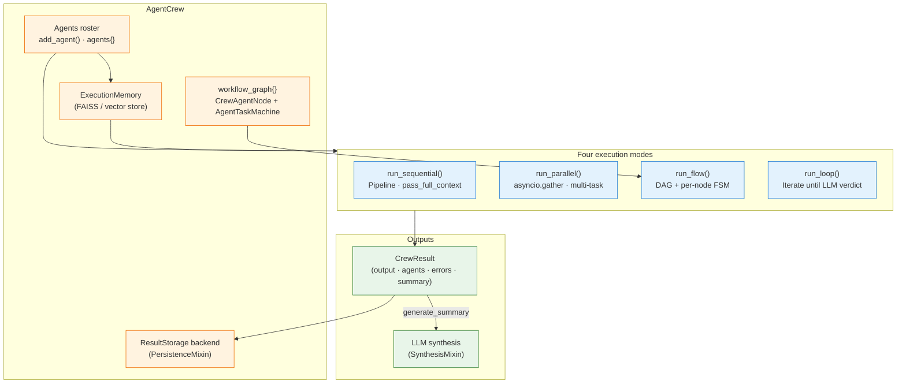
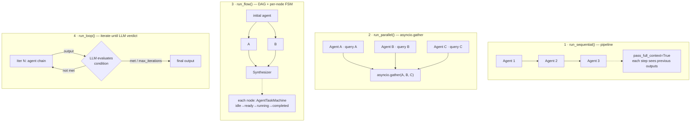

# 7. AgentCrew — Sequential, Parallel, Flow and Loop execution

> Part of the [Exposure, Interoperability & Hardening](README.md) set.
> Previous: [Cross-cutting](06-cross-cutting.md) · Next: [AgentsFlow](08-agentsflow-dag.md)

`AgentCrew` is the multi-mode orchestrator that sits one level above
`Agent` / `Chatbot`. Where a single agent reasons about a single
prompt, a crew owns a *roster of agents* and chooses **how** they are
combined to answer a request. The same crew object exposes four
execution modes — `run_sequential`, `run_parallel`, `run_flow` and
`run_loop` — and the caller picks one per invocation. The "Flow" mode
introduces a per-node FSM lifecycle that the other three modes also
benefit from for telemetry and recovery.

Source of truth:
`packages/ai-parrot/src/parrot/bots/orchestration/crew.py` (legacy
import path, ~3.6k lines) and the refactored
`packages/ai-parrot/src/parrot/bots/flows/crew/crew.py`. Both expose
the same `AgentCrew` class; the second module is what `parrot.bots.flows`
re-exports.

## 7.1 Execution-mode overview



A crew always returns a `CrewResult` (`packages/ai-parrot/src/parrot/models/crew.py`)
regardless of the mode that produced it: the same Pydantic model carries
`output`, `responses`, `agents` (per-agent `AgentExecutionInfo`),
`errors`, `execution_log`, `total_time`, `status` and an optional
`summary`. Downstream consumers therefore never branch on which mode
was used.

## 7.2 Shared infrastructure

| Component                              | File                                                                         | Role                                                                  |
|----------------------------------------|------------------------------------------------------------------------------|-----------------------------------------------------------------------|
| `AgentTaskMachine`                     | `parrot/bots/flows/core/fsm.py`                                              | Per-node FSM (`idle → ready → running → completed/failed/blocked`).  |
| `AgentNode` / `CrewAgentNode`          | `parrot/bots/flows/core/node.py` + `parrot/bots/flows/crew/nodes.py`         | Wraps an agent, owns its FSM, runs pre/post action hooks.             |
| `FlowContext`                          | `parrot/bots/flows/core/context.py`                                          | Tracks `completed_tasks`, `active_tasks`, `responses`, `errors`.      |
| `ExecutionMemory`                      | `parrot/bots/flows/core/storage/`                                            | Stores `AgentResult`s; optional FAISS vectorisation.                  |
| `PersistenceMixin` + `SynthesisMixin`  | `parrot/bots/flows/core/storage/`                                            | Async result persistence and LLM-driven summarisation.                |
| `build_agent_metadata` / `CrewResult`  | `parrot/models/crew.py`                                                      | Canonical result shape consumed by every execution mode.              |

Every mode wires the same FSM transitions (`schedule → start →
succeed`/`fail`) so that observability and retry semantics are uniform
even when the topology is trivial (sequential / parallel) and only the
`run_flow` mode actually uses the DAG.

## 7.3 Four execution modes



### 7.3.1 Sequential — `run_sequential()`

Pipeline pattern: agents fire one after another, each receiving the
previous output. With `pass_full_context=True` (default) every later
agent sees a context summary of all earlier agents through
`_build_context_summary()`. Useful for *research → analyse → write*
chains. Even though the topology is linear, every step still pumps the
node FSM through `schedule → start → succeed` so failures and
execution times are recorded the same way as the DAG mode.

```python
crew = AgentCrew(name="Briefing")
crew.add_agent(researcher)
crew.add_agent(analyzer)
crew.add_agent(writer)

result = await crew.run_sequential(
    query="Summarise Q1 cloud-spend anomalies",
    pass_full_context=True,
    generate_summary=True,
)
```

### 7.3.2 Parallel — `run_parallel()`

Independent fan-out. The caller passes a `tasks` list of
`{agent_id, query}` dicts and the crew schedules them all through a
single `asyncio.gather`. Outputs are merged into one `CrewResult` and
optionally synthesised by the configured LLM. Best when the agents
share a problem but don't need each other's intermediate results
(market analyst + risk analyst + technical analyst, each looking at the
same ticker).

```python
result = await crew.run_parallel(
    tasks=[
        {"agent_id": "macro",     "query": "Macro outlook for AAPL"},
        {"agent_id": "risk",      "query": "Risk factors for AAPL"},
        {"agent_id": "technical", "query": "Technical setup for AAPL"},
    ],
    generate_summary=True,
)
```

### 7.3.3 Flow — `run_flow()` (DAG + per-node FSM)

The most expressive of the four modes. The caller declares the
topology with `task_flow(source, targets)`; AgentCrew builds a directed
acyclic graph (`workflow_graph`) where each node carries its own FSM
(`CrewAgentNode.fsm`). At runtime the crew repeatedly:

1. Computes ready agents — those whose `dependencies` are in
   `context.completed_tasks` and who are not already active or failed
   (`_get_ready_agents`, `crew.py:789`).
2. Fires every ready agent in a single wave through
   `_execute_parallel_agents` (`crew.py:627`), gating concurrency with
   `max_parallel_tasks` and pumping each node FSM
   (`schedule → start → succeed/fail`).
3. Marks the wave's outputs in `FlowContext` so the next iteration can
   release blocked successors. The loop exits when `final_agents` (no
   successors) are all completed, or when `max_iterations` is reached
   (defensive against malformed graphs).

```python
crew.task_flow(writer,           [editor1, editor2])
crew.task_flow([editor1, editor2], final_reviewer)
crew.task_flow(final_reviewer,    publisher)

result = await crew.run_flow(
    initial_task="Draft the launch announcement",
    on_agent_complete=callback,
)
```

`validate_workflow()` (`crew.py:2404`) walks the graph DFS-style and
raises if it detects a cycle. `visualize_workflow()` returns a textual
adjacency dump for quick debugging.

#### Why "Flow based on FSM"

The orchestrator itself is **not** a state machine — it is a wave
scheduler over a DAG. What makes the mode FSM-aware is that *each
node* owns an `AgentTaskMachine` with a strict lifecycle:

```
idle ── schedule ─▶ ready ── start ─▶ running ── succeed ─▶ completed
                                          └─ fail ─▶ failed ── retry ─▶ ready
                                                          └─ block ─▶ blocked
```

This is what unlocks per-agent retries, structured error recording,
and `on_agent_complete` callbacks fired exactly once at the moment a
node enters the `completed` state. Chapter 8 builds on the same FSM
primitive but exposes it through a richer transition vocabulary
(`on_success`, `on_error`, `on_condition`, …).

### 7.3.4 Loop — `run_loop()`

Iterative refinement. The caller supplies an `initial_task` and a
natural-language `condition` describing the success criterion. After
every iteration the crew calls the configured LLM
(`gemini-2.5-pro` by default) with the latest output and asks
whether the condition is satisfied. Iteration N+1 receives N's output
as input. The loop exits when the LLM answers *yes* or when
`max_iterations` is reached.

Because agents in `completed` state can't re-execute (the FSM marks
`completed` as final), `run_loop` rebuilds a fresh
`AgentTaskMachine` per node at the start of each iteration
(`crew.py:1497`). This keeps the per-step lifecycle observable while
allowing the higher-level loop to be unbounded in number of attempts.

```python
result = await crew.run_loop(
    initial_task="Draft a press release",
    condition="The release has a clear hook, three benefits and a CTA",
    max_iterations=4,
    pass_full_context=True,
)
```

## 7.4 Result aggregation, synthesis and persistence

All four modes write into `ExecutionMemory` so downstream agents can
retrieve previous outputs by semantic similarity (when an
`embedding_model` is configured) or by ordered recall (default).
`AgentResult` carries `task`, `result`, `metadata['mode']` and
`execution_time`; the same store is queried by `ResultRetrievalTool`
when an agent in the next iteration needs to look up what a sibling
produced.

`SynthesisMixin._synthesize_results` (`parrot/bots/flows/core/storage/synthesis.py`)
optionally merges every individual result into a single LLM-generated
`summary` via `SYNTHESIS_PROMPT`. `PersistenceMixin._save_result` then
persists the `CrewResult` through the configured `ResultStorage`
backend (file / Redis / Postgres) — fire-and-forget, tracked through
`self._persist_tasks` so the crew can await them on shutdown.

## 7.5 When to pick which mode

| Need                                                | Mode          | Why                                                                  |
|-----------------------------------------------------|---------------|----------------------------------------------------------------------|
| Pure refinement chain                               | sequential    | Each step sees full context; no graph to maintain.                   |
| Independent perspectives on the same input          | parallel      | One `asyncio.gather` is cheaper than wiring a DAG.                   |
| Mixed sequential + parallel (fan-out / fan-in)      | flow          | DAG + per-node FSM with auto-parallelisation.                        |
| Reach a quality bar by retrying with fresh context  | loop          | LLM judges the stopping condition; FSM resets per iteration.         |
| Conditional branching, error handlers, HITL gates   | **AgentsFlow**| Use chapter 8 — purpose-built DAG with transition predicates.        |

The boundary with chapter 8 is deliberate: AgentCrew is the
"Swiss-army crew" that knows how to run a roster four different ways;
AgentsFlow is the **dedicated DAG executor** with first-class
conditional transitions, decision nodes and JSON-serialisable flow
definitions.

## 7.6 Recipe — building a four-mode crew

```python
from parrot.bots.flows import AgentCrew, OrchestratorAgent

crew = AgentCrew(
    name="ResearchCrew",
    agents=[researcher, analyzer, writer, reviewer],
    max_parallel_tasks=8,
    llm="google",                       # for run_loop verdicts + synthesis
    enable_analysis=True,               # FAISS-backed ExecutionMemory
)

# 1) Sequential
brief = await crew.run_sequential(query="Summarise Q1 anomalies")

# 2) Parallel — three independent perspectives on the same ticker
opinions = await crew.run_parallel(tasks=[
    {"agent_id": "researcher", "query": "Latest filings on AAPL"},
    {"agent_id": "analyzer",   "query": "Risk profile for AAPL"},
    {"agent_id": "writer",     "query": "Investor letter for AAPL"},
])

# 3) Flow — DAG with per-node FSM
crew.task_flow(researcher, [analyzer, writer])
crew.task_flow([analyzer, writer], reviewer)
report = await crew.run_flow(
    initial_task="Build the Q1 deep-dive",
    on_agent_complete=lambda name, out, ctx: log(name, out),
)

# 4) Loop — iterate until the LLM accepts the result
draft = await crew.run_loop(
    initial_task="Draft the closing narrative",
    condition="Three crisp bullet points and a one-line takeaway",
    max_iterations=5,
)
```

The shared `CrewResult`, the FSM lifecycle and the persistence backend
keep the surface uniform; the choice of mode is purely a *coordination
strategy* on top of the same agent roster.

## 7.7 Per-agent result persistence & deterministic execution documents (FEAT-306)

Section 7.4 described the crew-level persist: one `FlowResult` written
to `crew_executions` at the end of a run. FEAT-306 adds a **second,
finer-grained plane** — every individual agent result is also persisted
as it completes, and the two planes are joined by a new crew-level
`execution_id` so the full run can be reconstructed later, even from a
different process.

### Two-plane persistence model

```
AgentCrew.run_*()
   │  execution_id = uuid4()               (generated once per run, all 4 modes)
   ├─ per agent finished ──→ ExecutionMemory.add_result(NodeResult)      [unchanged, in-memory]
   │                     └─→ PersistenceMixin._save_agent_result(...)  ──→ ResultStorage.save("crew_agent_results", doc)
   │
   └─ run end ──→ CrewExecutionDocument.from_memory(...)
                       └─→ PersistenceMixin._save_result(doc, ...)     ──→ ResultStorage.save("crew_executions", doc)
```

- **`crew_agent_results`** — one document per agent, written
  incrementally (fire-and-forget) the moment each `NodeResult` is added
  to `ExecutionMemory`. Linked to the run via `execution_id` and, for
  Redis, keyed as `{collection}:{execution_id}:{node_execution_id}`.
- **`crew_executions`** — unchanged collection name, but the persisted
  document is now a `CrewExecutionDocument.to_dict()` (a superset of the
  previous `FlowResult.to_dict()` shape) instead of the bare
  `FlowResult`. It embeds `execution_id`, the full ordered
  `agent_results` list, and `execution_order`.

Both writes follow the same fire-and-forget + `self._persist_tasks`
tracking pattern as the original crew-level persist, so `aclose()`
drains both planes before releasing the storage backend.

### Opt-outs

```python
crew = AgentCrew(
    name="ResearchCrew",
    agents=[researcher, analyzer],
    persist_results=True,           # master switch — False disables BOTH planes
    persist_agent_results=False,    # granular — disables ONLY the per-agent writes
)
```

`persist_agent_results` has no effect when `persist_results=False` — the
per-agent plane is already gated by the master switch first.

### Read API — `ResultStorage.fetch()`

All three built-in backends (`DocumentDbResultStorage`,
`RedisResultStorage`, `PostgresResultStorage`) implement:

```python
async def fetch(self, collection: str, execution_id: str) -> list[dict]:
    """Return every document in *collection* whose execution_id matches."""
```

Backend notes:

- **Redis** — `fetch()` uses cursor-based `SCAN` (never `KEYS`) with
  pattern `{collection}:{execution_id}:*`, then `GET`s each matched key.
  Only documents written with the new key scheme (i.e. carrying an
  `execution_id`) are fetchable this way; pre-FEAT-306 documents keep
  the legacy `{collection}:{crew_name}:{timestamp_ms}` key and are not
  retrievable by `execution_id`.
- **Postgres** — the DDL gained an `execution_id text` column + index,
  added via an idempotent `ALTER TABLE ... ADD COLUMN IF NOT EXISTS` so
  existing tables pick it up automatically on first write after
  upgrading. `fetch()` issues a `SELECT ... WHERE execution_id = $1`.
- **DocumentDB** — `fetch()` is a straightforward query filtered on the
  `execution_id` field.
- The base `ResultStorage.fetch()` raises `NotImplementedError` by
  default (non-abstract), so third-party backends written before
  FEAT-306 remain importable and usable for `save()`-only workloads.

### `CrewExecutionDocument` — deterministic, LLM-free reconstruction

`CrewExecutionDocument` (`parrot.bots.flows.core.storage`) assembles
every agent's result + the final crew output + the (already-generated)
summary into one consistent record. Both `to_dict()` and `to_markdown()`
are pure data transformations — **zero LLM calls**, deterministic
(identical output on repeated calls for the same instance).

Two ways to obtain one:

```python
# 1. In-process — from the crew's own state after (or during) a run.
doc = crew.build_execution_document()   # None if no run has completed yet

# 2. From storage — reconstructs from ANY process, using only the
#    execution_id (e.g. looked up from a job queue or a webhook payload).
doc = await CrewExecutionDocument.from_storage(
    crew._result_storage, execution_id,
)
```

`from_storage()` treats the consolidated `crew_executions` document as
the primary source for `agent_results`; standalone `crew_agent_results`
documents fill in any agent missing from it (e.g. a crash-interrupted
run that finished writing per-agent docs but never reached the final
consolidated write). Agents are ordered by the consolidated doc's
`execution_order`, falling back to per-agent timestamps for stragglers.
It returns `None` only when *both* collections come up empty for the
given `execution_id`.

`to_markdown()` renders a self-contained report — abridged example:

```
# Crew Execution Report — ResearchCrew

| Field | Value |
|---|---|
| Execution ID | 3f9c2e11-... |
| Method | run_sequential |
| Status | completed |
| Total Time | 4.812s |
| Timestamp | 2026-07-14T01:22:14+00:00 |

## Agent: researcher

**Task:** Summarise Q1 anomalies
...

## Final Result

...

## Summary

...
```

### Backward compatibility

- All four `run_*()` methods still return a plain `FlowResult` — no
  signature change. `result.output`, `result.summary`, `result.status`
  behave exactly as before; `result.metadata["execution_id"]` is the
  only new field.
- A `ResultStorage` subclass written before FEAT-306 (implementing only
  `save()` / `close()`, no `fetch()`) continues to work unchanged for
  writes; it simply can't back `CrewExecutionDocument.from_storage()`.
- Persistence failures — on either plane — never propagate to the
  caller; they are logged as warnings only, matching the existing
  `_save_result` contract.
