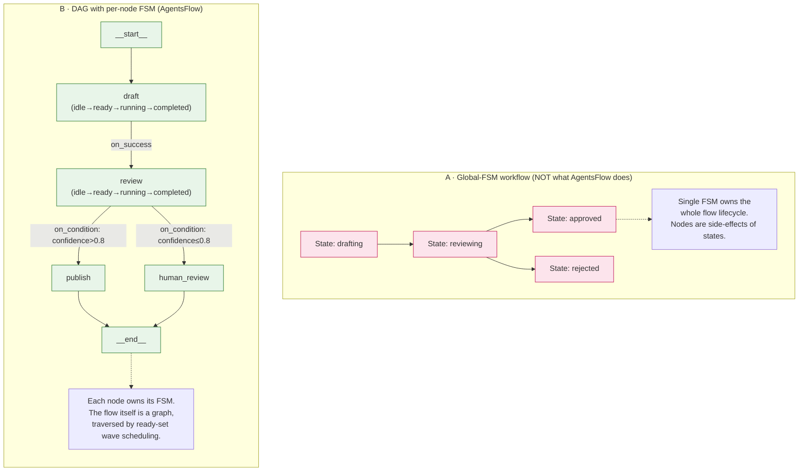
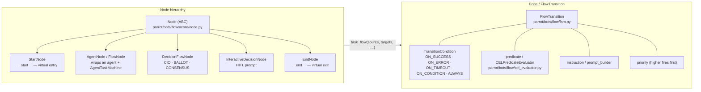
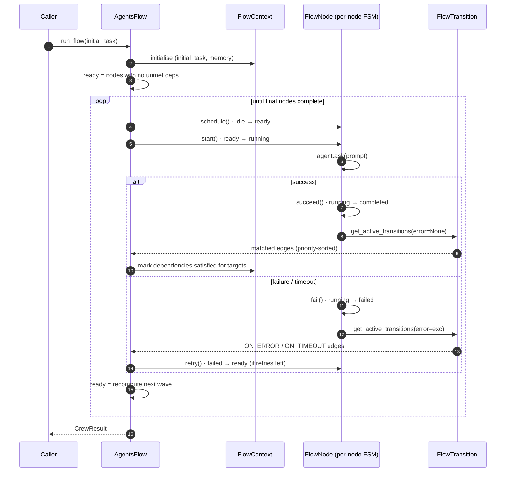
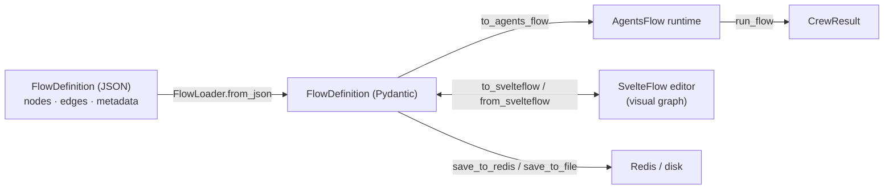

# 8. AgentsFlow — DAG-first orchestration with per-node FSM

> Part of the [Exposure, Interoperability & Hardening](README.md) set.
> Previous: [AgentCrew](07-agentcrew.md) · Next: [Ontologic RAG](09-ontologic-rag.md)

`AgentsFlow` (`packages/ai-parrot/src/parrot/bots/flow/fsm.py:278`) is
AI-Parrot's dedicated **Directed Acyclic Graph executor**. Where
`AgentCrew.run_flow()` reuses the crew machinery to walk a graph,
`AgentsFlow` is built around the graph from the ground up: it
materialises a node hierarchy (`StartNode`, agent nodes,
`DecisionFlowNode`, `InteractiveDecisionNode`, `EndNode`),
serialises to / from JSON via `FlowDefinition`, evaluates
**CEL** predicates on transitions, and exposes a SvelteFlow-friendly
shape for visual editors.

The defining architectural choice — and the reason this chapter exists
separately from chapter 7 — is that **the flow itself is not a state
machine**. There is no single FSM driving the workflow. Instead, the
DAG is the source of truth and the FSM lives inside each node. This is
what makes AgentsFlow a *real DAG runner* rather than a global state
machine wearing a graph as decoration.

## 8.1 DAG-first vs global-FSM (the architectural pivot)



### Why per-node FSM and not a global FSM

- **DAG topology stays declarative.** Adding a node never forces you
  to extend a master state enum. Edges are just `task_flow()` calls.
- **Concurrent fan-out is natural.** When a node completes, every
  outgoing edge whose `TransitionCondition` matches activates
  *independently*. A global FSM has to model this with explicit
  parallel states or hierarchy — extra ceremony for the common case.
- **Local failure is local.** A failing node transitions its own FSM
  to `failed`; the rest of the DAG keeps walking until blocked
  successors fall out. There is no global "error state" to design
  around.
- **Observability has a fixed grain.** Every node emits the same
  six-state lifecycle (`idle / ready / running / completed / failed /
  blocked`), regardless of where in the DAG it sits. Dashboards and
  audit logs don't have to understand the workflow's semantics.

The shared FSM primitive lives in
`parrot/bots/flows/core/fsm.py:40` (`AgentTaskMachine`) and is the same
class used by `AgentCrew` (chapter 7). The graph layer on top is what
distinguishes the two.

## 8.2 Topology — nodes, edges and transition conditions



### Transition conditions

`TransitionCondition` (`parrot/bots/flow/fsm.py:52` and the canonical
copy at `parrot/bots/flows/core/fsm.py:17`) is the per-edge vocabulary:

| Condition       | Fires when …                                              | Typical use                                    |
|-----------------|-----------------------------------------------------------|------------------------------------------------|
| `ON_SUCCESS`    | source node reached `completed` without exception         | default happy-path edge                        |
| `ON_ERROR`      | source node raised an exception                           | error handler / fallback agent                 |
| `ON_TIMEOUT`    | source node exceeded its `execution_timeout`              | dedicated timeout recovery                     |
| `ON_CONDITION`  | a `predicate(result, error, **ctx)` returns truthy        | content-based routing                          |
| `ALWAYS`        | unconditionally — used for `__start__` fan-out            | virtual-node wiring                            |

`predicate` may be a Python callable or a compiled
`CELPredicateEvaluator(expression)`. CEL — Common Expression Language
— gives flow authors a *safe, sandboxed* mini-language without
arbitrary `eval()`:

```python
crew.task_flow(
    classifier,
    tech_processor,
    condition=TransitionCondition.ON_CONDITION,
    predicate=CELPredicateEvaluator('result.category == "technical" && result.confidence > 0.7'),
    priority=10,
)
```

When several outgoing transitions match the same node, AgentsFlow
evaluates them in descending `priority` order — useful for "fast
path / thorough path / fallback" patterns.

## 8.3 Wave scheduling on the DAG



The scheduler never holds a global state — only the
`FlowContext.completed_tasks` set advances. Concurrency is bounded by
`max_parallel_tasks` via an `asyncio.Semaphore`. Two transitions firing
on the same wave produce two independently scheduled nodes, which is
exactly what makes fan-out cheap.

## 8.4 Node specialisations

### Virtual nodes — `StartNode` / `EndNode`

`StartNode` and `EndNode` (`parrot/bots/flow/nodes/start.py`,
`.../end.py`, plus the canonical copies in
`parrot/bots/flows/core/node.py:250`) are agent-shaped no-ops. They
make the DAG well-formed: `__start__` fans out to the real entry
nodes via `ALWAYS` transitions, and `__end__` collects terminal edges
without forcing a real agent to play that role.

### `DecisionFlowNode` — multi-agent decision orchestrator

`parrot/bots/flow/decision_node.py:238` adds a dedicated decision
container that *is not an agent* but is FSM-shaped (it satisfies the
`AgentLike` duck-type). It has three modes:

| Mode        | Behaviour                                                                        |
|-------------|----------------------------------------------------------------------------------|
| `CIO`       | Single coordinator agent decides. Can escalate to HITL on low confidence.        |
| `BALLOT`    | Multiple agents vote. Optional weights (`EQUAL`, `SENIORITY`, `CONFIDENCE`, `CUSTOM`). |
| `CONSENSUS` | Agents read each other's drafts; coordinator synthesises after N rounds.         |

Decisions are typed: `BinaryDecision`, `ApprovalDecision`,
`MultiChoiceDecision`, or any custom Pydantic model. `EscalationPolicy`
controls when to call out to a `HumanInteractionManager` and what
`fallback_decision` to use on timeout.

### `InteractiveDecisionNode` — Human-in-the-loop

`parrot/bots/flow/interactive_node.py` exposes a typed prompt
(`question`, `options[]`) to a human via the integrations layer
(chapter 4). Used for true HITL gates — approvals, escalations, manual
disambiguation — without making the rest of the flow synchronous.

## 8.5 Lifecycle actions on every node

`AgentsFlow` nodes carry **pre/post action hooks** (inherited from
`Node` in `parrot/bots/flows/core/node.py`). Actions are typed,
JSON-serialisable, and registered through `ACTION_REGISTRY`
(`parrot/bots/flow/actions.py`):

| Action          | What it does                                                                               |
|-----------------|--------------------------------------------------------------------------------------------|
| `LogAction`     | Emit a templated log line (`{node_name}`, `{result}`, `{prompt}`).                         |
| `NotifyAction`  | Post a message to Slack / Teams / email / log.                                             |
| `WebhookAction` | HTTP POST/PUT to an external endpoint (with templated body).                               |
| `MetricAction`  | Emit a metric (e.g. `flow.node.completed`) with tags.                                      |
| `SetContextAction` | Extract a value from `result` (dot-path) into shared `FlowContext`.                     |
| `ValidateAction` | JSON-Schema validate the result; configurable `on_failure` policy.                        |
| `TransformAction` | Rewrite the result via a safe expression.                                                |

Pre-actions run before `agent.ask()`; post-actions run after the FSM
transitions to `completed` or `failed`. Because they live on the node
(not on a global pipeline), they can be wired per-node from the JSON
flow definition.

## 8.6 JSON definition and the SvelteFlow round-trip

The DAG-first design pays off in serialisation. A flow can be
described entirely as data:



| Module                                       | Role                                                   |
|----------------------------------------------|--------------------------------------------------------|
| `parrot/bots/flow/definition.py`             | Pydantic models — `NodeDefinition`, `EdgeDefinition`, `ActionDefinition`, `FlowDefinition`, `FlowMetadata`. |
| `parrot/bots/flow/loader.py`                 | `FlowLoader.from_json` / `to_agents_flow` / `save_to_redis`. |
| `parrot/bots/flow/cel_evaluator.py`          | `CELPredicateEvaluator` — sandboxed predicate compiler. |
| `parrot/bots/flow/svelteflow.py`             | Bidirectional adapter for the SvelteFlow visual editor. |
| `parrot/bots/flow/actions.py`                | `ACTION_REGISTRY` for pre/post hooks.                  |

The flow file is the contract: an editor (or another agent) can
generate it, the loader materialises it into a runnable `AgentsFlow`,
and the runtime executes it with full observability.

## 8.7 Comparison with `AgentCrew.run_flow()`

| Concern                              | `AgentCrew.run_flow` (ch. 7)            | `AgentsFlow.run_flow` (this chapter)                |
|--------------------------------------|------------------------------------------|------------------------------------------------------|
| Primary purpose                      | One mode of a multi-mode crew            | The whole orchestrator — DAG-first                   |
| Edge model                           | Plain dependency list                    | `FlowTransition` with conditions + priority + predicate |
| Conditional routing                  | Implicit via separate sub-graphs         | First-class via `TransitionCondition` + CEL          |
| Error / timeout handlers             | Returned as failed `AgentExecutionInfo`  | Dedicated `ON_ERROR` / `ON_TIMEOUT` edges → recovery agent |
| Decision / HITL nodes                | Not modelled                             | `DecisionFlowNode` + `InteractiveDecisionNode`       |
| Lifecycle hooks                      | Pre/post actions on `CrewAgentNode`      | Same hooks, JSON-serialisable via `ACTION_REGISTRY`  |
| JSON serialisation / visual editor   | None                                     | `FlowDefinition` + SvelteFlow round-trip             |
| Per-node FSM                         | Yes — `AgentTaskMachine`                 | Yes — same `AgentTaskMachine` primitive              |
| Global flow FSM                      | No                                       | **No** — the DAG *is* the flow                       |

If you only need a fan-out / fan-in pipeline embedded inside a larger
crew, stay with `AgentCrew.run_flow()`. Reach for `AgentsFlow` when
the workflow has conditional branches, error handlers, decision gates
or HITL escalations — and especially when you want the workflow to be
data, not code.

## 8.8 Recipe — a conditional flow with HITL fallback

```python
# Updated import paths after FEAT-196 (parrot.bots.flow deleted):
from parrot.bots.flows import (
    AgentsFlow,
    TransitionCondition,
    DecisionFlowNode,
    BinaryDecision,
)
from parrot.bots.flows.flow.nodes import (
    DecisionNodeConfig,
    DecisionMode,
    DecisionType,
    EscalationPolicy,
)
from parrot.bots.flows.flow.cel_evaluator import CELPredicateEvaluator

flow = AgentsFlow(name="Refund-Approval", llm="google", default_max_retries=2)

flow.add_start_node(targets=classifier)
flow.add_agent(classifier)
flow.add_agent(small_refund)
flow.add_agent(large_refund_drafter)

# CIO decision gate — coordinator decides, escalates to a human on low confidence
gate = DecisionFlowNode(
    name="approver_gate",
    agents={"approver": senior_approver},
    config=DecisionNodeConfig(
        mode=DecisionMode.CIO,
        decision_type=DecisionType.BINARY,
        decision_schema=BinaryDecision,
        escalation_policy=EscalationPolicy(
            on_low_confidence=0.75,
            target_humans=["finance-on-call"],
            timeout_seconds=900,
            fallback_decision="NO",
        ),
    ),
)
flow.add_agent(gate)
flow.add_end_node()

# Routing: small refunds skip the gate; large ones must be approved
flow.task_flow(
    classifier, small_refund,
    condition=TransitionCondition.ON_CONDITION,
    predicate=CELPredicateEvaluator('result.amount <= 50'),
    priority=10,
)
flow.task_flow(
    classifier, large_refund_drafter,
    condition=TransitionCondition.ON_CONDITION,
    predicate=CELPredicateEvaluator('result.amount > 50'),
    priority=5,
)
flow.task_flow(large_refund_drafter, gate)

# Decision branches
flow.task_flow(
    gate, "__end__",
    condition=TransitionCondition.ON_CONDITION,
    predicate=CELPredicateEvaluator('result.final_decision == "YES"'),
)
flow.task_flow(
    gate, escalation_handler,
    condition=TransitionCondition.ON_CONDITION,
    predicate=CELPredicateEvaluator('result.final_decision == "NO"'),
)
flow.task_flow(small_refund,        "__end__")
flow.task_flow(escalation_handler,  "__end__")

# Error path — any failed node routes to the recovery agent
flow.task_flow(
    classifier,             recovery,
    condition=TransitionCondition.ON_ERROR,
)
flow.task_flow(recovery, "__end__")

result = await flow.run_flow("Process refund #84119")
```

The exact same flow can be expressed as JSON via `FlowDefinition`,
edited visually in SvelteFlow through `to_svelteflow()`, persisted to
Redis with `FlowLoader.save_to_redis`, and re-materialised at runtime
with `FlowLoader.to_agents_flow` — all because the DAG, the
transitions and the actions are first-class data, not control flow
hidden inside a single state machine.
