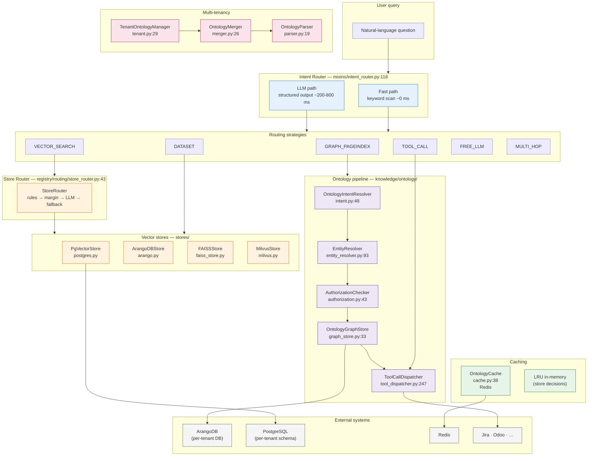
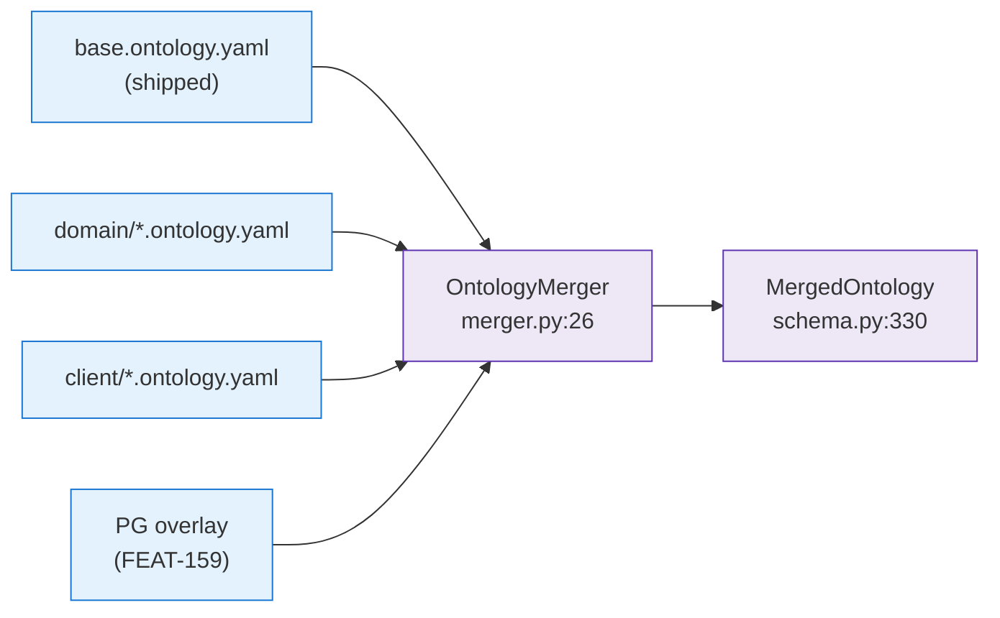
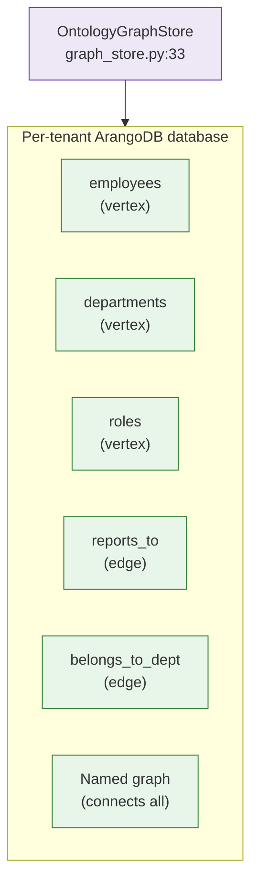
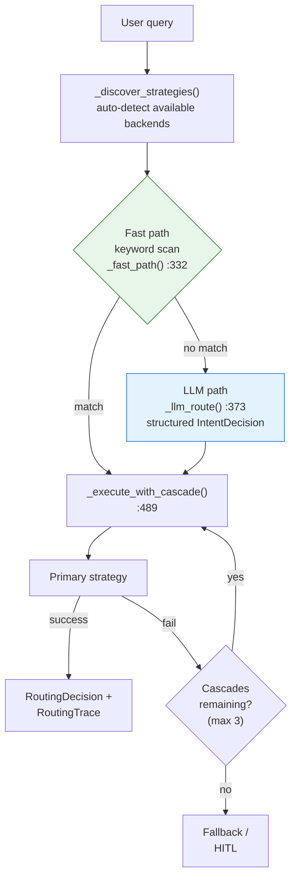
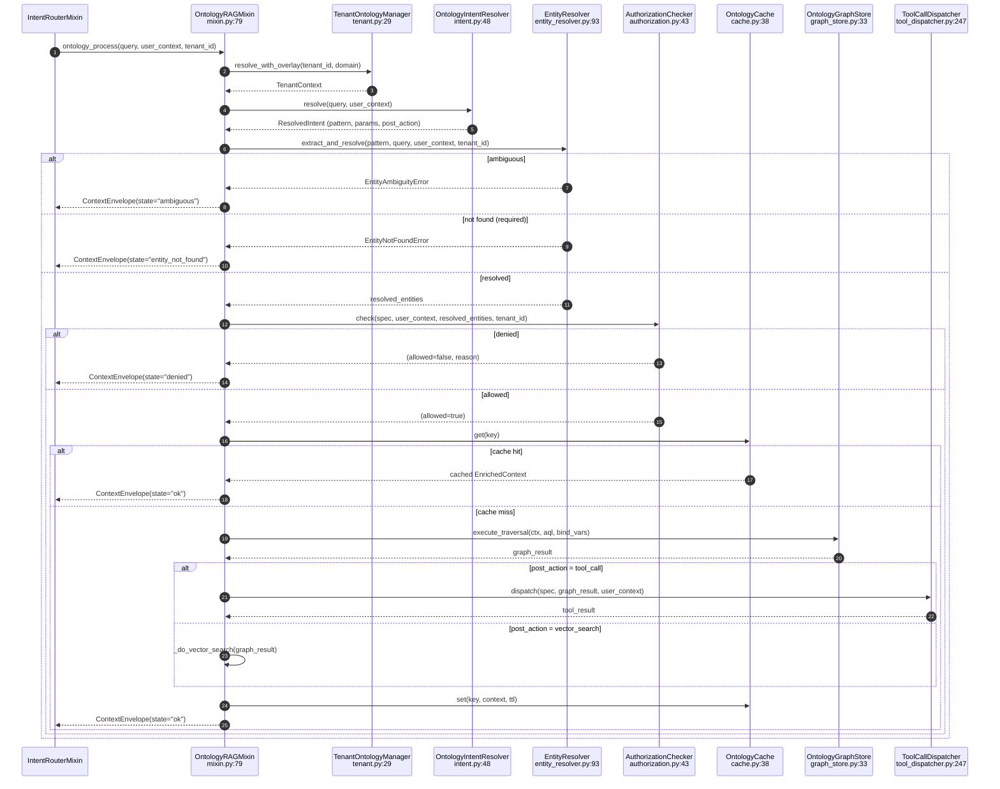
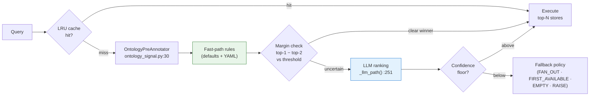

# 9. Ontologic RAG — graph-first retrieval, intent routing & multi-tenant knowledge

> Part of the [Exposure, Interoperability & Hardening](README.md) set.
> Previous: [AgentsFlow](08-agentsflow-dag.md)
>
> Ontologic RAG solves a class of problems that pure vector search cannot:
> structural reasoning over typed relationships.  "Who reports to Jesús?"
> requires traversing an org-chart, not ranking cosine-similar paragraphs.
> This chapter covers the full stack — from YAML ontology definitions
> through graph traversal, entity extraction, authorization, tool dispatch,
> store routing, and the degradation chain that falls back gracefully when
> the graph is unavailable.
>
> Feature lineage: FEAT-053 (foundation), FEAT-070 (intent router),
> FEAT-071 (advisor example), FEAT-111 (store router), FEAT-158 (entity
> extraction & tool dispatch), FEAT-159 (topic-authority curation &
> degradation chain).

## 9.1 High-level architecture



## 9.2 Module map

```
packages/ai-parrot/src/parrot/
├── knowledge/
│   └── ontology/
│       ├── schema.py                    Pydantic models (all features)
│       ├── parser.py                    YAML loader + validation
│       ├── merger.py                    Multi-layer composition engine
│       ├── graph_store.py               ArangoDB tenant-isolated wrapper
│       ├── intent.py                    Dual-path intent resolver (soft-deprecated)
│       ├── entity_resolver.py           Named entity extraction [FEAT-158]
│       ├── authorization.py             Declarative auth rules [FEAT-158]
│       ├── tool_dispatcher.py           Jinja2 tool invocation [FEAT-158]
│       ├── discovery.py                 Relation discovery (exact/fuzzy/AI/composite)
│       ├── mixin.py                     OntologyRAGMixin orchestration
│       ├── tenant.py                    TenantOntologyManager
│       ├── cache.py                     Redis result cache
│       ├── validators.py                AQL safety enforcement
│       ├── refresh.py                   CRON delta-sync pipeline
│       ├── concept_embedding.py         Hash-based concept embedding sync
│       ├── exceptions.py                Custom exceptions
│       ├── concept_catalog/             FEAT-159 concept lifecycle (PG-backed)
│       │   ├── models.py                ConceptRow, IsaEdgeRow, CascadeAlert
│       │   ├── service.py               ConceptCatalogService
│       │   ├── worker.py                Sync worker (PG → ArangoDB)
│       │   ├── reconcile.py             Reconciliation logic
│       │   ├── seed.py                  Seeding utility
│       │   └── http.py                  REST endpoints
│       ├── schema_overlay/              FEAT-159 runtime schema customisation
│       │   ├── models.py                SchemaOverlayRow, DryRunReport
│       │   ├── validator.py             Dry-run gate
│       │   ├── service.py               SchemaOverlayService
│       │   ├── worker.py                Sync worker (cache invalidation)
│       │   └── http.py                  REST endpoints
│       └── defaults/
│           ├── base.ontology.yaml       Shipped base ontology
│           └── domains/
│               └── field_services.ontology.yaml
│
├── bots/mixins/
│   └── intent_router.py                IntentRouterMixin (pre-RAG routing)
│
├── registry/routing/
│   ├── store_router.py                  StoreRouter (per-query store selection)
│   └── ontology_signal.py              OntologyPreAnnotator adapter
│
└── stores/
    ├── abstract.py                      AbstractStore interface
    ├── postgres.py                      PgVectorStore (pgvector)
    ├── arango.py                        ArangoDBStore (graph + vector)
    ├── faiss_store.py                   FAISSStore (in-memory)
    ├── milvus.py                        MilvusStore (distributed)
    └── kb/
        ├── abstract.py                  AbstractKnowledgeBase
        └── store.py                     KnowledgeBaseStore (FAISS-backed)
```

## 9.3 Ontology definition — YAML schema & multi-layer merge

An ontology in AI-Parrot is a declarative YAML document that describes
**entities** (vertex collections), **relations** (edge collections), and
**traversal patterns** (predefined AQL queries).  The schema is validated
by Pydantic v2 models in `schema.py`.

### Core models

| Model | schema.py line | Purpose |
|-------|---------------|---------|
| `PropertyDef` | 18 | Property with type, required, unique, default, enum |
| `EntityDef` | 40 | Vertex: collection, source, key_field, properties, vectorize, extend |
| `RelationDef` | 116 | Edge: from/to entities, edge_collection, discovery config |
| `DiscoveryRule` | 82 | Rule for inferring edges (source_field, target_field, match_type) |
| `DiscoveryConfig` | 102 | Strategy + rules for relation discovery |
| `TraversalPattern` | 263 | Predefined AQL with trigger intents, post-action, entity extraction, auth |
| `OntologyDefinition` | 300 | Single YAML layer (name, version, entities, relations, patterns) |
| `MergedOntology` | 330 | Runtime composition result with helper methods |

### Multi-layer composition

Ontologies compose in a strict chain: **base → domain → client**.
`OntologyMerger` (`merger.py:26`) enforces these rules:

| Layer element | Merge behaviour |
|---------------|-----------------|
| Entity with `extend: true` | Properties concatenated, `vectorize` unioned, `source` overridden, `collection`/`key_field` immutable |
| Entity without `extend` | New → added; duplicate name → error |
| Relation | Same name → endpoints immutable, discovery rules concatenated |
| Traversal pattern | Same name → `trigger_intents` deduped, `query_template` overridden |



The parser (`parser.py:19`) loads YAML, validates against Pydantic with
`extra="forbid"`, and returns an `OntologyDefinition`.  A default base
ontology ships at `defaults/base.ontology.yaml` with `Employee`,
`Department`, and `Role` entities plus `reports_to` and `belongs_to`
relations.

FEAT-159 extends the merge with **PG overlays**: the
`ConceptCatalogService` and `SchemaOverlayService` store tenant-curated
entities and schema changes in PostgreSQL.  At resolution time
`TenantOntologyManager.resolve_with_overlay()` (`tenant.py:208`)
synthesises `OntologyDefinition` objects from the overlay rows and passes
them to `OntologyMerger.merge_with_overlay()` (`merger.py:142`), which
applies a framework-override guard to prevent overlays from mutating
framework-level entities.

## 9.4 Graph store — ArangoDB per-tenant isolation

`OntologyGraphStore` (`graph_store.py:33`) wraps `python-arango-async`
with tenant isolation: each tenant gets its own ArangoDB database.

### Key operations

| Method | Line | Behaviour |
|--------|------|-----------|
| `initialize_tenant(ctx)` | 71 | Create DB, vertex/edge collections, persistent indexes, named graph |
| `execute_traversal(ctx, aql, bind_vars)` | 185 | Run AQL with validation (see §9.9) |
| `upsert_nodes(ctx, collection, nodes, key_field)` | 225 | Batch upsert with `_active` flag |
| `create_edges(ctx, edge_collection, edges)` | 312 | Create edges with dedup by `(_from, _to)` |
| `soft_delete_nodes(ctx, collection, keys)` | 413 | Mark nodes `_active: false` |

All AQL is read-only validated before execution (see §9.9).  The
`TenantContext` model (`schema.py:406`) carries `tenant_id`, `arango_db`,
`pgvector_schema`, and the merged ontology, ensuring every operation is
scoped to the correct tenant.



## 9.5 Intent Router — pre-RAG strategy selection

`IntentRouterMixin` (`intent_router.py:118`) intercepts
`conversation()` and decides **which retrieval backend** should handle
the query.  It supports eight strategies via `RoutingType`:

| Strategy | Description | Handler |
|----------|-------------|---------|
| `GRAPH_PAGEINDEX` | Ontology graph + PageIndex traversal | `_run_graph_pageindex()` :626 |
| `VECTOR_SEARCH` | Embedding similarity (enhanced by StoreRouter) | `_run_vector_search()` :852 |
| `DATASET` | SQL / structured query | `_run_dataset_query()` :824 |
| `TOOL_CALL` | Direct tool invocation | `_run_tool_call()` :894 |
| `FREE_LLM` | Unconstrained generation | `_run_free_llm()` :935 |
| `MULTI_HOP` | Concurrent graph + vector | `_run_multi_hop()` :954 |
| `HITL` | Human-in-the-loop escalation | `_build_hitl_question()` :1009 |
| `FALLBACK` | Enriched fallback prompt | `_build_fallback_prompt()` :978 |

### Routing flow



**Configuration** (`IntentRouterConfig`):
- `confidence_threshold: 0.7` — minimum for primary strategy
- `hitl_threshold: 0.3` — below this, escalate to human
- `strategy_timeout_s: 30.0` — per-strategy timeout
- `exhaustive_mode: false` — run all strategies concurrently
- `max_cascades: 3` — cascade attempts before fallback
- `custom_keywords: {}` — per-agent YAML overrides

When the chosen strategy is `GRAPH_PAGEINDEX`, the router calls
`OntologyRAGMixin.ontology_process()` and formats the returned
`ContextEnvelope` for the LLM.  The mixin exposes a
`_get_permission_context()` hook (FEAT-158) so subclasses can surface
session data (user_id, channel, roles) into the pipeline.

## 9.6 Ontology RAG pipeline — the full traversal path

`OntologyRAGMixin` (`mixin.py:79`) orchestrates the complete ontology
pipeline.  Its entry point, `ontology_process()` (`mixin.py:159`),
returns a `ContextEnvelope` — a state machine wrapping the enriched
context with error states.

### Pipeline stages



### ContextEnvelope states

| State | Meaning | Key fields |
|-------|---------|------------|
| `ok` | Success | `context` (EnrichedContext), optional `tool_result` |
| `ambiguous` | Multiple entity candidates | `clarification` (rule, mention, candidates) |
| `entity_not_found` | Required entity missing | `clarification` (rule, mention) |
| `denied` | Authorization failed | `denial_reason` |
| `auth_required` | Credentials needed | `auth_prompt` (provider, auth_url, scopes) |
| `render_error` | Jinja2 template failure | `error` |
| `tool_failed` | Tool execution failed | `error` |
| `disabled` | Feature globally off | — |
| `not_configured` | Tenant has no ontology | — |

The `ContextEnvelope` model lives at `schema.py:502`; `EnrichedContext`
at `schema.py:459`.

## 9.7 Entity extraction & resolution (FEAT-158)

`EntityResolver` (`entity_resolver.py:93`) extracts named entities from
the user query and resolves them to ArangoDB node `_id` values.  Each
`TraversalPattern` declares its extraction rules via
`EntityExtractionRule` (`schema.py:144`).

### Resolution strategies

| Strategy | Line | Speed | Method |
|----------|------|-------|--------|
| `exact_id_match` | 343 | ~5-20 ms | Direct field lookup |
| `fuzzy_name_match` | 388 | ~50-200 ms | AQL `LIKE` + scoring |
| `ai_assisted` | 431 | ~500-2000 ms | Fuzzy shortlist → LLM ranking |
| `hybrid_concept_match` | 539 | ~200-1500 ms | Synonym → vector → LLM (3-stage cascade, FEAT-159) |

When multiple candidates match, the `ambiguity_strategy` on the rule
controls behaviour:

| Strategy | Effect |
|----------|--------|
| `ask_user` | Return `ContextEnvelope(state="ambiguous")` with candidates |
| `fail` | Raise `EntityAmbiguityError` |
| `pick_first` | Take highest-scoring candidate |
| `use_context` | Re-rank by user context (same department → manager chain) |
| `rerank_by_authority` | Rank by concept authority score |

The resolver supports **conjunction splitting** (`CONJUNCTION_RE` at
line 32): queries like "Product A vs Product B" or "A y B" are split
into separate resolution passes.

### Scope filtering

Each rule declares a `scope` (`same_tenant`, `same_department`,
`anywhere`) that translates to AQL filter clauses via
`_scope_filter()` (line 315), preventing cross-tenant data leaks.

## 9.8 Authorization (FEAT-158)

`AuthorizationChecker` (`authorization.py:43`) evaluates declarative
rules attached to traversal patterns via `AuthorizationSpec`
(`schema.py:214`).  Rules are **OR-combined** with **default-deny**.

| Rule type | Line | Check |
|-----------|------|-------|
| `always` | — | Unconditional allow |
| `target_is_self` | 180 | Requesting user == target entity |
| `target_in_management_chain` | 196 | AQL `OUTBOUND` traversal on `reports_to` (depth ≤ 10) |
| `has_role` | 273 | `required_role ∈ user_context["roles"]` |
| `same_department` | 293 | Department field match via `DOCUMENT` lookup |

If all rules deny, the envelope returns `state="denied"` with a
human-readable `denial_reason`.

## 9.9 AQL safety validation

`validate_aql()` (`validators.py:36`) is **mandatory** before every
graph query — including LLM-generated dynamic AQL.  It enforces:

| Check | Pattern | Effect |
|-------|---------|--------|
| No mutations | `INSERT`, `UPDATE`, `REMOVE`, `REPLACE`, `UPSERT` | Reject |
| No system collections | `_system`, `_graphs`, `_aqlfunctions` | Reject |
| No JavaScript | `APPLY`, `CALL`, `V8` | Reject |
| Depth limit | Traversal `N..M` where `M >` `ONTOLOGY_MAX_TRAVERSAL_DEPTH` | Reject |

The depth limit defaults to 4 (configurable via
`ONTOLOGY_MAX_TRAVERSAL_DEPTH` in `parrot.conf`).

## 9.10 Tool-call dispatch (FEAT-158)

`ToolCallDispatcher` (`tool_dispatcher.py:247`) converts graph results
into parameterised tool invocations.  Each `TraversalPattern` can
declare a `ToolCallSpec` (`schema.py:231`) specifying the toolkit,
method, credential mode, and Jinja2 parameter templates.

### Jinja2 safety filters

| Filter | Line | Purpose |
|--------|------|---------|
| `jql_quote` | 72 | Escape JQL string literals |
| `jira_accounts` | 94 | Render comma-separated Jira accountIds |
| `join_ids` | 123 | Join extracted key values |
| `map_attr` | 141 | Extract attribute from list of dicts |
| `json` | built-in | JSON serialisation |

The dispatcher renders parameters against a namespace containing
`graph` (traversal results), `ctx` (user context), and `extras`
(additional bindings).  It forwards `_permission_context` to the
toolkit's `_pre_execute` hook so that credential resolution (OAuth
token lookup by channel + user_id) happens transparently.

When credentials are unavailable, the toolkit raises
`AuthorizationRequired` which surfaces as
`ContextEnvelope(state="auth_required")` with the OAuth URL and scopes.

## 9.11 Store Router — adaptive store selection (FEAT-111)

`StoreRouter` (`store_router.py:43`) is a sub-layer beneath the
`VECTOR_SEARCH` strategy.  It selects the **optimal vector store** per
query from the registered pool (PgVector, FAISS, ArangoDB, Milvus).

### Decision pipeline



**Configuration** (`StoreRouterConfig`):
- `margin_threshold: 0.15` — gap before LLM
- `confidence_floor: 0.2` — drop stores below
- `llm_timeout_s: 1.0`
- `top_n: 1` — stores to query
- `fallback_policy: FAN_OUT`
- `cache_size: 256` — LRU entries (0 = disabled)
- `enable_ontology_signal: true`

The `OntologyPreAnnotator` (`ontology_signal.py:30`) adapts the
soft-deprecated `OntologyIntentResolver` as a signal source for the
router, extracting entity/relation annotations that bias store scores.

## 9.12 Vector stores & knowledge bases

AI-Parrot abstracts vector storage behind `AbstractStore`
(`stores/abstract.py`).  All implementations share the same
`similarity_search()` signature with optional `metadata_filters`,
`search_strategy`, and `similarity_threshold`.

| Store | File | Backed by | Key differentiator |
|-------|------|-----------|--------------------|
| `PgVectorStore` | postgres.py | PostgreSQL + pgvector | BM25 + vector hybrid, MMR, per-tenant schema |
| `ArangoDBStore` | arango.py | ArangoDB | Graph context enrichment, hybrid search, full-text |
| `FAISSStore` | faiss_store.py | FAISS (in-memory) | Fast prototyping, S3 persistence, IVF/HNSW indexes |
| `MilvusStore` | milvus.py | Milvus | Distributed scale-out |

**Knowledge base layer** (`stores/kb/`):
- `AbstractKnowledgeBase` (`kb/abstract.py`) — query-activation
  protocol: `should_activate(query)` returns `(bool, confidence)`,
  `search(query, k)` returns results.
- `KnowledgeBaseStore` (`kb/store.py`) — FAISS-backed fact store with
  lazy embedding loading, tag-based re-ranking, and category/entity
  indexes.

## 9.13 Degradation chain (FEAT-159)

When graph data is unavailable or incomplete, `OntologyRAGMixin`
degrades gracefully through four levels.  This applies to the
`authoritative_doc_for_topic` pattern; all other patterns use a
simpler two-level fallback (graph → vector).

```mermaid
flowchart TB
    L1["Level 1 — Primary authority<br/>graph traversal<br/>source='graph:primary'"]
    L2["Level 2 — Secondary authority<br/>graph traversal<br/>source='graph:secondary'"]
    L3["Level 3 — Filtered vector search<br/>doc_type ∈ (policy, manual)<br/>source='vector:filtered'"]
    L4["Level 4 — Plain vector search<br/>no filter<br/>source='vector:plain'"]

    L1 -- "no results" --> L2

…(truncated)…
