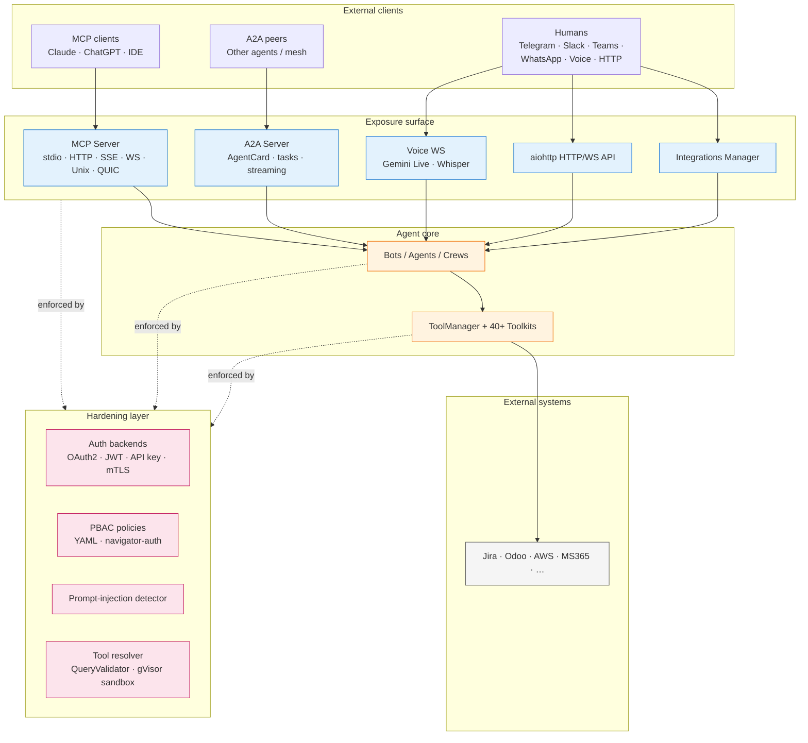

# AI-Parrot — Exposure, Interoperability & Hardening Architecture

> Living architecture set covering how AI-Parrot exposes its capabilities,
> the channels through which it talks to humans and other systems, and the
> security layers that keep that surface defensible.
>
> Companion docs: `.agent/CONTEXT.md` (core abstractions),
> `docs/sdd/WORKFLOW.md` (SDD process), `docs/orchestration.md`,
> `docs/a2a_communication.md`.

## Chapters

| #  | Topic                                                          | File                                       |
|----|----------------------------------------------------------------|--------------------------------------------|
| 1  | MCP Server — exposing tools as a service                       | [01-mcp-server.md](01-mcp-server.md)       |
| 2  | A2A — exposing agents and orchestrators as services            | [02-a2a.md](02-a2a.md)                     |
| 3  | Toolkits for third-party services and Cloud-Security composition| [03-toolkits.md](03-toolkits.md)          |
| 4  | Interaction surface — WebSockets, audio, integrations          | [04-interaction-surface.md](04-interaction-surface.md) |
| 5  | Hardening — anti-prompt-injection, PBAC and tool gating        | [05-hardening.md](05-hardening.md)         |
| 6  | Cross-cutting concerns and reference deployment                | [06-cross-cutting.md](06-cross-cutting.md) |
| 7  | AgentCrew — sequential, parallel, flow and loop execution      | [07-agentcrew.md](07-agentcrew.md)         |
| 8  | AgentsFlow — DAG-first orchestration with per-node FSM         | [08-agentsflow-dag.md](08-agentsflow-dag.md) |
| 9  | Ontologic RAG — graph-first retrieval, intent routing & multi-tenant knowledge | [09-ontologic-rag.md](09-ontologic-rag.md) |
| 10 | Observability — OpenLIT + OpenTelemetry traces, metrics & cost  | [10-observability.md](10-observability.md) |

All file references in the chapters use the `package/path/file.py:line`
convention so the reader can jump directly to the source of truth.

## High-level system view

## How to read this set

- **Operators / SREs** — start at chapter 6 (deployment topologies, request
  path, open work) then dip into chapters 1, 2 and 5.
- **Integrators building a vendor MCP server** — chapter 3 (toolkits) and
  chapter 1 (MCP transports + auth).
- **Security reviewers** — chapter 5 first, then chapters 1 and 2 for the
  authentication surface.
- **UI / channel engineers** — chapter 4.
- **Orchestration engineers** — chapters 7 and 8: chapter 7 covers
  `AgentCrew` and its four execution modes (sequential, parallel,
  flow, loop); chapter 8 covers `AgentsFlow` as a DAG-first runner
  with per-node FSM, conditional transitions and HITL decision nodes.
- **RAG / knowledge engineers** — chapter 9 covers ontology definitions,
  graph traversal, intent routing, entity extraction, authorization,
  store routing, and the degradation chain.
- **Framework maintainers** — read in order; the “pointers for reviewers”
  table at the end of chapter 6 is the usual jumping-off point.
