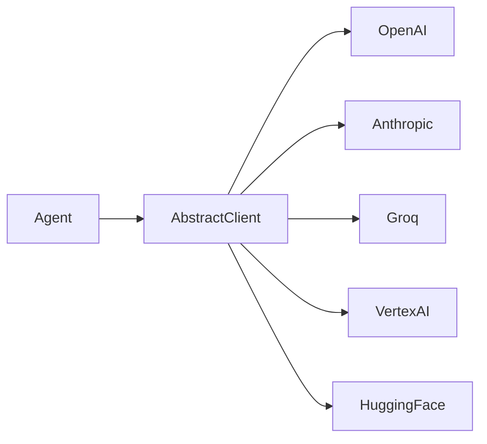

# LLM Clients

AI-Parrot talks to every LLM provider through a single
`AbstractClient` interface, so the same agent code can run on OpenAI,
Anthropic, Google GenAI, Groq, VertexAI or HuggingFace without changes.

## What lives here

- **`AbstractClient`** — async base class with `completion()`,
  `stream()` and `embed()`. Every provider wrapper inherits from it.
- **Provider clients** — concrete implementations under
  `parrot.clients.*` (one module per vendor).
- **`LLM_PRESETS`** — opinionated configurations for the most common
  models (temperature, max tokens, retry budget).
- **`StreamingRetryConfig`** — retry policy applied around streaming
  completions, including back-off and partial-response handling.
- **Embeddings** — `parrot.embeddings` covers dense and sparse
  embedding back-ends used by the RAG pipeline.

## Golden rules

1. **Never call a provider SDK directly** — always go through
   `AbstractClient`. This is the seam that keeps the framework vendor
   agnostic.
2. **`await` everything** — clients are async only. Wrapping them with
   `asyncio.run` inside another coroutine will block the event loop.
3. **Don't subclass `AbstractClient` lightly** — discuss the change
   first; it's the foundation that all bots and crews assume.

## Read next

- [Per-loop Caching](../clients/per-loop-cache.md) — how the client
  layer caches completions inside a single agent turn.
- [Contextual Embedding](../contextual-embedding.md)
- [Matryoshka Embeddings](../matryoshka-embeddings.md)

## API reference

[API Reference → Clients](../api-reference/clients.md)
