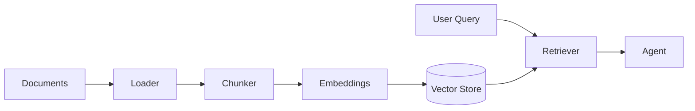

# Tools, Loaders & RAG

Agents are useful only as far as their tools let them act on the world.
AI-Parrot treats tools as first-class citizens: a docstring becomes
the LLM-facing description, a Pydantic model becomes the schema.

## What lives here

### Tools

- **`@tool` decorator** — the fast path. Annotate any async function
  and it becomes callable by any agent.
- **`AbstractToolkit`** — group related tools that share state
  (auth, clients, rate-limit budget).
- **`OpenAPIToolkit`** — turn any OpenAPI spec into a dynamic toolkit.

### Loaders

`parrot.loaders` turns documents — PDFs, HTML, DOCX, audio transcripts,
database rows, web pages — into chunks ready for the vector store.
Every loader subclasses `BaseLoader` and implements
`async def load() -> list[Document]`.

### RAG pipeline

Loaders → chunkers → embeddings (see [LLM Clients](./llm-clients.md))
→ vector store (see [Memory & Knowledge](./memory-knowledge.md)) →
`parrot.knowledge` retrieves and assembles context → agent uses it
in its system prompt or as a tool result.

## Golden rules

1. **Docstrings are the API for the LLM** — write them with the model
   as your audience, not your colleagues.
2. **Use Pydantic for tool inputs** — the schema becomes the function
   spec sent to the model. `Field(description=...)` matters.
3. **Tools must be async** — blocking I/O inside a tool stalls every
   other agent on the loop.

## Read next

- [Tools Reference](../tools.md), [Sandbox Tool](../sandbox_tool.md),
  [What-If Tool](../whatif_tool.md), [Hierarchy Tool](../hierarchy_tool.md)
- [Charts & Visualization](../charts_samples.md)
- [Loaders Metadata](../loaders-metadata.md)

## API reference

- [API Reference → Tools](../api-reference/tools.md)
- [API Reference → Loaders](../api-reference/loaders.md)
