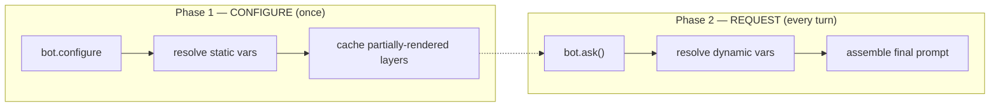
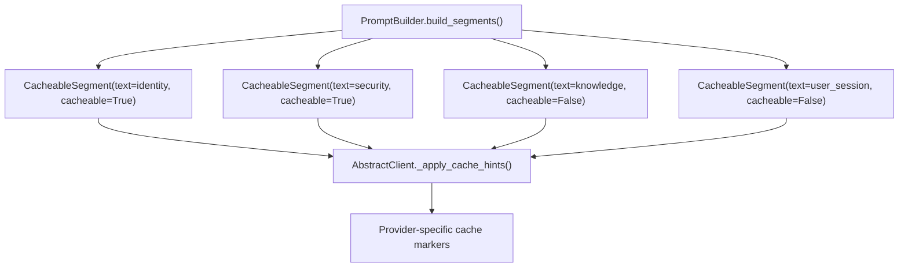

# PromptBuilder User Guide

`PromptBuilder` is AI-Parrot's composable system prompt engine. It replaces the
legacy monolithic `BASIC_SYSTEM_PROMPT` / `AGENT_PROMPT` templates with a
**layered, two-phase architecture** where each section of the system prompt is
an independent, immutable `PromptLayer` — ordered by priority, resolved in two
phases, and chainable via a fluent API.

For a complete reference of every built-in and domain layer, see the
[Layers Reference](layers-reference.md).
For the variable customization guide (what to set, where, and how), see the
[Variables Reference](../promptbuilder-variables.md).

---

## What is PromptBuilder?

A system prompt for an AI agent is not a flat string — it has distinct
**semantic sections**: identity, security policy, knowledge context, tool
instructions, output format, and behavioral style. `PromptBuilder` models each
section as a `PromptLayer` and manages them as an ordered collection:

- **Layered composition** — add, remove, or replace sections without touching others.
- **Two-phase rendering** — static variables (name, role, backstory) resolve once
  at startup; dynamic variables (knowledge, history) resolve per request.
- **Provider-agnostic caching** — `build_segments()` emits `CacheableSegment`
  objects so LLM providers can cache the stable prefix of the prompt.
- **Preset stacks** — `default()`, `agent()`, `rag()`, `voice()`, `minimal()`
  cover the most common use cases out of the box.

`PromptBuilder` is the right tool when:

- You need to customize an agent's system prompt without writing raw template strings.
- You want to add domain-specific prompt sections (SQL, Jira, DataFrames) to a standard stack.
- You need provider-agnostic prompt caching for cost optimization.
- You want to share a base prompt configuration across many agents with per-agent tweaks.

---

## Quick Start

```python
from parrot.bots.prompts import PromptBuilder

# 1. Pick a preset stack
builder = PromptBuilder.default()

# 2. Customize — remove the tools layer, add a domain layer
from parrot.bots.prompts import get_domain_layer
builder.remove("tools").add(get_domain_layer("company_context"))

# 3. Phase 1: resolve static variables once
builder.configure({
    "name": "FinanceBot",
    "role": "financial analyst",
    "goal": "Help users understand financial data.",
    "backstory": "You specialize in quarterly earnings reports.",
    "company_information": "Acme Corp, founded 1985, NYSE: ACME.",
})

# 4. Phase 2: resolve dynamic variables per request
prompt = builder.build({
    "knowledge_content": "Q3 revenue was $4.2M, up 12% YoY.",
    "user_context": "User is a portfolio manager.",
    "chat_history": "",
})

print(prompt)
```

---

## Creating a PromptBuilder

### Constructor

```python
from parrot.bots.prompts import PromptBuilder, PromptLayer

builder = PromptBuilder(
    layers=[layer_a, layer_b, layer_c],  # optional list of PromptLayer instances
    prompt_caching=False,                # enable CacheableSegment output
)
```

| Parameter | Type | Default | Description |
|---|---|---|---|
| `layers` | `Optional[List[PromptLayer]]` | `None` | Initial layer list; keyed by `layer.name` |
| `prompt_caching` | `bool` | `False` | When `True`, `AbstractBot` uses `build_segments()` instead of `build()` |

### Factory Methods (Presets)

Rather than constructing from scratch, use a preset that matches your use case:

=== "default"

    ```python
    builder = PromptBuilder.default()
    ```

    The standard 8-layer stack for most bots:
    `identity → pre_instructions → security → knowledge → user_session → tools → output → behavior`

=== "agent"

    ```python
    builder = PromptBuilder.agent()
    ```

    Default stack **plus** `AGENT_BEHAVIOR_LAYER` — adds grounding rules
    and a response protocol for tool-using agents.

=== "rag"

    ```python
    builder = PromptBuilder.rag()
    ```

    Default stack **minus** `tools`, **plus** `knowledge_scope` and
    `rag_grounding`. Anchors the agent strictly to `<knowledge_context>`.

=== "voice"

    ```python
    builder = PromptBuilder.voice()
    ```

    Default stack with a voice-optimized behavior layer — concise,
    conversational, no complex formatting.

=== "minimal"

    ```python
    builder = PromptBuilder.minimal()
    ```

    Lightweight: `identity + security + user_session` only. For simple
    bots that need no tools, knowledge, or output formatting.

=== "from_system_prompt"

    ```python
    builder = PromptBuilder.from_system_prompt(
        "You are an assistant that helps with tax filings. $rationale"
    )
    ```

    Default stack with the `identity` layer replaced by your raw text.
    Targets YAML-defined agents whose `system_prompt` already declares
    identity. `$variable` placeholders still work.

### Preset Registry

Presets can be referenced by name (useful for YAML/DB configuration):

```python
from parrot.bots.prompts import get_preset, list_presets, register_preset

builder = get_preset("default")     # returns a fresh PromptBuilder
print(list_presets())               # ['default', 'minimal', 'voice', 'agent', 'rag']

# Register a custom preset
def my_preset() -> PromptBuilder:
    return PromptBuilder.default().remove("tools")

register_preset("no-tools", my_preset)
builder = get_preset("no-tools")
```

---

## Mutation API

All mutation methods return `self` for fluent chaining.

### `add(layer)`

Add or replace a layer by name. If a layer with the same name already exists,
it is replaced silently.

```python
from parrot.bots.prompts import PromptLayer, LayerPriority, RenderPhase

custom_layer = PromptLayer(
    name="compliance",
    priority=LayerPriority.BEHAVIOR - 5,
    phase=RenderPhase.CONFIGURE,
    template="""<compliance_rules>
Always cite the regulation number when referencing a law.
$extra_compliance_rules
</compliance_rules>""",
    condition=lambda ctx: True,
)

builder.add(custom_layer)
```

### `remove(name)`

Remove a layer by name. No-op if not present.

```python
builder.remove("tools")         # drop the tools layer
builder.remove("nonexistent")   # safe — no error
```

### `replace(name, layer)`

Replace an existing layer. Raises `KeyError` if the layer is not found —
use `add()` instead if you don't need the safety check.

```python
from parrot.bots.prompts import PromptLayer, LayerPriority, RenderPhase

builder.replace("identity", PromptLayer(
    name="identity",
    priority=LayerPriority.IDENTITY,
    phase=RenderPhase.CONFIGURE,
    template="<agent_identity>You are $name, a $role.</agent_identity>",
))
```

### `get(name)`

Retrieve a layer by name, or `None` if not found.

```python
tools_layer = builder.get("tools")
if tools_layer:
    print(tools_layer.template)
```

### `clone()`

Deep copy for per-agent customization. The clone is fully independent.

```python
base = PromptBuilder.default()
base.configure({"name": "Base", "role": "assistant", ...})

agent_a = base.clone().add(domain_layer_a)
agent_b = base.clone().remove("tools")
```

### Chaining

```python
builder = (
    PromptBuilder.default()
    .remove("tools")
    .remove("output")
    .add(get_domain_layer("company_context"))
    .add(get_domain_layer("rag_grounding"))
)
```

---

## Two-Phase Rendering

The core innovation of `PromptBuilder` is splitting variable resolution into
two phases — avoiding redundant work on every request.



### Phase 1: `configure(context)`

Called once during `bot.configure()`. Resolves CONFIGURE-phase variables
(name, role, goal, backstory, rationale, etc.) via `partial_render()`,
caching the result. REQUEST-phase `$placeholders` survive intact.

```python
builder.configure({
    "name": "ResearchBot",
    "role": "research assistant",
    "goal": "Help users find academic papers.",
    "backstory": "You specialize in computer science literature.",
    "rationale": "Be concise and cite sources.",
    "has_tools": True,
})

assert builder.is_configured  # True
```

!!! note
    After `configure()`, all layers report `phase=RenderPhase.REQUEST`
    internally, but the original `cacheable` flag is preserved so
    `build_segments()` knows which layers were originally CONFIGURE-phase.

### Phase 2: `build(context)` — String Output

Called on every `ask()` / `ask_stream()`. Resolves remaining dynamic
variables and joins all non-empty layers (sorted by priority) with `"\n\n"`.

```python
prompt = builder.build({
    "knowledge_content": "Retrieved document: ...",
    "user_context": "User timezone: UTC-5",
    "chat_history": "User: What papers exist on transformers?\nBot: ...",
    "output_instructions": "",
})
# Returns a single string ready for the LLM
```

If `configure()` was never called, `build()` renders all layers in a single
pass (single-phase fallback).

### Phase 2: `build_segments(context)` — Cached Output

Same iteration as `build()`, but returns `List[CacheableSegment]` instead
of a joined string. Each segment carries a `cacheable` flag that LLM
providers translate into cache-control hints.

```python
segments = builder.build_segments({
    "knowledge_content": "...",
    "user_context": "...",
    "chat_history": "...",
})

for seg in segments:
    print(f"cacheable={seg.cacheable}, len={len(seg.text)}")
    # cacheable=True  → CONFIGURE-phase layers (identity, security, tools, ...)
    # cacheable=False → REQUEST-phase layers (knowledge, user_session, output)
```

!!! tip
    Enable prompt caching by passing `prompt_caching=True` to your bot
    constructor (or to `PromptBuilder(prompt_caching=True)`). The bot will
    automatically use `build_segments()` and let the LLM client apply
    provider-specific cache markers.

---

## Query Properties

| Property | Type | Description |
|---|---|---|
| `is_configured` | `bool` | Whether `configure()` has been called |
| `layer_names` | `List[str]` | Names of layers currently in the builder |

```python
print(builder.layer_names)
# ['identity', 'pre_instructions', 'security', 'knowledge',
#  'user_session', 'tools', 'output', 'behavior']

print(builder.is_configured)
# False (before configure), True (after)
```

---

## Integration with AbstractBot

In practice, you rarely call `configure()` and `build()` directly — `AbstractBot`
does it for you. The integration points are:

### Constructor Injection

```python
from parrot.bots import Agent
from parrot.bots.prompts import PromptBuilder, get_domain_layer

builder = (
    PromptBuilder.default()
    .add(get_domain_layer("company_context"))
)

agent = Agent(
    client=my_client,
    name="SupportBot",
    role="customer support specialist",
    prompt_builder=builder,        # inject custom builder
    prompt_caching=True,           # enable cached segments
    company_information="Acme Corp support policies...",
)
```

### Lifecycle

```
Bot.__init__()
  └─ If prompt_builder=None → create PromptBuilder.default()
  └─ Store as self._prompt_builder

Bot.configure()
  └─ _configure_prompt_builder()
       ├─ Build configure_context dict (name, role, goal, backstory, ...)
       ├─ Include dynamic_values ($current_date, etc.)
       └─ Call self._prompt_builder.configure(configure_context)

Bot.ask(user_input)
  └─ _build_prompt()
       ├─ Build request_context dict (knowledge_content, chat_history, ...)
       ├─ If prompt_caching → builder.build_segments(request_context)
       └─ Else → builder.build(request_context)
```

### Property Access

```python
agent.prompt_builder                 # get the current builder
agent.prompt_builder = new_builder   # replace it (before configure())
```

---

## Bot-Specific Patterns

### Standard Agent with Domain Layer

```python
from parrot.bots import Agent
from parrot.bots.prompts import PromptBuilder, get_domain_layer

builder = PromptBuilder.agent()  # default + agent_behavior
builder.add(get_domain_layer("company_context"))

agent = Agent(
    client=client,
    name="CompanyBot",
    role="company information assistant",
    prompt_builder=builder,
    company_information="Founded in 2020, HQ in Miami...",
)
```

### RAG Agent

```python
from parrot.bots import Chatbot
from parrot.bots.prompts import PromptBuilder

builder = PromptBuilder.rag()

agent = Chatbot(
    client=client,
    name="KBBot",
    role="knowledge base assistant",
    prompt_builder=builder,
    capabilities="Product documentation, pricing, and FAQs.",
    extra_rag_rules="Always include the document title in citations.",
)
```

### Voice Bot

```python
from parrot.bots import VoiceBot
# VoiceBot internally uses PromptBuilder.voice()
# — concise, conversational, no complex formatting
bot = VoiceBot(client=client, name="VoiceAssistant")
```

### YAML/DB Agent with Custom System Prompt

```python
from parrot.bots.prompts import PromptBuilder

builder = PromptBuilder.from_system_prompt(
    "You are a tax filing assistant. Help users with Form 1040."
)
# The identity layer is replaced; security, knowledge, tools,
# output, behavior layers remain intact.
```

### Specialized Agent (JiraSpecialist Pattern)

```python
from parrot.bots.prompts import PromptBuilder, get_domain_layer

def build_jira_prompt_builder() -> PromptBuilder:
    builder = PromptBuilder.default()
    builder.add(get_domain_layer("jira_workflow"))
    builder.add(get_domain_layer("jira_grounding"))
    return builder

class JiraSpecialist(Agent):
    def __init__(self, **kwargs):
        builder = kwargs.pop("prompt_builder", None) or build_jira_prompt_builder()
        super().__init__(**kwargs)
        if self._prompt_builder is None:
            self.prompt_builder = builder
```

---

## Prompt Caching

Provider-agnostic prompt caching splits the system prompt into stable
(CONFIGURE-phase) and volatile (REQUEST-phase) segments. LLM providers can
cache the stable prefix across requests, reducing latency and cost.

### How It Works



### CacheableSegment

```python
from parrot.bots.prompts import CacheableSegment

# Produced by build_segments() — you don't construct these directly
segment = CacheableSegment(
    text="<agent_identity>You are ResearchBot...</agent_identity>",
    cacheable=True,    # CONFIGURE-phase → eligible for caching
    ttl_hint=None,     # reserved for future TTL-aware strategies
)
```

| Field | Type | Description |
|---|---|---|
| `text` | `str` | Rendered layer content |
| `cacheable` | `bool` | `True` for CONFIGURE-phase, `False` for REQUEST-phase |
| `ttl_hint` | `Optional[Literal["short", "long"]]` | Reserved for v2; no provider uses it yet |

### Enabling Caching

```python
# Option 1: On the bot
agent = Agent(client=client, name="Bot", prompt_caching=True)

# Option 2: On the builder
builder = PromptBuilder.default()
builder.prompt_caching = True
```

### Per-Layer Cache Override

By default, CONFIGURE-phase layers are `cacheable=True` and REQUEST-phase
layers are `cacheable=False`. You can override this per-layer:

```python
# A REQUEST-phase layer that rarely changes — mark it cacheable
stable_knowledge = PromptLayer(
    name="static_kb",
    priority=LayerPriority.KNOWLEDGE,
    phase=RenderPhase.REQUEST,
    template="<kb>$kb_content</kb>",
    cacheable=True,  # override: cache even though it's REQUEST-phase
)
```

---

## Creating Custom Layers

### Anatomy of a PromptLayer

```python
from parrot.bots.prompts import PromptLayer, LayerPriority, RenderPhase

my_layer = PromptLayer(
    name="compliance",                           # unique identifier
    priority=LayerPriority.BEHAVIOR - 5,         # rendering order (lower = earlier)
    phase=RenderPhase.CONFIGURE,                 # when to resolve variables
    template="""<compliance_rules>
Always cite regulation $regulation_id when applicable.
$extra_compliance_rules
</compliance_rules>""",
    condition=lambda ctx: ctx.get("has_compliance", False),  # skip if False
    required_vars=frozenset({"regulation_id"}),              # documentation only
    cacheable=True,                                          # explicit cache flag
)
```

| Field | Type | Default | Description |
|---|---|---|---|
| `name` | `str` | required | Unique layer identifier |
| `priority` | `LayerPriority \| int` | required | Rendering order (lower = earlier in prompt) |
| `template` | `str` | required | XML template with `$variable` placeholders |
| `phase` | `RenderPhase` | `REQUEST` | When variables resolve: `CONFIGURE` (once) or `REQUEST` (per turn) |
| `condition` | `Optional[Callable]` | `None` | Layer skipped if returns `False`; receives the context dict |
| `required_vars` | `frozenset[str]` | `frozenset()` | Variable names this layer expects (documentation) |
| `cacheable` | `Optional[bool]` | derived from `phase` | Cache eligibility; auto-set by `__post_init__` if `None` |

!!! warning
    `PromptLayer` is a **frozen dataclass** — you cannot modify instances after
    creation. Use `partial_render()` to create a new layer with resolved variables.

### Rendering Methods

#### `render(context) → Optional[str]`

Full render: checks condition, substitutes all `$variables` via `string.Template`.
Returns `None` if the condition fails.

```python
result = my_layer.render({"regulation_id": "SEC-17a-4", "has_compliance": True})
# '<compliance_rules>\nAlways cite regulation SEC-17a-4 when applicable.\n\n</compliance_rules>'
```

#### `partial_render(context) → PromptLayer`

Partial render for two-phase resolution: substitutes only the variables present
in the context, leaving unresolved `$placeholders` intact. Returns a new
`PromptLayer` with `phase=REQUEST` and `condition=None`.

```python
# Phase 1: resolve CONFIGURE vars
partial = my_layer.partial_render({"regulation_id": "SEC-17a-4", "has_compliance": True})
# partial.template still contains $extra_compliance_rules

# Phase 2: resolve remaining vars
final = partial.render({"extra_compliance_rules": "Include section numbers."})
```

### Priority Slots

Use `LayerPriority` values (or arithmetic on them) to position custom layers:

```python
from parrot.bots.prompts import LayerPriority

class LayerPriority(IntEnum):
    IDENTITY = 10
    PRE_INSTRUCTIONS = 15
    SECURITY = 20
    KNOWLEDGE = 30
    USER_SESSION = 40
    TOOLS = 50
    OUTPUT = 60
    BEHAVIOR = 70
    CUSTOM = 80
```

Place your layer between existing ones using arithmetic:

```python
# Between KNOWLEDGE (30) and USER_SESSION (40)
my_layer = PromptLayer(name="my_data", priority=LayerPriority.KNOWLEDGE + 5, ...)

# Just before BEHAVIOR (70)
my_layer = PromptLayer(name="grounding", priority=LayerPriority.BEHAVIOR - 5, ...)
```

!!! tip
    Domain layers use this arithmetic pattern. For example,
    `DATAFRAME_CONTEXT_LAYER` has `priority=KNOWLEDGE + 5` (= 35) to slot
    right after the main knowledge layer.

---

## Agent Context Layer

For prompt-caching scenarios, per-agent context files can be loaded into the
system prompt prefix automatically.

```python
from parrot.bots.prompts import AGENT_CONTEXT_LAYER
from parrot.bots.prompts.agent_context import load_agent_context

# Reads from AGENT_CONTEXT_DIR/<agent_id>.md
content = load_agent_context("my-agent")
# Returns "" if file doesn't exist — no error raised
```

The `AGENT_CONTEXT_LAYER` (priority 12, between IDENTITY and PRE_INSTRUCTIONS)
renders the content into `<agent_context>` tags. It is CONFIGURE-phase and
`cacheable=True`, making it part of the stable prefix.

Results are cached with mtime-based invalidation — file changes are detected
on the next call without restarting the process.

---

## When to Use PromptBuilder vs. Raw Strings

| Scenario | Recommendation |
|---|---|
| Standard bot with personality knobs | `PromptBuilder.default()` + set variables via kwargs |
| Tool-using agent | `PromptBuilder.agent()` — adds response protocol |
| RAG-only bot | `PromptBuilder.rag()` — strict grounding, no tools |
| Voice interface | `PromptBuilder.voice()` — concise, conversational |
| YAML-defined bot with custom identity | `PromptBuilder.from_system_prompt(text)` |
| One-off script / prototype | Raw string is fine — migrate later if needed |
| Domain-specific agent (SQL, Jira, Pandas) | Preset + `get_domain_layer(...)` |
| High-throughput production bot | Enable `prompt_caching=True` for cost savings |

---

## Complete API Reference

### PromptBuilder

```python
class PromptBuilder:
    # Factory methods
    @classmethod
    def default(cls) -> PromptBuilder
    @classmethod
    def minimal(cls) -> PromptBuilder
    @classmethod
    def voice(cls) -> PromptBuilder
    @classmethod
    def agent(cls) -> PromptBuilder
    @classmethod
    def rag(cls) -> PromptBuilder
    @classmethod
    def from_system_prompt(cls, system_prompt: str) -> PromptBuilder

    # Mutation API (returns self)
    def add(self, layer: PromptLayer) -> PromptBuilder
    def remove(self, name: str) -> PromptBuilder
    def replace(self, name: str, layer: PromptLayer) -> PromptBuilder
    def get(self, name: str) -> Optional[PromptLayer]
    def clone(self) -> PromptBuilder

    # Build API
    def configure(self, context: Dict[str, Any]) -> None
    def build(self, context: Dict[str, Any]) -> str
    def build_segments(self, context: Dict[str, Any]) -> List[CacheableSegment]

    # Query API
    @property
    def is_configured(self) -> bool
    @property
    def layer_names(self) -> List[str]
```

### PromptLayer

```python
@dataclass(frozen=True)
class PromptLayer:
    name: str
    priority: LayerPriority | int
    template: str
    phase: RenderPhase = RenderPhase.REQUEST
    condition: Optional[Callable[[Dict[str, Any]], bool]] = None
    required_vars: frozenset[str] = frozenset()
    cacheable: Optional[bool] = None  # derived from phase if None

    def render(self, context: Dict[str, Any]) -> Optional[str]
    def partial_render(self, context: Dict[str, Any]) -> PromptLayer
```

### CacheableSegment

```python
@dataclass(frozen=True)
class CacheableSegment:
    text: str
    cacheable: bool
    ttl_hint: Optional[Literal["short", "long"]] = None
```

### Preset Registry

```python
def get_preset(name: str) -> PromptBuilder
def register_preset(name: str, factory: Callable[[], PromptBuilder]) -> None
def list_presets() -> list[str]
```
