# Nova VoiceBot avatar broadcast for multiple browsers (FEAT-537)

Operations and architecture guide for the moderated multi-browser broadcast:
**one** Nova VoiceBot conversation, **one** LiveAvatar LITE generation session
and **one** LiveKit room, fanned out to up to **ten** receiving browsers, with a
server-enforced moderator and a single exclusive speaking floor.

- Specification: [`sdd/specs/voicebot-multiroom-heygen-avatar.spec.md`](../../sdd/specs/voicebot-multiroom-heygen-avatar.spec.md)
- Runnable example and setup: [`examples/clients/voice/README.md`](../../examples/clients/voice/README.md)
- Prerequisite feature (FEAT-536): [`docs/testing/voicebot-liveavatar-acceptance.md`](../testing/voicebot-liveavatar-acceptance.md)

> ## ⚠️ Verification status
>
> **The real-vendor gate for this feature has NOT been run.**
> [`docs/testing/voicebot-multiroom-live-gate.md`](../testing/voicebot-multiroom-live-gate.md)
> records **0 of 12** scenarios executed — no LiveAvatar account, no LiveKit
> deployment and no Nova Sonic SDK were available. FEAT-536's own acceptance
> matrix is likewise **0 of 8**.
>
> Everything in this document is verified against deterministic tests and a
> local Redis. Every **vendor** timing below is a spec default that has never
> been measured against a real LiveAvatar session, which is why each one is a
> constructor knob rather than a constant. Do not read this guide as evidence
> for AC5, AC6 or AC10.

---

## 1. Architecture

```mermaid
flowchart LR
    C[Granted speaker: microphone] -->|16 kHz PCM, floor epoch| F[Server floor validation / owner relay]
    F --> H[Broadcast-owned VoiceSession]
    M[First participant: moderator] -->|grant / revoke raised hands| API
    H --> B[VoiceBot: Nova 2 Sonic and conversation memory]
    B -->|24 kHz mono PCM16| S[BroadcastSession output routing]
    S -->|avatar mode| A[LiveAvatar LITE control WS]
    A -->|synchronized audio and video| R[One LiveKit room]
    S -->|audio-only mode| P[Distinct direct audio publisher]
    P --> R
    R --> V[1–10 subscribing browsers]
    H -->|transcripts / permitted tool events| C
    API[Authenticated broadcast HTTP API] <--> D[Redis descriptor and admission records]
    S <--> D
    V -->|join / status / leave| API
```



### Components

| Module | Responsibility |
|---|---|
| `broadcast/models.py` | Pydantic contracts. `BroadcastPublicState` is the only shape a browser sees, and a `model_validator` rejects any credential-looking field name on it. |
| `broadcast/registry.py` | Storage-agnostic contract + `InMemoryBroadcastRegistry` — the reference semantics, and what deterministic tests run against. |
| `broadcast/redis_registry.py` | Production store. Every compound operation is **one Lua script**, so admission, ownership and the floor barrier are atomic across workers. |
| `broadcast/session.py` | `BroadcastSession` — the producer's media lifecycle: room, publishers, avatar, output routing, fallback, interruption. |
| `broadcast/voice_relay.py` | `BroadcastVoiceSession` — the broadcast-owned voice session, shared by every speaker. |
| `broadcast/floor.py` | Authority validation and the handoff barrier (`FloorCoordinator`). |
| `broadcast/service.py` | `BroadcastService` — policy, lifecycle and the reconciliation watchdog. |
| `broadcast/worker_transport.py` | Authenticated worker-to-worker speaker relay. |
| `parrot/voice/handler.py` | `/ws/voice/broadcast/{agent_id}/{broadcast_id}` control/input socket. |
| `parrot/handlers/voice_broadcast.py` | The HTTP API. |

### Design rules that explain most of the code

1. **The first admitted participant is the moderator.** Not the creator, not a
   URL parameter, not a client role selector. `reserve_viewer` decides it
   atomically and reports `is_first` to exactly one caller.
2. **Fallback is one-way and never replays ambiguous audio.** `avatar →
   audio_only` has no reverse edge. On cutover only frames that were never
   handed to the vendor are re-routed; a frame whose send was in flight is
   counted (`dropped_ambiguous_samples`) and dropped. A brief gap is acceptable;
   duplicate speech is not.
3. **Every floor change goes through a barrier.** `grant_floor` → `switching`
   (speaker cleared, epoch +1) → producer acknowledges → `commit_floor`. If the
   producer does not acknowledge within 3 s the floor is left **idle** with a
   retryable error. Silence with a visible error beats two live speakers.
4. **Fail closed.** Unreachable Redis or LiveKit means seats are *retained* and
   `reconciliation_uncertain` is logged, never released optimistically.

---

## 2. Roles and the floor state machine

```
Broadcast:  pending → starting → avatar | audio_only → stopping → ended
                                    └────── one way ──────┘
            any fatal Nova/LiveKit/ownership failure → failed

Floor:      idle ⇄ switching → granted
                     ▲             │
                     └──── grant / revoke / release / election
```

| Role | How it is acquired | What it permits |
|---|---|---|
| Moderator | First successful admission; on departure, the earliest remaining **confirmed** participant with a fresh control heartbeat | Grant / revoke / reclaim the floor, dismiss hands, stop the broadcast |
| Speaker | A moderator grant, committed through the barrier | Send microphone audio, under the current `floor_epoch`, from one bound socket |
| Viewer | Any successful admission | Receive media and state; raise/cancel a hand; leave |

Raising a hand grants **nothing**. The moderator cannot transmit while someone
else holds the floor. Rejoining does not restore a previous role.

---

## 3. HTTP API

Base: `/api/v1/agents/{agent_id}/voice-broadcasts`. Status codes below are the
ones asserted in `packages/ai-parrot-server/tests/handlers/test_voice_broadcast.py`.

| Method + path | Who | Result |
|---|---|---|
| `POST /` | Authorized agent participant | `201` `{broadcast_id, share_path, state}`. No credentials, no moderator claim. |
| `GET /{bid}` | In-scope participant | `200` `{state}`; `404` for unknown **or out-of-scope** (deliberately indistinguishable). |
| `POST /{bid}/viewers` | Authorized participant | `201` `{lease_id, role, media_ready, state}`; `409 viewer_limit_reached` (with state); `410` terminal; `404` unknown. |
| `GET /{bid}/viewers/{lease}/connection` | Lease owner | `200` `ViewerJoinResponse` (the **only** response carrying a token — a subscribe-only `client_token`); `409` + `Retry-After: 1` while starting. |
| `DELETE /{bid}/viewers/{lease}` | Lease owner | `204`, idempotent. |
| `POST /{bid}/hands` | Own lease | `200` `{state}`. |
| `DELETE /{bid}/hands/me?lease_id=` | Own lease | `200` `{state}`. |
| `DELETE /{bid}/hands/{lease}` | Moderator | `200` `{state}`; `403` otherwise. |
| `POST /{bid}/floor` | Moderator | Body `{lease_id\|null, expected_version}`. `200`; `409 stale_version` **with current state**; `400` without `expected_version`. |
| `POST /{bid}/floor/release` | Current speaker | `200`; `403` otherwise. |
| `POST /{bid}/stop` | Moderator only | `202`. The creator gets `403` unless they are also the moderator. |

Hardening on every state-changing request: 8 KiB body cap, `Origin` allow-list
(`PARROT_BROADCAST_ALLOWED_ORIGINS`, same-origin by default), and a
per-principal limit of 30 requests / 10 s → `429`.

## 4. Control WebSocket

`/ws/voice/broadcast/{agent_id}/{broadcast_id}`. Authentication is the existing
WS mechanism; the token travels in the `Sec-WebSocket-Protocol` subprotocol,
never a query string.

| Client → server | Notes |
|---|---|
| `{"type":"attach","lease_id"}` | Required first message. The lease must belong to the authenticated principal, else the socket closes with **4403**. |
| `{"type":"ping"}` | Control heartbeat, every 5 s. Expiry 15 s. |
| `{"type":"start_session"}` | Attaches to the **existing** broadcast voice session. Never creates a bot. |
| `{"type":"start_recording","floor_epoch"}` | Binds the single microphone socket. A second socket gets `speaker_connection_exists`. |
| `{"type":"audio_data"\|"audio_chunk","data","floor_epoch"}` | Base64 PCM16 @16 kHz, ≤ 64 KiB. |
| `{"type":"stop_recording","floor_epoch"}` | Ends the input turn, not the grant. |
| `{"type":"finish_speaking"}` | Returns the floor to the moderator. |
| `{"type":"end_session"}` | Releases only this speaking binding. |

| Server → client | Notes |
|---|---|
| `{"type":"attached", ...}` | Includes `is_moderator`. |
| `{"type":"broadcast_state","state"}` | The public projection. |
| `{"type":"floor_state","granted","floor_epoch"}` | **The only frame that may enable a microphone.** |
| `{"type":"floor_revoked","floor_epoch"}` | Stop capturing now. |
| `{"type":"error","code","message"}` | `floor_not_granted`, `stale_floor_epoch`, `speaker_connection_exists`, `payload_too_large`, `rate_limited`, … |

Raw **binary** frames are ignored on this route: they cannot carry a
`floor_epoch`, so they could not be fenced.

## 5. Redis key layout

Namespaced by tenant and broadcast id, under `{prefix}` (default
`parrot:voice-broadcast`):

| Key | Type | Contents |
|---|---|---|
| `…:{tenant}:{bid}:descriptor` | string | JSON `BroadcastDescriptor` |
| `…:{tenant}:{bid}:leases` | hash | `lease_id` → lease envelope (`{lease, t:{hb,cred,deadline}}`) |
| `…:{tenant}:{bid}:tombstones` | zset | departed `livekit_identity` → expiry |
| `…:{tenant}:{bid}:hands` | zset | `lease_id` → sequence |
| `…:{tenant}:{bid}:owner` | string | `worker_id:epoch` |
| `…:{tenant}:{bid}:stop` | string | Durable desired terminal state |
| `…:{tenant}:{bid}:meta` | hash | `created_at`, `terminal_at`, `owner_expires_at`, `pending_floor_target`, `hand_sequence` |
| `…:{tenant}:index` | set | Live broadcast ids |
| `…:workers` | hash | `worker_id` → internal relay URL |

**Never stored:** PCM, AWS credentials, LiveAvatar access tokens, LiveKit
publisher JWTs, or worker network addresses in the descriptor.
`liveavatar_session_id` is an audit identifier only.

## 6. Limits and timeouts

| Value | Default | Verified? |
|---|---|---|
| Max viewers (incl. moderator + speaker) | 10 | ✅ tested |
| LiveKit room capacity | 12 (10 viewers + 2 publishers) | ✅ tested |
| Pending broadcast TTL | 60 s | ✅ tested (fake clock) |
| Owner lease / renew | 15 s / 5 s | ✅ tested (fake clock) |
| Control heartbeat / expiry | 5 s / 15 s | ✅ tested |
| Viewer credential TTL | 60 s | ✅ tested |
| Terminal state retention | 300 s | ✅ tested |
| Handoff barrier timeout | 3 s | ✅ tested |
| Bounded output queue | 96 000 B (2 s @ 24 kHz mono PCM16) | ✅ tested |
| Avatar startup deadline | 15 s | ❌ **unverified** (spec default) |
| Speech-progress watchdog | 10 s | ❌ **unverified** |
| Per-send vendor deadline | 2 s | ❌ **unverified** |
| Interrupt time-to-silence target | 1 s | ❌ **unverified** |
| Post-fallback audible target | 3 s | ❌ **unverified** |
| Max vendor session duration | 600 s | ❌ **unverified** |
| Owner-death cleanup target | 30 s | ✅ tested in simulation |

## 7. Security model

**Never reaches a browser:** LiveAvatar API keys or session tokens, the avatar
`ws_url`, LiveKit publisher (`agent_token`) JWTs, AWS credentials, worker ids or
addresses, other tenants' data, or another participant's user id — participants
are identified to each other by **lease id** and a safe display name only.

**Reaches exactly one browser, once:** its own subscribe-only `client_token`,
from `GET …/connection`.

- A share link contains only `?broadcast=<id>` — no role claim, no credential.
- A lease id is **not** a bearer token: `attach` verifies it belongs to the
  authenticated principal.
- Every browser gets a unique LiveKit identity; reuse would evict the previous
  participant.
- Microphone input requires: authenticated principal **and** owned admitted
  lease **and** current speaker **and** matching `floor_epoch` **and** the bound
  socket **and** a control heartbeat newer than 15 s. Socket possession,
  moderator role, or a valid viewer JWT are each insufficient.
- The worker relay requires a shared `PARROT_BROADCAST_WORKER_TOKEN` compared
  with `hmac.compare_digest`, refuses to mount without one, requires TLS off
  loopback, and re-validates the fencing tuple **on the owner** before
  `push_audio`. The owner's address comes only from the worker registry and must
  be a `ws(s)://` URL.
- **Demo mode is loopback-only.** `VOICEBOT_DEMO_PARTICIPANTS` maps shared
  config-file tokens to fixed principals, so the server refuses a non-loopback
  `--host` while it is set. It is not authentication; do not weaken production
  authorization to imitate it.
- The failure-injection hook is off by default and never mounted by
  `manager.py`.

## 8. Operations

### Environment matrix

| Variable | Scope | Effect if unset |
|---|---|---|
| `PARROT_BROADCAST_REDIS_URL` | server (`manager.py`) | Broadcast routes are not mounted; the server still boots. |
| `VOICEBOT_BROADCAST_REDIS_URL` | example server | Broadcast mode disabled with a reason shown in the page. |
| `LIVEKIT_URL` / `LIVEKIT_API_KEY` / `LIVEKIT_API_SECRET` | both | Broadcast mode disabled (a `KeyError` is caught and reported). |
| `LIVEAVATAR_API_KEY` / `LIVEAVATAR_AVATAR_ID` | both | Broadcast still runs, in `audio_only` from the start. |
| `PARROT_BROADCAST_WORKER_TOKEN` | multi-worker | The relay refuses to mount; a speaker whose socket lands on a non-owner worker cannot send audio. |
| `PARROT_BROADCAST_ALLOWED_ORIGINS` | server | Same-origin only. |
| `VOICEBOT_DEMO_PARTICIPANTS` | example only | No demo auth; supply real authentication. |
| `VOICEBOT_BROADCAST_FAILURE_HOOK` | example only | Injection route absent (the default). |

### Worker registry and the speaker relay

Each worker registers its internal relay URL under `…:workers`. When a granted
speaker's socket is not on the producer's worker,
`BroadcastService.attach_speaker_input` resolves the owner's address **from that
registry** and opens an authenticated relay. Clients can never influence the
address. A stale `owner_epoch` closes the relay rather than being tolerated.

### Reconciliation watchdog

Every 5 s, per known broadcast:

1. `registry.expire(now)` — prunes tombstones, expires pending broadcasts,
   fences dead owners, flags unconfirmed seats and stale control connections.
2. A dead owner is fenced by **claiming ownership** (which advances
   `owner_epoch`), then the room's participants are removed, the room deleted,
   and the broadcast transitioned to `failed` / `owner_lost`.
3. An expired control lease is removed from the LiveKit room **first**, then its
   seat is released — never the other way round, or a replacement admission
   could coexist with a still-connected participant.
4. Any Redis or LiveKit error records `reconciliation_uncertain` and **retains**
   the seats.

### Orphaned vendor sessions ⚠️

After an owner dies, the watchdog can evict the room's participants but does
**not** hold the owner-only LiveAvatar session token, so it **cannot confirm the
vendor session stopped**. This is reported as `orphaned_vendor_session` in
`ReconcileReport` and logged — never assumed to be terminated. Configure
`max_session_duration ≤ 600 s` so an orphan expires on the vendor's side within
a bounded time, and treat the flag as an operator signal (spec §7).

---

## 9. Running the tests

```bash
source .venv/bin/activate

# Integrations package. Run it separately from the server package: each has its
# own conftest that prepends its own sources, and a single invocation spanning
# both produces no summary.
# Deterministic, plus the Redis suite (which skips with an explicit reason when
# Redis is unreachable).
export PARROT_TEST_REDIS_URL=redis://localhost:6379/3
pytest packages/ai-parrot-integrations/tests/voice/test_voice_broadcast_models.py \
       packages/ai-parrot-integrations/tests/voice/test_voice_broadcast_registry.py \
       packages/ai-parrot-integrations/tests/voice/test_voice_broadcast_media.py \
       packages/ai-parrot-integrations/tests/voice/test_voice_broadcast_relay.py \
       packages/ai-parrot-integrations/tests/voice/test_voice_broadcast_floor.py \
       packages/ai-parrot-integrations/tests/voice/test_voice_broadcast_service.py \
       packages/ai-parrot-integrations/tests/voice/test_voice_broadcast_worker_transport.py \
       packages/ai-parrot-integrations/tests/voice/test_voice_broadcast_redis_registry.py -q
# -> 284 passed (with Redis reachable at the URL above)

# Server package.
pytest packages/ai-parrot-server/tests/handlers/test_voice_broadcast.py -q
# -> 27 passed

# Browser (headless Chromium; fakes only WebSocket/fetch/LiveKit SDK).
pytest packages/ai-parrot-integrations/tests/voice/test_voice_demo_broadcast_browser.py -q

# Real-vendor gate — requires credentials and a human observer. Skips otherwise.
export PARROT_LIVE_BROADCAST_GATE=1
pytest packages/ai-parrot-integrations/tests/voice/test_voice_broadcast_live_gate.py -q -s
```

### Evidence locations

| What | Where |
|---|---|
| FEAT-537 real-vendor gate | [`docs/testing/voicebot-multiroom-live-gate.md`](../testing/voicebot-multiroom-live-gate.md) — **NOT RUN** |
| FEAT-536 acceptance matrix | [`docs/testing/voicebot-liveavatar-acceptance.md`](../testing/voicebot-liveavatar-acceptance.md) — **NOT RUN** |
| Sanitized run logs / track manifests | `artifacts/logs/feat-537-live-gate-*` (gitignored) |

### Dependency versions used for the tests in this repository

| Dependency | Version |
|---|---|
| `livekit` | 1.1.14 |
| `livekit-api` | 1.2.0 |
| `livekit-client` (browser UMD) | 2.22.1 |
| `redis` (server) | 8.4.0 |
| `redis` (python) | 5.2.1 |
| `playwright` | 1.52.0 |
| `aws_sdk_bedrock_runtime` | **not installed** |
| Python | 3.12.3 |
