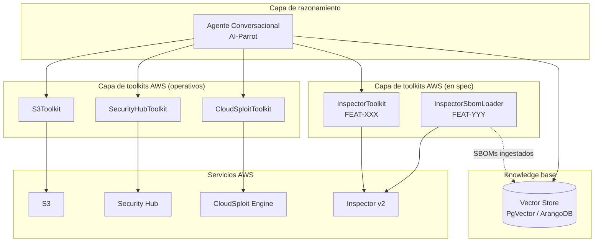
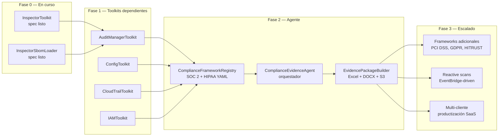

# AI-Parrot — Capacidades de Seguridad AWS y Hoja de Ruta de Compliance

**Audiencia:** Stakeholders técnicos y de negocio
**Propósito:** Resumen del estado actual y de la próxima incorporación: `ComplianceEvidenceAgent`
**Fecha:** Mayo 2026

---

## 1. Resumen ejecutivo

AI-Parrot es la plataforma de agentes de IA de Trocdigital. Sobre esta plataforma se ha construido en los últimos meses un ecosistema de **toolkits de seguridad AWS** que permite a agentes conversacionales investigar, auditar y razonar sobre la postura de seguridad de cualquier cuenta AWS conectada.

El siguiente paso, objeto de este documento, es elevar esa capacidad: pasar de **responder preguntas de seguridad puntuales** a **producir paquetes de evidencia listos para auditoría** mapeados contra marcos regulatorios estándar (SOC 2 y HIPAA en primera fase).

El objetivo no es sustituir al auditor humano — esa frontera es legal y comercial, no técnica — sino reducir drásticamente el tiempo de preparación de una auditoría: de semanas de trabajo manual de recolección de evidencias a un dossier estructurado generado automáticamente en horas.

---

## 2. Lo que tenemos hoy

### 2.1 La plataforma base

AI-Parrot ofrece agentes conversacionales que pueden razonar sobre datos de múltiples fuentes. Los agentes están construidos sobre tres bloques fundamentales:

- **Toolkits:** colecciones de operaciones que un agente puede invocar para consultar sistemas externos (AWS, Jira, MS Teams, NetSuite, etc.).
- **Loaders:** componentes que ingestan documentos de cualquier tipo y los preparan para búsqueda semántica.
- **Knowledge bases:** almacenes vectoriales y de grafo donde la información ingestada queda disponible para consulta contextual (RAG).

Esta arquitectura ha sido validada en producción a través de la plataforma Nav-AI y soporta múltiples proveedores LLM, conectividad multi-canal y orquestación de flujos complejos.

### 2.2 Toolkits de seguridad AWS operativos

Hoy un agente AI-Parrot puede responder preguntas como *"¿qué buckets S3 son públicos?"* o *"¿qué findings críticos hay en SecurityHub este mes?"* mediante los siguientes toolkits ya construidos:

**S3Toolkit** — Inventario de buckets, análisis de configuración de seguridad (cifrado, versionado, public access blocks, políticas), y detección de buckets con exposición pública. Útil para responder a auditorías de confidencialidad y para investigación reactiva ante incidentes.

**SecurityHubToolkit** — Acceso a findings agregados, estándares de seguridad activos y un score de seguridad consolidado a nivel cuenta. Es el agregador "vista de pájaro" — útil para resúmenes ejecutivos, no para análisis granular.

**CloudSploitToolkit** — Ejecución de escaneos de configuración multi-servicio basados en el motor CloudSploit. Detecta misconfiguraciones que SecurityHub no cubre con la misma profundidad (best practices operacionales, drift de configuración, exposiciones por permisos).

### 2.3 Capacidades en fase de especificación

Dos componentes están actualmente en spec formal, listos para implementación inmediata. Estos cierran las lagunas más visibles del stack actual:

**InspectorToolkit** (FEAT-XXX) — Acceso directo a Amazon Inspector v2, la fuente autoritativa para vulnerabilidades de:

- Imágenes de contenedor en ECR (CVEs por paquete OS y por lenguaje — Python, Node, Ruby, Go, etc.).
- Instancias EC2.
- Funciones Lambda y su código fuente.
- Repositorios de código (integración con Amazon Q Code Security).

Sin este toolkit, el agente solo ve vulnerabilidades a través del agregador de SecurityHub — pierde el detalle de paquete, el EPSS score (probabilidad real de explotación pública), la información de fix disponible, y el contexto de qué imagen exacta está afectada. Con él, un agente puede responder *"¿qué imágenes en producción tienen CVEs críticos con exploit público y fix disponible?"* directamente, sin intermediación.

**InspectorSbomLoader** (FEAT-YYY) — Ingesta de SBOMs (Software Bill of Materials) en formato CycloneDX y SPDX que Amazon Inspector exporta a S3. Una vez vectorizado el SBOM, el agente puede responder preguntas de inventario cross-imagen que ninguna API de seguridad responde eficientemente: *"¿qué imágenes en mi flota usan `openssl 1.1.1f`?"* o *"¿cuál es la huella de licencias open-source en mis contenedores de producción?"*.

Es la capa de **inventario auditable** — distinto de la capa de **postura en vivo** que da Inspector. Cualquier programa de compliance serio necesita las dos.

### 2.4 Visión integrada de lo que tenemos

En resumen, la capacidad actual permite a un agente **investigar la postura de seguridad** de una cuenta AWS de forma conversacional y profunda. Es una herramienta de **descubrimiento e investigación**.

Lo que aún no puede hacer es producir el siguiente nivel: **un dossier estructurado mapeado a un marco regulatorio concreto**, que es lo que un auditor pide y lo que ningún cliente quiere preparar manualmente.

---

## 3. Lo que incorpora el `ComplianceEvidenceAgent`

### 3.1 El problema que resuelve

Cuando una empresa enfrenta una auditoría SOC 2 o un assessment HIPAA, el trabajo se descompone en tres bloques:

1. **Recolección de evidencias técnicas** — exportar configuraciones, logs, reportes de scans, listas de usuarios, políticas IAM, etc. Trabajo repetitivo, propenso a error, típicamente 2-4 semanas de un equipo de seguridad.
2. **Mapeo a controles del marco** — para cada control del estándar (SOC 2 tiene ~150, HIPAA Security Rule ~50), identificar qué evidencia lo respalda y qué documento de política interna lo cubre. Trabajo de cross-reference manual.
3. **Determinación de cumplimiento y atestación** — el auditor evalúa la evidencia y emite el dictamen profesional. Esto es **responsabilidad regulada** y queda firmemente fuera del alcance del agente.

El `ComplianceEvidenceAgent` automatiza los puntos 1 y 2. El punto 3 sigue siendo trabajo humano calificado, y la frontera entre los dos es explícita por diseño.

### 3.2 Qué hace, en una frase

Recolecta automáticamente la evidencia técnica de los servicios AWS, la cruza contra las políticas y procedimientos del cliente almacenados en su knowledge base, y produce un paquete de evidencias estructurado, citable y trazable, listo para entregar a un auditor.

### 3.3 Features principales

**Soporte multi-framework.** El agente trabaja sobre un registro de marcos regulatorios (`ComplianceFrameworkRegistry`). En la primera fase se cubren SOC 2 (Trust Services Criteria) y HIPAA Security Rule. La estructura es extensible — añadir PCI DSS, GDPR o HITRUST en el futuro es trabajo de definición YAML, no de reescritura de código.

**Recolección de evidencia paralela y multi-fuente.** Para cada control del marco, el agente sabe qué toolkits invocar y qué evidencia recolectar de cada uno. La ejecución es paralela sobre los toolkits AWS (los actuales más cuatro nuevos toolkits dependientes, descritos en §4). El resultado es un snapshot de la postura técnica de la cuenta en el momento del scan.

**Matching semántico de políticas internas.** Cada cliente tiene sus propias políticas y procedimientos: Information Security Policy, Acceptable Use, Incident Response Plan, Encryption Policy, etc. Estos documentos se ingestan en una knowledge base segregada por cliente (multi-tenant estricto). Para cada control, el agente recupera los excerpts relevantes y los empaqueta junto con la evidencia técnica. Si para un control no se encuentra evidencia de política interna, el paquete lo reporta explícitamente como gap.

**Citación verbatim del marco normativo.** Cada control del paquete incluye la cita textual del estándar (HIPAA §164.312(a)(2)(iv), SOC 2 CC6.1, etc.) extraída de la knowledge base normativa. El auditor no necesita consultar el estándar para entender qué se está evidenciando.

**Detección determinista de gaps.** El agente aplica reglas claras y deterministas — no juicio de LLM — sobre la evidencia recolectada:

- ¿Existe evidencia para este control?
- ¿La evidencia tiene una antigüedad aceptable (típicamente < 90 días)?
- ¿Existe excerpt de política interna que cubra el tema?
- ¿Hay contradicciones detectables entre evidencia técnica y política declarada?

El output de cada control es una clasificación de cuatro estados: **Evidence Complete / Evidence Partial / No Policy Found / Insufficient Evidence**. Ninguno de esos estados afirma "compliant" — esa palabra está deliberadamente prohibida del vocabulario del agente. La determinación final es del auditor.

**Generación de paquete auditor-consumable.** El output final es un dossier multi-formato:

- Excel maestro con una hoja por control: cita del estándar, evidencia recolectada, excerpts de política, estado, links a artefactos.
- Documento Word ejecutivo en formato narrativo para entrega a stakeholders.
- Manifest JSON estructurado y archivo S3 con todos los artefactos raw para trazabilidad.

El formato es compatible (en la medida de lo posible) con AWS Audit Manager assessment reports, que es lo que muchos auditores SOC 2 ya saben consumir.

### 3.4 Lo que el agente deliberadamente no hace

Esta frontera es tan importante como las capacidades. Comunicada claramente, protege legalmente y posiciona mejor comercialmente:

- **No emite veredictos de compliance.** Nunca dice "tu cuenta es HIPAA compliant". Dice "para el control §164.312(a)(2)(iv), recolectamos esta evidencia y este excerpt de política; el auditor determina cumplimiento".
- **No firma atestaciones.** Las atestaciones SOC 2 son trabajo de CPAs licenciados; los assessments HIPAA tienen responsabilidad profesional regulada. El agente produce el insumo, no el dictamen.
- **No reemplaza el Risk Assessment, el BAA inventory, ni la documentación administrativa.** HIPAA exige Administrative Safeguards (§164.308) que son trabajo humano. El agente reporta su ausencia como gap; no los suple.
- **No remedia.** Identifica gaps y los reporta; no aplica cambios a la cuenta AWS.

### 3.5 Qué logramos con esto

**Para Trocdigital:**

- Producto nuevo, diferenciado, vendible como servicio recurrente: *"AI-accelerated audit prep — paquete de evidencias en 24 horas, mapeado contra el marco de su elección."*
- Modelo comercial limpio: cobramos por la herramienta y el servicio de preparación, no asumimos responsabilidad de atestación.
- Reutilización directa de toda la inversión hecha en AI-Parrot, los toolkits AWS, y la infraestructura RAG.
- Activo de propiedad propia escalable: el `ComplianceFrameworkRegistry` (los mapeos control-a-evidencia) es el verdadero diferenciador. Una vez construido para SOC 2 y HIPAA, añadir nuevos marcos es trabajo lineal.

**Para los clientes:**

- Reducción de semanas a horas en preparación de auditorías.
- Snapshot reproducible y trazable de la postura — no hojas Excel manuales con riesgo de error.
- Identificación temprana de gaps antes de que llegue el auditor.
- Histórico versionado: cada scan queda archivado, permitiendo demostrar evolución de la postura entre auditorías sucesivas.

**Para el auditor del cliente:**

- Recibe un paquete estructurado en formato que ya entiende (Excel + DOCX + manifest estructurado).
- Tiempos de fieldwork reducidos significativamente — más tiempo en juicio profesional, menos en cazar evidencias.

---

## 4. Trabajo preparatorio necesario

Para que el `ComplianceEvidenceAgent` opere, hay cuatro toolkits dependientes que aún no existen en el ecosistema y son requeridos. Son specs cortas, sin decisiones arquitectónicas abiertas (siguen el patrón establecido por `SecurityHubToolkit` y `S3Toolkit`):

| Toolkit | Rol en el agente |
|---|---|
| **AuditManagerToolkit** | Recolección de evidencia automatizada con frameworks pre-built de AWS para HIPAA y SOC 2. Reduce significativamente el trabajo de mapeo manual. |
| **ConfigToolkit** | Acceso a AWS Config — historial de configuración, conformance packs, drift detection. Es el agujero más grande del stack actual para compliance. |
| **CloudTrailToolkit** | Logs de auditoría — quién hizo qué, cuándo, desde dónde. Requisito directo de HIPAA §164.312(b) y SOC 2 CC7. |
| **IAMToolkit** | Inventario de usuarios, roles, políticas, MFA, access keys. Cubre los controles de acceso lógico (HIPAA §164.312(a), SOC 2 CC6). |

Estos cuatro toolkits son trabajo previo necesario pero contenido — todos siguen el patrón ya validado en producción y son implementables en paralelo.

---

## 5. Hoja de ruta consolidada

**Fase 0** está prácticamente cerrada: los dos specs de Inspector están escritos y listos para `/sdd-task`.

**Fase 1** son cuatro specs cortos que se pueden brainstormear en una sesión y desarrollar en paralelo. Tiempo estimado del bloque: contenido en términos del esfuerzo total del programa.

**Fase 2** es el núcleo del producto compliance. La decisión clave aquí es comercial: en qué cliente piloto se valida el primer paquete entregado.

**Fase 3** abre el camino al escalado del activo: más frameworks, modo reactivo, y eventualmente productización SaaS independiente de Nav-AI.

---

## 6. Decisiones abiertas para validar

Antes de pasar a brainstorm formal del agente, hay decisiones de fondo que conviene cerrar a nivel stakeholder:

1. **Cliente piloto.** ¿Qué cliente Trocdigital es el mejor candidato para validar el primer paquete entregado? Idealmente uno que tenga auditoría SOC 2 programada en los próximos 3-6 meses y que quiera reducir el esfuerzo de preparación.

2. **Modelo comercial.** ¿Producto incluido en el contrato Nav-AI existente, módulo add-on con licencia separada, o servicio profesional facturado por scan?

3. **Formato de entrega al auditor.** ¿Formato propio (Excel + DOCX con branding Trocdigital) o compatible con AWS Audit Manager? La segunda opción reduce fricción del auditor pero quita oportunidad de branding.

4. **Boundary legal claro.** Conviene revisión legal del disclaimer en el paquete entregado: lenguaje exacto que asegure que el documento es input para auditoría, no atestación. Una sola frase mal redactada en el documento puede generar exposición.

5. **Primer framework a soportar.** Recomendación técnica: SOC 2 antes que HIPAA, porque es más self-contained y la mayoría de los clientes lo necesitan antes. Pero si hay un cliente piloto con foco HIPAA, esa decisión se invierte.

---

## 7. Conclusión

El stack actual de toolkits AWS de seguridad ya posiciona a AI-Parrot por encima de cualquier solución conversacional genérica del mercado. La incorporación de `InspectorToolkit` e `InspectorSbomLoader` (Fase 0) cierra las dos lagunas más visibles.

El `ComplianceEvidenceAgent` es el siguiente salto cualitativo: convierte un conjunto de herramientas de investigación en una solución productizable, vendible, con modelo de revenue recurrente y un activo de propiedad intelectual escalable (`ComplianceFrameworkRegistry`).

La inversión adicional requerida es contenida: cuatro toolkits cortos siguiendo patrones ya validados, más el agente orquestador y el package builder. Todo apoyado sobre infraestructura AI-Parrot ya en producción.

El próximo paso recomendado es la sesión de brainstorm formal del `ComplianceEvidenceAgent` para cerrar las decisiones abiertas de §6 y entrar a spec.
