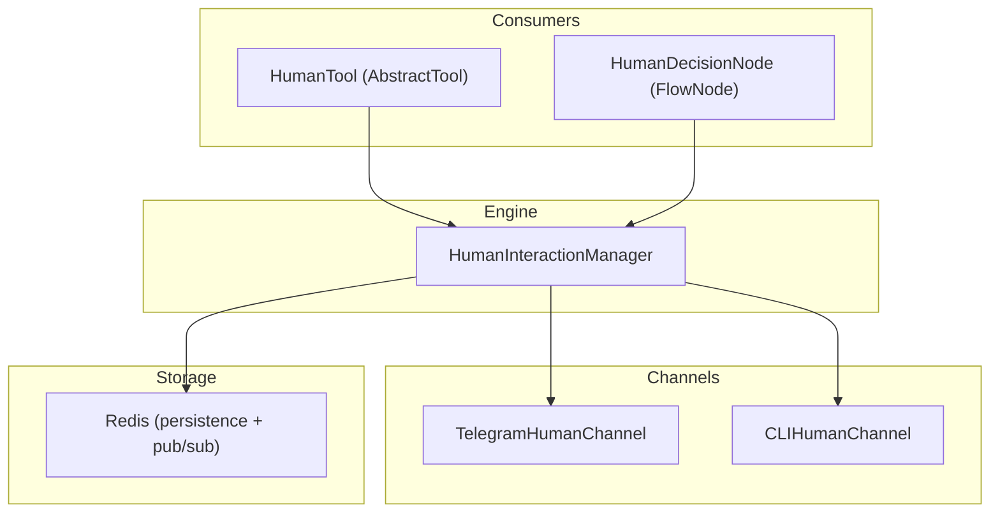

# Human-in-the-Loop Architecture — Walkthrough

## What was built

A new `parrot/human/` package implementing an agent- and flow-level HITL system with pluggable communication channels.

### Architecture



### Files created

| File | Purpose |
|------|---------|
| [\_\_init\_\_.py](file:///home/jesuslara/proyectos/navigator/ai-parrot/parrot/human/__init__.py) | Package exports |
| [models.py](file:///home/jesuslara/proyectos/navigator/ai-parrot/parrot/human/models.py) | 4 enums + 4 Pydantic models |
| [manager.py](file:///home/jesuslara/proyectos/navigator/ai-parrot/parrot/human/manager.py) | Central engine (consensus, timeout, escalation, Redis) |
| [tool.py](file:///home/jesuslara/proyectos/navigator/ai-parrot/parrot/human/tool.py) | `HumanTool` — LLM-invokable `AbstractTool` |
| [node.py](file:///home/jesuslara/proyectos/navigator/ai-parrot/parrot/human/node.py) | `HumanDecisionNode` — pseudo-agent for `AgentsFlow` |
| [channels/base.py](file:///home/jesuslara/proyectos/navigator/ai-parrot/parrot/human/channels/base.py) | `HumanChannel` ABC |
| [channels/telegram.py](file:///home/jesuslara/proyectos/navigator/ai-parrot/parrot/human/channels/telegram.py) | Telegram inline buttons/polls via aiogram |
| [channels/cli.py](file:///home/jesuslara/proyectos/navigator/ai-parrot/parrot/human/channels/cli.py) | Terminal stdin/stdout for dev testing |

### Key design decisions

- **Pydantic `BaseModel`** for all models (Redis serialization)
- **Duck-typed** `HumanDecisionNode` (implements `.name`, `.ask()`, `.tool_manager`) so it plugs into `FlowNode` without modifying `AgentsFlow`
- **Two operation modes**: long-polling (`request_human_input`) and suspend/resume (`request_human_input_async`)
- **Consensus evaluation**: `FIRST_RESPONSE`, `ALL_REQUIRED`, `MAJORITY`, `QUORUM`
- **No existing files modified**

## Testing

**58 tests, all passing** ✅

```
tests/test_human_models.py   — 18 tests (enums, serialization, round-trips)
tests/test_human_manager.py  — 13 tests (consensus, validation, long-polling, timeout, async)
tests/test_human_tool.py     — 14 tests (inheritance, schema, execution, ToolManager integration)
tests/test_human_node.py     — 13 tests (creation, ask(), timeout, FlowNode compatibility)
```

```bash
source .venv/bin/activate && python -m pytest tests/test_human_models.py tests/test_human_manager.py tests/test_human_tool.py tests/test_human_node.py -v
```

## Future work

1. Wire `TelegramHumanChannel.handle_callback_query()` into `TelegramAgentWrapper`'s dispatcher
2. Add MS Teams and Slack channel implementations
3. Add audit logging (interaction history persistence)
4. Add Redis pub/sub listener for flow rehydration in suspend/resume mode
