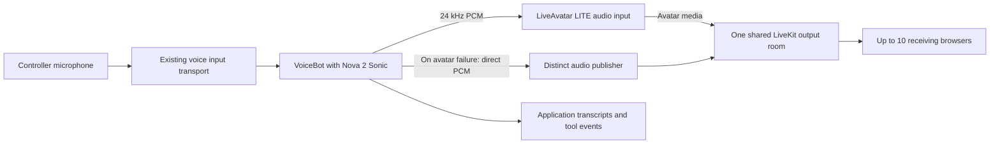

# FEAT-561 — Nova VoiceBot + LiveAvatar + LiveKit multi-viewer broadcast

> Mode: enrichment. Confidence: medium. Status: review.
> Audit: [FEAT-561](../state/FEAT-561/). This ID identifies proposal research; formal spec reservation remains a later step.

## 0. Origin

> $sdd-proposal voicebot-multiroom-heygen-avatar -- VoiceBot can connect to LiveAvatar to incorporate 3D avatars. Currently, the only operational mode is to use the entire Heygen LiveAvatar platform except for the text bot (the voice is sent to Heygen, which performs speech-to-text conversion. The operation is then sent via bridge to an ai-parrot agent, which responds with text. This text is then sent back to Heygen LiveAvatar, which provides the voice and avatar in streaming mode).
>
> However, LiveAvatar also supports the possibility of having an ai-parrot agent handle the entire end-to-end cycle of receiving and responding audio. The text and audio are then simply sent to the Heygen endpoint, which then lip-syncs the video, providing the final video.
>
> This last mode is the one that was not fully developed, one that allows using VoiceBot with a multi-agent RTC room and within that multi-room a Heygen agent that receives the voice generated by a VoiceBot agent (with AWS Nova Audio 2) and simply generates the video-avatar stream.

The original request is preserved in [source.md](../state/FEAT-561/source.md), and subsequent answers in [clarifications.md](../state/FEAT-561/clarifications.md).

**Resolved intent:** “multi-room” means multiple people simultaneously receiving the same avatar audio/video output. The requested delivery is a complete Nova 2 Sonic VoiceBot → LiveAvatar → LiveKit → multiple-browser path, including **one HTML example for testing**. Audience size is **at most 10 viewers**. If LiveAvatar fails, **all viewers continue hearing Nova audio in the same room**. These are requirements, not optional enhancements. F014.

## 1. Synthesis Summary

Complete the existing VoiceBot audio-to-avatar path by connecting its session ownership to the existing multi-viewer infrastructure. VoiceBot already supports Nova 2 Sonic, and the current voice relay forwards generated PCM to LiveAvatar LITE; viewer-token issuance also exists, but looks up a different session store. The proposed broadcast has one conversation owner, one avatar generation session and one LiveKit output room, shared by up to 10 receiving browsers. Add authorized session discovery, receiver-only join/leave behavior, exclusive audio playback and audience-wide Nova audio fallback. The final implementation must ship one working HTML controller/viewer example and pass combined multi-browser tests. F001–F007, F009–F014.

**Feasibility:** LiveAvatar documents bringing your own LiveKit infrastructure, and LiveKit explicitly documents one broadcaster with many receive-only viewers. Their combination supports the proposed topology in principle; it has not been exercised with the configured account during this research. Concurrent viewers receive the same live program, with normal per-client network/buffer differences rather than guaranteed identical frame timing. [LiveAvatar configuration](https://docs.liveavatar.com/docs/lite-mode/configuration), [LiveKit livestreaming](https://docs.livekit.io/transport/media/). F011–F012.

## 2. Codebase Findings

### 2.1 Localization

Paths below are existing files. Their roles and bounded reads are recorded in the cited findings; proposed new components have no invented implementation paths.

| Existing path | Symbol / anchor | Lines read | Findings |
|---|---|---|---|
| `packages/ai-parrot/src/parrot/bots/voice.py` | `VoiceBot._resolve_llm_config` | 190-258 | F001 |
| `packages/ai-parrot/src/parrot/bots/voice.py` | `VoiceBot.ask_stream` | 475-663 | F001 |
| `packages/ai-parrot-client-amazon/src/parrot/clients/amazon/nova/audio.py` | `NovaAudio` | 303-305,633-657,1119-1177,1237-1249 | F002 |
| `packages/ai-parrot/src/parrot/voice/session.py` | `VoiceSession` | 36-250,297-346 | F002 |
| `packages/ai-parrot-integrations/src/parrot/voice/handler.py` | `_HandlerVoiceSession._relay` | 254-256,510-537,1151-1196,1631-1686,1688-1717,1791-1804 | F003 |
| `packages/ai-parrot-integrations/src/parrot/voice/handler.py` | `VoiceChatHandler` | 586-644 | F003 |
| `packages/ai-parrot-integrations/src/parrot/integrations/liveavatar/voice_session.py` | `VoiceAvatarSession` | 151-250 | F003 |
| `packages/ai-parrot-integrations/src/parrot/integrations/liveavatar/voice_session.py` | `VoiceAvatarSession` | 151-270 | F004 |
| `packages/ai-parrot-integrations/src/parrot/integrations/liveavatar/avatar_ws.py` | `AvatarWebSocket` | 153-228,283-305 | F004 |
| `packages/ai-parrot-integrations/src/parrot/integrations/liveavatar/client.py` | `LiveAvatarClient.create_session_token` | 149-170 | F004 |
| `packages/ai-parrot-server/src/parrot/handlers/avatar.py` | `_mint_viewer_tokens` | 560-653,680-688 | F005 |
| `packages/ai-parrot-server/src/parrot/handlers/avatar.py` | `AvatarViewersView` | 643-653 | F005 |
| `packages/ai-parrot-integrations/src/parrot/integrations/liveavatar/room_manager.py` | `LiveKitRoomManager.mint_room_tokens` | 64-135 | F005 |
| `packages/ai-parrot-server/ui/src/lib/api/avatar.ts` | `mintViewerTokens` | 205-235,339-375 | F006 |
| `packages/ai-parrot-server/ui/src/lib/components/agents/avatar/AvatarViewer.svelte` | `startSession` | 82-179 | F006 |
| `packages/ai-parrot-server/ui/src/lib/components/agents/avatar/VoiceNativeAvatarViewer.svelte` | `startSession` | 97-171 | F006 |
| `packages/ai-parrot-integrations/tests/voice/test_voicechat_avatar_integration.py` | `test_gemini_audio_to_avatar_end_to_end` | 1-149 | F007 |
| `packages/ai-parrot-integrations/tests/voice/test_voice_avatar_session.py` | `test_viewer_credentials_no_agent_token` | 20-84 | F007 |
| `packages/ai-parrot-server/tests/handlers/test_avatar_viewers.py` | `test_mint_viewer_tokens_returns_n_tokens` | 35-91,176-200 | F007 |
| `packages/ai-parrot-integrations/pyproject.toml` | `liveavatar` | 91-97 | F007 |
| `packages/ai-parrot-client-amazon/pyproject.toml` | `dependencies` | 17-25 | F007 |
| `packages/ai-parrot-server/ui/package.json` | `livekit-client` | 45 | F007 |
| `sdd/specs/liveavatar-voice-consolidation.spec.md` | `FEAT-249` | 1-136 | F008 |
| `sdd/tasks/completed/TASK-1600-delete-phase-c-worker-stack.md` | `TASK-1600` | wiki page; Completion Note | F008 |
| `docs/frontend/liveavatar-phase-c-frontend-guide.md` | `deprecation notice` | 1-4 | F008 |
| `packages/ai-parrot-server/src/parrot/handlers/avatar.py` | `_start_avatar_session` | 151-188,216-240,344-367,435-465 | F009 |
| `packages/ai-parrot-integrations/src/parrot/integrations/liveavatar/room_audio_publisher.py` | `RoomAudioPublisher` | 138-153,170-236 | F009 |
| `packages/ai-parrot-server/src/parrot/manager/manager.py` | `_register_voice_chat_routes` | 1816-1841 | F010 |
| `packages/ai-parrot-integrations/src/parrot/voice/handler.py` | `VoiceChatHandler` | 586-644 | F010 |
| `packages/ai-parrot-integrations/src/parrot/integrations/liveavatar/output_transport.py` | `RedisBroadcastForwarder` | 1-35 | F010 |

### 2.2 Constraints discovered

- **Composition already exists in parts.** The active voice route uses the current relay override; the older response method also has an avatar tee. New tests must exercise the active path rather than relying solely on legacy helper tests. F003, F007.
- **One bot owns conversation execution.** Preserve VoiceBot prompts, tools and transcript persistence when configuring Nova. The avatar is an output renderer; do not add another STT, LLM or TTS pass. F001–F004.
- **Shared session discovery is the main integration gap.** The viewer endpoint checks a REST application dictionary; the voice avatar lives on its WebSocket connection. A shared broadcast descriptor must identify tenant, agent, owner, source session, room, publisher identities, lifecycle and audio mode. Live sockets remain with their owner process. F003, F005, F010.
- **Authorization needs session binding.** Existing viewer authentication is insufficient evidence of owner/tenant/agent enforcement: the examined helper checks session existence only. The voice handler also defaults to optional authentication. The proposed broadcast mode must bind create/join/stop operations to authenticated scope and reject cross-tenant access. F005, F010.
- **Tokens are per connection.** Reusing the controller token in multiple browsers reuses its identity; LiveKit disconnects older connections with duplicate identities. Issue distinct subscribe-only viewer tokens and never expose vendor/publisher credentials. The endpoint's 1–50 batch limit is unrelated to the new maximum of 10 concurrent viewers. F004–F005, F012.
- **Observer lifecycle differs from controller lifecycle.** The current avatar viewer starts a producer and stops it during cleanup. An observer must only join and disconnect; closing one viewer must not stop the shared broadcast. F006, F009.
- **Use exactly one audible source.** The current voice route exposes dual audio. Broadcast browsers must select room playback and suppress duplicate local PCM playback. On avatar failure, a distinct direct-audio participant supplies Nova PCM to the audience. The existing publisher's temporary flush flag does not clear queued samples, and its default token identity conflicts with the avatar when used concurrently. F003, F005, F009.
- **Vendor input is audio-driven.** LITE `agent.speak` accepts base64 PCM 16-bit 24 kHz; text is not required in that command. Nova's repository output matches. Keep text as application transcripts/captions rather than inventing a vendor text-plus-audio payload. F002, F004, F011, F013.

### 2.3 Relevant history

The earlier Phase C RTC microphone worker was intentionally deleted by `775f5dd98b` (2026-06-19, Jesus Lara, TASK-1600), outside the last 30 days. Historical FEAT-243/246 task indexes and surviving frontend code do not establish a currently usable worker. FEAT-249 explains the consolidation decision. Rebuilding that worker is unnecessary for the user's clarified output-only requirement. F008, F014.

## 3. Probable Scope

### 3.1 Required end-to-end flow

The diagram is the **proposed** composition, grounded in F001–F005, F009–F014. The LiveAvatar control WebSocket receives generated audio directly; adding spectators does not start another Nova or avatar session. The existing controller microphone transport may remain WebSocket PCM. ai-parrot need only join LiveKit as an audio publisher when required by the selected output/fallback implementation. Literal forwarding between separate RTC rooms is outside this clarified scope.

### 3.2 Changes to specify

1. **Broadcast lifecycle and discovery.** Register successful voice-avatar startup as an authorized broadcast; expose the same descriptor to viewer-token issuance, late joins and stop/status operations. Validate controller ownership and viewer access. Use a discoverable metadata record across deployed workers, with owner routing for operations on live resources; a process-local registration alone is insufficient. Make startup, cancellation and teardown idempotent. F003–F005, F010.
2. **Nova composition in the deployed path.** Explicitly configure the intended VoiceBot/Nova model through existing provider abstractions, carry its text/tool events and speech, and retain conversation memory ownership. Validate optional voice dependencies early with an actionable availability error. F001–F003, F007, F010.
3. **Viewer joins and audience limit.** Extend the existing token flow to voice broadcasts and support one token per browser connection. Enforce 10 concurrent receiving browsers server-side, including the controller if it subscribes; reserve/release admission through token issuance, join, expiry and disconnect to avoid races. A viewer receives media only and cannot drive turns or stop the producer. F005–F006, F012, F014.
4. **Room-wide fallback.** If avatar startup fails or its media/control path becomes unavailable, continue publishing Nova audio to the same room for every viewer. Use a distinct participant identity, bounded buffering and an explicit authoritative output mode. Clients must suppress stale avatar audio after cutover, including late-arriving frames and reconnects. Clear queued old audio on interruption and avoid replaying already-heard speech. Recovery must not silently enable both sources; the simplest proposed first version remains audio-only until an explicit restart. F003–F005, F009, F014.
5. **Observer playback.** Separate controller create/stop from observer join/leave. Subscribe to the declared publisher/track identities, support already-published tracks on late join and show avatar-active/audio-only/ended state. Viewer reconnection must obtain valid credentials without creating a new producer. F005–F006, F012.
6. **Protocol verification and integration tests.** Test the actual voice relay and registry integration, then verify with real Nova, LiveAvatar and LiveKit plus independent browsers. Preserve existing FULL, text-avatar and voice-only regression behavior. F003, F007–F011, F014.

### 3.3 One HTML example is mandatory

Provide **one self-contained HTML page** with controller and viewer modes, served by the runnable backend example; using existing SDK dependencies is allowed. The controller selects the configured Nova bot, starts one broadcast, captures microphone audio with the current voice protocol and exposes a shareable broadcast reference. Other browsers use the same page in viewer mode to obtain individual receive-only credentials and play the shared media. The page includes explicit start/join/leave/stop controls, mute/playback handling, session and participant identifiers, connection status and avatar/audio-only state. Vendor and publisher secrets stay on the server; a shared reference is not an unrestricted publisher token. The same page must visibly exercise fallback without requiring separate frontend applications. F006–F007, F010, F014.

The spec must name the concrete HTML and backend-example files during verified contract design, document environment prerequisites and launch steps, and include an executable test recipe. No HTML implementation is written during this proposal phase.

### 3.4 Acceptance requirements for the specification

| Scenario | Required result |
|---|---|
| One complete spoken turn | Controller microphone → VoiceBot/Nova → generated PCM → LiveAvatar → room audio/video reaches at least three receiving browsers; transcripts and tool execution retain bot ownership. |
| Shared producer | Joining viewers never creates additional Nova conversations or LiveAvatar sessions; all subscribe to the same broadcast room and advertised tracks. |
| Audience limit | Ten simultaneous receiving browsers work; an eleventh is rejected cleanly. Concurrent joins, abandoned token reservations and disconnects cannot bypass or permanently consume the limit. |
| Late join and reconnection | A viewer joining mid-turn receives the current stream without replaying old speech, ejecting another viewer or starting a new producer. |
| Observer leave | Closing one viewer leaves the controller and other viewers running. |
| Avatar startup/runtime failure | Existing and newly joined viewers hear Nova audio-only in the same room; the controller does not become the sole surviving audio recipient. |
| Exclusive playback | Each receiver hears one copy of the speech before and after fallback; delayed avatar audio cannot resume after cutover. |
| Barge-in | Interruption clears queued playback in the selected sink; stale audio from the cancelled turn cannot leak into the next turn. |
| Controller stop/disconnect | Apply a documented owner-disconnect policy, terminate or expire the broadcast predictably, stop admitting viewers and release vendor/session/room resources exactly once. |
| Worker routing | A join/status request handled by a different server worker can resolve the broadcast and enforce the same ownership and capacity rules. |
| Access boundaries | Unauthorized, wrong-tenant or wrong-agent joins/stops fail; browser responses and logs contain no vendor/publisher credentials. |
| HTML reproduction | A developer can run the backend and open the same HTML page as controller and viewers to reproduce both avatar playback and forced avatar-failure audio fallback. |

These are proposed implementation acceptance criteria derived from user requirements and findings, **not tests already passed**. F001–F014. Use deterministic mock tests for contracts/failure transitions and real multi-browser validation for simultaneous media delivery, lip-sync and measured latency. Set quantitative latency/synchronization thresholds in the spec after the vendor spike; this proposal makes no unsupported numerical SLA.

### 3.5 Non-goals and defaults

Do not restore the removed Phase C worker, add multiple microphone drivers, build cross-room forwarding or a CDN/HLS service, or add a second speech synthesis stage. Reuse the existing FULL/text-avatar paths without changing their behavior. Initial access is proposed as authenticated, authorized sharing within the tenant. Guest/public access is not required by the source. Observer admission and owner-disconnect policies must be explicit in the spec. F001, F008, F014.

### 3.6 Remaining integration risks

The current LiveAvatar configuration guide illustrates `livekit_config.url/token`, while the repository sends `livekit_url/livekit_room/livekit_client_token`. The OpenAPI fetch was unavailable, so do not blindly rename fields or declare the current implementation broken. A mandatory initial spike must establish accepted payload keys, emitted publisher identity and actual audio/video tracks. Also verify synchronized Nova-supplied audio playback, media-loss detection and the audience-wide fallback transition. The proposal does not rely on an undocumented video-only/audio-mute option. F004, F011.

The primary scalable-state risk is cross-worker discovery/admission. Store metadata and capacity leases centrally while keeping live WebSocket/client objects process-local; specify cleanup on owner death. Tests using a single application dictionary cannot establish that behavior. F005, F007, F010.

## 4. Confidence Map

| ID | Claim | Findings | Confidence |
|---|---|---|---|
| C1 | VoiceBot already selects Nova 2 Sonic and streams audio through its bot-owned execution path. | F001, F002 | high |
| C2 | The current voice relay already sends generated PCM, completion and interruption to LiveAvatar. | F003, F004 | high |
| C3 | The existing viewer endpoint cannot discover a VoiceBot avatar from the examined connection-only storage path. | F003, F005 | high |
| C4 | LiveKit documents simultaneous audio/video broadcast to multiple viewers. | F012 | high |
| C5 | A single LiveAvatar LITE session should serve the clarified audience through one shared LiveKit room. | F011, F012, F014 | medium |
| C6 | The current Nova output rate and PCM representation match the documented avatar input contract. | F002, F004, F011, F013 | high |
| C7 | The existing viewer component needs separate observer join/leave semantics to avoid starting or stopping the shared session. | F006, F009 | high |
| C8 | Multi-worker session discovery and authenticated ownership must be integrated explicitly. | F005, F010 | high |
| C9 | The accepted LiveAvatar BYO payload keys and actual audio/video track publication remain unverified. | F004, F011 | low |
| C10 | Existing mock tests do not establish Nova-to-avatar playback across simultaneous real browsers. | F007 | high |
| C11 | Restoring the former RTC microphone worker is unnecessary for the clarified output-only scope. | F008, F014 | high |
| C12 | A working HTML controller/viewer test page is required to demonstrate the complete combined path. | F014 | high |

Distribution: **10 high, 1 medium, 1 low**. Overall **medium**: repository localization is strong, but the exact vendor payload/track behavior and combined live path require validation. C9 is an explicitly unresolved probe, not a supported assertion that the integration is broken.

## 5. Questions and Decisions

Resolved by the user (F014):

- Multiple viewers receive the same output; this is not a request for multiple microphone drivers.
- The complete Nova VoiceBot + LiveAvatar + LiveKit + multiple-browser path is required.
- One HTML testing example must be included.
- No more than 10 viewers.
- LiveAvatar failure must preserve Nova audio for the viewers.

**No remaining blocking product questions.** The LiveAvatar payload/track contract, capacity admission implementation and measured latency are engineering probes for the spec/implementation, not questions the user must answer. Authenticated tenant-scoped viewer access and counting a subscribing controller within the 10-viewer cap are proposed implementation defaults, not additional statements attributed to the user.

## 6. Recommended Next Step

**`$sdd-spec voicebot-multiroom-heygen-avatar`** — write a complete end-to-end specification with the HTML example as a required module, shared session/admission ownership, audio-only fallback, and a vendor-contract spike before implementation tasks.

The user's scope decisions are settled. The proposal is saved for **review**, not marked accepted without explicit acceptance of the document. Review options remain: proceed, refine research, refine synthesis or abort. No implementation tasks should be generated directly from this research.

## 7. Research Audit

| Artifact | Location |
|---|---|
| Checkpoint and budget | [state.json](../state/FEAT-561/state.json) |
| Original request | [source.md](../state/FEAT-561/source.md) |
| User answers | [clarifications.md](../state/FEAT-561/clarifications.md) |
| Research plan | [research_plan.json](../state/FEAT-561/research_plan.json) |
| Persisted evidence | [findings/](../state/FEAT-561/findings/) — F001–F014 |
| Structured synthesis | [synthesis.json](../state/FEAT-561/synthesis.json) |

Default research budget: 40 files, 25 grep calls, 10 git research calls, depth 2, 300 seconds. Recorded consumption: 32 repository evidence files/snippet reads, 20 grep calls, 2 git history calls, depth 2; 337.3 seconds including finding persistence. The 37.3-second overrun is recorded, further probes are deferred, and confidence remains capped at medium. Wiki/vendor queries are recorded separately; governance/template reads and document rendering are not source-research counts. No code tests, paid vendor sessions or real-browser tests were executed.

Wiki lookup succeeded after the sandbox blocked startup logging sockets; a durable scope/integration note was saved as `mem-50d1b68aaf9f`. Existing unrelated Cargo.lock and FEAT-560 changes were present at the start and are outside the proposal commit.

## 8. Provenance

Generated with the repository `sdd-proposal` and `parrot-wiki` skills and proposal/research/finding/state templates (schema version 1.0). Official vendor documentation was accessed on 2026-09-07 and cited in F011–F013. Source and subsequent scope decisions are user-provided. No hidden reasoning transcript is persisted.
