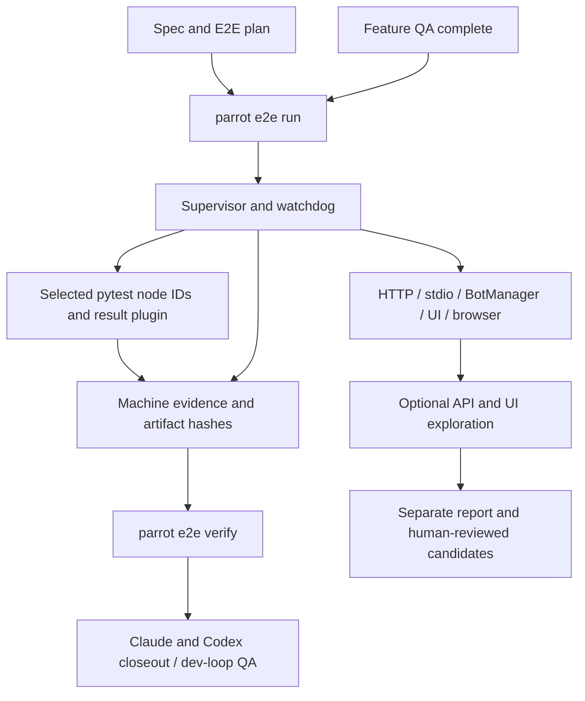

# Feature Specification: Deterministic E2E Gate and Agentic Exploration

**Feature ID**: FEAT-581
**Date**: 2026-09-19
**Author**: Jesus Lara (jesuslarag@gmail.com); specification prepared by Codex
**Status**: approved
**Target version**: next compatible 1.0.x release; release assignment pending
**Source**: `sdd/proposals/agentic-e2e-testing.brainstorm.md` (reviewed 2026-09-19)
**Research baseline**: `7b89150e1cd4426cd78a809a32aa7d3706d456ad` on `dev`

---

## 1. Motivation & Business Requirements

### Problem Statement

Existing subprocess, live-provider and in-process integration tests do not share
an SDD lifecycle/evidence contract. FEAT-563 deliberately excludes E2E from the
normal agent test tier. A passing task suite therefore does not establish that a
feature boots as a process, serves its real transport, authenticates requests or
shuts down cleanly. The standalone HTTP MCP CLI currently starts and immediately
stops its transport; skill-parser import can fetch tokenizer data over the network.

### Goals

- Add an explicit, feature-scoped E2E stage after final code-changing QA/review
  activity and before closeout, without broadening ordinary task test selection.
- Establish repeatable process-boundary checks using real local services and
  controlled fixtures, with no remote model in the deterministic tier.
- Reuse one lifecycle implementation across pytest, CLI, CI and exploratory agents.
- Block required closeout on failed, missing, stale or incomplete E2E evidence.
- Offer separately opted-in Google live checks and API/browser exploration with
  bounded provider consumption and human-reviewed candidate test promotion.
- Preserve worktree isolation, process ownership and current public APIs.

### Non-Goals (explicitly out of scope)

- Deterministic remote LLM responses, exact prose assertions or LLM-judged gates.
- Replacing FEAT-563, implementing a new QA criterion union member, or running the
  repository's entire E2E suite for each task.
- Building a production authentication system or completing navigator-session's
  unfinished cookie storage; full-profile auth remains the real application's.
- Changing `AbstractClient`, provider-wide defaults, or requiring Groq credentials.
- Automatically promoting exploration candidates, silently installing missing
  dependencies, or silently switching models when a provider fails.
- Cross-platform process supervision in v1: the harness is Linux/POSIX, matching
  Obscura and the development/CI environment. Other platforms report BLOCKED.

---

## 2. Architectural Design

### Overview

Option B is accepted: `parrot.e2e` ships in `ai-parrot-server` and is registered
lazily in core CLI. A bounded supervisor owns targets and pytest execution. A
pytest plugin emits structured per-node results. The runner, not an agent,
computes evidence and the verdict. An independent validator is used at closeout.

Three tiers have separate meanings:

| Tier | Inputs | Gate role |
|---|---|---|
| `deterministic` | Real local processes, fixed data, reviewed pytest node IDs | Required when declared; no provider keys/model calls |
| `live` | Explicit opt-in, model credential, same structural assertions | Optional by default; required only by an explicit scenario declaration |
| `exploratory` | Host API/UI tester agent, plan, bounded target | Separate observations and candidates; cannot produce gate PASS |

An optional feature-level E2E policy remains advisory even when a scenario fails;
its report must still say FAIL/BLOCKED. Under `required`, every required scenario
must execute successfully. `none` launches nothing. A missing policy defaults to
`optional` for compatibility; no plan means no automatic run for optional specs.
Malformed policy values fail metadata validation instead of silently defaulting.

### Component Diagram



### Integration Points

| Existing Component | Integration Type | Notes |
|---|---|---|
| Core `LazyGroup` | extends | Register `e2e` with an `ai-parrot-server` install hint |
| Standalone MCP CLI | fixes | HTTP-only keep-alive and signal cleanup; Unix already blocks |
| `ObscuraProcessManager` | uses pattern | Preserve API; explicit ownership, allocated port and private profile |
| `BotManager.setup()` | uses | New minimal target, explicit disabled discovery and real Redis sessions |
| Google client satellite | opt-in extension | Per-request generation budget; no change to default callers |
| `QANode` | adds stage | Invoke CLI after final deterministic QA; do not route it through the E2E-excluding selector |
| Claude `qa-runner` | adds stage | Run only plan scenarios; retain existing PASS/FAIL output contract |
| Claude/Codex spec and done surfaces | extends | Generate plans; validate evidence before any closeout mutation |
| Pytest markers/conftests | reuses | Existing `e2e`, `live`, `real_llm`; new suite-local opt-in enforcement |
| CI | adds workflow | Scheduled/manual deterministic job; separately dispatched live job |

### Data Models

All new persisted models use Pydantic v2 with `extra="forbid"`, schema version 1,
UTC timestamps and canonical JSON serialization. IDs are nonempty safe slugs;
paths resolve inside the worktree or the declared artifact root and reject traversal
and escaping symlinks. The tables below are normative field contracts, not existing
classes. Models live in `parrot.e2e.models` unless otherwise specified.

| Model | Required fields and constraints |
|---|---|
| `E2EPlan` | `schema_version=1`, `feature_id`, `spec_path`, `policy: required\|optional\|none`, `targets: dict[str, TargetConfig]`, `scenarios: list[ScenarioSpec]`, `budget: LiveBudget`, `run_timeout_s=600` (1..3600) |
| `TargetConfig` | `kind: mcp-toolkit\|mcp-stdio\|mcp-agent\|botmanager\|ui\|browser`, `profile: minimal\|full=minimal`, `startup_timeout_s=60`, `shutdown_timeout_s=10`, `options: dict[str, JsonValue]`; target adapter validates allowed option keys before spawn |
| `ScenarioSpec` | `id` unique, `tier: deterministic\|live\|exploratory`, `target_ids: list[str]`, `required: bool`, `node_ids: list[str]`, `timeout_s=60`, `prerequisites: list[str]`, `assertions: list[str]`; codified tiers require explicit node IDs, exploration requires none and cannot be required |
| `LiveBudget` | `model="google:gemini-2.5-flash-lite"`, `max_calls=4`, `max_output_tokens=512`, `max_request_bytes=16384`, `timeout_s=60`; positive finite limits |
| `ProcessIdentity` | `pid`, `pgid`, `create_time`, `boot_id`, `owned: bool`; no signaling based on a bare PID |
| `RunState` | `schema_version`, `feature_id`, `run_id`, canonical `worktree`, `owner_id`, controller/supervisor/process identities, `target_id`, `status: starting\|ready\|stopping\|stopped\|failed`, `endpoint` (nullable), `control_socket`, `started_at`, `deadline`, `log_path`, `shutdown_forced`, `cleanup_complete` |
| `SourceIdentity` | `commit`, `manifest_sha256`, `spec_sha256`, `plan_sha256`, `environment_sha256`, `worktree`; manifest records path/mode/content hash, no source contents |
| `ScenarioResult` | scenario/node IDs, `outcome: passed\|failed\|skipped\|xfailed\|xpassed\|blocked\|missing`, reason code, pytest phases/exit, duration, target run IDs, artifact references |
| `E2EVerdict` | `schema_version`, feature/run IDs, policy, source identity before/after, selected/collected node IDs, results, counts, argv and exit codes, cleanup results, artifact hashes, `status: PASS\|FAIL\|BLOCKED`, `gate_satisfied: bool`, timestamps |
| `VerificationResult` | `status: PASS\|FAIL\|BLOCKED\|MISSING`, `gate_satisfied`, `reason_codes: list[str]`; MISSING is synthesized by verification, not a fabricated successful run |

`e2e-plan.md` has YAML frontmatter containing the complete `E2EPlan`; its body is
human-readable rationale. The spec remains authoritative for policy and scenario
IDs. Plan/spec disagreements are configuration errors. Required policy demands at
least one required codified scenario. A node ID belongs to one scenario only;
parameterized nodes must be enumerated, not selected by wildcard or directory.

`projects` were absent from the brainstorm: this spec adds verified affected
packages/areas. `tags` are new classification metadata, not decisions inherited
from exploration. Feature policy metadata and scenario examples introduced by this
feature are prospective; this draft does not claim a working E2E gate already exists.

### New Public Interfaces

```python
# New: packages/ai-parrot-server/src/parrot/e2e/runner.py
async def run_plan(plan_path: Path, *, worktree: Path, owner_id: str) -> E2EVerdict:
    """Execute reviewed scenarios under supervision and atomically record evidence."""

# New: packages/ai-parrot-server/src/parrot/e2e/evidence.py
async def verify_evidence(plan_path: Path, *, worktree: Path) -> VerificationResult:
    """Validate coverage, artifact hashes, source identity and cleanup without running tests."""

# New: packages/ai-parrot-server/src/parrot/e2e/supervisor.py
class E2ESupervisor:
    """Own targets, subprocess probes, leases and bounded teardown for one run."""
    async def start(self, target_id: str, config: TargetConfig) -> RunState:
        """Start the target or raise a typed configuration/readiness error."""
    async def request_stdio(self, run_id: str, payload: dict[str, JsonValue]) -> dict[str, JsonValue]:
        """Exchange one JSON-RPC request over supervisor-owned stdio pipes."""
    async def stop(self, run_id: str) -> RunState:
        """Idempotently terminate owned processes and persist verified cleanup state."""
```

CLI contracts (new):

- `parrot e2e run --plan PATH [--owner-id ID]`: foreground bounded runner; JSON
  verdict on stdout and diagnostic logs on stderr. The plan determines selection.
- `parrot e2e verify --plan PATH`: read-only validation; JSON result on stdout.
- `parrot e2e up TARGET [--config PATH] [--run-id ID] [--owner-id ID] [--timeout N]`:
  starts a supervised detached target; one RunState JSON line when ready. A config
  supplies a `TargetConfig`; fixed registry names only, not arbitrary shell commands.
- `parrot e2e status [RUN_ID]`, `logs RUN_ID [--tail N]` and
  `down [RUN_ID | --all | --stale] [--owner-id ID]`: worktree-scoped operations.
  Omitted owner defaults to the invoking runner identity; `--all` means all runs
  owned by that identity in this worktree. No cross-worktree kill flag in v1.

| Exit | Meaning for run/verify |
|---|---|
| 0 | Valid successful evidence / satisfied required coverage, or explicit policy `none` with no execution |
| 1 | Executed assertion, target, budget, teardown or coverage failure |
| 2 | Invalid plan, unsupported config/model, unsafe path or malformed evidence |
| 3 | Required prerequisite absent, or no codified scenario executed; BLOCKED |
| 4 | Missing/stale/revision-mismatched evidence, or source changed during execution |
| 130 / 143 | Interrupted by SIGINT / SIGTERM, after bounded cleanup and incomplete evidence |

A runner never converts a failed optional report into exit 0. The SDD consumer
applies the feature-level advisory policy; it records the failure even when it
permits closeout. An all-skipped/no-test run is never PASS. `verify` under `none`
reports the explicit exemption and does not fabricate a test execution.

### Process Lifecycle and Worktree Isolation

- State is worktree-local `sdd/state/e2e/<run-id>.json`, mode 0600; sockets and
  private profiles reside in a mode-0700 run directory. Logs go to
  `artifacts/logs/e2e/<run-id>/`. IDs and state locations never accept arbitrary
  filesystem paths from agent output. Atomic replacement and advisory file locks
  serialize state changes and concurrent down/stale commands.
- The launcher starts a supervisor in a new session, which starts each target in
  its own process group and immediately records identity before readiness polling.
  The supervisor owns stdout/stderr and persistent stdio pipes. For stdio, a private
  Unix control socket mediates request/response exchange; requests are serialized
  and checked for matching JSON-RPC IDs. Never expose raw stdio through a PID file.
- A separate watchdog monitors supervisor identity and a 5-second heartbeat;
  15 seconds without a heartbeat, controller death for a foreground `run`, or
  absolute deadline expiry starts teardown. Detached `up` intentionally survives
  launcher exit but always expires at a default 600-second lease (maximum 3600).
  The watchdog inherits the run manifest/control information before target spawn.
- Startup registration uses a watchdog acknowledgement handshake: target identity
  must be acknowledged before readiness can be reported. An interrupted startup
  is reconciled by scanning only the recorded supervisor's descendants/group;
  no global process-name matching. SIGKILL of controller and supervisor are tested
  separately. Simultaneous watchdog/host destruction cannot guarantee cleanup;
  next-invocation stale reconciliation is the recovery path and must be documented.
- Use SIGTERM, await exit up to 10 seconds, then SIGKILL and bounded reaping.
  Revalidate boot ID/process creation time and ownership before every signal.
  Persist unresolved cleanup as failure; never remove its state as if successful.
  Adopted browser processes are never signaled. A retained non-owned endpoint is
  compatible with cleanup success only when explicit adoption was recorded.
- Bind loopback; allocate ports per run. Retry one verified EADDRINUSE within the
  original startup deadline. Do not mistake a pre-existing service's health
  response for the child: validate child liveness and target identity/handshake.
- Child environment prepends all existing `packages/*/src` in this worktree, uses
  an explicit interpreter, disables bytecode writes and records imported module
  paths. Probe server and pytest child must both prove they use this checkout.
  Model keys are omitted from deterministic targets. Integration/discovery configs
  point at an isolated fixture config root, not the operator's channels/agents.
- Hooks are defense in depth: `SubagentStop`/session end clean the matching owner
  immediately. Portable correctness never depends on a host-specific hook, nesting
  limit, or promise that a shell process survives a sub-agent's return.

### Target and Authentication Design

| Target | Required behavior |
|---|---|
| `mcp-toolkit` | Real working-memory toolkit over HTTP. Poll configured `<base_path>/info`, then initialize/list/call; put/get/drop fixed data scoped to the run. No exact tool-count assertion. |
| `mcp-stdio` | Run existing mcp-local entry point; validate initialize, notification, list/call, stdout JSON purity and EOF shutdown. Supervisor retains pipes. |
| `botmanager` minimal | New library-owned entry point follows the docker example; disables registry/database bots and crews explicitly. Real navigator-session Redis storage, `/healthz`, protected fixture session probe and a selected real API route. |
| `mcp-agent` | Mount a fixture agent through `AgentMCPMount` at configured per-agent path; protocol readiness does not call the model. A fixture-mounted tool delegates to the real agent ask path; that live call is separately opted in and budgeted. |
| `ui` | Build/serve with pnpm using fixture backend URL before build; HTTP `/admin/` readiness followed by declared browser checks. Health alone is not browser evidence. |
| `browser` | Own Obscura on unique loopback CDP port/private profile; attach DevTools to returned endpoint. Explicit adoption is exploratory-only; deterministic browser checks require an owned isolated instance. |

Minimal authenticated tests use `SessionHandler(storage="redis").setup(app)`.
Research of installed navigator-session 1.0.1 found cookie methods unimplemented;
no service-free session storage is assumed. Provision a private local Redis
process with persistence disabled, unique port and data directory. Set `REDIS_HOST`,
`REDIS_PORT`, `SESSION_DB` before importing navigator-session; its URL is computed
from those variables, not an arbitrary `SESSION_URL` constructor argument. The
harness never flushes or kills an operator's shared Redis. Missing redis-server
blocks required authenticated scenarios; plain MCP scenarios still execute.

An E2E-only loopback bootstrap endpoint requires a one-run random bearer secret
provided through the child environment, creates a real stored synthetic session
through `navigator_session.new_session`, and returns the normal session cookie.
The protected fixture endpoint validates this session; the test then calls a real
BotManager API route. Anonymous and invalid-cookie cases must be denied on the
protected fixture endpoint. No monkeypatch, synthetic request object or injected
`sys.modules` stub is permitted in the target process. Do not claim that this
fixture authenticates production login/PBAC: full profile covers those separately.
The bootstrap route exists only in the dedicated E2E entry point and is never
registered by production `BotManager.setup()`.

The full target launches the real application with an explicit command/readiness
profile, never an assumed `/healthz`. A local opt-in spike with real configured
Postgres/Redis must measure three warm starts and three SIGTERM stops. Full is
eligible for automatic dev-loop use only if every measured readiness is ≤15s and
stop ≤10s; otherwise keep it nightly/opt-in. Historical ~1.4s MCP and ~3.5s stubbed
BotManager observations are context, not acceptance evidence.

### Evidence Identity and Gate Evaluation

Before and after execution, hash a canonical sorted manifest of tracked files
plus nonignored untracked files, including modes and relevant symlink targets.
Exclude only declared generated artifacts (`artifacts/logs/e2e/`, this feature's
run evidence/candidates, pytest caches, bytecode) and SDD task bookkeeping
(`sdd/tasks/`, `sdd/ledger/`). Do not exclude arbitrary source, templates, specs,
plans or dependencies. Hash the plan/spec separately. Any relevant mutation
invalidates the run. Environment fingerprint includes interpreter version/path,
installed distribution versions, `uv.lock`, selected model, target/tool versions,
nonsecret fixture configuration and opt-in settings; exclude credential values.

Persist immutable per-run evidence under `sdd/state/<FEAT-ID>/e2e/runs/<run-id>/`;
atomically update `e2e-verdict.json` only after shutdown. Store result JSON, logs,
JUnit XML and screenshots by relative path with SHA-256 hashes. Partial/interrupted
runs may be inspected but cannot validate. Evidence is provenance, not a security
signature against a malicious repository author.

Validation requires exact expected/collected/executed node coverage, successful
setup/call/teardown phases, and no required skip, xfail, xpass or missing node.
Pytest exit zero alone is insufficient. Target/runner cleanup failure fails the
run even if test assertions passed. A missing prerequisite yields BLOCKED, an
executed regression yields FAIL. Unknown/malformed schema fails closed.

Closeout accepts the same commit or a descendant with identical source manifest,
spec/plan hashes and environment fingerprint. Only excluded bookkeeping changes
may differ. A source change, merge conflict resolution, model/config change or
artifact tampering requires a new run; no freshness TTL substitutes for identity.
`--force` must not fabricate PASS or bypass a required E2E gate in v1. Waivers are
out of scope; users must explicitly revise the spec policy if requirements change.

### Live Provider Budget

Default model is `google:gemini-2.5-flash-lite`; credential is `GOOGLE_API_KEY`
resolved through navconfig by the existing Google client. Require
`PARROT_TEST_E2E=1` and `PARROT_TEST_REAL_LLM=1` before client construction.
`E2E_MODEL` and `E2E_MAX_LLM_CALLS` override plan defaults and are captured in
evidence. V1 accepts Google model IDs only when the same guard can enforce the
budget; unsupported provider overrides are configuration errors, never fallbacks.

The brainstorm's 4096-input-token proposal is an estimate, not an enforceable
pre-request tokenizer contract. V1 instead enforces a 16384-byte serialized text
request ceiling, 512 output tokens, 4 generation attempts and a 60-second live
session deadline. Record usage tokens when available; do not present byte caps
as exact token counts or a guaranteed dollar maximum. Multipart/media, grounding,
remote caching, batch/deep-research and streaming are disabled for budgeted v1.

Add an **optional** Google-client generation-budget hook for nonstreaming `ask`:
all initial chat sends, tool continuation sends, structured-repair generations
and retries reserve from one budget before network dispatch. The byte measurement
includes the rendered history, system instruction, tool definitions/results and
new prompt, not just the latest user message. SDK automatic retries
and automatic function calling must be disabled in this mode; wrapper-level
retries consume another reservation. A budget exception is non-retryable and no
fallback executes. Token growth on MAX_TOKENS is clamped to the budget ceiling.
Existing callers without the hook keep current behavior. The server owns the
shared per-run counter/lock; sequential live scenarios reuse it and cannot create
fresh allowances per test. No changes to `clients/base.py` are authorized.

All model calls still go through an `AbstractClient` implementation. The adapter
change remains inside `ai-parrot-client-google`; the harness never invokes a
provider SDK. Exploration host token costs remain outside this target budget.

---

## 3. Module Breakdown

### Delegation-eligible modules

| Module | Eligible? | Decided patterns / exact contracts | Why not (if no) |
|---|---|---|---|
| M1 prerequisite fixes | yes | HTTP-only wait/signals; lazy cached encoder; focused regressions | — |
| M2 schemas and evidence | yes | §2 models, manifest exclusions, exit codes, atomic evidence/verification | — |
| M3 supervision and CLI | no initially | §2 lifecycle, ownership and watchdog contracts | Spike must validate crash-window recovery and Obscura profile arguments before a mechanical task packet |
| M4 target adapters | no initially | §2 route/session/Redis/stdio contracts | Verify real handler session payload and installed Obscura flags in spike; do not guess them |
| M5 pytest result bridge and deterministic tests | yes after M2/M3 | Explicit node IDs, pytest phase outcomes, artifacts, suite-local opt-in | — |
| M6 Google budget and live tests | no initially | §2 byte/call/output ceilings, shared counter, non-retryable exhaustion | Audit every nonstreaming send/repair and SDK retry setting before freezing task implementation blocks |
| M7 SDD integration | yes after M2/M5 | Separate stage, verify before closeout, unchanged ordinary selector | — |
| M8 exploration/UI workflow | yes after M3/M4 | Separate report, owned browser, human-only candidates | — |
| M9 CI/docs/performance spike | yes | Dedicated scheduled/manual workflow, no-secret deterministic job, full-profile thresholds | — |

Eligibility is a planning annotation, not permission for workers to invent API,
layout, auth or lifecycle decisions. Ineligible modules start with a bounded
research/contract task; their implementation tasks depend on that verified output.

### M1: Prerequisite lifecycle and tokenizer fixes

- **Paths**: `packages/ai-parrot-server/src/parrot/mcp/cli.py`,
  `packages/ai-parrot/src/parrot/skills/parsers.py`; focused package-local tests.
- **Responsibility**: HTTP serve waits for stop; signal cleanup in `finally`;
  tokenizer created on first count and reused. Offline boot with an empty cache
  must not tokenize implicitly. First real tokenization may still require cache.
- **Depends on**: existing MCP lifecycle and skill parser.
- **Interfaces**: preserve `_run_standalone_server(mcp_server)` and
  `_count_tokens(text: str) -> int`; no new public signatures.

### M2: Plan models and evidence validator

- **Paths**: new `packages/ai-parrot-server/src/parrot/e2e/{__init__,models,plan,evidence,errors}.py`.
- **Responsibility**: validated metadata, manifest hashing, coverage, artifact
  validation and exit mapping. Proposed typed errors: `E2EConfigError`,
  `E2EPrerequisiteError`, `E2ETargetError`, `E2EBudgetError`, `E2EEvidenceError`.
- **Depends on**: Pydantic, existing YAML parser, stdlib hashing/Git subprocesses.
- **Interfaces**:
  ```python
  def load_plan(path: Path, *, worktree: Path) -> E2EPlan:
      """Validate frontmatter, contained paths and spec/plan policy consistency."""
  async def capture_identity(plan: E2EPlan, *, worktree: Path) -> SourceIdentity:
      """Hash the normative source manifest and nonsecret environment inputs."""
  async def verify_evidence(plan_path: Path, *, worktree: Path) -> VerificationResult:
      """Validate immutable run artifacts and current implementation identity."""
  ```

### M3: Supervisor, watchdog, state and CLI

- **Paths**: new `parrot/e2e/{supervisor,watchdog,state,control,runner,cli}.py`
  under ai-parrot-server; core `parrot/cli/__init__.py` registration.
- **Responsibility**: §2 ownership, crash recovery, result aggregation and CLI.
- **Depends on**: M2 and M4 adapter protocol; M1 for standalone HTTP.
- **Interfaces**: `E2ESupervisor` and `run_plan` in §2. Internal watchdog entry
  point is `python -m parrot.e2e.watchdog --state-dir PATH --run-id ID`; it is
  supervisor-owned and validates state rather than accepting arbitrary kill PIDs.

### M4: Target registry and fixture entry points

- **Paths**: new `parrot/e2e/targets/{__init__,base,mcp,botmanager,ui,browser,redis}.py`
  under ai-parrot-server; minimal full-profile configuration examples in docs.
- **Responsibility**: fixed target builders, dependency/preflight probes, protocol
  readiness, fixture auth and private service configuration.
- **Depends on**: M1–M3, installed navigator-session and selected external binaries.
- **Interface skeleton**:
  ```python
  class TargetAdapter(Protocol):
      """Target-specific argv/env, readiness and identity checks."""
      async def prepare(self, config: TargetConfig, *, run_id: str, worktree: Path) -> LaunchSpec:
          """Return validated argv/env/cwd; raise E2EPrerequisiteError before spawning."""
      async def ready(self, state: RunState) -> bool:
          """Verify the configured protocol endpoint and child identity."""
  ```
  `LaunchSpec` is a new nonpersisted Pydantic model with `argv: list[str]`,
  `env: dict[str,str]`, `cwd: Path`, `stdio: bool`; secret-bearing env is excluded
  from repr/logs/serialization. Commands use argv execution, never shell strings.

### M5: Pytest bridge and deterministic scenarios

- **Paths**: new `parrot/e2e/pytest_plugin.py`,
  `packages/ai-parrot-server/tests/e2e/{conftest,test_mcp_http,test_mcp_stdio,test_botmanager,test_supervisor,test_evidence}.py`;
  isolated fixture payloads under that directory; unit tests under
  `packages/ai-parrot-server/tests/unit/e2e/`.
- **Responsibility**: controlled fixtures call supervisor control API, opt-in before
  startup, collect phases/exact node IDs, fail missing coverage and retain artifacts.
- **Depends on**: M2–M4.
- **Interface**: plugin loaded explicitly with `-p parrot.e2e.pytest_plugin`, run ID
  and control socket supplied in env by the runner. No auto-loading dependency
  that changes every existing pytest run. Target subprocesses do not inherit
  pytest's `sys.modules` shims.

### M6: Optional Google request budget and live agent checks

- **Paths**: new `packages/ai-parrot-client-google/src/parrot/clients/google/budget.py`;
  modify sibling `client.py`; new satellite budget unit tests;
  new `parrot/e2e/live.py` and server `tests/e2e/test_mcp_agent_live.py`.
- **Responsibility**: request-level ceiling enforcement through the existing client,
  real fixture tool/schema smoke, explicit credential/opt-in gating.
- **Depends on**: M2–M5; audited send-path spike before implementation.
- **Proposed interface** (new, not an existing base-client extension):
  ```python
  class GenerationBudget:
      """Per-run nonstreaming Google budget; reserves before network attempts."""
      async def reserve(self, *, request_bytes: int, output_tokens: int) -> None:
          """Atomically reserve an attempt or raise non-retryable GenerationBudgetExceeded."""
  ```
  Google `__init__` accepts optional `generation_budget`; no hook means unchanged
  behavior. The harness maps exhaustion to `E2EBudgetError`. Its live actor owns
  the shared budget for the entire run; no hidden provider calls in collection,
  readiness, semantic judging or repair outside this boundary.

### M7: SDD plans, runner invocation and closeout

- **Paths**: `sdd/templates/spec.md`, `.claude/commands/{sdd-spec,sdd-done}.md`,
  `.agents/skills/{sdd-spec,sdd-done}/SKILL.md`, `.claude/agents/{qa-runner,sdd-qa}.md`,
  packaged `packages/ai-parrot/src/parrot/flows/dev_loop/_subagent_data/sdd-qa.md`,
  `packages/ai-parrot/src/parrot/flows/dev_loop/nodes/qa.py`, new sibling `e2e.py`.
- **Responsibility**: consistent plan schema and closeout behavior for both hosts;
  run after QA/triage modifications and before final report aggregation.
- **Depends on**: M2/M3/M5.
- **Interface**:
  ```python
  async def run_e2e_stage(*, worktree: Path, spec_path: Path, feature_id: str) -> dict[str, Any]:
      """Invoke the optional server CLI as a bounded subprocess and return validated evidence summary."""
  ```
  Core does not import server modules: use lazy subprocess dispatch so no-E2E
  flows still work without ai-parrot-server. Required missing installation/plan
  fails the E2E stage. Record summary in shared QA state and notes; AND required
  gate satisfaction into existing QA `passed`. Ordinary test-scope policy and
  criterion union stay unchanged. Keep `qa-runner`'s `verdict: PASS|FAIL` contract;
  record the richer E2E result separately. No new `Agent` tool permission is needed
  for deterministic QA. Exploration is invoked by the outer orchestrator/manual
  skill; do not assume the current plan-mode qa-runner can spawn child agents.

### M8: Exploration and browser workflow

- **Paths**: new `.claude/agents/{e2e-api-tester,e2e-ui-tester}.md`,
  `.claude/skills/e2e/SKILL.md`, `.agents/skills/e2e/SKILL.md`,
  `.claude/hooks/e2e-teardown.sh`; browser support in M4.
- **Responsibility**: read plan, allocate owner ID, probe only fixture targets,
  record `e2e-exploration.json`, propose candidates outside pytest discovery.
- **Depends on**: M3/M4; M6 only for explicit Parrot live calls.
- **Contract**: exploration schema has feature/run IDs, observations, reproduction
  commands, artifact refs and candidate paths; it has no gate `passed` field.
  Host permissions/nesting/MCP support are checked before dispatch; unavailable
  exploration is reported as unavailable and cannot invalidate valid deterministic
  evidence. Hooks clean their owner, never a shared machine-wide state directory.

### M9: CI, documentation and performance evidence

- **Paths**: new `.github/workflows/e2e.yml`, `docs/testing/agentic-e2e.md`,
  `packages/ai-parrot-server/tests/e2e/plans/{deterministic,live}.md`.
- **Responsibility**: nightly cron `0 3 * * *` and workflow_dispatch deterministic
  job; separate live job only on dispatch with explicit live input and secret.
  Install existing package/dev dependencies through uv; provision Redis binary
  for fixture-owned processes. Browser lane has explicit pinned binary/Node/pnpm
  prerequisites and may be separately selected; it is not silently skipped as green.
- **Depends on**: M5/M7; M6 for live job and M8 for exploratory usage docs.
- **Contract**: no broad root `pytest -m e2e`, no collection-error suppression,
  logs/evidence upload on failure, concurrency scoped by workflow/ref. Missing
  live secret is BLOCKED when the live job was explicitly requested. Never expose
  credentials to pull-request forks. No exploratory agents in CI.

---

## 4. Test Specification

### Unit Tests

| Test | Module | Description |
|---|---|---|
| `test_plan_rejects_invalid_selection` | M2 | Duplicate/missing nodes, traversal, policy mismatch, arbitrary shell commands rejected |
| `test_required_skip_and_xfail_never_pass` | M2/M5 | pytest exit 0 does not override incomplete required coverage |
| `test_evidence_source_and_artifact_identity` | M2 | Source/config/model/log mutation rejected; bookkeeping-only descendant accepted |
| `test_optional_policy_preserves_failure` | M7 | Failed optional E2E is advisory but remains FAIL in evidence |
| `test_pid_reuse_and_foreign_owner_not_signaled` | M3 | Wrong boot/create time, owner or worktree refuses signaling |
| `test_state_atomic_and_down_idempotent` | M3 | Concurrent down/stale operations cannot lose cleanup state |
| `test_generation_budget_all_send_paths` | M6 | Initial/continuation/repair/retry count; MAX_TOKENS cannot raise cap |
| `test_budget_exception_cannot_fallback` | M6 | No further network call after exhaustion; no-hook caller unchanged |
| `test_default_selector_still_excludes_e2e` | M7 | Dedicated stage added without changing FEAT-563 selection |
| `test_closeout_blocks_before_mutation` | M7 | Missing/stale/blocked evidence prevents stamp/push/PR/merge/cleanup |
| `test_live_opt_in_before_client_construction` | M5/M6 | Missing flags/key cause zero provider/client creation |

### Integration Tests

| Test | Description |
|---|---|
| `test_http_cli_stays_alive_and_stops` | Actual CLI serves two protocol requests separated in time; SIGTERM stops it |
| `test_unix_lifecycle_not_regressed` | Existing blocking Unix behavior and socket cleanup preserved |
| `test_botmanager_offline_boot` | Fresh subprocess, controlled empty tokenizer cache, networking disabled except fixture loopback; no stubs |
| `test_stdio_tool_roundtrip_and_eof` | Real pipes, JSON purity, fixed tool effect and EOF exit |
| `test_authenticated_minimal_profile` | Real private Redis/session round-trip, protected fixture rejection/acceptance and real API response |
| `test_controller_and_supervisor_death` | Kill controller/supervisor separately during startup and readiness; watchdog cleans verified owned processes |
| `test_timeout_and_grandchild_teardown` | Hung process tree forces bounded group cleanup and records forced stop |
| `test_two_worktrees_independent` | Concurrent ports/state/Redis/browser profiles; down cannot kill sibling run |
| `test_wrong_checkout_cannot_pass` | Imported target/client module origins checked against feature worktree |
| `test_required_e2e_devloop_and_closeout` | Required E2E controls final QA and both closeout surfaces on matching source |
| `test_live_google_tool_and_schema` | Explicit paid opt-in; structural output and observable fixture tool effect within one run budget |
| `test_ui_browser_console_network` | Owned browser, `/admin/`, declared interaction, no unexpected console errors/5xx; screenshot on failure |

### Test Data / Fixtures

Use synthetic payloads only: working-memory values, fixed synthetic session user,
fixture agent tool returning a known object, per-run isolated Redis and browser
profile, and local UI/backend endpoints. Per-run secrets come from parent-generated
environment values and are never committed. Fake processes/transports are allowed
for harness unit tests; the process-boundary integration suite uses real services.
Use fresh subprocess imports to avoid existing root/package pytest shims.

### E2E Scenarios

This feature's generated implementation plan must cover HTTP/stdio lifecycle,
authenticated minimal profile, watchdog/crash isolation and evidence rejection as
required deterministic scenarios. Google and UI exploration are optional live/
exploratory lanes unless a task/spec explicitly elevates a codified scenario.
Browser codified checks require the installed browser lane; absence is visible.
A required live override must select the live scenario explicitly; the deterministic
CI plan must contain no required live node IDs.

Validation commands for implementation (run in an activated environment, logs
under `artifacts/logs/`; exact node IDs are supplied by the generated plan):

```bash
pytest packages/ai-parrot-server/tests/unit/e2e/ -q
PARROT_TEST_E2E=1 parrot e2e run --plan packages/ai-parrot-server/tests/e2e/plans/deterministic.md
parrot e2e verify --plan sdd/state/FEAT-581/e2e-plan.md
```

The canonical feature plan is generated during task decomposition after node IDs
are frozen. Its evidence is not available during specification authoring. Provider
unit/regression tests run without live credentials; live CI is separately opted in.

---

## 5. Acceptance Criteria

- [ ] AC1: HTTP CLI lifetime and lazy-tokenizer regressions pass with real subprocesses; Unix behavior remains intact.
- [ ] AC2: Invalid/missing plans and unsafe paths fail before target startup; lazy CLI works with a clear missing-extra error.
- [ ] AC3: Toolkit HTTP and stdio scenarios execute real protocol/tool round-trips without remote model credentials.
- [ ] AC4: Minimal BotManager uses real isolated Redis sessions; required missing service is BLOCKED and anonymous protected requests fail.
- [ ] AC5: Timeout/cancellation/controller or supervisor death cleans owned processes within documented deadlines; foreign/reused PIDs and adopted browsers are never killed.
- [ ] AC6: Concurrent worktrees use distinct ports/state/data/browser profiles and demonstrably import their own source trees.
- [ ] AC7: Required zero-collection, skip/xfail/xpass, setup/teardown failure, stale source or tampered artifacts cannot produce valid PASS.
- [ ] AC8: Evidence survives bookkeeping-only closeout commits through explicit content equivalence; any relevant implementation change requires rerun.
- [ ] AC9: Claude/Codex closeout checks the same evidence contract before mutations; generic force cannot bypass required E2E.
- [ ] AC10: Dev-loop runs a separate feature E2E stage after final edits; no-E2E flows retain behavior and standard selectors still exclude E2E.
- [ ] AC11: Optional live Google checks have explicit flags/key and enforce aggregate request/byte/output/deadline caps across retry/tool/repair paths; no Groq or fallback requirement.
- [ ] AC12: Exploratory reports never become gate evidence; candidate tests are outside discovery and promotion requires human review.
- [ ] AC13: Owned browser/UI lane verifies real navigation/console/network behavior using the allocated endpoint; absent tooling is reported explicitly.
- [ ] AC14: Scheduled/manual deterministic CI requires no provider secrets, publishes failure artifacts and never ignores collection errors; live CI is separate and opt-in.
- [ ] AC15: Documentation covers setup, target/auth limitations, opt-ins, cost semantics, host-independent cleanup and evidence reuse.
- [ ] AC16: Full-profile measurement is recorded with environment/commands; promote to automatic use only if all three warm runs meet ≤15s readiness and ≤10s graceful exit. Missing authorized infrastructure records BLOCKED and leaves full opt-in.
- [ ] AC17: Focused unit, integration, provider-regression tests and ruff pass; new Python is black-formatted at 120 columns; no modification to `clients/base.py`.

---

## 6. Codebase Contract

Source declarations were re-read against the research baseline. Runtime-heavy
imports and live calls were not executed during this documentation step. Paths
below are repository-relative; dependency-source anchors are explicitly labeled.
New interfaces in §2/§3 must not be mistaken for pre-existing imports.

### Verified Imports

```python
from parrot.clients.factory import LLMFactory
# packages/ai-parrot/src/parrot/clients/factory.py:163,257
from parrot.clients.google import GoogleGenAIClient, GoogleModel
# packages/ai-parrot-client-google/src/parrot/clients/google/__init__.py:1,3
from parrot.mcp.server import MCPServer
# packages/ai-parrot-server/src/parrot/mcp/server.py:36
from parrot.mcp.config import MCPServerConfig, AgentMCPMountConfig
# packages/ai-parrot-server/src/parrot/mcp/config.py:131,19
from parrot.mcp.agent_mount import AgentMCPMount
# packages/ai-parrot-server/src/parrot/mcp/agent_mount.py:265
from parrot.mcp.obscura import ObscuraProcessManager, ObscuraProcessConfig
# packages/ai-parrot-server/src/parrot/mcp/obscura.py:63,29
from parrot.tools.working_memory.tool import WorkingMemoryToolkit
# packages/ai-parrot/src/parrot/tools/working_memory/tool.py:47
from navigator_session import SessionHandler, new_session
# installed navigator_session/__init__.py:23,37 (dependency, version 1.0.1)
```

### Existing Class Signatures

```python
# packages/ai-parrot-server/src/parrot/mcp/server.py:39,64,68,72
class MCPServer:
    def __init__(self, config: MCPServerConfig, parent_app: Optional[web.Application] = None): ...
    def register_tools(self, tools: List[AbstractTool]): ...
    async def start(self): ...
    async def stop(self): ...

# packages/ai-parrot-server/src/parrot/mcp/agent_mount.py:298,344
class AgentMCPMount:
    def __init__(self, bot_manager: Any, config: AgentMCPMountConfig,
                 policy_filter: ToolPolicyFilter | None = None,
                 pbac_resolver: PBACResolver | None = None,
                 audit_sink: AuditSink | None = None,
                 auth_template: MCPServerConfig | None = None) -> None: ...
    def setup(self, app: web.Application) -> web.Application: ...

# packages/ai-parrot-server/src/parrot/mcp/obscura.py:73,95,142,259
class ObscuraProcessManager:
    def __init__(self, config: ObscuraProcessConfig,
                 logger: Optional[logging.Logger] = None) -> None: ...
    async def is_running(self) -> bool: ...
    async def start(self) -> str: ...
    async def stop(self) -> None: ...

# packages/ai-parrot-client-google/src/parrot/clients/google/client.py:630
async def get_client(self, model: str = None, **kwargs) -> genai.Client: ...
# genai is an existing internal provider implementation dependency;
# this signature does not authorize SDK imports in the E2E harness.
```

`MCPServerConfig` and `ObscuraProcessConfig` are existing dataclasses; do not call
Pydantic-only methods on them. `AgentMCPMountConfig` is Pydantic. The new E2E
models remain Pydantic per project conventions.

### Integration Points

| New Component | Connects To | Via | Verified At |
|---|---|---|---|
| E2E CLI | LazyGroup registries | command module/install hint | `packages/ai-parrot/src/parrot/cli/__init__.py:109,136` |
| HTTP prerequisite | standalone lifecycle | wait after returning HTTP start, cleanup finally | `packages/ai-parrot-server/src/parrot/mcp/cli.py:138,174` |
| HTTP readiness | route registration | configured base plus `/info` | `packages/ai-parrot-server/src/parrot/mcp/transports/http.py:38,92,94` |
| Unix non-regression | blocking lifecycle | awaits its serve task | `packages/ai-parrot-server/src/parrot/mcp/transports/unix.py:43,69` |
| Offline prerequisite | skill parsing | lazy `_ENCODING`, `_count_tokens` | `packages/ai-parrot/src/parrot/skills/parsers.py:29,32` |
| Minimal app | BotManager | explicit constructor flags/setup | `packages/ai-parrot-server/src/parrot/manager/manager.py:188,2222` |
| Minimal health | fixture pattern | aiohttp app and `/healthz` | `docker/integrations/server.py:18,22` |
| Stdio fixture | legacy subprocess test | spawn/send/recv/shutdown pattern | `tests/mcp/test_mcp_local_e2e.py:72,85,90,107` |
| Per-agent readiness | agent mount | per-agent path | `packages/ai-parrot-server/src/parrot/mcp/agent_mount.py:344,363` |
| Live credentials | Google client | navconfig lookup | `packages/ai-parrot-client-google/src/parrot/clients/google/client.py:189` |
| Live model | model enum | stable model ID | `packages/ai-parrot-client-google/src/parrot/clients/google/models.py:44` |
| Live request guard | ask/tool/repair sends | optional budget at actual send boundaries | `packages/ai-parrot-client-google/src/parrot/clients/google/client.py:1051,1857,3039,3399,3656` |
| QA stage | final QA aggregation | after final test/review edits, before passed update | `packages/ai-parrot/src/parrot/flows/dev_loop/nodes/qa.py:325,350` |
| Selector preservation | agent policy | no marker relaxation | `packages/ai-parrot/src/parrot/flows/dev_loop/test_scope/policy.py:7` |
| Criteria compatibility | current union | Flowtask/Shell/Manual unchanged | `packages/ai-parrot/src/parrot/flows/dev_loop/models/base.py:114` |
| Pytest suite | existing marker registration | reuse marker | `pytest.ini:9`, `packages/ai-parrot-server/tests/conftest.py:163,169` |
| Claude QA | feature selector/output | add stage, preserve report contract | `.claude/agents/qa-runner.md:61,85` |
| Codex closeout | evidence step | validate before stamping/integration | `.agents/skills/sdd-done/SKILL.md:50,70` |
| Claude closeout | worktree evidence step | same validator | `.claude/commands/sdd-done.md:116` |

Installed dependency research (not new repository files):
`navigator_session/session.py:12,23` constructs Redis storage and installs its
middleware; `storages/redis.py:41` builds its pool from imported `SESSION_URL`;
`conf.py:36-39` derives that URL from host/port/database; `storages/cookie.py:58-94`
has unfinished session methods. Installed source root is
`.venv/lib/python3.12/site-packages/navigator_session/`, version 1.0.1; reverify the
same API against the lockfile-resolved environment when implementing.

### Does NOT Exist (Anti-Hallucination)

- `parrot.e2e`, `parrot e2e run/verify`, `GenerationBudget`, E2E policy enforcement
  and the schemas above are new work, not existing imports/commands.
- There is no `E2ECriterion`; existing `AcceptanceCriterion` includes ManualCriterion.
- `PARROT_TEST_E2E` is a new suite opt-in; registering `e2e` again is not needed.
- No service-free working cookie backend was found in installed navigator-session.
- No profile parameter exists on `ObscuraProcessConfig`; profile handling must be
  verified in the adapter spike, not passed as an invented constructor argument.
- `/healthz` in the docker minimal example is not a route guaranteed by `run.py`.
- Agent mount readiness is not universally `/mcp/info`.
- The existing Google client has no aggregate request-budget guarantee. Its small
  MAX_TOKENS path can increase the cap; low `max_tokens` alone is insufficient.
- `qa-runner` currently has Read/Bash/Glob/Grep and plan permission mode, not an
  assumed unrestricted nested-agent execution capability.

---

## 7. Implementation Notes & Constraints

### Patterns to Follow

Async subprocess/aiohttp operations for I/O, Pydantic v2 persisted models,
logger diagnostics and deliberate CLI JSON output. `click.echo` is permitted for
CLI protocol output; do not introduce `print`. Existing Google SDK calls remain
inside its provider package. No banned HTTP libraries or new runtime dependencies.
Use uv package metadata and target-specific preflight rather than installation
side effects. Never copy credentials from a user's application environment to logs.

### Known Risks / Gotchas

- Root/package pytest conftests install shims: real target verification must use
  a clean subprocess and record origin paths, not just import success in pytest.
- Process identity/registration crash windows need an adversarial spike before M3
  is delegation-ready. Do not label host-wide kill cleanup guaranteed.
- Real session data shape and cookie acceptance need a wire-level spike; the
  unfinished cookie backend must not be used as a shortcut.
- Provider SDK hidden retries and chat continuations can bypass naive accounting.
  M6 must prove coverage with a counting fake transport and unchanged-default tests.
- UI build writes must stay in generated/artifact directories; if a build changes
  tracked output, identity validation correctly invalidates evidence.
- Spec/evidence hashes create ordering constraints: freeze the implementation plan
  before running; closeout task stamps are excluded, spec edits are not.
- Browser binaries and full-profile services are external prerequisites, not new
  Python libraries. Explicitly record BLOCKED rather than claiming measured success.

### External Dependencies

| Package/tool | Existing version constraint / provenance | Reason |
|---|---|---|
| Pydantic v2, aiohttp, click, PyYAML | existing workspace package metadata | schemas, transport, CLI, plan parsing |
| psutil | `>=5.9`, core pyproject | process identity and liveness |
| navigator-session | `>=1.0.1`, core pyproject | real Redis-backed sessions |
| ai-parrot-client-google / google-genai | workspace satellite / `>=2.23.0` | optional live model client |
| pytest / pytest-asyncio / pytest-aiohttp | existing dev group | tests and result plugin |
| redis-server | provisioned local/CI binary, version captured | isolated fixture sessions |
| Obscura | existing integration targets v0.2.2; verify installed binary | owned browser |
| chrome-devtools-mcp | root package declares `^1.6.0`; exact tested version pinned by implementation | optional browser exploration |
| Node/pnpm | existing UI toolchain; record tested versions | UI build/preview |

Model capabilities/pricing were checked during the preceding brainstorm review at
[Google's model page](https://ai.google.dev/gemini-api/docs/models/gemini-2.5-flash-lite)
and [pricing page](https://ai.google.dev/gemini-api/docs/pricing). Published price
is not a locked contractual budget; this feature enforces request/resource caps.

### Worktree Strategy

**Isolation: mixed.** Implement prerequisite fixes and M2 contracts sequentially
in the feature worktree. After the M3/M4 research tasks fix implementation packets,
harness/fixtures, SDD surfaces and live-provider work can proceed in separate task
worktrees. Serialize edits to core CLI, Google client and QA node. M8/M9 consume
stable contracts after M3/M5. All lanes merge back to the same feature branch;
run final E2E against that integrated revision before closeout. No implementation
worktree is created by this specification step.

---

## 8. Open Questions

### Resolved Decisions Carried from Exploration

- [x] Flow: feature on dev.
- [x] Default profile: minimal; full remains opt-in unless the measured thresholds pass.
- [x] Targets: separate toolkit and agent MCP targets plus stdio, BotManager, UI/browser.
- [x] Harness home: ai-parrot-server, registered lazily in core CLI.
- [x] Candidate promotion: human-only; exploration never supplies gate PASS.
- [x] Gate force: blocking only under required policy; missing required evidence blocks.
- [x] Browser approach: Obscura owns Chrome; DevTools attaches to the allocated endpoint.
- [x] Provider: Google Flash-Lite and GOOGLE_API_KEY; no Groq requirement.
- [x] Session backend: private Redis, because installed cookie storage is incomplete.
- [x] Exit codes, scenario/evidence schemas and content-equivalent reuse: §2.
- [x] Process supervision: dedicated watchdog, identity validation, heartbeat and absolute lease; host hooks are supplemental.
- [x] Live input cap: serialized byte ceiling replaces an unverified exact input-token cap; call/output/deadline limits are mandatory.

### Implementation Spike Gates (not delegated design choices)

- [ ] Validate session payload/cookie wire round-trip using the installed lockfile environment — owner: M4; blocks M4 implementation packet.
- [ ] Validate crash-window recovery and Obscura private-profile launch flags — owner: M3/M4; blocks those implementation packets.
- [ ] Audit Google nonstreaming send/repair paths and SDK retry-disable settings; freeze budget task packet — owner: M6.
- [ ] Record full-profile measurement with authorized real services; if unavailable retain opt-in/BLOCKED status — owner: M9.
- [ ] Assign exact release version — owner: maintainer; non-blocking for decomposition.

---

## 9. Design Research Cross-Check

Independent design seat: **skipped**. The input remains an exploration document,
not a formally accepted brainstorm; no independent reviewer was invoked for this
specification. The preceding Codex review and current source verification are
primary-author research, not an independent second opinion. No transcript is claimed.

| # | Suggestion (kind) | Disposition | Reason | Landed in |
|---|---|---|---|---|
| — | No independent suggestions received | — | No separate research seat invoked | — |

Summary: **0** independently confirmed · **0** rejected · **0** escalated.

---

## Revision History

| Version | Date | Author | Change |
|---|---|---|---|
| 0.1 | 2026-09-19 | Jesus Lara / Codex | Initial draft from reviewed brainstorm; concrete evidence/lifecycle/SDD contracts and verified Redis/provider constraints |
