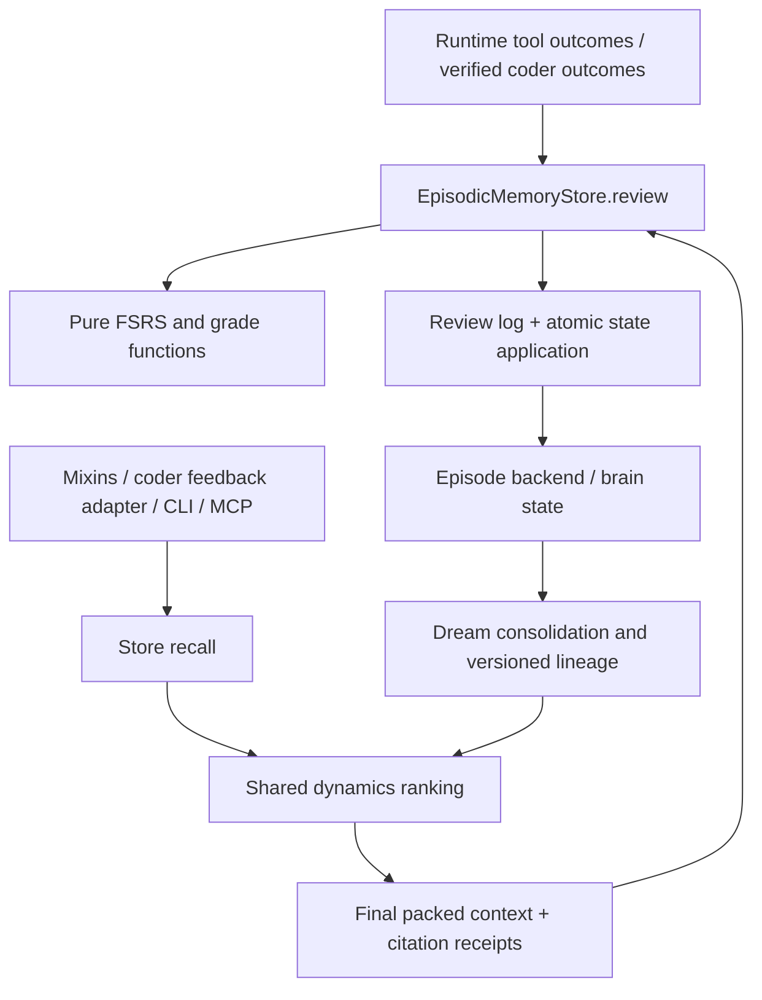

# Feature Specification: Agent Memory Dynamics

**Feature ID**: FEAT-571
**Date**: 2026-09-18
**Author**: Jesus Lara, with Codex
**Status**: approved — gate-first specification. Lane 0 (G1–G4 gate tasks and the M0 repair) is released for decomposition; M1–M6 stay blocked until their gate amendments are reviewed and merged into this document.
**Target version**: next release after gate acceptance; release number unassigned

**Inputs:** [accepted brainstorm](../proposals/memory-dynamics.brainstorm.md), [accepted proposal](../proposals/memory-dynamics.proposal.md), and [proposal findings](../state/FEAT-569/findings/).
The proposal's Design Corrections and §2.2 override conflicting brainstorm sketches, as explicitly accepted in the brainstorm's Amendments. FEAT-569 is only the proposal audit identity. The allocator reserved FEAT-571 for this specification in commit `d8664446e`.

## 1. Motivation & Business Requirements

### Problem Statement

Episodes, distilled brain pages and coder feedback retain lessons using different relevance, importance, recurrence and age rules. None of the inspected contracts provides a shared, outcome-verified review transition. Mere retrieval must not reinforce a mistaken lesson. Long-running agents need useful knowledge to remain retrievable, obsolete knowledge to fade, and deterministic evidence explaining changes in rank and promotion.

There are two prerequisite correctness gaps: the unified manager calls the episodic store with incompatible keywords, and explicit lesson recording assigns lesson text after persistence. The new dynamics must operate on durably recorded episodes, not only objects returned by mocks. See §6, C1–C4.

### Goals

- One dynamics policy and store-owned review path for episodic memory, brain pages and coder feedback; mixins, CLI, MCP and the coder engine are clients.
- Full FSRS-6 difficulty/stability/retrievability transitions with verified numerical parity and versioned parameters; no ad-hoc decay substitute.
- A review requires delivered memory, attribution and a verified outcome. No signal means no review. Access only updates access bookkeeping.
- Recoverable forgetting, repeatable review replay, tenant/model isolation and safe concurrent use from multiple worktrees.
- Preserve existing public tool signatures, historical feedback references, audit events and legacy memory readability.
- Track S1–S4 as gate tasks within this feature. Require measured results and specification amendments before their dependent implementation starts.

### Non-Goals

Provider-client changes; conversation-history ownership/compaction changes; a fourth memory subsystem; skill usefulness scoring; a per-principal bitemporal profile plane; autonomous rehearsal probes. Profile sufficiency remains a source question (§8), not a claim about production. ACT-R is only a possible measured tie-breaker after an explicit S1 amendment, not part of the baseline implementation. Operational coder suspension history remains distinct from lessons.

## 2. Architectural Design

### Overview

`EpisodicMemoryStore.review()` owns validation, grading and persistence coordination. `BrainStore` uses the same models, transition functions and review semantics for canonical page versions. A review-log protocol is a storage dependency of these stores, not a new independently ranked memory service. The pure core contains only models, grade selection, parameter validation, transition/ranking functions and protocol definitions. JSONL/PostgreSQL sinks and backend I/O belong to the storage modules.

S1 selects time semantics, parameter provenance and retention thresholds; S2 selects the local backend and proves durable review application; S3 selects attribution policy; S4 selects page-state storage and lineage. The source's candidate values (`forget_threshold=0.2`, `redistill_difficulty=8`, overlap cap 3, oversample 4, 30-day promotion horizon) are experiment inputs, not approved production defaults.

The intended delivered feature supports the source's `memory_dynamics` toggle. Its default-on rollout is conditional on passing gates, compatibility tests and an accepted policy configuration. Disabled mode must retain baseline retrieval behavior and write no dynamics reviews. Missing legacy state has neutral retrievability until its first valid review; this is an explicit compatibility exception to decay.

### Component Diagram



### Integration Points

| Existing component | Required integration | Contract |
|---|---|---|
| Episodic store and backends | Add state, scoped review/citation, shared rescoring, durable explicit lessons and import identity | C1–C5 |
| Episodic mixin | Change no-signal conversations to PARTIAL; collect trusted tool outcomes and scoped receipts | C3 |
| Unified manager/context/mixin | Repair write call; preserve memory IDs through final packing; retain text API | C4, C8 |
| Brain store/dream runner | Shared dynamics; versioned lineage; review forwarding; promotion/re-distillation | C6–C7 |
| Feedback/review ledger adapters | Preserve audit and legacy IDs, migrate lessons once, join verified attempt outcomes | C9–C10 |
| Coder engine/result contracts | Structured checked-pattern claims and engine-owned exposure/outcomes | C10–C11 |
| Wiki CLI and local MCP factory | Add clients of the same store, with lazy configuration and cleanup | C12 |

### Data Models — proposed, not existing imports

Define Pydantic v2 models in new `packages/ai-parrot/src/parrot/memory/dynamics/models.py`; use aware UTC timestamps, finite numbers, nonnegative counters and rejection of undeclared command fields.

| Model | Required fields / invariants |
|---|---|
| `Grade` | Integer enum: AGAIN=1, HARD=2, GOOD=3, EASY=4. |
| `MemoryRef` | namespace, kind (`episode` or `brain`), stable ID, content version. A bare page ID is insufficient across brain stores. |
| `MemoryState` | schema version; stability; difficulty in [1,10]; initialization timestamp; last review/access timestamps; review/lapse/access counts; state (`fresh`, `reviewed`, `forgotten`); initial-grade prior; parameter version; apply revision. Stability zero is reserved for legacy neutral state. |
| `MemoryParameters` | Algorithm version, immutable parameter-set identity/hash, 21 finite validated values, time-policy identity, fitted-at timestamp and fitting provenance. Exact bounds/reference pin come from S1. |
| `MemoryExposure` | exposure ID, namespace, execution/attempt or turn identity, ordered delivered `MemoryRef` list, packed-content digest, timestamp. Created by final packing, not the LLM. |
| `MemoryCitation` | exposure ID, subset of delivered refs, application claim and evidence references. Citation is untrusted attribution until runtime validation. |
| `ReviewSignal` | Required immutable outcome ID and revision, trusted evidence reference, observed-at timestamp, source, namespace and scope identity, outcome, first-attempt flag, correction count, optional error signature and verified recovery linkage. Optional episode provenance is not its idempotency key. |
| `ReviewRecord` | Canonical target/version plus originally cited ref, outcome identity/revision, grade or no-review reason, source/attribution, pre/post state, parameter/time-policy identity, sequence and apply revision. Preserve evidence lineage. |
| `ReviewReceipt` | Review identity, canonical ref, result (`applied`, `duplicate`, `pending`, `ignored`), apply revision and reason. `applied` requires durable state; `pending` requires a durable replayable record. |
| `MemoryContext` additions | Exposure manifest/ID, default empty for legacy callers; existing strings and token counters remain. |
| `EpisodeSearchResult` additions | Separate `ranking_score`, retrievability, stability and review count. Keep existing `score` as similarity; it is bounded to 1.01 today and cannot hold an importance-multiplied score. |
| `CheckedPattern` | pattern, memory reference/version, exposure ID, claimed result and evidence references; no caller-supplied verified-success flag. |

Extend `MemoryNamespace` and episode serialization with optional `model_id`, preserving the other dimensions. Encode backend/model without ambiguous slash concatenation; freeze encoding in the S2 migration contract. Do not infer authorization from a caller-supplied namespace: adapters bind namespace and receipt scope from the trusted runtime.

### Review Admission and Grade Precedence

1. Resolve references within the caller's permitted namespace. Validate exposure against final packed content and the specific attempt/turn. Reject arbitrary memory IDs or citations from another scope.
2. Validate the outcome using a trusted runtime/engine receipt. A model's summary, a successful transport call, an empty corrections list, or `ToolInvocation`'s default status is insufficient proof of task success.
3. Select one grade using the ordered table below. A valid but irrelevant outcome produces no state transition. Do not record absence of evidence as failure.
4. Resolve canonical lineage once for the review and deduplicate all aliases for that outcome. Record both original and canonical content versions.
5. Durably record and apply the transition exactly once in the S2/S4 protocol. Access counters cannot overwrite the state calculated by a review.

| First matching condition after admission | Result |
|---|---|
| No verified outcome, no attributable application, cancelled/incomplete attempt, or unrelated failure | No review |
| Verified failure repeats the same nonempty normalized error signature | AGAIN |
| Verified success fixes the cited error through a verified recovery linkage | EASY; cap to GOOD for overlap attribution |
| Verified success with one or more confirmed corrections | HARD |
| Verified success on the first attempt with zero corrections | GOOD |
| Other success lacks enough information for these classifications | No review |

Recovery linkage must identify the actual correction/check and memory application; string equality between lesson prose and a suggested action does not establish it. S3 supplies the precise receipt adapter and acceptance rubric. An initial grade, including explicit-lesson EASY, is a **prior**: review_count=0, no earned success, no promotion credit and no fabricated optimizer review.

### FSRS, Ranking and Retention

The pure core implements all initial, difficulty, successful, lapse and same-day transitions, not just the retrievability curve. Validate against a pinned reference with fuzzing irrelevant/disabled for deterministic comparisons. S1 must cover the same-day successful multiplier clamp, positive stability floor, bounds, all four grades and exact elapsed-time policy. See [reference scheduler](https://raw.githubusercontent.com/open-spaced-repetition/py-fsrs/main/fsrs/scheduler.py); it currently uses whole elapsed days. A fractional agent-time adaptation must be explicitly versioned and measured.

Candidate ranking is relevance × retrievability × (1 + importance/10). Normalize source relevance before combining heterogeneous results. Apply it to semantic recall, warnings, preferences, room context and brain retrieval before final packing; anti-pattern warnings form the first group, then use the same rank within each group. Resolve deterministic ties by stable ID. Preserve similarity separately. Do not re-sort the resulting warning text by legacy importance afterward.

Fetch a bounded oversampled candidate set and apply every namespace filter before inclusion. This is approximate ranking over retrieved candidates, not a guarantee of the global optimum. S1/S2 define oversampling and lexical fallback behavior. SDD recall must work without a paid embedding service; existing `recall_similar()` currently returns nothing without embeddings, so merely replacing feedback context with that call is invalid.

Access can be best-effort without making recall fail, but it must never replace nested review state. Parameter/time policy is immutable per review; refitting does not reinterpret past state implicitly. Corrupt optional parameter files fall back to validated defaults with a visible warning and actual parameter identity in subsequent records. Out-of-order outcome revisions require deterministic replay/reconciliation, not a stale overwrite.

Forgetting removes an item from ordinary retrieval/collection, not the backend. Explicit `include_forgotten=True` supports examination and relearning; the verified grade determines the transition, not the exclusion flag. Superseded content remains excluded even if old content is examined. Manual forget cannot manufacture a failure grade. Existing TTL/hard deletion is distinct: S2 must make imported feedback replayable and prevent generic TTL defaults from silently replacing its new retention policy. Lazy status counters must distinguish materialized state from retrievability evaluated at the report's clock.

### Durable Storage and Lineage

S2 must freeze exact storage operations and recovery order before implementation. Required invariant: a replay converges to the same state as one application of each accepted outcome revision. Deduplication and state revision checking must be durable and scoped; process-local locks and `update_metadata()` alone are insufficient.

- PostgreSQL: implement transactionally consistent review identity/state application; JSONB top-level merge does not prevent two `fsrs` replacements from clobbering each other.
- Redis: replace review read/modify/write with a proven atomic protocol; use durable receipts and replay semantics. Do not claim existing `hget`/`hset` is safe.
- FAISS: retain single-writer compatibility; shared worktree deployments use S2's chosen concurrent backend, not concurrently rewritten snapshots.
- Local review log: retain the proposed `JsonlReviewLog` sink with bounded durable append and replay; application acknowledgements are additional records, never in-place rewrites. S2 must prove the coordination with backend state under crash/retry. `PostgresReviewLog` is also in scope.
- No blanket zero-DDL promise: model scope, review identity/state and optional page metadata may require migrations.

S4 chooses brain state representation. Mutable FSRS data must not pollute indexed prose or be lost by `remember()`/copy. Each re-distillation creates a distinguishable content version even with the same title/category. Store provenance from episodes to page versions and supersession lineage; bound traversal, reject cycles, and avoid double review application through episode/page aliases. A review of old content must not automatically count as verified success of newly synthesized content: preserve the source version and use S4's explicit forwarding/admission policy.

Inherited maximum stability/mean difficulty are candidate priors only; summed source review counts are not evidence that the new page was reviewed. Promotion requires direct verified evidence for the promoted content plus S1's retention/lapse policy. Retire cycle-count promotion in dynamics mode while reading legacy state safely. Re-distillation uses difficulty and new evidence; it must discover eligible old episodes despite the existing created-at collection watermark. Add `pages_redistilled` and `memories_forgotten` to reports with explicit count semantics. Preserve FEAT-390 scheduling and cross-agent-sharing non-goals.

### Feedback Migration and Operations

Import historical feedback with deterministic UUID-compatible episode identity and a permanent legacy-ID mapping; public receipts continue to resolve old `coder-feedback:` references. Preserve first occurrence timestamp, backend/model, task/attempt/execution, pattern, affected files, correction, verification and recurrence grouping. Keep the full corrective lesson as lesson text; the pattern slug is an error signature. Deterministic import must avoid reflection or other nondeterministic rewrites. Historical reviews lacking memory attribution are not replayed as earned grades.

The ledger keeps `insight.recorded` audit events. Decide adapter retirement and `max_age_days` behavior through U2/U5 before Lane 3; neither silent removal nor an invented second age rule is authorized by this draft. Disabled dynamics retains the legacy context path. Outage remains visibly “feedback unavailable,” never evidence of clean history. Replace text-marker exposure detection with engine-owned manifests while preserving historical cohort reporting. Revised measurements must reconcile a prior review rather than add another reward.

Add `checked_patterns` to the actual dispatch payload (`DevelopmentOutput`), carry it through task/attempt reporting and native handoffs, and verify claims against receipts. `CoderResult` is an MCP envelope, not the delivery schema. Preserve external `coder_record_feedback`/`coder_record_review` signatures and existing worker obligations; internal evidence collection supplies missing verification. Keep both coder and worker prompt copies synchronized in the affected sections.

Proposed operations: `wikitoolkit memory status|recall|cite|review|forget|sync|import-feedback|export-reviews|fit` and `parrot mcp-local episodic`. They reuse the store; the existing `memory` MCP target remains working memory. Reviewer operations accept verifiable receipt references, not arbitrary LLM-selected grades. State uses the main checkout's shared `.parrot/memory/` for SDD, independently of the linked worktree's CWD.

Export includes deterministic numeric-card mapping, UTC observations, evidence/parameter provenance and a conversion into the optimizer's review-log objects. The [reference optimizer](https://github.com/open-spaced-repetition/py-fsrs#optimizer-optional) accepts those objects; CSV alone is not an integration. Fitting is explicit, offline and optional; the runtime never imports its heavy dependencies. U4 decides retention/archive policy before implementing log lifecycle.

### New Public Interfaces — proposed signatures

Types below are new except `MemoryNamespace` and the stores. These are interface contracts, not runnable implementation. Gate-dependent schema/storage details must be frozen by their gate before task blueprints are written.

```python
# New: packages/ai-parrot/src/parrot/memory/dynamics/fsrs.py
def retrievability(state: MemoryState, *, now: datetime, parameters: MemoryParameters) -> float:
    """Return bounded retrievability; preserve neutral legacy state and the pinned time policy."""

def transition(state: MemoryState, grade: Grade, *, reviewed_at: datetime,
               parameters: MemoryParameters) -> MemoryState:
    """Return a new validated state without I/O, clock reads or random scheduling."""

# New: packages/ai-parrot/src/parrot/memory/dynamics/grade.py
def select_grade(signal: ReviewSignal, *, attributed: bool,
                 memory_error_signature: str | None, verified_recovery: bool) -> Grade | None:
    """Apply the ordered admission/grade table to already validated evidence."""

# Additions to packages/ai-parrot/src/parrot/memory/episodic/store.py
async def review(self, memory_ids: list[str], signal: ReviewSignal,
                 *, namespace: MemoryNamespace, exposure_id: str) -> list[ReviewReceipt]:
    """Verify scope/evidence and durably coordinate deduplicated canonical review transitions."""

async def cite(self, memory_ids: list[str], *, namespace: MemoryNamespace,
               exposure_id: str) -> MemoryCitation:
    """Record attribution only for versions delivered by this exposure; do not reinforce."""

# Addition to packages/ai-parrot/src/parrot/memory/dream/brain.py
async def search_memories(self, query: str, *, top_k: int = 5,
                          include_forgotten: bool = False) -> list[MemoryCandidate]:
    """Return structured scoped page/version candidates; existing search remains a text adapter."""

# Addition to packages/ai-parrot/src/parrot/memory/episodic/tools.py
async def cite_memory(self, episode_ids: list[str]) -> str:
    """Cite only the current runtime-bound exposure; return acknowledgement, never a grade."""
```

`MemoryCandidate` is a proposed shared structured retrieval record (ref/version, renderable content, similarity, ranking score, dynamics and provenance). Add keyword-only `include_forgotten` and bounded oversampling to store recall without changing existing positional parameters. Tool search/lesson/warning signatures and string returns remain; display additive dynamics information in text. New structured store calls are internal adapters for attribution and packing.

## 3. Module Breakdown

### Gate and Dependency Rules

S1–S4 are separate SDD gate tasks, initially unrun. Each must commit a reproducible report with commands, versions, data provenance, raw-summary metrics, pass/fail and a proposed contract amendment. Passing requires review of the amendment; completing a prototype alone does not unblock a lane. Store durable reports under proposed `sdd/state/FEAT-571/spikes/`; logs stay in `artifacts/logs/`. Missing data is reported, never replaced by invented historical grades.

| Module | Lane | Responsibility / acceptance | Depends on |
|---|---|---|---|
| G1: S1 parity/calibration | 0a | Pin reference/license; test all transitions and bounds; 30-day synthetic traces plus trustworthy observed signals; report early forgetting, useful retention, stale persistence and ranking effects. Freeze time policy, defaults, thresholds and promotion criterion. Retain the source check that a non-lapsed lesson with a GOOD review survives the 30-day horizon, but require a forgetting/utility assessment too. | None; U3 required for acceptance |
| G2: S2 concurrency/storage | 0a | Compare SQLite/WAL candidate with FAISS snapshots; eight writer/reader processes, 5k baseline/10k scale, zero lost writes and p95 recall <50 ms at 5k on stated hardware. Report embedding latency separately and end-to-end. Test duplicates, concurrent same-memory reviews, crash windows, restart/replay, namespace filtering and feedback import. Freeze backend, atomic protocol, identity/migration and local retrieval. | None; production parameter dependence can use synthetic states |
| G3: S3 attribution | 0a | 50 independently judged outcomes with delivered-memory manifests; measure precision, false reinforcement, missed attribution and tool-overlap collisions. Verify explicit citations; freeze overlap default/cap, recovery predicate and evidence schema. Insufficient real trace coverage is a gate limitation. | None; U1/U3 required for acceptance |
| G4: S4 brain state | 0a | Compare prose-frontmatter, sidecar and metadata-column designs for search/packing, copy/edit preservation, repeated supersession, watermark recovery and duplicate forwarding. Freeze storage/migration, version identity and promotion evidence policy. | None; coordinate atomic requirements with G2 before passing |
| M0: recording prerequisite | 0c | Repair unified write signature with a real-store regression test; no dynamics dependency. | None |
| M1: pure dynamics | 0b | Models, parameter validation, full FSRS, grade table, rank helper and review protocol only. | G1; G3 before freezing evidence-dependent grade schema |
| M2: episodic storage/reviews | 1 | Durable review sinks, backend transitions, model scope, record/import identity, all recall routes and explicit lessons. | M1, G2, G3; U4 for retention |
| M3: runtime attribution | 1 | Final packing receipts, context isolation, citations, tool outcome admission, PARTIAL no-signal conversations and cleanup. | M0, M1, M2, G3 |
| M4: brain dynamics | 2 | Shared ranking/state, collect, lineage/forwarding, promotion, re-distillation, anti-pattern warnings and reports. | M1, G2, G4; integrate with M2 before end-to-end completion |
| M5: SDD feedback migration | 3 | Feedback adapter/import, verified attempt outcomes, structured payload and prompt updates. Integrate last. | M2, M3, G2; U2/U5 |
| M6: CLI/MCP/ops | 4 | Local construction, configured scope, operations, export/fit and lifecycle docs. | Frozen M2/M4 interfaces; concrete fit also G1/U4 and dependency approval |

G2 is explicitly a dependency of review implementation, including existing backends: its concurrency findings cannot be deferred until the SDD adapter. Lane 2 can develop against frozen pure contracts independently of Lane 1, but may not claim durable review integration complete until the shared storage capability is available. This refines dependency order without inventing another review service.

#### Delegation-eligible modules

| Module | Eligible now? | Decided patterns / exact contracts | Why not, or activation condition |
|---|---|---|---|
| G1–G4 | no | Experimental acceptance above | Design and evidence evaluation, not mechanical implementation |
| M0 | yes | Existing `record_episode` call; QUERY_RESOLUTION/PARTIAL, existing namespace copy, no review, real-store test; paths below | Fully bounded repair |
| M1 | no | Pure function signatures above and grade precedence fixed | G1 time/defaults and G3 evidence schema not frozen |
| M2 | no | Store-owned review, scoped idempotency and receipt invariants fixed | G2 persistence protocol and U4 lifecycle unresolved |
| M3 | no | Citation is a subset of final packed exposure; no grade on access | G3 outcome/attribution adapters unresolved |
| M4 | no | Versioned lineage, inherited priors not earned evidence | G4 storage/forwarding and G1 thresholds unresolved |
| M5 | no | Legacy alias, deterministic import, public signatures retained | U2/U5 and migration contract unresolved |
| M6 | no | CLI/MCP are store clients; existing memory target preserved | Storage construction and optional dependency pin unresolved |

Eligibility must be updated after gate amendments. A task writer cannot resolve these choices merely because the spec is approved for gate execution.

### M0: Unified Recording Prerequisite

**Modifies:** `packages/ai-parrot/src/parrot/memory/unified/manager.py` and `packages/ai-parrot/tests/memory/unified/test_manager.py`.
Keep `_record_episodic(self, query, response, tool_calls, user_id, session_id) -> None`. Build the namespace from `self.namespace` with supplied user/session, preserving room/crew. Record one conversational episode through the existing `record_episode(namespace, situation, action_taken, outcome, ...)`, using query/response text, QUERY_RESOLUTION, PARTIAL and existing importance inference. Tool calls are not proof of success and are not re-recorded here; their own hooks own tool episodes. Do not change the store's existing `record_tool_episode` signature to accommodate invalid keywords.

This preserves the existing orchestration entry point and fixes the common empty-tool path now passed by `LongTermMemoryMixin`. Tests must call a real store with an isolated backend and prove a persisted episode exists; an unconstrained `AsyncMock` of the whole store is insufficient. No memory review is emitted by this repair.

### M1: Dynamics Foundation

**New paths:** `packages/ai-parrot/src/parrot/memory/dynamics/{__init__,models,fsrs,grade,ranking,review_log}.py`.
Use the proposed function contracts in §2. `review_log.py` declares the typed async append/replay protocol; it performs no I/O itself. Gate amendments define exact cursor/record schema. `ranking.py` owns one shared post-retrieval rank operation over `MemoryCandidate` values at an injected clock. No provider SDK, backend imports or global clock reads in the pure functions.

### M2: Episodic Store and Storage

**Modifies:** `packages/ai-parrot/src/parrot/memory/episodic/{models,store,recall,tools}.py` and `backends/{abstract,pgvector,redis_vector,faiss}.py` within that directory.
**Conditional new path:** `packages/ai-parrot/src/parrot/memory/episodic/backends/sqlite.py` only if G2 selects it.
**New sink paths:** `packages/ai-parrot/src/parrot/memory/dynamics/{jsonl_log,postgres_log}.py`.
Implement `review`/`cite` signatures above and gate-defined atomic backend operations; avoid weakening legacy backend compatibility by silently requiring unsupported operations in disabled mode. Unsupported dynamics configuration must fail visibly at setup, not discard reviews.

Extend recording with explicit keyword-only lesson/provenance/import inputs after G2 freezes their shape. Build lesson text/reflection before persistence; do not mutate the returned model and assume other processes can read it. Import must control canonical ID and original timestamp and skip reflection. Every backend must honor model filters before top-k, including recent-failure fallback. Default similarity fields remain bounded.

### M3: Attribution and Unified Context

**Modifies:** `packages/ai-parrot/src/parrot/memory/episodic/mixin.py`, `episodic/tools.py` and `unified/{models,manager,context,mixin}.py` under the same memory directory.
Preserve `get_memory_context(...) -> str` and existing assembler callers; add a structured candidate/packing path internally. Commit a manifest only after final memory blocks survive budget enforcement. Trimmed or omitted blocks cannot be cited. Bind scope through runtime context, not shared mutable instance lists; test concurrent turns, cancellation and cleanup. S3 defines the trusted outcome adapter; default-success fields are never sufficient. Ensure both mixins cannot double-grade the same outcome.

### M4: Brain and Dream Cycle

**Modifies:** `packages/ai-parrot/src/parrot/memory/dream/{models,brain,runner}.py` and its configuration wiring in `memory/unified/mixin.py`.
Add `BrainStore.search_memories` above while keeping `search(query, top_k=5, max_tokens=600) -> str` as an adapter. G4 names any additional page-state backend files before implementation; no blanket permission to change every wiki backend. Coordinate `MemoryState` shape with M1 and storage primitives with M2. Keep cycle counters readable for old states but stop using them as verified evidence in dynamics mode. Document the partial supersession of FEAT-390's cycle-count promotion policy.

### M5: Coder Memory Adapter and Migration

**Modifies:** `packages/ai-parrot/src/parrot/knowledge/wiki/ledger/{coder_feedback,coder_reviews}.py`, `flows/dev_loop/sdd_coder/{engine,models,toolkit}.py`, and `flows/dev_loop/models/base.py` under the same core source root; `.claude/agents/sdd-{coder,worker}.md` and `packages/ai-parrot/src/parrot/flows/dev_loop/_subagent_data/sdd-{coder,worker}.md`.
Preserve adapter call signatures in §6. Add backward-compatible empty `checked_patterns` to `DevelopmentOutput`; retain claims separately from trusted verification. Migrate occurrence identity deterministically, including replay after process death between audit and episode writes. Bind positive outcomes to actual engine completion and relevant passed checks; a merge alone establishes integration, not application of every cited lesson. Required checks and evidence validation are part of G3's approved contract.

### M6: CLI, MCP, Export and Fitting

**Modifies:** `packages/ai-parrot/src/parrot/knowledge/wiki/cli.py`, `mcp/toolkit_config.py`, `mcp/toolkit_server.py`, and `packages/ai-parrot/pyproject.toml` only for the accepted optional extra.
**New paths:** `packages/ai-parrot/src/parrot/memory/dynamics/{cli,export,fit}.py`; proposed docs `docs/memory/memory-dynamics.md`.
Register the wiki command group lazily. The existing MCP factory constructs toolkits from serialized kwargs, whereas episodic tools require a store and namespace; implement an explicit episodic construction/lifecycle adapter there. Merely adding a class-path registry entry will fail. Preserve stdio stdout as JSON-RPC only and close resources on shutdown. `fit` runs outside serving request paths; no synchronous optimizer CPU work on the event loop.

## 4. Test Specification

### Unit Tests

New suites belong under `packages/ai-parrot/tests/memory/dynamics/`; add regression coverage next to existing episodic/unified/SDD tests. Proposed test names:

| Test | Modules | Assertion |
|---|---|---|
| `test_unified_records_real_episode` | M0 | Persisted PARTIAL query episode; no swallowed signature mismatch; room/crew retained |
| `test_fsrs_reference_vectors` | M1 | All grades, same-day clamp, long gaps, difficulty/stability bounds and selected time policy |
| `test_retrievability_properties` | M1 | Non-increasing with time, neutral legacy state, clock-skew bound, reference curve normalization |
| `test_grade_precedence` | M1/M3 | Recovery before generic success, overlap EASY cap, unrelated failure/no signal produce no grade |
| `test_prior_is_not_review` | M1/M4 | Explicit lessons/inherited states confer no earned count or promotion |
| `test_dynamics_disabled_compatibility` | M2 | Baseline ranking/config behavior and no new reviews |
| `test_ranking_preserves_similarity` | M2/M4 | Importance multiplier does not violate bounded similarity model; stable ties |
| `test_all_recall_paths_scope_and_forgetting` | M2 | Semantic/recent warning/preference/room/brain routes enforce scope and exclusions |
| `test_record_lesson_roundtrip` | M2 | Explicit lesson text survives backend reload, not just returned-object mutation |
| `test_manifest_after_packing` | M3 | Only fully delivered memory versions credited; empty/tight budgets handled |
| `test_citation_scope_and_cancel` | M3 | Cross-turn/model/tenant IDs rejected; cancellation clears binding |
| `test_supersession_admission` | M4 | No cycles/double grades; old evidence cannot automatically promote new content |
| `test_feedback_identity_and_import` | M5 | Legacy IDs resolve to UUID records; import twice adds neither recurrence nor recency |
| `test_checked_patterns_compatibility` | M5 | Old payloads parse; claims cannot assert verified outcome/exposure |
| `test_optimizer_export_mapping` | M6 | Stable numeric IDs, timestamps and applied-only provenance round-trip to pinned adapter |

### Integration Tests

| Test | Required coverage |
|---|---|
| `test_review_crash_replay_converges` | Duplicate calls, concurrent state changes, crashes before/after log/state/ack, revised outcomes and parameter versions |
| `test_eight_process_local_store` | S2 hardware/data/latency report; separate processes, not coroutine-only simulation |
| `test_backend_review_contracts` | PostgreSQL and Redis real integration coverage for atomicity; FAISS documented single-writer behavior |
| `test_feedback_no_embeddings` | Main root and linked worktrees see one scoped lesson store; recall remains useful with no embedding provider |
| `test_runtime_verified_outcomes` | Real adapter receipts for tool success/failure, unknown statuses, missing signal and cancelled turns |
| `test_dream_lineage_and_promotion` | Re-distill same title repeatedly, copy/edit state, old watermark episodes, anti-pattern ordering and direct promotion evidence |
| `test_coder_attempt_memory_flow` | Actual delivered manifest → checked patterns → verified outcome → one review; unknown/unavailable exposure not treated as success |
| `test_cli_mcp_shared_store` | CLI and episodic MCP use same root/namespace; malformed scope/evidence rejected; stdio clean; lifecycle cleanup |
| `test_export_fit_optional_dependency` | Core works without optimizer; export conversion verified; optional fitting imports only on command |

### Test Data / Fixtures

Use a fixed UTC clock, pinned FSRS reference vectors, synthetic short/long-gap review histories with explicit provenance, no-signal conversations, legacy episodes without state, two tenants/models with identical pattern slugs, repeated outcome IDs, and multiple page generations. Use process-safe local fixtures and injected crash points. S3's independently judged sample must retain judgments and input hashes without committing sensitive transcripts. Runtime tests were **not** executed while authoring this document; these are implementation requirements.

## 5. Acceptance Criteria

- [ ] **AC01** S1–S4 have reproducible reports and accepted spec amendments; no dependent implementation started before its gates passed.
- [ ] **AC02** M0 persists a real conversation episode with correct namespace and PARTIAL/no-review semantics; existing tests no longer mask the signature mismatch.
- [ ] **AC03** Full FSRS-6 reference parity, valid parameter/time policy and documented bounds are demonstrated; no claim of agent efficacy rests only on human defaults.
- [ ] **AC04** Read/citation operations never increase stability, difficulty or review_count; only verified and attributable outcomes apply the ordered grade table.
- [ ] **AC05** No-signal conversation/tool results, unverified model claims and unrelated failures produce no reviews.
- [ ] **AC06** Exactly-once logical state application survives duplicate requests, concurrent writers, crashes, revised outcomes and replay across every supported dynamics backend.
- [ ] **AC07** Every read/write/review enforces namespace and model isolation; all final packed exposures are attributable to one attempt/turn.
- [ ] **AC08** All retrieval routes use one dynamics policy, preserve similarity fields, exclude forgotten/superseded content normally and support explicit recovery without false lapse grades.
- [ ] **AC09** Legacy/disabled behavior and explicit lesson persistence round-trips pass; incompatible backend configuration fails visibly.
- [ ] **AC10** Feedback migration is idempotent, UUID-compatible and preserves public legacy references, evidence, timestamps, recurrence, execution identity and audit events.
- [ ] **AC11** Structured checked patterns flow through real delivery/native paths; engine verification owns outcomes and exposure; historical unknowns remain unknown.
- [ ] **AC12** Brain state survives edits/copies; lineage is bounded and cycle-free; promotion needs direct evidence and re-distillation does not duplicate credit.
- [ ] **AC13** Report fields and anti-pattern warnings work; FEAT-390 cycle-count promotion is superseded only as documented.
- [ ] **AC14** Eight-process S2 run has zero lost writes and meets the stated p95 recall target with workload/hardware and embedding costs disclosed.
- [ ] **AC15** CLI/MCP use shared store construction and cleanup; existing working-memory MCP remains compatible.
- [ ] **AC16** Export/fit adapter is validated against a pinned optional optimizer; serving has no optimizer dependency or hidden training operation.
- [ ] **AC17** U1–U5 and technical gate choices are resolved before dependent lanes; remaining nonblocking roadmap questions stay explicit.
- [ ] **AC18** Focused unit/integration tests pass; Python formatted with black (120 columns), scoped ruff clean; test logs in artifacts/logs/ and user/operator documentation updated.

## 6. Codebase Contract

Verified against `dev` source at `effd2900394daaa3e81bec005ee227da1ef16658` on 2026-09-18, after wiki orientation and direct bounded reads. These are source-level verifications, not a claim that all transitive imports were executed. Paths prefixed `core/` below expand to `packages/ai-parrot/src/parrot/`; no repository-root `parrot/` directory is assumed.

### Verified Imports

```python
from parrot.memory.episodic.models import EpisodicMemory, EpisodeSearchResult, EpisodeOutcome, EpisodeCategory, MemoryNamespace
from parrot.memory.episodic.store import EpisodicMemoryStore
from parrot.memory.episodic.backends.abstract import AbstractEpisodeBackend
from parrot.memory.episodic.tools import EpisodicMemoryToolkit
from parrot.memory.episodic.scoring import HeuristicScorer
from parrot.memory.dream.brain import BrainStore
from parrot.memory.dream.models import DreamState, DreamConfig, DistilledKnowledge, DreamCycleReport
from parrot.memory.unified.models import MemoryContext, MemoryConfig
from parrot.memory.unified.manager import UnifiedMemoryManager
from parrot.memory.unified.context import ContextAssembler
from parrot.knowledge.wiki.ledger.coder_feedback import CoderFeedback, CoderFeedbackStore
from parrot.knowledge.wiki.ledger.coder_reviews import CoderReview, CoderReviewMeasurement, CoderReviewStore
from parrot.flows.dev_loop.models import DevelopmentOutput
```

### Existing Class Signatures and Integration Anchors

| ID | Verified path / lines | Contract and consequence |
|---|---|---|
| C1 | `core/memory/episodic/store.py:86–126,235–308,377–434` | Constructor accepts backend, optional embedding/reflection/cache/scorer/strategy and default TTL 90. `record_episode(namespace, situation, action_taken, outcome, outcome_details=None, error_type=None, error_message=None, category=TOOL_EXECUTION, importance=None, related_tools=None, related_entities=None, metadata=None, generate_reflection=True, ttl_days=None) -> EpisodicMemory`. `record_tool_episode(namespace, tool_name, tool_args, tool_result, user_query=None) -> EpisodicMemory`. `recall_similar(query, namespace, top_k=5, score_threshold=0.3, category=None, include_failures_only=False) -> list[EpisodeSearchResult]`; returns [] without embeddings. |
| C2 | `core/memory/episodic/models.py:20–39,55–164,203–268` | Outcome/category enums; episode metadata and dimensions; result score range [0,1.01]; namespace has tenant/agent/user/session/room/crew, no model scope. `build_filter() -> dict[str, Any]`. |
| C3 | `core/memory/episodic/mixin.py:464–484`; `core/memory/episodic/tools.py:37–153` | `_safe_record_ask` writes SUCCESS/3. Toolkit constructor needs store+namespace; `search_episodic_memory(query, top_k=5, failures_only=False) -> str`, `record_lesson(situation, lesson, category="decision", importance=5) -> str`, `get_warnings(context="") -> str`. Lesson mutation occurs after store persistence. |
| C4 | `core/memory/unified/manager.py:177–207,368–400`; `core/memory/unified/mixin.py:275–344`; `packages/ai-parrot/tests/memory/unified/test_manager.py:1–40` | `record_interaction(query, response, tool_calls, user_id, session_id) -> None` catches failures. `_record_episodic` passes invalid query/response/tool_calls kwargs to C1's tool recorder. Mixin passes an empty tool list. Test fixture uses a permissive store mock. |
| C5 | `core/memory/episodic/backends/abstract.py:18–125`; `pgvector.py:118–154,492–524`, `redis_vector.py:544–596`, `faiss.py:257–315` in the same backend directory | Protocol has store/search/recent/failures/delete-expired/count/update-metadata, no transactional review. `get_failures(agent_id, tenant_id="default", limit=5)` lacks complete scope. PostgreSQL uses UUID key and shallow JSONB merge; Redis reads/writes metadata; FAISS rewrites snapshots. |
| C6 | `core/memory/dream/brain.py:53–177`; `core/knowledge/wiki/store.py:409–454` | `remember(text, title=None, category="note", related_pages=None) -> dict[str, Any]`; page ID hashes title/category. `search(query, top_k=5, max_tokens=600) -> str` packs FTS results; `copy_page_to(page_id, other) -> str`. WikiPageRecord has no metadata member. |
| C7 | `core/memory/dream/runner.py:180–269`; `core/memory/dream/models.py:29–129` | Cycle-based reinforcement/promotion, collection skips consolidated episodes and uses created-at watermark. DreamState has reinforcement_counts; DreamConfig has org_promotion_cycles; DistilledKnowledge.category is an open string, not an enum; report has no re-distill/forgotten counts. |
| C8 | `core/memory/unified/models.py:12–45,89–170`; `core/memory/unified/context.py:49–129` | MemoryContext contains strings/token counts, no exposure IDs. `assemble(episodic_warnings="", relevant_skills="", conversation="", semantic_knowledge="") -> MemoryContext`; budgets can trim candidate text. |
| C9 | `core/knowledge/wiki/ledger/coder_feedback.py:23–185`; `core/knowledge/wiki/project.py:1184–1222`; `core/knowledge/wiki/ledger/log.py:20–81` | `feedback_id() -> str`; `from_root(root)`, `record(feedback) -> CoderFeedbackReceipt`, `context(backend, model, files, max_tokens=1800, max_age_days=90) -> str`. First occurrence wins; ranks scope/recurrence/timestamp. Shared-root resolution exists. Log writes a bounded line then fsyncs; returned offset is best-effort under contention. |
| C10 | `core/knowledge/wiki/ledger/coder_reviews.py:21–107`; `core/flows/dev_loop/sdd_coder/engine.py:1433–1500`; `core/flows/dev_loop/sdd_coder/toolkit.py:218–254` | CoderReview has identity, fix commits and evidence, not memory IDs. `record_review(feature, worktree, review, execution_id=None)` validates attempt/fix reachability and derives exposure from text marker. Public toolkit calls both take feature/worktree/payload/execution_id. No verified per-memory grade exists. |
| C11 | `core/flows/dev_loop/models/base.py:510–558`; `core/flows/dev_loop/models/__init__.py:20–34`; `core/flows/dev_loop/sdd_coder/models.py:165–170,310–322,471–478` | DevelopmentOutput has files_changed/commit_shas/summary and is re-exported. TaskResult carries it. CoderResult is status/operation/data/error/elapsed_ms envelope. FeedbackConfig contains live max_age_days. No checked_patterns field exists in the searched models. |
| C12 | `core/knowledge/wiki/cli.py:1328–1337,4962–4964`; `core/mcp/local_cli.py:95–135`; `core/mcp/toolkit_config.py:89–102`; `core/mcp/toolkit_server.py:29–119` | Wiki click group exists. Local MCP resolves names through configured toolkit construction; built-in memory is WorkingMemoryToolkit. Generic construction passes serialized kwargs, not an episode store. No built-in episodic entry exists. |
| C13 | `.claude/agents/sdd-coder.md:115–124`; `core/flows/dev_loop/_subagent_data/sdd-coder.md:115–124`; `.claude/agents/sdd-worker.md:317–362`; `core/flows/dev_loop/_subagent_data/sdd-worker.md:314–359` | Coder claims checked patterns in prose; worker records verified corrections and reviews. Preserve these existing obligations and update corresponding sections together; whole files need not be byte-identical. |
| C14 | `core/memory/compaction/models.py:24–28,46–76`; `core/memory/episodic/scoring.py:45–78`; `core/memory/episodic/recall.py:22–40` | ToolStatus has completed/error and ToolInvocation defaults to completed; not a receipt of independently verified application. HeuristicScorer.score returns normalized importance. RecallStrategy.search currently requires a query embedding. |

All method signatures omit `self`/`cls` in the table. Backend paths in C5 refer to `core/memory/episodic/backends/`. Body-level behaviors were read directly; individual import/definition anchors correspond to the classes above.

### Does NOT Exist (Anti-Hallucination)

- `memory/dynamics/`, `MemoryState`, the proposed store `review`/`cite` methods and SQLiteEpisodeBackend were absent in the scoped source scan. New paths/interfaces in this spec are proposals, not verified imports.
- `MemoryNamespace.model_id`, `WikiPageRecord.metadata`, packed-context exposure manifests and delivery `checked_patterns` are absent in the inspected contracts.
- An atomic review guarantee from `update_metadata`, a real `record_tool_episode(query=..., response=..., tool_calls=...)` overload, and a generic factory that constructs the episodic store are absent.
- `DevelopmentOutput` does not live in a flat `flows/dev_loop/models.py`; it is in `models/base.py` and re-exported by the package. CoderResult is not an interchangeable delivery schema.
- `DistilledKnowledge.category` is not a closed category enum; do not invent a required enum migration there. EpisodeCategory is separate.
- No outcome-attribution history suitable for reconstructing past memory grades exists in CoderReview. Do not infer grades from missing data or zero fixes.

## 7. Implementation Notes & Constraints

### Patterns to Follow

Async I/O, Pydantic v2, existing toolkits and runtime client abstractions; no direct provider SDK calls or changes to client base. Inject clocks for pure calculations. Keep review I/O out of the pure module. Preserve durable acknowledgements and accurate degraded-state reporting. Configuration must not hide failed reviews behind successful tool text. Do not add imports for the optional optimizer until its dependency decision/pin is accepted.

### Failure Contract

Gate-defined operations must expose stable categories: `invalid_parameters`, `scope_mismatch`, `unverified_outcome`, `outcome_conflict`, `stale_revision`, `storage_unavailable`, `lineage_cycle`, `unsupported_backend`. Invalid command fields fail validation before writes. Unknown in-scope memory IDs return an ignored audit receipt without a transition; cross-scope references disclose no content and fail scope validation. Repeating identical accepted input returns duplicate; reusing an outcome identity with conflicting evidence requires reconciliation, not silent overwrite. No raw exception strings or secrets should enter an agent-facing receipt.

Recall may degrade on unavailable optional memory; it cannot claim a review applied when only logged, or pending when nothing durable exists. Bounded retries must not change outcome identity. Track pending review count and recovery errors in status. Shutdown flushes/joins owned writes or leaves durable replay records. Exact backend implementation and cursor format are G2 outputs.

### Known Risks / Gotchas

FSRS predicts a different phenomenon from agent usefulness; calibration must not be presented as proven causality. Post-fetch ranking may miss relevant candidates; embeddings and FTS have different score scales. Scope must survive caches, recent fallbacks and lineage resolution. JSONL append atomicity does not create a multi-resource transaction. Feedback IDs and similarity bounds differ from the brainstorm sketches. A correct task outcome does not prove every cited lesson was used. Tool result defaults and truncated context are especially dangerous reinforcement sources.

### External Dependencies

| Dependency | Verified availability / decision |
|---|---|
| Pydantic | Core pins 2.12.5, `packages/ai-parrot/pyproject.toml:54` |
| aiosqlite | Existing core dependency >=0.17, same file:192; usable in G2 without adding it |
| pytest / pytest-asyncio / hypothesis | Existing test dependencies, same file:810–817; property tests need no new library |
| FSRS runtime | Vendor only the accepted pinned MIT reference logic/license after G1; no runtime fsrs package |
| `fsrs[optimizer]` | Proposed optional `memory-fit` extra in the core distribution, not the root workspace facade; exact version and addition require acceptance before implementation. None installed by this spec. |

### Worktree Strategy

**Isolation: mixed.** Use one feature worktree for Lane 0 gate reports and the independent M0 repair, then separate lane worktrees after shared model/contracts are frozen. No worktrees are created by this spec authoring step. M1 owns the shared dynamics model; M2/M3 serialize edits to episodic tools; M3/M4 coordinate unified mixin edits. M5 integrates after storage/attribution; M6 can build against frozen interfaces. Gate reports amend this spec before downstream blueprints are released. Mark overlapping tasks exclusive or sequence them; workers must not resolve interface conflicts independently.

## 8. Open Questions

### Resolved Direction Carried Forward

- [x] Option B: full FSRS-6 over existing stores; verified outcomes only; recall does not reinforce; absorb coder feedback; forgetting remains recoverable; defer profiles and probes. Accepted exploration records these owner decisions.
- [x] Owner gate-order amendment: “spike gates before `/sdd-spec`” becomes “spike gates before any implementation lane”. S1–S4 are tracked Lane 0a tasks; M0 is the explicitly independent prerequisite repair.
- [x] Proposal Design Corrections take precedence over conflicting brainstorm sketches. No previous open policy question is inferred answered by spec creation.

### Source Questions — preserved verbatim

- [ ] Time unit for `t`: calendar days (FSRS native) vs "agent days" (`t = elapsed_hours / k`) for tool-cadence agents — decided by S1. — *Owner: Jesus*
- [ ] Should `overlap` attribution be on by default for generic agents, or opt-in per agent (`memory_attribution="cited"|"overlap"|"both"`)? — *Owner: Jesus* (after S3)
- [ ] Brain page state: frontmatter-in-body vs new `WikiPageRecord.metadata` column (S4). The column is cleaner and also unblocks the FEAT-390 open item about `reinforcement_count` on pages. — *Owner: Jesus*
- [ ] `CoderFeedback` merge migration: keep `CoderFeedbackStore` as a thin adapter permanently (stable tool contract for `sdd-worker`) or deprecate after one release? — *Owner: Jesus*
- [ ] Should `EpisodeCategory` gain `ANTI_PATTERN`, or is `metadata["anti_pattern"]` + `DistilledKnowledge.category="anti_pattern"` enough for v1? Enum change touches the pgvector CHECK/index only if one exists (verify in spec). — *Owner: Jesus*
- [ ] Forget threshold default (0.2) and `redistill_difficulty` (8.0): fixed config or derived from `desired_retention` like FSRS's interval formula? — *Owner: Jesus* (S1 data)
- [ ] **Probes (v2 idea):** many lessons are verifiable assertions ("`X` does NOT exist", "`Y` requires `Z`"). A `probe` field (a deterministic check: grep, import, test id) would let the dream cycle *rehearse* memories whose `R` fell below `desired_retention` and grade them without any task running — the closest thing to spaced repetition for agents. Out of v1 scope; worth a line in the spec's roadmap. — *Owner: Jesus*
- [ ] Profile plane (per-principal, bitemporal facts): deferred by decision; confirm `EpisodeCategory.USER_PREFERENCE` + `get_user_preferences` is sufficient for the conversational agents in production today. — *Owner: Jesus*
- [ ] Review log retention: unbounded JSONL (it is the fitting corpus) vs rotate after `fit`? — *Owner: Jesus*

The source's unapproved numbers remain candidate inputs. The inspected PostgreSQL category declaration is VARCHAR without an inline enum CHECK (C5); any broader migration impact must still be verified if the enum option is selected.

### Policy Routing and Additional Decisions

| Question | Required decision / owner | Blocks |
|---|---|---|
| U1 (source overlap question) | Jesus + G3: citations first or both; accepted precision/false-reinforcement threshold | G3 acceptance, M3 |
| U2 (adapter lifetime) | Jesus: permanent or announced retirement; public compatibility retained during v1 | M5 |
| U3 (calibration target) | Jesus + G1/G3: retain 30-day horizon or another; quantify useful forgetting and attribution precision targets | Gate acceptance, not collecting baseline measurements |
| U4 (log retention) | Jesus: complete corpus or replayable archive policy after fitting | M2 lifecycle/M6 fit operations |
| U5 (`max_age_days`) | Jesus: deprecate with warning as single-ageing-rule source suggests, or retain explicit hard upper bound during adapter lifetime | M5 |
| U6 (profile sufficiency) | Jesus: confirm current preference API is enough; “no” reopens scope | Nonblocking for gates/spec |
| Backend + atomic protocol | G2 results and architecture review | M2/M5 |
| Brain state + lineage | G4 results and architecture review | M4 |
| Anti-pattern representation | Jesus/architecture reviewer: metadata or EpisodeCategory extension | Relevant M2/M4 schema changes |
| Optimizer pin/dependency | Jesus/maintainer after G1 compatibility check | Dependency addition and fit implementation |

Questions are deliberately carried into gate tasks under the accepted proposal amendment; drafting this spec does not silently settle them.

## 9. Design Research Cross-Check

**Independent seat status:** skipped — no separate design-review agent was invoked for this spec. The accepted exploration already contains the 2026-09-18 diagnostic review; this author reverified its contract claims against source. This is not represented as a new independent review or a completed spike.

| Suggestion from accepted exploration | Disposition | Reason | Landed in |
|---|---|---|---|
| Atomic review application, not shallow metadata patch | CONFIRM | Current backend methods do not provide required guarantees | §2 storage, G2, AC06 |
| UUID mapping, preserving legacy feedback/exposure | CONFIRM | Existing identifiers and engine marker differ | §2 migration, M5, AC10–11 |
| Post-packing exposure and verified outcome receipts | CONFIRM | Current text path loses provenance; claims alone are insufficient | §2 admission, M3, G3 |
| Initial/inherited state is a prior, not earned evidence | CONFIRM | Prevent false promotion and fabricated optimizer rows | §2 grade/lineage, AC12 |
| Repair unified write path first | CONFIRM | Source call does not match store signature | M0, AC02 |
| Track spikes inside the spec | CONFIRM | Explicit owner amendment | Lane 0a, AC01 |
| Freeze candidate time/attribution/storage/defaults now | REJECT | Measurements and policy acceptance are outstanding | §8 / gate amendments |
| Adapter lifetime and max_age_days behavior | ESCALATE | Product compatibility decision remains open | U2/U5 |

Summary: **6 confirmed · 1 rejected · 1 escalated**. New author findings carried into the design: explicit-lesson persistence after write, the bounded similarity-score field, actual DevelopmentOutput location, and MCP store-construction requirements (§6). No runtime correctness or performance result is claimed.

## Revision History

| Version | Date | Author | Change |
|---|---|---|---|
| 0.1 | 2026-09-18 | Jesus Lara / Codex | Initial gate-first specification from accepted exploration; formal FEAT-571 reservation; reverified contracts and explicit open decisions |
| 0.2 | 2026-09-18 | Jesus Lara / Claude | Approved for Lane 0 decomposition (G1–G4 gates + M0). M1–M6 task blueprints deferred until gate amendments land (§3 Gate and Dependency Rules). |
