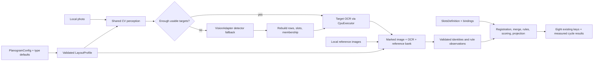

# Feature Specification: Refactor Planogram Compliance

**Feature ID**: FEAT-612
**Date**: 2026-09-30
**Author**: Jesus Lara (with Codex)
**Status**: draft
**Target version**: ai-parrot-pipelines 1.1.0
**Source**: `sdd/proposals/refactor-planogram-compliance.brainstorm.md`, Option A.

This finishes FEAT-574 in place. The brainstorm's twelve resolved answers remain binding.
The user approved retaining compatibility fields/historical enums/core proxy, adding optional per-slot crops,
and the metadata/private-fixture defaults on 2026-09-30. Remaining technical design choices are
for spec review and do not imply measured fixture accuracy.
No implementation, production migration, or live-provider evaluation was performed when authoring this spec.

## 1. Motivation & Business Requirements

### Problem Statement

The planogram workstream needs one three-step compliance pipeline: OpenCV perceives fixture
shapes and areas; local OCR and a vision LLM identify occupancy/products inside those areas;
deterministic comparison evaluates products, endcaps and advertisements against the definition.
`PlanogramCompliance.run()` already executes perceive → identify → compare. The migration is
incomplete: four of six types use a legacy adapter; shelves retains both contracts; layout and
ink descriptor assumptions are embedded in classes; the package omits slot OCR and reference
images from identification. A separate 2,905-line legacy pipeline still ships.

Retail users need comparable measured results across types, configuration authors need to
onboard fixtures without editing classes, and maintainers need one stage contract.

### Goals

- Migrate all six registered types; preserve the orchestrator and reusable FEAT-574 primitives.
- Put geometry profiles, anchors, thresholds, vocabulary, OCR targets and call strategy in validated configuration.
- Attempt OpenCV first by default, with one observable, bounded LLM-detector fallback.
- Enable local OCR automatically when available and send references alongside the observed crop.
- Preserve the handler invocation, HTTP contract, and eight legacy result keys.
- Produce strict/lenient scores, coverage, evidence quality, and complete/inconclusive status for every type.
- Convert and preflight all six configuration types without database writes.
- Supply an opt-in live suite for shelves, ink wall and backlit endcap using private local assets and labelled tolerances.
- Remove legacy execution, exports, and code used exclusively by it; document accepted breaking changes.

### Non-Goals (explicitly out of scope)

Nova/Bedrock image transport, a new LLM backend/default, provider SDK calls, a new detector model,
a single generic replacement type, shadow execution, a plan-first geometric detector, preserving
`PlanogramCompliancePipeline`/`RetailDetector`, unchanged legacy score semantics, automatic SQL
application, or publishing retailer assets. Options B/C/D were rejected in the brainstorm.
No changes to `parrot/clients/base.py`. No new dependency is required.

## 2. Architectural Design

### Overview

Keep `PlanogramCompliance` as the entry point. Each concrete type supplies a default
`LayoutProfile` and short cycle hooks composing shared stages. Configuration overrides defaults;
`slots_definition` owns expected shelf/position/zone counts, never the observed identity.

Construction resolves/validates the profile, inline definition and bindings. A missing definition
raises `ValueError` naming `config_name` and `docs/pipelines/planogram-cycle-migration.md` before
any LLM call. Dict definitions validate at construction; path sources are checked for presence at
construction and loaded asynchronously at run entry, before opening provider services. The latter
preserves the existing path API without blocking an aiohttp handler on file I/O.

Per-run state belongs to `CycleContext`; never retain input images, rule caches or observations
on a reusable type instance. `run()` keeps photo isolation and finally-based resource cleanup.
All six types receive the untouched full-resolution image.

### Component Diagram



### Layout and configuration contract

The new key is `PlanogramConfig.planogram_config["layout_profile"]`; there is no new DB column.
Merge a fresh copy of the type default with supplied overrides, recursively for nested models;
replace lists atomically. Explicit null is valid only for optional fields. Reject unknown keys,
invalid enums, duplicate profile/selector names, reversed ranges, nonpositive caps and dangling
zone references. Errors include `config_name` and the full field path. Caller dictionaries and
class defaults are never mutated.

| Field | Contract/default |
|---|---|
| `shape_profiles` | List of existing `ShapeProfile`; nonempty for `cv`; every kind must be a `ShapeKind` value |
| `anchor_rule` | Existing `tag_below_product` or `shape_is_slot` |
| `fill_gaps`, `untagged_bottom_row` | Booleans, ink defaults true; other types false |
| `identify_strategy` | `full_image`, `strips`, opt-in `slots` |
| `perception_mode` | `cv` by default for every type; explicit `llm_detector` remains a diagnostic override |
| `min_usable_shapes` | Nonnegative integer; zero disables automatic fallback |
| `min_row_items`, `max_row_slope`, `work_width` | Positive integer, nonnegative float, positive integer; defaults 1, 0.12, 2048 (ink row minimum 4) |
| `substrip_max_slots`, `ocr_batch_size` | Positive integers; defaults 8 and 16 |
| `descriptor_fields`, `required_descriptor_fields` | Unique field names; required subset of declared fields |
| `ocr_targets` | Subset of `slot`, `tag`, `zone`; default all three |
| `references` | `ReferencePolicy`: enabled true, selection `all`, max_per_call 5; measured tuning remains open |
| `zone_selectors` | Explicit `zone_id`, optional detected profile/kind, ordinal and normalized geometric region; no product identity |

A selector's ordinal is zero-based top-to-bottom, left-to-right among matching candidates and
is used only when the configured group can be matched unambiguously. A region uses full-source
normalized `[x1,y1,x2,y2]` coordinates and must enclose the candidate centre. No expected zone
is materialized solely because a selector exists. Ambiguous matches remain unassessed; a
partial view must not shift every observed zone onto the first expected one. Validate zone ids
against the loaded definition. Require selectors for repeated same-kind zones. Type defaults
supply detection profiles, never retailer-specific selector ids/counts.

Compatibility policy (user-confirmed): old top-level `perception_mode` is accepted as an
alias only when `layout_profile.perception_mode` is absent; contradictory values fail validation.
`verify_pass` remains supported, off by default, using evidence-gated candidate verification.
Legacy prompts, detector model/confidence and `detection_grid` are accepted and ignored for one
release. Keep historical enum values deserializeable, but never emit or branch on them in new
runs. Preserve the core proxy except removed detector/legacy exports. These user-confirmed decisions are recorded in §8.

### Stage 1: observed geometry

Shared CV perception uses `propose_shapes`, shelf edges, row consensus, `build_slots` and
`assign_membership`. CPU-bound conversion, CV, crop encoding and OCR use module-level picklable
functions dispatched through `CpuExecutor`; file reads use asynchronous I/O or existing I/O
thread offload, never CPU work on the event loop.

Threshold counts include only on-fixture anchor/product targets relevant to the profile; tags
must not inflate product-body counts. Zone-only types count usable detected zones. Match
configured geometric selectors to observed zones to establish spatial evidence; unresolved zone
membership cannot suppress fallback. Default fallback thresholds: ink 8, shelves/backlit 3,
promotional/panel/counter 1. These are configurable starting values, not accepted accuracy claims.

The orchestrator alone owns fallback. It runs at most once per image, skips a second detector
call in explicit `llm_detector` mode, and uses a generic shape prompt without expected product
names or legacy prompt text. Successful fallback replaces product proposals, preserves valid CV
zones if the detector supplied none, and calls the SAME geometry-building helper so slots,
anchor ids, row indices and membership remain usable by comparison. Never return successful
fallback with stale CV slots or discarded LLM slot geometry. Mark source `llm` for replacement;
retain per-shape provenance and report `mixed` if retained geometry has different sources.
Empty/failed fallback retains original perception and appends an error. No silent empty success.

### Stage 2: OCR, identity, references and rule evidence

Build a de-duplicated target list of product slots (or usable shapes), requested tags, and zones.
OCR uses each target's own source-pixel box: slot front text must not be replaced by anchor-tag
text. Tag reads remain separately attributable. OCR absence produces empty text and
`ocr_available=False`; explicit `enabled_ocr=False` overrides auto detection. Engine failure is
best effort and observable, never evidence that a slot is empty.

`identify-v2-ocr` becomes the default prompt version. Promote the Nova example's independent
area judgment, printed-code reading and visual definition of empty occupancy; do not copy its
SKU catalogue or provider-specific schema string. A dark/tilted/glared package can be occupied;
a tag, divider or fixture backing alone is not a product. Preserve raw model confidence.
Include OCR confidence and neutral descriptor names, never a position's expected product.

Full-image and strips keep existing entry points. The optional `slots` strategy sends
one padded crop per slot, plus separate crops for tags/zones. Coordinate transforms always
return to source pixels, including added shapes. Keep one missing-id repair, unique ids,
unknown-id rejection, membership validation of additions, and per-call failure isolation.
Cancellation propagates. Both initial and repair calls receive identical reference attachments.

Flatten `reference_images` in sorted key order and stable list order; support the existing path,
path-list and PIL-image forms. Load/encode once per run and retain a stable opaque label such as
`ref-0001`. Prompt labels identify image indices, not expected placement. Model `reference_id`
is accepted only when supplied in that call; mapping it back to a catalogue key is deterministic
and must retain crop-tied visual/text evidence. A reference match does not overwrite contradictory
printed text or turn an uncertain observation into a strict match.

`all` selects the first valid references up to the cap. Optional `by_brand` filters configured
reference-brand metadata using brand text actually read in the current targets; it never uses
expected shelf products. With no observed brand, fall back to `all` and report it. Per-shelf
selection is deferred because shelf identity is not established before registration. Record
selected/omitted labels and unreadable files in run diagnostics; unreadable references do not
abort identification. Cap 5 is a proposed configurable bound, not a backend capacity guarantee.
All attachments go through existing `VisionAdapter.ask`; its key already includes ordered image
bytes and prompt/schema, so references and v2 prompts invalidate old cache entries naturally.

Collect illumination state and visual facts during identification through a new neutral
`collect_rule_evidence` helper using `VisionAdapter`. Ask what is visible, never whether the
configured expected answer is satisfied. Bind observation ids to expected zone ids only in the
deterministic stage. Text and visual feature observations remain tied to their crop. Conflicting
reliable observations across photos yield unassessed rule results with a conflict detail, not a
first-photo-wins answer. Rule evidence is per-run data in `IdentificationResult`.

### Stage 3: identity, expected emptiness, zones and scores

Reuse registration, merge, credits and projection. Extract identity resolution from `InkWall`
into `comparison/identity.py` and preserve the old import as an alias. Retain typed ink descriptor
fields; add `Descriptors.attributes` for JSON scalar/list custom attributes. The profile selects
vocabulary and required fields. Match exact read identifiers first, then noncontradicting required
descriptor signatures, then existing fuzzy aliases (92). Never select by expected slot; multiple
candidates remain unresolved. Ink defaults preserve family/xl rules; generic types do not inherit
a mandatory xl field. Verification skips empty expected positions and never uses mere offered
candidates as evidence.

Add `FacingDefinition.expected_occupancy: Literal["occupied", "empty"] = "occupied"` and make
`product` optional only for expected-empty positions. Occupied positions still require a product;
existing definitions retain their behavior. Observed empty at an expected-empty position becomes
new `FacingStatus.EXPECTED_EMPTY` (strict=1, lenient=1, resolved, not occupied); observed occupied
becomes `UNEXPECTED_OCCUPIED` (0/0, resolved, occupied). No observation remains `not_visible`;
conflicting views remain `conflict`. Expected-empty positions stay in denominators but are not
missing products or product identity anchors. Update occupancy counts and projection explicitly;
do not reuse MATCH and accidentally count an empty slot as a detected product.

Permit zones with no facings and no physical shelves. Reject a completely empty definition.
Normalize unowned zones into deterministic virtual score shelves `zone:<zone_id>` during load;
reject collisions, and preserve explicit shelf ownership. This is a scoring projection, never
an invented detected shelf. Add zone kinds `graphic`, `advertisement`, `counter`,
`information_label` alongside existing kinds. Keep the four existing rule kinds: fixed product
counts are represented by expected facings; variable quantity ranges remain unresolved conversion
items, so no new speculative counting rule is needed in this feature.

Required zones must have a mandatory `zone_present` binding (converter emits it; runtime validation
rejects omissions). Every zone-only scoring unit needs at least one mandatory rule. A missing zone
is failed only with positive evidence that its expected region was inspected; unknown visibility
is unassessed. Completely empty perceptions always produce inconclusive/false. Rule evaluation
uses only observations; `compare()` must work with a vision object that raises on every call.

For product shelves preserve FEAT-574 normalized weights and credit policy, including current
lenient credits 1.0 for inferred_present/variant_unresolved and 0.5 for misplaced. Do not copy the
stale 0.5 statement from the migration runbook. Every expected facing remains in the denominator.
For zone-only units use existing product-presence/text/visual weighting with required-zone presence
as the product term and apply illumination penalties once. Projection checks the resulting lenient
score against the configured threshold even when expected_facings=0; no unconditional zero-facing
pass. All mandatory rules must be assessed and pass for COMPLIANT.

Global scores remain unweighted means of score units. For runs with facings, coverage remains
resolved expected positions / all expected positions. For zone-only runs, coverage is assessed
mandatory rules / all mandatory rules; require a nonzero denominator. Evidence quality uses the
sources of deciding zone/rule observations when no facing exists; no evidence gives 0.0. Definition
coverage for a valid zone-only definition is 1.0. Fully observed violations can be complete and
noncompliant; uncertainty is inconclusive and never compliant. All-photo failure reports zero
scores/coverage/evidence, errors and false compliance rather than a measured success.

### Type defaults and genuinely specific behavior

| Type | Defaults | Type responsibility retained |
|---|---|---|
| ink_wall | price-tag profile, tag-below anchors, gap fill, strips, threshold 8, ink vocabulary | price notes and ink descriptor requirements; expected emptiness comes from definition |
| product_on_shelves | existing four CV candidate profiles, shape-is-slot, full image, threshold 3 | fact-tag corroboration, body/box distinction and configured bound rules |
| endcap_backlit_multitier | shared body/box/tag/zone profiles, shape-is-slot, strips, threshold 3 | observed section grouping and bounded section calls; fact tags never count as products; backlight/campaign rules |
| endcap_no_shelves_promotional | zone profiles, full image, threshold 1 | configured promotional zones, text and illumination; no invented product tiers |
| graphic_panel_display | zone profiles, full image, threshold 1 | graphics/text/illumination only; no product/fact-tag counting |
| product_counter | body and zone profiles, full image, threshold 1 | products represented as facings; background and information label as zones; configured weights |

Non-ink numerical profile defaults reuse the already-present shelves candidates as provisional
starting profiles; no accuracy claim follows from this reuse. Type tasks must not hardcode store
counts or products. Backlit sections are configured spatial groups of observed areas, not the
old crop-and-guess contract. Unknown section/zone visibility is inconclusive.

### Integration Points

| Existing component | Integration | Result |
|---|---|---|
| `PlanogramCompliance.run` | retain public signature and cycle | photo isolation, shared context and fallback |
| `PlanogramConfig` | nested profile in existing JSON | no new DB column; definition mandatory in runtime |
| `AbstractPlanogramType` | only three cycle hooks plus defaults | legacy method contract removed after all six migrations |
| `VisionAdapter` / `AbstractClient` | reuse structured image calls and cache | same resolved backend for detection, identification and illumination |
| perception/registration/scoring/projection primitives | compose, narrowly extend empty/zone handling | no rewrite of FEAT-574 algorithms |
| handler | keep construction/run and HTTP fields | hydrate list-valued references consistently with the model |
| `migration.py` | six converters and read-only preflight | candidates, unresolved decisions and deployment readiness |
| package/core exports | remove only obsolete names/proxies | surviving import paths still resolve |
| existing tests / public examples | migrate behavioral assertions, create live suite | no retailer assets committed |

### Result assembly

Always retain `step3_compliance_results`, `compliance_results`, `overall_compliance_score`,
`overall_compliant`, `identified_products`, `shelf_regions`, `rendered_image`, `overlay_path`.
Both compliance keys refer to the same list. Existing additive keys remain and are measured;
new runs never report legacy_unmeasured/legacy_llm. For compatibility the top-level product/shelf
lists and first render describe the first successfully processed image; per-image detections,
identifications and renders carry the complete multi-photo result. Never mix coordinates across
photos. Build `ShelfRegion`s from observed rows/zones (image-prefixed ids), not expected geometry;
all-failed/no-observation runs may legitimately return empty lists. Product types derive from
observed shape kind/zone role, never the constant "product" for every object.

### Data Models and New Public Interfaces

The normative signatures and model additions are in §3. New helper imports are direct module
imports; no broad top-level re-export is required. Public `run(image, ...)` remains unchanged.
Runtime schema validation uses Pydantic v2; no implicit unknown-key acceptance in LayoutProfile.

## 3. Module Breakdown

Paths below are exclusive ownership assignments except explicitly listed shared integration files.
New declarations are proposed interfaces; `verified:` comments identify existing attachment points,
not claims that proposed methods already exist. Skeletons intentionally contain no implementation.
Tests named here are intended tests, not claims of current passing evidence.

#### Delegation-eligible modules

| Module | Eligible? | Decided contracts/patterns | Remaining qualification |
|---|---|---|---|
| M1 layout/contracts | yes after approval | strict models, recursive merge/list replacement, profile and evidence fields | compatibility/per-slot scope confirmed; spec still needs approval |
| M2 shared perception | yes | CPU helpers, shared geometry tail, no fallback recursion | provisional profiles are explicitly not accuracy guarantees |
| M3 identification | yes after approval | own-box OCR, references on initial/repair calls, neutral evidence, bounded strategies | cap tuning remains in §8; slots scope is user-confirmed |
| M4 comparison | yes | expected-empty statuses, virtual zone units, pure evidence-only rule evaluation | custom descriptor design proposed here |
| M5–M10 type migrations | yes | exact three-hook contract, profile defaults and behavior table in §2 | no retailer-specific hardcoding |
| M11 integration | yes after approval | same run/handler APIs, context-owned state, eight keys | user-confirmed compatibility policy in §8 |
| M12 removals | yes after M11 | explicit deletion list; keep grid data and IoU | final import scan required |
| M13 migration | yes | same converter/preflight signatures, six-type support, SELECT-only | human review of output remains mandatory |
| M14 live harness | partially | private asset manifest, opt-in, cache, tolerances, budget | fixture data/labels need human selection |
| M15 release/docs | yes after review | runbook, release notes, package metadata/lockfile | target release confirmed |

### Module 1: Layout profile and cycle data

- **Owner**: M1
- **Depends on**: existing Pydantic/perception contracts
- **Files**:
  - **CREATE** `packages/ai-parrot-pipelines/src/parrot_pipelines/planogram/layout.py`
  - **MODIFY** `packages/ai-parrot-pipelines/src/parrot_pipelines/planogram/contracts.py`
  - **CREATE** `packages/ai-parrot-pipelines/tests/planogram_cycle/test_layout_profile.py`
  - **MODIFY** `packages/ai-parrot-pipelines/tests/planogram_cycle/test_contracts.py`
- **Responsibility**: Add validated layout and reference policies plus per-run OCR/reference/rule data. Add enum values and evidence fields without removing legacy fields yet; M11 performs the final cutover.
- **Interface Skeleton**:

```python
# packages/ai-parrot-pipelines/src/parrot_pipelines/planogram/layout.py (new)
class ReferencePolicy(BaseModel):
    """Bound and select references without using expected shelf identity."""
    enabled: bool = True
    selection: Literal["all", "by_brand"] = "all"
    max_per_call: int = 5
    brand_by_reference: dict[str, str] = Field(default_factory=dict)

class ZoneSelector(BaseModel):
    """Match observed zones, never invent them from an expected id."""
    zone_id: str
    profile: str | None = None
    kind: str | None = None
    ordinal: int | None = None
    region: tuple[float, float, float, float] | None = None

class LayoutProfile(BaseModel):
    """Strict, validated perception and identification settings; extra keys forbidden."""
    shape_profiles: list[ShapeProfile]
    anchor_rule: AnchorRule = AnchorRule.SHAPE_IS_SLOT
    fill_gaps: bool = False
    untagged_bottom_row: bool = False
    identify_strategy: IdentifyStrategy = IdentifyStrategy.FULL_IMAGE
    perception_mode: Literal["cv", "llm_detector"] = "cv"
    min_usable_shapes: int = 1
    min_row_items: int = 1
    max_row_slope: float = 0.12
    work_width: int = 2048
    substrip_max_slots: int = 8
    ocr_batch_size: int = 16
    descriptor_fields: list[str] = Field(default_factory=list)
    required_descriptor_fields: list[str] = Field(default_factory=list)
    ocr_targets: list[Literal["slot", "tag", "zone"]] = ["slot", "tag", "zone"]
    references: ReferencePolicy = Field(default_factory=ReferencePolicy)
    zone_selectors: list[ZoneSelector] = Field(default_factory=list)

def resolve_layout_profile(defaults: LayoutProfile, config: dict[str, Any], *, config_name: str) -> LayoutProfile:
    """Merge a copy and validate; raise ValueError naming config and invalid field."""

# Additions to existing contracts; verified: packages/ai-parrot-pipelines/src/parrot_pipelines/planogram/contracts.py:43
# IdentifyStrategy.SLOTS = "slots"; FacingStatus.EXPECTED_EMPTY / UNEXPECTED_OCCUPIED.
class OcrReading(BaseModel):
    """Local read keyed by an observed target id."""
    text: str = ""
    confidence: float = Field(default=0.0, ge=0.0, le=1.0)

class ReferenceImage(BaseModel):
    """Per-run encoded reference with opaque prompt label and catalogue metadata."""
    label: str
    image: bytes
    catalog_key: str
    brand: str | None = None

class RuleObservation(BaseModel):
    """Neutral crop-tied observation, not an expected-rule verdict."""
    image_id: str
    target_id: str
    kind: Literal["illumination", "visual_features", "zone_present"]
    value: str | bool | list[str] | None = None
    assessed: bool = False
    source: ObservationSource
    evidence: list[str] = Field(default_factory=list)

# Existing model extensions, not replacement classes:
# PerceptionResult.ocr_readings: dict[str, OcrReading] = default_factory(dict)
# Identification.reference_id: str | None = None
# IdentificationResult.rule_observations: list[RuleObservation] = default_factory(list)
# RuleOutcome.observations: list[ObservationRef] = default_factory(list)
# CycleContext.layout: Any = None (validated LayoutProfile service; avoids the slots/contracts import cycle)
# CycleContext.reference_bank: list[ReferenceImage] = default_factory(list)
# CycleContext.images: dict[str, Any] = default_factory(dict) (PIL images, run-owned)
```

### Module 2: Shared perception and fallback geometry

- **Owner**: M2
- **Depends on**: M1: LayoutProfile
- **Files**:
  - **CREATE** `packages/ai-parrot-pipelines/src/parrot_pipelines/planogram/stages/__init__.py`
  - **CREATE** `packages/ai-parrot-pipelines/src/parrot_pipelines/planogram/stages/perceive.py`
  - **CREATE** `packages/ai-parrot-pipelines/tests/planogram_cycle/test_shared_perception.py`
- **Responsibility**: Extract deterministic geometry composition. Profile arguments reach every primitive. Membership and slot ids survive the same tail for CV and LLM proposals; preserve source-space coordinates.
- **Interface Skeleton**:

```python
# packages/ai-parrot-pipelines/src/parrot_pipelines/planogram/stages/perceive.py (new)
async def perceive_image(image: Image.Image, image_id: str, ctx: CycleContext) -> PerceptionResult:
    """Run configured perception only; automatic fallback remains orchestrator-owned."""
async def rebuild_geometry(image: Image.Image, shapes: Sequence[Shape], image_id: str,
                           ctx: CycleContext, *, detection_source: str) -> PerceptionResult:
    """Rebuild rows, slots, zones and membership from replacement source-pixel shapes."""
def count_usable_targets(perception: PerceptionResult, profile: LayoutProfile) -> int:
    """Count only on-fixture targets relevant to the anchor/zone strategy."""
# Reuses build_slots; verified: packages/ai-parrot-pipelines/src/parrot_pipelines/planogram/perception/slots.py:115
# Reuses propose_shapes; verified: packages/ai-parrot-pipelines/src/parrot_pipelines/planogram/perception/shapes.py:128
```

### Module 3: OCR-anchored identification and reference bank

- **Owner**: M3
- **Depends on**: M1: layout/evidence models; M2 only at runtime via PerceptionResult
- **Files**:
  - **CREATE** `packages/ai-parrot-pipelines/src/parrot_pipelines/planogram/stages/identify.py`
  - **CREATE** `packages/ai-parrot-pipelines/src/parrot_pipelines/planogram/identification/targets.py`
  - **CREATE** `packages/ai-parrot-pipelines/src/parrot_pipelines/planogram/identification/references.py`
  - **CREATE** `packages/ai-parrot-pipelines/src/parrot_pipelines/planogram/identification/evidence.py`
  - **MODIFY** `packages/ai-parrot-pipelines/src/parrot_pipelines/planogram/identification/identify.py`
  - **MODIFY** `packages/ai-parrot-pipelines/tests/planogram_cycle/test_identify.py`
  - **CREATE** `packages/ai-parrot-pipelines/tests/planogram_cycle/test_reference_images.py`
  - **CREATE** `packages/ai-parrot-pipelines/tests/planogram_cycle/test_rule_evidence.py`
- **Responsibility**: Promote the OCR recipe, dispatch strategies, load references once, validate reference ids, gather neutral rule evidence, and preserve repair/error/cancellation behavior. No expected identity in stage prompts.
- **Interface Skeleton**:

```python
# packages/ai-parrot-pipelines/src/parrot_pipelines/planogram/identification/targets.py (new)
async def read_target_text(image: np.ndarray, perception: PerceptionResult,
                           ctx: CycleContext) -> dict[str, OcrReading]:
    """Read configured own-box targets through the bounded CPU pool; empty map if OCR unavailable."""
# packages/ai-parrot-pipelines/src/parrot_pipelines/planogram/identification/references.py (new)
async def load_reference_bank(reference_images: Mapping[str, Any], ctx: CycleContext) -> list[ReferenceImage]:
    """Load stable labels once per run; record file/encoding failures and retain valid entries."""
def select_references(bank: Sequence[ReferenceImage], readings: Mapping[str, OcrReading],
                      policy: ReferencePolicy) -> tuple[list[ReferenceImage], list[str]]:
    """Return stable capped images and diagnostic messages; never inspect expected shelf products."""
# packages/ai-parrot-pipelines/src/parrot_pipelines/planogram/identification/evidence.py (new)
async def collect_rule_evidence(image: np.ndarray, perception: PerceptionResult,
                                ctx: CycleContext) -> list[RuleObservation]:
    """Observe requested zone/facing facts neutrally via VisionAdapter; isolate failed crops."""
# packages/ai-parrot-pipelines/src/parrot_pipelines/planogram/stages/identify.py (new)
async def identify_image(image: Image.Image, perception: PerceptionResult,
                         ctx: CycleContext) -> IdentificationResult:
    """Read OCR, dispatch configured strategy, then attach neutral rule observations."""
# verified: packages/ai-parrot-pipelines/src/parrot_pipelines/planogram/identification/identify.py:148
# Add keyword-only reference_labels without breaking two-positional-argument callers.
def build_identify_prompt(targets: Sequence[dict[str, Any]], vocabulary: Sequence[str],
                          *, reference_labels: Sequence[str] = ()) -> str:
    """Build provider-neutral identify-v2-ocr instructions and own-area OCR/confidence."""
# New peer of identify_strips (verified: packages/ai-parrot-pipelines/src/parrot_pipelines/planogram/identification/identify.py:493)
async def identify_slots(image: np.ndarray, perception: PerceptionResult, ctx: CycleContext,
                         *, vocabulary: Sequence[str], marks: bool = True) -> IdentificationResult:
    """One bounded crop call per target; source-coordinate validation and isolated errors."""
# Existing signatures preserved: identify_full_image and identify_strips; ctx carries references/OCR.
```

### Module 4: Shared evidence-only comparison, zone scoring and expected emptiness

- **Owner**: M4
- **Depends on**: M1: new statuses/evidence; existing registration and comparison functions
- **Files**:
  - **CREATE** `packages/ai-parrot-pipelines/src/parrot_pipelines/planogram/stages/compare.py`
  - **CREATE** `packages/ai-parrot-pipelines/src/parrot_pipelines/planogram/comparison/identity.py`
  - **CREATE** `packages/ai-parrot-pipelines/src/parrot_pipelines/planogram/comparison/rules.py`
  - **MODIFY** `packages/ai-parrot-pipelines/src/parrot_pipelines/planogram/comparison/definition.py`
  - **MODIFY** `packages/ai-parrot-pipelines/src/parrot_pipelines/planogram/comparison/scoring.py`
  - **MODIFY** `packages/ai-parrot-pipelines/src/parrot_pipelines/planogram/comparison/projection.py`
  - **MODIFY** `packages/ai-parrot-pipelines/src/parrot_pipelines/planogram/identification/verify.py`
  - **MODIFY** `packages/ai-parrot-pipelines/tests/planogram_cycle/test_slots_definition.py`
  - **MODIFY** `packages/ai-parrot-pipelines/tests/planogram_cycle/test_scoring_projection.py`
  - **CREATE** `packages/ai-parrot-pipelines/tests/planogram_cycle/test_shared_comparison.py`
- **Responsibility**: Generalize descriptor evidence without dropping typed ink fields. Normalize zone scoring units, validate binding completeness, score expected-empty positions and evaluate rules without provider calls.
- **Interface Skeleton**:

```python
# packages/ai-parrot-pipelines/src/parrot_pipelines/planogram/comparison/identity.py (new)
def resolve_identity(identification: Identification, definition: SlotsDefinition, *,
                     vocabulary: Sequence[str] = ("family", "colors", "pack", "xl"),
                     required_fields: Sequence[str] = ("family", "xl")) -> tuple[str | None, list[str]]:
    """Resolve photo evidence to one catalogue id, or return unresolved candidates; no slot expectation."""
# packages/ai-parrot-pipelines/src/parrot_pipelines/planogram/comparison/rules.py (new)
def evaluate_rules(perceptions: Sequence[PerceptionResult], identifications: Sequence[IdentificationResult],
                   registrations: Sequence[ImageRegistration], ctx: CycleContext) -> dict[str, RuleOutcome]:
    """Evaluate bound rules on collected observations; uncertainty/conflict is unassessed."""
# packages/ai-parrot-pipelines/src/parrot_pipelines/planogram/stages/compare.py (new)
def compare_observations(perceptions: Sequence[PerceptionResult], identifications: Sequence[IdentificationResult],
                         ctx: CycleContext, description: PlanogramDescription) -> ComparisonResult:
    """Canonicalize, register, merge, evaluate, score and project with no I/O."""
# verified: packages/ai-parrot-pipelines/src/parrot_pipelines/planogram/comparison/definition.py:33
# Descriptors.attributes: dict[str, str | int | float | bool | list[str]] = default_factory(dict)
# FacingDefinition.expected_occupancy: Literal["occupied", "empty"] = "occupied"
# FacingDefinition.product: str | None = None; occupied requires nonblank product.
# verified: packages/ai-parrot-pipelines/src/parrot_pipelines/planogram/comparison/definition.py:218
def load_slots_definition(source: dict[str, Any] | str | Path) -> SlotsDefinition:
    """Validate occupied/empty positions, normalize unowned zones; reject empty or ambiguous definitions."""
# verified: packages/ai-parrot-pipelines/src/parrot_pipelines/planogram/comparison/definition.py:285
def validate_bindings(definition: SlotsDefinition, planogram_config: dict[str, Any]) -> list[RuleBinding]:
    """Validate targets/params, mandatory presence bindings and nonvacuous zone-only assessment."""
# Existing merge_positions/score_shelves/summarize/project_compliance signatures stay unchanged.
# RuleOutcome.observations supplies zone evidence to summarize; no new provider hook in compare.
```

### Module 5: InkWall cycle migration

- **Owner**: M5
- **Depends on**: M1, M2, M3, M4: profile and shared stage APIs
- **Files**:
  - **MODIFY** `packages/ai-parrot-pipelines/src/parrot_pipelines/planogram/types/ink_wall.py`
  - **MODIFY** `packages/ai-parrot-pipelines/tests/planogram_cycle/test_ink_wall.py`
- **Responsibility**: Price notes and ink-specific descriptor requirements; import resolve_identity from the shared module to retain its historical import path.
- **Interface Skeleton**:

```python
# verified: packages/ai-parrot-pipelines/src/parrot_pipelines/planogram/types/ink_wall.py:160
class InkWall(AbstractPlanogramType):
    """Thin cycle composition with the defaults and type behavior specified in §2."""
    @classmethod
    def default_layout_profile(cls) -> LayoutProfile:
        """Return a fresh profile; never retailer product names, expected counts or shared mutable defaults."""
    async def perceive(self, image: Image.Image, image_id: str, ctx: CycleContext) -> PerceptionResult:
        """Compose shared perception and type-specific observed geometry only."""
    async def identify(self, image: Image.Image, perception: PerceptionResult,
                       ctx: CycleContext) -> IdentificationResult:
        """Compose shared OCR/vision/evidence collection with the resolved profile."""
    async def compare(self, perceptions: Sequence[PerceptionResult],
                      identifications: Sequence[IdentificationResult], ctx: CycleContext) -> ComparisonResult:
        """Run deterministic comparison and the type's evidence-based rule projection."""
```

### Module 6: ProductOnShelves cycle migration

- **Owner**: M6
- **Depends on**: M1, M2, M3, M4: profile and shared stage APIs
- **Files**:
  - **MODIFY** `packages/ai-parrot-pipelines/src/parrot_pipelines/planogram/types/product_on_shelves.py`
  - **MODIFY** `packages/ai-parrot-pipelines/tests/planogram_cycle/test_pos_migrated_perceive_identify.py`
  - **MODIFY** `packages/ai-parrot-pipelines/tests/planogram_cycle/test_pos_migrated_compare.py`
- **Responsibility**: Delete the legacy half; keep fact-tag evidence as corroboration, never proof of an unseen product.
- **Interface Skeleton**:

```python
# verified: packages/ai-parrot-pipelines/src/parrot_pipelines/planogram/types/product_on_shelves.py:64
class ProductOnShelves(AbstractPlanogramType):
    """Thin cycle composition with the defaults and type behavior specified in §2."""
    @classmethod
    def default_layout_profile(cls) -> LayoutProfile:
        """Return a fresh profile; never retailer product names, expected counts or shared mutable defaults."""
    async def perceive(self, image: Image.Image, image_id: str, ctx: CycleContext) -> PerceptionResult:
        """Compose shared perception and type-specific observed geometry only."""
    async def identify(self, image: Image.Image, perception: PerceptionResult,
                       ctx: CycleContext) -> IdentificationResult:
        """Compose shared OCR/vision/evidence collection with the resolved profile."""
    async def compare(self, perceptions: Sequence[PerceptionResult],
                      identifications: Sequence[IdentificationResult], ctx: CycleContext) -> ComparisonResult:
        """Run deterministic comparison and the type's evidence-based rule projection."""
```

### Module 7: EndcapBacklitMultitier cycle migration

- **Owner**: M7
- **Depends on**: M1, M2, M3, M4: profile and shared stage APIs
- **Files**:
  - **MODIFY** `packages/ai-parrot-pipelines/src/parrot_pipelines/planogram/types/endcap_backlit_multitier.py`
  - **CREATE** `packages/ai-parrot-pipelines/tests/planogram_cycle/test_endcap_backlit_cycle.py`
- **Responsibility**: Keep section/fact-tag behavior as short configured composition; collect header illumination and campaign evidence before compare.
- **Interface Skeleton**:

```python
# verified: packages/ai-parrot-pipelines/src/parrot_pipelines/planogram/types/endcap_backlit_multitier.py:134
class EndcapBacklitMultitier(AbstractPlanogramType):
    """Thin cycle composition with the defaults and type behavior specified in §2."""
    @classmethod
    def default_layout_profile(cls) -> LayoutProfile:
        """Return a fresh profile; never retailer product names, expected counts or shared mutable defaults."""
    async def perceive(self, image: Image.Image, image_id: str, ctx: CycleContext) -> PerceptionResult:
        """Compose shared perception and type-specific observed geometry only."""
    async def identify(self, image: Image.Image, perception: PerceptionResult,
                       ctx: CycleContext) -> IdentificationResult:
        """Compose shared OCR/vision/evidence collection with the resolved profile."""
    async def compare(self, perceptions: Sequence[PerceptionResult],
                      identifications: Sequence[IdentificationResult], ctx: CycleContext) -> ComparisonResult:
        """Run deterministic comparison and the type's evidence-based rule projection."""
```

### Module 8: EndcapNoShelvesPromotional cycle migration

- **Owner**: M8
- **Depends on**: M1, M2, M3, M4: profile and shared stage APIs
- **Files**:
  - **MODIFY** `packages/ai-parrot-pipelines/src/parrot_pipelines/planogram/types/endcap_no_shelves_promotional.py`
  - **MODIFY** `packages/ai-parrot-pipelines/tests/test_endcap_no_shelves_promotional.py`
- **Responsibility**: Use observed zones and bound illumination/text/visual rules; optional zones must not become mandatory by accident.
- **Interface Skeleton**:

```python
# verified: packages/ai-parrot-pipelines/src/parrot_pipelines/planogram/types/endcap_no_shelves_promotional.py:38
class EndcapNoShelvesPromotional(AbstractPlanogramType):
    """Thin cycle composition with the defaults and type behavior specified in §2."""
    @classmethod
    def default_layout_profile(cls) -> LayoutProfile:
        """Return a fresh profile; never retailer product names, expected counts or shared mutable defaults."""
    async def perceive(self, image: Image.Image, image_id: str, ctx: CycleContext) -> PerceptionResult:
        """Compose shared perception and type-specific observed geometry only."""
    async def identify(self, image: Image.Image, perception: PerceptionResult,
                       ctx: CycleContext) -> IdentificationResult:
        """Compose shared OCR/vision/evidence collection with the resolved profile."""
    async def compare(self, perceptions: Sequence[PerceptionResult],
                      identifications: Sequence[IdentificationResult], ctx: CycleContext) -> ComparisonResult:
        """Run deterministic comparison and the type's evidence-based rule projection."""
```

### Module 9: GraphicPanelDisplay cycle migration

- **Owner**: M9
- **Depends on**: M1, M2, M3, M4: profile and shared stage APIs
- **Files**:
  - **MODIFY** `packages/ai-parrot-pipelines/src/parrot_pipelines/planogram/types/graphic_panel_display.py`
  - **MODIFY** `packages/ai-parrot/tests/test_graphic_panel_display.py`
- **Responsibility**: Zone-only assessment with arbitrary configured zones; no product-count or fact-tag path.
- **Interface Skeleton**:

```python
# verified: packages/ai-parrot-pipelines/src/parrot_pipelines/planogram/types/graphic_panel_display.py:40
class GraphicPanelDisplay(AbstractPlanogramType):
    """Thin cycle composition with the defaults and type behavior specified in §2."""
    @classmethod
    def default_layout_profile(cls) -> LayoutProfile:
        """Return a fresh profile; never retailer product names, expected counts or shared mutable defaults."""
    async def perceive(self, image: Image.Image, image_id: str, ctx: CycleContext) -> PerceptionResult:
        """Compose shared perception and type-specific observed geometry only."""
    async def identify(self, image: Image.Image, perception: PerceptionResult,
                       ctx: CycleContext) -> IdentificationResult:
        """Compose shared OCR/vision/evidence collection with the resolved profile."""
    async def compare(self, perceptions: Sequence[PerceptionResult],
                      identifications: Sequence[IdentificationResult], ctx: CycleContext) -> ComparisonResult:
        """Run deterministic comparison and the type's evidence-based rule projection."""
```

### Module 10: ProductCounter cycle migration

- **Owner**: M10
- **Depends on**: M1, M2, M3, M4: profile and shared stage APIs
- **Files**:
  - **MODIFY** `packages/ai-parrot-pipelines/src/parrot_pipelines/planogram/types/product_counter.py`
  - **CREATE** `packages/ai-parrot-pipelines/tests/planogram_cycle/test_product_counter_cycle.py`
- **Responsibility**: Describe product quantity by facings and background/information labels by zones; use configured weights, no fixed three-element list.
- **Interface Skeleton**:

```python
# verified: packages/ai-parrot-pipelines/src/parrot_pipelines/planogram/types/product_counter.py:41
class ProductCounter(AbstractPlanogramType):
    """Thin cycle composition with the defaults and type behavior specified in §2."""
    @classmethod
    def default_layout_profile(cls) -> LayoutProfile:
        """Return a fresh profile; never retailer product names, expected counts or shared mutable defaults."""
    async def perceive(self, image: Image.Image, image_id: str, ctx: CycleContext) -> PerceptionResult:
        """Compose shared perception and type-specific observed geometry only."""
    async def identify(self, image: Image.Image, perception: PerceptionResult,
                       ctx: CycleContext) -> IdentificationResult:
        """Compose shared OCR/vision/evidence collection with the resolved profile."""
    async def compare(self, perceptions: Sequence[PerceptionResult],
                      identifications: Sequence[IdentificationResult], ctx: CycleContext) -> ComparisonResult:
        """Run deterministic comparison and the type's evidence-based rule projection."""
```

### Module 11: Orchestrator, strict type contract and handler integration

- **Owner**: M11
- **Depends on**: M5–M10: all six complete hooks; M1–M4: shared contracts
- **Files**:
  - **MODIFY** `packages/ai-parrot-pipelines/src/parrot_pipelines/planogram/types/abstract.py`
  - **MODIFY** `packages/ai-parrot-pipelines/src/parrot_pipelines/planogram/plan.py`
  - **MODIFY** `packages/ai-parrot-pipelines/src/parrot_pipelines/models.py`
  - **MODIFY** `packages/ai-parrot-pipelines/src/parrot_pipelines/handlers/planogram_compliance.py`
  - **MODIFY** `packages/ai-parrot-pipelines/tests/planogram_cycle/test_type_hooks.py`
  - **MODIFY** `packages/ai-parrot-pipelines/tests/planogram_cycle/test_run_template.py`
  - **MODIFY** `packages/ai-parrot/tests/handlers/test_planogram_compliance.py`
  - **MODIFY** `packages/ai-parrot-pipelines/src/parrot_pipelines/planogram/contracts.py`
- **Responsibility**: Remove legacy branches and LegacyPayload plumbing after all types migrate. M11 also revisits M1 contracts.py solely to remove LegacyPayload/PerceptionResult.legacy. Resolve layout once, keep run state isolated, hydrate reference lists, and preserve HTTP/result contracts.
- **Interface Skeleton**:

```python
# verified: packages/ai-parrot-pipelines/src/parrot_pipelines/planogram/types/abstract.py:467
class AbstractPlanogramType(ABC):
    """Three-cycle-hook contract; no compute_roi/detect_objects/check_planogram_compliance adapter."""
    @classmethod
    def default_layout_profile(cls) -> LayoutProfile:
        """Return type defaults; concrete types supply this hook."""
    def validate_contract(self) -> None:
        """Raise TypeError for incomplete hooks; ValueError naming config/runbook for missing definition."""
# verified: packages/ai-parrot-pipelines/src/parrot_pipelines/planogram/plan.py:70
class PlanogramCompliance(AbstractPipeline):
    """Profile-driven three-stage compliance with isolated per-run state."""
    def __init__(self, planogram_config: PlanogramConfig, llm: Any = None,
                 llm_provider: str | _Unset = UNSET, llm_model: str | None | _Unset = UNSET,
                 *, cpu_workers: int = 2, llm_concurrency: int = 4, llm_timeout: float = 120.0,
                 vision_cache_dir: Path | None = None, enabled_ocr: bool | None = None, **kwargs: Any) -> None:
        """None auto-detects OCR; False disables it; fail fast on invalid inline configuration."""
    # verified: packages/ai-parrot-pipelines/src/parrot_pipelines/planogram/plan.py:134
    async def run(self, image: ImageInput | Sequence[ImageInput], output_dir: str | Path | None = None,
                  image_id: str | Sequence[str] | None = None, **kwargs: Any) -> dict[str, Any]:
        """Preserve public call, photo isolation, eight result keys and measured additive outputs."""
# verified: packages/ai-parrot-pipelines/src/parrot_pipelines/handlers/planogram_compliance.py:307
# Existing method signature retained on PlanogramComplianceHandler:
def _build_planogram_config(self, row: dict) -> PlanogramConfig:
    """Hydrate path or path-list references and existing JSON columns without altering the HTTP contract."""
```

### Module 12: Remove legacy implementations and exports

- **Owner**: M12
- **Depends on**: M11 for contract removal, M6 for grid users; standalone legacy.py/export removals can start earlier
- **Files**:
  - **DELETE** `packages/ai-parrot-pipelines/src/parrot_pipelines/planogram/legacy.py`
  - **DELETE** `packages/ai-parrot-pipelines/src/parrot_pipelines/planogram/types/legacy_adapter.py`
  - **DELETE** `packages/ai-parrot-pipelines/src/parrot_pipelines/detector.py`
  - **DELETE** `packages/ai-parrot-pipelines/src/parrot_pipelines/planogram/grid/detector.py`
  - **DELETE** `packages/ai-parrot-pipelines/src/parrot_pipelines/planogram/grid/horizontal_bands.py`
  - **DELETE** `packages/ai-parrot-pipelines/src/parrot_pipelines/planogram/grid/strategy.py`
  - **MODIFY** `packages/ai-parrot-pipelines/src/parrot_pipelines/planogram/grid/__init__.py`
  - **MODIFY** `packages/ai-parrot-pipelines/src/parrot_pipelines/planogram/grid/merger.py`
  - **MODIFY** `packages/ai-parrot-pipelines/src/parrot_pipelines/planogram/__init__.py`
  - **MODIFY** `packages/ai-parrot-pipelines/src/parrot_pipelines/__init__.py`
  - **DELETE** `packages/ai-parrot/src/parrot/pipelines/planogram/legacy.py`
  - **DELETE** `packages/ai-parrot/src/parrot/pipelines/detector.py`
  - **MODIFY** `packages/ai-parrot/src/parrot/pipelines/planogram/__init__.py`
  - **DELETE** `packages/ai-parrot-pipelines/tests/planogram_cycle/test_legacy_run_orchestration.py`
  - **MODIFY** `packages/ai-parrot-pipelines/tests/planogram_cycle/test_pos_compliance_characterization.py`
  - **MODIFY** `packages/ai-parrot-pipelines/tests/planogram_cycle/test_pos_fact_tags_illumination_characterization.py`
  - **MODIFY** `packages/ai-parrot-pipelines/tests/planogram_cycle/test_neutral_panel_types.py`
  - **MODIFY** `packages/ai-parrot-pipelines/tests/planogram_cycle/test_neutral_shelf_types.py`
  - **MODIFY** `packages/ai-parrot-pipelines/tests/test_planogram_types.py`
  - **MODIFY** `packages/ai-parrot/tests/test_monorepo_imports.py`
  - **MODIFY** `packages/ai-parrot-pipelines/tests/planogram_cycle/test_vision_kwargs.py`
- **Responsibility**: Delete only the listed obsolete Python modules. Reduce grid/merger.py to the still-used _compute_iou helper; retain grid/models.py for accepted detection_grid input. Rewrite characterization tests to pin retained business behavior on the new cycle, rather than deleting coverage. Delete only the adapter-order test file. Preserve core proxy resolution.
- **Interface Skeleton**:

```python
# No replacement API for removed PlanogramCompliancePipeline/RetailDetector/AbstractDetector.
# verified: packages/ai-parrot-pipelines/src/parrot_pipelines/planogram/grid/merger.py:16
def _compute_iou(box_a: DetectionBox, box_b: DetectionBox) -> float:
    """Unchanged surviving geometry helper; zero for nonoverlap/degenerate union."""
# verified: packages/ai-parrot-pipelines/src/parrot_pipelines/planogram/__init__.py:14
def __getattr__(name: str) -> Any:
    """Resolve surviving pipeline exports; removed names raise ordinary AttributeError."""
# PIPELINE_REGISTRY retains PlanogramCompliance, configuration and six types only, plus AbstractPipeline/type base.
# ImportError is accepted for from-import of removed names; no compatibility stub resurrects execution.
```

### Module 13: Six-type converter and read-only preflight

- **Owner**: M13
- **Depends on**: M1, M4, M5–M10: schema and every concrete default_layout_profile for readiness validation
- **Files**:
  - **MODIFY** `packages/ai-parrot-pipelines/src/parrot_pipelines/planogram/migration.py`
  - **MODIFY** `packages/ai-parrot-pipelines/tests/planogram_cycle/test_config_migration.py`
- **Responsibility**: Keep existing CLI/API and exit codes. Convert shelf/facing and zone-centric legacy shapes with per-type adapters; retain original configuration and unresolved decisions. Validate layout as well as definition and bindings in preflight. No DB writes.
- **Interface Skeleton**:

```python
# verified: packages/ai-parrot-pipelines/src/parrot_pipelines/planogram/migration.py:49
class ConversionReport(BaseModel):
    """Human-reviewable candidate; keep existing fields and add layout overrides."""
    candidate: dict[str, Any] = Field(default_factory=dict)
    bindings: list[dict[str, Any]] = Field(default_factory=list)
    unresolved: list[str] = Field(default_factory=list)
    warnings: list[str] = Field(default_factory=list)
    layout_profile: dict[str, Any] = Field(default_factory=dict)
# verified: packages/ai-parrot-pipelines/src/parrot_pipelines/planogram/migration.py:229
def convert_config(planogram_config: dict[str, Any], *, planogram_type: str) -> ConversionReport:
    """Convert any of the six registered types; ValueError for unsupported types; never mutate input."""
# verified: packages/ai-parrot-pipelines/src/parrot_pipelines/planogram/migration.py:269
def check_row(row: dict[str, Any]) -> PreflightRow:
    """Validate type, definition, bindings and layout; unknown types are not silently ready."""
# verified: packages/ai-parrot-pipelines/src/parrot_pipelines/planogram/migration.py:308
async def preflight(dsn: str) -> list[PreflightRow]:
    """SELECT-only active-row readiness; lazy AsyncDB import, context-managed connection."""
```

### Module 14: Private-fixture live E2E and offline harness tests

- **Owner**: M14
- **Depends on**: M11: public results; M13: validated fixture configuration
- **Files**:
  - **CREATE** `examples/planogram/e2e/conftest.py`
  - **CREATE** `examples/planogram/e2e/models.py`
  - **CREATE** `examples/planogram/e2e/runner.py`
  - **CREATE** `examples/planogram/e2e/test_compliance.py`
  - **CREATE** `examples/planogram/e2e/README.md`
  - **CREATE** `packages/ai-parrot-pipelines/tests/planogram_cycle/test_live_e2e_harness.py`
  - **MODIFY** `.gitignore`
- **Responsibility**: Create a self-contained example harness for three type-specific cases, with private manifests/ground truth, explicit opt-in, cache, budget, per-case outputs and tolerances. Do not import the ignored pipelines example. Unit tests use generated synthetic assets and fake clients.
- **Interface Skeleton**:

```python
# examples/planogram/e2e/models.py (new)
class GroundTruth(BaseModel):
    """Human-labelled expectations and tolerances; no generated baseline accepted as truth."""
    expected_positions: dict[str, str]
    expected_occupancy: dict[str, Literal["occupied", "empty", "unknown"]]
    expected_rules: dict[str, bool]
    overall_score: float
    score_tolerance: float
    min_coverage: float
    max_identity_errors: int
    max_occupancy_errors: int

class LiveCase(BaseModel):
    """Local paths and bounded execution, never committed retailer data."""
    case_id: str
    planogram_type: Literal["product_on_shelves", "ink_wall", "endcap_backlit_multitier"]
    photos: list[Path]
    config_path: Path
    ground_truth_path: Path
    backend: str
    cache_dir: Path
    output_dir: Path
    max_provider_requests: int = 64
    timeout_seconds: float = 600.0

# examples/planogram/e2e/runner.py (new)
async def run_case(case: LiveCase) -> dict[str, Any]:
    """Run one configured case and save JSON-safe evidence/renders with bounded uncached requests."""
def compare_ground_truth(result: Mapping[str, Any], truth: GroundTruth) -> list[str]:
    """Return explicit violations; never silently widen tolerances or accept missing assertions."""
# examples/planogram/e2e/test_compliance.py (new)
async def test_live_compliance(case: LiveCase) -> None:
    """Assert human labels/tolerances after explicit opt-in and required local prerequisites."""
```

### Module 15: Release packaging and migration documentation

- **Owner**: M15
- **Depends on**: M11–M14 final contracts; package metadata/lockfile exclusive
- **Files**:
  - **MODIFY** `docs/pipelines/planogram-compliance-cycle.md`
  - **MODIFY** `docs/pipelines/planogram-cycle-migration.md`
  - **MODIFY** `packages/ai-parrot-pipelines/README.md`
  - **MODIFY** `packages/ai-parrot-pipelines/pyproject.toml`
  - **MODIFY** `packages/ai-parrot-pipelines/src/parrot_pipelines/version.py`
  - **MODIFY** `packages/ai-parrot-pipelines/tests/planogram_cycle/test_ocr_reader.py`
  - **MODIFY** `uv.lock`
- **Responsibility**: Update both cycle docs, package README and release version; remove pipelines pytesseract dependency and regenerate uv.lock with uv. Retain other packages’ OCR dependencies. Document removed APIs, changed score semantics, migration-before-deploy and rollback. No unrelated lock refresh.
- **Interface Skeleton**:

```python
# Metadata-only public contract; verified: packages/ai-parrot-pipelines/src/parrot_pipelines/version.py:5
__version__: str  # target 1.1.0, user-confirmed
# Documentation and dependency metadata introduce no new callable public interfaces.
# pyproject planogram extra remains rapidocr>=3.9 and onnxruntime>=1.20.
```

## 4. Test Specification

### Unit Tests

All package tests use synthetic images/configurations, deterministic fake vision responses and
no network. Extend existing regression cases where they assert surviving behavior; do not preserve
legacy score formulas merely to keep characterization tests green.

| Test group (intended) | Modules | Required assertions |
|---|---|---|
| layout validation/merge | M1 | overrides reach primitives; nested merge/list replacement; no shared mutation; invalid field names, caps, enum, selectors and alias contradictions fail with config/field |
| perception/fallback | M2/M11 | CV default all types; one fallback; threshold boundary; off-fixture objects excluded; zone-only threshold; row/slot rebuilding and source provenance |
| own-target OCR | M3 | distinct slot/tag/zone pixel crops; confidence preserved; absent OCR; explicit disabled OCR; bounded pool calls; empty OCR never implies empty occupancy |
| prompt/strategies | M3 | no expected products/legacy prompts; printed code/occupancy instructions; full image, strips and optional slots; crop remapping; missing-id repair once; unique ids |
| reference bank | M3 | path/list/PIL inputs; stable order; cap diagnostics; missing file isolation; same bank on repair; unknown reference-id rejection; reference bytes invalidate cache |
| neutral rule evidence | M3/M4 | illumination through configured adapter; unknown/conflicting evidence stays unassessed; no use of expected state as observation |
| comparison | M4 | same input produces same result; compare never calls vision; every facing remains in denominator; partial/multiple-photo registration; inferred/variant credits preserved |
| expected empty | M4 | expected-empty+empty=1/1 and no occupied count; occupied=0/0; unseen not missing; conflicting views inconclusive; definition may contain only expected-empty positions |
| zone-only | M4 | no physical shelves; virtual unit ids deterministic; missing bindings/empty definition rejected; score threshold enforced; complete violations vs incomplete; zero-observation false |
| type behavior | M5–M10 | one or more offline full runs per registered type; config-driven shelf/zone counts; facts/boxes/illumination rules retained without legacy hooks |
| handler/assembly | M11 | exact invocation and HTTP fields; both compliance list keys; meaningful types; observed shelves/zones; first-success lists and per-image coordinates; list reference hydration |
| run lifecycle | M11 | repeated and concurrent runs do not share mutable observations; one/all photo failures; cancellation; executor/adapter close on all exits |
| removal/imports | M12 | surviving package and core imports resolve; removed names raise; no legacy execution references or eager torch/ultralytics/tesseract imports from cycle |
| conversion/preflight | M13 | six types; unknown type failure; zones-only candidates; unresolved quantities/descriptors/selectors; original input preserved; no input overwrite; no write SQL |
| live harness offline | M14 | default opt-out, missing prerequisites, wrong type, malformed manifest, missing labels, tolerance bounds, nonfinite scores, cache hit and request budget exhaustion |

### Integration Tests

Drive `PlanogramCompliance.run()` with a fake `AbstractClient` through the actual `VisionAdapter`;
exercise references, schema parsing, cache and retries. Include six type configs, a zone-only
fixture, expected-empty positions, a failed image beside a valid image, and all-image failure.
Use strict spy failures on LLM calls during compare. Assert handler job failure for unmigrated
rows rather than a silent success. Include public import tests and explicit negative imports.

### Test Data / Fixtures

Committed fixtures are synthetic Python-created images, generic product labels and in-memory
Pydantic definitions. Retailer photographs, extracted plans, generated definitions, local manifest,
ground truth, renders, JSON reports and cached responses are ignored. The example's committed
`models.py` is the ground-truth schema; README contains a fictitious template, not retailer truth.

Live cases are `shelves`, `ink-wall`, `backlit-endcap`, with exact expected type values. A shelves
config with a header cannot satisfy the backlit-type case. Candidate retailers from the brainstorm
remain private local selections and are not copied into the repository. The ignored ink-wall scripts
are reference material only; the committed harness works in a clean worktree without them.

### Live E2E behavior (not the deterministic E2E gate)

- Invocation: `PARROT_TEST_REAL_LLM=1 pytest examples/planogram/e2e -q` with
  `PLANOGRAM_E2E_MANIFEST` pointing at the local manifest and provider secrets in environment.
- No opt-in, missing photo/config/ground truth, or absent backend credentials => explicit pytest skip
  before provider initialization. Invalid existing files or wrong planogram type => fail, not skip.
- Every case uses explicit backend/model, persistent `vision_cache_dir`, a 600-second case deadline
  and default 64 uncached provider-request cap. Count every actual provider call, including detector,
  evidence, malformed-response repairs and missing-id repairs. Cache hits consume no request budget.
  Instrument the injected client's call boundary in the harness; do not bypass AbstractClient.
- Compare score within the human-specified absolute tolerance, minimum coverage, per-facing identity
  and occupancy error counts, and mandatory rule outcomes. Missing expected ids count as errors.
  Validate tolerances (score/coverage in [0,1], error budgets nonnegative, finite values); never
  generate truth from the run under test or update it automatically.
- Write per-case `compliance.json`, renders and a report with backend, profile/config and photo
  fingerprints, prompt version, reference selection, cache/request counts, errors and each assertion.
  JSON projection excludes PIL objects and raw reference bytes; record render paths separately.
- A repeat run costs no provider requests only when its complete cached inputs match; changes to
  images, refs, prompt, model or schema cause legitimate misses. Do not promise arbitrary re-runs are free.
- Live cases are not required CI gates. Do not add `e2e` frontmatter or generate an E2E gate plan
  for this feature: direct pytest live tests are the agreed surface.

### Verification commands during implementation

Activate the existing environment first. Store complete outputs under `artifacts/logs/`.
Run affected tests per task; the integration/cleanup tasks run the full planogram cycle directory,
the two satellite type suites, core graphic-panel/handler/import suites, and offline harness tests.
Run `black --check --line-length 120` and `ruff check` on touched Python files. Packaging owner runs
`uv lock` then verifies the dependency diff and `uv lock --check`. Live evaluation runs only with
explicit credentials/assets and opt-in. This spec-only run does not claim any of those runtime checks.

## 5. Acceptance Criteria

- [ ] AC1: All six registered types execute perceive→identify→compare; no legacy adapter or old hook contract remains.
- [ ] AC2: Handler call and HTTP fields remain compatible; all eight legacy result keys are always present.
- [ ] AC3: Layout overrides control shapes, anchors, rows, gap filling, strategy, thresholds, vocabulary, OCR targets and references; no retailer count/product is hardcoded.
- [ ] AC4: OpenCV is the default for all six types; fallback is bounded, observable, and reconstructs usable slot geometry.
- [ ] AC5: OCR auto-enables when available, explicit False disables it, missing OCR degrades honestly, and targets use their own crop text/confidence.
- [ ] AC6: Provider-neutral v2 prompt is default; references accompany initial and repair calls; missing/capped references are reported.
- [ ] AC7: Evidence cannot be invented from expected products, reference labels, empty OCR or unseen zones; raw confidence remains unchanged.
- [ ] AC8: Compare performs no LLM/I/O; registration, multi-photo conflict handling, credit policy and complete/inconclusive semantics pass deterministic tests.
- [ ] AC9: Zone-only definitions and expected-empty positions validate and score correctly; empty/no-evidence runs never pass.
- [ ] AC10: Missing definition fails with config name and runbook; invalid layout/bindings identify the field/target before inference.
- [ ] AC11: All types report measured scores, coverage/evidence, meaningful product types and observed shelf/zone regions; new runs emit no legacy status/source.
- [ ] AC12: Per-photo failures, timeout/malformed vision, cancellation and resource cleanup are isolated and tested; repeated/concurrent runs leak no state.
- [ ] AC13: All six converters produce reviewable candidates and unresolved lists; preflight validates all active types; no SQL write path exists.
- [ ] AC14: Removed pipeline/detector/grid APIs no longer import; surviving core proxy imports, grid models and IoU remain valid.
- [ ] AC15: Pipelines alone drops its obsolete pytesseract dependency; no new dependency/provider is introduced; relevant lock metadata is regenerated.
- [ ] AC16: Offline cycle/type/handler/import/harness tests and formatting/lint checks pass; retained business behavior has regression coverage after old test rewrites.
- [ ] AC17: Live harness supports shelves, ink wall and backlit type, explicit opt-in, prerequisite skips, cache/request budgets and hand-labelled tolerances; three successful local evidence reports are required for accuracy signoff when fixtures are supplied, not for CI.
- [ ] AC18: Git ignore tests show retailer photos/plans/definitions/truth/cache/renders/reports stay untracked while only intended example code/README is admitted.
- [ ] AC19: Runbook/release notes cover changed scores, removed imports, layout/reference policy, migration-before-deployment and rollback; production migration owner/timing is assigned before deployment.
- [ ] AC20: §8 design proposals are reviewed before task decomposition; fixture/tuning/deployment items may remain open only with named release owners and no unsupported accuracy claim.

## 6. Codebase Contract

Verified against source base `c017b05ef5a7110876c273d6ce8b48031edaae73`; the ID reservation advanced
HEAD to `3f0f2f7268e6b4652da8d57777897a2e89234291` without changing these implementation files.
Evidence is static source/module/export inspection, not runtime import execution of optional backends.
Paths in the original brainstorm contract below are relative to
`packages/ai-parrot-pipelines/src/parrot_pipelines/` unless explicitly absolute-to-repository.

### Verified Imports

```python
from parrot_pipelines.models import PlanogramConfig, EndcapGeometry
# verified: packages/ai-parrot-pipelines/src/parrot_pipelines/models.py:13,32
from parrot_pipelines.planogram.plan import PlanogramCompliance
# verified: packages/ai-parrot-pipelines/src/parrot_pipelines/planogram/plan.py:48
from parrot_pipelines.planogram.perception import PRICE_TAG_PROFILE, ShapeCandidate, ShapeProfile, propose_shapes
# verified exports: packages/ai-parrot-pipelines/src/parrot_pipelines/planogram/perception/__init__.py:3
from parrot_pipelines.planogram.perception.ocr import OcrReader, read_crop
# user-provided import; verified: packages/ai-parrot-pipelines/src/parrot_pipelines/planogram/perception/ocr.py:16,73
from parrot_pipelines.planogram.perception.executor import CpuExecutor
# verified: packages/ai-parrot-pipelines/src/parrot_pipelines/planogram/perception/executor.py:17
from parrot_pipelines.planogram.comparison import SlotsDefinition, load_slots_definition, validate_bindings
# verified exports: packages/ai-parrot-pipelines/src/parrot_pipelines/planogram/comparison/__init__.py:3
from parrot_pipelines.planogram.identification.vision import VisionAdapter, VisionError
# verified: packages/ai-parrot-pipelines/src/parrot_pipelines/planogram/identification/vision.py:31,131
from parrot.models.detections import DetectionBox, ShelfRegion, IdentifiedProduct
# verified: packages/ai-parrot/src/parrot/models/detections.py:37,62,71
from parrot.models.compliance import ComplianceResult
# verified: packages/ai-parrot/src/parrot/models/compliance.py:51
```

### Existing Class Signatures and brainstorm context (carried forward)

The following preserves the brainstorm's complete Code Context, including user-supplied import,
signatures, constants, absence findings and historical local context. Source contracts were
rechecked for this spec; the corrections table immediately following overrides stale narrative
claims. Local asset contents and the brainstorm's historical ledger/worktree observations were
not revalidated and are not implementation contracts. New interfaces in §3 do not exist yet.

#### User-Provided Code

```python
# Source: user-provided (request text)
from parrot_pipelines.planogram.perception.ocr import OcrReader, read_crop
```

#### Verified Codebase References

All paths below are relative to `packages/ai-parrot-pipelines/src/parrot_pipelines/` unless they
start with `packages/` or `examples/`. Verified on `dev` at `dc3e3a548`.

###### Classes & Signatures

```python
# planogram/plan.py
class PlanogramCompliance(AbstractPipeline):                       # line 48
    _PLANOGRAM_TYPES = {                                           # lines 61-68
        "product_on_shelves": ProductOnShelves, "graphic_panel_display": GraphicPanelDisplay,
        "product_counter": ProductCounter, "endcap_no_shelves_promotional": EndcapNoShelvesPromotional,
        "endcap_backlit_multitier": EndcapBacklitMultitier, "ink_wall": InkWall,
    }
    def __init__(self, planogram_config: PlanogramConfig, llm: Any = None,
                 llm_provider: Union[str, _Unset] = UNSET, llm_model: Union[str, None, _Unset] = UNSET,
                 *, cpu_workers: int = 2, llm_concurrency: int = 4, llm_timeout: float = 120.0,
                 vision_cache_dir: Optional[Path] = None, enabled_ocr: bool = False, **kwargs: Any): ...  # line 70
    async def run(self, image: Union[ImageInput, Sequence[ImageInput]],
                  output_dir: Optional[Union[str, Path]] = None,
                  image_id: Optional[Union[str, Sequence[str]]] = None, **kwargs: Any) -> Dict[str, Any]: ...  # line 134
    async def _build_context(self, output_dir: Optional[Path]) -> CycleContext: ...          # line 217
    async def _perceive_one(self, source, image_id: str, ctx) -> Tuple[Image.Image, PerceptionResult]: ...  # line 243
    async def _fallback_if_needed(self, img, perception, ctx) -> PerceptionResult: ...       # line 253
    async def _compare(self, perceptions, identifications, ctx) -> ComparisonResult: ...     # line 283
    def _render_inputs(self, perception, identification) -> Tuple[List[IdentifiedProduct], List[ShelfRegion]]: ...  # line 326
    def _assemble(self, perceptions, identifications, comparison, renders, ctx) -> Dict[str, Any]: ...  # line 352
    def render_evaluated_image(self, image, *, shelf_regions=None, detections=None,
                               identified_products=None, mode="identified", show_shelves=True,
                               save_to=None) -> Image.Image: ...                             # line 396

# planogram/types/abstract.py
class AbstractPlanogramType(ABC):                                  # line 36
    identify_strategy: ClassVar[IdentifyStrategy] = IdentifyStrategy.FULL_IMAGE
    requires_slots_definition: ClassVar[bool] = False
    min_usable_shapes: ClassVar[int] = 0
    uses_enhanced_image: ClassVar[bool] = True
    _LEGACY_CONTRACT = ("compute_roi", "detect_objects", "check_planogram_compliance")
    _CYCLE_HOOKS = ("perceive", "identify", "compare")
    _LEGACY_PROMPTS = ("roi_detection_prompt", "object_identification_prompt")
    def __init__(self, pipeline: "PlanogramCompliance", config: "PlanogramConfig") -> None: ...  # line 63
    async def compute_roi(self, img) -> Tuple[...]: ...                                      # line 73  (legacy)
    async def detect_objects_roi(self, img, roi) -> List[Detection]: ...                     # line 94  (legacy)
    async def detect_objects(self, img, roi, macro_objects) -> Tuple[List[IdentifiedProduct], List[ShelfRegion]]: ...  # line 113 (legacy)
    def check_planogram_compliance(self, identified_products, planogram_description) -> List[ComplianceResult]: ...  # line 131 (legacy)
    async def _check_illumination(self, img, zone_bbox=None, roi=None, planogram_description=None) -> Optional[str]: ...  # line 167
    def _implements(self, name: str) -> bool: ...                                            # line 463
    def validate_contract(self) -> None: ...                                                 # line 467
    async def perceive(self, image: Image.Image, image_id: str, ctx: CycleContext) -> PerceptionResult: ...  # line 497 (default → legacy_perceive)
    async def identify(self, image, perception: PerceptionResult, ctx: CycleContext) -> IdentificationResult: ...  # line 512 (default pass-through)
    async def compare(self, perceptions: Sequence[PerceptionResult],
                      identifications: Sequence[IdentificationResult], ctx: CycleContext) -> ComparisonResult: ...  # line 527 (default legacy)
    def fallback_detection_prompt(self) -> Optional[str]: ...                                # line 569
    def _vision_kwargs(self, **extra: Any) -> Dict[str, Any]: ...                            # line 573
    def get_render_colors(self) -> Dict[str, Tuple[int, int, int]]: ...                      # line 591
    def get_grid_strategy(self) -> "AbstractGridStrategy": ...                               # line 607

# planogram/types/ink_wall.py
def resolve_identity(identification: Identification, definition: SlotsDefinition) -> Tuple[Optional[str], List[str]]: ...  # line 74
class InkWall(AbstractPlanogramType):                              # line 160
    identify_strategy = IdentifyStrategy.STRIPS; requires_slots_definition = True
    min_usable_shapes = 8; uses_enhanced_image = False
    async def perceive(...) -> PerceptionResult: ...               # line 168
    async def identify(...) -> IdentificationResult: ...           # line 241
    async def compare(...) -> ComparisonResult: ...                # line 263

# planogram/types/product_on_shelves.py
class ProductOnShelves(AbstractPlanogramType):                     # line 64
    identify_strategy = IdentifyStrategy.FULL_IMAGE; requires_slots_definition = True
    min_usable_shapes = 3; uses_enhanced_image = False
    DEFAULT_PERCEPTION_MODE: ClassVar[Literal["cv", "llm_detector"]] = "llm_detector"   # line 80
    def _perception_mode(self) -> str: ...                         # line 263 (reads planogram_config["perception_mode"])
    def get_shape_profiles(self) -> List[ShapeProfile]: ...        # line 277 (four hardcoded profiles)
    def fallback_detection_prompt(self) -> Optional[str]: ...      # line 340
    async def perceive(...) -> PerceptionResult: ...               # line 378
    async def identify(...) -> IdentificationResult: ...           # line 528
    async def _evaluate_rules(...): ...                            # line 623
    async def compare(...) -> ComparisonResult: ...                # line 799
    # legacy half still present: compute_roi 93, detect_objects_roi 119, detect_objects 154,
    # _detect_with_grid 864, _detect_legacy 902, check_planogram_compliance 1024, … to line 2320

# planogram/types/legacy_adapter.py
async def legacy_perceive(handler: "AbstractPlanogramType", image: Image.Image, image_id: str,
                          ctx: CycleContext) -> PerceptionResult: ...                       # line 21

# planogram/contracts.py
class ShapeKind(str, Enum): PRICE_TAG, PRODUCT, BOX, FACT_TAG, ZONE, UNKNOWN                # line 15
class ObservationSource(str, Enum): CV, LLM_ADDED, LLM, LEGACY_LLM                          # line 26
class FixtureMembership(str, Enum): ON_FIXTURE, OFF_FIXTURE, UNCERTAIN                      # line 35
class IdentifyStrategy(str, Enum): FULL_IMAGE, STRIPS                                       # line 43
class Shape(BaseModel): shape_id, image_id, kind, box, profile, row_index, slot_index,
                        ocr_text, ocr_confidence, source, membership, membership_evidence   # line 50
class Slot(BaseModel): slot_id, image_id, row_index, slot_index, box, anchor_shape_id, inferred  # line 67
class LegacyPayload(BaseModel): identified_products, shelf_regions                          # line 79
class PerceptionResult(BaseModel): image_id, image_size, shapes, slots, zones, row_count,
                                   detection_source, ocr_available, legacy, errors          # line 86
class Identification(BaseModel): shape_id, image_id, product, brand, text, descriptors,
                                 occupancy, raw_confidence, evidence, source, uncertain     # line 101
class IdentificationResponse(BaseModel): existing_identifications, added_shapes             # line 130
class IdentificationResult(BaseModel): image_id, identifications, added, errors             # line 137
class FacingStatus(str, Enum): MATCH … NOT_VISIBLE                                          # line 146
class AssessmentStatus(str, Enum): COMPLETE, INCONCLUSIVE, LEGACY_UNMEASURED                # line 161
class RuleOutcome(BaseModel): ...                                                           # line 180
class PositionResult(BaseModel): ...                                                        # line 191
class ShelfScore(BaseModel): ...                                                            # line 204
class CreditPolicy(BaseModel): ...; @classmethod default()                                  # line 221
class EvidenceWeights(BaseModel): cv, llm_added, llm, legacy_llm                            # line 282
class ComparisonResult(BaseModel): ...                                                      # line 295
class RenderRecord(BaseModel): ...                                                          # line 312
class CycleContext(BaseModel): vision, executor, ocr, definition, bindings, credit_policy,
                               evidence_weights, output_dir, errors                         # line 322

# planogram/perception/
class ShapeProfile(BaseModel): name, kind, min/max_width, min/max_height, min/max_aspect,
      polarity: Literal["bright","dark","edge"], min_rectangularity, min_contrast_std,
      thresholds, dedup_overlap                                                # profiles.py:10
class ShapeCandidate(BaseModel): profile, kind, x1, y1, x2, y2, score          # profiles.py:53
PRICE_TAG_PROFILE = ShapeProfile(name="price_tag", …)                          # profiles.py:64
def propose_shapes(image: np.ndarray, profiles: Sequence[ShapeProfile], *, work_width: int = 2048) -> List[ShapeCandidate]: ...  # shapes.py:128
def group_rows(candidates, image_width: int, *, min_row_items: int = 4, max_slope: float = 0.12) -> List[List[ShapeCandidate]]: ...  # rows.py:20
def detect_shelf_edges(image: np.ndarray, *, min_length: float = 0.35) -> List[int]: ...   # rows.py:88
class AnchorRule(str, Enum): ...                                               # slots.py:27
def build_slots(rows, image_size, *, image_id: str, rule: AnchorRule, fill_gaps: bool = True,
                untagged_bottom_row: bool = False) -> List[Slot]: ...          # slots.py:115
def strip_box(slots, image_size, pad: float = 0.04) -> DetectionBox: ...       # slots.py:214
def assign_membership(shapes, zones, image_size, *, llm_hints=None) -> List[Shape]: ...    # membership.py:192
def usable_shapes(shapes) -> List[Shape]: ...                                  # membership.py:249
class OcrReader: available: bool; def read(self, crop: np.ndarray) -> Tuple[str, float]    # ocr.py:16, 39
def read_crop(crop: np.ndarray) -> Tuple[str, float]: ...                      # ocr.py:73 (picklable, per-process singleton)
class CpuExecutor: async def run(self, fn, *args) -> T; async def aclose(self)             # executor.py:17, 62, 94

# planogram/identification/
IDENTIFY_PROMPT_VERSION: str = "identify-v1"; IDENTIFY_STAGE: str = "identify"             # identify.py:33-34
def render_marked_strip(image, strip, marks) -> bytes: ...                                 # identify.py:115
def build_identify_prompt(targets: Sequence[Dict[str, Any]], vocabulary: Sequence[str]) -> str: ...  # identify.py:148
def validate_response(...): ...                                                            # identify.py:241
async def _run_call(image, targets, strip, perception, ctx, *, vocabulary, marks,
                    next_shape_id, full_image=False) -> _CallResult: ...                   # identify.py:345 (sends [png] only: 364-365)
async def identify_full_image(image, perception, ctx, *, vocabulary) -> IdentificationResult: ...  # identify.py:461
async def identify_strips(image, perception, ctx, *, vocabulary, marks: bool = True,
                          substrip_max_slots: int = 8) -> IdentificationResult: ...        # identify.py:493
DETECT_STAGE = "detect"; MAX_SIDE = 2048; GENERIC_DETECTION_PROMPT                          # detector.py:19-22
async def llm_detect_shapes(image, image_id: str, ctx: CycleContext, *, prompt: str) -> List[Shape]: ...  # detector.py:85
async def verify_unresolved(image, identifications, definition, ctx, *, n_distractors: int = 3,
                            boxes=None) -> List[Identification]: ...                       # verify.py:205
class VisionAdapter:                                                                       # vision.py:131
    def __init__(self, client, backend: ResolvedBackend, *, semaphore, cache_dir=None,
                 max_tokens: int = 8192, timeout: float = 120.0, repair_retries: int = 1)
    async def ask(self, prompt: str, images: Sequence[bytes], schema: Type[T], *, stage: str,
                  prompt_version: str, system_prompt: Optional[str] = None) -> T           # vision.py:173
    # images[0] is the main image; images[1:] are forwarded as reference_images (vision.py:185, 260)

# planogram/comparison/
RuleKind = Literal["illumination", "text_requirements", "visual_features", "zone_present"]  # definition.py:14
ZoneKind = Literal["header", "backlit", "poster", "box_stack"]                              # definition.py:15
class Descriptors(BaseModel): display_name, family, xl, colors, pack, identifiers, aliases, price  # definition.py:33
class FacingDefinition(BaseModel): facing_id, shelf_id, slot, product, brand, facings,
                                   facing_index, position, descriptors                      # definition.py:56
class ShelfDefinition(BaseModel): shelf_id, shelf_number, level, facings                    # definition.py:70
class ZoneDefinition(BaseModel): zone_id, kind: ZoneKind, shelf_id, required                # definition.py:79
class RuleBinding(BaseModel): rule_id, kind: RuleKind, target_id, params, mandatory         # definition.py:88
class SlotsDefinition(BaseModel): version, meta, shelves, zones; all_facings()              # definition.py:98
def load_slots_definition(source: Union[Dict[str, Any], str, Path]) -> SlotsDefinition: ... # definition.py:218
def definition_coverage(definition) -> Tuple[float, List[str]]: ...                         # definition.py:267
def validate_bindings(definition, planogram_config: Dict[str, Any]) -> List[RuleBinding]: ...  # definition.py:285 (reads planogram_config["rule_bindings"])
def register_image(image_id, slots, identifications, definition) -> ImageRegistration: ...  # registration.py:172
def merge_positions(definition, registrations, identifications, policy) -> List[PositionResult]: ...  # scoring.py:147
def score_shelves(positions, definition, bindings, rule_outcomes, description, policy) -> List[ShelfScore]: ...  # scoring.py:297
def summarize(shelf_scores, positions, definition, weights) -> ComparisonResult: ...        # scoring.py:399
def project_compliance(...); def finalize_comparison(...)                                   # projection.py:53, 137

# planogram/migration.py
MIGRATED_TYPES = frozenset({"product_on_shelves", "ink_wall"})                              # line 28
def convert_config(planogram_config: Dict[str, Any], *, planogram_type: str) -> ConversionReport: ...  # line 229 (ValueError unless product_on_shelves)
def check_row(row: Dict[str, Any]) -> PreflightRow: ...                                     # line 269
async def preflight(dsn: str) -> List[PreflightRow]: ...                                    # line 308 (read-only)

# models.py
class PlanogramConfig(BaseModel):                                                           # line 32
    planogram_id, config_name, planogram_type (default "product_on_shelves"), planogram_config,
    roi_detection_prompt, object_identification_prompt, reference_images, confidence_threshold,
    detection_model, endcap_geometry, detection_grid, slots_definition, llm_backend
    def get_planogram_description(self) -> PlanogramDescription: ...                        # line 131

# handlers/planogram_compliance.py
pipeline = PlanogramCompliance(planogram_config=_config)                                    # line 153
async def _fetch_planogram_config(self, config_name: str) -> Optional[dict]: ...            # line 295 (troc.planograms_configurations)
def _build_planogram_config(self, row: dict) -> PlanogramConfig: ...                        # line 307

# planogram/legacy.py  (to be removed)
class RetailDetector: ...                                                                   # lines 54-1250
class PlanogramCompliancePipeline: ...                                                      # lines 1253-2905

# examples/planogram/aws/  (tracked; recipe to promote)
def build_nova_identify_prompt(areas, vocabulary: PlanogramVocabulary, schema_instruction: str) -> str: ...  # prompt.py:66
async def identify_strips_closed_set(image, perception, vision, vocabulary, *, executor,
        schema_instruction, marks=True, substrip_max_slots=SUBSTRIP_MAX_SLOTS, ocr=None)
        -> Tuple[IdentificationResult, RunStats]: ...                                       # identify.py:237
async def read_slot_text(image_bgr, perception, executor) -> Dict[str, Tuple[str, float]]: ...  # nova2.py:103 (OCR inside SLOT boxes)
```

###### Verified Imports

```python
from parrot_pipelines.planogram.plan import PlanogramCompliance            # handlers/planogram_compliance.py:19
from parrot_pipelines.models import PlanogramConfig, EndcapGeometry        # models.py:13, 32
from parrot_pipelines.planogram.perception import PRICE_TAG_PROFILE, ShapeCandidate, ShapeProfile, propose_shapes  # perception/__init__.py
from parrot_pipelines.planogram.perception.ocr import OcrReader, read_crop
from parrot_pipelines.planogram.perception.executor import CpuExecutor
from parrot_pipelines.planogram.perception.membership import assign_membership, usable_shapes
from parrot_pipelines.planogram.perception.rows import group_rows, detect_shelf_edges
from parrot_pipelines.planogram.perception.slots import AnchorRule, build_slots, candidate_shape_id, strip_box, to_strip_norm
from parrot_pipelines.planogram.identification.identify import identify_strips, identify_full_image, render_marked_strip, validate_response
from parrot_pipelines.planogram.identification.detector import GENERIC_DETECTION_PROMPT, llm_detect_shapes
from parrot_pipelines.planogram.identification.vision import VisionAdapter, VisionError
from parrot_pipelines.planogram.comparison import (Descriptors, FacingDefinition, RuleBinding, ShelfDefinition,
    SlotsDefinition, SlotsDefinitionError, ZoneDefinition, definition_coverage, load_slots_definition, validate_bindings)
from parrot_pipelines.planogram.backend import ResolvedBackend, UNSET
from parrot_pipelines.planogram.contracts import (CycleContext, PerceptionResult, IdentificationResult,
    ComparisonResult, Shape, Slot, ShapeKind, ObservationSource, IdentifyStrategy, AssessmentStatus)
from parrot.models.detections import DetectionBox, ShelfRegion, IdentifiedProduct
from parrot.models.compliance import ComplianceResult
```

###### Key Attributes & Constants

- `PlanogramCompliance.enabled_ocr` default `False` (`planogram/plan.py:81`); OCR reader created only when set (`plan.py:234`).
- `PlanogramCompliance.reference_images` (`plan.py:124`) — read only by the legacy half (`product_on_shelves.py:897, 954`) and `grid/detector.py`.
- Eight legacy result keys + additive keys assembled at `plan.py:365-389`.
- `_render_inputs` returns `shelf_regions=[]` and `product_type="product"` for cycle types (`plan.py:332-350`).
- Descriptor vocabulary hardcoded: `_VOCABULARY_FIELDS = ("family", "colors", "pack", "xl")` (`ink_wall.py:46`), literal tuple (`product_on_shelves.py:549`).
- `planogram_config["perception_mode"]` ∈ `{"cv", "llm_detector"}` (`product_on_shelves.py:272-275`); `planogram_config["verify_pass"]` (`ink_wall.py:256`); `planogram_config["rule_bindings"]` (`definition.py:300`).
- Optional extra `planogram = ["rapidocr>=3.9", "onnxruntime>=1.20"]` (`packages/ai-parrot-pipelines/pyproject.toml:40-43`); package version `1.0.6` (`version.py`).
- Lazy exports of the legacy names: `planogram/__init__.py:6-7, 15-17`; `parrot_pipelines/__init__.py:11-12`; core proxy files `packages/ai-parrot/src/parrot/pipelines/planogram/{__init__,legacy,plan}.py`.
- `legacy.py` top-level imports: `pytesseract`, `torch`, `cv2`, `google.genai.errors`, `..detector.AbstractDetector`.
- `.gitignore:424` ignores `examples/planogram/*`; tracked sub-folders are re-included one by one (`.gitignore:425-450`).
- Local, untracked fixture material found (git-ignored retailer data): ink wall — `examples/planogram/images/*.jpeg`, `examples/planogram/planogram_page1.json`; shelves with a reference bank — `examples/pipelines/test_pure_planogram.py` (Epson EcoTank, five reference images, photo `250714 BBY 501 Kennesaw GA.jpg`); backlit endcaps — `examples/pipelines/epson/planogram.py` (Epson Scanners), `examples/pipelines/bose/planogram.py` (Bose S1 Pro+).
- Ledger: `wikitoolkit ledger context` reports no open issues for `plan.py`, `legacy.py`, `types/abstract.py`, `product_on_shelves.py`, `endcap_backlit_multitier.py`.

#### Does NOT Exist (Anti-Hallucination)

- ~~`examples/planogram/e2e/`~~ — does not exist yet; this feature creates it (and its `.gitignore` negation rules).
- ~~`ask_to_image` on the Bedrock / Nova client~~ — implemented only on the Anthropic, Google and OpenAI clients; `BedrockConverseBase` drops image attachments (`packages/ai-parrot-client-amazon/src/parrot/clients/amazon/bedrock.py:736-742`). Nova works only through the example shim `examples/planogram/aws/nova_vision.py`.
- ~~`"tv_wall"` planogram type~~ — mentioned in the `PlanogramConfig.planogram_type` description and old examples/tests, not registered in `_PLANOGRAM_TYPES`.
- ~~A layout-profile / layout section in `PlanogramConfig`~~ — not a field today; only `perception_mode`, `verify_pass` and `rule_bindings` are read from `planogram_config`.
- ~~`IdentifyStrategy.SLOTS` / per-slot crop strategy~~ — only `FULL_IMAGE` and `STRIPS` exist.
- ~~Reference images in the cycle identify path~~ — `_run_call` sends one image; nothing passes `images[1:]` today.
- ~~Per-slot OCR in the package~~ — the package OCRs price tags (`InkWall._read_tags`) and fact tags / zones (`ProductOnShelves._ocr_tags_and_zones`); OCR of slot boxes exists only in `examples/planogram/aws/nova2.py:103`.
- ~~`convert_config` for types other than `product_on_shelves`~~ — raises `ValueError`.
- ~~A DB-writing migration~~ — `migration.py` never writes; `preflight` is read-only.
- ~~`parrot/pipelines/planogram/` with real code in core~~ — it is a proxy that re-exports `parrot_pipelines.planogram`.
- ~~Tracked scripts under `examples/pipelines/`~~ — that tree is git-ignored and untracked; the scripts importing `PlanogramCompliancePipeline` exist only in the local checkout.
- ~~`examples/planogram/pipelines/` in git~~ — `run_ink_wall.py`, `ink_wall_definition.py` and `README.md` are currently **untracked** in the main checkout; a worktree cut from `origin/dev` will not contain them.

---

### Corrections and newly verified constraints

| Brainstorm claim/anchor | Current verification and effect |
|---|---|
| pipeline example is untracked | Still untracked; `.gitignore:457` now explicitly ignores it. Do not depend on it in a feature worktree. |
| zero-facing fixtures need support | `comparison/definition.py:215` rejects zero described positions; `scoring.py:399` returns None coverage without positions; `projection.py:101` bypasses threshold for zero facings. M4 fixes all three. |
| fallback can be reused unchanged | `plan.py:279` resets slots; M2/M11 must rebuild geometry for comparison. |
| compare is deterministic | `types/product_on_shelves.py:667` calls `_check_illumination` during compare. M3 collects evidence through VisionAdapter first; M4 is pure. |
| one OCR target list suffices | `identification/identify.py:64` ignores zones whenever slots exist. M3 explicitly includes zones/tags and de-duplicates targets. |
| pytesseract is globally unused after removal | False repository-wide: core optional OCR and loader/client code still use it. Remove only pipelines' direct requirement (`pyproject.toml:31`). |
| grid directory can be deleted | False: `models.py:9` imports `DetectionGridConfig`; `identify.py:26` imports `_compute_iou`. Keep grid data and IoU; remove execution classes only. |
| planogram type examples mention tv_wall | Not in `plan.py:61` registry. Fix model description without inventing a seventh type. |
| reference images already fully hydrate | Model at `models.py:65` permits lists, but handler `handlers/planogram_compliance.py:312` coerces every value to Path. M11 handles path lists. |
| historical enum deletion | User confirmed retaining enum values for reading old results; only live legacy execution and payload are removed. User confirmed this policy; see §8. |
| core proxy entire removal | User confirmed retaining it. Root proxy has empty `__all__` (`packages/ai-parrot/src/parrot/pipelines/__init__.py:128`); modify only nested planogram export tuple and obsolete proxy modules. |
| definition counts represent empty expectations | Existing `FacingDefinition` has no expected_occupancy; M4 introduces it explicitly. |
| current inferred/variant lenient credit is 0.5 | Stale runbook text: `contracts.py:261` sets 1.0. Preserve code's current credit policy and correct docs. |
| required target version | Current pipelines version is 1.0.6 (`version.py:5`); 1.1.0 is the user-confirmed target, not an already-published claim. |

### Integration Points

| New component | Existing call | Verified at |
|---|---|---|
| layout/perception | propose_shapes / group_rows / build_slots / assign_membership | `perception/shapes.py:128`, `rows.py:20`, `slots.py:115`, `membership.py:192` |
| OCR targets | await ctx.executor.run(read_crop, crop) | `types/ink_wall.py:235`, `perception/executor.py:62`, `perception/ocr.py:73` |
| refs and neutral evidence | await ctx.vision.ask(prompt, images, schema, stage=..., prompt_version=...) | `identification/vision.py:173`; reference forwarding at `:260` |
| comparison | register_image → merge_positions → score_shelves → summarize → project_compliance → finalize_comparison | `types/ink_wall.py:284`, `comparison/projection.py:137` |
| handler | PlanogramCompliance(planogram_config=_config), await pipeline.run(...) | `handlers/planogram_compliance.py:153` |
| migration | convert_config / check_row / preflight | `migration.py:229`, `:269`, `:308` |
| cache | ordered image bytes + prompt/schema/backend included in key | `identification/vision.py:204` |

### Does NOT Exist (additional anti-hallucination anchors)

- No LayoutProfile, shared stages package, ReferencePolicy or per-slot strategy exists at the source base.
- No expected-empty facing schema/status or general custom-descriptor map exists there.
- No normalized zone-only score units or neutral RuleObservation collection exists there.
- No E2E fixture/ground-truth set is tracked; the live harness must not claim fixtures were labelled or evaluated.
- There is no runtime DB writer in migration; do not add one.
- There is no accepted shelves/endcap OpenCV accuracy profile; initial defaults remain provisional.

### Edit Sites (Blueprint Anchors)

Verified against `c017b05ef5a7110876c273d6ce8b48031edaae73` (same source tree after FEAT-612 reservation).
Counts below are literal complete-line matches from `grep -Fxc -- <anchor> <path>`.
Each module's test file is part of its ownership. DELETE rows identify whole Python modules; they
are not authorization to delete retailer assets. M11 revisits contracts.py after M1; all other
shared paths are serialized only where declared. Recheck counts before building task blueprints.

| Owner | File | Action | Verbatim anchor line | Verified at | Occurrences |
|---|---|---|---|---|---|
| M1 | `packages/ai-parrot-pipelines/src/parrot_pipelines/planogram/layout.py` | CREATE | — | — | — |
| M1 | `packages/ai-parrot-pipelines/src/parrot_pipelines/planogram/contracts.py` | MODIFY | `class PerceptionResult(BaseModel):` | `packages/ai-parrot-pipelines/src/parrot_pipelines/planogram/contracts.py:86` | 1 |
| M1 | `packages/ai-parrot-pipelines/tests/planogram_cycle/test_layout_profile.py` | CREATE | — | — | — |
| M1 | `packages/ai-parrot-pipelines/tests/planogram_cycle/test_contracts.py` | MODIFY | `"""Tests for the FEAT-574 cycle contracts."""` | `packages/ai-parrot-pipelines/tests/planogram_cycle/test_contracts.py:1` | 1 |
| M2 | `packages/ai-parrot-pipelines/src/parrot_pipelines/planogram/stages/__init__.py` | CREATE | — | — | — |
| M2 | `packages/ai-parrot-pipelines/src/parrot_pipelines/planogram/stages/perceive.py` | CREATE | — | — | — |
| M2 | `packages/ai-parrot-pipelines/tests/planogram_cycle/test_shared_perception.py` | CREATE | — | — | — |
| M3 | `packages/ai-parrot-pipelines/src/parrot_pipelines/planogram/stages/identify.py` | CREATE | — | — | — |
| M3 | `packages/ai-parrot-pipelines/src/parrot_pipelines/planogram/identification/targets.py` | CREATE | — | — | — |
| M3 | `packages/ai-parrot-pipelines/src/parrot_pipelines/planogram/identification/references.py` | CREATE | — | — | — |
| M3 | `packages/ai-parrot-pipelines/src/parrot_pipelines/planogram/identification/evidence.py` | CREATE | — | — | — |
| M3 | `packages/ai-parrot-pipelines/src/parrot_pipelines/planogram/identification/identify.py` | MODIFY | `IDENTIFY_PROMPT_VERSION: str = "identify-v1"` | `packages/ai-parrot-pipelines/src/parrot_pipelines/planogram/identification/identify.py:33` | 1 |
| M3 | `packages/ai-parrot-pipelines/tests/planogram_cycle/test_identify.py` | MODIFY | `class InlineExecutor:` | `packages/ai-parrot-pipelines/tests/planogram_cycle/test_identify.py:36` | 1 |
| M3 | `packages/ai-parrot-pipelines/tests/planogram_cycle/test_reference_images.py` | CREATE | — | — | — |
| M3 | `packages/ai-parrot-pipelines/tests/planogram_cycle/test_rule_evidence.py` | CREATE | — | — | — |
| M4 | `packages/ai-parrot-pipelines/src/parrot_pipelines/planogram/stages/compare.py` | CREATE | — | — | — |
| M4 | `packages/ai-parrot-pipelines/src/parrot_pipelines/planogram/comparison/identity.py` | CREATE | — | — | — |
| M4 | `packages/ai-parrot-pipelines/src/parrot_pipelines/planogram/comparison/rules.py` | CREATE | — | — | — |
| M4 | `packages/ai-parrot-pipelines/src/parrot_pipelines/planogram/comparison/definition.py` | MODIFY | `class SlotsDefinition(BaseModel):` | `packages/ai-parrot-pipelines/src/parrot_pipelines/planogram/comparison/definition.py:98` | 1 |
| M4 | `packages/ai-parrot-pipelines/src/parrot_pipelines/planogram/comparison/scoring.py` | MODIFY | `def score_shelves(` | `packages/ai-parrot-pipelines/src/parrot_pipelines/planogram/comparison/scoring.py:297` | 1 |
| M4 | `packages/ai-parrot-pipelines/src/parrot_pipelines/planogram/comparison/projection.py` | MODIFY | `def project_compliance(` | `packages/ai-parrot-pipelines/src/parrot_pipelines/planogram/comparison/projection.py:53` | 1 |
| M4 | `packages/ai-parrot-pipelines/src/parrot_pipelines/planogram/identification/verify.py` | MODIFY | `async def verify_unresolved(` | `packages/ai-parrot-pipelines/src/parrot_pipelines/planogram/identification/verify.py:205` | 1 |
| M4 | `packages/ai-parrot-pipelines/tests/planogram_cycle/test_slots_definition.py` | MODIFY | `"""Offline tests for the slots definition loader, coverage and rule bindings (FEAT-574, Module 9)."""` | `packages/ai-parrot-pipelines/tests/planogram_cycle/test_slots_definition.py:1` | 1 |
| M4 | `packages/ai-parrot-pipelines/tests/planogram_cycle/test_scoring_projection.py` | MODIFY | `"""Pinned scoring fixtures and projection status tests (FEAT-574, spec §4)."""` | `packages/ai-parrot-pipelines/tests/planogram_cycle/test_scoring_projection.py:1` | 1 |
| M4 | `packages/ai-parrot-pipelines/tests/planogram_cycle/test_shared_comparison.py` | CREATE | — | — | — |
| M5 | `packages/ai-parrot-pipelines/src/parrot_pipelines/planogram/types/ink_wall.py` | MODIFY | `class InkWall(AbstractPlanogramType):` | `packages/ai-parrot-pipelines/src/parrot_pipelines/planogram/types/ink_wall.py:160` | 1 |
| M5 | `packages/ai-parrot-pipelines/tests/planogram_cycle/test_ink_wall.py` | MODIFY | `class _InlineExecutor:` | `packages/ai-parrot-pipelines/tests/planogram_cycle/test_ink_wall.py:45` | 1 |
| M6 | `packages/ai-parrot-pipelines/src/parrot_pipelines/planogram/types/product_on_shelves.py` | MODIFY | `class ProductOnShelves(AbstractPlanogramType):` | `packages/ai-parrot-pipelines/src/parrot_pipelines/planogram/types/product_on_shelves.py:64` | 1 |
| M6 | `packages/ai-parrot-pipelines/tests/planogram_cycle/test_pos_migrated_perceive_identify.py` | MODIFY | `class _InlineExecutor:` | `packages/ai-parrot-pipelines/tests/planogram_cycle/test_pos_migrated_perceive_identify.py:25` | 1 |
| M6 | `packages/ai-parrot-pipelines/tests/planogram_cycle/test_pos_migrated_compare.py` | MODIFY | `"""Offline tests for ProductOnShelves.compare and rule evaluation (FEAT-574, TASK-3446)."""` | `packages/ai-parrot-pipelines/tests/planogram_cycle/test_pos_migrated_compare.py:1` | 1 |
| M7 | `packages/ai-parrot-pipelines/src/parrot_pipelines/planogram/types/endcap_backlit_multitier.py` | MODIFY | `class _RawBBox(BaseModel):` | `packages/ai-parrot-pipelines/src/parrot_pipelines/planogram/types/endcap_backlit_multitier.py:110` | 1 |
| M7 | `packages/ai-parrot-pipelines/tests/planogram_cycle/test_endcap_backlit_cycle.py` | CREATE | — | — | — |
| M8 | `packages/ai-parrot-pipelines/src/parrot_pipelines/planogram/types/endcap_no_shelves_promotional.py` | MODIFY | `class EndcapNoShelvesPromotional(AbstractPlanogramType):` | `packages/ai-parrot-pipelines/src/parrot_pipelines/planogram/types/endcap_no_shelves_promotional.py:38` | 1 |
| M8 | `packages/ai-parrot-pipelines/tests/test_endcap_no_shelves_promotional.py` | MODIFY | `"""Unit tests for EndcapNoShelvesPromotional — FEAT-090."""` | `packages/ai-parrot-pipelines/tests/test_endcap_no_shelves_promotional.py:1` | 1 |
| M9 | `packages/ai-parrot-pipelines/src/parrot_pipelines/planogram/types/graphic_panel_display.py` | MODIFY | `class GraphicPanelDisplay(AbstractPlanogramType):` | `packages/ai-parrot-pipelines/src/parrot_pipelines/planogram/types/graphic_panel_display.py:40` | 1 |
| M9 | `packages/ai-parrot/tests/test_graphic_panel_display.py` | MODIFY | `class TestZoneDetection:` | `packages/ai-parrot/tests/test_graphic_panel_display.py:107` | 1 |
| M10 | `packages/ai-parrot-pipelines/src/parrot_pipelines/planogram/types/product_counter.py` | MODIFY | `class ProductCounter(AbstractPlanogramType):` | `packages/ai-parrot-pipelines/src/parrot_pipelines/planogram/types/product_counter.py:41` | 1 |
| M10 | `packages/ai-parrot-pipelines/tests/planogram_cycle/test_product_counter_cycle.py` | CREATE | — | — | — |
| M11 | `packages/ai-parrot-pipelines/src/parrot_pipelines/planogram/types/abstract.py` | MODIFY | `    def validate_contract(self) -> None:` | `packages/ai-parrot-pipelines/src/parrot_pipelines/planogram/types/abstract.py:467` | 1 |
| M11 | `packages/ai-parrot-pipelines/src/parrot_pipelines/planogram/plan.py` | MODIFY | `class PlanogramCompliance(AbstractPipeline):` | `packages/ai-parrot-pipelines/src/parrot_pipelines/planogram/plan.py:48` | 1 |
| M11 | `packages/ai-parrot-pipelines/src/parrot_pipelines/models.py` | MODIFY | `class PlanogramConfig(BaseModel):` | `packages/ai-parrot-pipelines/src/parrot_pipelines/models.py:32` | 1 |
| M11 | `packages/ai-parrot-pipelines/src/parrot_pipelines/handlers/planogram_compliance.py` | MODIFY | `    def _build_planogram_config(self, row: dict) -> PlanogramConfig:` | `packages/ai-parrot-pipelines/src/parrot_pipelines/handlers/planogram_compliance.py:307` | 1 |
| M11 | `packages/ai-parrot-pipelines/tests/planogram_cycle/test_type_hooks.py` | MODIFY | `class _RecordingLegacy(AbstractPlanogramType):` | `packages/ai-parrot-pipelines/tests/planogram_cycle/test_type_hooks.py:69` | 1 |
| M11 | `packages/ai-parrot-pipelines/tests/planogram_cycle/test_run_template.py` | MODIFY | `class _StubCycleType(AbstractPlanogramType):` | `packages/ai-parrot-pipelines/tests/planogram_cycle/test_run_template.py:70` | 1 |
| M11 | `packages/ai-parrot/tests/handlers/test_planogram_compliance.py` | MODIFY | `class _MockPart:` | `packages/ai-parrot/tests/handlers/test_planogram_compliance.py:160` | 1 |
| M11 | `packages/ai-parrot-pipelines/src/parrot_pipelines/planogram/contracts.py` | MODIFY | `class PerceptionResult(BaseModel):` | `packages/ai-parrot-pipelines/src/parrot_pipelines/planogram/contracts.py:86` | 1 |
| M12 | `packages/ai-parrot-pipelines/src/parrot_pipelines/planogram/legacy.py` | DELETE | `class RetailDetector(AbstractDetector):` | `packages/ai-parrot-pipelines/src/parrot_pipelines/planogram/legacy.py:54` | 1 |
| M12 | `packages/ai-parrot-pipelines/src/parrot_pipelines/planogram/types/legacy_adapter.py` | DELETE | `"""Legacy cycle adapter: the ROI-first orchestration formerly inlined in ``PlanogramCompliance.run()``.` | `packages/ai-parrot-pipelines/src/parrot_pipelines/planogram/types/legacy_adapter.py:1` | 1 |
| M12 | `packages/ai-parrot-pipelines/src/parrot_pipelines/detector.py` | DELETE | `class AbstractDetector(ABC):` | `packages/ai-parrot-pipelines/src/parrot_pipelines/detector.py:14` | 1 |
| M12 | `packages/ai-parrot-pipelines/src/parrot_pipelines/planogram/grid/detector.py` | DELETE | `class GridDetector:` | `packages/ai-parrot-pipelines/src/parrot_pipelines/planogram/grid/detector.py:27` | 1 |
| M12 | `packages/ai-parrot-pipelines/src/parrot_pipelines/planogram/grid/horizontal_bands.py` | DELETE | `class HorizontalBands(AbstractGridStrategy):` | `packages/ai-parrot-pipelines/src/parrot_pipelines/planogram/grid/horizontal_bands.py:13` | 1 |
| M12 | `packages/ai-parrot-pipelines/src/parrot_pipelines/planogram/grid/strategy.py` | DELETE | `class AbstractGridStrategy(ABC):` | `packages/ai-parrot-pipelines/src/parrot_pipelines/planogram/grid/strategy.py:12` | 1 |
| M12 | `packages/ai-parrot-pipelines/src/parrot_pipelines/planogram/grid/__init__.py` | MODIFY | `"""Grid detection package for adaptive planogram compliance.` | `packages/ai-parrot-pipelines/src/parrot_pipelines/planogram/grid/__init__.py:1` | 1 |
| M12 | `packages/ai-parrot-pipelines/src/parrot_pipelines/planogram/grid/merger.py` | MODIFY | `class CellResultMerger:` | `packages/ai-parrot-pipelines/src/parrot_pipelines/planogram/grid/merger.py:49` | 1 |
| M12 | `packages/ai-parrot-pipelines/src/parrot_pipelines/planogram/__init__.py` | MODIFY | `"""Planogram Compliance Pipeline exports."""` | `packages/ai-parrot-pipelines/src/parrot_pipelines/planogram/__init__.py:1` | 1 |
| M12 | `packages/ai-parrot-pipelines/src/parrot_pipelines/__init__.py` | MODIFY | `PIPELINE_REGISTRY: dict[str, str] = {` | `packages/ai-parrot-pipelines/src/parrot_pipelines/__init__.py:5` | 1 |
| M12 | `packages/ai-parrot/src/parrot/pipelines/planogram/legacy.py` | DELETE | `"""Backward-compatible proxy for ai-parrot-pipelines."""` | `packages/ai-parrot/src/parrot/pipelines/planogram/legacy.py:1` | 1 |
| M12 | `packages/ai-parrot/src/parrot/pipelines/detector.py` | DELETE | `"""Backward-compatible proxy for ai-parrot-pipelines."""` | `packages/ai-parrot/src/parrot/pipelines/detector.py:1` | 1 |
| M12 | `packages/ai-parrot/src/parrot/pipelines/planogram/__init__.py` | MODIFY | `"""Backward-compatible proxy for ai-parrot-pipelines."""` | `packages/ai-parrot/src/parrot/pipelines/planogram/__init__.py:1` | 1 |
| M12 | `packages/ai-parrot-pipelines/tests/planogram_cycle/test_legacy_run_orchestration.py` | DELETE | `class _LegacyProductOnShelves(ProductOnShelves):` | `packages/ai-parrot-pipelines/tests/planogram_cycle/test_legacy_run_orchestration.py:21` | 1 |
| M12 | `packages/ai-parrot-pipelines/tests/planogram_cycle/test_pos_compliance_characterization.py` | MODIFY | `"""Characterization tests: ProductOnShelves.check_planogram_compliance as it behaves TODAY (FEAT-574).` | `packages/ai-parrot-pipelines/tests/planogram_cycle/test_pos_compliance_characterization.py:1` | 1 |
| M12 | `packages/ai-parrot-pipelines/tests/planogram_cycle/test_pos_fact_tags_illumination_characterization.py` | MODIFY | `"""Characterization tests: fact-tag OCR, corroboration, shelf assignment, illumination — as they behave TODAY (FEAT-574)."""` | `packages/ai-parrot-pipelines/tests/planogram_cycle/test_pos_fact_tags_illumination_characterization.py:1` | 1 |
| M12 | `packages/ai-parrot-pipelines/tests/planogram_cycle/test_neutral_panel_types.py` | MODIFY | `"""Provider-neutral call sites of the panel-style planogram types (TASK-3431)."""` | `packages/ai-parrot-pipelines/tests/planogram_cycle/test_neutral_panel_types.py:1` | 1 |
| M12 | `packages/ai-parrot-pipelines/tests/planogram_cycle/test_neutral_shelf_types.py` | MODIFY | `"""Provider-neutral call sites of the shelf-style planogram types (TASK-3430)."""` | `packages/ai-parrot-pipelines/tests/planogram_cycle/test_neutral_shelf_types.py:1` | 1 |
| M12 | `packages/ai-parrot-pipelines/tests/test_planogram_types.py` | MODIFY | `class TestAbstractPlanogramType:` | `packages/ai-parrot-pipelines/tests/test_planogram_types.py:193` | 1 |
| M12 | `packages/ai-parrot/tests/test_monorepo_imports.py` | MODIFY | `class TestCoreImports:` | `packages/ai-parrot/tests/test_monorepo_imports.py:15` | 1 |
| M12 | `packages/ai-parrot-pipelines/tests/planogram_cycle/test_vision_kwargs.py` | MODIFY | `class _LegacyType(AbstractPlanogramType):` | `packages/ai-parrot-pipelines/tests/planogram_cycle/test_vision_kwargs.py:19` | 1 |
| M13 | `packages/ai-parrot-pipelines/src/parrot_pipelines/planogram/migration.py` | MODIFY | `MIGRATED_TYPES = frozenset({"product_on_shelves", "ink_wall"})` | `packages/ai-parrot-pipelines/src/parrot_pipelines/planogram/migration.py:28` | 1 |
| M13 | `packages/ai-parrot-pipelines/tests/planogram_cycle/test_config_migration.py` | MODIFY | `"""Offline tests for the config migration utility."""` | `packages/ai-parrot-pipelines/tests/planogram_cycle/test_config_migration.py:1` | 1 |
| M14 | `examples/planogram/e2e/conftest.py` | CREATE | — | — | — |
| M14 | `examples/planogram/e2e/models.py` | CREATE | — | — | — |
| M14 | `examples/planogram/e2e/runner.py` | CREATE | — | — | — |
| M14 | `examples/planogram/e2e/test_compliance.py` | CREATE | — | — | — |
| M14 | `examples/planogram/e2e/README.md` | CREATE | — | — | — |
| M14 | `packages/ai-parrot-pipelines/tests/planogram_cycle/test_live_e2e_harness.py` | CREATE | — | — | — |
| M14 | `.gitignore` | MODIFY | `examples/planogram/*` | `.gitignore:424` | 1 |
| M15 | `docs/pipelines/planogram-compliance-cycle.md` | MODIFY | `# Planogram compliance cycle (perceive → identify → compare)` | `docs/pipelines/planogram-compliance-cycle.md:1` | 1 |
| M15 | `docs/pipelines/planogram-cycle-migration.md` | MODIFY | `# Planogram compliance — migrating configurations to the new cycle (FEAT-574)` | `docs/pipelines/planogram-cycle-migration.md:1` | 1 |
| M15 | `packages/ai-parrot-pipelines/README.md` | MODIFY | `# AI-Parrot Pipelines` | `packages/ai-parrot-pipelines/README.md:1` | 1 |
| M15 | `packages/ai-parrot-pipelines/pyproject.toml` | MODIFY | `    "pytesseract>=0.3.13",` | `packages/ai-parrot-pipelines/pyproject.toml:31` | 1 |
| M15 | `packages/ai-parrot-pipelines/src/parrot_pipelines/version.py` | MODIFY | `__version__ = "1.0.6"` | `packages/ai-parrot-pipelines/src/parrot_pipelines/version.py:5` | 1 |
| M15 | `packages/ai-parrot-pipelines/tests/planogram_cycle/test_ocr_reader.py` | MODIFY | `"""OcrReader: lazy, optional, silent when unavailable (FEAT-574, spec Module 8)."""` | `packages/ai-parrot-pipelines/tests/planogram_cycle/test_ocr_reader.py:1` | 1 |
| M15 | `uv.lock` | MODIFY | `name = "ai-parrot-pipelines"` | `uv.lock:1790` | 1 |

## 7. Implementation Notes & Constraints

### Patterns to Follow

- Use existing async primitives, `AbstractClient` through `VisionAdapter`, Pydantic v2 and logging.
  No provider SDK, forbidden HTTP framework/library, new dependency, or client-base modification.
- The stage modules are implementation helpers, not another orchestration engine. Avoid cycles:
  contracts keep layout as an opaque, constructor-validated service like definition/vision; layout imports existing enums/profiles;
  type modules import shared stages; shared stages must not import concrete types.
- `CpuExecutor.run` accepts positional arguments. Use module-level wrappers for keyword-heavy
  CV calls; never submit lambdas, bound engine objects or unpicklable closures to the pool.
- Preserve existing stage APIs used by the Nova example. `_targets` gains zone support without
  changing the shape/slot target-id convention, and `build_identify_prompt` only adds optional
  keyword arguments. Keep the example's provider shim and prompt functions unchanged.
- `identify_image` attaches own-target OCR readings to its run-owned perception and retains
  neutral rule observations on the returned IdentificationResult. It must not mutate shared
  defaults, the source configuration, or a perception from another run.
- An absent observed zone may be assessed only through an explicit configured `ZoneSelector.region`
  crop that is present in the source photo. Use observed target id
  `<image_id>:zone-region:<zone_id>` for that inspected crop and record neutral presence evidence;
  do not manufacture a Shape/Slot. Without an inspected region or unambiguous observed zone,
  `zone_present` remains unassessed. This prevents treating a partial image as proof of absence.
- For generic custom descriptors, the combined allowed vocabulary is the built-in descriptor
  field names plus keys explicitly declared by the profile. Reject collisions between typed
  fields and `attributes`; never silently discard a custom field. A descriptor signature can
  resolve identity only when all required fields were actually observed; no required fields
  means the signature step is disabled and resolution relies on identifiers/aliases/reference evidence.
- Repeated or conflicting catalogue descriptors must be rejected at definition validation.
  `definition_coverage` treats expected-empty positions as sufficiently defined; occupied
  descriptor coverage keeps the existing definition. An all-expected-empty definition is legal.
- Every required zone gets an explicit mandatory zone_present binding during conversion.
  Runtime does not silently insert expected observations or assume missing mandatory bindings pass.
- Keep text matching semantics via existing TextMatcher and profile/definition weights; include
  regression tests for optional vs mandatory text, illumination ON/OFF/unknown and repeated zones.
  Fixed counter quantities are facings. Variable quantity ranges are unresolved, never guessed.
- Model/selection limits belong to configuration. No hardcoded provider model IDs or automatic
  provider switch on failure. Initial non-ink CV profiles and reference cap need fixture measurement.
- Remove dead base illumination/provider helpers when the new collector replaces their last
  caller. Rewrite `test_vision_kwargs.py` to verify adapter-mediated illumination and backend/model
  forwarding, not obsolete method-site counts. Preserve `_extract_illumination_state` only if a
  retained deterministic parser uses it; do not preserve a legacy LLM path just for a test.
- M11 removes LegacyPayload and PerceptionResult.legacy after all hooks migrate. Historical enum
  members and EvidenceWeights.legacy_llm remain accepted solely for reading old serialized results.
  Unknown obsolete payload fields follow existing Pydantic parsing behavior; this is not a promise
  to reexecute historical payloads or preserve removed Python classes.

### Converter details and rollout

`MIGRATED_TYPES` becomes exactly the six registered keys. `convert_config` dispatches by type:
existing shelves conversion is retained; ink recognizes the page1/slots layout without inventing
descriptors; backlit handles products plus header/section zones; promotional/panel converts zones;
counter converts product elements to facings and promotional/information elements to zones.
Derive stable ids from source order and explicit source keys, not random UUIDs. When no source
geometry establishes a zone selector or section, report it unresolved. Conflicting or missing
counts, descriptor values, required text, empty expectations and scoring weights remain explicit
human decisions. Preserve provided descriptors; do not claim a generated candidate is ready.

Existing `ConversionReport.candidate/bindings/unresolved/warnings` and CLI exit codes stay:
0 validated/ready, 2 unresolved/failing readiness, 1 usage/I/O error. Add layout_profile to the
report. Validate the candidate and append failures to unresolved (not only warnings that could
produce exit 0). Keep `convert --out` input-overwrite protection. Preflight remains a single
SELECT-only active-row query and checks configuration without opening images or calling an LLM.
No schema write, migration execution or database connection occurs while authoring this spec.

Deployment order is export → convert → human review/labels/selectors → human-applied SQL →
read-only preflight all rows ready → deploy. Save a private export of original rows and preserve
legacy columns/source JSON for rollback. Roll back by redeploying the previous runtime; retain
compatible original row content rather than deleting it in the same release. Owner/date remains
§8 release work; no production deployment is authorized by this spec.

### Known Risks / Gotchas

| Risk | Required mitigation |
|---|---|
| Four types' score meanings change | Release notes and new labelled expectations; never assert legacy numeric parity |
| CV profiles remain provisional | Observable fallback, configurable profiles, live fixture calibration before accuracy claims |
| Reference selection biases identity | No expected-shelf filtering, opaque labels, crop evidence and contradiction checks |
| Zone-only false positives | Required nonvacuous rules, explicit region visibility, score threshold and unassessed unknowns |
| Inferred empty slots counted as products | Distinct expected-empty status; occupancy from observations and dedicated regression tests |
| Shared state across concurrent runs | Context-owned images/references/evidence; finally cleanup; concurrency regression tests |
| CPU pools multiplied under gunicorn | Document per-run workers and deployment concurrency; preserve bounded executor and cancellation |
| Retained config fields suggest active behavior | Mark accepted-but-ignored for one release in model descriptions/runbook; no runtime branching |
| Large cleanup hides behavior regressions | Migrate characterization assertions and type tests before deleting old hooks/modules |
| Ignored example unavailable in worktree | Self-contained e2e; no imports from examples/planogram/pipelines or examples/pipelines |
| Live prerequisites absent | Explicit skips, separate accuracy signoff; offline CI never substitutes for measured fixture results |
| Public repository/private retailer data | Narrow ignore exceptions for code and README only; test ignore behavior with synthetic filenames |
| Historical source annotations go stale | Record baseline and recheck edit anchors during task decomposition |

### External Dependencies

| Package | Existing declaration/role | Change |
|---|---|---|
| opencv-python-headless | >=4.8, pipelines pyproject | reuse |
| numpy / pillow | pipelines direct dependencies | reuse CPU images/crops |
| rapidfuzz | >=3.0, pipelines pyproject | reuse alias matching |
| pydantic | v2, core dependency used by pipelines | reuse strict contracts |
| rapidocr / onnxruntime | >=3.9 / >=1.20, optional planogram extra | keep optional; auto-enable when available |
| pytest / pytest-asyncio | existing test stack | reuse |
| asyncdb | existing lazy preflight driver | SELECT-only reuse; no new DB dependency |
| pytesseract | pipelines >=0.3.13 | remove only this distribution's obsolete direct requirement |

## Worktree Strategy

**Isolation: mixed**, implemented as one feature worktree for this spec, with task sub-worktrees
for file-disjoint tasks. This carries the brainstorm's middle-wave parallelism forward without
turning the whole feature into a dependency chain.

Suggested feature branch: `feat/FEAT-612-refactor-planogram-compliance`, based on `dev` after the
spec and later task index are committed. The skill creates no implementation branch in this run.

| Consumer | Prerequisite | Concrete reason |
|---|---|---|
| M2 | M1 | imports LayoutProfile and profile-aware context |
| M3 | M1 | imports OcrReading/ReferenceImage/RuleObservation and layout policy |
| M4 | M1 | imports new statuses and rule provenance |
| M5–M10 (each) | M2, M3, M4 | compose perceive_image, identify_image and compare_observations |
| M11 | M5–M10 | enforce three-hook contract only after every registered type supplies it |
| M12 final cleanup | M11 | imports/legacy tests can be removed without leaving runtime adapters |
| M13 | M1, M4, M5–M10 | validates new schema and invokes each registered type’s default_layout_profile |
| M14 | M11, M13 | runs final public pipeline and validated local configurations |
| M15 | M12, M13, M14 | documents final APIs/migration/evidence behavior and updates packaging |

M2/M3/M4 may be developed concurrently after M1; the six type modules are independent once their
shared APIs land. M13 follows the type defaults but need not wait for legacy deletion. A pure conversion-only subtask
may start earlier only if its task packet has no dependency on the concrete type registry.
Standalone legacy.py plus its export removal can be an early M12 subtask after verifying its
independence; grid/adapter/base cleanup must wait for their last users. These refinements replace
the brainstorm's coarse serial tail with actual symbol/file dependencies.

**Shared files:** `contracts.py` belongs to M1 for additions and M11 for final LegacyPayload removal.
M11 owns plan.py/abstract.py exclusively. M12 owns export tables exclusively. Type tasks do not
edit those shared files. During M5–M10, unit tests construct CycleContext with the approved shared
layout explicitly; final public-orchestration assertions are owned by M11. No task may silently
alter an approved shared signature to work around an integration dependency.

**Exclusive resources:** M15's pyproject/version/uv.lock mutation is `parallel: false`; any later
human production data migration is outside agent implementation scope and exclusive. Live E2E
uses case-specific output/cache namespaces and its provider budget; concurrent live runs must
not share a write namespace. Ordinary source/test modules are parallel when graph/file ownership
allows. No extension rebuild or environment installation is required.

**Cross-feature dependencies:** FEAT-574 and FEAT-592 are already integrated in the verified source
base. No unmerged feature is required. The brainstorm's former live-worktree inventory is historical,
not a current guarantee; `$sdd-task` rechecks overlap. Retain the source author's core-code conventions.

## 8. Open Questions

### Resolved in the brainstorm (verbatim)

- [x] Flow type and base branch — *Owner: Jesus Lara*: feature → `dev`.

- [x] What "complete replacement" means given FEAT-574 already landed the cycle — *Owner: Jesus Lara*: finish the migration; keep `run()` and `contracts.py`, delete the legacy contract, `legacy_adapter.py` and `legacy.py`.

- [x] Which types must run on the three-step path — *Owner: Jesus Lara*: all six migrate.

- [x] What "backward-compatible" covers — *Owner: Jesus Lara*: handler call + HTTP contract and the eight legacy result keys; stored DB configs are migrated to the new design; old import names are not preserved.

- [x] How flexible the types must be — *Owner: Jesus Lara*: thin classes, layout in configuration.

- [x] Stage 1 for fixtures without a price-tag grid — *Owner: Jesus Lara*: OpenCV first, LLM-detector fallback.

- [x] How reference images are used — *Owner: Jesus Lara*: sent to the LLM in the same call as the strip / crop and the OCR text.

- [x] How the E2E runs — *Owner: Jesus Lara*: live, local assets, skipped when photos or credentials are missing; not a CI gate.

- [x] Nova 2 Lite as a real backend — *Owner: Jesus Lara*: out of scope; the pipeline stays backend-neutral.

- [x] Local OCR default — *Owner: Jesus Lara*: on when the `planogram` extra is installed; the OCR-anchored prompt becomes the package default.

- [x] DB migration deliverable — *Owner: Jesus Lara*: converter + dry run for six types; a human applies the SQL.

- [x] E2E pass bar — *Owner: Jesus Lara*: hand-labelled ground truth with tolerances.

### Follow-up dispositions

The original twelve unresolved questions are retained below. Checked items were resolved by the
user's 2026-09-30 reply “use recommended options for all three”, by source verification, or by an
explicit design decision of this draft as attributed. Unchecked items remain open and do not imply
approval or completed measurement.

| Original question | State / answer and owner | Applied in |
|---|---|---|
| Concrete shelves/backlit fixtures; true backlit type? | [ ] Jesus Lara: select local photos/configs/labels during implementation; backlit case must use endcap_backlit_multitier, not shelves with a header | §4 live case contract |
| May ground truth be committed? | [x] User-confirmed: keep retailer truth ignored; commit only schema/code and a fictitious README template | §4, M14 |
| Commit ignored pipelines example or recreate case? | [x] Spec author/source verification: folder is explicitly ignored; build self-contained E2E cases, with local definitions supplied by manifest | §4, M14 |
| Unused fields/DB columns? | [x] User-confirmed: accept-and-ignore legacy config fields for one release; do not drop DB columns | §2, M11, §7 rollout |
| Remove historical enum members/weight? | [x] User-confirmed: retain historical values for deserialization; never emit them in new runs | M1/M11, §7 |
| Entire core proxy removal? | [x] User-confirmed: keep core proxy; remove obsolete legacy names/modules only (AbstractDetector removed with its sole legacy user) | M12 |
| Remove AbstractDetector/grid execution? | [x] Spec author/source verification: remove detector/strategies and CellResultMerger after last user; retain grid/models.py and _compute_iou | M12, §6 corrections |
| Per-slot crop strategy? | [x] User-confirmed: add optional configurable slots strategy alongside full-image/strips | M1/M3 |
| Reference cap/selection? | [ ] Spec author + fixture owner: initial cap 5 and all/by_brand policies specified; measure shelves identity/latency/request cost before final production tuning | §2/M3/M14 |
| More zone/rule kinds, counter count rule? | [x] Spec design: add four zone kinds; existing four rule kinds suffice; exact count via facings, variable quantity unresolved | §2/M4/M13 |
| Generic descriptor map or existing typed descriptors? | [x] Spec design: retain typed descriptors, add attributes plus configurable required vocabulary | §2/M4 |
| Production migration owner/timing? | [ ] Jesus Lara: assign owner/date and complete preflight before deploying the release | §7 rollout, AC19 |

### Spec metadata resolved in this session

- [x] Author Jesus Lara (with Codex), status draft, target ai-parrot-pipelines 1.1.0 — user-confirmed.
- [x] Concrete live fixture selection deferred to implementation; private ground truth stays ignored — user-confirmed.
- [x] Compatibility and per-slot scope are settled; do not re-ask these questions during task generation.

There are no remaining user decisions that block drafting this spec. Approval of the full technical
design is still required before `$sdd-task`; fixture evidence and deployment ownership are later gates.

## 9. Design Research Cross-Check

**Status: skipped (source brainstorm status is exploration, not accepted; the optional independent
research precondition was not met).** No independent reviewer was invoked; no research artifacts
or simulated reviewer findings were promoted. Wiki research and source verification are author
research, not an independent cross-check.

| # | Suggestion (kind) | Disposition | Reason | Landed in |
|---|---|---|---|---|

## Revision History

| Version | Date | Author | Change |
|---|---|---|---|
| 0.1 | 2026-09-30 | Jesus Lara (with Codex) | Initial draft from Option A; verified code contracts/edit sites; incorporates three user-confirmed follow-up choices |
