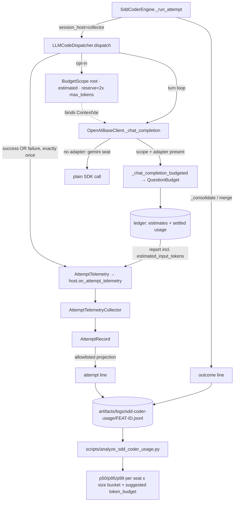

---
# SDD flow type and base branch (FEAT-145).
# - type: feature  (default)  → base_branch: dev (or any non-main branch)
# - type: hotfix              → base_branch MUST be: main
type: feature
base_branch: dev
---

# Feature Specification: Empirical Token-Budget Sizing for sdd-coder Bedrock Seats

**Feature ID**: FEAT-554
**Date**: 2026-09-12
**Author**: Jesus Lara / Claude
**Status**: draft
**Target version**: next development release after approval
**Source**: `sdd/proposals/sdd-coder-bedrock-token-telemetry.brainstorm.md` (Status: accepted, 12/12 questions resolved)
**Code baseline**: `10ecf45eb` on `dev`
**Identity**: `FEAT-554`, allocated by `python -m scripts.sdd.reserve_ids --kind feature` (ledger commit published separately)

---

## 1. Motivation & Business Requirements

### Problem Statement

FEAT-550 gave `AbstractClient`/`AbstractBot` a cumulative per-question
`token_budget` covering Bedrock Converse and Bedrock Mantle. FEAT-549 runs the
`sdd-coder` agent on those same Mantle seats (`qwen` →
`qwen.qwen3-coder-480b-a35b-instruct`). **Nobody can pick a number for
`token_budget` on a coding seat, because nothing measures what a coding attempt
actually consumes.**

A coding attempt is not a chat question. It is a loop of up to `max_turns`
rounds — **60** on the MCP roster path (`DEFAULT_LLM_MAX_TURNS`,
`agent_builder.py:134`), not the `LLMCodeDispatchProfile` default of 24 — each
one re-sending the full history. Consumption is therefore dominated by *input*
and is roughly quadratic in turn count. Measured on 2026-09-12
(`artifacts/logs/sdd-coder-count-input-overhead-20260912.md`): a 60-turn attempt
whose history grows to 148k tokens consumes a cumulative **≈4.7M tokens**
(≈5.1M if every turn hits the 8,192 output cap). An operator who reads
`token_budget` as a context-window figure and sets 200,000 would kill every
attempt around turn 11.

What exists today falls short in specific, verified ways:

- Per-attempt usage **is** collected — `AttemptTelemetryCollector`
  (`sdd_coder/engine.py:91-136`) folds the `dispatch.completed` payload built by
  `LLMCodeDispatcher._completion_usage_payload` (`dispatchers/llm.py:584-617`)
  into `AttemptRecord.usage` (`sdd_coder/models.py:115-127`).
- It **is** written to disk — `SddCoderEngine._journal`
  (`sdd_coder/engine.py:472-488`) snapshots the whole `CoderJob` to
  `<worktree>/.sdd-coder/jobs/<job_id>.json`.

But that journal **dies with the feature worktree** (`/sdd-done` runs
`git worktree remove`), so the successful features are exactly the ones missing
from any sample; it is keyed by job rather than task; it carries no per-turn
detail, no task-size correlate and no outcome-linked view; and it reads nothing
from the FEAT-550 ledger, so it cannot show how far the `estimated` admission
mode diverges from what the provider bills.

### Goals

1. Bind **one** root `BudgetScope` around the whole turn loop of
   `LLMCodeDispatcher.dispatch`, so one coding attempt is one budgeted
   "question" rather than 60 independent ones.
2. Instrument without changing behaviour: opt-in activation, preserved output
   cap, telemetry failures that never alter a dispatch result.
3. Record **both** accountings side by side — the provider's accumulated
   `CompletionUsage` and the ledger's estimated admission — so their difference
   becomes the measured calibration signal for a safety margin.
4. Persist a durable, outcome-linked, privacy-safe per-attempt dataset that
   survives worktree removal.
5. Capture at attempt time everything the analysis needs later, including the
   declared-file count, which becomes unreadable once the worktree is gone.
6. Record a failed attempt's consumption too — the degenerate tail is data.
7. Ship the analysis that turns the dataset into a recommended `token_budget`
   per seat × task-size segment, refusing to recommend on a thin sample.

### Non-Goals (explicitly out of scope)

- **Enforcing** a real ceiling on a coding seat. This feature measures; the
  ceiling it recommends is configured by a human afterwards.
- A budget adapter for `GeminiOpenAICompatClient`. Verified absent
  (`google/openai_compat.py:17` defines neither `budget_supported_methods` nor
  `budget_adapter_factory`), so the `gemini` seat is instrumented for provider
  totals only and serves as the unbudgeted comparison baseline. Building that
  adapter is FEAT-550 scope — design research S2, narrowing branch adopted.
- The `codex` (CLI) and `haiku` (native Claude Code sub-agent) seats. Their
  usage arrives by a different path; they produce no rows at all rather than
  rows with null tokens that would skew percentiles.
- A strict-mode qualification for Mantle. `MantleBudgetAdapter.count_input`
  raises `BudgetUnsupported` in `strict` mode (`amazon/budget.py:326-330`);
  shadow mode uses `budget_mode="estimated"`.
- Unifying FEAT-550's tools-disabled finalization with `LLMCodeDispatcher`'s
  forced-`final_output` salvage (`dispatchers/llm.py:800-843`). Recorded as the
  follow-up this feature's dataset would justify.
- Pricing/cost computation, an HTML report, cross-machine aggregation, or a
  telemetry service. Journal harvesting of existing `.sdd-coder/jobs/*.json`
  was rejected as the primary mechanism — see brainstorm Option A; it remains a
  legitimate zero-cost day-0 sample.
- Per-round instrumentation via `ClientRoundEvent` as the transport — brainstorm
  Option C, rejected because it cannot observe the estimation error.

---

## 2. Architectural Design

### Overview

`LLMCodeDispatcher.dispatch`, when telemetry is enabled, creates one root
`BudgetScope` from the process-wide registry and holds it open across the entire
turn loop, with an **absolute** `final_answer_reserve` of `2 × max_tokens`
instead of the 0.15 fractional default (a coder's final output is a small
`DevelopmentOutput` JSON; a fraction of a multi-million ceiling would immobilise
hundreds of thousands of tokens to protect ~1k). Because
`OpenAIBaseClient._chat_completion:262-264` consults `current_budget_scope()` on
every wire call, each turn is then reserved and reconciled by that one ledger
for any client exposing a `budget_adapter_factory` — today Mantle
(`amazon/nova/mantle.py:93`). **The machinery that would enforce is the
machinery that measures**, so there is no second accounting implementation to
drift.

Three corrections to the accepted brainstorm's stated mechanism, each confirmed
against the code by the §9 design-research pass. They are the substance of this
design, not footnotes:

1. **Rich payload keys do not survive the session-state projection.**
   `action_from_dispatch_event` copies exactly seven whitelisted scalars out of
   `payload["usage"]` into `DispatchCompleted` (`session_state.py`, the
   `cls is DispatchCompleted` branch), and `DispatchCompleted` is a closed
   Pydantic model whose validation failure is swallowed by design
   (`dispatchers/_shared.py:118-124`). Widening `_completion_usage_payload`
   would therefore drop the per-turn series and the budget report **silently**.
   This feature adds an explicit, typed telemetry hook — `AttemptTelemetry`
   handed to the bound session host via an optional duck-typed
   `on_attempt_telemetry` method — and does not rely on unknown payload keys.
2. **`BudgetReport` does not expose the estimate.** `_report_locked`
   (`clients/budget.py:327-359`) reports `self._settled_input` — provider usage —
   and keeps `estimate.input_tokens` only inside each reservation. The estimation
   error, this feature's whole calibration premise, is therefore not computable
   from today's report. `QuestionBudget` gains accumulated estimated-admission
   totals, surfaced as **additive optional** `BudgetReport` fields so every
   existing FEAT-550 consumer is unaffected.
3. **A failed attempt loses every token it burned.** `dispatch.failed` carries
   `error_class`/`error_message` only (`dispatchers/llm.py:184-215`), and the
   collector reads usage solely from `DispatchCompleted`. The terminal telemetry
   hook therefore fires on **both** paths, exactly once per attempt, carrying
   whatever was accumulated before the failure.

The sink writes two append-only JSONL lines per attempt — `attempt` when the
attempt returns, `outcome` at consolidation — into
`artifacts/logs/sdd-coder-usage/<FEAT-ID>.jsonl` under an explicitly configured
telemetry root, joined at analysis time by `(feature_id, task_id, attempt)`.
Rows are built by a strict allowlist, never by serialising `AttemptRecord`
(whose `error` field holds a full exception string, `engine.py:583`).

### Component Diagram



### Integration Points

| Existing Component | Integration Type | Notes |
|---|---|---|
| `QuestionBudget` / `BudgetReport` | extends (additive) | Accumulated estimated admission; optional fields, defaults preserve every existing consumer |
| `LLMCodeDispatcher.dispatch` | modifies | Optional root scope around the loop; terminal telemetry on both exit paths |
| `OpenAIBaseClient._chat_completion` | depends on | Unchanged; the ContextVar branch at :262-264 is what makes per-turn metering work |
| `MantleBudgetAdapter` | depends on | Unchanged; exercised under long tool-heavy loops for the first time |
| `GeminiOpenAICompatClient` | depends on | Unchanged and deliberately unbudgeted — the comparison baseline |
| `AttemptTelemetryCollector` | modifies | Consumes the new typed hook in addition to `DispatchCompleted` |
| `AttemptRecord` | modifies | Carries the resolved model, turn series, both accountings, declared-file count |
| `SddCoderEngine` | extends | Validated telemetry root; writes `attempt` and `outcome` lines |
| `SddCoderToolkit` | modifies | Passes the telemetry root through from configuration |
| `parrot.conf` | extends | `SDD_CODER_TELEMETRY_DIR`, `DEV_LOOP_CODER_SHADOW_BUDGET`, `DEV_LOOP_CODER_TELEMETRY` |
| `scripts/` | new file | `analyze_sdd_coder_usage.py` |
| `docs/dev_loop/sdd-coder-orchestrator.md` | modifies | Telemetry section: campaign workflow and the millions-not-thousands warning |

No breaking changes. No new runtime dependency (`tiktoken` and `pandas` are
already present). A run that sets no environment variable behaves bit-identically
to today.

### Data Models

```python
# packages/ai-parrot/src/parrot/flows/dev_loop/models/telemetry.py  (new)

class TurnUsage(BaseModel):
    """One turn's reported usage inside a coding-agent loop."""

    round_number: int = Field(..., ge=1)
    input_tokens: Optional[int] = Field(None, ge=0)
    output_tokens: Optional[int] = Field(None, ge=0)


class AttemptTelemetry(BaseModel):
    """Terminal telemetry for ONE dispatch attempt, success or failure.

    Handed to the bound session host through its optional
    ``on_attempt_telemetry`` method — never through a ``dispatch.completed``
    payload key, which `action_from_dispatch_event` would silently drop
    (design research S3).
    """

    resolved_model: str = ""
    turns: int = Field(0, ge=0)
    terminal: Literal["completed", "failed", "salvaged"] = "completed"
    error_class: str = ""
    provider_input_tokens: Optional[int] = Field(None, ge=0)
    provider_output_tokens: Optional[int] = Field(None, ge=0)
    turn_series: List[TurnUsage] = Field(default_factory=list, max_length=MAX_TURN_SERIES)
    budget_report: Optional[Dict[str, Any]] = None


# packages/ai-parrot/src/parrot/flows/dev_loop/sdd_coder/telemetry.py  (new)

class AttemptUsageRow(BaseModel):
    """The `attempt` JSONL line. Counters, ids and timings ONLY (design research S5)."""

    kind: Literal["attempt"] = "attempt"
    ts: str
    feature_id: str
    task_id: str
    attempt: int = Field(..., ge=1, le=3)
    seat_label: str
    backend: str = ""
    configured_model: str = ""
    resolved_model: str = ""
    duration_s: float = 0.0
    turns: int = 0
    terminal: str = "completed"
    error_class: str = ""
    declared_files: Optional[int] = None       # captured at attempt time (S8)
    declared_files_known: bool = False
    provider_input_tokens: Optional[int] = None
    provider_output_tokens: Optional[int] = None
    ledger_input_tokens: Optional[int] = None
    ledger_output_tokens: Optional[int] = None
    ledger_estimated_input_tokens: Optional[int] = None
    ledger_overrun_tokens: Optional[int] = None
    ledger_counting_methods: List[str] = Field(default_factory=list)
    ledger_accounting_complete: Optional[bool] = None
    turn_series: List[List[int]] = Field(default_factory=list)   # [[round, in, out], ...]


class OutcomeRow(BaseModel):
    """The `outcome` JSONL line, joined to its attempt by (feature_id, task_id, attempt)."""

    kind: Literal["outcome"] = "outcome"
    ts: str
    feature_id: str
    task_id: str
    attempt: int = Field(..., ge=1, le=3)
    outcome: str                                # TaskOutcome value
    conflict_file_count: int = 0
    unexpected_file_count: int = 0
```

### New Public Interfaces

```python
# parrot/flows/dev_loop/sdd_coder/telemetry.py
class CoderTelemetrySink:
    """Append-only per-feature JSONL writer for sdd-coder attempt telemetry."""

    def __init__(self, root: str | Path, *, enabled: bool = True) -> None: ...
    async def write_attempt(self, row: AttemptUsageRow) -> None: ...
    async def write_outcome(self, row: OutcomeRow) -> None: ...

def feature_file_name(feature_id: str) -> str:
    """Filename-safe `<FEAT-ID>.jsonl`; raises ValueError on an unsafe id (S6)."""

def build_attempt_row(record: AttemptRecord, *, feature_id: str, declared_files: int | None) -> AttemptUsageRow:
    """Allowlisted projection — never a wholesale AttemptRecord dump (S5)."""
```

---

## 3. Module Breakdown

#### Delegation-eligible modules

| Module | Eligible? | Decided patterns / exact contracts | Why not (if no) |
|---|---|---|---|
| M1: Ledger estimate accounting | yes | Additive optional `BudgetReport` fields with defaults; accumulate on settle/release in `QuestionBudget`; no signature change to `reserve()`/`report()` | — |
| M2: Typed telemetry transport | yes | `AttemptTelemetry`/`TurnUsage` exactly as in §2; hook name `on_attempt_telemetry`; `getattr(host, ..., None)` guard; fires exactly once | — |
| M3: Shadow scope binding | no | Ceiling validation rule and the preserved-cap guard are design decisions with a live failure mode | Requires judgement on the minimum non-binding ceiling |
| M4: Telemetry sink + engine wiring | yes | Row models fixed in §2; single pre-serialized `os.write` on an `O_APPEND` fd; `<= 4096` byte line budget; per-feature file | — |
| M5: Analysis script | yes | n≥12 gate; buckets `1-2 / 3-4 / 5+`; p50/p95/p99; margin from measured estimation error | — |
| M6: Docs | yes | Section content dictated by §1 and §7 | — |

### Module 1: Ledger estimate accounting
- **Path**: `packages/ai-parrot/src/parrot/models/token_budget.py`, `packages/ai-parrot/src/parrot/clients/budget.py`
- **Responsibility**: Make the estimated admission observable, so estimation error is measurable. Additive only.
- **Depends on**: existing FEAT-550 ledger
- **Interface Skeleton**:
  ```python
  # parrot/models/token_budget.py  (modifies parrot/models/token_budget.py:110)
  class BudgetReport(BaseModel):
      # ... existing fields unchanged (verified: parrot/models/token_budget.py:115-133)
      estimated_input_tokens: int = Field(0, ge=0)
      """Sum of admission estimates for reservations that settled or were released.

      Compared against `input_tokens` (provider-settled) this is the estimation
      error of `budget_mode="estimated"`. Defaults to 0 so pre-FEAT-554
      consumers and persisted payloads still validate.
      """
      estimate_methods: tuple[str, ...] = ()
      """Distinct `TokenEstimate.method` values seen (e.g. `("tiktoken:o200k_base",)`)."""

  # parrot/clients/budget.py  (modifies parrot/clients/budget.py:327)
  class QuestionBudget:
      def _report_locked(self) -> BudgetReport:  # verified: parrot/clients/budget.py:327
          """Unchanged contract; now also reports accumulated admission estimates."""
  ```

### Module 2: Typed telemetry transport
- **Path**: `packages/ai-parrot/src/parrot/flows/dev_loop/models/telemetry.py` (new), `packages/ai-parrot/src/parrot/flows/dev_loop/dispatchers/llm.py`
- **Responsibility**: Carry per-turn series, resolved model and budget report from the dispatch loop to the bound session host without passing through the lossy `DispatchCompleted` projection. Fire exactly once per attempt, on success and on failure.
- **Depends on**: Module 1
- **Interface Skeleton**:
  ```python
  # parrot/flows/dev_loop/models/telemetry.py  (new)
  MAX_TURN_SERIES: int = 120
  """Hard cap on recorded turns, so one JSONL line stays inside the atomic-write budget."""

  class TurnUsage(BaseModel): ...        # fields per §2 Data Models
  class AttemptTelemetry(BaseModel): ...  # fields per §2 Data Models

  # parrot/flows/dev_loop/dispatchers/llm.py  (modifies parrot/flows/dev_loop/dispatchers/llm.py:274)
  class LLMCodeDispatcher:
      def _emit_attempt_telemetry(self, telemetry: AttemptTelemetry) -> None:
          """Hand terminal telemetry to the bound session host, once.

          Reads the host from `_SESSION_HOST_CTX` (verified:
          parrot/flows/dev_loop/dispatchers/_shared.py:64) and calls its optional
          `on_attempt_telemetry`; a host without that method is a no-op. Every
          exception is swallowed and logged at DEBUG — telemetry must never change
          a dispatch result.
          """
  ```

### Module 3: Shadow scope binding
- **Path**: `packages/ai-parrot/src/parrot/flows/dev_loop/dispatchers/llm.py`, `packages/ai-parrot/src/parrot/conf.py`
- **Responsibility**: Open one root budget scope around the whole turn loop when opted in, prove it cannot bind, and stamp the resolved model.
- **Depends on**: Module 2
- **Interface Skeleton**:
  ```python
  # parrot/conf.py  (modifies parrot/conf.py:828 neighbourhood — same relative/absolute rule)
  DEV_LOOP_CODER_TELEMETRY: bool = config.getboolean("DEV_LOOP_CODER_TELEMETRY", fallback=False)
  DEV_LOOP_CODER_SHADOW_BUDGET: int = config.getint("DEV_LOOP_CODER_SHADOW_BUDGET", fallback=0)
  """0 = bind no scope (provider totals only). >0 = cumulative shadow ceiling in tokens.

  A coding attempt's cumulative question total is measured in MILLIONS
  (≈4.7M for 60 turns; artifacts/logs/sdd-coder-count-input-overhead-20260912.md),
  NOT in context-window units.
  """
  _tel: str = config.get("SDD_CODER_TELEMETRY_DIR", fallback=str(BASE_DIR / "artifacts/logs/sdd-coder-usage"))
  SDD_CODER_TELEMETRY_DIR: str = os.path.normpath(_tel) if os.path.isabs(_tel) else os.path.normpath(str(BASE_DIR / _tel))

  # parrot/flows/dev_loop/dispatchers/llm.py  (modifies parrot/flows/dev_loop/dispatchers/llm.py:274)
  class LLMCodeDispatcher:
      @staticmethod
      def _shadow_policy(profile: LLMCodeDispatchProfile, ceiling: int) -> Optional[TokenBudgetPolicy]:
          """Build the non-binding shadow policy, or None when disabled.

          `final_answer_reserve` is ABSOLUTE (`2 * profile.max_tokens`), never the
          0.15 fraction. Raises ValueError when `ceiling` is below
          `_min_safe_ceiling(profile)`, rather than silently shrinking the output
          cap through `reservation.output_cap` (verified:
          parrot/clients/openai_base.py:388).
          """

      @staticmethod
      def _min_safe_ceiling(profile: LLMCodeDispatchProfile) -> int:
          """Smallest ceiling that cannot bind: derived from max_turns and max_tokens."""
  ```

### Module 4: Telemetry sink and engine wiring
- **Path**: `packages/ai-parrot/src/parrot/flows/dev_loop/sdd_coder/telemetry.py` (new), `sdd_coder/engine.py`, `sdd_coder/models.py`, `sdd_coder/toolkit.py`
- **Responsibility**: Durable, privacy-safe, per-feature JSONL rows; capture the declared-file count while the task file still exists; consume the M2 hook.
- **Depends on**: Module 2
- **Interface Skeleton**:
  ```python
  # parrot/flows/dev_loop/sdd_coder/telemetry.py  (new)
  MAX_LINE_BYTES: int = 4096
  """One row must fit a single atomic O_APPEND write."""

  class AttemptUsageRow(BaseModel): ...   # fields per §2 Data Models
  class OutcomeRow(BaseModel): ...        # fields per §2 Data Models

  class CoderTelemetrySink:
      """One append-only file per feature under a validated root."""

      def __init__(self, root: str | Path, *, enabled: bool = True) -> None: ...
      async def write_attempt(self, row: AttemptUsageRow) -> None:
          """Serialize, assert <= MAX_LINE_BYTES, then ONE os.write to an O_APPEND fd.

          Runs the blocking write through `asyncio.to_thread` (the S11 pattern
          `_journal` follows — verified: parrot/flows/dev_loop/sdd_coder/engine.py:472).
          Never raises: a telemetry failure is logged at WARNING once and dropped.
          """
      async def write_outcome(self, row: OutcomeRow) -> None: ...

  # parrot/flows/dev_loop/sdd_coder/models.py  (modifies parrot/flows/dev_loop/sdd_coder/models.py:115)
  class AttemptRecord(BaseModel):
      # ... existing fields unchanged (verified: sdd_coder/models.py:117-127)
      resolved_model: str = ""
      turns: int = 0
      terminal: str = "completed"
      error_class: str = ""
      declared_files: Optional[int] = None
      declared_files_known: bool = False
      turn_series: List[List[int]] = Field(default_factory=list)
      budget_report: Dict[str, Any] = Field(default_factory=dict)

  # parrot/flows/dev_loop/sdd_coder/engine.py  (modifies parrot/flows/dev_loop/sdd_coder/engine.py:149)
  class AttemptTelemetryCollector:
      def on_attempt_telemetry(self, telemetry: AttemptTelemetry) -> None:
          """Absorb the M2 payload (verified hook site: dispatchers/_shared.py:64)."""

  class SddCoderEngine:
      def __init__(self, *, roster: RosterConfig, telemetry_dir: Optional[str] = None, ...) -> None:
          """`telemetry_dir` defaults to `conf.SDD_CODER_TELEMETRY_DIR`.

          The engine knows only `worktree_base_path` today (verified:
          sdd_coder/engine.py:162) and so has no main-repository root to infer one
          from — it must be passed, never guessed (design research S6).
          """
  ```

### Module 5: Analysis script
- **Path**: `scripts/analyze_sdd_coder_usage.py` (new)
- **Responsibility**: Join, filter, bucket, report, and recommend — or refuse.
- **Depends on**: Module 4
- **Interface Skeleton**:
  ```python
  # scripts/analyze_sdd_coder_usage.py  (new)
  MIN_SAMPLES: int = 12
  """Below this many merged attempts a segment gets percentiles but NO recommendation."""

  SIZE_BUCKETS: tuple[tuple[str, int, int], ...] = (("1-2", 1, 2), ("3-4", 3, 4), ("5+", 5, 10**6))

  def load_rows(root: Path) -> "pandas.DataFrame":
      """Glob `<root>/*.jsonl`, parse, and join attempt+outcome on (feature_id, task_id, attempt).

      An `outcome` line with no matching `attempt` line is reported as an
      incomplete pair and EXCLUDED — never treated as zero tokens.
      """

  def recommend(df: "pandas.DataFrame") -> "pandas.DataFrame":
      """Per (seat, size bucket): n, p50/p95/p99 total, median estimation error, suggested ceiling."""
  ```

### Module 6: Documentation
- **Path**: `docs/dev_loop/sdd-coder-orchestrator.md`
- **Responsibility**: Replace the existing "Telemetry" section with the campaign workflow, the row schema, and the millions-not-thousands warning.
- **Depends on**: Modules 1-5

---

## 4. Test Specification

### Unit Tests

| Test | Module | Description |
|---|---|---|
| `test_report_exposes_estimated_input` | M1 | A settled reservation's estimate appears in `BudgetReport.estimated_input_tokens`; a released one too; an uncertain one does not double count |
| `test_report_defaults_backward_compatible` | M1 | A `BudgetReport` constructed without the new fields validates, with `0` / `()` |
| `test_attempt_telemetry_model_caps_series` | M2 | `turn_series` longer than `MAX_TURN_SERIES` is rejected |
| `test_emit_telemetry_noop_without_hook` | M2 | A session host lacking `on_attempt_telemetry` is a no-op, dispatch result unchanged |
| `test_emit_telemetry_swallows_exception` | M2 | A hook that raises does not propagate and does not change the dispatch result |
| `test_shadow_policy_absolute_reserve` | M3 | `final_answer_reserve == 2 * profile.max_tokens`, an int not a float |
| `test_shadow_policy_rejects_binding_ceiling` | M3 | A ceiling below `_min_safe_ceiling` raises rather than shrinking the cap |
| `test_shadow_disabled_binds_no_scope` | M3 | With the env unset, `current_budget_scope()` is `None` inside the loop |
| `test_row_projection_excludes_error_text` | M4 | `build_attempt_row` carries `error_class` and never the `error` string or diagnostics |
| `test_feature_file_name_rejects_unsafe_id` | M4 | `../`, `/`, and empty ids raise `ValueError` |
| `test_row_fits_atomic_line_budget` | M4 | A 120-turn worst-case row serializes to `<= MAX_LINE_BYTES` |
| `test_sink_never_raises` | M4 | An unwritable root logs once and returns; no exception reaches the caller |
| `test_declared_files_captured_at_attempt_time` | M4 | The count is taken from the task file during the attempt, and `declared_files_known` is `False` when unreadable |
| `test_analysis_refuses_thin_segment` | M5 | A segment with 11 merged attempts prints percentiles and no recommendation; 12 produces one |
| `test_analysis_excludes_orphan_outcome` | M5 | An `outcome` row with no `attempt` row is counted as incomplete, not as zero |

### Integration Tests

| Test | Description |
|---|---|
| `test_shadow_scope_spans_every_turn` | A fake budget-capable client records one `operation_id` across all turns of a multi-turn loop — not one per turn |
| `test_shadow_preserves_max_tokens` | Every budgeted request's resolved output cap equals `profile.max_tokens` exactly |
| `test_failed_attempt_reports_partial_usage` | A loop that raises mid-way still produces exactly one `AttemptTelemetry` with the tokens burned so far |
| `test_attempt_and_outcome_rows_join` | An engine-level run writes one `attempt` and one `outcome` line that join on `(feature_id, task_id, attempt)` |
| `test_concurrent_appends_stay_valid_json` | N concurrent writers to one feature file produce N lines, every one parseable |
| `test_gemini_seat_rows_have_no_ledger_fields` | The unbudgeted seat yields provider totals with `ledger_*` absent — not zeros |

### Test Data / Fixtures

```python
@pytest.fixture
def budget_capable_fake_client():
    """OpenAI-shaped fake exposing `budget_adapter_factory` + `_chat_completion`,
    so the dispatcher exercises the real budgeted funnel.

    Existing dispatcher fakes have no budget hooks (design research S10):
    packages/ai-parrot/tests/flows/dev_loop/test_llm_code_dispatcher.py
    """

@pytest.fixture
def telemetry_root(tmp_path):
    """Isolated telemetry root; never the repository's artifacts/logs/."""
```

---

## 5. Acceptance Criteria

> This feature is complete when ALL of the following are true:

- [ ] AC-1: With no environment variable set, a dispatch is byte-identical to today: no scope bound, no rows written, no new payload keys.
- [ ] AC-2: With the shadow scope enabled, all turns of one attempt share one ledger `operation_id`.
- [ ] AC-3: Every budgeted request's effective output cap equals `profile.max_tokens`; a ceiling that could shrink it is refused at policy-construction time, not discovered at turn 40.
- [ ] AC-4: `final_answer_reserve` is an absolute `2 × max_tokens`.
- [ ] AC-5: `BudgetReport.estimated_input_tokens` is populated and differs from `input_tokens` by the true estimation error; a report built without the new fields still validates.
- [ ] AC-6: A failed or timed-out attempt yields exactly one `AttemptTelemetry` carrying the tokens burned before the failure — never zero, never two.
- [ ] AC-7: No JSONL row contains prompt text, tool arguments, file contents, an exception message, or diagnostics — `error_class` only. Verified by an allowlist test, not by inspection.
- [ ] AC-8: `declared_files` is captured during the attempt and survives worktree removal; `declared_files_known=False` when the task file was unreadable.
- [ ] AC-9: Rows land in `<telemetry_root>/<FEAT-ID>.jsonl`; an unsafe `feature_id` is rejected; the root is passed in, never inferred from a worktree path.
- [ ] AC-10: A worst-case row is `<= 4096` bytes and written with one `os.write` on an `O_APPEND` fd; N concurrent writers produce N parseable lines.
- [ ] AC-11: Any telemetry failure (unwritable root, hook exception, oversized row) logs and drops, and never changes a dispatch or merge outcome.
- [ ] AC-12: `attempt` and `outcome` rows join on `(feature_id, task_id, attempt)`; an orphan `outcome` is reported as incomplete, never as zero tokens.
- [ ] AC-13: The analysis script reports p50/p95/p99 and median estimation error per (seat × size bucket), and withholds a recommendation below 12 merged attempts.
- [ ] AC-14: `resolved_model` is the dispatcher-resolved model (`_resolve_model`), recorded alongside the roster's `configured_model`, and the two may differ.
- [ ] AC-15: The `gemini` seat produces rows with provider totals and absent `ledger_*` fields; the spec's coverage claim is stated as Mantle-only.
- [ ] AC-16: `pytest packages/ai-parrot/tests/flows/dev_loop/ packages/ai-parrot-client-amazon/tests/unit/test_token_budget_mantle.py -q` passes.
- [ ] AC-17: `ruff check .` clean on every changed file.
- [ ] AC-18: `docs/dev_loop/sdd-coder-orchestrator.md` documents the campaign workflow and states that a coder attempt's cumulative budget is millions of tokens, not context-window sized.

---

## 6. Codebase Contract

> **CRITICAL — Anti-Hallucination Anchor**
> Every anchor below was re-verified against the working tree at `10ecf45eb`
> on 2026-09-12 (line-by-line `sed -n` spot check).

### Verified Imports

```python
from parrot.clients.budget_scope import current_budget_scope, get_default_registry  # verified: parrot/clients/budget_scope.py:33,297
from parrot.models.token_budget import TokenBudgetPolicy, BudgetReport, TokenEstimate  # verified: parrot/models/token_budget.py:25,110,57
from parrot.clients.budget import QuestionBudget                                    # verified: parrot/clients/budget.py:365-370 (__all__)
from parrot.flows.dev_loop.sdd_coder.fidelity import parse_task_files               # verified: sdd_coder/fidelity.py:25
from parrot.flows.dev_loop.sdd_coder.models import AttemptRecord, TaskResult, CoderJob  # verified: sdd_coder/models.py:115,129,153
from parrot.models.basic import CompletionUsage                                     # verified: dispatchers/llm.py:44
from parrot import conf                                                            # verified: sdd_coder/roster.py:9
```

### Existing Class Signatures

```python
# parrot/flows/dev_loop/sdd_coder/engine.py
class AttemptTelemetryCollector:                                       # line 91
    def __init__(self, *, attempt: int, seat: RosterSeat) -> None:     # line 101
    def apply(self, action: Any, origin: Any = None) -> None:          # line 108
    def record(self) -> AttemptRecord:                                 # line 125
    # apply() copies ONLY: input_tokens, output_tokens,
    #   cache_creation_input_tokens, cache_read_input_tokens,
    #   total_cost_usd, num_turns, duration_ms                         # lines 113-123
    # collector.error is assigned the FULL exception string            # line ~583

class SddCoderEngine:                                                  # line 139
    def __init__(self, *, roster, probe=None, redis_url=None,
                 worktree_base_path=None, dispatcher_builder=build_dispatcher,
                 stream_ttl_seconds=3600) -> None:                     # line 149
    #   self._base_path = realpath(worktree_base_path or conf.WORKTREE_BASE_PATH)  # line 162
    #   NO main-repository root is known to the engine.
    async def _journal(self, worktree: str, job: CoderJob) -> None:    # line 472
    async def _consolidate(...)                                        # line 337
    async def merge(self, feature, worktree, task_id) -> TaskResult:   # line 407
    async def _run_attempt(self, ctx, task, seat, *, attempt, job_id
        ) -> Tuple[AttemptRecord, Optional[DevelopmentOutput], str,
                   SubWorktreeManager, str, str]:                      # line 520
    #   returns collector.record() ...                                 # line 586

# parrot/flows/dev_loop/sdd_coder/models.py
class RosterSeat(BaseModel):   # line 23 — label, kind, backend, model, fallback_model
class PlannedTask(BaseModel):  # line 72
class AttemptRecord(BaseModel): # line 115 — attempt, seat_label, backend, model,
                                #   started_at, ended_at, duration_s, usage, error
class TaskResult(BaseModel):    # line 129
class CoderJob(BaseModel):      # line 153 — tasks: List[TaskResult]

# parrot/flows/dev_loop/dispatchers/llm.py
async def _chat_completion(self, *, client, model, messages, args) -> Any:   # line 973
    #   method = getattr(client, "_chat_completion", None)                    # line 981
@staticmethod
def _completion_usage_payload(accumulated, *, turns, started_at) -> Dict[str, Any]:  # line 584
    #   emits ONLY num_turns, duration_ms, input_tokens, output_tokens        # lines 610-617
@staticmethod
def _extract_usage(response) -> tuple[Optional[CompletionUsage], Optional[Dict]]:    # line 1089
@staticmethod
def _resolve_model(profile, client) -> str:                                   # line 879
    #   LLMFactory.parse_llm_string(profile.llm) then client.model /
    #   default_model / _default_model — CAN differ from RosterSeat.model
#   turn loop: model resolved at line 274; usage accumulated at lines 331-333
#   dispatch.failed payloads carry error_class/error_message ONLY   # lines 184-191, 208-215
#   forced final_output salvage                                     # lines 800-843

# parrot/flows/dev_loop/models/llm.py
class LLMCodeDispatchProfile(BaseModel):                             # line 10
    subagent: Literal["sdd-worker", "sdd-coder"] = "sdd-worker"      # line 18
    llm: str = "nvidia:minimaxai/minimax-m3"                         # line 19
    timeout_seconds: int = Field(default=1800, ge=60, le=7200)       # line 22
    max_turns: int = Field(default=24, ge=1, le=100)                 # line 23
    max_tokens: int = Field(default=8192, ge=256, le=32768)          # line 24

# parrot/flows/dev_loop/agent_builder.py
ENV_LLM_MAX_TURNS: str = "DEV_LOOP_LLM_MAX_TURNS"                    # line 133
DEFAULT_LLM_MAX_TURNS: int = 60                                      # line 134 — the roster path's real budget
def _config_getter(key, fallback=""): return conf.config.get(key, fallback=fallback)  # line 84

# parrot/flows/dev_loop/dispatchers/_shared.py
_SESSION_HOST_CTX: ContextVar[Optional[SessionHost]]                 # line 64
def _apply_to_session_host(event: DispatchEvent) -> None:            # line 92
    #   every exception swallowed and logged at DEBUG                # lines 118-124

# parrot/flows/dev_loop/session_state.py
class DispatchCompleted(_DispatchAction):                            # line 476
    #   Optional ints/floats: input_tokens, output_tokens,
    #   cache_creation_input_tokens, cache_read_input_tokens,
    #   total_cost_usd, num_turns, duration_ms                       # lines 480-486
#   action_from_dispatch_event whitelists exactly those seven keys out of
#   payload["usage"] — any other key is dropped before the collector sees it.

# parrot/clients/openai_base.py
async def _chat_completion(self, model, messages, use_tools=False, stream=False, **kwargs):  # line 228
    _scope = current_budget_scope()                                   # line 262
    if _scope is not None and self.budget_adapter_factory is not None: # line 263
        return await self._chat_completion_budgeted(...)              # line 264
async def _chat_completion_budgeted(self, scope, *, model, messages, use_tools, stream, **kwargs):  # line 334
    view = self.client.with_options(max_retries=0)                    # line 349
    kwargs[cap_key] = reservation.output_cap                          # line 388  <-- the cap-shrink risk
#   budget_adapter_factory: Callable[[], Any] | None = None           # line 99 (base default)

# parrot/clients/budget_scope.py
def current_budget_scope() -> Optional["BudgetScope"]:                # line 33
class BudgetScope:                                                    # line 38
    async def __aenter__(self) -> "BudgetScope":                      # line 80 — binds the ContextVar
    async def __aexit__(self, exc_type, exc, tb) -> None:             # line 89 — closes the ledger on a root
class BudgetRegistry:                                                 # line 120
    async def create(self, policy: TokenBudgetPolicy) -> BudgetScope: # line 131
    #   raises BudgetRegistryFull when retained capacity is exhausted  # line 136
def get_default_registry() -> BudgetRegistry:                         # line 297

# parrot/clients/budget.py
async def report(self) -> BudgetReport:                               # line 280
def _report_locked(self) -> BudgetReport:                             # line 327
    #   reports self._settled_input / _settled_output — NEVER an estimate
    #   estimate.input_tokens is used only for the reservation          # lines 147,165,178

# parrot/models/token_budget.py
class TokenBudgetPolicy(BaseModel):                                   # line 25
    token_budget: int = Field(..., ge=0)                              # line 30
    budget_mode: BudgetMode = "estimated"                             # line 31
    final_answer_reserve: int | float = Field(0.15)                   # line 32 — int = ABSOLUTE tokens
class TokenEstimate(BaseModel):                                       # line 57 — input_tokens, method, quality, ...
class BudgetReport(BaseModel):                                        # line 110

# packages/ai-parrot-client-amazon/.../nova/mantle.py
budget_supported_methods = frozenset({"ask","ask_stream","resume","invoke"})  # line 90
@staticmethod
def budget_adapter_factory(): ...                                     # line 93

# packages/ai-parrot-client-amazon/.../budget.py
class MantleBudgetAdapter:                                            # line 289
    async def count_input(self, payload, *, route="chat_completions",
        mode="estimated", registry=STRICT_QUALIFICATIONS, endpoint="") -> TokenEstimate:  # line 300
    #   strict mode with no qualification raises BudgetUnsupported     # line 328
    #   n = self._counter.count(canonical_json(body))                  # line 345
    def normalize_usage(self, raw, *, route="chat_completions") -> BudgetUsage:  # line 349

# packages/ai-parrot-client-google/.../google/openai_compat.py
class GeminiOpenAICompatClient(OpenAIBaseClient):                     # line 17
    #   defines NEITHER budget_supported_methods NOR budget_adapter_factory

# parrot/conf.py
from navconfig import BASE_DIR, config                                # line 6
PROJECT_ROOT = BASE_DIR                                               # line 42
_wt / WORKTREE_BASE_PATH — relative→join BASE_DIR, absolute→verbatim  # lines 828-829
```

### Integration Points

| New Component | Connects To | Via | Verified At |
|---|---|---|---|
| shadow scope | `BudgetRegistry.create()` | await call | `parrot/clients/budget_scope.py:131` |
| shadow scope | `OpenAIBaseClient._chat_completion` | `current_budget_scope()` ContextVar | `parrot/clients/openai_base.py:262-264` |
| `_emit_attempt_telemetry` | bound session host | `_SESSION_HOST_CTX.get()` + `getattr(host,"on_attempt_telemetry",None)` | `dispatchers/_shared.py:64` |
| `AttemptTelemetryCollector.on_attempt_telemetry` | `AttemptRecord` | `record()` | `sdd_coder/engine.py:125` |
| `CoderTelemetrySink.write_attempt` | `_run_attempt` return | direct call after `collector.record()` | `sdd_coder/engine.py:586` |
| `CoderTelemetrySink.write_outcome` | `_consolidate` / `merge` | direct call on `TaskResult` | `sdd_coder/engine.py:337,407` |
| `declared_files` | `parse_task_files(task_md)` | read during the attempt | `sdd_coder/fidelity.py:25` |
| `resolved_model` | `LLMCodeDispatcher._resolve_model` | telemetry payload | `dispatchers/llm.py:879` |
| telemetry root | `conf.SDD_CODER_TELEMETRY_DIR` | `SddCoderToolkit` → engine kwarg | `sdd_coder/toolkit.py:46-56` |

### Does NOT Exist (Anti-Hallucination)

- ~~`LLMCodeDispatchProfile.token_budget`~~ — no budget field exists on the profile (`models/llm.py:10-40`).
- ~~`BudgetReport.estimated_input_tokens`~~ — **does not exist yet**; Module 1 adds it. Do not assume it is already there.
- ~~`AttemptRecord.turns` / `.outcome` / `.resolved_model`~~ — none exist today; turns live inside `usage["num_turns"]`, the outcome lives on `TaskResult`. Module 4 adds them.
- ~~A `dispatch.completed` payload key that survives the projection~~ — `action_from_dispatch_event` whitelists seven `usage` scalars; anything else is dropped, and a `DispatchCompleted` validation error is swallowed by `_apply_to_session_host` (`_shared.py:118-124`). Never add a payload key and expect it downstream.
- ~~`dispatch.failed` carrying usage~~ — payloads hold `error_class`/`error_message` only (`llm.py:184-191, 208-215`).
- ~~`GeminiOpenAICompatClient.budget_adapter_factory`~~ — not defined; the base default is `None` (`openai_base.py:99`), so the gemini seat never enters the budgeted funnel.
- ~~`BedrockMantleClient.budget_supported_methods` covering `_chat_completion`~~ — the frozenset is `{"ask","ask_stream","resume","invoke"}` (`mantle.py:90`). The loop is covered only by the ContextVar branch.
- ~~A strict-mode qualification for Mantle~~ — `count_input` raises `BudgetUnsupported` in strict mode (`amazon/budget.py:326-330`).
- ~~`SddCoderEngine` knowing the repository root~~ — it holds only `_base_path` (the worktree base, `engine.py:162`). The telemetry root must be injected.
- ~~`scripts/telemetry/`~~ — no such package; `scripts/` holds flat modules plus `scripts/sdd/`, `scripts/bench/`, `scripts/matrix/`.
- ~~A run bundle or `usage_report.py` for the FEAT-549 MCP path~~ — those belong to the dev-loop *flow*; the MCP path is driven by Claude Code and produces none.
- ~~`asyncio.to_thread` inside `count_input`~~ — it counts synchronously on the event loop (`amazon/budget.py:345`).

---

## 7. Implementation Notes & Constraints

### Patterns to Follow

- **Injectable config getter**: follow `conf.config.get(key, fallback=...)` with a `config_getter` parameter for tests, exactly as `RosterProbe` (`sdd_coder/roster.py:27`) and `agent_builder._config_getter` (`agent_builder.py:84`) do.
- **Sync I/O off the loop**: wrap file writes in `asyncio.to_thread`, the S11 pattern `_journal` already follows (`engine.py:472-488`).
- **Swallow-and-log for shims**: telemetry mirrors `_apply_to_session_host`'s discipline — never break a dispatch (`_shared.py:118-124`).
- **Additive optional model fields**: new `BudgetReport`/`AttemptRecord` fields carry defaults so persisted payloads re-validate, the same compatibility rule `DispatchCompleted` documents at `session_state.py:479`.
- Pydantic models for every structured payload; Google-style docstrings; `self.logger`.

### Known Risks / Gotchas

- **The output-cap overwrite is the sharpest edge.** `_chat_completion_budgeted` sets `kwargs[cap_key] = reservation.output_cap` (`openai_base.py:388`). A shadow ceiling that is merely "large" is not enough — it must be provably non-binding for all 60 turns, or the instrumentation quietly degrades the very runs it measures. Hence a validated minimum and AC-3.
- **Cumulative budgets for a coder live in the millions.** ≈4.7M measured for 60 turns; ≈5.1M if every turn saturates the output cap. Anyone treating `token_budget` as a context-window number will kill every attempt. This belongs in the docs, not only in this spec.
- **The tokenizer runs on the event loop.** `count_input` is `async` but counts synchronously (`amazon/budget.py:345`): 4.9 ms at turn 1, 65 ms at turn 60, ≈2.8 s per attempt, so ≈11 s of blocking per 4-seat wave. Measured as 0.1-0.5% of attempt wall-clock — acceptable, and a one-line `asyncio.to_thread` fixes it if a wider wave ever makes it matter.
- **Registry exhaustion** (`BudgetRegistryFull`, `budget_scope.py:136`): log once, run the attempt unscoped, write the row with `ledger_*` absent. Never fail a dispatch for a measurement.
- **Attempt crashes before the loop**: worktree creation and dispatcher construction are deliberately inside `_run_attempt`'s `try` (`engine.py:536-546`), so the row is written with zero turns and an `error_class`.
- **Privacy**: `AttemptRecord.error` holds the full exception string and `TaskResult.diagnostics` holds raw merge output. The row projection is an allowlist so a future field added to `AttemptRecord` cannot leak into the dataset by default.
- **Two processes, one feature file**: per-feature partitioning removes the common cross-process case, not all of it (two Claude Code sessions on the same feature). Mitigated by one pre-serialized `os.write` per line on an `O_APPEND` fd, with a `4096`-byte line budget that also bounds `turn_series`.
- **Fractional reserve against a huge ceiling** would immobilise ~700k tokens of a 4.7M-class budget to protect a ~1k JSON. Absolute reserve instead (AC-4).

### External Dependencies

| Package | Version | Reason |
|---|---|---|
| `tiktoken` | already installed | Local admission counting inside the FEAT-550 adapters (`amazon/budget.py:44-60`) |
| `pandas` | already installed | Percentiles and grouping in the analysis script |
| `pydantic` | already installed | Row and payload models |

No new dependency is introduced.

---

## 8. Open Questions

> Every question from the accepted brainstorm is resolved. Resolutions are
> carried forward verbatim and are reflected in the spec body as marked.

- [x] Which seats does the instrumentation cover? — *Resolved in brainstorm*: All of `LLMCodeDispatcher` — `nova` (Mantle/Bedrock) and `google-compat` (Gemini); `codex` and `haiku` are out of scope. **Refined by design research S2**: ledger coverage is Mantle-only; the gemini seat is instrumented for provider totals and serves as the unbudgeted baseline (§1 Non-Goals, AC-15).
- [x] Where does the dataset live? — *Resolved in brainstorm*: `artifacts/logs/sdd-coder-usage/<FEAT-ID>.jsonl` in the main repository, one file per feature (git-ignored; force-add a curated snapshot when it should be shared). → §2 Overview, M4, AC-9.
- [x] How is the shadow scope activated? — *Resolved in brainstorm*: Opt-in environment variable; disabled by default so normal runs never touch the budgeted funnel. → M3, AC-1.
- [x] Does the feature include the analysis tooling? — *Resolved in brainstorm*: Yes — percentiles with a recommended `token_budget` per seat × task-size segment. → M5, AC-13.
- [x] How are consumption and outcome joined? — *Resolved in brainstorm*: Two append-only lines (`attempt` at attempt end, `outcome` at consolidation) joined by `(feature_id, task_id, attempt)`. → §2 Data Models, AC-12.
- [x] Aggregates only, or a per-turn series? — *Resolved in brainstorm*: Aggregates plus a compact per-turn input/output series. → `TurnUsage`, bounded by `MAX_TURN_SERIES` for AC-10.
- [x] One accounting source or two? — *Resolved in brainstorm*: Both side by side; their difference calibrates the margin. **Enabled by design research S1**: the ledger did not expose the estimate, so Module 1 adds it. → AC-5.
- [x] What is the actual overhead of `count_input` over a long loop? — *Resolved by measurement* (`artifacts/logs/sdd-coder-count-input-overhead-20260912.md`): 2.77 s per 60-turn attempt, 0.1-0.5% of wall-clock. Not a reason to restrict the scope to campaigns. → §7 Known Risks.
- [x] Retention and rotation of the JSONL? — *Resolved in brainstorm*: One file per feature; no rotation logic; the analysis globs the directory. → M4, M5.
- [x] How many merged attempts per segment before a recommendation is trustworthy? — *Resolved in brainstorm*: n ≥ 12 to recommend; below that, percentiles marked unreliable and no ceiling. → `MIN_SAMPLES`, AC-13.
- [x] Should `final_answer_reserve` keep its 0.15 default for a coder seat? — *Resolved in brainstorm*: No — absolute `2 × max_tokens`. → M3, AC-4.
- [x] Should FEAT-550 finalization and the `max_turns` salvage be unified? — *Resolved in brainstorm*: Not here; recorded as the follow-up this dataset would justify. → §1 Non-Goals.

---

## 9. Design Research Cross-Check

> Independent design opinion from the `codex` seat over the **accepted brainstorm**
> (never over this spec). Model: `gpt-5.6-luna` · Status: completed
> · Transcript: `sdd/state/FEAT-554/design_research/`
> All 10 suggestions had their `affected_paths` verified for repository containment
> and existence (10/10 present), and every structural claim was re-checked against
> the source before adoption.

| # | Suggestion (kind) | Disposition | Reason | Landed in |
|---|---|---|---|---|
| S1 | Persist admission estimates in `BudgetReport` (architecture) | CONFIRM | Verified: `_report_locked` (`budget.py:327-359`) reports only settled provider usage; `estimate.input_tokens` never leaves the reservation. The brainstorm's calibration premise was unimplementable without this. Adopted as additive optional fields so FEAT-550's contract is not broken. | §2 Overview (2), M1, AC-5 |
| S2 | Implement a google-compat adapter or narrow the claim (architecture) | CONFIRM (narrowing branch) | Verified: `GeminiOpenAICompatClient` (`openai_compat.py:17`) defines neither budget hook, so `openai_base.py:263` bypasses the funnel. The narrowing branch is adopted; building a Google adapter is FEAT-550 scope, explicitly rejected here as scope expansion. | §1 Non-Goals, AC-15 |
| S3 | Typed transport for per-turn and budget metadata (api) | CONFIRM | Verified: `action_from_dispatch_event` whitelists seven `usage` scalars and `_apply_to_session_host` swallows validation failures — the brainstorm's "widen the payload" mechanism would have failed **silently**. Replaced with a typed `AttemptTelemetry` and an explicit host hook. | §2 Overview (1), M2, Does-NOT-Exist |
| S4 | Failed dispatches must carry partial usage exactly once (risk) | CONFIRM | Verified: `dispatch.failed` payloads carry `error_class`/`error_message` only (`llm.py:184-215`) and the collector reads usage from `DispatchCompleted` alone. Failed attempts — the degenerate tail this feature exists to measure — would have recorded zero tokens. | §2 Overview (3), M2, AC-6 |
| S5 | Project privacy-safe rows instead of serializing `AttemptRecord` (risk) | CONFIRM | Verified: `collector.error` is assigned the full exception string (`engine.py:583`) and `TaskResult.diagnostics` holds raw merge text. An allowlisted projection makes the counters-only constraint structural instead of aspirational. | M4, AC-7 |
| S6 | Explicit durable telemetry root; filename-safe feature ids (architecture) | CONFIRM | Verified: the engine holds only `_base_path` (`engine.py:162`) and has no repository root to infer; `feature_id` comes from an index header with no filename validator. | M3 (conf), M4, AC-9 |
| S7 | Define the same-feature writer policy, not just O_APPEND (risk) | CONFIRM | Per-feature partitioning removes the common cross-process case but not two sessions on one feature. Adopted as one pre-serialized `os.write` per line plus a `4096`-byte line budget — which also forces the `turn_series` cap. | §7 Known Risks, M4, AC-10 |
| S8 | Capture task size before the worktree disappears (architecture) | CONFIRM | Verified: `parse_task_files` reads a file under the feature worktree, which `/sdd-done` removes. A row holding only `task_file` could never reproduce its bucket. | M4, AC-8 |
| S9 | Record the resolved model, not only roster configuration (api) | CONFIRM | Verified: `_resolve_model` (`llm.py:879-889`) falls back through `client.model` / `default_model` / `_default_model`, so a fallback switch or client default silently diverges from `RosterSeat.model` and would mis-attribute usage. | M4, AC-14 |
| S10 | End-to-end shadow-scope contract test (testing) | CONFIRM | Verified: existing dispatcher fakes expose no budget hooks and the Mantle budget tests drive `_chat_completion_budgeted` directly, so nothing covers the dispatcher-level composition this feature introduces. | §4 Integration Tests, fixtures |

Summary: **10** confirmed · **0** rejected · **0** escalated.

Three of the ten (S1, S3, S4) invalidated mechanisms the accepted brainstorm
stated as settled. They are the reason §2 leads with corrections rather than
with the brainstorm's own description.

---

## Worktree Strategy

- **Default isolation unit**: `per-spec` — all tasks run sequentially in one worktree.
- **Rationale**: the six modules are small and two contracts couple them tightly — the `AttemptTelemetry` payload shape (M2 → M4) and the row schema (M4 → M5). Splitting across worktrees would cost more in reconciliation than it saves in wall-clock, and M2/M3 both edit `dispatchers/llm.py`.
- **Internal parallelism**: M1 is independent of everything and could start first; M5 and M6 are cheap tails. M2 must precede M3 and M4.
- **Cross-feature dependencies**: none unmerged. Touches files owned by FEAT-549 (`sdd_coder/`), FEAT-550 (`budget*`, `token_budget.py`) and FEAT-553 (`dispatchers/llm.py`, turn budget) — all already on `dev`. The live conflict risk is any concurrent feature editing `dispatchers/llm.py`; FEAT-553 changed `max_turns` there recently, so rebase before starting.
- **Suggested worktree**:
  ```bash
  python -m scripts.sdd.ensure_worktree --slug sdd-coder-bedrock-token-telemetry --feature-id FEAT-554
  ```

---

## Revision History

| Version | Date | Author | Change |
|---|---|---|---|
| 0.1 | 2026-09-12 | Jesus Lara / Claude | Initial draft from the accepted brainstorm, with §2 corrected by the design-research pass (S1/S3/S4) |
