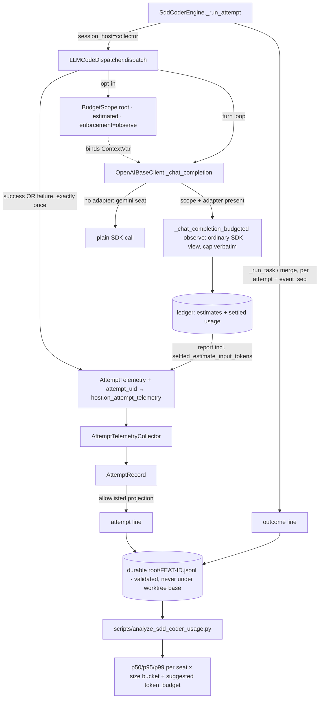

---
# SDD flow type and base branch (FEAT-145).
# - type: feature  (default)  → base_branch: dev (or any non-main branch)
# - type: hotfix              → base_branch MUST be: main
type: feature
base_branch: dev
---

# Feature Specification: Empirical Token-Budget Sizing for sdd-coder Bedrock Seats

**Feature ID**: FEAT-554
**Date**: 2026-09-12
**Author**: Jesus Lara / Claude
**Status**: draft
**Target version**: next development release after approval
**Source**: `sdd/proposals/sdd-coder-bedrock-token-telemetry.brainstorm.md` (Status: accepted, 12/12 questions resolved)
**Code baseline**: `10ecf45eb` on `dev`
**Identity**: `FEAT-554`, allocated by `python -m scripts.sdd.reserve_ids --kind feature` (ledger commit published separately)

---

## 1. Motivation & Business Requirements

### Problem Statement

FEAT-550 gave `AbstractClient`/`AbstractBot` a cumulative per-question
`token_budget` covering Bedrock Converse and Bedrock Mantle. FEAT-549 runs the
`sdd-coder` agent on those same Mantle seats (`qwen` →
`qwen.qwen3-coder-480b-a35b-instruct`). **Nobody can pick a number for
`token_budget` on a coding seat, because nothing measures what a coding attempt
actually consumes.**

A coding attempt is not a chat question. It is a loop of up to `max_turns`
rounds — **60** on the MCP roster path (`DEFAULT_LLM_MAX_TURNS`,
`agent_builder.py:134`), not the `LLMCodeDispatchProfile` default of 24 — each
one re-sending the full history. Consumption is therefore dominated by *input*
and is roughly quadratic in turn count. Measured on 2026-09-12
(`artifacts/logs/sdd-coder-count-input-overhead-20260912.md`): a 60-turn attempt
whose history grows to 148k tokens consumes a cumulative **≈4.7M tokens**
(≈5.1M if every turn hits the 8,192 output cap). An operator who reads
`token_budget` as a context-window figure and sets 200,000 would kill every
attempt around turn 11.

What exists today falls short in specific, verified ways:

- Per-attempt usage **is** collected — `AttemptTelemetryCollector`
  (`sdd_coder/engine.py:91-136`) folds the `dispatch.completed` payload built by
  `LLMCodeDispatcher._completion_usage_payload` (`dispatchers/llm.py:584-617`)
  into `AttemptRecord.usage` (`sdd_coder/models.py:115-127`).
- It **is** written to disk — `SddCoderEngine._journal`
  (`sdd_coder/engine.py:472-488`) snapshots the whole `CoderJob` to
  `<worktree>/.sdd-coder/jobs/<job_id>.json`.

But that journal **dies with the feature worktree** (`/sdd-done` runs
`git worktree remove`), so the successful features are exactly the ones missing
from any sample; it is keyed by job rather than task; it carries no per-turn
detail, no task-size correlate and no outcome-linked view; and it reads nothing
from the FEAT-550 ledger, so it cannot show how far the `estimated` admission
mode diverges from what the provider bills.

### Goals

1. Bind **one** root `BudgetScope` around the whole turn loop of
   `LLMCodeDispatcher.dispatch`, so one coding attempt is one budgeted
   "question" rather than 60 independent ones.
2. Instrument without changing behaviour, **structurally rather than by
   hoping a ceiling is large enough**: an observational (non-enforcing) ledger
   mode that never recomputes the output cap and never swaps the SDK client
   view, so cap preservation and retry preservation are properties of the code
   path rather than of a chosen number. Opt-in activation; telemetry failures
   never alter a dispatch result.
3. Record **both** accountings side by side — the provider's accumulated
   `CompletionUsage` and the ledger's estimated admission — so their difference
   becomes the measured calibration signal for a safety margin.
4. Persist a durable, outcome-linked, privacy-safe per-attempt dataset that
   survives worktree removal.
5. Capture at attempt time everything the analysis needs later, including the
   declared-file count, which becomes unreadable once the worktree is gone.
6. Record a failed attempt's consumption too — the degenerate tail is data.
7. Ship the analysis that turns the dataset into a recommended `token_budget`
   per seat × task-size segment, refusing to recommend on a thin sample.

### Non-Goals (explicitly out of scope)

- **Enforcing** a real ceiling on a coding seat. This feature measures; the
  ceiling it recommends is configured by a human afterwards.
- A budget adapter for `GeminiOpenAICompatClient`. Verified absent
  (`google/openai_compat.py:17` defines neither `budget_supported_methods` nor
  `budget_adapter_factory`), so the `gemini` seat is instrumented for provider
  totals only and serves as the unbudgeted comparison baseline. Building that
  adapter is FEAT-550 scope — design research S2, narrowing branch adopted.
- The `codex` (CLI) and `haiku` (native Claude Code sub-agent) seats. Their
  usage arrives by a different path; they produce no rows at all rather than
  rows with null tokens that would skew percentiles.
- A strict-mode qualification for Mantle. `MantleBudgetAdapter.count_input`
  raises `BudgetUnsupported` in `strict` mode (`amazon/budget.py:326-330`);
  observational mode uses `budget_mode="estimated"`.
- Unifying FEAT-550's tools-disabled finalization with `LLMCodeDispatcher`'s
  forced-`final_output` salvage (`dispatchers/llm.py:800-843`). Recorded as the
  follow-up this feature's dataset would justify.
- Pricing/cost computation, an HTML report, cross-machine aggregation, or a
  telemetry service. Journal harvesting of existing `.sdd-coder/jobs/*.json`
  was rejected as the primary mechanism — see brainstorm Option A; it remains a
  legitimate zero-cost day-0 sample.
- Per-round instrumentation via `ClientRoundEvent` as the transport — brainstorm
  Option C, rejected because it cannot observe the estimation error.
- Dispatcher-side tokenizer instrumentation with no ledger at all (raised while
  resolving the adversarial review): calling `count_input` from the turn loop
  would be perfectly non-interfering and need no FEAT-550 change, but it counts
  the dispatcher's view of the body rather than the exact wire body the funnel
  counts, and it validates nothing about the machinery that will actually
  enforce. Rejected — it would measure a different quantity than the one
  enforced, which is the failure this whole feature exists to avoid.
- Enforcing a real ceiling during a measurement campaign. Observational mode
  never denies; the recommended ceiling is configured by a human afterwards.

---

## 2. Architectural Design

### Overview

`LLMCodeDispatcher.dispatch`, when telemetry is enabled, creates one root
`BudgetScope` from the process-wide registry and holds it open across the entire
turn loop. Because `OpenAIBaseClient._chat_completion:262-264` consults
`current_budget_scope()` on every wire call, each turn is then counted and
reconciled by that one ledger for any client exposing a
`budget_adapter_factory` — today Mantle (`amazon/nova/mantle.py:93`). **The
machinery that would enforce is the machinery that measures**, so there is no
second accounting implementation to drift.

The scope is bound in a new **observational (non-enforcing) ledger mode**
(`TokenBudgetPolicy.enforcement="observe"`, Module 1). This is the design's
load-bearing decision, and it replaces this spec's first draft, which bound an
ordinary enforcing ledger under a deliberately huge ceiling and tried to prove
non-interference from `max_turns × max_tokens`. The adversarial review showed
that proof is unavailable (§10 R1-R2): neither field bounds input — a single
tool result can be an entire file (`dispatchers/llm.py:518`) — the loop makes an
extra salvage call after it ends (`llm.py:552`), each budgeted call permits three
physical attempts whose failures retain a full uncertain debit
(`openai_base.py:364,392`), and the cap is recomputed per request as
`min(max_output_tokens, available - estimate.input_tokens)`
(`clients/budget.py:145`), so accumulated consumption alone can shrink it.
Worse, the budgeted funnel swaps in `with_options(max_retries=0)`
(`openai_base.py:349`) while the ordinary funnel keeps the SDK default of 2
(`openai/_constants.py:8`), cutting the worst-case physical attempts per call
from nine to three — a provider that recovers on the fourth physical request
succeeds normally and fails under instrumentation.

In observational mode both problems disappear by construction rather than by
arithmetic: the ledger admits every request without consulting available funds,
returns `output_cap = max_output_tokens` verbatim so no cap is ever rewritten,
and the funnel keeps the **ordinary** SDK client view so the retry regime is
untouched. Per-physical-attempt exactness — the reason enforcing mode needs a
no-retry view — is not required when nothing can be denied; observational mode
settles from the usage the provider returns. Enforcing mode is completely
unchanged, and `enforcement` defaults to `"enforce"`.

Six corrections to the accepted brainstorm's stated mechanism, the first three
from the §9 design-research pass and the rest from the §10 adversarial review.
They are the substance of this design, not footnotes:

1. **Rich payload keys do not survive the session-state projection.**
   `action_from_dispatch_event` copies exactly seven whitelisted scalars out of
   `payload["usage"]` into `DispatchCompleted` (`session_state.py`, the
   `cls is DispatchCompleted` branch), and `DispatchCompleted` is a closed
   Pydantic model whose validation failure is swallowed by design
   (`dispatchers/_shared.py:118-124`). Widening `_completion_usage_payload`
   would therefore drop the per-turn series and the budget report **silently**.
   This feature adds an explicit, typed telemetry hook — `AttemptTelemetry`
   handed to the bound session host via an optional duck-typed
   `on_attempt_telemetry` method — and does not rely on unknown payload keys.
2. **`BudgetReport` does not expose the estimate.** `_report_locked`
   (`clients/budget.py:327-359`) reports `self._settled_input` — provider usage —
   and keeps `estimate.input_tokens` only inside each reservation. The estimation
   error, this feature's whole calibration premise, is therefore not computable
   from today's report. `QuestionBudget` gains accumulated estimated-admission
   totals, surfaced as **additive optional** `BudgetReport` fields so every
   existing FEAT-550 consumer is unaffected.
3. **A failed attempt loses every token it burned.** `dispatch.failed` carries
   `error_class`/`error_message` only (`dispatchers/llm.py:184-215`), and the
   collector reads usage solely from `DispatchCompleted`. The terminal telemetry
   hook therefore fires on **both** paths, exactly once per attempt, carrying
   whatever was accumulated before the failure.

4. **`(feature_id, task_id, attempt)` is not a unique key.** `_run_task`
   hard-codes `attempt=1` on every invocation (`sdd_coder/engine.py:592`),
   `run_chunk` rejects only tasks in a *currently running* job
   (`engine.py:620-623`), and every chunk gets a fresh job id
   (`sdd_coder/jobs.py:30`). A task re-dispatched in a later job — or by a second
   server process — reuses the same triple, so joining two attempts against two
   outcomes yields four rows. Every row therefore carries an `attempt_uid`
   minted per attempt, plus `job_id` as human-readable context, and the join is
   on `attempt_uid` alone.
5. **Consolidation is not an outcome event for every attempt.** When both
   attempts fail, `_run_task` returns at `engine.py:603-612` without calling
   `_consolidate` at all, so a failed attempt would have no outcome row; and
   `merge()` deliberately supports re-merging after a manual conflict repair
   (`engine.py:407`), so one attempt can legitimately produce a
   `merge_conflict` event and later a `merged` one. Outcome rows are therefore
   emitted by `_run_task` — which owns both exit paths and knows which attempt
   produced which result — and by `merge()`, each row carrying its
   `attempt_uid` and a monotonic `event_seq`. The analysis takes the
   highest-`event_seq` row per `attempt_uid` as effective.
6. **Released reservations are not estimation error.**
   `QuestionBudget.release_unspent` represents a request *proven not to have
   been dispatched* (`clients/budget.py:244-253`), so its estimate has no
   provider counterpart; summing it into the estimate total would manufacture
   error out of a request that never happened. The ledger therefore reports
   estimates for **settled reservations only**, with released and uncertain
   amounts as separate operational counters. Calibration additionally requires
   complete reporting: `llm.py:331-333` skips a round whose usage is missing
   while keeping the running subtotal, so a non-null aggregate is not proof of
   completeness — an attempt is calibration-eligible only when
   `accounting_complete` holds and no turn reported unknown usage.

The sink writes two append-only JSONL lines per attempt — `attempt` when the
attempt returns, `outcome` from `_run_task`/`merge` — into
`<durable root>/<FEAT-ID>.jsonl`, joined at analysis time on `attempt_uid`.
The durable root is resolved and validated at startup and **refused if it
resolves under the engine's worktree base path**, because the configured default
cannot be trusted to be durable on its own: `conf.BASE_DIR` comes from navconfig,
which resolves a virtualenv's parent directory (`navconfig/project.py:140`) or an
arbitrary `BASE_DIR`/`SITE_ROOT` override, so a feature checkout with its own
virtualenv would otherwise write telemetry inside the very worktree
`/sdd-done` deletes. Rows are built by a strict allowlist, never by serialising
`AttemptRecord` (whose `error` field holds a full exception string,
`engine.py:583`), and the line-size bound is enforced by the sink at write time —
the row types alone do not establish it.

### Component Diagram



### Integration Points

| Existing Component | Integration Type | Notes |
|---|---|---|
| `QuestionBudget` / `BudgetReport` | extends (additive) | Accumulated estimated admission; optional fields, defaults preserve every existing consumer |
| `LLMCodeDispatcher.dispatch` | modifies | Optional root scope around the loop; terminal telemetry on both exit paths |
| `OpenAIBaseClient._chat_completion` | depends on | Unchanged; the ContextVar branch at :262-264 is what makes per-turn metering work |
| `MantleBudgetAdapter` | depends on | Unchanged; exercised under long tool-heavy loops for the first time |
| `GeminiOpenAICompatClient` | depends on | Unchanged and deliberately unbudgeted — the comparison baseline |
| `AttemptTelemetryCollector` | modifies | Consumes the new typed hook in addition to `DispatchCompleted` |
| `AttemptRecord` | modifies | Carries the resolved model, turn series, both accountings, declared-file count |
| `SddCoderEngine` | extends | Validated telemetry root; writes `attempt` and `outcome` lines |
| `SddCoderToolkit` | modifies | Passes the telemetry root through from configuration |
| `parrot.conf` | extends | `SDD_CODER_TELEMETRY_DIR`, `DEV_LOOP_CODER_TELEMETRY`, `DEV_LOOP_CODER_LEDGER` |
| `scripts/` | new file | `analyze_sdd_coder_usage.py` |
| `docs/dev_loop/sdd-coder-orchestrator.md` | modifies | Telemetry section: campaign workflow and the millions-not-thousands warning |

No breaking changes. No new runtime dependency (`tiktoken` and `pandas` are
already present). A run that sets no environment variable behaves bit-identically
to today.

### Data Models

```python
# packages/ai-parrot/src/parrot/flows/dev_loop/models/telemetry.py  (new)

class TurnUsage(BaseModel):
    """One turn's reported usage inside a coding-agent loop.

    Token fields are nullable because `_extract_usage` returns ``None`` when a
    provider reports no usage for a round (verified: dispatchers/llm.py:1089),
    and the loop keeps going. A turn recorded with ``None`` is a KNOWN GAP, not
    a zero: it is counted in `turns_with_unknown_usage` and makes the attempt
    calibration-ineligible (§10 R5-R6).
    """

    round_number: int = Field(..., ge=1)
    input_tokens: Optional[int] = Field(None, ge=0)
    output_tokens: Optional[int] = Field(None, ge=0)


class AttemptTelemetry(BaseModel):
    """Terminal telemetry for ONE dispatch attempt, success or failure.

    Handed to the bound session host through its optional
    ``on_attempt_telemetry`` method — never through a ``dispatch.completed``
    payload key, which `action_from_dispatch_event` would silently drop
    (design research S3).
    """

    resolved_model: str = Field("", max_length=200)
    turns: int = Field(0, ge=0)
    terminal: Literal["completed", "failed", "salvaged"] = "completed"
    error_class: str = Field("", max_length=120)
    provider_input_tokens: Optional[int] = Field(None, ge=0)
    provider_output_tokens: Optional[int] = Field(None, ge=0)
    turn_series: List[TurnUsage] = Field(default_factory=list, max_length=MAX_TURN_SERIES)
    turns_with_unknown_usage: int = Field(0, ge=0)
    budget_report: Optional[Dict[str, Any]] = None


# packages/ai-parrot/src/parrot/flows/dev_loop/sdd_coder/telemetry.py  (new)

class AttemptUsageRow(BaseModel):
    """The `attempt` JSONL line. Counters, ids and timings ONLY (design research S5)."""

    kind: Literal["attempt"] = "attempt"
    ts: str
    attempt_uid: str = Field(..., min_length=8, max_length=64)
    """Globally unique per attempt. THE join key — `(feature_id, task_id,
    attempt)` collides across jobs (§10 R3)."""
    job_id: str = Field("", max_length=64)
    feature_id: str = Field(..., max_length=64)
    task_id: str = Field(..., max_length=64)
    attempt: int = Field(..., ge=1, le=3)
    seat_label: str = Field("", max_length=32)
    backend: str = Field("", max_length=32)
    configured_model: str = Field("", max_length=200)
    resolved_model: str = Field("", max_length=200)
    duration_s: float = 0.0
    turns: int = 0
    terminal: str = Field("completed", max_length=16)
    error_class: str = Field("", max_length=120)
    declared_files: Optional[int] = None       # captured at attempt time (S8)
    declared_files_known: bool = False
    provider_input_tokens: Optional[int] = None
    provider_output_tokens: Optional[int] = None
    ledger_input_tokens: Optional[int] = None
    ledger_output_tokens: Optional[int] = None
    ledger_settled_estimate_input_tokens: Optional[int] = None
    """Estimates of SETTLED reservations only — the only ones with a provider
    counterpart (§10 R5)."""
    ledger_released_estimate_tokens: Optional[int] = None
    ledger_uncertain_tokens: Optional[int] = None
    ledger_overrun_tokens: Optional[int] = None
    ledger_counting_methods: List[str] = Field(default_factory=list)
    ledger_accounting_complete: Optional[bool] = None
    enforcement: str = Field("observe", max_length=16)
    turns_with_unknown_usage: int = 0
    calibration_eligible: bool = False
    """True only when accounting is complete AND every turn reported usage."""
    turn_series: List[Tuple[int, Optional[int], Optional[int]]] = Field(default_factory=list)
    """`(round, input|None, output|None)`. NOT `List[List[int]]` — that rejects
    a turn with unknown usage, which the transport explicitly allows (§10 R6)."""


class OutcomeRow(BaseModel):
    """The `outcome` JSONL line, joined to its attempt by (feature_id, task_id, attempt)."""

    kind: Literal["outcome"] = "outcome"
    ts: str
    attempt_uid: str = Field(..., min_length=8, max_length=64)
    job_id: str = Field("", max_length=64)
    feature_id: str = Field(..., max_length=64)
    task_id: str = Field(..., max_length=64)
    attempt: int = Field(..., ge=1, le=3)
    event_seq: int = Field(..., ge=1)
    """Monotonic per `attempt_uid`. One attempt can legitimately emit several
    outcomes — `merge_conflict` then `merged` after a manual repair
    (engine.py:407). The HIGHEST seq is effective (§10 R4)."""
    outcome: str = Field(..., max_length=32)    # TaskOutcome value
    conflict_file_count: int = 0
    unexpected_file_count: int = 0
```

### New Public Interfaces

```python
# parrot/flows/dev_loop/sdd_coder/telemetry.py
class CoderTelemetrySink:
    """Append-only per-feature JSONL writer for sdd-coder attempt telemetry."""

    def __init__(self, root: str | Path, *, enabled: bool = True) -> None: ...
    async def write_attempt(self, row: AttemptUsageRow) -> None: ...
    async def write_outcome(self, row: OutcomeRow) -> None: ...

def resolve_durable_root(configured: str | None, *, worktree_base_path: str) -> Path:
    """Resolve and VALIDATE the telemetry root, or raise.

    Order: an explicit absolute `configured` value wins; otherwise the main
    checkout is derived from `git rev-parse --path-format=absolute
    --git-common-dir` (which points at the main repository's `.git` even when
    called inside a linked worktree). A root that resolves under
    *worktree_base_path* is REFUSED — telemetry inside a disposable worktree
    contradicts the durability requirement, and `conf.BASE_DIR` cannot be
    trusted to avoid it (navconfig resolves a virtualenv's parent, or an
    arbitrary BASE_DIR/SITE_ROOT override — navconfig/project.py:129-161).
    """

def feature_file_name(feature_id: str) -> str:
    """Filename-safe `<FEAT-ID>.jsonl`; raises ValueError on an unsafe id (S6)."""

def build_attempt_row(
    record: AttemptRecord, *, feature_id: str, job_id: str, declared_files: int | None
) -> AttemptUsageRow:
    """Allowlisted projection — never a wholesale AttemptRecord dump (S5).

    Sets `calibration_eligible` = `ledger_accounting_complete and
    turns_with_unknown_usage == 0` (§10 R5-R6).
    """
```

---

## 3. Module Breakdown

#### Delegation-eligible modules

| Module | Eligible? | Decided patterns / exact contracts | Why not (if no) |
|---|---|---|---|
| M1: Ledger estimate accounting | yes | Additive optional `BudgetReport` fields with defaults; accumulate on settle/release in `QuestionBudget`; no signature change to `reserve()`/`report()` | — |
| M2: Typed telemetry transport | yes | `AttemptTelemetry`/`TurnUsage` exactly as in §2; hook name `on_attempt_telemetry`; `getattr(host, ..., None)` guard; fires exactly once | — |
| M3: Observational scope binding | no | The `observe` semantics (no cap recomputation, ordinary SDK view, settle-from-usage) are decided in §2; what remains is judgement about the funnel branch | Touches the FEAT-550 funnel; a wrong branch silently perturbs the runs being measured |
| M4: Telemetry sink + engine wiring | yes | Row models fixed in §2; single pre-serialized `os.write` on an `O_APPEND` fd; `MAX_LINE_BYTES` = 8192 checked at write time; per-feature file keyed by `attempt_uid` | — |
| M5: Analysis script | yes | n≥12 gate; buckets `1-2 / 3-4 / 5+`; p50/p95/p99; margin from measured estimation error | — |
| M6: Docs | yes | Section content dictated by §1 and §7 | — |

### Module 1: Observational mode and settled-estimate accounting
- **Path**: `packages/ai-parrot/src/parrot/models/token_budget.py`, `packages/ai-parrot/src/parrot/clients/budget.py`, `packages/ai-parrot/src/parrot/clients/openai_base.py`
- **Responsibility**: (a) add a non-enforcing ledger mode that counts without ever denying or rewriting an output cap; (b) make the *settled* estimate observable so estimation error is measurable. Additive: `enforcement` defaults to `"enforce"` and every existing FEAT-550 path is untouched.
- **Depends on**: existing FEAT-550 ledger
- **Interface Skeleton**:
  ```python
  # parrot/models/token_budget.py  (modifies parrot/models/token_budget.py:25)
  class TokenBudgetPolicy(BaseModel):
      # ... existing fields unchanged (verified: parrot/models/token_budget.py:30-32)
      enforcement: Literal["enforce", "observe"] = "enforce"
      """`observe` = account without ever denying or resizing an output cap.

      In `observe` the ledger admits every request without consulting available
      funds and returns `output_cap = max_output_tokens` verbatim, so
      `openai_base.py:388`'s assignment is a no-op rather than a resize. Defaults
      to `enforce`; every pre-FEAT-554 policy keeps today's behaviour exactly.
      """

  # parrot/models/token_budget.py  (modifies parrot/models/token_budget.py:110)
  class BudgetReport(BaseModel):
      # ... existing fields unchanged (verified: parrot/models/token_budget.py:115-133)
      settled_estimate_input_tokens: int = Field(0, ge=0)
      """Sum of admission estimates for SETTLED reservations only.

      `settled_estimate_input_tokens - input_tokens` is the estimation error of
      `budget_mode="estimated"`. Released reservations are excluded on purpose:
      `release_unspent` means the request was proven never dispatched
      (verified: parrot/clients/budget.py:244), so its estimate has no provider
      counterpart and would fabricate error (§10 R5).
      """
      released_estimate_tokens: int = Field(0, ge=0)
      """Operational counter, NOT part of the calibration comparison."""
      estimate_methods: tuple[str, ...] = ()
      """Distinct `TokenEstimate.method` values seen (e.g. `("tiktoken:o200k_base",)`)."""

  # parrot/clients/budget.py  (modifies parrot/clients/budget.py:117 and :327)
  class QuestionBudget:
      async def reserve(self, estimate: TokenEstimate, *, max_output_tokens: int,
                        min_output_tokens: int, call_id: str, round_number: int,
                        attempt_number: int, phase: ReservationPhase) -> BudgetReservation:
          """Unchanged signature. Under `enforcement="observe"` it never denies,
          never transitions to draining/finalizing, and sets
          `output_cap = max_output_tokens` without the
          `available - estimate.input_tokens` computation (verified:
          parrot/clients/budget.py:145).
          """

      def _report_locked(self) -> BudgetReport:  # verified: parrot/clients/budget.py:327
          """Unchanged contract; now also reports settled/released estimate totals."""

  # parrot/clients/openai_base.py  (modifies parrot/clients/openai_base.py:334)
  async def _chat_completion_budgeted(self, scope, *, model, messages, use_tools, stream, **kwargs):
      """Under `enforcement="observe"`, use `self.client` as-is instead of
      `with_options(max_retries=0)` (verified: parrot/clients/openai_base.py:349)
      and settle from the returned usage.

      The no-retry view exists so enforcing mode can reserve per PHYSICAL
      attempt; nothing can be denied in observe mode, so that exactness buys
      nothing and costs the run its retry budget — up to nine physical attempts
      on the ordinary path versus three (§10 R2).
      """
  ```

### Module 2: Typed telemetry transport
- **Path**: `packages/ai-parrot/src/parrot/flows/dev_loop/models/telemetry.py` (new), `packages/ai-parrot/src/parrot/flows/dev_loop/dispatchers/llm.py`
- **Responsibility**: Carry per-turn series, resolved model and budget report from the dispatch loop to the bound session host without passing through the lossy `DispatchCompleted` projection. Fire exactly once per attempt, on success and on failure.
- **Depends on**: Module 1
- **Interface Skeleton**:
  ```python
  # parrot/flows/dev_loop/models/telemetry.py  (new)
  MAX_TURN_SERIES: int = 101
  """Every turn a loop can possibly take: `max_turns` is capped at 100
  (verified: parrot/flows/dev_loop/models/llm.py:23) plus the one post-loop
  salvage call (`llm.py:552`). Chosen to never truncate rather than as a
  size heuristic; the line budget is sized to fit it (M4).
  """

  class TurnUsage(BaseModel): ...        # fields per §2 Data Models
  class AttemptTelemetry(BaseModel): ...  # fields per §2 Data Models

  # parrot/flows/dev_loop/dispatchers/llm.py  (modifies parrot/flows/dev_loop/dispatchers/llm.py:274)
  class LLMCodeDispatcher:
      def _emit_attempt_telemetry(self, telemetry: AttemptTelemetry) -> None:
          """Hand terminal telemetry to the bound session host, once.

          Reads the host from `_SESSION_HOST_CTX` (verified:
          parrot/flows/dev_loop/dispatchers/_shared.py:64) and calls its optional
          `on_attempt_telemetry`; a host without that method is a no-op. Every
          exception is swallowed and logged at DEBUG — telemetry must never change
          a dispatch result.
          """
  ```

### Module 3: Observational scope binding
- **Path**: `packages/ai-parrot/src/parrot/flows/dev_loop/dispatchers/llm.py`, `packages/ai-parrot/src/parrot/conf.py`
- **Responsibility**: Open one root observational budget scope around the whole turn loop when opted in, and stamp the resolved model. Non-interference comes from Module 1's `observe` semantics, not from ceiling arithmetic.
- **Depends on**: Module 2
- **Interface Skeleton**:
  ```python
  # parrot/conf.py  (modifies parrot/conf.py:828 neighbourhood — same relative/absolute rule)
  DEV_LOOP_CODER_TELEMETRY: bool = config.getboolean("DEV_LOOP_CODER_TELEMETRY", fallback=False)
  """Master switch. False = no scope bound, no rows written, no new payload."""
  DEV_LOOP_CODER_LEDGER: bool = config.getboolean("DEV_LOOP_CODER_LEDGER", fallback=True)
  """With telemetry on: bind the observational ledger (True) or record provider
  totals only (False). There is NO ceiling knob — observational mode admits
  everything, so a number would be decoration. `token_budget` is still required
  by `TokenBudgetPolicy` and is set to the measured campaign reference value
  purely so the report's remaining-* fields stay meaningful; it can never deny.

  For sizing a REAL ceiling later: a coding attempt's cumulative question total
  is measured in MILLIONS (≈4.7M for 60 turns;
  artifacts/logs/sdd-coder-count-input-overhead-20260912.md), NOT in
  context-window units.
  """
  SDD_CODER_TELEMETRY_DIR: str = config.get("SDD_CODER_TELEMETRY_DIR", fallback="")
  """Absolute durable directory for the dataset, or empty to derive the main
  checkout at startup. Deliberately NOT defaulted through `BASE_DIR`: navconfig
  resolves a virtualenv's parent or an arbitrary override
  (navconfig/project.py:129-161), so a feature checkout with its own virtualenv
  would put the dataset inside the worktree `/sdd-done` deletes (§10 R7).
  """

  # parrot/flows/dev_loop/dispatchers/llm.py  (modifies parrot/flows/dev_loop/dispatchers/llm.py:274)
  class LLMCodeDispatcher:
      @staticmethod
      def _observational_policy(profile: LLMCodeDispatchProfile) -> Optional[TokenBudgetPolicy]:
          """Build the observational policy, or None when the ledger is disabled.

          `enforcement="observe"`, `budget_mode="estimated"` (Mantle has no strict
          qualification — verified: amazon/budget.py:326-330), and
          `final_answer_reserve=0` because an observational ledger never
          finalizes: reserving a partition of an unenforced ceiling would be
          meaningless, and the 0.15 default would only distort the report's
          remaining-* fields.

          There is deliberately no `_min_safe_ceiling`: the first draft tried to
          derive a provably non-binding ceiling from `max_turns`/`max_tokens`, and
          neither bounds input, salvage, retries or uncertain debits (§10 R1).
          """
  ```

### Module 4: Telemetry sink and engine wiring
- **Path**: `packages/ai-parrot/src/parrot/flows/dev_loop/sdd_coder/telemetry.py` (new), `sdd_coder/engine.py`, `sdd_coder/models.py`, `sdd_coder/toolkit.py`
- **Responsibility**: Durable, privacy-safe, per-feature JSONL rows keyed by a unique attempt id; one outcome event per attempt from the paths that actually own each exit; capture the declared-file count while the task file still exists; consume the M2 hook.
- **Depends on**: Module 2
- **Interface Skeleton**:
  ```python
  # parrot/flows/dev_loop/sdd_coder/telemetry.py  (new)
  MAX_LINE_BYTES: int = 8192
  """Upper bound for one serialized row, checked at write time.

  Measured worst case with every string field at `max_length` and a full
  101-turn series: **~3.6 KB** (probe, 2026-09-12; 120 turns gives 3,924 B).
  8 KB leaves room for a future field instead of the 172-byte margin a
  4,096-byte budget would have left.

  The bound is NOT a PIPE_BUF atomicity requirement — that 4,096-byte figure
  applies to pipes, not regular files. POSIX requires the seek-to-end and
  write of an `O_APPEND` write to a regular file to be atomic with respect to
  other appenders, so a single `os.write()` of any size keeps lines whole on a
  local filesystem. The budget exists to keep every row one bounded syscall
  and to fail loudly if a row ever grows unexpectedly.
  """

  class AttemptUsageRow(BaseModel): ...   # fields per §2 Data Models
  class OutcomeRow(BaseModel): ...        # fields per §2 Data Models

  class CoderTelemetrySink:
      """One append-only file per feature under a validated root."""

      def __init__(self, root: str | Path, *, enabled: bool = True) -> None: ...
      async def write_attempt(self, row: AttemptUsageRow) -> None:
          """Serialize, assert <= MAX_LINE_BYTES, then ONE os.write to an O_APPEND fd.

          Runs the blocking write through `asyncio.to_thread` (the S11 pattern
          `_journal` follows — verified: parrot/flows/dev_loop/sdd_coder/engine.py:472).
          Never raises: a telemetry failure is logged at WARNING once and dropped.
          """
      async def write_outcome(self, row: OutcomeRow) -> None: ...

  # parrot/flows/dev_loop/sdd_coder/models.py  (modifies parrot/flows/dev_loop/sdd_coder/models.py:115)
  class AttemptRecord(BaseModel):
      # ... existing fields unchanged (verified: sdd_coder/models.py:117-127)
      attempt_uid: str = ""
      """uuid4 hex minted in `_run_attempt`; the telemetry join key (§10 R3)."""
      job_id: str = ""
      resolved_model: str = ""
      turns: int = 0
      terminal: str = "completed"
      error_class: str = ""
      declared_files: Optional[int] = None
      declared_files_known: bool = False
      turns_with_unknown_usage: int = 0
      turn_series: List[Tuple[int, Optional[int], Optional[int]]] = Field(default_factory=list)
      budget_report: Dict[str, Any] = Field(default_factory=dict)

  # parrot/flows/dev_loop/sdd_coder/engine.py  (modifies parrot/flows/dev_loop/sdd_coder/engine.py:149)
  class AttemptTelemetryCollector:
      def on_attempt_telemetry(self, telemetry: AttemptTelemetry) -> None:
          """Absorb the M2 payload (verified hook site: dispatchers/_shared.py:64)."""

  class SddCoderEngine:
      def __init__(self, *, roster: RosterConfig, telemetry_dir: Optional[str] = None, ...) -> None:
          """`telemetry_dir` is resolved through `resolve_durable_root(...)`.

          The engine knows only `worktree_base_path` (verified:
          sdd_coder/engine.py:162) and so has no main-repository root to infer one
          from (design research S6) — but it CAN reject a bad one, and does: a
          root under `self._base_path` raises, the same containment reasoning
          `_resolve_feature` already applies to worktrees (engine.py:193).
          """

      async def _write_outcome(self, ctx, *, record: AttemptRecord, outcome: str,
                               conflict_files: int = 0, unexpected_files: int = 0) -> None:
          """Emit ONE outcome row for the attempt that produced *outcome*.

          Called from `_run_task` — which owns both the both-attempts-failed
          return (verified: engine.py:603-612, which never reaches
          `_consolidate`) and the consolidated success path — and from `merge()`,
          whose documented re-merge after a manual conflict repair
          (engine.py:407) legitimately adds a later event for the same attempt.
          `event_seq` increments per `attempt_uid`; the analysis takes the
          highest (§10 R4).
          """
  ```

### Module 5: Analysis script
- **Path**: `scripts/analyze_sdd_coder_usage.py` (new)
- **Responsibility**: Join, filter, bucket, report, and recommend — or refuse.
- **Depends on**: Module 4
- **Interface Skeleton**:
  ```python
  # scripts/analyze_sdd_coder_usage.py  (new)
  MIN_SAMPLES: int = 12
  """Below this many merged attempts a segment gets percentiles but NO recommendation."""

  SIZE_BUCKETS: tuple[tuple[str, int, int], ...] = (("1-2", 1, 2), ("3-4", 3, 4), ("5+", 5, 10**6))

  def load_rows(root: Path) -> "pandas.DataFrame":
      """Glob `<root>/*.jsonl`, parse, and join attempt+outcome on `attempt_uid`.

      - An `outcome` line with no matching `attempt` line is reported as an
        incomplete pair and EXCLUDED — never treated as zero tokens.
      - Several outcome rows per `attempt_uid` are expected (conflict then
        re-merge); the highest `event_seq` wins (§10 R4).
      - A duplicate `attempt_uid` among attempt rows is a bug, not a retry:
        report it and drop the file rather than silently averaging.
      """

  def recommend(df: "pandas.DataFrame") -> "pandas.DataFrame":
      """Per (seat, size bucket): n, p50/p95/p99 total, median estimation error, suggested ceiling.

      Estimation error uses `ledger_settled_estimate_input_tokens -
      ledger_input_tokens` and is computed ONLY over rows with
      `calibration_eligible=True`; token percentiles may use every merged row.
      The two sample counts are reported separately, because an attempt can be a
      valid consumption sample and an invalid calibration sample (§10 R5). Each
      recommended ceiling is printed together with the absolute
      `final_answer_reserve` (`2 x max_tokens`) that should accompany it, so the
      operator configures both at once (§7).
      """
  ```

### Module 6: Documentation
- **Path**: `docs/dev_loop/sdd-coder-orchestrator.md`
- **Responsibility**: Replace the existing "Telemetry" section with the campaign workflow, the row schema, and the millions-not-thousands warning.
- **Depends on**: Modules 1-5

---

## 4. Test Specification

### Unit Tests

| Test | Module | Description |
|---|---|---|
| `test_observe_never_denies` | M1 | With `enforcement="observe"` and a ceiling far below demand, `reserve()` still admits and never transitions to draining/finalizing |
| `test_observe_returns_cap_verbatim` | M1 | `reservation.output_cap == max_output_tokens` regardless of accumulated consumption — the `available - estimate` path is not taken |
| `test_enforce_mode_unchanged` | M1 | Every existing FEAT-550 ledger test still passes with the default `enforcement="enforce"` |
| `test_observe_keeps_ordinary_sdk_view` | M1 | In observe mode the funnel does NOT call `with_options(max_retries=0)`; in enforce mode it still does |
| `test_settled_estimate_excludes_released` | M1 | A released reservation's estimate lands in `released_estimate_tokens`, never in `settled_estimate_input_tokens` |
| `test_report_defaults_backward_compatible` | M1 | A `BudgetReport` constructed without the new fields validates, with `0` / `()`; a `TokenBudgetPolicy` without `enforcement` defaults to `"enforce"` |
| `test_attempt_telemetry_model_caps_series` | M2 | `turn_series` longer than `MAX_TURN_SERIES` is rejected |
| `test_turn_series_accepts_unknown_usage` | M2/M4 | `(7, None, None)` round-trips through `AttemptTelemetry`, `AttemptRecord` and `AttemptUsageRow` — the `List[List[int]]` of the first draft rejected it |
| `test_unknown_usage_blocks_calibration` | M4 | One turn with `None` usage sets `turns_with_unknown_usage=1` and `calibration_eligible=False` while still recording totals |
| `test_emit_telemetry_noop_without_hook` | M2 | A session host lacking `on_attempt_telemetry` is a no-op, dispatch result unchanged |
| `test_emit_telemetry_swallows_exception` | M2 | A hook that raises does not propagate and does not change the dispatch result |
| `test_observational_policy_shape` | M3 | `enforcement="observe"`, `budget_mode="estimated"`, `final_answer_reserve == 0` |
| `test_telemetry_disabled_binds_no_scope` | M3 | With the env unset, `current_budget_scope()` is `None` inside the loop |
| `test_ledger_disabled_records_provider_only` | M3 | `DEV_LOOP_CODER_LEDGER=False` writes rows with `ledger_*` absent and binds no scope |
| `test_row_projection_excludes_error_text` | M4 | `build_attempt_row` carries `error_class` and never the `error` string or diagnostics |
| `test_feature_file_name_rejects_unsafe_id` | M4 | `../`, `/`, and empty ids raise `ValueError` |
| `test_resolve_durable_root_refuses_worktree_path` | M4 | A configured root under `worktree_base_path` raises; a root outside it is accepted |
| `test_resolve_durable_root_derives_main_checkout` | M4 | With no configuration, the root derives from `git rev-parse --git-common-dir` and lands in the main checkout even when called from a linked worktree |
| `test_attempt_uid_unique_across_jobs` | M4 | Two `_run_task` invocations for the same task in different jobs both produce `attempt=1` but distinct `attempt_uid`s |
| `test_row_fits_line_budget` | M4 | A worst-case row — every string field at `max_length`, full 101-turn series — serializes to `<= MAX_LINE_BYTES`, asserted against the measured size |
| `test_sink_never_raises` | M4 | An unwritable root logs once and returns; no exception reaches the caller |
| `test_declared_files_captured_at_attempt_time` | M4 | The count is taken from the task file during the attempt, and `declared_files_known` is `False` when unreadable |
| `test_analysis_refuses_thin_segment` | M5 | A segment with 11 merged attempts prints percentiles and no recommendation; 12 produces one |
| `test_analysis_excludes_orphan_outcome` | M5 | An `outcome` row with no `attempt` row is counted as incomplete, not as zero |
| `test_analysis_takes_latest_outcome_event` | M5 | `merge_conflict` (seq 1) followed by `merged` (seq 2) for one `attempt_uid` resolves to `merged`, counted once |
| `test_analysis_separates_calibration_sample` | M5 | Consumption percentiles and estimation-error statistics report independent `n` values |

### Integration Tests

| Test | Description |
|---|---|
| `test_observational_scope_spans_every_turn` | A fake budget-capable client records one `operation_id` across all turns of a multi-turn loop — not one per turn |
| `test_observe_preserves_max_tokens_under_pressure` | With cumulative consumption far past the nominal ceiling AND oversized tool results, every request's output cap still equals `profile.max_tokens` — the first draft's failure mode (§10 R1) |
| `test_observe_preserves_retry_regime` | A client failing the first three physical requests with a retryable error succeeds identically with telemetry on and off; the ordinary and observed paths make the same number of physical requests (§10 R2) |
| `test_salvage_call_is_metered_not_denied` | The post-loop salvage call (`llm.py:552`) is counted and never refused |
| `test_failed_attempt_reports_partial_usage` | A loop that raises mid-way still produces exactly one `AttemptTelemetry` with the tokens burned so far |
| `test_attempt_and_outcome_rows_join` | An engine-level run writes one `attempt` and one `outcome` line that join on `attempt_uid` |
| `test_both_attempts_failed_have_outcomes` | A task failing on both seats writes two `attempt` rows and two `failed` `outcome` rows — the path that never reaches `_consolidate` |
| `test_failed_then_merged_attributes_per_attempt` | Attempt 1 `failed`, attempt 2 `merged`: each outcome attaches to its own `attempt_uid`, never both |
| `test_conflict_then_remerge_emits_two_events` | A `merge_conflict` then a repaired `merge()` produce two outcome rows with increasing `event_seq` for one `attempt_uid` |
| `test_concurrent_appends_stay_valid_json` | N concurrent writers to one feature file produce N lines, every one parseable |
| `test_gemini_seat_rows_have_no_ledger_fields` | The unbudgeted seat yields provider totals with `ledger_*` absent — not zeros |

### Test Data / Fixtures

```python
@pytest.fixture
def budget_capable_fake_client():
    """OpenAI-shaped fake exposing `budget_adapter_factory` + `_chat_completion`,
    so the dispatcher exercises the real budgeted funnel.

    Existing dispatcher fakes have no budget hooks (design research S10):
    packages/ai-parrot/tests/flows/dev_loop/test_llm_code_dispatcher.py
    """

@pytest.fixture
def telemetry_root(tmp_path):
    """Isolated telemetry root; never the repository's artifacts/logs/."""
```

---

## 5. Acceptance Criteria

> This feature is complete when ALL of the following are true:

- [ ] AC-1: With no environment variable set, a dispatch is byte-identical to today: no scope bound, no rows written, no new payload keys.
- [ ] AC-2: With the observational scope enabled, all turns of one attempt — including the post-loop salvage call — share one ledger `operation_id`.
- [ ] AC-3: Every observed request's effective output cap equals `profile.max_tokens` — proven by `enforcement="observe"` returning `max_output_tokens` verbatim, and tested under cumulative consumption past the nominal ceiling with oversized tool results, not by ceiling arithmetic.
- [ ] AC-4: Observational mode preserves the retry regime: the same number of physical requests with telemetry on and off, and a transient failure that recovers on the fourth physical request succeeds in both. `enforcement="enforce"` keeps the no-retry view unchanged.
- [ ] AC-5: `BudgetReport.settled_estimate_input_tokens` covers settled reservations only; released estimates appear in `released_estimate_tokens` and never in the calibration comparison; a report built without the new fields still validates, and `TokenBudgetPolicy` without `enforcement` defaults to `"enforce"`.
- [ ] AC-6: A failed or timed-out attempt yields exactly one `AttemptTelemetry` carrying the tokens burned before the failure — never zero, never two.
- [ ] AC-7: No JSONL row contains prompt text, tool arguments, file contents, an exception message, or diagnostics — `error_class` only. Verified by an allowlist test, not by inspection.
- [ ] AC-8: `declared_files` is captured during the attempt and survives worktree removal; `declared_files_known=False` when the task file was unreadable.
- [ ] AC-9: Rows land in `<durable root>/<FEAT-ID>.jsonl`; an unsafe `feature_id` is rejected; the root is either an explicit absolute path or derived from `git rev-parse --git-common-dir`, is validated at startup, and **raises when it resolves under `worktree_base_path`** — `conf.BASE_DIR` is never used as the default.
- [ ] AC-10: A worst-case row (every string field at `max_length`, full 101-turn series) is `<= MAX_LINE_BYTES` and written with one `os.write` on an `O_APPEND` fd; N concurrent writers produce N parseable lines. The test asserts the measured size, so a future field that pushes a row over the budget fails the suite rather than being dropped at runtime.
- [ ] AC-11: Any telemetry failure (unwritable root, hook exception, oversized row) logs and drops, and never changes a dispatch or merge outcome.
- [ ] AC-12: Every row carries a unique `attempt_uid` and the join is on it alone; two invocations for the same task in different jobs both numbered `attempt=1` remain distinguishable; an orphan `outcome` is reported as incomplete, never as zero tokens; a duplicate `attempt_uid` among attempt rows is reported as a bug, never averaged.
- [ ] AC-13: The analysis script reports p50/p95/p99 and median estimation error per (seat × size bucket), and withholds a recommendation below 12 merged attempts.
- [ ] AC-14: `resolved_model` is the dispatcher-resolved model (`_resolve_model`), recorded alongside the roster's `configured_model`, and the two may differ.
- [ ] AC-15: The `gemini` seat produces rows with provider totals and absent `ledger_*` fields; the spec's coverage claim is stated as Mantle-only.
- [ ] AC-16: `pytest packages/ai-parrot/tests/flows/dev_loop/ packages/ai-parrot-client-amazon/tests/unit/test_token_budget_mantle.py -q` passes.
- [ ] AC-17: `ruff check .` clean on every changed file.
- [ ] AC-18: `docs/dev_loop/sdd-coder-orchestrator.md` documents the campaign workflow and states that a coder attempt's cumulative budget is millions of tokens, not context-window sized.
- [ ] AC-19: Every attempt gets exactly one outcome row per outcome event, emitted from the path that owns it: both-attempts-failed (which never reaches `_consolidate`), failed-then-merged (attributed per attempt, never to both), and conflict-then-re-merge (two rows, increasing `event_seq`, highest effective).
- [ ] AC-20: A turn whose usage the provider did not report round-trips as `(round, None, None)`, increments `turns_with_unknown_usage`, and sets `calibration_eligible=False` without discarding the row or inventing a zero.
- [ ] AC-21: The analysis reports consumption-sample `n` and calibration-sample `n` separately, and computes estimation error only over `calibration_eligible` rows.
- [ ] AC-22: The `MAX_LINE_BYTES` bound is enforced by the sink at write time; the row models additionally bound every string field, but the runtime check is the authority. An oversized row is logged and dropped, never truncated into invalid JSON.
- [ ] AC-23: Enabling telemetry changes no FEAT-550 behaviour for any existing consumer: the full pre-existing budget test suite (`packages/ai-parrot-client-amazon/tests/unit/test_token_budget_*.py`, `packages/ai-parrot/tests/integration/test_question_token_budget.py`) passes unmodified.

---

## 6. Codebase Contract

> **CRITICAL — Anti-Hallucination Anchor**
> Every anchor below was re-verified against the working tree at `10ecf45eb`
> on 2026-09-12 (line-by-line `sed -n` spot check).

### Verified Imports

```python
from parrot.clients.budget_scope import current_budget_scope, get_default_registry  # verified: parrot/clients/budget_scope.py:33,297
from parrot.models.token_budget import TokenBudgetPolicy, BudgetReport, TokenEstimate  # verified: parrot/models/token_budget.py:25,110,57
from parrot.clients.budget import QuestionBudget                                    # verified: parrot/clients/budget.py:365-370 (__all__)
from parrot.flows.dev_loop.sdd_coder.fidelity import parse_task_files               # verified: sdd_coder/fidelity.py:25
from parrot.flows.dev_loop.sdd_coder.models import AttemptRecord, TaskResult, CoderJob  # verified: sdd_coder/models.py:115,129,153
from parrot.models.basic import CompletionUsage                                     # verified: dispatchers/llm.py:44
from parrot import conf                                                            # verified: sdd_coder/roster.py:9
```

### Existing Class Signatures

```python
# parrot/flows/dev_loop/sdd_coder/engine.py
class AttemptTelemetryCollector:                                       # line 91
    def __init__(self, *, attempt: int, seat: RosterSeat) -> None:     # line 101
    def apply(self, action: Any, origin: Any = None) -> None:          # line 108
    def record(self) -> AttemptRecord:                                 # line 125
    # apply() copies ONLY: input_tokens, output_tokens,
    #   cache_creation_input_tokens, cache_read_input_tokens,
    #   total_cost_usd, num_turns, duration_ms                         # lines 113-123
    # collector.error is assigned the FULL exception string            # line ~583

class SddCoderEngine:                                                  # line 139
    def __init__(self, *, roster, probe=None, redis_url=None,
                 worktree_base_path=None, dispatcher_builder=build_dispatcher,
                 stream_ttl_seconds=3600) -> None:                     # line 149
    #   self._base_path = realpath(worktree_base_path or conf.WORKTREE_BASE_PATH)  # line 162
    #   NO main-repository root is known to the engine.
    async def _journal(self, worktree: str, job: CoderJob) -> None:    # line 472
    async def _consolidate(...)                                        # line 337
    async def merge(self, feature, worktree, task_id) -> TaskResult:   # line 407
    async def _run_attempt(self, ctx, task, seat, *, attempt, job_id
        ) -> Tuple[AttemptRecord, Optional[DevelopmentOutput], str,
                   SubWorktreeManager, str, str]:                      # line 520
    #   returns collector.record() ...                                 # line 586

# parrot/flows/dev_loop/sdd_coder/models.py
class RosterSeat(BaseModel):   # line 23 — label, kind, backend, model, fallback_model
class PlannedTask(BaseModel):  # line 72
class AttemptRecord(BaseModel): # line 115 — attempt, seat_label, backend, model,
                                #   started_at, ended_at, duration_s, usage, error
class TaskResult(BaseModel):    # line 129
class CoderJob(BaseModel):      # line 153 — tasks: List[TaskResult]

# parrot/flows/dev_loop/dispatchers/llm.py
async def _chat_completion(self, *, client, model, messages, args) -> Any:   # line 973
    #   method = getattr(client, "_chat_completion", None)                    # line 981
@staticmethod
def _completion_usage_payload(accumulated, *, turns, started_at) -> Dict[str, Any]:  # line 584
    #   emits ONLY num_turns, duration_ms, input_tokens, output_tokens        # lines 610-617
@staticmethod
def _extract_usage(response) -> tuple[Optional[CompletionUsage], Optional[Dict]]:    # line 1089
@staticmethod
def _resolve_model(profile, client) -> str:                                   # line 879
    #   LLMFactory.parse_llm_string(profile.llm) then client.model /
    #   default_model / _default_model — CAN differ from RosterSeat.model
#   turn loop: model resolved at line 274; usage accumulated at lines 331-333
#   dispatch.failed payloads carry error_class/error_message ONLY   # lines 184-191, 208-215
#   forced final_output salvage                                     # lines 800-843

# parrot/flows/dev_loop/models/llm.py
class LLMCodeDispatchProfile(BaseModel):                             # line 10
    subagent: Literal["sdd-worker", "sdd-coder"] = "sdd-worker"      # line 18
    llm: str = "nvidia:minimaxai/minimax-m3"                         # line 19
    timeout_seconds: int = Field(default=1800, ge=60, le=7200)       # line 22
    max_turns: int = Field(default=24, ge=1, le=100)                 # line 23
    max_tokens: int = Field(default=8192, ge=256, le=32768)          # line 24

# parrot/flows/dev_loop/agent_builder.py
ENV_LLM_MAX_TURNS: str = "DEV_LOOP_LLM_MAX_TURNS"                    # line 133
DEFAULT_LLM_MAX_TURNS: int = 60                                      # line 134 — the roster path's real budget
def _config_getter(key, fallback=""): return conf.config.get(key, fallback=fallback)  # line 84

# parrot/flows/dev_loop/dispatchers/_shared.py
_SESSION_HOST_CTX: ContextVar[Optional[SessionHost]]                 # line 64
def _apply_to_session_host(event: DispatchEvent) -> None:            # line 92
    #   every exception swallowed and logged at DEBUG                # lines 118-124

# parrot/flows/dev_loop/session_state.py
class DispatchCompleted(_DispatchAction):                            # line 476
    #   Optional ints/floats: input_tokens, output_tokens,
    #   cache_creation_input_tokens, cache_read_input_tokens,
    #   total_cost_usd, num_turns, duration_ms                       # lines 480-486
#   action_from_dispatch_event whitelists exactly those seven keys out of
#   payload["usage"] — any other key is dropped before the collector sees it.

# parrot/clients/openai_base.py
async def _chat_completion(self, model, messages, use_tools=False, stream=False, **kwargs):  # line 228
    _scope = current_budget_scope()                                   # line 262
    if _scope is not None and self.budget_adapter_factory is not None: # line 263
        return await self._chat_completion_budgeted(...)              # line 264
async def _chat_completion_budgeted(self, scope, *, model, messages, use_tools, stream, **kwargs):  # line 334
    view = self.client.with_options(max_retries=0)                    # line 349  <-- kills SDK retries
    stop_strategy = stop_after_attempt(1) if ctx.get("single_attempt") else stop_after_attempt(3)  # line 364
    kwargs[cap_key] = reservation.output_cap                          # line 388  <-- the cap-shrink risk
    await scope.ledger.mark_uncertain(reservation.reservation_id, "dispatch_failed")  # line 392
#   budget_adapter_factory: Callable[[], Any] | None = None           # line 99 (base default)
#   ordinary funnel: tenacity stop_after_attempt(3)                   # line 273
#   get_client() builds AsyncOpenAI WITHOUT max_retries               # line 152
#     → SDK DEFAULT_MAX_RETRIES = 2 (.venv/.../openai/_constants.py:8)
#     → ordinary path: up to 9 physical requests; budgeted: 3 (review R2)

# parrot/clients/budget_scope.py
def current_budget_scope() -> Optional["BudgetScope"]:                # line 33
class BudgetScope:                                                    # line 38
    async def __aenter__(self) -> "BudgetScope":                      # line 80 — binds the ContextVar
    async def __aexit__(self, exc_type, exc, tb) -> None:             # line 89 — closes the ledger on a root
class BudgetRegistry:                                                 # line 120
    async def create(self, policy: TokenBudgetPolicy) -> BudgetScope: # line 131
    #   raises BudgetRegistryFull when retained capacity is exhausted  # line 136
def get_default_registry() -> BudgetRegistry:                         # line 297

# parrot/clients/budget.py
async def reserve(self, estimate, *, max_output_tokens, min_output_tokens,
                  call_id, round_number, attempt_number, phase):       # line 117
    available = self._available(phase)                                 # line 144
    output_cap = min(max_output_tokens, available - estimate.input_tokens)  # line 145
    #   ^ the cap SHRINKS as consumption accumulates — a large ceiling is not a guard
async def release_unspent(self, reservation_id: str) -> None:          # line 244
    #   "Release only a request proven not to have been dispatched/consumed"
    #   → its estimate has NO provider counterpart (adversarial review R5)
async def report(self) -> BudgetReport:                               # line 280
def _report_locked(self) -> BudgetReport:                             # line 327
    #   reports self._settled_input / _settled_output — NEVER an estimate
    #   estimate.input_tokens is used only for the reservation          # lines 147,165,178

# parrot/models/token_budget.py
class TokenBudgetPolicy(BaseModel):                                   # line 25
    token_budget: int = Field(..., ge=0)                              # line 30
    budget_mode: BudgetMode = "estimated"                             # line 31
    final_answer_reserve: int | float = Field(0.15)                   # line 32 — int = ABSOLUTE tokens
class TokenEstimate(BaseModel):                                       # line 57 — input_tokens, method, quality, ...
class BudgetReport(BaseModel):                                        # line 110

# packages/ai-parrot-client-amazon/.../nova/mantle.py
budget_supported_methods = frozenset({"ask","ask_stream","resume","invoke"})  # line 90
@staticmethod
def budget_adapter_factory(): ...                                     # line 93

# packages/ai-parrot-client-amazon/.../budget.py
class MantleBudgetAdapter:                                            # line 289
    async def count_input(self, payload, *, route="chat_completions",
        mode="estimated", registry=STRICT_QUALIFICATIONS, endpoint="") -> TokenEstimate:  # line 300
    #   strict mode with no qualification raises BudgetUnsupported     # line 328
    #   n = self._counter.count(canonical_json(body))                  # line 345
    def normalize_usage(self, raw, *, route="chat_completions") -> BudgetUsage:  # line 349

# packages/ai-parrot-client-google/.../google/openai_compat.py
class GeminiOpenAICompatClient(OpenAIBaseClient):                     # line 17
    #   defines NEITHER budget_supported_methods NOR budget_adapter_factory

# parrot/conf.py
from navconfig import BASE_DIR, config                                # line 6
PROJECT_ROOT = BASE_DIR                                               # line 42
_wt / WORKTREE_BASE_PATH — relative→join BASE_DIR, absolute→verbatim  # lines 828-829

# .venv/lib/python3.12/site-packages/navconfig/project.py  (installed dependency)
site_root = os.getenv("SITE_ROOT") or (Path(sys.prefix).resolve().parent if is_virtualenv()
                                       else find_project_root(base_file))   # lines 129-140
base_dir = site_root if os.getenv("BASE_DIR") is None else Path(...).resolve()  # line 161
#   → BASE_DIR is NOT the git main checkout: a feature worktree with its own
#     .venv resolves BASE_DIR inside that worktree (review R7)

# parrot/flows/dev_loop/sdd_coder/engine.py — attempt identity & outcome paths
rec, out, err, ... = await self._run_attempt(ctx, task, seat, attempt=1, job_id=job_id)  # line 592
#   ^ attempt numbering restarts at 1 on EVERY _run_task invocation
return TaskResult(task_id=..., outcome="failed", attempts=attempts, ...)   # lines 603-612
#   ^ the both-failed path NEVER calls _consolidate
result = await self._consolidate(ctx, manager, task, branch=branch, path=path)  # line 613
return result.model_copy(update={"attempts": attempts, ...})               # line 614
if task_id in running: raise CoderFailure("task_already_running", ...)     # lines 620-623
#   ^ only CURRENTLY RUNNING tasks are rejected — a later job re-dispatches freely

# parrot/flows/dev_loop/sdd_coder/jobs.py
job_id=f"job-{uuid.uuid4().hex[:12]}"                                 # line 30 (fresh per chunk)

# parrot/flows/dev_loop/dispatchers/llm.py — what max_turns/max_tokens do NOT bound
messages.append({"role": "tool", ...})                                # line 518 (unbounded input)
salvaged, salvage_usage, salvage_error = await self._salvage_final_output(...)  # line 552
if usage is not None: accumulated = ... + usage                       # lines 331-333
#   ^ a round with NO reported usage is skipped silently; the subtotal survives,
#     so a non-null aggregate does not prove complete reporting (review R5)
```

### Integration Points

| New Component | Connects To | Via | Verified At |
|---|---|---|---|
| observational scope | `BudgetRegistry.create()` | await call | `parrot/clients/budget_scope.py:131` |
| observational scope | `OpenAIBaseClient._chat_completion` | `current_budget_scope()` ContextVar | `parrot/clients/openai_base.py:262-264` |
| durable root | `git rev-parse --path-format=absolute --git-common-dir` | subprocess at startup | derived, then refused if under `engine._base_path` (`engine.py:162,193`) |
| `_emit_attempt_telemetry` | bound session host | `_SESSION_HOST_CTX.get()` + `getattr(host,"on_attempt_telemetry",None)` | `dispatchers/_shared.py:64` |
| `AttemptTelemetryCollector.on_attempt_telemetry` | `AttemptRecord` | `record()` | `sdd_coder/engine.py:125` |
| `CoderTelemetrySink.write_attempt` | `_run_attempt` return | direct call after `collector.record()` | `sdd_coder/engine.py:586` |
| `CoderTelemetrySink.write_outcome` | `_consolidate` / `merge` | direct call on `TaskResult` | `sdd_coder/engine.py:337,407` |
| `declared_files` | `parse_task_files(task_md)` | read during the attempt | `sdd_coder/fidelity.py:25` |
| `resolved_model` | `LLMCodeDispatcher._resolve_model` | telemetry payload | `dispatchers/llm.py:879` |
| telemetry root | `conf.SDD_CODER_TELEMETRY_DIR` | `SddCoderToolkit` → engine kwarg | `sdd_coder/toolkit.py:46-56` |

### Does NOT Exist (Anti-Hallucination)

- ~~`LLMCodeDispatchProfile.token_budget`~~ — no budget field exists on the profile (`models/llm.py:10-40`).
- ~~`BudgetReport.estimated_input_tokens`~~ — never exists, in any version. Module 1 adds `settled_estimate_input_tokens` and `released_estimate_tokens` instead; an undifferentiated "estimated input" total would fabricate estimation error out of released reservations (§10 R5).
- ~~`TokenBudgetPolicy.enforcement`~~ — **does not exist yet**; Module 1 adds it. Today every ledger enforces.
- ~~`LLMCodeDispatcher._min_safe_ceiling`~~ — proposed in this spec's v0.1 and **deliberately removed**: no function of `max_turns`/`max_tokens` can bound input, salvage, retries or uncertain debits (§10 R1). Do not reintroduce it.
- ~~`DEV_LOOP_CODER_SHADOW_BUDGET`~~ — proposed in v0.1 and removed: observational mode admits everything, so a ceiling knob would be decoration.
- ~~`AttemptRecord.attempt` as a unique identifier~~ — it restarts at 1 per `_run_task` invocation (`engine.py:592`). Use `attempt_uid`.
- ~~`AttemptRecord.turns` / `.outcome` / `.resolved_model`~~ — none exist today; turns live inside `usage["num_turns"]`, the outcome lives on `TaskResult`. Module 4 adds them.
- ~~A `dispatch.completed` payload key that survives the projection~~ — `action_from_dispatch_event` whitelists seven `usage` scalars; anything else is dropped, and a `DispatchCompleted` validation error is swallowed by `_apply_to_session_host` (`_shared.py:118-124`). Never add a payload key and expect it downstream.
- ~~`dispatch.failed` carrying usage~~ — payloads hold `error_class`/`error_message` only (`llm.py:184-191, 208-215`).
- ~~`GeminiOpenAICompatClient.budget_adapter_factory`~~ — not defined; the base default is `None` (`openai_base.py:99`), so the gemini seat never enters the budgeted funnel.
- ~~`BedrockMantleClient.budget_supported_methods` covering `_chat_completion`~~ — the frozenset is `{"ask","ask_stream","resume","invoke"}` (`mantle.py:90`). The loop is covered only by the ContextVar branch.
- ~~A strict-mode qualification for Mantle~~ — `count_input` raises `BudgetUnsupported` in strict mode (`amazon/budget.py:326-330`).
- ~~`SddCoderEngine` knowing the repository root~~ — it holds only `_base_path` (the worktree base, `engine.py:162`). The telemetry root must be injected.
- ~~`scripts/telemetry/`~~ — no such package; `scripts/` holds flat modules plus `scripts/sdd/`, `scripts/bench/`, `scripts/matrix/`.
- ~~A run bundle or `usage_report.py` for the FEAT-549 MCP path~~ — those belong to the dev-loop *flow*; the MCP path is driven by Claude Code and produces none.
- ~~`asyncio.to_thread` inside `count_input`~~ — it counts synchronously on the event loop (`amazon/budget.py:345`).

---

## 7. Implementation Notes & Constraints

### Patterns to Follow

- **Injectable config getter**: follow `conf.config.get(key, fallback=...)` with a `config_getter` parameter for tests, exactly as `RosterProbe` (`sdd_coder/roster.py:27`) and `agent_builder._config_getter` (`agent_builder.py:84`) do.
- **Sync I/O off the loop**: wrap file writes in `asyncio.to_thread`, the S11 pattern `_journal` already follows (`engine.py:472-488`).
- **Swallow-and-log for shims**: telemetry mirrors `_apply_to_session_host`'s discipline — never break a dispatch (`_shared.py:118-124`).
- **Additive optional model fields**: new `BudgetReport`/`AttemptRecord` fields carry defaults so persisted payloads re-validate, the same compatibility rule `DispatchCompleted` documents at `session_state.py:479`.
- Pydantic models for every structured payload; Google-style docstrings; `self.logger`.

**Recommendation carried forward for the enforcing configuration** (what the
operator sets *after* the campaign, not what this feature enables): an
**absolute** `final_answer_reserve` of `2 × profile.max_tokens`, never the 0.15
fraction — the brainstorm's resolved decision, for the reason it gave. A coder's
final output is a small `DevelopmentOutput` JSON, so a fraction of a
multi-million ceiling protects ~1k of output with hundreds of thousands of
immobilised tokens. `TokenBudgetPolicy.final_answer_reserve` already accepts an
int as absolute tokens (verified: `parrot/models/token_budget.py:32`). The
analysis script prints this alongside its recommended ceiling so the two
decisions are configured together.

### Known Risks / Gotchas

- **The output-cap overwrite was the sharpest edge, and arithmetic could not blunt it.** `_chat_completion_budgeted` sets `kwargs[cap_key] = reservation.output_cap` (`openai_base.py:388`), computed as `min(max_output_tokens, available - estimate.input_tokens)` (`budget.py:145`). A "large" ceiling is not a defence: input is unbounded (a tool result can be a whole file, `llm.py:518`), the loop adds a salvage call after it ends (`llm.py:552`), and failed physical attempts retain a full uncertain debit (`openai_base.py:392`). Resolved structurally by `enforcement="observe"`, which returns the cap verbatim (§10 R1). The residual risk is a future edit to `reserve()` that forgets the observe branch — hence AC-3's adversarial test rather than a unit assertion on the policy.
- **Instrumentation must not change the retry regime.** The ordinary funnel keeps the SDK's `DEFAULT_MAX_RETRIES = 2` (`openai/_constants.py:8`; `get_client` does not override it, `openai_base.py:152`) under three tenacity attempts — up to nine physical requests — while the budgeted funnel's `with_options(max_retries=0)` (`openai_base.py:349`) allows three. A provider recovering on the fourth physical request would succeed unmeasured and fail measured. Observational mode keeps the ordinary client view; enforcing mode is untouched (§10 R2).
- **Cumulative budgets for a coder live in the millions.** ≈4.7M measured for 60 turns; ≈5.1M if every turn saturates the output cap. Anyone treating `token_budget` as a context-window number will kill every attempt. This belongs in the docs, not only in this spec.
- **The tokenizer runs on the event loop.** `count_input` is `async` but counts synchronously (`amazon/budget.py:345`): 4.9 ms at turn 1, 65 ms at turn 60, ≈2.8 s per attempt, so ≈11 s of blocking per 4-seat wave. Measured as 0.1-0.5% of attempt wall-clock — acceptable, and a one-line `asyncio.to_thread` fixes it if a wider wave ever makes it matter.
- **Registry exhaustion** (`BudgetRegistryFull`, `budget_scope.py:136`): log once, run the attempt unscoped, write the row with `ledger_*` absent. Never fail a dispatch for a measurement.
- **Attempt crashes before the loop**: worktree creation and dispatcher construction are deliberately inside `_run_attempt`'s `try` (`engine.py:536-546`), so the row is written with zero turns and an `error_class`.
- **Privacy**: `AttemptRecord.error` holds the full exception string and `TaskResult.diagnostics` holds raw merge output. The row projection is an allowlist so a future field added to `AttemptRecord` cannot leak into the dataset by default.
- **Two processes, one feature file**: per-feature partitioning removes the common cross-process case, not all of it (two Claude Code sessions on the same feature). Mitigated by one pre-serialized `os.write` per line on an `O_APPEND` fd (POSIX makes the seek-and-append atomic for a regular file, independently of `PIPE_BUF`), with an 8 KB line budget against a measured ~3.6 KB worst case. The row models bound their string fields, but that does not by itself establish the byte bound — the sink's check does (AC-22).
- **The durable root cannot be inherited from `BASE_DIR`.** navconfig resolves it from `SITE_ROOT`, an explicit `BASE_DIR`, a virtualenv's parent, or a project-root search (`navconfig/project.py:129-161`). A feature checkout with its own virtualenv therefore resolves `BASE_DIR` *into the worktree*, and the dataset would be deleted with it. The root is derived from git's common dir and refused if it falls under `worktree_base_path` (§10 R7).
- **Attempt identity is not `attempt` number.** `_run_task` restarts numbering at 1 per invocation (`engine.py:592`) and `run_chunk` only blocks tasks in a running job (`engine.py:620-623`), so the same `(feature, task, attempt)` recurs across jobs. Anything keyed on that triple silently fuses distinct attempts (§10 R3).
- **An attempt's outcome is not always a consolidation.** Both-attempts-failed returns before `_consolidate` (`engine.py:603-612`), and a repaired `merge()` legitimately re-emits (`engine.py:407`). Outcome rows are emitted per attempt with a monotonic `event_seq`, highest effective (§10 R4).
- **Fractional reserve against a huge ceiling** would immobilise ~700k tokens of a 4.7M-class budget to protect a ~1k `DevelopmentOutput` JSON. This is a risk for the *enforcing* configuration the campaign recommends, not for observational mode (which reserves nothing) — see the recommendation below.

### External Dependencies

| Package | Version | Reason |
|---|---|---|
| `tiktoken` | already installed | Local admission counting inside the FEAT-550 adapters (`amazon/budget.py:44-60`) |
| `pandas` | already installed | Percentiles and grouping in the analysis script |
| `pydantic` | already installed | Row and payload models |

No new dependency is introduced.

---

## 8. Open Questions

> Every question from the accepted brainstorm is resolved. Resolutions are
> carried forward verbatim and are reflected in the spec body as marked.

- [x] Which seats does the instrumentation cover? — *Resolved in brainstorm*: All of `LLMCodeDispatcher` — `nova` (Mantle/Bedrock) and `google-compat` (Gemini); `codex` and `haiku` are out of scope. **Refined by design research S2**: ledger coverage is Mantle-only; the gemini seat is instrumented for provider totals and serves as the unbudgeted baseline (§1 Non-Goals, AC-15).
- [x] Where does the dataset live? — *Resolved in brainstorm*: `artifacts/logs/sdd-coder-usage/<FEAT-ID>.jsonl` in the main repository, one file per feature (git-ignored; force-add a curated snapshot when it should be shared). → §2 Overview, M4, AC-9.
- [x] How is the shadow scope activated? — *Resolved in brainstorm*: Opt-in environment variable; disabled by default so normal runs never touch the budgeted funnel. → M3, AC-1. **Refined by §10 R1-R2**: the scope is observational rather than a large-ceiling enforcing scope, so "never touch the budgeted funnel" is now guaranteed by mode semantics instead of by ceiling size.
- [x] Does the feature include the analysis tooling? — *Resolved in brainstorm*: Yes — percentiles with a recommended `token_budget` per seat × task-size segment. → M5, AC-13.
- [x] How are consumption and outcome joined? — *Resolved in brainstorm*: Two append-only lines (`attempt` at attempt end, `outcome` at consolidation) joined by `(feature_id, task_id, attempt)`. → §2 Data Models, AC-12.
- [x] Aggregates only, or a per-turn series? — *Resolved in brainstorm*: Aggregates plus a compact per-turn input/output series. → `TurnUsage`, bounded by `MAX_TURN_SERIES` for AC-10.
- [x] One accounting source or two? — *Resolved in brainstorm*: Both side by side; their difference calibrates the margin. **Enabled by design research S1**: the ledger did not expose the estimate, so Module 1 adds it. → AC-5.
- [x] What is the actual overhead of `count_input` over a long loop? — *Resolved by measurement* (`artifacts/logs/sdd-coder-count-input-overhead-20260912.md`): 2.77 s per 60-turn attempt, 0.1-0.5% of wall-clock. Not a reason to restrict the scope to campaigns. → §7 Known Risks.
- [x] Retention and rotation of the JSONL? — *Resolved in brainstorm*: One file per feature; no rotation logic; the analysis globs the directory. → M4, M5.
- [x] How many merged attempts per segment before a recommendation is trustworthy? — *Resolved in brainstorm*: n ≥ 12 to recommend; below that, percentiles marked unreliable and no ceiling. → `MIN_SAMPLES`, AC-13.
- [x] Should `final_answer_reserve` keep its 0.15 default for a coder seat? — *Resolved in brainstorm*: No — absolute `2 × max_tokens`. **The decision stands and is where it belongs**: it applies to the *enforcing* configuration this campaign's data will recommend, and §7 records `2 × max_tokens` as that recommendation, for the reason the brainstorm gave (a fraction of a multi-million ceiling would immobilise hundreds of thousands of tokens to protect a ~1k `DevelopmentOutput` JSON). The *observational* policy sets `final_answer_reserve=0` because an unenforced ledger never finalizes, so a protected partition would only distort the report's remaining-* fields. → M3, §7 Patterns.
- [x] Should FEAT-550 finalization and the `max_turns` salvage be unified? — *Resolved in brainstorm*: Not here; recorded as the follow-up this dataset would justify. → §1 Non-Goals.

---

## 9. Design Research Cross-Check

> Independent design opinion from the `codex` seat over the **accepted brainstorm**
> (never over this spec). Model: `gpt-5.6-luna` · Status: completed
> · Transcript: `sdd/state/FEAT-554/design_research/`
> All 10 suggestions had their `affected_paths` verified for repository containment
> and existence (10/10 present), and every structural claim was re-checked against
> the source before adoption.

| # | Suggestion (kind) | Disposition | Reason | Landed in |
|---|---|---|---|---|
| S1 | Persist admission estimates in `BudgetReport` (architecture) | CONFIRM | Verified: `_report_locked` (`budget.py:327-359`) reports only settled provider usage; `estimate.input_tokens` never leaves the reservation. The brainstorm's calibration premise was unimplementable without this. Adopted as additive optional fields so FEAT-550's contract is not broken. | §2 Overview (2), M1, AC-5 |
| S2 | Implement a google-compat adapter or narrow the claim (architecture) | CONFIRM (narrowing branch) | Verified: `GeminiOpenAICompatClient` (`openai_compat.py:17`) defines neither budget hook, so `openai_base.py:263` bypasses the funnel. The narrowing branch is adopted; building a Google adapter is FEAT-550 scope, explicitly rejected here as scope expansion. | §1 Non-Goals, AC-15 |
| S3 | Typed transport for per-turn and budget metadata (api) | CONFIRM | Verified: `action_from_dispatch_event` whitelists seven `usage` scalars and `_apply_to_session_host` swallows validation failures — the brainstorm's "widen the payload" mechanism would have failed **silently**. Replaced with a typed `AttemptTelemetry` and an explicit host hook. | §2 Overview (1), M2, Does-NOT-Exist |
| S4 | Failed dispatches must carry partial usage exactly once (risk) | CONFIRM | Verified: `dispatch.failed` payloads carry `error_class`/`error_message` only (`llm.py:184-215`) and the collector reads usage from `DispatchCompleted` alone. Failed attempts — the degenerate tail this feature exists to measure — would have recorded zero tokens. | §2 Overview (3), M2, AC-6 |
| S5 | Project privacy-safe rows instead of serializing `AttemptRecord` (risk) | CONFIRM | Verified: `collector.error` is assigned the full exception string (`engine.py:583`) and `TaskResult.diagnostics` holds raw merge text. An allowlisted projection makes the counters-only constraint structural instead of aspirational. | M4, AC-7 |
| S6 | Explicit durable telemetry root; filename-safe feature ids (architecture) | CONFIRM | Verified: the engine holds only `_base_path` (`engine.py:162`) and has no repository root to infer; `feature_id` comes from an index header with no filename validator. | M3 (conf), M4, AC-9 |
| S7 | Define the same-feature writer policy, not just O_APPEND (risk) | CONFIRM | Per-feature partitioning removes the common cross-process case but not two sessions on one feature. Adopted as one pre-serialized `os.write` per line plus a `4096`-byte line budget — which also forces the `turn_series` cap. | §7 Known Risks, M4, AC-10 |
| S8 | Capture task size before the worktree disappears (architecture) | CONFIRM | Verified: `parse_task_files` reads a file under the feature worktree, which `/sdd-done` removes. A row holding only `task_file` could never reproduce its bucket. | M4, AC-8 |
| S9 | Record the resolved model, not only roster configuration (api) | CONFIRM | Verified: `_resolve_model` (`llm.py:879-889`) falls back through `client.model` / `default_model` / `_default_model`, so a fallback switch or client default silently diverges from `RosterSeat.model` and would mis-attribute usage. | M4, AC-14 |
| S10 | End-to-end shadow-scope contract test (testing) | CONFIRM | Verified: existing dispatcher fakes expose no budget hooks and the Mantle budget tests drive `_chat_completion_budgeted` directly, so nothing covers the dispatcher-level composition this feature introduces. | §4 Integration Tests, fixtures |

Summary: **10** confirmed · **0** rejected · **0** escalated.

Three of the ten (S1, S3, S4) invalidated mechanisms the accepted brainstorm
stated as settled. They are the reason §2 leads with corrections rather than
with the brainstorm's own description.

---

## 10. Adversarial Review Cross-Check

> Independent adversarial review of **this spec** at `7f614696f`
> (`artifacts/feat554_spec_review.md`, probes in
> `artifacts/logs/feat554_spec_review_probes.log`). Seven findings, all with
> source references. Every citation was independently re-verified against the
> working tree before being adopted — no finding was taken on the reviewer's
> word.

| # | Finding (severity) | Disposition | Verification & resolution | Landed in |
|---|---|---|---|---|
| R1 | A non-binding ceiling cannot be derived from `max_turns`/`max_tokens` (P1) | **CONFIRM** | Verified all four mechanisms: unbounded tool-result input (`llm.py:518`), the post-loop salvage call (`llm.py:552`), three physical attempts retaining uncertain debits (`openai_base.py:364,392`), and the per-request cap `min(max_output_tokens, available - estimate.input_tokens)` (`budget.py:145`). The reviewer is right that no profile-derived number proves non-interference. Resolved at the root by an **observational (non-enforcing) ledger mode** rather than by adding bounds — `_min_safe_ceiling` and the ceiling knob are removed. | §2 Overview, M1, M3, AC-3, §7 |
| R2 | Binding the scope changes retry behaviour even with unlimited headroom (P1) | **CONFIRM** | Verified `DEFAULT_MAX_RETRIES = 2` (`openai/_constants.py:8`), `get_client` not overriding it (`openai_base.py:152`), the ordinary funnel's `stop_after_attempt(3)` (`openai_base.py:273`) and the budgeted funnel's `with_options(max_retries=0)` (`openai_base.py:349`): 9 physical versus 3. Behaviour preservation was a stated goal, so "document a different regime" is not acceptable here. Observational mode keeps the **ordinary** client view — per-physical-attempt exactness is only needed when requests can be denied. | §2 Overview, M1, AC-4, integration tests |
| R3 | The join key collides across jobs (P1) | **CONFIRM** | Verified `attempt=1` hard-coded per `_run_task` (`engine.py:592`), `run_chunk` rejecting only running tasks (`engine.py:620-623`), fresh job ids (`jobs.py:30`). Adopted the reviewer's stronger option: a minted `attempt_uid` as the sole join key, with `job_id` carried for context. | §2 Data Models, M4, AC-12 |
| R4 | Consolidation is not an outcome event for every attempt (P1) | **CONFIRM** | Verified the both-failed return that never reaches `_consolidate` (`engine.py:603-612`), `attempts` attached afterwards by `model_copy` (`engine.py:614`), and the documented re-merge (`engine.py:407`). Outcome emission moves to `_run_task` and `merge()`, one row per event with a monotonic `event_seq`, highest effective. | §2 Overview (5), M4, M5, AC-19 |
| R5 | Calibration must not include unspent requests (P2) | **CONFIRM** | Verified `release_unspent`'s contract — "only a request proven not to have been dispatched/consumed" (`budget.py:244`) — and the silent skip of missing round usage (`llm.py:331-333`). The v0.1 field would have manufactured error from requests that never happened. Split into `settled_estimate_input_tokens` (the comparison) and `released_estimate_tokens` (operational), plus an explicit `calibration_eligible` flag. | M1, §2 Data Models, M5, AC-21 |
| R6 | The turn-series schemas disagree about missing usage (P2) | **CONFIRM** | Trivially reproducible: `List[List[int]]` rejects `[1, None, None]`, which the transport's nullable `TurnUsage` explicitly produces (`llm.py:1089`). Persisted type is now `List[Tuple[int, Optional[int], Optional[int]]]`; unknown turns are counted and make the attempt calibration-ineligible rather than being dropped or zero-filled. | §2 Data Models, M4, AC-20 |
| R7 | The default storage location may be disposable (P2) | **CONFIRM** | Verified navconfig resolves `site_root` from `SITE_ROOT`, else a virtualenv's parent, else a project-root search (`navconfig/project.py:129-161`) — it never resolves the git main checkout. `BASE_DIR` is dropped as the default: the root is an explicit absolute path or derived from `git rev-parse --git-common-dir`, validated at startup, and **refused under `worktree_base_path`**. | M3 (conf), M4, AC-9 |
| — | Row types alone do not prove the 4,096-byte bound (note) | **CONFIRM** | Correct: unbounded strings were reachable. String fields now carry `max_length` and the sink's runtime check is the authority. Probing the corrected models then exposed a second problem of my own making: the worst-case row is 3,924 B against a 4,096 B budget — 172 bytes of margin — and the 4,096 figure was borrowed from `PIPE_BUF`, which does not govern regular-file appends at all. Budget raised to 8 KB, `MAX_TURN_SERIES` set to 101 (the real maximum: `max_turns ≤ 100` plus the salvage turn) so the series is never truncated. | §2 Data Models, M2, M4, AC-10, AC-22 |

Summary: **8** confirmed · **0** rejected · **0** escalated.

**Scope note.** R1 and R2 share one root cause — emulating observation inside an
enforcing machine — and fixing it properly grew this feature into FEAT-550's
ledger and funnel (`TokenBudgetPolicy.enforcement`, one branch in `reserve()`,
one in `_chat_completion_budgeted`). That is a deliberate trade taken with the
alternatives on the table: accepting a perturbed run would mean sizing a ceiling
for the unperturbed system from measurements of a different one, and pure
dispatcher-side tokenizing (§1 Non-Goals) would measure a body the funnel never
sends. Both defeat the feature's purpose. `enforcement` defaults to `"enforce"`,
and AC-23 requires the pre-existing FEAT-550 suite to pass unmodified.

---

## Worktree Strategy

- **Default isolation unit**: `per-spec` — all tasks run sequentially in one worktree.
- **Rationale**: the six modules are small and two contracts couple them tightly — the `AttemptTelemetry` payload shape (M2 → M4) and the row schema (M4 → M5). Splitting across worktrees would cost more in reconciliation than it saves in wall-clock, and M2/M3 both edit `dispatchers/llm.py`.
- **Internal parallelism**: M1 is independent of everything and could start first; M5 and M6 are cheap tails. M2 must precede M3 and M4.
- **Cross-feature dependencies**: none unmerged. Touches files owned by FEAT-549 (`sdd_coder/`), FEAT-550 (`budget*`, `token_budget.py`) and FEAT-553 (`dispatchers/llm.py`, turn budget) — all already on `dev`. The live conflict risk is any concurrent feature editing `dispatchers/llm.py`; FEAT-553 changed `max_turns` there recently, so rebase before starting.
- **Suggested worktree**:
  ```bash
  python -m scripts.sdd.ensure_worktree --slug sdd-coder-bedrock-token-telemetry --feature-id FEAT-554
  ```

---

## Revision History

| Version | Date | Author | Change |
|---|---|---|---|
| 0.1 | 2026-09-12 | Jesus Lara / Claude | Initial draft from the accepted brainstorm, with §2 corrected by the design-research pass (S1/S3/S4) |
| 0.2 | 2026-09-12 | Jesus Lara / Claude | Adversarial review resolved (§10, 8 confirmed): shadow ceiling replaced by an observational non-enforcing ledger mode (R1/R2), `attempt_uid` join key (R3), per-attempt outcome events with `event_seq` (R4), settled-only estimate accounting with a calibration-eligibility flag (R5), nullable persisted turn series (R6), git-derived durable root refused under the worktree base (R7) |
