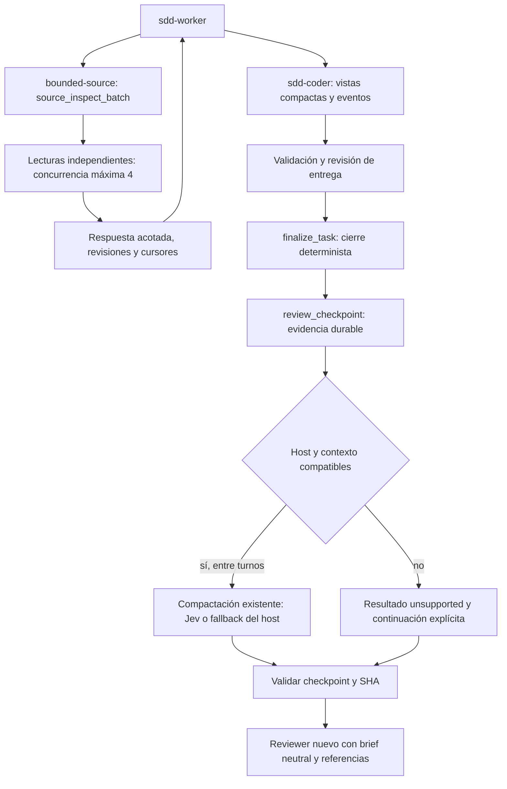

# Feature Specification: Optimización medible del flujo SDD y transición compactada a revisión

**Feature ID**: FEAT-584
**Date**: 2026-09-21
**Author**: Jesús Lara / Codex
**Status**: draft
**Target version**: next minor

## 1. Motivation & Business Requirements

### Problem Statement

El worker dedica muchas solicitudes a construir comandos de inspección, leer salidas repetidas, actualizar estado y preparar la revisión. Las features largas acumulan resultados que vuelven a entrar en contexto aunque la evidencia ya esté disponible en disco. El coste de ejecutar las tools de control es pequeño respecto al de decidir sus invocaciones y procesar sus respuestas.

Esta spec aplica un primer conjunto reversible de optimizaciones. Incorpora explícitamente las dos peticiones adicionales: **inspección por lotes mediante MCP local con concurrencia interna** y **compactación Jev al pasar de desarrollo a code review**, cuando el host permita actuar sobre el contexto correcto.

### Evidencia revisada

Fuentes locales: `artifacts/logs/sdd-worker-profiling/{first-pass-20260921.txt,second-pass-20260921.txt,profile_sdd_worker.py,analyze_orchestrator.py}` y `docs/dev_loop/sdd-execution-optimizations.md`. Se revisaron salidas y lógica del profiler; no se ejecutaron de nuevo los transcripts originales. Los artefactos locales pueden no viajar con el repositorio; los hechos relevantes quedan recogidos aquí.

| Observación | Consecuencia de diseño |
|---|---|
| 39.710 s activos heurísticos; 15.504 s residuales, 39,0% | El 36,2% original restaba dos veces 1.148 s de solapamiento entre categorías. No usar la suma de unions por categoría para reconstruir el total. |
| 707/551/655/2.201 filas assistant corresponden a 419/305/348/1.155 requests | Medir solicitudes por identidad, no mensajes parciales como si fueran inferencias independientes. |
| Atribución a primera acción: bash-other 26,4%; Edit 11,7%; git-other 11,2%; Read 8,6%; pytest 8,6%; Write 8,2% | Priorizar agrupación de consultas y automatización del cierre. No son porcentajes de tiempo ejecutando Bash ni categorías exclusivas del camino crítico. |
| Write: 35 requests, unos 38,5 s/request y 5.216 tokens de salida/request | Sustituir documentos/JSON mecánicos generados repetidamente por renderizado determinista; no limitar arbitrariamente código necesario. |
| Read 929.431 caracteres; bash-other 524.579; pytest 365.433; coder_plan 314.880 | Respuestas acotadas y referencias verificables a evidencia, con acceso al contenido completo. |
| 33 coder_wait, unos 2.394 s de union por categoría | Espera solapada con trabajo útil; no prometer recuperarla íntegramente ni aumentar timeouts. |
| Revisión final: 312,6–1.958,8 s; total 4.370 s | El rango 950–1.150 s del resumen inicial no describe todas las corridas. |
| Repeticiones exactas de comandos pytest: 25+8+4+79=116 de 226 | Candidatos a investigar, no 116 ejecuciones demostrablemente redundantes: el código puede haber cambiado. |
| Demora hasta el siguiente merge: mediana 3 s, máximo 1.657 s | El script empareja con el siguiente merge temporal, no con la misma tarea. Instrumentar identidad antes de atribuir espera evitable. |

Limitaciones adicionales del segundo profiler: su latencia parte del evento anterior y excluye spans de 120 s o más; es un proxy, no tiempo de proveedor observado. A2 clasifica contexto con tokens de caché y omite `input_tokens`, a diferencia de A. `bash-other` es un cajón residual, no una clasificación de inspecciones puras. El evento que termina un hueco no demuestra su causa. Los bins no establecen una relación causal entre tamaño de contexto y latencia.

**Adenda recibida durante la especificación (§8.1–8.5 del informe):** identifica tests y llamadas MCP enviados a background, una base activa estimada ≥13,2 h y timeouts antes contados como idle; señala también el peso del fallback de autoimplementación y un defecto de admisión ya corregido. Es información aportada con análisis adicional, no una reproducción nueva realizada aquí. La línea base del piloto debe ser posterior a esas correcciones y reconstruir spans background por identidad, sin sumar duraciones solapadas.

La §8.5 informa 194 lecturas, 184 búsquedas, 71 llamadas clasificadas sin efecto, 60 consultas Python inline, 43 lecturas SDD, 19 esperas activas y 17 operaciones de archivos: **suman 588, no 589**; conservar una llamada no clasificada hasta reconciliarla. Crear un UUID no es intrínsecamente inútil: el identificador sigue siendo obligatorio y debe generarse en el host/control sin un turno exclusivo. La adenda estima 2,05 s de arranque del hook wiki y un import eager de ADR; el import se verifica localmente, su coste se medirá de nuevo en M9. No tratar todas las cadenas de lecturas como paralelizables: las operaciones con propósito de R1b resuelven internamente las dependencias conocidas; el lote R1 queda para consultas independientes.

### Goals

- G1. Reducir solicitudes dedicadas a inspecciones independientes mediante una sola llamada MCP sin LLM interno.
- G2. Ejecutar lecturas independientes concurrentemente con límites, aislamiento de fallos y evidencia de revisión coherente.
- G3. Reducir el volumen de respuestas repetidas del control SDD sin ocultar bloqueos, errores, identidad ni feedback obligatorio.
- G4. Automatizar el cierre mecánico de tareas ya verificadas, manteniendo la revisión semántica en el worker.
- G5. Crear un checkpoint durable antes del reviewer, intentar compactación una vez por frontera válida y reanudar sin perder criterios ni evidencia.
- G6. Medir MCP y nativos con identidades correlacionables; comparar tiempo hasta aceptación, calidad, requests y tamaño de contexto.
- G7. Aplicar la política común a los twins relevantes de sdd-worker, sdd-coder, sdd-start, sdd-codereview y sdd-done, respetando capacidades distintas por host.
- G8. Sustituir `ps/grep/tail/wc/sleep` de seguimiento por `coder_bg_status`, basado en handles registrados y receipts de procesos, sin inferencia del modelo.
- G9. Quitar imports pesados innecesarios del arranque del hook wiki y medir su latencia de proceso completo.

### Non-Goals

- Reescribir el scheduler por chunks como scheduler continuo; sustituir polling por un protocolo push; acelerar todos los comandos Bash.
- Cambiar el roster, ranking de modelos, reglas de complejidad, número de intentos o suspensiones a partir de esta muestra.
- Ejecutar escrituras, instalación de paquetes, tests o mutaciones Git dentro del tool de inspección.
- Eliminar revisión adversarial, bajar cobertura, habilitar xdist sin homologación o añadir caché global de tests.
- Reimplementar Jev, modificar el plugin externo en su caché, cambiar `clients/base.py` o añadir SDKs/proveedores.
- Compactar por cada tool/tarea, editar transcripts directamente o llamar a `/compact` como comando Bash.

## 2. Architectural Design

### Overview

Se conservan el engine, las gates y el estado SDD existentes. La optimización añade capacidades pequeñas en tres lugares: toolkit de lectura ya instalado, proyección de respuestas/evidencia del engine y frontera explícita desarrollo→review.



### R1. Tool MCP de inspección concurrente

Extender `BoundedSourceToolkit` con `source_inspect_batch`, expuesto por el MCP local **bounded-source**, independiente del servidor sdd-coder. Implementación en un módulo `inspection.py`, sin importarlo desde core. No crear otro wrapper de Bash arbitrario ni duplicar las protecciones de `source_read`.

Entrada: lista de 1–8 operaciones discriminadas por `kind`, identificadas por `id` único. Sin dependencias entre operaciones de un lote: una lectura que dependa de un resultado de búsqueda va en la llamada siguiente. Raíz fijada por la configuración del toolkit; el agente no puede cambiarla ni acceder por ruta absoluta a otro worktree. Usar una instancia configurada para el worktree correcto.

| kind | Argumentos propios | Resultado mínimo |
|---|---|---|
| `read` | `path`, `start_line?`, `end_line?`, `expected_sha256?` | Contrato existente de source_read, sin relajar rangos ni límites |
| `info` | `path` | Contrato existente de source_info |
| `search` | `paths` explícitos, `text` literal, `max_matches` 1–100 | Ruta, línea y fragmento; sin regex ni flags libres en v1 |
| `files` | `paths` de directorio explícitos, `glob`, `max_paths` 1–200 | Rutas relativas permitidas; continuación explícita |
| `git_status` | ninguno | Branch, HEAD, estado staged/unstaged/untracked resumido |
| `git_diff_names` | `base_sha` completo, `head_sha` completo | Estado y nombres de archivos; sin patch completo ni textconv |

Cada variante usa Pydantic v2 con `extra='forbid'`. Todas las rutas se validan con la política existente; secretos, symlinks, dispositivos y escapes se rechazan también para búsquedas, listados y archivos hallados por Git. Nunca buscar primero en rutas prohibidas para filtrar después su contenido. Las operaciones Git se ejecutan sin shell, paginador, external diff, textconv ni refresh opcional del índice; no invocan hooks ni red.

Concurrencia interna: semáforo global por instancia, máximo 4 operaciones activas aun con dos lotes concurrentes. `asyncio` coordina I/O y subprocesos con argv fijo; reutilizar las lecturas existentes que descargan I/O del event loop. No usar threads para trabajo CPU nuevo. Timeouts por operación: 10 s; deadline del lote: 20 s, medido desde admisión e incluyendo cola. Al cancelar o vencer, terminar y esperar los subprocesos propios; devolver resultados ya completos y estados explícitos para el resto.

Salida JSON: máximo 24 KiB serializados, máximo 2 KiB de contenido por item. El presupuesto incluye envelope, metadatos y errores. Planificar cuotas antes de ejecutar; no reunir salidas ilimitadas en memoria. Preservar orden de entrada, IDs, códigos y hashes; truncar solo contenido con `truncated`, cursor validable y continuación. Las 8 operaciones deben tener registro aun cuando fallen. Envelope `OperationResult.status='ok'` significa lote procesado; `data.partial=true` y resultados por item informan fallos parciales. Un lote estructuralmente inválido se rechaza antes de iniciar operaciones.

Un lote no promete un snapshot transaccional de un worktree vivo. Capturar HEAD y fingerprint de estado antes/después, hashes de archivos leídos y `consistent`; un cambio invalida la afirmación de coherencia. Para revisión reproducible usar SHAs inmutables. Los metadatos no detectan toda escritura transitoria: el consumidor verifica de nuevo los hashes antes de tomar decisiones que requieran estabilidad.

No se aceptan `command`, `argv`, intérpretes, `eval`, extensiones ejecutables ni herramientas anidadas. El tool no llama a otro modelo y no escribe código. Un escape al Bash de inspección requiere una capacidad ausente documentada; no se prohíbe Bash para operaciones legítimas fuera de este contrato.

La concurrencia interna evita depender de cómo el host programe llamadas MCP. El servidor separado evita la cola interna de coder_wait, pero no garantiza que el cliente permita llamadas entre servidores durante una espera. El worker no debe emitirlas en paralelo hasta verificar esa capacidad; agrupar inspecciones antes/después del wait es suficiente para v1.

Ejemplo de una llamada del agente, con operaciones independientes:

```json
{
  "requests": [
    {"id": "state", "kind": "git_status"},
    {"id": "api", "kind": "read", "path": "packages/ai-parrot/src/parrot/flows/dev_loop/sdd_coder/toolkit.py", "start_line": 192, "end_line": 216},
    {"id": "callers", "kind": "search", "paths": ["packages/ai-parrot/src/parrot/flows/dev_loop/sdd_coder"], "text": "coder_wait", "max_matches": 20}
  ],
  "concurrency": 4,
  "max_output_bytes": 24576
}
```

Para N consultas secuenciales el coste aproxima N viajes de modelo/tool más la suma de ejecución; con el lote se busca un viaje y ejecución solapada. El beneficio real depende de cuántas consultas eran independientes y de si el host ya las agrupaba. No atribuirle automáticamente el 26,4% completo.

### R1b. Lecturas con propósito: prioridad sobre lotes exploratorios

Implementar en el MCP **sdd-coder** dos consultas deterministas:

- `coder_task_context(feature, worktree, task_id, execution_id)`: resuelve índice→tarea→dependencias→alcance declarado, devuelve estado, criterios/contrato por referencias y hashes. No manda toda la spec ni convierte una dependencia no aceptada en ready. La cadena conocida se resuelve en código; no necesita otro modelo.
- `coder_delivery_report(feature, worktree, task_id, execution_id)`: rama/intento, commits, diff stat, archivos cambiados/fuera de alcance, estado del sub-worktree y evidencia de lint/tests/revisión. No hace merge, autofix, nueva validación ni aprueba la entrega. Evidencia ausente aparece como unknown; juicio de alcance usa el contrato de archivos existente, sin inventar una segunda policy.

Ambas retornan `CoderResult`, con presupuesto de 16 KiB, refs R2 y snapshot de revisiones. Validan ownership y paths como las operaciones existentes del engine. Operaciones Git independientes pueden solaparse internamente (máximo 4), después de resolver las dependencias necesarias. Priorizar estos tools en el worker frente a construir manualmente la misma cadena. R1 no sustituye exploración adaptativa desconocida ni fuerza a declarar operaciones futuras sin conocer sus operandos.

### R2. Vistas compactas compatibles

Añadir `response_mode: Literal['full','compact']='full'` a `coder_plan`, `coder_status` y `coder_wait`, incluidos modelos de argumentos y esquemas registrados. `full` conserva el comportamiento previo. El worker actualizado pide `compact`.

La vista compacta devuelve identidad, generación, estado, siguiente chunk con asignaciones y assessment IDs, tareas pendientes/bloqueadas, razones, suspensiones, orphans, outcomes y referencias de evidencia. Conserva el conjunto completo de IDs de bloqueos/errores mediante paginación si no cabe; no permite despachar hasta leer todas las páginas obligatorias. Las evaluaciones extensas, `turn_series`, patches y logs quedan en artefactos durables con hash.

`coder_prepare_native` conserva íntegro `coder_feedback`; no resumir reglas vinculantes ni alterar identidad para ahorrar contexto. El plan detallado debe poder recuperarse por `coder_read_artifact(execution_id, artifact_id, offset=0, limit=8192)` con límite máximo de 16 KiB, integridad del snapshot y acceso solo a artefactos emitidos para esa ejecución. No aceptar rutas arbitrarias. Capturar byte counts antes/después de proyección, no confundir caracteres con tokens.

### R3. Evidencia y telemetría persistentes

Reutilizar `resolve_durable_root` para almacenar fuera de los worktrees:

```text
<telemetry_root>/executions/<execution_id>/events.jsonl
<telemetry_root>/executions/<execution_id>/artifacts/<sha256>.json
<telemetry_root>/executions/<execution_id>/review/<checkpoint_id>.json
```

Mantener intacto el esquema existente FEAT-*.jsonl de intentos. Añadir eventos versionados de origen `engine`, `worker_observation` o `transcript_import`, diferenciando observado de inferido. Clave: execution_id/task_id/attempt_uid/job_id cuando aplique; los eventos del host incluyen session_id/agent_id, sin texto de prompts ni credenciales.

Eventos mínimos: `attempt.dispatched`, `attempt.finished`, `delivery.observed`, `merge.finished`, `validation.finished`, `task.accepted`, `review.checkpoint`, `compaction.requested`, `compaction.finished`, `review.started`, `review.finished`. Duraciones monotónicas solo dentro del mismo proceso; timestamps UTC para correlación entre procesos, con origen de reloj documentado. Tokens desconocidos son null.

Nueva operación `coder_record_native_observation` admite vínculo con el agente y finalización observada para un attempt nativo ya emitido. No marca la tarea como aceptada, no libera reservas y no sustituye `coder_merge`. Rechaza identidades ajenas y payloads incompatibles repetidos. El span real puede ser null si solo se conoce cuándo se recibió el resultado. No deducirlo de un tool_result inmediato del despacho.

El append es idempotente por event_id, con exclusión entre escritores de una ejecución y recuperación de una línea final incompleta. No sobrescribir eventos distintos ni tratar un archivo corrupto como éxito. Fallos de telemetría observacional se reportan como degradación sin invalidar código correcto; fallos de persistencia del checkpoint/evidencia necesaria bloquean la transición que depende de ella. Cleanup conserva esa evidencia y no elimina worktrees con agentes vivos.

### R4. Cierre de tarea mecánico

Un nuevo CLI `scripts.sdd.finalize_task` recibe evidencia estructurada, identidad y SHA esperado. Valida que la tarea, alcance, commits, checks y revisión de entrega corresponden al checkout actual; requiere todas las verificaciones obligatorias verdes y review_evidence. No genera un juicio de revisión mediante plantillas.

Renderiza Completion Note y tabla de métricas determinísticamente, usa `close_task.sh` como primitiva de cierre existente y verifica las postcondiciones. El wrapper mantiene un journal por operación: reanudación comprueba archivo active/completed, índice y nota; nunca borra un twin divergente. La prevalidación impide entrar en la rama destructiva de close_task cuando existe un completed distinto. No modifica el script de cierre genérico en esta feature.

Solo actúa sobre la tarea y su índice; no ejecuta `git add .`, reset global, commit, push o cierre de otra tarea. Devuelve rutas staged y mensaje sugerido; el worker realiza el commit y las decisiones semánticas. Idempotencia ligada a task_id+implementation_sha+evidence hash; un SHA o evidencia distintos exige una nueva operación. El worker pasa de varios Edit/Write/jq/mv a una llamada verificable.

### R5. Checkpoint antes del code reviewer

Preparar checkpoint una vez terminadas las tareas y asentados los intentos. En ruta MCP, debe existir confirmación `coder_end_execution` cerrada; en fallback, registrar por separado ausencia verificada de hijos/procesos propios activos. Un estado desconocido no equivale a cero actividad. No relajar `execution_busy` ni `recovery_required`.

El checkpoint contiene feature, execution_id, worktree/branch, base SHA, implementation HEAD, hashes de spec/índice/convenios, tareas y criterios, commits, resultados de validación con entorno/argv, fixes/feedback/review refs, bloqueos y acciones pendientes. Preservar también instrucciones explícitas del usuario y restricciones vigentes mediante referencias o texto fiel, sin depender del clasificador para conservarlas. Un brief neutral de máximo 8 KiB remite al manifest y al diff inmutable; no pega todo el patch ni conclusiones del implementador. El reviewer accede al diff completo mediante lecturas acotadas.

El checkpoint es un contrato de continuación, no aprobación de la feature. `done-with-issues`, criterios sin verificar y hallazgos pendientes permanecen visibles. Antes de review, comprobar HEAD, branch y hashes. Si cambian, devolver `checkpoint_stale` y regenerar; ninguna aprobación anterior cubre el nuevo diff.

Reviewer nuevo e independiente, no fork de toda la conversación. Puede reutilizar evidencia mecánica válida y debe repetir tests ante cambios, dudas o hallazgos. No usar coincidencia textual de comandos como caché. La revisión final conserva cobertura de integración y severidades; no se exige introducir revisores paralelos en esta feature.

### R6. Compactación Jev en la frontera

El plugin instalado `fast-jev-compaction` 0.3.0 ya intercepta `session.compact`, conserva textos, elimina/trunca tool pairs y usa fallback estándar ante error o reducción insuficiente. Su configuración local documenta auto-compaction al 60% y reducción mínima 25%; son defaults del plugin inspeccionado, no nuevos requisitos de SDD ni garantía de rendimiento.

**Política:** `pre_review_compaction='auto'` por defecto en el flujo actualizado, `off` para comparar/revertir. En `auto`, solicitar una compactación al finalizar desarrollo y antes de review **si hay un adaptador capaz de compactar ese contexto**. No exigir un umbral adicional de tamaño: el host/plugin decide si vale la pena; registrar `skipped` si no procede. No hacer más de un intento por checkpoint_id+context_id. Compactación intermedia de specs largas sigue usando el mecanismo automático existente; no añadir otro umbral competidor en v1.

Secuencia: persistir checkpoint → emitir handoff de fase → llegar a frontera entre turnos → solicitar compactación → registrar outcome real → recargar/validar manifest → iniciar reviewer. Nunca dentro de una llamada de tool activa ni mientras se espera trabajo vivo.

| Contexto | Comportamiento contratado |
|---|---|
| Worker en conversación principal Claude con adaptador homologado | `$.session.compact({instructions: ...})` entre turnos; comprobar contexto/receipt antes de continuar |
| Worker en subagente/fork | La API instalada no acepta agentId en SessionCompactArgs. No asumir direccionamiento; solo habilitar si la prueba del runtime demuestra que actúa sobre ese loop. En caso contrario, `unsupported_context` y reviewer fresco desde checkpoint. |
| Codex/Antigravity u otro host sin adaptador verificado | `unsupported_host`, checkpoint y reviewer fresco; no instalar ni invocar Jev de forma indirecta |
| Jev falla o no reduce suficiente | Permitir el fallback del host; registrar `builtin` solo con evidencia, o `unknown` si el backend no es observable |
| Runtime ocupado, timeout o interrupción | Registrar estado; no relanzar a ciegas. Un timeout no prueba cancelación: esperar settlement o continuar desde checkpoint en un contexto nuevo, sin mutación concurrente del anterior. |

No usar `claude -p /compact` desde el worker ni reabrir en paralelo la misma sesión. El texto `/compact` en una respuesta no cuenta como ejecución. La presencia de settings/plugin/key tampoco prueba funcionamiento. `compaction_status` es diagnóstico de instalación, no handshake de capacidades.

Un spike obligatorio M0 homologa el driver de frontera con un host real y fija el mecanismo de reanudación antes de implementar el adaptador específico. No cambiar la caché del plugin externo. La implementación del adaptador se registra en el mecanismo de plugins/instalación administrada del repo; sus archivos y evento de reanudación se fijan mediante enmienda de esta spec tras M0, evitando inventar APIs experimentales.

Compactar el worker puede reducir su contexto de continuación; un reviewer ya fresco no hereda automáticamente ese ahorro. Medir ambas fases por separado, incluyendo coste de compactación, pérdida de caché, relecturas y recuperación.

### R8. Estado determinista de trabajo background

`coder_bg_status(execution_id, handle, since_revision=None, tail_bytes=2048)` es una **lectura sin espera de terminación**, sin LLM, shell, `ps`, `kill -0`, `tail` externo ni exploración de logs por nombre. `handle` es opaco y se emite al registrar un lanzamiento; no es un PID ni una ruta aceptados del modelo. El registro fija execution_id, task_id/attempt_uid opcionales, worktree canónico, backend, launch_id, tipo de trabajo y fuente de autoridad. Poseer un handle no evita comprobar ownership.

Fuentes soportadas y sus límites:

| Fuente | Registro | Autoridad de estado / salida |
|---|---|---|
| Job MCP del engine | coder_run_chunk añade `bg_handle` sin cambiar job_id | JobTable y eventos durables; un job lógico no tiene código POSIX de salida |
| Validación supervisada | nuevo coder_run_validation devuelve handle inmediatamente tras admisión | Supervisor propietario del proceso y receipt de `await process.wait()`; código de salida real |
| Agente nativo | coder_prepare_native crea handle `pending`; native_observation lo vincula al agent_id | Observaciones/handback del host con procedencia; no son prueba independiente de proceso vivo ni código POSIX |
| Bash background externo ya existente | solo si un bridge de host suministra registro y receipt verificables | Sin bridge no se puede inspeccionar de forma autoritativa; devolver unsupported, nunca sondear un PID arbitrario |

`coder_bg_status` devuelve `state=pending|running|finished|unknown`, `outcome=completed|failed|timed_out|cancelled|null`, `exit_code:int|null`, `source`, `authority=supervisor|engine|host_observation`, `verified_at`, `stale`, `revision`, `changed`, `log_tail`, `log_ref`, `log_truncated`, `elapsed_ms` y `next_poll_after_ms`. `state=finished` no significa tests verdes ni tarea aceptada; outcome y exit_code son campos distintos. En procesos: returncode negativo conserva la señal, no convertirlo a éxito. Un código 124 aislado no demuestra que el supervisor impuso timeout; `timed_out` requiere un evento de deadline conocido.

`running` autoritativo solo mientras el dueño tiene el proceso/job activo y el registro pertenece a su instancia. Tras reinicio, si no hay receipt terminal durable o reconexión verificable, `unknown`, exit_code=null, stale=true; no reconstruir éxito por log vacío, ausencia de PID o PID reutilizado. Observaciones de agente nativo llevan autoridad host_observation y nunca habilitan cleanup sin settlement existente. `pending/running/unknown` de validaciones admitidas bloquean checkpoint y cleanup de su worktree; no se añaden como falsos TaskResult a JobTable.

El log es artefacto registrado bajo la raíz durable, con acceso confinado y política de redacción existente o filtro explícito de credenciales; si no puede servirse de forma segura se omite con razón. tail_bytes 0–4096, lectura desde offset de archivo con tamaño acotado, UTF-8 válida, sin cargar el archivo completo. No aceptar `log_path` desde el caller. Respuesta ≤8 KiB. Si `since_revision` coincide no repetir tail ni payload; `changed=false`. La revisión cambia por estado o nuevos bytes de log, no por el simple paso del tiempo. Lectura con presupuesto operativo de 1 s; timeout I/O es error explícito, no estado terminal. Objetivo p95 local <100 ms sobre registros existentes, separado del coste MCP/host.

Política de uso: consultar al recibir una notificación, antes de consumir un resultado, o tras `next_poll_after_ms` cuando realmente se requiera estado. No bucles Bash, no llamadas `echo waiting` ni polling en cada turno. Valor mínimo recomendado entre consultas activas: 5 s; backoff estable hasta 60 s sin cambios, retorno terminal persistente. El tool no duerme para imponer ese intervalo ni mantiene bloqueado el MCP. Si el host puede notificar, se prefiere yield y notificación; un status endpoint no equivale a añadir push.

**Lanzamiento de validaciones necesario para hacer útil el status:** `coder_run_validation(feature, worktree, execution_id, task_ids, tier, timeout_seconds, request_id)` admite solo el selector de tests existente, construye argv desde índice/contrato, usa el entorno protegido y devuelve handle sin esperar la suite. `tier=merge|feature`; IDs deben pertenecer a la feature, feature-tier exige el conjunto aplicable completo. timeout_seconds obligatorio, 1–7200, explícito en el plan; no afirmar duración esperada si no hay historial. request_id estable proporciona idempotencia: mismo request/payload devuelve handle; payload distinto es error, nunca segundo proceso silencioso.

El supervisor conserva process handle, drena stdout/stderr hacia log acotado en disco y persiste un receipt terminal. Deadline: terminar árbol propio, esperar reap y registrar motivo; si no se demuestra terminación mantener unknown/busy. Utilizar `protected_argv` existente, nunca evadir protección si falla. No aceptar argv/script arbitrario ni ejecutar tests mediante el toolkit read-only. No reintentar automáticamente una selección fallida/timed_out sin cambio de código, selección o presupuesto justificado. Particionar una suite preserva la unión de cobertura; no reducirla para convertir rojo en verde. Toda validación debe asentarse antes de `coder_end_execution` y del checkpoint.

La determinación del estado está en el supervisor/registro, no en una interpretación del contenido del log por el LLM. Esto sustituye una cadena de inspección por un snapshot verificable y además recupera para el profiler el span perdido por los tool_results inmediatos.

### R9. Arranque ligero del hook wiki

`knowledge/wiki/cli.py:2250` importa eager `decisions.cli` al registrar ADR; `claude-hook` solo necesita `run_pre_tool_use_hook`. Registrar ADR mediante un grupo Click lazy que conserve nombre, ayuda, opciones y errores, importando el módulo real solo al invocarlo. No modificar el servicio ADR ni sus decisiones de negocio.

En modo hook, stdout contiene únicamente el protocolo del hook; diagnósticos van a stderr sin desactivar los controles de seguridad. Medir el proceso completo, no solo el callback ya importado. Objetivo p50 <300 ms en 20 arranques de proceso con caché de disco templada en runner documentado; reportar p95 y arranque frío aparte. Un test funcional exige que ejecutar hook no cargue `parrot.clients.base`, pandas o el servicio ADR por esa ruta. Si hay otras cadenas de importación, identificarlas y restringir la carga dentro de los mismos puntos de entrada; no hacer refactor masivo.

### Data Models — nuevos contratos

Modelos Pydantic v2 con extra prohibido. Campos de identidad no se infieren de texto libre.

| Modelo | Campos y validación |
|---|---|
| `InspectionRequest` | Union discriminada de las seis variantes R1; `id` no vacío y único por lote |
| `InspectionBatchArgs` | requests 1–8, concurrency 1–4 (default 4), max_output_bytes 4096–24576 (default 24576) |
| `InspectionItem` | id, kind, status ok/error/cancelled, data, error_code?, elapsed_ms, truncated, continuation? |
| `InspectionBatch` | schema_version=1, items, partial, consistent, head_before/after, elapsed_ms, sum_item_ms, returned_bytes |
| `WorkflowEvent` | schema_version=1, event_id, kind, execution_id, task_id?, attempt_uid?, job_id?, timestamp, source, bounded payload |
| `EvidenceRef` | artifact_id, sha256, relative_path, size_bytes, media_type; resolver confinado al durable root |
| `TaskCompletionEvidence` | feature_slug, task_id, implementation_sha, validation_refs, review_evidence, fix_commits, completion facts |
| `ReviewCheckpoint` | R5 completo, checkpoint_id calculado desde contenido canónico, context_id?, pending_actions, evidence_refs |
| `CompactionReceipt` | checkpoint_id, context_id, status completed/skipped/unsupported/failed/in_progress, reason, backend jev/builtin/unknown, before/after bytes y tokens opcionales, elapsed_ms |
| `BackgroundRegistration` | handle, execution_id, task_id?, attempt_uid?, launch_id, owner_instance_id, kind, authority, worktree, started_at?, registered_log_ref? |
| `BackgroundStatus` | Campos R8; exit_code nullable, revisión estable, estado desconocido explícito y nunca aceptación implícita |

No afirmar `jev` por estar habilitado el plugin; exige un receipt/log verificable para esa invocación. Si no hay tokens del host, guardar bytes y tokens=null.

### New Public Interfaces

- MCP `bounded-source.source_inspect_batch` (R1).
- MCP `sdd-coder.coder_task_context`, `coder_delivery_report` (R1b), `coder_bg_status` y `coder_run_validation` (R8).
- `response_mode` opcional y MCP `sdd-coder.coder_read_artifact`, `coder_record_native_observation` (R2/R3).
- CLI `python -m scripts.sdd.finalize_task --evidence <path> --worktree <path> --expected-head <sha>`.
- CLI `python -m scripts.sdd.review_checkpoint prepare|validate --feature <id> --worktree <path> --execution-id <uuid>`; `validate` añade `--checkpoint-id`; preparación obtiene SHAs localmente, no acepta uno inventado por el LLM.
- Adaptador abstracto de frontera R6; API del host homologada por M0 antes de descomponer esa integración.

## 3. Module Breakdown

### Delegation-eligible modules

| Módulo | Eligible? | Contrato decidido / límite |
|---|---|---|
| M0 Capacidad de compactación | no | Investigación de API experimental y control de reanudación; no delegar decisiones de diseño |
| M1 Inspección MCP | sí, tras TASK con blueprints | R1; tipos discriminados, límite 4/8, 24 KiB, read-only, sin LLM |
| M1b Consultas SDD con propósito | sí, tras TASK | R1b; consultas sin efectos, ownership y evidencia nullable |
| M2 Evidencia/eventos | sí, tras TASK | R3; identidad, persistencia e idempotencia explícitas |
| M3 Vistas compactas | sí, tras TASK | R2; full compatible, contenido recuperable y páginas obligatorias |
| M4 Cierre/checkpoint | sí, tras TASK | R4/R5; precondiciones, journal y sin aprobación sintética |
| M5 Driver de compactación | no hasta M0 | Falta homologar scope y continuación del runtime; prohibido inventar API |
| M6 Twins y revisión | sí para contratos comunes; parte host después de M0 | R1–R6, coherencia semántica entre hosts |
| M7 Medición/regresión | sí, tras TASK | R7 y criterios de §4/§5 |
| M8 Background supervisado | sí, tras TASK con blueprints | R8; handles emitidos, status sin polling de PID, validación protegida e idempotente |
| M9 Hook ligero | sí, tras TASK | R9; lazy ADR, stdout protocolar y compatibilidad CLI |

### M0. Spike de frontera de contexto

- **Paths nuevos:** `docs/dev_loop/sdd-compaction-capabilities.md`; evidencia en `artifacts/logs/sdd-compaction-capabilities/`.
- **Responsibility:** probar conversación principal y subagente, identidad de contexto, rechazo durante turno, una única compactación, fallo Jev/fallback y continuación a review. Registrar versiones y hashes del plugin/type reference; no copiar todo el SDK externo.
- **Depends on:** instalación existente, ninguna dependencia nueva.
- **Interface Skeleton:** informe con `host_version`, `plugin_version`, `context_kind`, `can_target_context`, `between_turns`, `resume_mechanism`, `receipt_fields`, `evidence_refs`, `verdict`. No API productiva ni smoke automático con credenciales en unit tests.
- **Salida de diseño:** enmienda de R6/M5 con archivos exactos del adaptador/instalador y contrato verificado, o verdict unsupported por host. El objetivo de compactación automática en un contexto soportado no puede darse por cumplido solo con mocks.

### M1. Inspección concurrente y MCP local

- **Paths:** nuevos `packages/ai-parrot-tools/src/parrot_tools/tool_optimizations/inspection.py`, `inspection_models.py`; modificar `reader.py` (registro y método); tests nuevos `packages/ai-parrot-tools/tests/tool_optimizations/test_inspection.py` e `integration/test_inspection_mcp.py`; actualizar template `packages/ai-parrot/src/parrot/mcp/_toolkit_templates/bounded-source.yaml` si necesita documentar límites.
- **Depends on:** reader/base/policy existentes. No dependencia de core hacia parrot_tools.
- **Interface Skeleton:**

```python
# new: .../tool_optimizations/inspection.py
class InspectionRunner:
    """Ejecuta un lote read-only bajo una política y límite global compartidos."""
    def __init__(self, reader: BoundedSourceToolkit) -> None:
        """Reutiliza la instancia y su política, sin cambiar la raíz."""
    async def run(self, args: InspectionBatchArgs) -> OperationResult:
        """Resultados ordenados y acotados; no oculta errores parciales."""

# modifies reader.py:326; base verified: base.py:33
class BoundedSourceToolkit(OptimizationToolkitBase):
    async def source_inspect_batch(
        self, requests: list[dict[str, object]], concurrency: int = 4,
        max_output_bytes: int = 24576,
    ) -> OperationResult:
        """Inspecciona operaciones independientes sin shell libre ni escritura."""
```

`inspection_models.py` exporta los modelos R1; registrar su schema mediante `tool_schema` como `source_read` (reader.py:443). Importación de `reader` solo para typing dentro del runner para evitar ciclo.

### M1b. Contexto de tarea y reporte de entrega

- **Paths:** nuevo `.../sdd_coder/inspection.py`; modificar `toolkit.py`, `models.py`; tests `test_inspection_reports.py`.
- **Depends on:** M2 para snapshots/referencias; contratos de índice y fidelity existentes, que el TASK debe verificar al detallar el blueprint.
- **Interface Skeleton:**

```python
# new methods in SddCoderToolkit
async def coder_task_context(self, feature: str, worktree: str, task_id: str,
                             execution_id: str) -> CoderResult:
    """Snapshot acotado de tarea, índice, dependencias y alcance; no modifica estado."""
async def coder_delivery_report(self, feature: str, worktree: str, task_id: str,
                                execution_id: str) -> CoderResult:
    """Inspecciona entrega y evidencia conocida; no valida, corrige ni hace merge."""
```

### M2. Evidencia y eventos de ejecución

- **Paths:** nuevos `packages/ai-parrot/src/parrot/flows/dev_loop/sdd_coder/optimization_models.py`, `evidence.py`; modificar `telemetry.py`, `engine.py`, `models.py`, `toolkit.py`; tests nuevos bajo `packages/ai-parrot/tests/flows/dev_loop/sdd_coder/`.
- **Depends on:** resolución durable y ownership existentes.
- **Interface Skeleton:**

```python
# new: .../sdd_coder/evidence.py
class ExecutionEvidenceStore:
    """Evidencia acotada fuera del worktree, ligada a execution_id."""
    def __init__(self, root: Path) -> None:
        """Recibe raíz previamente validada por resolve_durable_root."""
    async def append_event(self, event: WorkflowEvent) -> EvidenceRef:
        """Append idempotente; conflicto de mismo ID con otro payload es error."""
    async def put_artifact(self, execution_id: str, payload: BaseModel) -> EvidenceRef:
        """Persiste JSON canónico con hash antes de publicar su referencia."""
    async def read_artifact(
        self, execution_id: str, artifact_id: str, offset: int = 0, limit: int = 8192,
    ) -> dict[str, object]:
        """Página UTF-8 íntegra, cursor estable, tamaño y hash del snapshot completo."""

# modifies SddCoderToolkit, verified toolkit.py:51
async def coder_record_native_observation(
    self, feature: str, worktree: str, execution_id: str,
    observation: dict[str, object],
) -> CoderResult:
    """Registra observación de un attempt emitido; no libera ni acepta la tarea."""
```

`observation`: event_id, task_id, attempt_uid, agent_id, observed_at, kind dispatched/finished, started_at?/ended_at?, terminal?, evidence_ref. Rechazar timestamps invertidos y duración inventada. Nuevos errores en el conjunto cerrado: `observation_conflict`, `artifact_not_found`, `artifact_scope_mismatch`, `evidence_persistence_failed`, `evidence_invalid`; conservar errores existentes de identidad/ownership.

### M3. Proyecciones de respuesta

- **Paths:** nuevo `.../sdd_coder/views.py`; modificar `toolkit.py`, `models.py`; tests `test_compact_views.py`.
- **Depends on:** M2.
- **Interface Skeleton:**

```python
# new: .../sdd_coder/views.py
async def project_response(
    payload: BaseModel, *, mode: Literal['full', 'compact'],
    execution_id: str, store: ExecutionEvidenceStore,
) -> dict[str, object]:
    """Devuelve full sin cambio o vista paginada, persistiendo antes los detalles."""

# extensions of existing methods: toolkit.py:192,301,309
async def coder_plan(self, feature: str, worktree: str, execution_id: str,
                     response_mode: Literal['full', 'compact'] = 'full') -> CoderResult:
    """Plan existente con proyección seleccionable validada por schema Literal."""
async def coder_wait(self, job_id: str, timeout_seconds: int = 120,
                     response_mode: Literal['full', 'compact'] = 'full') -> CoderResult:
    """Conserva espera y límites existentes; compacta solo la respuesta."""
async def coder_status(self, job_id: str,
                       response_mode: Literal['full', 'compact'] = 'full') -> CoderResult:
    """Snapshot con full compatible o vista compacta."""
async def coder_read_artifact(self, execution_id: str, artifact_id: str,
                             offset: int = 0, limit: int = 8192) -> CoderResult:
    """Recupera solo evidencia emitida y ligada a la ejecución."""
```

El schema y la validación previa rechazan otros valores de response_mode. Job ID se resuelve a execution_id server-side, nunca desde payload arbitrario. Presupuesto de vista 16 KiB; listas obligatorias paginadas con `required_pages_remaining`; código consumidor cubierto por tests.

### M4. Finalización y checkpoint de revisión

- **Paths:** nuevos `scripts/sdd/finalize_task.py`, `scripts/sdd/review_checkpoint.py`, `.../sdd_coder/checkpoint.py`; modelos en `optimization_models.py`; tests en `packages/ai-parrot/tests/flows/dev_loop/sdd_coder/test_review_checkpoint.py` y `test_finalize_task.py`.
- **Depends on:** M2, close_task.sh, selección de tests existente.
- **Interface Skeleton:**

```python
# new: .../sdd_coder/checkpoint.py
async def prepare_review_checkpoint(
    *, feature: str, worktree: Path, execution_id: str,
    store: ExecutionEvidenceStore,
) -> ReviewCheckpoint:
    """Comprueba settlement, captura evidencia y publica snapshot durable neutral."""
async def validate_review_checkpoint(
    checkpoint: ReviewCheckpoint, *, worktree: Path,
) -> None:
    """Rechaza SHA, branch, criterios o evidencia obsoletos; nunca aprueba código."""

# new: scripts/sdd/finalize_task.py
def finalize_task(*, evidence: TaskCompletionEvidence, worktree: Path,
                  expected_head: str) -> dict[str, object]:
    """CLI síncrono: cierre reanudable y nota determinista; sin commit/push."""
def main(argv: list[str] | None = None) -> int:
    """0 éxito/idempotencia, 1 fallo de operación, 2 input inválido, 3 stale/busy."""

# new: scripts/sdd/review_checkpoint.py
def main(argv: list[str] | None = None) -> int:
    """Prepare/validate: mismos códigos y salida JSON con referencia al checkpoint."""
```

Errores de dominio: `checkpoint_stale`, `checkpoint_busy`, `checkpoint_incomplete`, `task_evidence_stale`, `task_twin_conflict`. Un snapshot antiguo no autoriza cerrar una ejecución nueva ni omitir trabajo pending.

### M5. Política y driver de frontera de compactación

- **Paths decididos:** nuevo `.../sdd_coder/phase_boundary.py`; receipt/policy en `optimization_models.py`; documento de capacidad M0; tests `test_phase_boundary.py`.
- **Paths del driver de host:** pendientes exclusivamente de M0; no crear un plugin nuevo por suposición. Instalación administrada se integrará con `knowledge/wiki/claude_code/compaction.py`, sin modificar el Jev externo ni almacenar credenciales nuevas.
- **Depends on:** M0, M4. No asignar implementación del driver a un coder antes de enmendar contratos.
- **Interface Skeleton:**

```python
# new: .../sdd_coder/phase_boundary.py; interfaz propuesta, no API existente
class PhaseBoundaryDriver(Protocol):
    """Capacidad del host: contexto correcto, frontera segura y receipt observable."""
    async def supports(self, context_id: str) -> bool:
        """False cuando scope/host/versión no estén homologados."""
    async def compact(self, checkpoint: ReviewCheckpoint) -> CompactionReceipt:
        """Una solicitud, entre turnos, sobre el contexto del checkpoint."""

async def prepare_review_boundary(
    checkpoint: ReviewCheckpoint, *, driver: PhaseBoundaryDriver,
    policy: Literal['auto', 'off'], store: ExecutionEvidenceStore,
) -> CompactionReceipt:
    """Gestiona idempotencia/estado; nunca simula compactación ni lanza review a ciegas."""
```

La coordinación Python expresa política; no presupone que Python pueda controlar el runtime de Claude. El driver de host debe demostrar cómo transporta el checkpoint, llama a la API real y reanuda review. `in_progress` tras crash exige reconciliación; no retry automático de una operación de estado desconocido.

### M6. Prompts, twins y documentación operativa

- **Modificar:** `.claude/agents/sdd-worker.md`, `.claude/agents/sdd-coder.md`, `.claude/agents/code-reviewer.md`; sus fuentes empaquetadas `packages/ai-parrot/src/parrot/flows/dev_loop/_subagent_data/{sdd-worker,sdd-coder,sdd-codereview}.md`; `.codex/agents/sdd-worker.toml`; `.agent/agents/sdd-worker/agent.md`.
- **Flujos:** `.claude/commands/{sdd-start,sdd-codereview,sdd-done}.md`, `.agent/workflows/{sdd-start,sdd-codereview,sdd-done}.md`, `.agents/skills/{sdd-start,sdd-codereview,sdd-done}/SKILL.md`. Durante descomposición verificar si `.codex/skills` es twin separado o enlace antes de asignarle cambios.
- **Docs:** `docs/dev_loop/sdd-coder-orchestrator.md`, nuevo `docs/dev_loop/sdd-execution-optimization.md`; incorporar la evidencia corregida del informe previo sin necesitar que ese artefacto local esté versionado.
- **Depends on:** M1–M5 según host. Contrato documental común, no igualdad literal entre hosts.
- **Interface Skeleton:** secuencia normative `inspect_batch → implement → validate → handoff review → finalize_task → checkpoint → compact-or-explicit-outcome → validate checkpoint → fresh reviewer → corrections/close`. Especificar variante sin engine y no atribuir a Codex capacidades de Claude.
- Reducir relecturas solo con hashes coincidentes; criterio de aceptación y contexto de tarea no desaparecen del brief. Mantener wiki-first y rangos de lectura. Mantener espera recomendada de 90 s donde ya se prescribe y prohibición de busy-wait; no cambiar scheduling.

### M7. Medición y regresiones

- **Paths nuevos:** `scripts/sdd/profile_execution.py`, `packages/ai-parrot/tests/flows/dev_loop/sdd_coder/test_execution_profile.py`, fixtures sintéticos, `packages/ai-parrot-tools/tests/tool_optimizations/test_inspection_benchmark.py` y `test_optimization_workflow_contracts.py`.
- **Depends on:** M1–M6.
- **Interface Skeleton:**

```python
# new: scripts/sdd/profile_execution.py
def main(argv: list[str] | None = None) -> int:
    """Lee eventos/transcripts por rutas explícitas y emite reporte JSON versionado."""
```

**R7:** global union, buckets solapables, residual explícito, requests únicos, input+cache_read+cache_creation coherentes, latencia proxy diferenciada de latencia observada. No excluir silenciosamente solicitudes largas. Asociar fin/observación/merge por identidad; no por siguiente timestamp. Clasificar inspección Bash solo cuando el parser reconozca operaciones de lectura, conservando unknown. No ejecutar ni importar sin revisión los scripts de profiling locales con rutas personales.

### M8. Registry y supervisor background

- **Paths:** nuevo `.../sdd_coder/background.py`; modelos R8 en `optimization_models.py`; modificar `toolkit.py`, `models.py`, `engine.py`; usar, sin debilitarlo, `packages/ai-parrot/src/parrot/flows/dev_loop/worktree_environment.py`.
- **Tests:** nuevos `test_background_status.py`, `test_background_validation.py` bajo `packages/ai-parrot/tests/flows/dev_loop/sdd_coder/`.
- **Depends on:** M2; integra gates con M4/M5. Serializar cambios compartidos de toolkit/engine con M3.
- **Interface Skeleton:**

```python
# new: .../sdd_coder/background.py
class BackgroundRegistry:
    """Registro por execution y supervisor; no adopta procesos por PID libre."""
    async def register(self, registration: BackgroundRegistration) -> str:
        """Emite handle idempotente desde un lanzamiento del engine/supervisor."""
    async def status(self, execution_id: str, handle: str,
                     since_revision: int | None = None, tail_bytes: int = 2048) -> BackgroundStatus:
        """Snapshot sin esperar terminación; lectura acotada del log registrado."""

class ValidationSupervisor:
    """Posee procesos de validación, logs, deadlines y receipts durables."""
    async def start(self, *, feature: str, worktree: Path, execution_id: str,
                    task_ids: list[str], tier: Literal['merge', 'feature'],
                    timeout_seconds: int, request_id: str) -> BackgroundRegistration:
        """Admite selector protegido e idempotente; no espera el fin de la suite."""

# new methods in SddCoderToolkit
async def coder_bg_status(self, execution_id: str, handle: str,
                         since_revision: int | None = None, tail_bytes: int = 2048) -> CoderResult:
    """Estado conocido y tail acotado; sin LLM, shell ni inferencia por PID."""
async def coder_run_validation(self, feature: str, worktree: str, execution_id: str,
                               task_ids: list[str], tier: Literal['merge', 'feature'],
                               timeout_seconds: int, request_id: str) -> CoderResult:
    """Lanza únicamente validación SDD declarada y devuelve un bg_handle."""
```

Errores nuevos: `background_not_found`, `background_scope_mismatch`, `background_source_unsupported`, `background_status_unavailable`, `validation_request_conflict`, `validation_scope_invalid`. Registrar schemas explícitos. Los métodos de registro son internos; el LLM no tiene `register_pid` ni `adopt_process`.

### M9. Importación lazy del CLI wiki

- **Paths:** modificar `packages/ai-parrot/src/parrot/knowledge/wiki/cli.py`, nuevo `packages/ai-parrot/src/parrot/knowledge/wiki/lazy_commands.py`; modificar `claude_code/hook.py` solo si precisa separar salida protocolar de diagnósticos. Tests nuevos `packages/ai-parrot/tests/knowledge/wiki/test_hook_startup.py`.
- **Depends on:** Click existente; ninguna dependencia con el engine. No tocar cambios de negocio ADR del usuario.
- **Interface Skeleton:**

```python
# new: knowledge/wiki/lazy_commands.py
class LazyAdrGroup(click.Group):
    """Proxy del grupo ADR: conserva CLI y difiere cargar decisions.cli hasta usarlo."""
    def get_command(self, ctx: click.Context, cmd_name: str) -> click.Command | None:
        """Resuelve el subcomando desde el grupo real solo en la ruta ADR."""
    def list_commands(self, ctx: click.Context) -> list[str]:
        """Enumera subcomandos al consultar ayuda ADR, no durante claude-hook."""
```

El blueprint debe conservar callback/opciones del grupo real y completion; una prueba de `adr --help` y de invocación de cada subcomando evita registrar un proxy incompleto. No llamar `get_command` para todos los grupos en el fast path del hook.

## 4. Test Specification

### Unit Tests

| Test | Módulo | Prueba |
|---|---|---|
| `test_batch_matches_individual_reads` | M1 | Mismas rutas, rangos, contenido y hashes que lectura individual |
| `test_batch_schema_rejects_shell_and_duplicates` | M1 | Campos desconocidos, comandos, IDs repetidos o >8 items no ejecutan nada |
| `test_batch_global_concurrency_bound` | M1 | Dos lotes simultáneos nunca superan 4 operaciones activas |
| `test_batch_partial_timeout_and_cancel` | M1 | Un fallo no pierde éxitos; no quedan subprocesos vivos |
| `test_batch_bounds_and_continuation` | M1 | JSON ≤24 KiB; líneas completas; cursor inválido/stale se rechaza |
| `test_batch_policy_confinement` | M1 | Traversal, symlinks, secretos, pathspec magic y archivos especiales no se leen |
| `test_live_worktree_is_not_claimed_atomic` | M1 | Cambio de revisión/fingerprint produce consistent=false |
| `test_events_deduplicate_and_survive_cleanup` | M2 | Reinicio, concurrencia y duplicados sin pérdida ni falsa aceptación |
| `test_native_observation_does_not_settle` | M2 | Reportar finalización no libera reserva ni autoriza cleanup |
| `test_compact_full_compatibility` | M3 | Sin flag devuelve shape previo; error/bloqueo nunca oculto |
| `test_artifact_scope_and_pages` | M2/M3 | Sin lectura cross-execution; hashes, límites UTF-8 y páginas obligatorias |
| `test_finalize_stale_and_conflicting_twin` | M4 | No muta antes de validar evidencia/HEAD ni borra twin divergente |
| `test_finalize_resume_after_move` | M4 | Crash entre move/índice/nota se reconcilia sin doble cierre |
| `test_checkpoint_survives_context_loss` | M4 | Un consumidor sin historia recupera criterios, pendientes y evidencia |
| `test_checkpoint_rejects_busy_stale` | M4 | Agente vivo, SHA cambiado o archivo alterado impiden transición |
| `test_compaction_once_per_context_checkpoint` | M5 | Reintentos/reinicio no provocan bucle ni doble compactación |
| `test_compaction_unknown_is_not_success` | M5 | Busy, timeout, skip y scope incorrecto no se etiquetan completed |
| `test_profile_overlap_and_request_identity` | M7 | Solapamientos, messages fragmentados y spans largos correctamente reportados |
| `test_workflow_semantics_across_hosts` | M6 | Twins comparten gates y cada host declara capacidades reales |
| `test_purpose_reads_match_canonical_state` | M1b | Resuelve cadena tarea/índice/dependencias y entrega sin mutar ni fabricar checks |
| `test_bg_status_has_no_model_shell_or_wait` | M8 | Status usa registry/receipt; no spawn de ps/tail/sleep ni espera del proceso |
| `test_bg_scope_restart_and_pid_reuse` | M8 | Rechaza handle ajeno; tras pérdida de supervisor devuelve unknown, aunque exista el mismo PID |
| `test_bg_exit_and_signal_are_not_acceptance` | M8 | Exit 0/1/124/señal preservados, timeout identificado por deadline y no por código aislado |
| `test_bg_tail_is_bounded_and_incremental` | M8 | Tail 0–4096, sin leer log completo, misma revisión no repite payload |
| `test_validation_idempotency_and_protection` | M8 | Un request crea un proceso, argv derivado, aislamiento intacto y cobertura completa |
| `test_background_blocks_checkpoint_cleanup` | M8/M4 | Running/unknown no libera worktree ni permite compactación final |
| `test_hook_lazy_import_and_protocol` | M9 | Hook no importa clientes/ADR pesados ni emite debug en stdout; CLI ADR conserva comportamiento |

### Integration Tests

- MCP stdio real: descubrir schema de source_inspect_batch, ejecutar lote mixto, verificar límites y comparar serial/concurrente. Fixtures locales, sin proveedor.
- Feature de prueba: entrega MCP y nativa → validación → cierre → checkpoint → borrar solo contexto simulado → reviewer desde evidencia → corregir un defecto sembrado → invalidar SHA anterior.
- Inyectar crash y fallo de disco en persistencia: ningún receipt/checkpoint inexistente se publica como válido.
- Probar interleaving de dos executions y dos worktrees: límites globales, referencias y ownership aislados.
- Host smoke M0/M5 explícito: Jev efectivo, fallback, main/subagent, frontera entre turnos y continuación automática. Credenciales solo de entorno; marcar live y no ejecutar en suite offline.
- Background real supervisado: selector de una suite pequeña, estado running, tail incremental, salida 0/1 y deadline con reap; reinicio antes/después del receipt. Comparar span reconstruido contra reloj del supervisor.

### Test Data / Fixtures

Repos temporales con dos commits, trabajo dirty/untracked, symlinks y archivos secretos ficticios; archivos UTF-8 con líneas largas; eventos sintéticos solapados; un proceso que bloquea hasta cancelación; entrega nativa sin tokens ni timestamps de inicio. No copiar conversaciones reales ni secrets a fixtures.

### Performance validation

Tres mediciones separadas: latencia del lote, reducción de solicitudes del worker y tiempo total hasta aceptación. Benchmark sintético de 8 operaciones I/O independientes de 100 ms: variante concurrency=4 debe solapar trabajo, máximo 4 activas y ratio p50 concurrente/serial ≤0,65 en runner controlado. Validar equivalencia de resultados; no exigir 4× sobre disco real.

En fixtures representativas grandes: vista compacta de plan reduce bytes ≥50% respecto a full, conserva todos los campos decisorios y permite recuperar detalles. Checkpoint brief ≤8 KiB. Cero reducción mínima exigida a Jev en cada caso: una sesión corta puede justificar skip/fallback.

Benchmarks adicionales: coder_bg_status p95 local <100 ms sobre registros locales normales, sin espera de tarea; hook wiki p50 de proceso completo <300 ms bajo condiciones R9. La reducción de chains con coder_task_context/delivery_report/bg_status se mide aparte del benchmark de concurrencia de R1.

Piloto alternado de al menos 10 pares de tareas/features comparables, o replay sobre snapshots aislados: objetivo ≥20% menos requests de inspección/control y ≥15% menos tiempo automático mediano hasta aceptación. Registrar complejidad, requests, lecturas repetidas, bytes, tokens conocidos, fallos, fixes y compactación. No sumar escenarios de ahorro solapados. El objetivo de campo es condición para activar por defecto en despliegue, no garantía basada en los cuatro perfiles.

## 5. Acceptance Criteria

- [ ] AC1: source_inspect_batch se descubre e invoca mediante MCP local, sin LLM interno ni shell libre.
- [ ] AC2: operaciones R1 son equivalentes a lecturas individuales y respetan aislamiento de rutas, secretos, rangos y revisiones.
- [ ] AC3: concurrencia máxima 4 por instancia, 8 operaciones por lote, deadlines y cancelación sin procesos huérfanos; errores parciales visibles.
- [ ] AC4: presupuestos 24 KiB de lote/16 KiB de vista/8 KiB de brief, con paginación íntegra y sin omisión silenciosa de decisiones.
- [ ] AC5: response_mode omitido conserva compatibilidad; no cambian routing, ownership, retry, fidelity, polling ni cierre de ejecución.
- [ ] AC6: observaciones nativas se correlacionan por attempt/execution; no inventan tokens ni liberan reservas.
- [ ] AC7: evidencia/eventos sobreviven cleanup; corrupción o persistencia fallida no produce checkpoint válido.
- [ ] AC8: finalize_task reemplaza actualizaciones mecánicas múltiples, es reanudable y deja intactos staging/archivos ajenos; nunca aprueba revisión por plantilla.
- [ ] AC9: reviewer nuevo consume checkpoint neutral y diff completo por referencias; detecta un defecto sembrado aunque se descarte la conversación de desarrollo.
- [ ] AC10: checkpoint obsoleto o ejecución no asentada impiden review sobre evidencia incorrecta.
- [ ] AC11: tras M0, al menos un host/contexto homologado solicita compactación automáticamente una vez antes de review y continúa correctamente. No declarar AC cumplido solo por unsupported o mocks.
- [ ] AC12: contexto no soportado, fallo, skip, fallback y timeout quedan explícitos; nunca se confunde compactación del padre con la del worker.
- [ ] AC13: no se compacta por cada tarea/tool, no se modifica el plugin externo y no se añade SDK/credencial nueva.
- [ ] AC14: modelos de perfil corrigen doble resta, separan requests de mensajes y emparejan tareas por identidad; archivos raw no se exponen como telemetría de producción.
- [ ] AC15: tests offline y MCP pasan; smoke del host deja evidencia versionada de capacidad y limitaciones.
- [ ] AC16: benchmarks controlados cumplen §4; informe del piloto permite activar o mantener opt-in sin esconder resultados negativos.
- [ ] AC17: twins/documentación reflejan el mismo contrato y la capacidad específica de cada host; ninguna optimización elimina checks o revisión necesarios.
- [ ] AC18: coder_task_context y coder_delivery_report sustituyen cadenas reproducibles de inspección y mantienen errores, alcance y evidencia unknown visibles.
- [ ] AC19: coder_bg_status se descubre por MCP, lee handles vinculados, no llama al modelo/shell y no identifica fin por ausencia de PID.
- [ ] AC20: status registra códigos/senal/outcome reales cuando los conoce, null cuando no; unknown tras pérdida de autoridad no habilita cleanup ni checkpoint.
- [ ] AC21: validación background nace del selector protegido, con handle/request idempotente, timeout explícito, logs acotados y receipt de terminación; sin tests duplicados por reintento de tool.
- [ ] AC22: profiler incluye spans de procesos background sin doble conteo; el baseline del piloto excluye defectos ya corregidos y registra fallback/autodesarrollo por separado.
- [ ] AC23: hook evita imports pesados de ADR/cliente en su fast path, conserva protocolo y CLI, y cumple benchmark R9 o mantiene rollout desactivado con causa documentada.

## 6. Codebase Contract

### Verified Imports

Verificación estática por lectura de fuentes; no implica que se haya importado todo el framework en este análisis. Paths relativos al repo.

```python
from parrot_tools.tool_optimizations.reader import BoundedSourceToolkit
# verified: packages/ai-parrot-tools/src/parrot_tools/tool_optimizations/reader.py:326
from parrot_tools.tool_optimizations.models import OperationResult, SourceReadArgs
# verified: .../tool_optimizations/models.py:123,456
from parrot.tools.decorators import tool_schema
# verified usage: .../tool_optimizations/reader.py:33,443
from parrot.flows.dev_loop.sdd_coder.models import CoderResult, CoderPlan, ExecutionSnapshot
# verified: packages/ai-parrot/src/parrot/flows/dev_loop/sdd_coder/models.py:471,239,426
from parrot.flows.dev_loop.sdd_coder.telemetry import resolve_durable_root
# verified: .../sdd_coder/telemetry.py:107
from scripts.sdd.sdd_meta import resolve_flow
# verified: scripts/sdd/sdd_meta.py:25; implementation knowledge/wiki/ledger/sdd_meta.py:263
from parrot.flows.dev_loop.worktree_environment import protected_argv
# verified: packages/ai-parrot/src/parrot/flows/dev_loop/worktree_environment.py:142
```

### Existing Class Signatures / Integration Points

| Componente | Contrato existente | Verified At |
|---|---|---|
| Reader | `async source_read(self, path, start_line=None, end_line=None, expected_sha256=None) -> SourceResult \| OperationResult` | `packages/ai-parrot-tools/src/parrot_tools/tool_optimizations/reader.py:443` |
| Reader info | `async source_info(self, path: str) -> SourceInfo \| OperationResult` | mismo archivo `:388` |
| Base toolkit | `__init__(self, *, repo_root: str \| Path, policy: Optional[OptimizationPolicy]=None, **kwargs)` | `.../tool_optimizations/base.py:47` |
| Resolución reader | `_resolve`, `_path_error` aplican política y mapean errores | `.../tool_optimizations/reader.py:341,361` |
| MCP reader local | class `parrot_tools.tool_optimizations.reader.BoundedSourceToolkit` | `packages/ai-parrot/src/parrot/mcp/_toolkit_templates/bounded-source.yaml:4` |
| Toolkit coder | plan/run_chunk/prepare_native/merge requieren feature, worktree, execution_id | `.../sdd_coder/toolkit.py:192,202,208,214` |
| Review por entrega | `coder_record_review(self, feature, worktree, review, execution_id)` | `.../sdd_coder/toolkit.py:239` |
| Espera | `async coder_wait(self, job_id: str, timeout_seconds: int=120)` | `.../sdd_coder/toolkit.py:301` |
| JobTable.wait | `async wait(self, job_id: str, timeout_s: float) -> CoderJob`; wait_for(shield(task)) | `.../sdd_coder/jobs.py:96` |
| Gate de cierre | `async end_execution(self, execution_id: str)` comprueba attempts, reservas y jobs antes de cerrar | `.../sdd_coder/engine.py:684` |
| Durable root | `resolve_durable_root(configured: Optional[str], *, worktree_base_path: str) -> Path` | `.../sdd_coder/telemetry.py:107` |
| Snapshot actual | Journal por ejecución bajo feature-worktree; no archivo global durable de toda la evidencia | `.../sdd_coder/models.py:426` |
| Test selection | `plan_tests(*, worktree, changed_files, tier, declared=(), policy=None) -> ScopePlan` | `packages/ai-parrot/src/parrot/flows/dev_loop/test_scope/select.py:122` |
| CLI tests | `main(argv: list[str] \| None=None) -> int`; flags tier/base/task-file/worktree/run/json | `scripts/sdd/select_tests.py:40` |
| Ledger tests | record_green_escalation y pending_escalations, clave de contenido core | `.../test_scope/context.py:101,134` |
| Cierre existente | `close_task.sh TASK-ID feature-slug [verification]`; mueve, actualiza índice, stage y emite evento | `scripts/sdd/close_task.sh:1` |
| Worker | wait 90 s, consolidación y notes; review final con patch inline | `.claude/agents/sdd-worker.md:304,309,475,504` |
| Reviewer | revisión neutral, bootstrap y comprobaciones semánticas | `.claude/agents/code-reviewer.md:9` |
| Codex worker | cierre con close_task.sh, flujo propio | `.codex/agents/sdd-worker.toml:83` |
| Instalación Jev | `install_compaction(root: Path, *, api_key: Optional[str]=None, plugin_cli: bool=True) -> list[str]` | `packages/ai-parrot/src/parrot/knowledge/wiki/claude_code/compaction.py:233` |
| Diagnóstico Jev | `compaction_status(root: Path) -> dict[str,bool]` | mismo archivo `:317` |
| Installer | `install_claude_integration(..., compaction=False, ...)` llama install_compaction | `.../claude_code/installer.py:903,985` |
| Protección de subprocess | `protected_argv(cwd: Path, argv: Sequence[str]) -> list[str]` | `packages/ai-parrot/src/parrot/flows/dev_loop/worktree_environment.py:142` |
| Registro ADR eager | `from parrot.knowledge.wiki.decisions.cli import adr as _adr_group`; `wiki.add_command` | `packages/ai-parrot/src/parrot/knowledge/wiki/cli.py:2250` |
| Hook CLI | `claude_hook()` importa run_pre_tool_use_hook y propaga su código | mismo archivo `:5137` |

En esta tabla `.../sdd_coder/` y `.../test_scope/` expanden a `packages/ai-parrot/src/parrot/flows/dev_loop/`; `.../tool_optimizations/` a `packages/ai-parrot-tools/src/parrot_tools/`; `.../claude_code/` a `packages/ai-parrot/src/parrot/knowledge/wiki/`.

### Contrato externo observado — sujeto a M0

Instalación local inspeccionada: `~/.claude/plugins/cache/fast-jev-compaction/fast-jev-compaction/0.3.0/`:

- `hooks/fast-jev.ts:263`: intercepta `session.compact`, devuelve mensajes preservados o `next(event)` para fallback.
- `hooks/fast-jev.ts:292`: `turn.complete`, consulta usage y solicita compaction con guard.
- `types/claude-code.d.ts:2342`: `$.session.compact` opera entre turnos y rechaza durante uno activo.
- `types/claude-code.d.ts:7186`: `SessionCompactArgs` solo tiene `instructions?`; `agentId` es propiedad del evento, no argumento público de esa llamada.

La documentación oficial describe `/compact` y que los subagentes tienen su propia ventana; no prueba que una llamada del padre compacte al hijo. [Contexto y subagentes](https://code.claude.com/docs/en/how-claude-code-works#manage-context-with-skills-and-subagents). La API experimental concreta se verifica contra instalación/type reference, no se deduce de esa documentación.

### Does NOT Exist / Do Not Assume

- No existe `source_inspect_batch`, `ExecutionEvidenceStore`, `finalize_task`, `ReviewCheckpoint` ni `PhaseBoundaryDriver` en los archivos revisados: son APIs propuestas.
- `coder_wait` no es un sleep fijo de 120 s; `coder_plan` no es una prueba completa de coste de inferencia.
- `source_read` no acepta comandos; no ampliar esa superficie a un shell arbitrario.
- `scripts/sdd/mark_verified.py` y `sdd_coder/test_scope/` no existen; selección vive en el paquete hermano `dev_loop/test_scope/`.
- No existe evidencia de una API Python MCP capaz de compactar directamente el transcript de un agente nativo vivo.
- No existe coder_bg_status ni un registro unificado de PIDs/handles Bash externos en JobTable. JobTable representa jobs lógicos; no se le debe atribuir un exit_code POSIX inventado.
- `parrot.memory.compaction` compacta memoria de bots Parrot; no es `/compact` de Claude Code.
- Instalar Jev no demuestra su uso efectivo ni una reducción de latencia por request.

## 7. Implementation Notes & Constraints

### Patterns to Follow

Async-first para tools e I/O; modelos Pydantic v2; helpers CPU nuevos fuera del event loop mediante procesos cuando sea necesario. Reutilizar protecciones existentes, no expandir permisos. No dependencias nuevas. Source toolkit en ai-parrot-tools; engine en core sin importar parrot_tools. Registrar schemas, errores y docstrings LLM-facing; Black 120 y Ruff.

Las operaciones síncronas de cierre pertenecen al CLI, no al loop MCP. Un adaptador async que las invoque usa subproceso esperado y cancelable. No modificar el núcleo stdlib-only de test_scope para introducir Pydantic innecesariamente.

### Worktree Strategy

**Isolation: per-spec.** Base dev; implementación futura en `feat-FEAT-584-sdd-execution-optimization`. M0 puede investigarse mientras se detallan M1/M2; M1 y M2 tienen archivos separados. M3 espera M2; M4 espera M2; M5 espera M0+M4; M6 después de contratos estables y M7 integra los resultados.

M1b y M8 esperan M2 y comparten toolkit/engine con M3: ejecutar sus tareas de integración secuencialmente. M9 es independiente, pero debe revalidar cambios recientes del CLI antes de implementarse. Para mantener tareas atómicas, separar modelos/registro, supervisor, MCP y pruebas de M8 en el índice, sin repartir simultáneamente archivos compartidos.

Archivos compartidos `toolkit.py`, `models.py`, `optimization_models.py` se asignan a una única tarea/owner a la vez; no despachar tareas que los modifiquen simultáneamente. M1 reader y runner se implementan como una unidad antes de optimizar su división. No requiere agentes paralelos para redactar esta spec.

### Rollout

1. M0 y medición base; congelar versiones del host/plugin en el informe de capacidad.
2. Habilitar inspección y compact views opt-in por worker; `full` sigue siendo API default.
3. Activar cierre/checkpoint y validar pérdida deliberada de contexto.
4. Habilitar driver homologado con `auto`; conservar `off` y fallback explícito por host.
5. Piloto comparado; activar defaults operativos solo si los objetivos y calidad de §4 se sostienen. Publicar resultados negativos y conservar la opción previa.

### Known Risks / Gotchas

- Paralelismo puede saturar disco/CPU: límite global 4 y benchmark representativo; más slots no es objetivo.
- Inspección mientras cambian archivos produce evidencia mixta: hashes y revisión explícitos; no elevarla a aprobación.
- Compactación puede perder evidencia de tools o invalidar caché: checkpoint durable y relectura mínima obligatoria.
- APIs early-access: M0 bloquea solo implementación del driver no verificado, nunca autoriza improvisarlo.
- Defectos ocultos por datos compactos: errores/pendientes obligatorios, acceso paginado y pruebas de defecto sembrado.
- close_task.sh tiene comportamiento destructivo ante twins: wrapper valida equivalencia antes y se bloquea ante divergencia.
- Cierre de tareas y telemetría tienen distinto nivel de autoridad: un evento no reemplaza gates ni receipts verificables.

### External Dependencies

| Dependencia | Estado | Uso |
|---|---|---|
| Pydantic | existente, core declara 2.12.5 | modelos/esquemas |
| asyncio, subprocess, pathlib, hashlib | stdlib | ejecución limitada, archivos e identidad |
| git, rg | herramientas existentes | consultas permitidas mediante argv fijo y paths validados |
| fast-jev-compaction | ya integrado; inspeccionado 0.3.0 local | compactación del host, sin nueva dependencia Python |

No se introduce librería para scheduling, caching o transporte. Si M0 requiere una dependencia no instalada, se informa antes de proponerla.

## 8. Open Questions

- [x] ¿Reemplazar inspección Bash por MCP concurrente? Sí: extender bounded-source con lote read-only, sin LLM, con concurrencia interna; petición explícita del usuario.
- [x] ¿Compactar al finalizar desarrollo? Sí: política auto una vez por frontera/contexto compatible, checkpoint previo y receipt; no repetir por tarea.
- [x] ¿Aumentar timeouts o eliminar revisión? No; ahorro debe proceder de menos turnos, menos payload y menos trabajo duplicado demostrado.
- [x] ¿Reutilizar mecanismos existentes de tests y routing? Sí; no cambiar cobertura, clasificación ni roster en esta feature.
- [x] ¿Incorporar coder_bg_status de §8.5? Sí: registro emitido por launch, consulta determinista sin espera, tail acotado, ownership, unknown explícito y supervisor para validaciones. No inferir procesos de otros hosts mediante ps/grep.
- [ ] Q1 — M0: fijar transporte del checkpoint, contexto direccionable y reanudación automática del driver Claude instalado. **Owner:** implementador del spike + autor de spec. Bloquea descomposición de M5 específico, no contratos de M1–M4. Enmendar paths, firmas y evidencia antes de aprobar esa tarea.
- [ ] Q2 — Release: ejecutar piloto comparado y decidir defaults de despliegue. **Owner:** mantenedor. No afirmar ahorro de campo a partir de benchmarks sintéticos.

## 9. Design Research Cross-Check

**Status: skipped** — solicitud directa con informe previo y revisión rápida de perfiles; no se ha ejecutado una opinión independiente de un seat sobre un exploration document aceptado. No atribuir esta revisión propia a otro agente.

| Hallazgo de revisión propia | Disposición | Incorporación |
|---|---|---|
| 26% es latencia proxy atribuida a bash-other, no Bash puro | CONFIRM | §1, R1, R7 |
| La siguiente llamada merge puede ser de otra tarea | CONFIRM | R3, R7 |
| Jev ya existe, pero scope entre padre e hijo no está garantizado | CONFIRM / ESCALATE capability | R6, M0, Q1 |
| Se requiere independencia de reviewer después de compactar | CONFIRM | R5 y AC9 |
| Scheduler continuo y caché global amplían riesgos sin evidencia suficiente | REJECT para v1 | Non-Goals |
| §8.5 prioriza chains conocidas, background y overhead de hooks | CONFIRM | R1b, R8, R9; batch independiente como complemento |

## Revision History

| Version | Date | Author | Change |
|---|---|---|---|
| 0.1 | 2026-09-21 | Codex / Jesús Lara | Spec basada en perfiles crudos; inspección MCP concurrente, respuestas compactas, cierre determinista, checkpoint y compactación Jev condicionada a capacidad verificada. |
| 0.2 | 2026-09-21 | Codex / Jesús Lara | Incorpora adenda §8.5: consultas con propósito, coder_bg_status determinista, validación supervisada y arranque lazy del hook wiki. |
