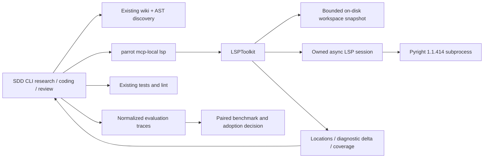

---
# SDD flow type and base branch (FEAT-145).
# - type: feature  (default)  → base_branch: dev (or any non-main branch)
# - type: hotfix              → base_branch MUST be: main
type: feature
base_branch: dev
# projects: parts of the codebase this doc concerns. Use `packages/*` dir names
#   (ai-parrot, ai-parrot-server, parrot-formdesigner, …) or an area
#   (sdd-tooling, dev-loop, admin-ui, docs, ci). Unknown values warn, not fail.
projects: [ai-parrot, ai-parrot-tools, sdd-tooling]
# tags: free-form kebab-case keywords for organizing specs (e.g. memory, mcp).
tags: [lsp, python, mcp, code-retrieval, diagnostics, evaluation]
---

# Feature Specification: Selective LSP navigation and diagnostics for SDD CLI seats

**Feature ID**: FEAT-580
**Date**: 2026-09-19
**Author**: Codex with Jesús Lara
**Status**: approved
**Target version**: next development release after 1.0.4; optional pilot
**Source**: `sdd/proposals/sdd-research-lsp.brainstorm.md`, including its resolved answers

---

## 1. Motivation & Business Requirements

### Problem Statement

Wiki discovery and AST symbol retrieval already reduce broad code searches. SDD research, coding, and review seats still need semantic evidence for particular expressions and early feedback after saved edits. Repeated searches, incorrect symbol matches, and missed callers can increase model context and review cycles. Add an optional LSP path for those questions and evaluate its incremental benefit against disciplined wiki/AST retrieval.

The brainstorm's reported 13% cost, 12% token, and 24% API-call reductions are external workload observations, not local results or universal promises. The approved local experiment uses a different baseline and explicit quality gates. ADR retrieval remains a separate exploration; semantic analysis cannot establish historical rationale.

### Goals

- Expose a standalone `parrot_tools` Python toolkit to SDD CLI research/coding/review seats through existing local MCP configuration.
- Offer precise definitions and references from a verified file position, plus baseline/checkpoint diagnostic comparisons for saved files.
- Preserve optional deployment, bounded latency/output, explicit freshness and coverage, and deterministic fallback guidance.
- Measure cost per accepted task, acceptance rate, correctness failures, wall time, repeated retrieval, and reviewer correction cycles across the approved experiment.
- Leave wiki indexing, AST retrieval, and existing test/lint gates intact.

### Non-Goals (explicitly out of scope)

- In-process dev-loop wiring, replacing the wiki, generating ADRs, or adding another LLM router.
- Other languages, unsaved editor buffers, rename/code-action execution, arbitrary LSP methods, and workspace-wide clean-bill-of-health assertions.
- Sharing mutable LSP sessions between processes/worktrees, automatic dependency installation, or an always-on multi-language daemon.
- Guaranteeing complete references for reflection, monkeypatching, dynamic registries, or string-based imports.

---

## 2. Architectural Design

### Overview

Implement brainstorm Option B as `parrot_tools.lsp.toolkit.LSPToolkit`. The toolkit owns one lazy Pyright session per instance, scoped to one explicit canonical worktree root. The existing `parrot mcp-local` factory exposes four tools. No LSP registration goes into wiki MCP or wiki core.

The agent uses wiki/AST for discovery; it calls LSP only when it needs semantic resolution or an edit checkpoint. LSP does not call models. The pilot reads only on-disk content, although it sends that content through LSP document-open/change messages so the server analyzes the exact snapshot.

Use a deliberately small stdlib `asyncio` LSP client, not the MCP transport as an LSP client. The protocols have different framing and lifecycle. Pin the pilot backend to upstream Pyright **1.1.414**, whose package exposes `pyright-langserver`; no claim of latest-version selection is made. Validate its real behavior in the mandatory integration suite before live evaluation. [Pinned upstream package](https://raw.githubusercontent.com/microsoft/pyright/1.1.414/packages/pyright/package.json).

### Component Diagram



### Integration Points

| Existing Component | Integration Type | Notes |
|---|---|---|
| `AbstractToolkit` | extends | Private lifecycle helpers; four explicitly prefixed public methods |
| Local toolkit MCP factory | extends lifecycle ownership | Factory-created server retains its toolkit and closes it on normal exit/cancellation |
| Toolkit templates/installer | adds template | `lsp.yaml`; explicit installation only; no host configuration written by this spec |
| Wiki/AST tools | workflow composition | Candidate discovery only; no calls into wiki internals from the LSP toolkit |
| SDD CLI seats | configured MCP access | Each seat/worktree receives its own resolved configuration and root |
| Existing benchmark accounting | reuses principles | Unknown usage stays unknown; new cache-aware schema is necessary |

### Data Models

All new wire models use Pydantic v2, `extra="forbid"`, explicit bounds, JSON-safe fields, and no model-generated paths or server commands in trusted configuration. Models below are new contracts, not existing APIs.

| Model | Fields and invariants |
|---|---|
| `LSPConfig` | `repo_root: Path` required and absolute; `server_command: list[str]` defaults to `["pyright-langserver", "--stdio"]`; `version_command: list[str]` defaults to `["pyright", "--version"]`; `expected_server_version: str = "1.1.414"`; `python_path: Path` defaults to the current interpreter; `source_roots: list[Path] = []`; `environment_id: str` required, identifying an immutable dependency environment; remaining limits below |
| `SourcePosition` | `path: str`, `line: int >= 1`, `column: int >= 1`, `expected_sha256: str` exactly 64 lowercase hex characters; public columns count Unicode code points, not bytes or display cells |
| `SourceRange` | `path: str`, `start_line`, `start_column`, `end_line`, `end_column`; one-based Unicode coordinates, end exclusive, repository relative POSIX path |
| `SourceState` | `path`, `sha256`, `document_version: int >= 1`; hash covers exact bytes; LSP text decoded as strict UTF-8, preserving line endings |
| `LSPLocation` | `range: SourceRange`, `sha256: str`; return only readable, confined Python source/stub locations; no source body by default |
| `LSPDiagnostic` | `range: SourceRange`, `severity: int` 1–4 (missing maps to 3 with `severity_defaulted=true`), `code: str \| None`, `source: str \| None`, `message: str` capped at 1,000 characters; comparison uses uncropped values internally |
| `EvidenceMeta` | `repo_root`, `workspace_id`, `generation: int`, `workspace_digest`, `environment_id`, `server_version`, `config_digest`, `observed_at` UTC, `source_states: list[SourceState]`, `elapsed_ms`, `cold_start: bool`, `coverage: Literal["selected_files", "static_references"]` |
| `LSPResult` | `status: Literal["ok", "partial", "unavailable", "error"]`; `operation`; `code: str \| None`; `message`; `evidence: EvidenceMeta \| None`; `locations`, `diagnostics`, `added`, `removed` lists default empty; `snapshot_id: str \| None`; `checked_paths`, `missing_paths`; `truncated: bool`; `omitted_count: int`; `fallback: str \| None` |
| `DiagnosticSnapshot` | Private in-memory record: random ID, exact sorted path set, environment/config/server identities, generation, source states, complete uncropped diagnostic sets and creation time; maximum eight snapshots, LRU, 30-minute TTL |

Operational error codes are fixed: `invalid_request`, `path_outside_root`, `unsupported_language`, `file_missing`, `invalid_encoding`, `file_too_large`, `position_out_of_range`, `source_changed`, `workspace_changed`, `workspace_limit`, `server_missing`, `server_version_mismatch`, `startup_timeout`, `request_timeout`, `diagnostics_timeout`, `diagnostics_unversioned`, `unsupported_capability`, `server_crashed`, `protocol_error`, `resource_limit`, `baseline_missing`, `baseline_scope_mismatch`, `baseline_incompatible`, `result_limit`.

Configurable limit fields are `startup_timeout_s=20`, `request_timeout_s=10`, `diagnostics_timeout_s=20`, `idle_timeout_s=120`, and `node_heap_mb=1024`; validate against the maxima in the session contract (idle timeout 30–600 seconds). Other caps are fixed pilot constants. `environment_id="operator-unconfigured"` returns `status="unavailable", code="invalid_request"` before any process starts. Missing model-provided source hashes are validation errors, not permission to infer freshness.

Invalid trusted constructor configuration raises `ValueError`; malformed tool arguments use the existing schema-validation envelope, with `invalid_request` for additional semantic validation. Expected runtime failures return `LSPResult`; `asyncio.CancelledError` is propagated after bounded cleanup. Empty successful locations mean no static matches found, not proof of no callers.

### New Public Interfaces

Methods are named with the `lsp_` prefix directly; set `tool_prefix=""` to avoid double prefixing. All helpers remain private. `auto_open=False`: each method validates input first, then calls a private acquisition path so server errors can be returned in the typed envelope instead of escaping from the framework's pre-method hook.

```python
# New: packages/ai-parrot-tools/src/parrot_tools/lsp/toolkit.py
class LSPToolkit(AbstractToolkit):
    """Optional Python semantic evidence for saved worktree files."""

    def __init__(self, config: LSPConfig | dict[str, Any], **kwargs: Any) -> None:
        """Validate trusted settings without spawning a server or reading source."""

    async def lsp_definition(
        self, path: str, line: int, column: int, expected_sha256: str
    ) -> LSPResult:
        """Resolve a verified expression; return bounded locations or an explicit failure."""

    async def lsp_references(
        self, path: str, line: int, column: int, expected_sha256: str,
        include_declaration: bool = False, limit: int = 50
    ) -> LSPResult:
        """Find static references; limit is 1–200 and truncation is explicit."""

    async def lsp_diagnostics(self, paths: list[str]) -> LSPResult:
        """Analyze 1–20 saved Python files and retain a complete baseline when possible."""

    async def lsp_diagnostic_delta(self, baseline_id: str, paths: list[str]) -> LSPResult:
        """Compare the same file set after saved edits; unknown coverage never means clean."""
```

The toolkit neither edits files nor automatically invokes fallback tools. Its error text recommends wiki/AST/source inspection for navigation, or tests/lint for diagnostics. Seats make at most one fallback attempt per failed operation and do not repeatedly restart an unavailable server in the same turn.

### Session, freshness, and resource contract

1. **Identity and confinement.** Canonicalize `repo_root`; confirm a Git worktree and bind the instance permanently to it. Reject per-call root overrides, traversal, non-file URIs, symlinks escaping the root, directories, FIFOs, and non-UTF-8 input. Pilot tools accept `.py` and `.pyi`. External dependency locations may be used by Pyright for analysis but are omitted from results with partial status; this pilot does not read their contents back to the agent.
2. **Environment.** Maintainers provision the pinned executable and Node runtime; users/CI provide the interpreter and immutable environment identity. Configure `python.pythonPath`, `python.analysis.extraPaths` from canonical in-root `source_roots`, `python.analysis.diagnosticMode="openFilesOnly"`, and `python.analysis.typeCheckingMode="standard"`. Honor explicit project overrides and record the effective configuration, including diagnostic suppressions. An environment change requires a new instance/environment ID and invalidates baselines. [Pinned Pyright settings](https://raw.githubusercontent.com/microsoft/pyright/1.1.414/docs/settings.md).
3. **Workspace snapshots.** A subprocess helper computes a deterministic manifest of Git tracked and non-ignored untracked `.py`/`.pyi` files plus tracked/untracked non-ignored `pyrightconfig.json`, `pyproject.toml`, `uv.lock`, `.python-version`, and referenced in-root Pyright configuration files. Use `git ls-files -z` with argument arrays; deduplicate paths. Reject an ignored/unlisted target explicitly. Include file bytes/hashes, canonical root and effective settings in the digest; missing tracked paths are tombstones. Stable open/fstat/read/fstat and a second manifest check detect ordinary concurrent edits. This is a checkpoint consistency contract, not filesystem snapshot isolation against adversarial writers.
4. **Conservative invalidation.** One semantic operation holds the per-instance session lock. Reuse a warm session only while the workspace and configuration digests are unchanged. Restart after any manifest change, rather than serving cross-file answers from an invalid cache. Recheck the manifest after the response; if changed, discard the response as `workspace_changed`. Saved edits therefore incur a restart in this pilot. This deliberate cost must appear in the benchmark; incremental dependency invalidation is deferred until justified by results. Baselines may survive source-only restarts but not changed environment/config/server identities.
5. **On-disk LSP documents.** Open exact decoded snapshots with monotonically increasing versions. Keep at most 20 documents open; close documents not needed by the current operation. Advertise UTF-16 only and convert one-based Unicode public positions to zero-based UTF-16 LSP positions; validate surrogate-boundary conversion on responses. `Location` and `LocationLink` normalize into one location model. Full-text change notifications contain disk snapshots only; there is no editor-buffer API.
6. **Startup/protocol.** Launch via `asyncio.create_subprocess_exec`, cwd=canonical root, stdin/stdout pipes, continuously drained capped stderr. Send `initialize` with root URI, workspace folder, parent PID, supported capabilities; await response; then `initialized` and configuration. Check definition/reference capabilities. Verify version using a bounded companion `pyright --version` argv command configured alongside the server; compare any supplied `serverInfo.version` too. Include executable identities in config provenance. Custom commands are trusted operator configuration, never tool-call inputs.
7. **Framing/requests.** LSP uses Content-Length byte framing; incrementing request IDs map to pending futures. Handle fragmented/multiple frames and interleaved notifications. Respond to `workspace/configuration`, `workspace/workspaceFolders`, and `window/workDoneProgress/create`; consume progress/log notifications without injecting them into model context. Do not advertise dynamic registration; unsupported requests receive JSON-RPC method-not-found. Reject `workspace/applyEdit` with `applied=false`. No `executeCommand`, rename, or arbitrary method tool. [LSP framing specification](https://raw.githubusercontent.com/microsoft/language-server-protocol/gh-pages/_specifications/lsp/3.17/specification.md).
8. **Diagnostics.** Pilot uses versioned push diagnostics. Advertise version support; accept only publications for exactly the current open-document version and session generation. A complete empty publication clears earlier diagnostics. Notifications for other files are ignored for checkpoint coverage. Wait until every requested file has a matching publication, within the budget; timeout or unversioned publications yield partial/unavailable and no baseline. Never infer completion from silence, a debounce timer, or a navigation response. Pinned upstream source includes document versions in push diagnostics; real-server tests must confirm the empty-result case. [Pyright diagnostic publication](https://raw.githubusercontent.com/microsoft/pyright/1.1.414/packages/pyright-internal/src/languageServerBase.ts).
9. **Repeated diagnostics.** When a warm session already has a matching complete publication for unchanged manifest/content, reuse it. Otherwise update/open requested documents with fresh versions and wait. Both snapshots must cover the exact same sorted paths. Compare diagnostic multisets by `(path, source, code, severity, full_message)`, preserving counts; ranges are reported but excluded from matching to avoid turning a line insertion into spurious fixes/new errors. This is a coarse diagnostic delta, not stable issue identity. Baseline expiration, eviction, restart of the MCP process, and incompatible configuration are explicit errors. Delta reports retain current complete snapshot only when all input sets are complete; deleted paths produce missing coverage, not automatic removal of all diagnostics.
10. **Bounds.** Defaults: startup 20 seconds (maximum 60); navigation 10 seconds (maximum 30); diagnostics 20 seconds (maximum 60); each manifest pass 10 seconds; total call deadline 90 seconds including startup/checks/cleanup. One server and one in-flight semantic operation per instance; no internal retry of a semantic request. Idle session shutdown after 120 seconds. File limit 1 MiB, manifest limit 10,000 files/128 MiB; headers 8 KiB, frames 8 MiB, stderr ring 64 KiB; maximum 2,000 raw diagnostics per snapshot, 200 rendered items, JSON result 32 KiB. If an internal cap prevents a complete baseline, no baseline ID is emitted. Rendered truncation of a complete stored set is allowed but is always marked partial. Node old-space cap defaults to 1,024 MiB, configurable up to 2,048 MiB through trusted settings; record RSS separately because heap cap is not an RSS guarantee.
11. **Shutdown.** `_close()` serializes against calls, cancels pending waits, sends `shutdown`, then `exit`, waits 2 seconds, terminates, waits 2 seconds, then kills/reaps if necessary. Close pipes and drain tasks even after partial startup. Call `super()._close()` in a `finally` block. `_open()` establishes ownership only; server startup is lazy after validation/snapshot. The MCP factory must close owned toolkit resources in `start()`'s `finally` and `stop()`, idempotently. SIGTERM handling in the local CLI schedules cancellation/cleanup; SIGKILL cannot guarantee application-level cleanup and is an explicit limitation.

### Evaluation contract

Five arms: `current`, `wiki_ast` (Option A), `lsp_navigation`, `lsp_diagnostics`, `lsp_combined`. Use 12 tasks × 3 paired repetitions × 5 arms = **180 task attempts**, before explicitly recorded retries. The four semantic tools are filtered per arm. Identical task checks, baseline commits, model settings, dependencies, and price basis apply; counterbalance arm order, use isolated clean working states, record cold first calls and warm subsequent calls separately. Record prompt-cache state separately from LSP warmth.

Tasks are fixed before measurement: four investigations (duplicate names, re-export/import alias, namespace-package import, inherited receiver); four changes (signature/callers, return-type consumers, decorator wrapper, registry-driven dispatch); four fixes (wrong import, type mismatch, stale saved dependency, unavailable server). Each includes reviewed expected evidence and behavior tests; dynamic/registry tasks require supplementary text search. The unavailable-server arm uses fallback, not automatic exclusion from results. Keep ADR availability identical across all arms.

The harness accepts normalized seat trace JSONL and a manifest of operator-configured CLI argv commands; it must not invent a provider SDK integration. Collect every seat's calls/retries including research/review, cache categories, outputs/reasoning as reported, tool invocations, LSP operations, server startup/CPU/RSS, result bytes, elapsed time, acceptance checks, missed-reference defects, repeated reads/edits, and reviewer correction cycles. Trace adapters label unknown fields and preserve raw log references. Full source/prompts need not be committed.

Use a new cache-aware `ModelUsage` schema: unique `(attempt_id, seat_id, request_id)`, model/version, uncached input, cache read, cache writes by reported class, output, non-overlapping separately billed reasoning if applicable, actual billed cost if available, category semantics, and provenance. Counts/prices may be `None`; unknown never becomes zero. Provider total-input/output figures are checks, not additional billable categories. Prefer actual billed cost or sum disjoint categories against pinned rates; inconsistent or unrecognized accounting makes the cost gate inconclusive.

For each arm: total model cost across **all** attempts divided by accepted task count; if zero accepted or any cost unknown, metric/gate is inconclusive. Compare B-combined against `wiki_ast`, not `current`. Report acceptance by task/repetition, pooled and paired cost differences, medians/p95, correction cycles, and cold/warm lookup timings. Store deterministic summary JSON/Markdown plus a coverage manifest; missing traces must not be silently dropped.

**Adoption gate (approved):** at least 10% lower model cost per successful task, no observed acceptance-rate/correctness regression, and at most 10% median task wall-time regression against A. Report task-level regressions, not just aggregates. The pilot has limited statistical power; report uncertainty and inconclusive outcomes. A no-go result completes the research deliverable and leaves the toolkit opt-in; it does not authorize weakening the gate. The brainstorm's optional correctness-led alternative is not an approved replacement gate.

---

## 3. Module Breakdown

#### Delegation-eligible modules

Eligibility describes future task execution, not delegation performed while drafting this spec.

| Module | Eligible? | Decided patterns / exact contracts | Why not (if no) |
|---|---|---|---|
| M1: Models and snapshots | yes | §2 models/codes/caps; worker subprocess; `models.py`, `snapshot.py` | — |
| M2: LSP session | yes | §2 framing, requests, lifecycle; `protocol.py`, `session.py` | — |
| M3: Toolkit and deltas | yes | Four signatures, version matching, snapshot TTL/multiset comparison; `toolkit.py` | — |
| M4: MCP lifecycle and CLI exposure | yes | Owned-server wrapper, EOF/cancellation cleanup, explicit template; paths below | — |
| M5: Evaluation harness and fixtures | yes | Five arms/180 attempts, normalized traces, exact gate; new benchmark package | — |
| M6: Real-seat run and interpretation | no | Run/reports contract fixed | Requires provisioned CLI seats, actual usage/pricing, and human acceptance review; results cannot be manufactured |

### Module 1: Models and bounded snapshot worker

- **Paths (new):** `packages/ai-parrot-tools/src/parrot_tools/lsp/{__init__,models,snapshot}.py`.
- **Responsibility:** validate contracts, confine file reads, hash workspace snapshots off the event loop in a subprocess, enforce stable reads/budgets, convert positions.
- **Depends on:** stdlib, Pydantic; no wiki import.
- **Interface Skeleton:**

```python
async def capture_workspace(config: LSPConfig, paths: list[str]) -> WorkspaceSnapshot:
    """Return bounded stable source states/digest; raise LSPFailure with a fixed code."""

def to_lsp_position(text: str, line: int, column: int) -> dict[str, int]:
    """Convert validated one-based Unicode coordinates to zero-based UTF-16."""
```

`WorkspaceSnapshot` is private and contains digest, file hashes, requested source text, configuration digest, and missing paths. `LSPFailure` carries one fixed code and bounded detail. `snapshot.py` supports a private JSON-in/JSON-out subprocess entry point; never expose that helper as an agent tool. A subprocess uses ordinary synchronous file operations internally; no thread offload or event-loop hashing.

### Module 2: Framed transport and owned Pyright session

- **Paths (new):** `packages/ai-parrot-tools/src/parrot_tools/lsp/{protocol,session}.py`.
- **Responsibility:** async framing, initialization/config requests, capabilities, child lifecycle, timeouts/cancellation, versioned notification routing, and resource accounting.
- **Depends on:** M1.
- **Interface Skeleton:**

```python
class PyrightSession:
    """One worktree/configuration generation; never shared across processes."""

    async def start(self, config: LSPConfig, generation: int) -> None:
        """Initialize a pinned backend; clean partial resources on failure."""

    async def request(self, method: str, params: dict[str, Any], timeout_s: float) -> Any:
        """Internal allowlisted request; raise LSPFailure on bounded protocol failure."""

    async def sync_documents(self, sources: list[SourceState], texts: dict[str, str]) -> None:
        """Open/change/close exact on-disk documents with explicit versions."""

    async def diagnostics(self, sources: list[SourceState], timeout_s: float) -> DiagnosticBatch:
        """Return version-matched publications and explicit missing/unversioned coverage."""

    async def close(self) -> None:
        """Idempotently stop, drain, terminate if needed, and reap the child."""
```

`DiagnosticBatch` contains complete per-path uncropped diagnostic lists, matched versions, and missing/unversioned paths. It never represents unknown coverage by an empty complete list.

### Module 3: Agent-facing toolkit and diagnostic baselines

- **Path (new):** `packages/ai-parrot-tools/src/parrot_tools/lsp/toolkit.py`.
- **Responsibility:** implement §2 public interfaces, pre/post snapshot verification, lazy session restart, bounded response normalization, baseline storage/comparison, and fallback messages.
- **Depends on:** M1/M2 and `AbstractToolkit`.
- **Interface Skeleton:** the four public signatures in §2 are authoritative; private `_open() -> None` and `_close() -> None` override existing lifecycle hooks. `cleanup() -> None` awaits `_close()`; cleanup is idempotent. Public methods acquire the per-instance operation lock; `_close()` waits/cancels safely without recursive lock acquisition.

### Module 4: Local MCP lifecycle and seat configuration

- **Paths (modify):** `packages/ai-parrot/src/parrot/mcp/toolkit_server.py`; `packages/ai-parrot/src/parrot/mcp/local_cli.py`.
- **Paths (new):** `packages/ai-parrot/src/parrot/mcp/_toolkit_templates/lsp.yaml`; `examples/lsp-mcp.yaml`; `docs/sdd/lsp-pilot.md`.
- **Responsibility:** retain factory-created toolkit ownership with a private `_ToolkitStdioMCPServer(StdioMCPServer)` that wraps `start()` in `try/finally` and closes the toolkit on `stop()`; guard duplicate cleanup. Close `_opened` resources then `cleanup()`, isolating/logging failures and applying a 10-second overall cleanup budget. CLI SIGTERM handling must restore prior handlers and leave other CLI commands unchanged. Test both new resource-owning and ordinary existing toolkits.
- **Depends on:** M3; existing factory/config/template mechanisms.
- **Interface Skeleton:** preserve `create_toolkit_mcp_server(name: str, root: Path = Path.cwd(), **overrides: Any) -> StdioMCPServer`; do not change caller contracts. Private owned-server constructor adds `toolkit: AbstractToolkit`; override `async def start(self) -> None` and `async def stop(self) -> None`.

The template declares `class: parrot_tools.lsp.toolkit.LSPToolkit`, `requires_dist: ai-parrot-tools`, `requires_llm: false`, nested `kwargs.config.repo_root: {{repo_root}}`, and `environment_id: operator-unconfigured`. That sentinel returns unavailable before spawning until the operator sets a real immutable environment ID. List/install must not start Pyright. Four tools only; no LLM settings needed.

Document explicit per-worktree installation/configuration and visibility checks in **every** research/coding/review seat. An installed absolute root from a parent checkout must not be copied blindly into a child worktree; re-render its config or provide an explicit per-worktree config. Verify visibility through the actual CLI host; a server-level tools/list success alone does not prove delegated-seat availability. Fallback-only seats are recorded as such. Do not modify host configs or managed SDD skills as part of library installation without the existing explicit install action.

### Module 5: Benchmark package and curated tasks

- **Paths (new):** `benchmarks/sdd_lsp/{__init__,__main__,models,runner,accounting,report}.py`; `benchmarks/sdd_lsp/tasks.yaml`; `benchmarks/sdd_lsp/fixtures/`.
- **Responsibility:** validate task/arm manifests, run configured CLI argv commands in controlled disposable worktrees, import normalized trace records, execute task checks, and produce auditable reports. This is an external CLI experiment, not dev-loop wiring or provider SDK usage.
- **Depends on:** M4 for live mode; offline accounting tests require no server/model access.
- **Interface Skeleton:**

```python
async def run_pilot(manifest: PilotManifest, output_dir: Path) -> PilotReport:
    """Run bounded configured seats/checks; preserve every attempted task and failure."""

def evaluate_gate(attempts: list[AttemptRecord], prices: PriceBook) -> GateResult:
    """Return go/no_go/inconclusive; unknown usage or incomplete arms cannot pass."""
```

`PilotManifest` requires pinned task commit/fixtures, seat argv, exact model/version/settings, timeout and spending ceiling, price provenance and cache semantics, three repetitions, all five arms, and counterbalanced ordering. `AttemptRecord` joins acceptance/review results, raw trace references, normalized usage, tool/LSP counters, cold/warm metrics and failure reasons by attempt ID. No live default; `--live` and a complete manifest are required. Unknown cost during execution stops launching further live attempts so the configured spending ceiling remains meaningful. Offline fixture reports are labeled synthetic and cannot satisfy the live gate.

### Module 6: Live evaluation and decision record

- **Paths (new):** `docs/sdd/lsp-pilot-results.md`; runtime reports under `artifacts/sdd-lsp/` and logs under `artifacts/logs/`.
- **Responsibility:** provision environments and CLI seats, review task ground truth before execution, run the approved matrix, verify trace completeness, and record go/no-go/inconclusive with evidence. No source-code interface.
- **Depends on:** M1–M5 passing verification and an operator-supplied run manifest/spending ceiling. Retain only lightweight deterministic summaries in Git; no secrets, raw private prompts, or bulky transcripts.

---

## 4. Test Specification

### Unit Tests

All toolkit tests live under `packages/ai-parrot-tools/tests/lsp/`; MCP lifecycle tests live under `packages/ai-parrot/tests/mcp/`.

| Test | Module | Description |
|---|---|---|
| `test_model_bounds_and_unknown_status` | M1 | Invalid settings, sentinel environment, code/status mappings and nullable accounting |
| `test_workspace_confinement_and_races` | M1 | Traversal, symlinks, FIFOs, ignored targets, deleted tracked files, untracked files, edits during reads |
| `test_workspace_digest_dependency_change` | M1/M3 | Non-target dependency/config change invalidates session; same-size edit still changes hash |
| `test_unicode_positions` | M1 | CRLF, tabs, astral characters, EOF, invalid columns, half-surrogate server ranges |
| `test_framing_and_interleaving` | M2 | Fragmented headers/bodies, byte lengths, multiple frames, malformed/oversized frames, notifications amid requests |
| `test_server_requests_and_mutations` | M2 | Configuration/folders/progress replies; unsupported methods and applyEdit rejection |
| `test_startup_timeout_and_partial_cleanup` | M2 | Missing executable, wrong version, startup failure, stderr flood, dead child, no orphan |
| `test_lifecycle_cancel_idle_shutdown` | M2/M3 | Cancellation, idle timer, bounded escalation and reaping, restart after failed init |
| `test_definition_reference_normalization` | M3 | Location/LocationLink, deduplication, external paths, null/empty results and result caps |
| `test_diagnostic_freshness` | M2/M3 | Ignore older generations/versions; accept complete empty publication; unversioned/missing never clean |
| `test_baseline_delta_scope_and_counts` | M3 | Exact scope, TTL/LRU, incompatible config, line shifts, duplicate diagnostics, deletion and incomplete sets |
| `test_tool_schema_exactly_four_methods` | M3/M4 | Private helpers/lifecycle cannot become tools; no unsafe args or double prefixes |
| `test_owned_mcp_toolkit_cleanup` | M4 | EOF, exceptions, SIGTERM/cancellation, explicit stop, repeated close; existing toolkit compatibility |
| `test_template_is_explicit_and_root_scoped` | M4 | No implicit resolution; no process on install/list; correct per-worktree nested config |
| `test_cache_accounting_and_gate` | M5 | Disjoint billing categories, unknowns, failed attempts, zero successes, duplicate/missing trace IDs, exact boundary percentages |
| `test_pilot_manifest_and_matrix` | M5 | All 180 attempts scheduled, arm isolation, retries charged, incomplete runs inconclusive, spending stop |

### Integration Tests

| Test | Description |
|---|---|
| `test_fake_server_stdio_end_to_end` | Real subprocess fake LSP with deterministic protocol faults through the toolkit and raw local MCP |
| `test_pyright_pinned_navigation` | Provisioned 1.1.414: aliases, inherited receivers, duplicate symbols, PEP 420 imports across distribution roots |
| `test_pyright_saved_edit_diagnostic_delta` | Baseline, saved type/import error, removal; require versioned empty and non-empty publications and correct source hashes |
| `test_pyright_dependency_restart` | Saved non-target dependency change triggers new session; old publication cannot satisfy new checkpoint |
| `test_two_worktrees_and_concurrent_callers` | Divergent contents/root configs never share evidence; per-instance requests serialize |
| `test_mcp_eof_reaps_child` | Start server, trigger Pyright/fake child, close stdin and assert no surviving child |
| `test_cli_seat_visibility_and_fallback` | Research/coding/review host checks list and call tools independently; missing backend gives explicit fallback |
| `test_live_pilot_report` | Opt-in 180-attempt matrix with complete normalized usage and real behavioral checks; no fake savings |

### Test Data / Fixtures

- A small Python namespace workspace with two distributions, duplicate identifiers, alias/re-export, inheritance, decorator, string registry, and referenced/unreferenced functions.
- Unicode/CRLF files; invalid UTF-8; outside-root symlink; untracked and ignored files; mutable dependency/config fixtures.
- Scripted fake LSP child supporting delayed, missing, out-of-order, malformed and unversioned diagnostics plus shutdown refusal.
- Normalized trace fixtures with cache reads/write classes, actual billing, unknown usage, duplicate request IDs, unsuccessful attempts, and zero-success arms.
- Real Pyright tests carry an explicit integration marker and prerequisite check. A missing executable may skip ordinary offline CI, but cannot count as satisfying feature acceptance.

---

## 5. Acceptance Criteria

- [ ] Four documented tools are available through an explicitly installed standalone local MCP toolkit in the selected CLI seats; no wiki/dev-loop wiring is added.
- [ ] Toolkit import, construction, tool listing, and installation perform no server startup, source scan, network access, or dependency installation.
- [ ] Definitions/references match curated static fixtures, normalize positions correctly, honor hashes/root boundaries/caps, and label incomplete coverage.
- [ ] A changed workspace never reuses an earlier generation's semantic evidence; cold restart cost is measured.
- [ ] Diagnostic baselines/deltas are versioned, scope-matched, bounded, and tested against pinned Pyright, including empty publications; unknown results never appear clean.
- [ ] EOF, cancellation, normal stop, idle timeout, partial startup, and CLI SIGTERM exercise bounded process cleanup without orphan children in supported tests.
- [ ] The selected offline tests, pinned real-server tests, MCP regression tests, formatter and scoped Ruff checks pass. Logs are stored under `artifacts/logs/`.
- [ ] Documentation includes environment provisioning, PEP 420 source roots, per-worktree host visibility, fallback instructions, limitations, and no automatic mutation/dependency installation.
- [ ] The approved 12-task/3-repetition/five-arm live experiment is executed or explicitly reported incomplete; only a complete audited run completes the evaluation module. A negative complete result is valid research, not a reason to fabricate or weaken success thresholds.
- [ ] Adoption is enabled only after ≥10% lower model cost per accepted task against A, no observed acceptance/correctness regression, and ≤10% median wall-time regression. Otherwise remain opt-in and record no-go/inconclusive.
- [ ] Public existing toolkit/wiki APIs retain compatibility; library/schema changes remain within the listed scope.

Run from the activated repository environment: scoped `pytest` for the new `lsp` suite and touched MCP tests, `black --check` and `ruff check` for touched Python files. The task breakdown must enumerate actual test files after implementation; no nonexistent root `tests/unit` path is assumed.

---

## 6. Codebase Contract

Verified against the isolated checkout used for this draft. Wiki was queried first and its MCP toolkit page inspected; that page still described implicit built-ins, whereas current source/docs require explicit configuration. Current source is authoritative. Source-level import verification below does not claim runtime import smoke tests.

### Verified Imports

```python
from parrot.tools.toolkit import AbstractToolkit
# packages/ai-parrot/src/parrot/knowledge/wiki/structural/toolkit.py:23
from parrot.mcp.local_server import StdioMCPServer
# packages/ai-parrot/src/parrot/mcp/toolkit_server.py:22
from parrot.mcp.server_base import LocalServerConfig
# packages/ai-parrot/src/parrot/mcp/toolkit_server.py:23
from parrot.mcp.toolkit_config import load_toolkits_config
# packages/ai-parrot/src/parrot/mcp/toolkit_server.py:24
from pydantic import BaseModel, Field
# packages/ai-parrot/src/parrot/knowledge/wiki/structural/service.py:19
```

### Existing Class Signatures

| Path and line | Contract verified |
|---|---|
| `packages/ai-parrot/src/parrot/tools/toolkit.py:321` | `AbstractToolkit.__init__(self, **kwargs)`; instance logger at 356, `_opened` at 361 |
| `packages/ai-parrot/src/parrot/tools/toolkit.py:390` | `async def _open(self) -> None`; partial startup cleanup is override-owned |
| `packages/ai-parrot/src/parrot/tools/toolkit.py:406` | `async def _close(self) -> None`; reset `_opened` through `super()` |
| `packages/ai-parrot/src/parrot/tools/toolkit.py:419` | `async def _ensure_open(self) -> None`; guarded by `_open_lock` |
| `packages/ai-parrot/src/parrot/tools/toolkit.py:145` | `ToolkitTool._execute(self, **kwargs) -> Any`; auto-open at 171 happens before bound method |
| `packages/ai-parrot/src/parrot/mcp/toolkit_server.py:29` | `create_toolkit_mcp_server(name: str, root: Path = Path.cwd(), **overrides: Any) -> StdioMCPServer`; constructor kwargs forwarded at 114, tools obtained at 119, server created at 153 |
| `packages/ai-parrot/src/parrot/mcp/local_server.py:44` | `StdioMCPServer.start(self)` exits on stdin EOF; existing body has no toolkit cleanup |
| `packages/ai-parrot/src/parrot/mcp/local_server.py:80` | `StdioMCPServer.stop(self)` only sets `_running=False`; it does not close toolkit resources |
| `packages/ai-parrot/src/parrot/mcp/toolkit_seed.py:49` | `available_templates() -> tuple[str, ...]`; names derived from packaged YAML |
| `packages/ai-parrot/src/parrot/mcp/toolkit_seed.py:304` | `seed_toolkit_sections(root: Path, names: Sequence[str]) -> SeedResult`; root placeholder rendering and non-overwriting section insertion |
| `packages/ai-parrot/src/parrot/knowledge/wiki/structural/toolkit.py:101` | `symbol_lookup(self, query: str, kind: str \| None = None, language: str \| None = None, path_prefix: str \| None = None, limit: int = 20) -> dict[str, Any]` (async) |
| `packages/ai-parrot/src/parrot/knowledge/wiki/structural/service.py:48` | `SymbolHit` has line spans/hash-independent stale flag, not an identifier column or LSP document version |
| `packages/ai-parrot/src/parrot/knowledge/wiki/context.py:208` | `pack_results(results: Iterable[Any], budget_tokens: int = DEFAULT_BUDGET_TOKENS) -> PackedContext`; first oversized stub may exceed budget at 245 |
| `benchmarks/tool_optimizations/accounting.py:68` | `UsageRecord` preserves missing tokens/provenance; existing `PriceRow` at 86 has input/output rates only, not a cache-aware cost contract |

### Integration Points

| New Component | Connects To | Via | Verified At |
|---|---|---|---|
| `LSPToolkit` | `AbstractToolkit` | private lifecycle hooks; four generated public methods | `packages/ai-parrot/src/parrot/tools/toolkit.py:390` |
| `lsp.yaml` | `create_toolkit_mcp_server` | dotted class plus nested `kwargs.config` | `packages/ai-parrot/src/parrot/mcp/toolkit_server.py:110` |
| Owned-server wrapper | `StdioMCPServer` | `start` finally/`stop`, factory retains toolkit | `packages/ai-parrot/src/parrot/mcp/local_server.py:44` |
| Explicit install | template seeding | same `{{repo_root}}` mechanism as bounded-source | `packages/ai-parrot/src/parrot/mcp/_toolkit_templates/bounded-source.yaml:6` |
| CLI seat workflow | existing structural toolkit | agent chooses existing discovery tools separately | `packages/ai-parrot/src/parrot/knowledge/wiki/structural/toolkit.py:101` |

### Does NOT Exist (Anti-Hallucination)

- No existing LSP client/toolkit/dependency was found in the inspected tools package/manifests; all `parrot_tools.lsp.*` paths and models are new.
- Existing local MCP `stop()` does not implicitly call `ToolManager.cleanup_toolkits`; the factory does not instantiate a ToolManager for this purpose.
- `SymbolHit` is not a verified LSP source position. A line number and symbol name cannot silently substitute for hash/column validation.
- The current benchmark price model cannot distinguish cache reads/writes; reusing its totals unchanged would give misleading LSP cost comparisons.
- No installed Pyright/version, live seat availability, or completed local savings measurement is assumed by this spec.

---

## 7. Implementation Notes & Constraints

### Patterns to Follow

- Python async-first; stdlib process/stream orchestration, Pydantic v2, `self.logger`, `black`, scoped `ruff check`.
- No new Python client library is required. Keep the supported LSP subset explicit and test it with real byte streams, not mocks alone.
- Never import or modify `AbstractClient` for this feature. Toolkit operations contain no LLM calls; the benchmark runs configured CLI seats.
- Build subprocess argv as lists; never shell-interpolate commands, paths, source text, or server arguments.
- Treat output caps and coverage as separate concepts; small output does not establish a complete analysis.
- Do not overwrite existing MCP configs, Pyright configuration, environment files, or source. Provisioning is an explicit operator step.

### Known Risks / Gotchas

- Conservative whole-workspace hashing/restarts may eliminate expected savings. This is measurable pilot overhead; an unfavorable result is valid.
- Pyright's diagnostic version behavior is verified in upstream source but must pass integration tests; capability advertisement alone does not prove freshness.
- Heap limits are not hard process-tree memory limits. CI can apply its existing process/container limit; RSS remains a measured metric and OOM must become unavailable/error.
- Dependency environments outside the worktree are an immutable precondition keyed by `environment_id`; mutating them mid-run invalidates the experiment. Project overrides/suppressions must be visible in provenance.
- Factory lifecycle changes affect all local toolkit servers; regression tests must cover a toolkit with no acquired resources, lazy initialization failure, and repeated cleanup.
- A changed line can correspond to a moved diagnostic. Multiset deltas deliberately make a coarse comparison; tests and review remain authoritative.
- CLI hosts may expose different tools to child seats. Each measured seat needs an actual visibility probe; do not generalize one host's result to all.

### External Dependencies

| Package / Tool | Version | Reason / ownership |
|---|---|---|
| `ai-parrot`, `ai-parrot-tools` | current workspace; version files report 1.0.4 | Existing toolkit/MCP/runtime; no new mandatory extra |
| Pydantic / Python stdlib | repository Pydantic v2 and supported Python runtime | Validation and bounded asynchronous subprocess client |
| Pyright upstream executable | **1.1.414** pinned | Approved candidate; operator/CI provisions executable before real-server tests; no runtime install |
| Node.js | operator-pinned supported release recorded in run manifest | Required by upstream Pyright; not a Python runtime dependency; exact Node patch is environment-specific |

The exact upstream package and settings were inspected through primary sources. No dependency was installed during specification. A future Pyright pin change requires a spec revision and rerun of real-server fixtures before results are compared.

### Worktree Strategy

- **Isolation:** per-spec; one feature worktree for M1–M6.
- M1 precedes M2/M3; M4 depends on M3; benchmark schema/fixtures can be prepared after §2 contracts are fixed, then live execution follows all integration tests.
- Keep one owner for protocol/freshness/lifecycle. M4 changes the shared MCP factory/CLI and must coordinate with other toolkit features; ADR exploration shares no implementation files.
- This spec was drafted in `docs/sdd-research-lsp-spec` under `/tmp/ai-parrot-sdd-research-lsp-spec` because the main checkout held unrelated edits. The required allocator ran on clean `dev` in `/tmp/ai-parrot-sdd-research-lsp-base` and reserved FEAT-580. Only the spec is included in its authoring commit.

---

## 8. Open Questions

Resolved brainstorm answers are preserved verbatim below. Specification decisions refine the remaining operational details without reopening approved scope.

- [x] Flow defaults — *Owner: Codex*: `type: feature`, `base_branch: dev`, applied per skill defaults; no explicit user confirmation received.
- [x] Provenance of percentages — *Owner: Codex*: located Marmelab's primary report; workload-specific observations, not local measurements.
- [x] Which host and seats are first consumers — *Owner: Jesús* (2026-09-19): SDD CLI research/coding/review seats are the first consumers. In-process dev-loop agents are not wired in during this pilot.
- [x] Is Python-only navigation plus diagnostics the approved initial scope — *Owner: Jesús* (2026-09-19): Yes, Python-only, both navigation and diagnostics, matching Option B as recommended.
- [x] Which representative tasks and cost/quality/latency thresholds should govern the pilot — *Owner: Jesús* (2026-09-19): Accepted the brainstorm's proposal as-is — the 12-task design (§ Experiment and decision gate, step 1), 3 paired repetitions per task/arm, and the proposed gate (≥10% lower model cost per successful task vs. A, no acceptance-rate/correctness regression, ≤10% median wall-time regression).
- [x] Which server executable/version and client adapter should be approved, and who owns environment provisioning — *Owner: Jesús* (2026-09-19): Pyright approved as the pilot candidate server. Provisioning ownership and exact version pin remain for specification time.
- [x] Should access reuse an existing host LSP session, use an optional standalone toolkit, or extend wiki MCP — *Owner: Jesús* (2026-09-19): Standalone optional toolkit in `parrot_tools`, owning its own server lifecycle, kept out of wiki core.
- [x] Are on-disk checkpoints sufficient, and what freshness, timeout, and memory budgets are acceptable — *Owner: Jesús* (2026-09-19): On-disk checkpoints only for the pilot; unsaved/in-memory edit synchronization is out of scope and the limitation is declared explicitly (see Edge Cases & Error Handling).
- [x] Exact backend/client/provisioning — *Owner: spec author*: Pyright 1.1.414; bounded stdlib async adapter; environment owner/CI provisions dependencies. Limits and restart/freshness behavior are fixed in §2.
- [ ] Which concrete CLI/model versions, immutable environment IDs, real task commits, price basis, and spending ceiling should the live run manifest use? — *Owner: Jesús / experiment operator*: execution prerequisite for M6; does not block implementation of the deterministic toolkit/harness contracts.

---

## 9. Design Research Cross-Check

**Status:** skipped (no independent review seat was invoked for this spec). **Model:** not applicable. **Transcript:** none. The table below records the author's codebase cross-checks, not an independent design opinion.

| # | Suggestion (kind) | Disposition | Reason | Landed in |
|---|---|---|---|---|
| S1 | Explicit local-toolkit declaration (integration) | CONFIRM | Wiki page was stale; current source/docs require an installed section | §2, M4, §6 |
| S2 | Add owned MCP lifecycle cleanup (risk) | CONFIRM | Current EOF/stop path does not close toolkit resources | §2, M4, §4 |
| S3 | Preserve conservative freshness even if costly (architecture) | CONFIRM | Savings cannot justify stale semantic evidence | §2 session contract |
| S4 | Reuse existing benchmark cost formula unchanged (testing) | REJECT | It lacks cache billing categories | §2 evaluation, M5 |
| S5 | Fix paid-run environment manifest now (execution) | ESCALATE | Requires actual operator choices and spending ceiling | §8 |

Summary: **3** confirmed · **1** rejected · **1** escalated (author review only).

---

## Revision History

| Version | Date | Author | Change |
|---|---|---|---|
| 0.1 | 2026-09-19 | Codex with Jesús Lara | Initial specification from resolved Option B brainstorm; verified local MCP lifecycle and bounded LSP pilot contracts |
