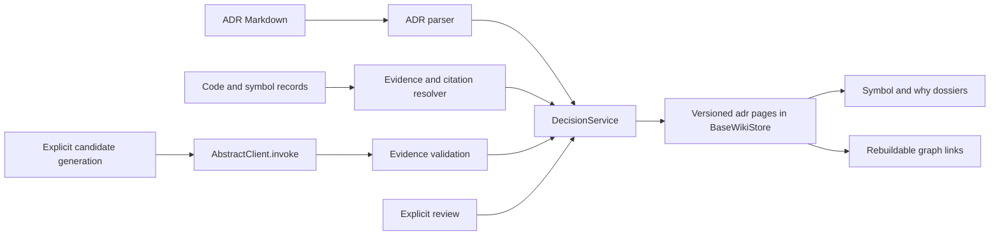

---
# SDD flow type and base branch (FEAT-145).
# - type: feature  (default)  → base_branch: dev (or any non-main branch)
# - type: hotfix              → base_branch MUST be: main
type: feature
base_branch: dev
---

# Feature Specification: ADR extraction and decision retrieval in the LLM wiki

**Feature ID**: FEAT-578
**Date**: 2026-09-19
**Author**: Codex with Jesús Lara
**Status**: approved
**Target version**: next minor

Input: `sdd/proposals/sdd-spec-wiki-adr.brainstorm.md`, Option B. This document specifies the complete feature, including deterministic ADR ingestion, symbol-to-decision retrieval, cited “why” retrieval, and labeled candidate generation. Candidate acceptance policy is resolved (§8 Q3): maintainers explicitly accept candidates in the wiki; committing an ADR file is optional. Other architectural choices below are spec-author decisions for review, not additional user answers.

## 1. Motivation & Business Requirements

### Problem Statement

The wiki indexes source structure and Markdown, but does not resolve architectural decisions into a shared, evidence-backed retrieval contract. GraphIndex recognizes ADR references in Python comments/docstrings; that alone neither resolves the referenced document nor makes its status available in the wiki plane. Coding agents need to distinguish explicit decisions from plausible explanations inferred from implementation.

### Goals

- G1: Extract existing ADRs, preserving declared status, rationale, consequences, citations, and provenance.
- G2: Retrieve decisions applicable to a symbol without treating lexical co-occurrence as proven applicability.
- G3: Answer “why” requests with cited decision excerpts and supporting code. Return a retrieval dossier, without requiring an LLM to synthesize prose.
- G4: Generate explicitly labeled candidates when documented rationale is absent; preserve the distinction between observed behavior and hypothesized reasoning.
- G5: Keep review state, document lifecycle, inference provenance, and evidence freshness separate and visible.
- G6: Support existing SQLite, memory/file, ArangoDB, and directly instantiated Postgres stores through the common page interface. Preserve ordinary scanning and existing symbol IDs.

Confirmed brainstorm answers, carried forward verbatim:

- Flow and base branch — *Owner: Jesús*: feature from `dev`.
- Existing ADRs or inference — *Owner: Jesús*: both.
- Missing documented rationale — *Owner: Jesús*: generate a labeled candidate.
- Retrieval use cases — *Owner: Jesús*: symbol-to-decision lookup or cited “why” answers; both are included in exploration.

### Non-Goals

Automatic architectural compliance/drift verdicts; Git-history mining; PR/Jira ingestion; automatic ADR commits; a review UI; replacing AST scanners; new embeddings infrastructure; cross-namespace write transactions; altering `clients/base.py`; silently promoting inferred rationale into historical fact.

## 2. Architectural Design

### Overview

Add `parrot.knowledge.wiki.decisions`, a service over `BaseWikiStore`. Persist one canonical, versioned decision record per `adr:` page. The page contains a validated JSON envelope and a readable Markdown rendering. Provenance and links reside in the envelope; ordinary graph edges are rebuildable navigation projections, never the sole source of authority.

Deterministic ingestion and retrieval work offline. Candidate generation is explicit and bounded, using `AbstractClient.invoke`. A generation rerun returns an existing candidate for the same evidence fingerprint instead of overwriting a reviewed record. All record mutations use a new compare-and-swap page primitive.

Delivery order is ingestion and persistence → symbol lookup → cited “why” lookup → generation and review. Both retrieval paths are required for feature completion; this sequencing does not reinterpret the user's preference as a choice of only one.

### Component Diagram



### Integration Points

| Existing component | Integration | Contract |
|---|---|---|
| `WikiProjectConfig` | additive | Nested `decisions: DecisionConfig`; defaults keep generation disabled |
| `cli.py` build/upsert | extends | After ordinary source ingestion and deletion handling, refresh ADR records and links; never generate candidates |
| `BaseWikiStore` and four backends | additive | Atomic `compare_and_swap_page`; existing page fields/schema reused |
| `StructuralService.lookup` | reuses | Disambiguate targets; honor stale flags/read-repair diagnostics |
| `SymbolRecord` and `sym_concept_id` | reuses | Stable existing symbol identity and source ranges |
| `AbstractClient.invoke` / `LLMFactory.create` | depends on | Structured bounded generation; no SDK calls |
| CLI/MCP and `AbstractToolkit` | extends | Thin adapters over one service contract |
| `context.py` | extends | Recognize `adr:` namespace grammar and preserve decision labels in rendered results |
| GraphIndex code citation parser | behavioral reference | Match normalization semantics; do not pass GraphIndex IDs off as wiki IDs |

### Data Models

All new models live in `packages/ai-parrot/src/parrot/knowledge/wiki/decisions/models.py`. Use Pydantic v2, `extra="forbid"`, and JSON-safe values. These models do not exist yet.

| Model | Required fields and constraints |
|---|---|
| `DecisionConfig` | `enabled: bool = True`; `adr_globs: list[str]` defaults `docs/adr/**/*.md`, `docs/adrs/**/*.md`, `docs/decisions/**/*.md`; `max_records: int = 10000` (1..100000); `generation_enabled: bool = False`; `max_input_tokens: int = 12000`; `max_output_tokens: int = 2000`; `max_files: int = 8`; `max_candidates: int = 3`; `timeout_seconds: int = 60`; all numeric limits positive |
| `EvidenceRef` | `page_id: str`, `rel_path: str`, `start_line: int`, `end_line: int`, `source_sha1: str`, `excerpt: str`, `kind: Literal['adr','code','comment','document']`; 1-based inclusive valid ranges; repository-relative confined paths |
| `DecisionLink` | `target_id: str`, `relation: Literal['explains','supported_by','supersedes']`, `provenance: Literal['extracted','inferred','asserted']`, `evidence_indexes: list[int]`; indexes must address this record's evidence |
| `ReviewEvent` | `revision: int`, `action: Literal['accept','reject','revise','link']`, `actor: str`, `timestamp: str`, `reason: str`, `before_sha1: str`, `after_sha1: str`; attribution required; these hash title/context/decision/consequences/observations/hypotheses and review status only, avoiding a self-referential audit hash |
| `DecisionRecord` | `schema_version: Literal[1]`, `decision_id: str`, `revision: int >= 1`, `title: str`, `context: str`, `decision: str`, `consequences: str`, `source_status: Literal['unknown','proposed','accepted','rejected','deprecated','superseded']`, `source_status_raw: str`, `origin: Literal['documented','inferred']`, `review_status: Literal['unreviewed','accepted','rejected']`, `source_path: str or None`, `external_id: str or None`, `evidence: list[EvidenceRef]`, `links: list[DecisionLink]`, `observations: list[str]`, `hypotheses: list[str]`, `review_history: list[ReviewEvent]`, `generation: GenerationInfo or None`, `content_fingerprint: str` |
| `GenerationInfo` | `model_spec: str`, `prompt_version: Literal[1]`, `scope_id: str`, `input_sha1: str`; record effective invocation limits |
| `DecisionHit` | Full decision identity, revision, origin, source status, review status, `freshness: Literal['current','stale','missing','unverified']`, score, applicability evidence, cited excerpts; no unlabeled candidate hits |
| `DecisionDossier` | `status: Literal['ok','empty','ambiguous','partial','error']`, `documented: list[DecisionHit]`, `candidates: list[DecisionHit]`, `alternatives: list[str]`, `diagnostics: list[DecisionDiagnostic]`, `truncated: bool`; no synthesized historical claims |
| `DecisionDiagnostic` | `code: str`, `message: str`, optional `path` and `decision_id`; codes fixed below |
| `SyncResult` | `created`, `updated`, `unchanged`, `missing`, `unresolved` integer counts; diagnostics |
| `GenerationResult` | `decision_ids: list[str]`, `reused: list[str]`, diagnostics; valid candidates may be returned alongside per-candidate validation failures |
| `CandidateBatch` | At most configured `max_candidates` entries, each containing title/context/decision/consequences, observations/hypotheses, and evidence indexes into the supplied packet; model cannot supply status, actor, timestamps, or arbitrary paths |
| `ReviewRequest` | `decision_id`, `expected_revision`, `action`, `actor`, `reason`, optional `replacement: CandidateEdit` and `documented_decision_id`; `CandidateEdit` permits title/context/decision/consequences/observations/hypotheses only |

`content_fingerprint` hashes the canonical evidence and semantic content, excluding itself, revision, and review history. Default empty text/list values are permitted for undocumented context/consequences. `decision` must be nonempty. An inferred record always retains `origin='inferred'` and `source_status='unknown'`; accepting it changes review status, not provenance. Imported ADRs retain source-declared lifecycle; local candidate review never changes a source document's status. Unknown source status remains unknown.

### Identity, storage, and concurrency

- Imported ID: `adr:doc:<sha1(normalized-relative-path)>`. `external_id` is a separately indexed alias, e.g. `ADR-42`; duplicate aliases are ambiguous. Path-based identity deliberately avoids silently merging duplicate numbers.
- Candidate ID: `adr:candidate:<sha1(scope_id + canonical-evidence-fingerprint + prompt_version + normalized-candidate-decision)>`. Sort evidence deterministically. Before invoking a model, reuse existing candidates for the same scope/input fingerprint; `--force` is not part of v1. Reviewed candidates remain intact when evidence changes; new evidence creates new candidates.
- Namespace qualification uses the existing `ns::adr:...` grammar. Writes target local or one explicitly selected plane, never `all`.
- Page category is `adr`; `node_id=decision_id`, `source_id=None` (records survive source-slice deletion), `origin='ingest'` for documented or `'authored'` for inferred. Page `content_hash` is SHA-1 of canonical serialized record bytes; evidence hashes independently identify source snapshots.
- Body format: first line `<!-- parrot-adr:v1 -->`, second line one canonical JSON object (UTF-8, sorted keys, compact separators, embedded newlines escaped), then a blank line and readable Markdown. Parse only the fixed first two lines, never arbitrary fenced blocks. Unsupported versions return `ADR_SCHEMA_UNSUPPORTED`.
- Title begins with origin and status labels, e.g. `[INFERRED / UNREVIEWED] ...`; summary repeats them before rationale. Generic wiki search therefore cannot present a candidate as an unlabeled decision even when using its existing renderer. Dedicated dossiers decode the full record.
- Revision mutation is one atomic page compare-and-swap, including updated audit history. Compare against the previously loaded page hash; absent-only insertion uses `expected_content_hash=None`. Concurrent writes yield `ADR_REVISION_CONFLICT`; no automatic review overwrite/retry.
- SQLite performs the condition and write inside one existing write transaction; Postgres uses a conditional update or absent-only insert; Arango uses an atomic document revision precondition and handles conflicts; file-backed memory uses a per-store ADR file lock, reloads the target page under the lock, atomically replaces its file, and refreshes indexes after success. File I/O and lock waits must not block the event loop.
- Add a concrete default method on `BaseWikiStore` raising `NotImplementedError`, so external subclasses remain instantiable; built-in backends implement it. Custom unsupported writers return `ADR_WRITE_UNSUPPORTED`. Do not emulate CAS as an unlocked read followed by `upsert_pages`.
- ADR feature mutations must use this primitive. Existing authoring tools must reject arbitrary `note`/`update_page` modification of `adr` bodies with `ADR_MANAGED_PAGE`; edits go through the typed review surface. Generic deletion is not an ADR review action.
- Preserve full review history in the record. Maximum serialized page is 1 MiB; fail with `ADR_RECORD_TOO_LARGE` rather than truncate history or evidence. Schema redesign/compaction is a later feature.

### ADR parsing and references

Read complete eligible files up to the existing configured source-byte limit before generic wiki body truncation. Accept UTF-8 Markdown with ATX headings, optional flat frontmatter fields `id`, `title`, `status`, `supersedes`, and sections `Context`, `Decision`, `Consequences`, `Status`. Extract only these known scalar fields using a bounded parser; nested YAML and arbitrary YAML execution are unsupported. Ignore fenced-code headings. Case-insensitive section names are normalized. Missing `Decision` means ordinary document plus diagnostic, not a fabricated ADR.

Resolve status from frontmatter, then Status section; disagreeing values yield `ADR_STATUS_CONFLICT` and effective unknown. Accepted/Proposed/Rejected/Deprecated/Superseded are recognized; preserve unknown original text. Frontmatter/heading IDs and filenames like `0042-*.md` normalize to `ADR-42`; conflicting IDs produce a diagnostic. Discover only configured globs and normal repository relevance/exclusion rules. Tests use synthetic fixtures; real samples may extend supported syntax later.

Python code references come only from tokenizer comment tokens and AST docstrings. Normalize `ADR-42`, `ADR/042`, and `ADR 42` consistently with GraphIndex. Attach to the nearest enclosing symbol range; module-level comments attach to the file and are reported as file scope. Do not treat executable string literals as rationale. Other languages support explicit document-to-symbol links and candidate generation using their existing symbol records; automatic comment-reference extraction for those languages is deferred.

Document links can name exact wiki symbol IDs in Markdown link destinations; no fuzzy symbol binding. For comments without an ADR reference, `WHY`/`NOTE` text may ground a candidate, but is not automatically an accepted decision. Resolve references from the full current ADR inventory; missing or duplicate aliases stay unresolved.

Store canonical links/evidence inside records. Project decision→symbol/file `explains`, decision→source-page `supported_by`, and newer-decision→older-decision `supersedes` edges with provenance. Edges are a cache: retrieval validates the corresponding record link, so stale projected edges never establish applicability. Source replacement may erase edges; a post-ingest refresh reprojects them. No new GraphIndex enum is needed: v1 does not mirror ADR records/edges into the separate GraphIndex plane.

Renames create a new path ID; old records remain with missing source evidence. V1 does not infer identity across renames. An explicit review link can associate records; documented supersession requires an explicit source reference. Cycles yield `ADR_SUPERSESSION_CYCLE` and are not treated as an authoritative latest chain.

### Retrieval and freshness

`for_symbol` accepts a full `sym:` ID or a name. Use exact identity first; for names, reuse structural lookup, then require one exact name/qualname match. Multiple matches return `ambiguous` with IDs. No match returns `empty`. Include exact symbol links and file-scope links for its file, labeled separately; do not propagate applicability through the call graph.

`why` matches normalized query tokens against title, decision, context, and observations. Deterministic score: sum distinct token overlaps weighted 4/3/1/1 respectively, then explicit matching symbol-link presence, then decision ID as stable tie-breaker. Resolve symbol names using the same ambiguity policy; a natural-language query need not name a symbol. Rank documented/current/source-accepted hits first, then other current documented records, then candidate groups; relevance ordering applies within each group. Rejected/deprecated/superseded or locally rejected candidates are hidden by default and available via `include_history=True`. Unknown status is displayed, not elevated to accepted. Supersession never deletes history.

Load the `adr` inventory via `list_pages(category='adr', limit=max_records+1)` and hydrate full pages. Build an in-call alias/link index; no persistent cache without an invalidation contract. Exceeding the bound returns `ADR_INVENTORY_LIMIT`, never a silently incomplete “no decisions” answer. This deliberate bounded full inventory is v1's performance tradeoff; a native ADR index is deferred.

Verify evidence hashes against current on-disk bytes for local projects, using confined paths and async file offloading. If no project root is available, report unverified, never current. Missing files are missing; changed hashes are stale. Do not rewrite review status during reads. Failed hash verification returns a diagnostic. Read results include the record revision used.

Default `limit=10` (1..50), output budget 3000 estimated tokens (minimum 256). Pack a hit only with its origin/status/freshness and at least one citation; if an excerpt cannot fit, shorten the excerpt while retaining the citation, or omit that hit with `truncated=True`. Zero LLM calls for sync, lookup, why, or page retrieval. General `wiki query` remains its existing lexical surface; `adr why` provides the richer semantics rather than pretending existing query implementations are all routed through `WikiCombinedSearch`.

### Candidate generation and review

Generation requires `generation_enabled` and an explicitly injected client or configured `WIKI_ADR_LLM` provider:model; credentials remain environment-only. Reuse `LLMFactory.create` rather than auto-selecting a coding-agent provider. One invocation per request, temperature 0, `use_tools=False`, configured output cap, and timeout. No hidden model retries.

Targets are one symbol ID or one repository-relative file. Gather at most eight files and 12000 estimated input tokens, including the target and directly supplied linked ADR/document evidence. Exceeding a bound returns `ADR_GENERATION_LIMIT`; do not silently drop target evidence. No Git history in v1. Output may contain up to three candidates. Recheck supplied source hashes before persisting results; if any changed mid-generation, report `ADR_EVIDENCE_CHANGED` and write no candidate from that request.

The model selects evidence indexes from the packet; it cannot invent paths or statuses. Validate indexes and literal excerpts/ranges against the packet. Citations prove implementation observations, not historical intent. Unsupported rationale must appear in hypotheses and be labeled inferred. Invalid candidates are rejected individually with diagnostics; a valid sibling may persist. Provider failures yield `ADR_MODEL_FAILED`, timeout `ADR_MODEL_TIMEOUT`; existing data remains intact.

Review supports typed revision, rejection, and linking to a documented decision, with revision checks and attributed history. **Acceptance policy (Q3 confirmed):** a maintainer explicitly accepts a candidate through the CLI in the wiki; Markdown export and committing an ADR file are optional. Acceptance sets `review_status='accepted'`, retains `origin='inferred'` and `source_status='unknown'`, and appends an attributed review event through the same revision-checked write. No documented ADR is required for acceptance. No model invocation or MCP tool automatically accepts a candidate.

Export renders a candidate as Markdown to stdout; writing/committing that output is outside this feature. Rejection does not delete a record. Revision preserves evidence/provenance and resets review status to unreviewed; immutable fields cannot be changed by `CandidateEdit`. Linking requires an existing documented ADR record and records an asserted association without changing inferred origin.

### New Public Interfaces

All interfaces below are proposed, not existing APIs. Signature bodies belong to task blueprints.

```python
# decisions/service.py (new)
class DecisionService:
    def __init__(self, store: BaseWikiStore, root: Path | None, config: DecisionConfig,
                 structural: StructuralService | None = None, client: AbstractClient | None = None) -> None:
        """Bind one namespace, optional local evidence root, and optional generation client."""

    async def sync(self, paths: list[str] | None = None) -> SyncResult:
        """Refresh selected ADR sources or the full configured inventory; never invoke a model."""

    async def for_symbol(self, symbol: str, *, include_history: bool = False,
                         limit: int = 10, budget_tokens: int = 3000) -> DecisionDossier:
        """Return cited decisions or explicit symbol disambiguation, with no guessed binding."""

    async def why(self, question: str, *, include_history: bool = False,
                  limit: int = 10, budget_tokens: int = 3000) -> DecisionDossier:
        """Return ranked decision excerpts, source citations, and separately labeled candidates."""

    async def generate(self, target: str) -> GenerationResult:
        """Generate bounded candidates or reuse the same evidence snapshot's candidates."""

    async def review(self, request: ReviewRequest) -> DecisionRecord:
        """Validate and apply an attributed revision; raise DecisionError on revision conflict or invalid review input."""

# store.py:BaseWikiStore (additive concrete default; built-in backends override)
async def compare_and_swap_page(self, page: WikiPageRecord,
                                expected_content_hash: str | None) -> bool:
    """Insert only if absent, or atomically replace an exact hash; False means conflict."""
```

### Errors and transport

`DecisionError(ValueError)` carries `code`, `message`, and optional `decision_id`; expected diagnostics in batch reads/sync remain in typed outputs. Model/schema argument validation becomes `ADR_INVALID_ARGUMENT`. Additional fixed codes are `ADR_PARSE_FAILED`, `ADR_REFERENCE_MISSING`, `ADR_REFERENCE_AMBIGUOUS`, `ADR_SOURCE_UNAVAILABLE`, `ADR_PATH_OUTSIDE_ROOT`, `ADR_READ_ONLY`, and `ADR_MODEL_UNCONFIGURED`. Errors already named above retain their exact spelling.

CLI JSON renders the typed result or `{ "error": { "code": ..., "message": ... } }`. Exit 0 for successful/empty dossiers and completed sync, 2 for invalid arguments, 1 for failed operations or sync/generation with error diagnostics. An ambiguous dossier is a valid read result, exit 0. MCP returns the same data in the repository's `ToolResult` wrapper, with failures marked as errors. Never serialize credentials or provider exception payloads containing secrets.

## 3. Module Breakdown

Module paths below are relative to `packages/ai-parrot/src/parrot/knowledge/wiki/` unless explicitly prefixed with `packages/` or `docs/`.

#### Delegation-eligible modules

Eligibility does not authorize dispatch before spec approval. Each TASK must carry these contracts without further design choices.

| Module | Eligible? | Decided patterns / exact contracts | Why not (if no) |
|---|---|---|---|
| M1 Models and codec | yes | `decisions/models.py`, `codec.py`; §2 fields, ID/hash rules, envelope grammar | — |
| M2 Atomic page writes | yes | Exact CAS signature; per-backend conditional write; conflict=False | — |
| M3 Parser and refresh | yes | ATX/flat metadata subset, Python token/AST citations, configured paths, sync errors | — |
| M4 Retrieval | yes | Exact service methods, status groups, scoring, budgets, ambiguity and freshness rules | — |
| M5 Generation and review | yes | Bounded generation; explicit maintainer wiki acceptance, immutable inferred provenance, revision-checked audit history | — |
| M6 Adapters and integration | yes | Shared read/generation service adapters; maintainer CLI review, optional export, no automatic MCP acceptance | — |
| M7 Validation and documentation | yes | Fixture matrix plus wiki acceptance without a committed ADR; provenance and audit tests | — |

### Module 1: Models, identity, and codec

- **Paths:** new `decisions/__init__.py`, `models.py`, `codec.py`.
- **Responsibility:** All typed contracts and reversible serialization. Full-fidelity envelope, not the lossy symbol decoder.
- **Depends on:** Existing Pydantic, `WikiPageRecord`, `estimate_tokens`.

```python
# decisions/codec.py (new)
def decision_to_page(record: DecisionRecord) -> WikiPageRecord:
    """Render the canonical JSON envelope and mandatory readable origin/status labels."""

def decision_from_page(page: dict[str, Any]) -> DecisionRecord:
    """Decode a managed ADR page; raise DecisionError for malformed or unsupported envelopes."""
```

### Module 2: Atomic persistence and managed-page protection

- **Paths:** modify `store.py`, `file_store.py`, `arango_store.py`, `postgres_store.py`; new `decisions/repository.py`.
- **Responsibility:** Implement CAS, revision checks, inventory hydration and shared typed failures. No schema migration.
- **Depends on:** M1.

```python
# decisions/repository.py (new)
class DecisionRepository:
    def __init__(self, store: BaseWikiStore, max_records: int = 10000) -> None:
        """Bind a backend without bypassing its read-only policy."""

    async def inventory(self) -> list[DecisionRecord]:
        """Load the complete bounded ADR inventory or fail with ADR_INVENTORY_LIMIT."""

    async def save(self, record: DecisionRecord, expected_content_hash: str | None) -> DecisionRecord:
        """CAS one full record and its audit history; raise ADR_REVISION_CONFLICT on mismatch."""
```

### Module 3: ADR parsing and source refresh

- **Paths:** new `decisions/parser.py`, `evidence.py`, `ingest.py`; additive `decisions` field in `project.py`.
- **Responsibility:** Discover bounded sources; parse complete ADRs; resolve explicit Python references to existing symbol IDs; maintain documented records and source freshness. Preserve candidate/review data during refresh.
- **Depends on:** M1–M2, existing scanner records and symbol helpers.

```python
# decisions/parser.py (new)
def parse_adr(rel_path: str, text: str) -> DecisionRecord | None:
    """Return a documented record with source spans, None for ordinary documents, or a typed parse error."""

# decisions/ingest.py (new)
async def refresh_decisions(store: BaseWikiStore, root: Path, config: DecisionConfig,
                            paths: list[str] | None = None) -> SyncResult:
    """Refresh docs and explicit links idempotently; retain records whose sources disappeared."""
```

Full sync enumerates all configured ADR sources plus indexed code targets. Incremental sync refreshes changed sources and re-resolves affected aliases against the full stored ADR inventory; changing an ADR must repair links in unchanged citing code. Code citation removals must remove canonical applicability links, not merely add new edges. Batch writes are per-record atomic, not globally atomic; retrying a partial sync converges idempotently and reports failures.

### Module 4: Retrieval service and dossier rendering

- **Paths:** new `decisions/service.py`, `render.py`.
- **Responsibility:** `for_symbol`, `why`, inventory validation, freshness, namespace-qualified references, bounded rendering.
- **Depends on:** M1–M3 and `StructuralService`.
- **Interface:** Exact public signatures in §2. No service-to-CLI imports; inject the structural service to avoid new cycles.

### Module 5: Candidate generation and attributed review

- **Paths:** new `decisions/generation.py`, `review.py`; complete service methods in `service.py`.
- **Responsibility:** Bound evidence/model calls, validate and persist candidates; review via typed edits and atomic history updates.
- **Depends on:** M1–M4.

```python
# decisions/generation.py (new)
async def generate_candidates(client: AbstractClient, target: str,
                              evidence: list[EvidenceRef], config: DecisionConfig) -> CandidateBatch:
    """Invoke once with bounded structured output; validate packet references before returning."""
```

### Module 6: CLI, tools, and incremental wiring

- **Paths:** new `decisions/cli.py`, `tools.py`, `toolkit.py`; modify `cli.py`, `mcp_server.py`, `context.py`, `toolkit.py`, and `tools.py` for managed-page protection.
- **Responsibility:** Shared service adapters; wire post-ingest refresh into top-level build/upsert after deletions, avoiding recursive refresh during structural read repair. A missing ADR config/file is a no-op, never a model call.
- **Depends on:** M1–M5 (read adapters can land after M4).
- **CLI:** `wikitoolkit adr sync [PATH...]`, `adr lookup SYMBOL`, `adr why QUESTION`, `adr generate TARGET`, `adr review ID --action ACTION --expected-revision N --actor ACTOR --reason TEXT`, `adr export ID`. Read commands accept `--include-history`, `--limit`, `--budget`, `--json`, and one `--ns`; write commands reject `--ns all` and missing local evidence roots. Revision content comes from `--edit-file PATH` containing `CandidateEdit` JSON; link requires `--documented-id ID`.
- **MCP:** Read tools `wiki_decisions_for_symbol` and `wiki_decision_why` always registered with the existing read-store routing. `wiki_decision_generate` is registered only when `generation_enabled` and a local writable project are available. Review remains a maintainer CLI action, not an autonomous agent tool.
- **Toolkit:** `DecisionToolkit(AbstractToolkit)` exposes `for_symbol` and `why` with `tool_prefix='decision'`; generation exposure is explicit opt-in. All tool methods document return groups, provenance, and errors.

```python
# decisions/tools.py (new)
def create_decision_tools(store: BaseWikiStore, root: Path, config: WikiProjectConfig) -> list[AbstractTool]:
    """Create namespace-aware read tools and explicitly enabled local generation tools."""
```

Namespaces: lookup/why target one namespace per call (`local` by default), rejecting `all` with `ADR_INVALID_ARGUMENT` in v1. A selected remote/store-only namespace may retrieve persisted evidence with unverified freshness; it cannot generate or sync local code. No backend selector widening to Postgres is part of this feature; directly instantiated Postgres stores support the repository API.

### Module 7: Validation and documentation

- **Paths:** new `packages/ai-parrot/tests/knowledge/wiki/decisions/` tests and fixtures; new `docs/guides/wiki-adr-decisions.md`; update the existing LLM wiki guide's command section.
- **Responsibility:** Contracts below, user-facing provenance examples, limitations, generation opt-in, and review instructions.
- **Depends on:** M1–M6.

## 4. Test Specification

### Unit Tests

| Test | Module | Description |
|---|---|---|
| `test_codec_roundtrip_and_labels` | M1 | All fields survive encode/decode; inferred/unknown labels visible in generic page stubs |
| `test_invalid_envelope_and_version` | M1 | Corrupt, unsupported, wrong-category, oversized pages fail with stable codes |
| `test_cas_insert_update_conflict` | M2 | Absent-only insert, correct hash replacement, wrong hash, read-only, unsupported backend |
| `test_concurrent_reviews` | M2/M5 | Two writers read the same revision; exactly one succeeds, loser cannot erase history |
| `test_adr_sections_and_status` | M3 | ATX sections, fenced headings, missing Decision, conflicting status, unknown status |
| `test_long_adr_not_body_truncated` | M3 | Decision after the ordinary 16000-character body head is extracted with correct spans |
| `test_python_citations_and_ambiguity` | M3 | Comments/docstrings, normalization, executable-string exclusion, duplicate ADR aliases |
| `test_symbol_disambiguation_and_file_scope` | M4 | Exact symbol IDs, duplicate names, explicit file scope, no call-graph inheritance |
| `test_why_ranking_and_budget` | M4 | Stable ranking, separate candidate group, superseded history toggle, whole citation retention |
| `test_generation_bounds_and_validation` | M5 | Input/file/output limits, forged indexes, unsupported paths, model error/timeout, zero hidden retries |
| `test_evidence_changed_during_generation` | M5 | Source hash mutation between packet creation and persistence writes no candidates |
| `test_generation_dedup_preserves_review` | M5 | Same evidence returns existing candidates; changed evidence creates a new record |
| `test_managed_page_protection` | M6 | Generic note/update cannot corrupt the record; ordinary wiki pages unchanged |
| `test_maintainer_wiki_acceptance` | M5/M6 | Explicit CLI acceptance succeeds without a committed ADR, preserves inferred origin/unknown source status, records the actor, and rejects stale revisions; MCP/model paths never automatically accept |

### Integration Tests

| Test | Description |
|---|---|
| `test_build_lookup_why_roundtrip` | Ordinary build plus ADR refresh → exact symbol lookup → why dossier → raw page read |
| `test_incremental_links_and_deletion` | ADR added/changed/deleted/renamed; unchanged citing code is re-resolved; candidate history survives |
| `test_partial_sync_retry` | Failure after one record persists; retry converges without duplicates or silent loss |
| `test_backend_contract_parity` | SQLite and memory mandatory; Arango/Postgres live fixtures verify CAS and full record roundtrip; identical dossier semantics |
| `test_cli_mcp_parity` | CLI JSON and MCP return equivalent service data/error codes; stdout remains protocol-safe |
| `test_namespace_isolation` | Same ADR number in two namespaces stays distinct; remote reads unverified; broadcast writes refused |
| `test_offline_and_disabled_generation` | Build, lookup, why never construct/invoke an LLM; ordinary wiki behavior remains available on generation failure |

### Test Data / Fixtures

Synthetic repository: two same-named Python symbols, a module comment, an executable string containing a false ADR citation, accepted/superseded/proposed/unknown-status ADRs, duplicate `ADR-42` aliases, malformed frontmatter, a long ADR, one undocumented symbol, and an explicit Markdown symbol link. Fake `AbstractClient.invoke` responses cover valid output, fabricated indexes, timeout and source mutation. No network model calls in tests. Fixture hashes and paths are deterministic.

## 5. Acceptance Criteria

- [ ] AC1: All required fixture ADRs parse with exact source spans and statuses; long ADRs are not silently truncated.
- [ ] AC2: Exact symbol lookup returns only evidence-backed symbol/file applicability and disambiguates duplicate names.
- [ ] AC3: Why dossiers provide decision text and citations, distinct candidate groups, lifecycle and freshness labels.
- [ ] AC4: Generated records remain inferred, carry observations separately from hypotheses, and cite supplied evidence only.
- [ ] AC5: Ordinary scan/read paths make zero LLM calls; one explicit generation request makes at most one bounded invocation.
- [ ] AC6: Concurrent modifications cannot lose review history; same-evidence reruns preserve reviewed candidates.
- [ ] AC7: Source changes invalidate freshness and refresh canonical links without deleting independently reviewed records.
- [ ] AC8: Namespace and backend contract tests pass; missing live backend validation is reported and blocks declaring backend parity complete.
- [ ] AC9: CLI/MCP/toolkit adapters preserve service semantics and mandatory labels under output budgets.
- [ ] AC10: Existing code/document search and source-slice tests pass; existing symbol IDs and client APIs are unchanged.
- [ ] AC11: Explicit maintainer acceptance in the wiki succeeds without a committed ADR, retains inferred provenance and unknown source status, and records revision-checked attribution; generation/MCP never automatically accepts.
- [ ] AC12: `black` (120 columns), scoped `ruff check`, and scoped pytest suites pass; logs saved under `artifacts/logs/`.
- [ ] AC13: Guide documents parsing subset, Python-only automatic citation extraction, rename behavior, local/remote freshness, generation costs/limits, and review policy.
- [ ] AC14: Inventory limits return explicit errors; record serialization roundtrips at the configured bound. Record timing and memory for 1000 synthetic ADRs as a baseline; no unmeasured latency SLA is asserted.

## 6. Codebase Contract

Verified against local base commit `959b31e59` after successful `git pull --ff-only origin dev` in the isolated checkout. Local brainstorm commit was ahead of the fetched base. FEAT-578 was subsequently reserved by the official allocator; its ledger-only remote commit did not alter these source contracts. Imports below are statically verified at their definitions/use sites, not claimed as runtime import tests.

### Verified Imports

```python
from parrot.knowledge.wiki.store import BaseWikiStore, WikiPageRecord, estimate_tokens
# store.py:409,525,318; repo_scan.py:39 imports WikiPageRecord/estimate_tokens
from parrot.knowledge.wiki.structural.service import StructuralService
# structural/service.py:127 constructor; structural/toolkit.py:21 import
from parrot.knowledge.wiki.symbols import SymbolRecord, sym_concept_id
# symbols.py:58; repo_scan.py:40 imports both
from parrot.clients import AbstractClient
# clients/__init__.py:14 re-export; clients/base.py:235 definition
from parrot.clients.factory import LLMFactory
# knowledge/wiki/cli.py:3271 import; clients/factory.py:163 definition
from parrot.tools.toolkit import AbstractToolkit
# knowledge/wiki/structural/toolkit.py:23
from parrot.tools.abstract import AbstractTool, ToolResult
# knowledge/wiki/structural/tools.py:30
```

The import comments are relative to `packages/ai-parrot/src/parrot/`; exact line references are anchors, not proposed new paths.

### Existing Class Signatures

| Full repository path and line | Verified contract |
|---|---|
| `packages/ai-parrot/src/parrot/knowledge/wiki/store.py:409` | `WikiPageRecord(BaseModel)`; fields at 444: `concept_id`, `node_id`, `title`, `category`, `summary`, `body`, `source_id`, `token_count`, `origin`, `asserted_by`, `updated_at`, `content_hash`; no metadata field |
| `packages/ai-parrot/src/parrot/knowledge/wiki/store.py:544` | `async upsert_pages(self, pages: list[WikiPageRecord]) -> int` |
| `packages/ai-parrot/src/parrot/knowledge/wiki/store.py:550` | `async replace_source_slice(self, source_id: str, pages: list[WikiPageRecord], edges: Optional[list[tuple[str, str, str]]] = None) -> dict[str, Any]` |
| `packages/ai-parrot/src/parrot/knowledge/wiki/store.py:565` | `async get_page(self, concept_id: str, include_body: bool = True) -> Optional[dict[str, Any]]` |
| `packages/ai-parrot/src/parrot/knowledge/wiki/store.py:568` | `async list_pages(self, category: Optional[str] = None, limit: int = 100, origin: Optional[list[str]] = None) -> list[dict[str, Any]]` |
| `packages/ai-parrot/src/parrot/knowledge/wiki/store.py:582` | `async neighbors(self, concept_id: str, rel: Optional[str] = None, direction: str = 'both') -> list[dict[str, Any]]` |
| `packages/ai-parrot/src/parrot/knowledge/wiki/structural/service.py:136` | `async lookup(self, query: str, *, kind: SymbolKind or None = None, language: str or None = None, path_prefix: str or None = None, limit: int = 20) -> SymbolLookupOutput` |
| `packages/ai-parrot/src/parrot/knowledge/wiki/cli.py:683` | `async _ingest_files(store, sources, root, scan, force=False, force_rel_paths=None) -> dict[str, Any]`; per-source atomic replacement and initial bulk-write branches |
| `packages/ai-parrot/src/parrot/knowledge/wiki/repo_scan.py:634` | `build_file_slice(root, rel_path, body_max_chars=DEFAULT_BODY_MAX_CHARS, max_file_bytes=DEFAULT_MAX_FILE_BYTES, symbol_depth=2) -> FileSlice or None`; truncation at 709 |
| `packages/ai-parrot/src/parrot/clients/base.py:1883` | `async invoke(self, prompt: str, *, output_type: Optional[type] = None, structured_output: Optional[StructuredOutputConfig] = None, model: Optional[str] = None, system_prompt: Optional[str] = None, max_tokens: Optional[int] = None, temperature: float = 0.0, use_tools: bool = False, tools: Optional[list] = None) -> InvokeResult` |

### Integration Points

| New component | Connects to | Via | Verified at |
|---|---|---|---|
| Repository | Wiki store | Existing page methods, new CAS primitive | `packages/ai-parrot/src/parrot/knowledge/wiki/store.py:525` |
| Codec | Symbol page precedent | Reversible body format, independently implemented | `packages/ai-parrot/src/parrot/knowledge/wiki/symbols.py:190` |
| Post-ingest refresh | CLI build/upsert | Additive final refresh after ordinary ingestion/pruning | `packages/ai-parrot/src/parrot/knowledge/wiki/cli.py:1401`, `:1670`, `:683` |
| Candidate generator | AbstractClient | `invoke(..., output_type=CandidateBatch, max_tokens=..., use_tools=False)` | `packages/ai-parrot/src/parrot/knowledge/graphindex/extractors/llm.py:155` invocation precedent |
| Decision tools | MCP server | Append tool factory results before registration | `packages/ai-parrot/src/parrot/knowledge/wiki/mcp_server.py:209`, `:249` |
| Namespace grammar | Context helpers | Add `adr` to `_ID_KINDS` | `packages/ai-parrot/src/parrot/knowledge/wiki/context.py:40` |
| Citation resolver | GraphIndex behavior | Normalize references; independently map wiki IDs | `packages/ai-parrot/src/parrot/knowledge/graphindex/extractors/code.py:564` |

### Does NOT Exist (Anti-Hallucination)

- `knowledge/wiki/decisions/`, its models/service, `adr` commands and CAS primitive are new designs, not existing imports.
- `WikiPageRecord.metadata` is absent; typed ADR fields cannot be passed as existing page constructor arguments.
- `WikiCombinedSearch.search` is not the sole query entry: CLI `query` directly calls `search_fts` at `cli.py:1846`, as does `WikiQueryTool._execute` at `tools.py:225`.
- The file-backed store does not retain edge provenance (`file_store.py:380`, `:579`); record-level provenance is required.
- Existing symbol body serialization is lossy (`symbols.py:238`); it cannot be reused unchanged for ADR lifecycle/evidence data.
- GraphIndex citation nodes do not resolve ADR text or accepted status. Its enum lacks `SUPERSEDES`; this spec uses wiki open-string relations only.
- Postgres exists as a store implementation, but `WikiProjectConfig.backend` still lists sqlite/memory/arangodb (`project.py:414`). Do not promise a new project backend selector.
- No accepted decision can be inferred solely from code shape, lexical score, or model confidence.

## 7. Implementation Notes & Constraints

### Patterns to Follow

Async service boundaries, Pydantic contracts, provider-neutral clients, logger-based diagnostics, and thin CLI/tool adapters. Use stdlib `ast`, `tokenize`, `hashlib`, `json`, `pathlib`, and bounded metadata parsing; no new parser dependency. File operations in async code must follow existing offloading conventions. Keep parser/model modules free of CLI imports.

Spec/task file ownership must remain scoped to the M1–M7 lists. Do not refactor scanner architecture, provider clients, or the unrelated authority ontology. Candidate generation treats source excerpts as data and never executes instructions found in them.

### Known Risks / Gotchas

- Generic page bodies are mutable today: managed-page guards and CAS must land together before review is enabled.
- Backend parity is behavioral, not just JSON roundtrip: concurrent CAS tests and read-only tests are required.
- In-memory backend can retain stale indexes across processes: ADR inventory/CAS reads must reload persisted ADR pages when relevant files change; do not trust only a startup snapshot.
- Derived graph edges can survive or disappear on source replacement: authoritative links live in records and every returned link is validated against them. Periodic refresh may add/rebuild projections; stale edges alone never authorize a hit.
- Evidence freshness cannot prove semantic agreement. Mark stale/unverified rather than proclaiming architectural drift.
- Source text truncation and docstring summaries lose evidence: load complete bounded source snapshots for ADR parsing and generation packets.
- SHA-1 is used for deterministic identity/version fingerprints consistently with the wiki, not as an adversarial authenticity mechanism.
- A concurrent ordinary build can change evidence mid-generation: hash recheck before persistence is mandatory.

### External Dependencies

| Package/tool | Verified requirement | Use |
|---|---|---|
| `pydantic` | `==2.12.5`, `packages/ai-parrot/pyproject.toml:54` | Typed records and output validation |
| `aiosqlite` | `>=0.17`, same file `:195` | Existing SQLite store only |
| `pathspec` | `>=0.12`, same file `:194` | Existing discovery/exclusion behavior |
| Existing scanner extras | `tree-sitter>=0.23`, same file `:274`, `:302` | Existing optional scanners; no new grammar |
| Standard library | Existing Python runtime | ADR subset parser, evidence hashes, JSON codec |

No dependency additions or provider-specific SDK imports.

### Worktree Strategy

**Isolation:** per-spec. After approval, `$sdd-task` owns creation of `.claude/worktrees/feat-FEAT-578-sdd-spec-wiki-adr` from `origin/dev`. Documentation preparation used a clean temporary clone, not a feature worktree. No implementation has been started.

M1 precedes M2/M3; M2 and the pure parser portion of M3 can proceed independently after contracts are fixed. M4 follows storage and parsing. M5 follows retrieval; Q3 is resolved. M6 read adapters can follow M4 while generation waits. One owner coordinates shared `store.py`, `cli.py`, `project.py`, and backend edits. M7 integrates all modules. No architectural choices may be delegated to a mechanical implementation task.

## 8. Open Questions

Original resolved answers are preserved verbatim:

- [x] Flow and base branch — *Owner: Jesús*: feature from `dev`.
- [x] Existing ADRs or inference — *Owner: Jesús*: both.
- [x] Missing documented rationale — *Owner: Jesús*: generate a labeled candidate.
- [x] Retrieval use cases — *Owner: Jesús*: symbol-to-decision lookup or cited “why” answers; both are included in exploration.

Brainstorm questions carried forward with dispositions:

- [ ] Q1: Which real ADR directories/templates and sample repository should define the ingestion fixtures? — *Owner: Jesús*: Optional real-world samples remain requested. Synthetic fixtures and configurable conventional globs define v1; this is not a design blocker.: https://github.com/adr/madr
- [x] Q2: Which retrieval path is the first delivery priority if sequencing is necessary: symbol lookup or cited “why” answers? — *Owner: spec author*: Symbol lookup first as the evidence-link foundation, then why; both are required. This is an implementation ordering decision, not a new user preference.
- [x] Q3: Where are candidates reviewed, who may accept them, and must acceptance produce a committed ADR file? — *Owner: Jesús*: Confirmed: “Q3: yes, accept”. Maintainers may explicitly accept candidates in the wiki through the CLI; Markdown export and committing an ADR are optional. Acceptance, rejection, and revision never change inferred provenance.
- [x] Q4: What default generation scope, model budget, and input sources are appropriate; should Git history be included in v1? — *Owner: spec author*: One file/symbol, eight files, 12000 estimated input tokens, 2000 output tokens, one model call, three candidates, 60-second timeout, explicit opt-in; no Git history. Configurable resource defaults, not quality guarantees.
- [x] Q5: Which persistence representation, backend parity scope, and rename/supersession identity rules will the first release guarantee? — *Owner: spec author*: Versioned JSON-in-page records, four built-in backend CAS implementations, path-derived documented identity, explicit supersession, and no inferred rename equivalence (§2).

## 9. Design Research Cross-Check

**Status:** skipped (no independent design seat was dispatched; this is not an independent-review claim). The exploration is still marked exploration; Q3 was subsequently resolved by the user. A separate review may be requested before approval. No transcript was produced.

| # | Author's source-verified finding | Disposition | Reason | Landed in |
|---|---|---|---|---|
| A1 | File-backed store drops edge provenance | CONFIRM | Provenance must survive backend choice | §2 record envelope |
| A2 | CLI/MCP queries bypass WikiCombinedSearch | CONFIRM | Dedicated shared service avoids incomplete integration | §2 retrieval, M6 |
| A3 | Source slices own and delete derived pages | CONFIRM | Keep independent reviewed records outside source-owned slices | §2 persistence |
| A4 | Existing page writes lack revision preconditions | CONFIRM | Concurrent review must not silently overwrite | M2 CAS |

These are author checks, not suggestions attributed to an independent reviewer. Independent-review tally: 0 confirmed, 0 rejected, 0 escalated.

## Revision History

| Version | Date | Author | Change |
|---|---|---|---|
| 0.1 | 2026-09-19 | Codex with Jesús Lara | Initial draft from Option B; FEAT-578 reserved; Q3 acceptance policy remains open |
| 0.2 | 2026-09-19 | Codex with Jesús Lara | Resolve Q3: maintainer wiki acceptance, optional ADR commit; remove tasking gates and specify acceptance tests |
