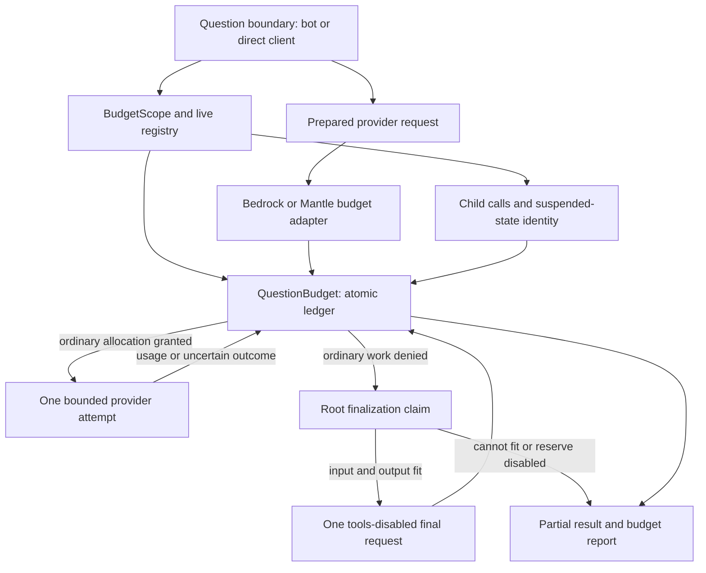

---
# SDD flow type and base branch (FEAT-145).
# - type: feature  (default)  → base_branch: dev (or any non-main branch)
# - type: hotfix              → base_branch MUST be: main
type: feature
base_branch: dev
---

# Feature Specification: Cumulative Question Token Budgets for Bedrock and Mantle

**Feature ID**: FEAT-550
**Date**: 2026-09-11
**Author**: Jesus Lara / Codex
**Status**: review
**Target version**: Next development release after approval
**Source**: `sdd/proposals/token-budget-bedrock.brainstorm.md`, resolved 2026-09-11
**Code baseline**: `549959cdc` on `dev`; clean temporary checkout synchronized with `origin/dev` before reservation
**Identity**: Allocated by `scripts.sdd.reserve_ids`; reservation published separately as an ID-ledger-only commit. This spec commit contains only this file.

---

## 1. Motivation & Business Requirements

### Problem Statement

A single user question can produce multiple model requests, tool rounds, retries,
fallbacks, and child-agent calls. Existing `max_tokens` limits an individual
request's output. Existing usage accumulation reports consumption after execution;
neither establishes a cumulative allowance for the question.

Implement the accepted brainstorm's Option B: a shared question ledger with
reservations before inference. An optional allowance covers all input and output
tokens consumed by the question. The final answer uses a protected partition of
that same allowance.

Service throughput quotas and context-window budgets remain separate concepts.
AWS's token-counting interfaces can support admission for qualified combinations,
but not every model/endpoint/installed SDK exposes them.
[AWS token counting](https://docs.aws.amazon.com/bedrock/latest/userguide/count-tokens.html).

### Goals

1. Enforce `token_budget` across the entire question, including all supported
   client requests and descendants, rather than resetting it at each tool round.
2. Count input plus output, including repeatedly sent history, system prompts,
   tools, cache reads/writes and reasoning, without double counting nested details.
3. Default to explicitly estimated admission; offer strict admission only for
   independently qualified model/endpoint/request/SDK combinations.
4. Protect `final_answer_reserve` (default 15%); when ordinary work cannot continue,
   attempt one final answer with tools disabled, if it fits the remaining ceiling.
5. Preserve usage, partial results and completed tool effects on exhaustion.
   Exhaustion returns a result at the outer bot boundary, not a public exception.
6. Support same-process children and resumes without allowing concurrent callers
   to oversubscribe a known allowance or replay a suspension to restart it.
7. Cover Bedrock Converse, inherited Nova text, and Mantle Chat Completions for
   `ask`, `ask_stream`, `resume`, and text `invoke`. Guard the existing native text
   `invoke_model` fallback as well.

### Non-Goals (explicitly out of scope)

- Provider account, daily/user/monthly or monetary budgets; subscription limits.
- A second soft warning threshold or a separate cumulative output-only budget.
- Distributed ledgers, automatic recovery across workers, Redis coordination,
  or a new persistence service. Explicit trusted snapshot import is the narrow
  recovery exception defined in §2.6.
- Enforcement adapters for other providers; OpenAI-compatible siblings do not
  become covered merely because they inherit the modified shared base.
- Nova audio/image/video generation, embeddings, provider-managed background jobs,
  or SDK calls made outside AI-Parrot's declared client interfaces.
- Automatic dependency upgrades or paid live inference during spec authoring.
- Reworking memory compaction, existing provider usage semantics or model routing.

---

## 2. Architectural Design

### Overview

The question boundary creates one `QuestionBudget` and binds a `BudgetScope`.
Provider entry methods inherit that scope. The provider adapter counts the final
request representation, reserves input plus a bounded output allocation, and
reconciles each physical request once. The ledger is independent of asynchronous
lifecycle subscribers and of `AIMessage.usage` aggregation.

Names in this section are **new interfaces**, not existing repository symbols.
Their implementation belongs to subsequent SDD tasks.

### Component Diagram



### 2.1 Configuration and Public Entry Contract

`AbstractClient` and `AbstractBot` accept these constructor keywords. Supported
question methods accept corresponding per-call overrides, consumed at the budget
boundary before provider payload preparation:

| Parameter | Type / default | Contract |
|---|---|---|
| `token_budget` | `int | None`, default `None` | Nonnegative cumulative ceiling; zero admits no inference; `None` disables budgeting only at an independent root |
| `budget_mode` | `Literal["estimated", "strict"]`, default `"estimated"` | Never downgrade an explicit strict request to estimates |
| `final_answer_reserve` | `int | float`, default `0.15` | Integer is absolute tokens; float is a fraction; resolved once per question |
| `budget_scope` | `BudgetScope | None` | Explicit sharing for application-created child calls; normally inherited through a ContextVar |
| `budget_snapshot` | `BudgetSnapshot | None` | Application-only input to `resume`; never read an executable ledger/snapshot from arbitrary tool arguments |

Omitted per-call configuration inherits constructor settings. At an independent
root, an explicitly supplied `token_budget=None` disables its constructor budget;
the entry wrapper must distinguish omission from presence. A child cannot disable
or replace the active question policy: omission or identical settings inherit it;
conflicting settings raise `BudgetScopeConflict`. Per-child limits are not v1.

Reject booleans, strings, negative budgets, and non-integral budgets. For a reserve,
accept an integer in `[0, B]` or a finite float in `[0, 1]`. Resolve fractions as
`F = floor(B * fraction)` using decimal-string arithmetic for deterministic
rounding; an integer `1` means one token, whereas `1.0` means the whole budget.
Zero disables finalization. Reject non-default mode/reserve options without an
effective budget, rather than silently ignoring them.

Existing positional parameters and return types remain usable. The entry adapter
adds budget keywords to introspection signatures, strips them before calling
legacy implementations, preserves coroutine/async-generator identity, and retains
`functools.wraps` metadata. No budget means a direct pass-through without creating
a ledger, counter, registry entry, or provider request copy.

**Provider capability gate:** `AbstractClient.__init_subclass__` installs the
entry adapter once on concrete overrides of the four public text methods.
Abstract declarations are not wrapped. This common entry gate checks a new
`budget_supported_methods: frozenset[str]`, empty by default. Bedrock and Mantle
explicitly opt in; unsupported providers fail before running their implementation
when budgeting is requested or inherited. This closes direct-call and cached-SDK
bypasses that a check only in `_ensure_client()` would leave open. Preserve
cooperative class construction and do not double-wrap inherited/super calls.

`BaseBot.ask` and `ask_stream` bind the outer scope before LLM-based preparation;
`AbstractBot.resume` reattaches before delegation. An auxiliary call does not become
the owner of the final answer. The primary answering client entered through
`execute_llm_call` or the streaming dispatch is designated the answer owner. A
direct client root is its own answer owner. Descendants inherit only spending
rights; they cannot claim finalization. Covered child calls on a different event
loop/process are rejected explicitly, not treated as fresh questions.

### 2.2 Token Accounting and Admission

For a question, track these quantities under one `asyncio.Lock`:

- `B`: immutable total limit; `F`: immutable final reserve in tokens.
- `C`: settled actual input plus output over individual physical attempts.
- `U`: retained reservation debits for requests with unknown final usage.
- `R`: reservations for requests still in flight.
- Ordinary availability: `A_work = max(0, B - F - C - U - R)`.
- Final availability: `A_final = max(0, B - C - U - R)`.

Given the prepared request input estimate/bound `I`, configured/model output cap
`M`, and minimum valid output `m`, admit `O = min(M, A - I)` only when `O >= m`.
Reserve `I + O` atomically. Count/preparation and network I/O occur outside the
lock; recheck the request fingerprint and current availability at reservation.
Any payload/model change after counting requires recounting. Reject `n != 1`,
unknown server-side generation multiplicity and non-text payloads in v1.

Model-specific reasoning minimums are part of `m`; do not silently drop configured
thinking or send an invalid reduced cap. Always forward an explicit bounded output
parameter; never rely on an unspecified provider default once a budget is active.
If no trustworthy model output ceiling is known, the remaining budget still
provides an explicit cap in estimated mode; provider validation can reject it.
Strict mode requires the qualified output-cap semantics as well as an input bound.

Each attempt has a unique `reservation_id`, `call_id`, `round_number` and model/
route fingerprint. Resolve its state once: `reserved -> settled`, `uncertain`, or
`released`. Identical repeated settlement is idempotent; contradictory settlement
raises `BudgetAccountingError`. A late authoritative result may move `uncertain`
to `settled` once. Never add a final response's accumulated usage after charging
its constituent attempts. Provider counters and budget counters stay distinct.

**Normalization:**

- Converse input = `inputTokens + cacheReadInputTokens + cacheWriteInputTokens`;
  output = `outputTokens`. Do not add provider `totalTokens` again. This all-input
  policy intentionally differs from current `CompletionUsage.total_tokens`.
  [AWS cache accounting](https://docs.aws.amazon.com/bedrock/latest/userguide/prompt-caching.html).
- Native Anthropic-shaped Bedrock text input uses the disjoint `input_tokens`,
  `cache_read_input_tokens`, and `cache_creation_input_tokens` categories when
  present; output uses `output_tokens`. Preserve raw usage and qualify that shape
  separately before strict use.
- Mantle Chat Completions uses complete `prompt_tokens` and `completion_tokens`
  as input/output. Cache/reasoning detail fields are normally breakdowns: retain
  them for inspection without adding them again. Model-specific deviations need
  an explicit normalizer. Missing aggregate fields are unknown, never zero.
- Tool schemas/results and history count every time transmitted. Non-LLM tool
  execution costs no model tokens; an LLM invoked by a tool makes another debit.
- Estimates use canonical, deterministic JSON of all token-bearing prepared
  fields, including system, messages, tools and output-schema instructions.
  Use existing `TiktokenCounter`; if unavailable, use `HeuristicCounter` and name
  that method in the report. Serialization/tokenizer overhead is an estimate,
  never a proof. Do not initiate a tokenizer download from an inference hot path;
  use available assets or the local heuristic.

In estimated mode, actual usage may exceed the reservation. Record the full actual
debit and `overrun_tokens = max(0, C - B)` without clamping it. If the working
partition was exceeded but total remaining tokens still fit finalization, it may
run; if the whole ceiling was exceeded, no further inference is admitted.
Unknown consumption is reported separately and can make the true overrun unknown.
In strict mode, an observed reservation violation invalidates the guarantee for
that operation, reports `BudgetAccountingError`, and prevents further admission.

### 2.3 Finalization and Partial Results

The final reserve protects the whole closing request: its input **and** output.
It is a partition of `B`, not a second allowance and not a guarantee that every
possible final prompt will fit.

Operation states are `active`, `suspended`, `draining`, `finalizing`, and `closed`.
On ordinary admission denial, or truncation caused by reducing the output cap to
the working allowance, mark exhaustion and transition once from active to draining.
Stop scheduling new ordinary requests/tools. Let already admitted attempts settle
under their existing request timeouts; retain uncertain reservations on disconnect.
Only the answer owner can claim `draining -> finalizing`, and only after in-flight
reservations are resolved to settled/uncertain. Child budget-control exceptions
propagate to that owner. A child never spends the final reserve independently.

The finalization frame holds the original question, rendered history, original
system/output instructions, completed tool results and any available answer text.
When pending or old tool protocol messages would be invalid with tools removed,
render their name, call ID, arguments, and completed result as deterministic text
in the same order. Mark pending unexecuted calls as unexecuted; never fabricate
results or replay a side-effecting tool. Preserve every completed result already
available to the owner, including settled descendants that returned through tools.
Detached work must be joined by its caller; a completed root closes the inherited
scope and late descendants cannot continue spending.

Remove tool definitions/choice fields, retain the requested output instructions,
and append a brief deterministic instruction to answer from the available
information without requesting tools. Count this **transformed final payload**.
Admit at most one physical inference attempt using `A_final`; automatic retries
and fallback are disabled for it. CountTokens itself is not a generation attempt.
Keep the original per-request output maximum in the `min` calculation.

| Condition | Result |
|---|---|
| Final input plus valid output fits, reserve enabled | One tools-disabled attempt; return its answer and full budget report |
| Final input/output does not fit, or reserve zero | No closing inference; return existing partial output |
| Final attempt fails or produces another tool call | No retry or tool execution; return available partial text and failure/status metadata |
| User cancellation or iterator closure | Cancel/close normally and retain uncertain debits; do not start finalization |
| Unsupported strict capability/configuration | Typed error before inference; not ordinary exhaustion and no estimated fallback |

`budget_exhausted=True` identifies forced budget termination even when finalization
produced a useful answer. `finalization_attempted` records an admitted closing
request. `finalized=True` means it returned a terminal response, not that the
original task necessarily succeeded. `answer_complete=False` for provider length
cutoff, failed structured parsing, missing final answer or partial fallback.

`AIMessage.metadata["token_budget"]` contains the serialized `BudgetReport`.
Preserve provider `finish_reason`; use `stop_reason="budget_exhausted"` on forced
termination. `InvokeResult` gains an optional `budget_report` field with default
`None`; preserve its output type on valid output. A budget-truncated or invalid
structured result returns raw partial text, `output_type=None`/`is_structured=False`
as applicable, and an incomplete report; it must not reach a custom parser as if
it were validated. General provider errors retain existing behavior except for the
single finalization attempt's partial-result fallback.

At the outer bot boundary translate `BudgetExhausted` to a partial `AIMessage`
without raising publicly. Configuration, unsupported-provider, snapshot and scope
errors remain typed, actionable errors. Under an inherited child scope, propagate
budget control to the owner rather than converting it into a tool-success result.
If denial occurs during preprocessing before an answer frame exists, return a
deterministic partial result with `finalized=False`; do not invent a second client
or a final-answer prompt for an incomplete preparation step.

**Default-reserve example:** `B=10,000`, `F=1,500`. Two ordinary requests consume
`2,000+500` and `3,000+700`, leaving `A_work=2,300`, `A_final=3,800`. A next
ordinary input of 3,200 cannot fit. If the separately prepared final input costs
3,200, at most 600 output tokens remain for the one finalization attempt. If that
final input costs 4,000, return partial output without inference.

### 2.4 Retries, Streaming and SDK Ownership

For any budgeted operation, disable hidden SDK inference retries in **both modes**.
Keep request-owned SDK configuration separate from shared unbudgeted instances:
do not mutate a shared SDK's retry settings while concurrent calls are running.
Mantle uses the installed `AsyncOpenAI.with_options(max_retries=0)` request-local
client view (signature verified on SDK 3.3.1). The view shares its parent's HTTP
transport: do not close that shared transport through the view; its owning client
performs normal cleanup. Bedrock uses a separately
managed no-retry runtime client/configuration keyed alongside existing loop-local
clients, with `BotoConfig(retries={"total_max_attempts": 1, "mode": "standard"})`
(accepted by installed botocore 1.35.36). Its dedicated transport participates in
ordinary client cleanup.

Ordinary retries retain existing provider error predicates and attempt limits, but
each physical attempt must reserve again and report its outcome. Distinguish known
pre-dispatch failures (release) from failures after possible dispatch (retain as
uncertain unless zero usage is authoritative). Merely receiving an HTTP error does
not establish zero charge. Never retry budget-control exceptions or increase an
output cap beyond its fresh allocation. Recount fallback requests for the new model.

For streams, the reservation lives until terminal usage or the iterator's finally
path. Account at each round's terminal usage event, including the terminal answer
round. Track streamed usage snapshots as snapshots, not additive chunk deltas.
If terminal usage is missing, mark the attempt uncertain; do not count visible
characters as exact usage. Closing a local iterator does not prove remote
generation stopped, which is why the server-side output cap remains essential.

`ask_stream` preserves the existing `str` chunks followed by one terminal
`AIMessage`. Finalization text is emitted in the same stream; the final sentinel
contains cumulative invocation usage and the authoritative question report. On
normal budget exhaustion emit exactly one sentinel. On caller cancellation,
generator close or transport failure, no sentinel is guaranteed, but cleanup and
accounting still run. Hold the ContextVar binding through iteration, not merely
through construction of the async generator.

### 2.5 Strict-Qualification Matrix

A qualification key includes exact model/revision, actual endpoint/region and API
route, normalized request-shape flags (tools, schema, cache, thinking, stream),
SDK package versions, count method, output-cap semantics, and evidence reference.
No wildcard qualification across models, routes, inference profiles or SDK versions.
Unlisted combinations run only when the caller chose estimated mode; explicit
strict requests fail with `BudgetUnsupported`. A denied strict call cannot trigger
finalization or fallback into an unqualified model.

The installed environment was inspected without credentials or network calls:
`aioboto3=13.2.0`, `aiobotocore=2.15.2`, `boto3=1.35.36`, `botocore=1.35.36`,
`openai=3.3.1`, `tiktoken=0.9.0`, `pydantic=2.12.5`. Its Bedrock service model has
neither the `CountTokens` operation nor `ConverseTokensRequest` shape.

**Qualified entries at spec creation: none.** The following are capability findings
and qualification candidates, not passing probe records:

| Model / endpoint | Request shape | Installed SDK | Counter / status | Strict admission |
|---|---|---|---|---|
| Selected Bedrock model / Runtime Converse | Text; tool/cache/schema/stream variants independently | aioboto3 13.2.0, botocore 1.35.36 | Runtime CountTokens absent in installed schema | Reject |
| Selected Bedrock model / native InvokeModel text | Anthropic-native body | Same AWS versions | Separate native-body qualification required | Reject |
| Selected Nova text model / Runtime Converse | Text/tool rounds | Same AWS versions | Inherited runtime constraint | Reject |
| Selected Mantle model / Chat Completions | Text/tool/schema/stream variants independently | openai 3.3.1 | Local estimate; no proven exact equivalent | Reject |
| Future exact Bedrock model/region/route/version tuple | Exact probed flags only | Versions captured by probe | Candidate after approved compatible SDK availability and passing evidence | Only after qualification is recorded |

Implement `STRICT_QUALIFICATIONS` as an empty collection initially, plus matching
and rejection logic; tests may inject synthetic qualifications. Do not ship a
fictional passing model. This means initial strict mode is a functioning refusal
path, not an advertised usable strict backend on the inspected environment.

Opt-in qualification probes must compare counted full inputs against normalized
actual usage, verify output/reasoning bounds, exercise tools/cache/stream variants,
and record exact versions/request fingerprints. Store sanitized probe logs in
`artifacts/logs/`; commit only concise approved qualification records into the
adapter registry in the implementation phase. A sample alone is insufficient to
prove every request shape: require documented cap/count semantics and adversarial
boundary fixtures as well. No automatic paid probes run in CI.

AWS documents CountTokens inputs including tools and additional model fields, but
the installed schema must actually support those fields. Mantle's documented
Claude Messages counting endpoint does not prove equivalence with this client's
Chat Completions payload. No new HTTP counting adapter or dependency upgrade is
needed for initial estimated support.
[Converse counting schema](https://docs.aws.amazon.com/bedrock/latest/APIReference/API_runtime_ConverseTokensRequest.html),
[AWS counting routes](https://docs.aws.amazon.com/bedrock/latest/userguide/count-tokens.html).

### 2.6 Scope, Suspension and Snapshot Contract

A process-local `BudgetRegistry` owns active/suspended ledgers, keyed by a new
opaque UUID `budget_operation_id`; a ContextVar only carries the live scope.
Ledger mutation is confined to its owning event loop. A new independent question
gets a new UUID even when client, user and session are reused.

**Research correction:** Existing `resume()` state contains messages, tool-call ID
and model information; it does **not** already carry a budget operation identifier.
Extend `HumanInteractionInterrupt.state` with a `token_budget` envelope containing
`operation_id`, `policy`, `revision`, `consumed_floor`, `resume_nonce`, and the
answer-owner designation. Retain current message/tool/model fields and original
system/inference options necessary for the resumed answer. Do not overwrite state
owned by an integration; merge the new namespaced envelope.

Same-process resume looks up the live ledger before any model request, validates
matching immutable policy and revision floor, and atomically consumes the
suspension's nonce. A second/concurrent use gets `BudgetResumeConflict`. Resume
deep-copies request state instead of mutating the stored message list. A new human
suspension produces a new nonce. Missing live state raises `BudgetStateMissing`
unless the application explicitly supplies an admissible settled snapshot.

A `BudgetSnapshot` is immutable, versioned, and exported only at a quiescent
suspension: no in-flight or uncertain attempts, all descendants joined, no pending
finalization and no spent finalization claim. It contains operation/policy identity,
actual settled counts, attempt/round counts, revision, resume nonce and floors.
Its schema is separate from a normal informational `BudgetReport`.

On import, require matching identity/policy/nonce and counts/revision at least the
suspension's trusted floors. If a live ledger or process-local high-water record
exists, a snapshot cannot replace it with lower counters or reopen a closed
operation; identical import is idempotent. Import/export and resume acquisition
are atomic. Export is a transfer operation: detach the suspended owner so it
cannot resume concurrently after handing the snapshot to the caller.

After restart, monotonicity can only be checked against the trusted suspension and
snapshot supplied by the application. Arbitrary client-edited dictionaries are
not an authority. The application must supply the latest settled pair and own the
single import; the library cannot detect cross-process replay without durable
coordination. This limitation is explicit, rather than a claim that an in-memory
registry prevents replay across workers. Do not accept snapshots through public
HTTP/tool inputs by default.

Use a bounded process registry (default 1,024 retained suspended/closed records,
one-hour retention, configurable by application constructing the registry). Never
evict active work. Expired suspended state fails `BudgetStateMissing` rather than
starting at zero. A full registry refuses a new budget scope with
`BudgetRegistryFull`; explicit `release()` is available after callers save/consume
the terminal report. Scope exit restores ContextVars in all paths.

### Data Models

All listed records use Pydantic, strict numeric validation and `extra="forbid"`.
Policy, usage records, snapshots and reports are immutable. The mutable ledger
and registry are ordinary Python classes owning locks, not serialized models.

| New model | Required fields / semantics |
|---|---|
| `TokenBudgetPolicy` | `token_budget: int`, `budget_mode: Literal["estimated","strict"]`, `final_answer_reserve: int | float`; computed `final_reserve_tokens` |
| `TokenEstimate` | `input_tokens: int`, `method: str`, `quality: Literal["estimated","exact","upper_bound"]`, `request_fingerprint: str`, optional `qualification_id` |
| `BudgetUsage` | `input_tokens: int`, `output_tokens: int`, disjoint category details, provider/model/route; `total_tokens=input_tokens+output_tokens` |
| `BudgetReservation` | UUID, operation/call IDs, round and attempt numbers, phase, input allowance, output cap, fingerprint; computed total |
| `BudgetReport` | Policy and operation ID, state/revision, actual input/output/total, in-flight and uncertain debits, remaining working/total allowance, counting methods, `overrun_tokens`, `accounting_complete`, `budget_exhausted`, `finalization_attempted`, `finalized`, `answer_complete`, terminal reason |
| `BudgetSnapshot` | `schema_version=1`, identity/policy, settled usage, revision/floors/nonce, attempt/round counts, suspended owner metadata; no active or uncertain reservations |

`BudgetError` extends the existing `ParrotError`, with stable `code`,
`operation_id` and optional report. Subclasses/codes are `BudgetExhausted`
(`budget_exhausted`), `BudgetUnsupported` (`budget_unsupported`),
`BudgetScopeConflict` (`budget_scope_conflict`), `BudgetStateMissing`
(`budget_state_missing`), `BudgetResumeConflict` (`budget_resume_conflict`),
`BudgetSnapshotInvalid` (`budget_snapshot_invalid`), `BudgetAccountingError`
(`budget_accounting_error`), and `BudgetRegistryFull` (`budget_registry_full`).
Cancellation remains `asyncio.CancelledError`, never a BudgetError.

### New Public Interfaces

Application imports come from the proposed `parrot.clients.budget` and
`parrot.clients.budget_scope` modules. Interface skeletons in §3 define the exact
ledger/scope methods; public bot/client budget keywords follow §2.1. New Pydantic
records live in `parrot.models.token_budget`, re-exported by
`parrot.clients.budget` for a stable feature entry point. To avoid model/base-class
cycles, error definitions live in `parrot.core.exceptions` and are re-exported
from `parrot.clients.budget` separately.

---

## 3. Module Breakdown

### Delegation-eligible modules

Eligibility identifies later mechanical implementation work; no delegation is
performed by this spec-authoring pass.

| Module | Eligible? | Decided patterns / exact contracts | Why not (if no) |
|---|---|---|---|
| M1: Models and ledger | yes | §2 formulas, attempt transitions, §3 signatures; new modules below | — |
| M2: Scope/registry/snapshots | yes | Owner/nonce/floor semantics, retention, §3 signatures | — |
| M3: Core entry and propagation | no | Common method gate and metadata paths specified | Foundational method wrapping and bot/tool exception control need senior integration review |
| M4: Bedrock adapter and loops | yes, except live qualification | Native/Converse usage and no-retry transport; finalizer contract | Live qualification is evidence collection, not mechanical implementation |
| M5: Mantle adapter and shared loops | yes | Explicit Mantle opt-in; shared hooks inert for unbudgeted calls | — |
| M6: Tests, docs and qualification tooling | yes | §4 fixtures and §5 assertions; no default live calls | — |

### Module 1: Models and Atomic Ledger

- **Paths (new):** `packages/ai-parrot/src/parrot/models/token_budget.py`,
  `packages/ai-parrot/src/parrot/clients/budget.py`.
- **Modifies:** `packages/ai-parrot/src/parrot/core/exceptions.py` (new typed
  errors); `packages/ai-parrot/src/parrot/models/responses.py` (optional
  `InvokeResult.budget_report` only).
- **Responsibility:** Records and validation; account exactly once per attempt;
  reserve under a lock; handle uncertain debits; atomically claim finalization.
- **Depends on:** Existing Pydantic, `ParrotError`, stdlib `asyncio`/`decimal`/UUID.
- **Interface Skeleton** (new; docstrings specify contracts, no implementation):

```python
class QuestionBudget:
    """Mutable ledger for one question on one event loop."""

    def __init__(self, policy: TokenBudgetPolicy, operation_id: str) -> None:
        """Create an empty active ledger; validate policy before use."""

    async def reserve(
        self, estimate: TokenEstimate, *, max_output_tokens: int,
        min_output_tokens: int, call_id: str, round_number: int,
        attempt_number: int, phase: Literal["work", "final"],
    ) -> BudgetReservation:
        """Reserve I+O or raise typed denial; final requires the owner claim."""

    async def settle(self, reservation_id: str, usage: BudgetUsage) -> None:
        """Reconcile actual usage once; identical duplicate settlement is inert."""

    async def mark_uncertain(self, reservation_id: str, reason: str) -> None:
        """Retain the entire admitted debit when actual usage is unknown."""

    async def release_unspent(self, reservation_id: str) -> None:
        """Release only a request proven not to have been dispatched/consumed."""

    async def claim_finalization(self, owner_call_id: str) -> bool:
        """Claim the one final attempt after draining; false if already claimed."""

    async def report(self) -> BudgetReport:
        """Return an immutable consistent snapshot of current accounting."""
```

### Module 2: Question Scope and Resume Ownership

- **Path (new):** `packages/ai-parrot/src/parrot/clients/budget_scope.py`.
- **Responsibility:** Explicit and ContextVar scope binding, independent-root
  detection, owner designation, in-process registry, nonces, snapshot transfer,
  and budget entry adapters for coroutines versus async generators.
- **Depends on:** M1; no provider imports.
- **Interface Skeleton:**

```python
class BudgetRegistry:
    """Bounded process-local registry; each operation stays on its owning loop."""

    def __init__(self, *, max_retained: int = 1024, retention_seconds: int = 3600) -> None:
        """Configure finite suspended/closed retention without evicting active work."""

    async def create(self, policy: TokenBudgetPolicy) -> BudgetScope:
        """Allocate one root identity or fail if retained capacity is exhausted."""

    async def resume(
        self, state: dict[str, Any], *, snapshot: BudgetSnapshot | None = None,
    ) -> BudgetScope:
        """Consume the suspension nonce after policy, identity and floor checks."""

    async def export_settled(self, operation_id: str) -> BudgetSnapshot:
        """Transfer a quiescent suspension; refuse in-flight/uncertain ownership."""

    async def release(self, operation_id: str) -> None:
        """Release retained terminal state; never discard an active reservation."""

class BudgetScope:
    """Live ledger reference, owner identity and immutable inherited policy."""

    async def __aenter__(self) -> BudgetScope:
        """Bind in-process context and validate the owning event loop."""

    async def __aexit__(self, exc_type: Any, exc: Any, tb: Any) -> None:
        """Restore context; close, suspend or retain uncertain state as appropriate."""
```

### Module 3: Core Entry Guards, Bot Boundary and Result Propagation

- **Modifies:** `packages/ai-parrot/src/parrot/clients/base.py`,
  `packages/ai-parrot/src/parrot/bots/abstract.py`,
  `packages/ai-parrot/src/parrot/bots/base.py`,
  `packages/ai-parrot/src/parrot/bots/mixins/model_switching.py`,
  `packages/ai-parrot/src/parrot/tools/abstract.py`, and
  `packages/ai-parrot/src/parrot/tools/manager.py`.
- **Responsibility:** Install the narrowly scoped public-entry wrapper in
  `AbstractClient.__init_subclass__`; consume constructor policy; bind whole-bot
  scope; forward answering ownership at both normal and streaming dispatch;
  retain suspension envelopes; attach reports to outputs. Guard inherited calls
  before unsupported implementations execute. Preserve no-budget behavior.
- **Exception rule:** Explicitly re-raise `BudgetError` before broad tool error
  conversion, malformed-arguments catches, `InvokeError` wrapping, or fallback
  selection. `AbstractTool.execute` otherwise turns a child failure into a
  `ToolResult`; `ToolManager.execute_tool_call` otherwise turns it into model
  input. Contrastive `gather(return_exceptions=True)` must inspect budget-control
  results before its ordinary success/failure merge, drain siblings, and let the
  root perform one finalization. Do not treat an exhausted child as a fresh root.
- **Depends on:** M1–M2. M4/M5 provide prepared finalization frames; integration
  with the foundational base is an explicit design change requiring spec review.
- **New signatures:** `AbstractClient.__init_subclass__(cls, **kwargs: Any) -> None`
  and `AbstractClient.budget_supported_methods: frozenset[str]`; constructor and
  public-entry extensions are exactly §2.1. Existing call signatures remain in §6.

### Module 4: Bedrock Counting, Transport and Finalization

- **Paths (new):** `packages/ai-parrot-client-amazon/src/parrot/clients/amazon/budget.py`,
  `packages/ai-parrot-client-amazon/src/parrot/clients/amazon/budget_qualifications.py`.
- **Modifies:** `packages/ai-parrot-client-amazon/src/parrot/clients/amazon/bedrock.py`.
- **Responsibility:** Count/admit at `_sdk_create`, `_sdk_stream`, and native
  `_invoke_native`; settle native body/Converse usage separately. Add the budgeted
  no-retry SDK resource and cleanup. Propagate scoped request ownership without
  storing it on the shared client. Build finalization payloads inside all text
  loops. Preserve completed tool records through budget and human interruption.
- **Strict path:** Empty verified matrix initially. Capability-probe SDK schema
  without credentials before matching a qualification; no fallback to uncounted
  strict requests. Nova text receives behavior through existing inheritance.
- **Depends on:** M1–M3; documented CountTokens semantics, but no SDK upgrade.
- **Interface Skeleton:**

```python
class BedrockBudgetAdapter:
    """Prepared-payload counting and usage normalization for Runtime text APIs."""

    async def count_input(
        self, payload: dict[str, Any], *, route: str, mode: str,
    ) -> TokenEstimate:
        """Estimate locally or require an exact qualified Runtime counting path."""

    def normalize_usage(self, raw: dict[str, Any], *, route: str) -> BudgetUsage:
        """Normalize disjoint cache/input/output categories; reject missing usage."""

    def prepare_finalization(self, frame: dict[str, Any]) -> dict[str, Any]:
        """Preserve completed evidence as text and remove tool-generation fields."""
```

### Module 5: Mantle Adapter and Shared OpenAI-Compatible Loops

- **Modifies:** `packages/ai-parrot/src/parrot/clients/openai_base.py` and
  `packages/ai-parrot-client-amazon/src/parrot/clients/amazon/nova/mantle.py`.
- **New class in M4's adapter module:** `MantleBudgetAdapter` with the same three
  signatures as `BedrockBudgetAdapter`; normalizes Chat Completions SDK objects or
  dictionaries and supports estimated mode only until explicitly qualified.
- **Responsibility:** Enable capabilities only on Mantle. Add guarded per-attempt
  hooks inside `_chat_completion`, including retries; use the prepared wire body
  for counting structured schemas, not a Python type object. Handle streams until
  their terminal usage. Integrate finalization with `_run_tool_call_loop` and the
  separate streaming loop. Budgeted `resume` preserves its scope and stamps actual
  accumulated invocation usage; no-budget siblings remain compatible.
- **Depends on:** M1–M3 and adapter records from M4. M4 owns common adapter module
  edits first; M5 adds its class sequentially to avoid conflicting ownership.
- **Transport restriction:** Finalization makes one physical SDK attempt with
  no automatic `.parse()` retry/re-request behavior. Reconcile raw usage before
  parsing where possible. If parsing fails without accessible usage, retain the
  reservation as uncertain rather than claiming the request was free.

### Module 6: Verification, Documentation and Qualification Tooling

- **New core test paths:** `packages/ai-parrot/tests/unit/clients/test_token_budget.py`,
  `test_token_budget_scope.py`, `test_token_budget_boundaries.py` in that directory.
- **New provider test paths:**
  `packages/ai-parrot-client-amazon/tests/unit/test_token_budget_bedrock.py` and
  `packages/ai-parrot-client-amazon/tests/unit/test_token_budget_mantle.py`.
- **New integration tests:**
  `packages/ai-parrot/tests/integration/test_question_token_budget.py`.
- **New documentation:** `docs/clients/token-budgets.md` with default reserve
  example, estimated-mode limits, scope/resume contract and strict matrix status.
- **New opt-in probe:** `examples/clients/smoke/smoke_token_budget_qualification.py`;
  require explicit model, endpoint, region, budget and opt-in argument before any
  inference. Emit sanitized deterministic findings plus version metadata.
- **Depends on:** M1–M5. All listed new paths are planned additions, not verified
  existing files. No implementation is included in this spec.

---

## 4. Test Specification

### Unit Tests

| Test group | Modules | Assertions |
|---|---|---|
| Policy validation | M1 | Reject bool/string/negative/NaN/infinity; int versus fraction reserve; 15% rounding; zero and full-budget reserve; inherited settings |
| Reservation arithmetic | M1 | Input and output charged; `C+U+R` subtraction; working reserve cannot spend `F`; final allocation obeys `B`; denied calls have no inference |
| Exactly-once accounting | M1 | Duplicate settlement inert; contradictions typed; late uncertain settlement correct; per-round plus final aggregate never doubled |
| Unknown outcomes | M1/M4/M5 | Pre-dispatch release versus possible dispatch uncertainty; missing usage; negative/malformed usage; estimated overrun preserved |
| Concurrency | M1/M2 | Barrier-controlled competing reservations; one owner finalization; in-flight drain; cross-loop scope rejection |
| Resume and snapshots | M2 | Same identity/counts; duplicate nonce rejected; deep-copy state; missing ledger typed; stale/forked/uncertain snapshot rejected; transfer detaches previous owner |
| Registry lifecycle | M2 | Active entries not evicted; retention/capacity/explicit release; closed scope rejects detached child; ContextVars restored on every exit |
| Public entry compatibility | M3 | Direct/inherited/nested/super calls; wrappers installed once; preserved signature/ABC/coroutine/async-generator identity; no-budget pass-through |
| Unsupported providers | M3 | Explicit budget or inherited scope rejected before first SDK call, even with cached client; no budget keeps behavior |
| Exception propagation | M3 | Tool conversion, malformed-tool handling, invoke wrapping, fallback and contrastive gather do not swallow budget control |
| Bedrock accounting | M4 | Converse cache fields summed once; native body separately; repeated schemas/history; Nova inheritance; every physical attempt admitted |
| Mantle accounting | M5 | Aggregate fields/dictionary and SDK shapes; cache/reasoning subsets; budgeted resume aggregation; no sibling opt-in |
| Finalization | M4/M5 | One tools-disabled physical attempt; zero reserve skips; oversized input skips; transforms pending tool syntax without inventing results; no retries/fallback/tools |
| Streaming | M4/M5 | Usage per round, duplicate usage snapshot, missing final event, cancellation/aclose, mixed tools/text, finalization and exactly one normal terminal sentinel |
| Strict qualification | M4/M5 | Empty matrix refuses all; injected exact match succeeds; changed version/model/route/shape denies; absent CountTokens denied before inference |
| Structured result | M3–M5 | Budget cutoff never reaches a custom parser as complete; raw partial marked incomplete; valid final parsed output retained |

### Integration Tests

| Scenario | Required observation |
|---|---|
| Bedrock/Mantle bot question with two tool rounds and finalization | Default-reserve example in §2.3; exact request count and output caps; parent report includes every debit |
| Tool invokes a child bot on another supported client | Same operation ID; shared working balance; completed results available; child cannot use reserve |
| Model fallback and contrastive execution | New attempts charged on same ledger; unsupported fallback rejected; exhausted branch cannot bypass via the other branch |
| Human suspension and resume | Interrupt carries new namespace; live state reused; repeat resume refused; settled snapshot import obeys floors |
| Streaming bot terminated by caller | No finalization request; reservation retained/settled; client resources and scope cleaned up |
| Two independent questions on one reused client | Separate IDs, policies, balances and SDK request settings; no shared mutable counter leakage |

### Test Data / Fixtures

Use fake provider SDK transports and explicit synchronization barriers, not timing
sleeps. Fixture usage without cache: round 1 input/output `2000/500`, round 2
`3000/700`; final prepared input `3200`, expected output cap `600`. Use a second
final-input fixture `4000` to assert zero closing inference.

Cache fixture: Converse `inputTokens=100`, `cacheReadInputTokens=800`,
`cacheWriteInputTokens=50`, `outputTokens=50` yields budget input `950`, total
`1000`, while established `CompletionUsage` retains its own semantics. Mantle
fixture with prompt `950`, completion `50`, cached detail `800` and reasoning
detail `20` also yields `1000`, not `1820`.

Provide stream fixtures with usage before empty choices, repeated terminal usage,
no terminal usage, tool calls, reasoning-only chunks and cancelled iteration.
Provide a synthetic strict qualification solely for deterministic unit tests;
never put it in the shipping registry. No test contacts AWS by default.

---

## 5. Acceptance Criteria

- [ ] One question's supported attempts share one ledger across tools, retries,
  fallback, streams and same-process descendants/resumes; a new root resets it.
- [ ] Ordinary reservations protect the configured final partition and account for
  growing input as well as capped output. No denied attempt reaches inference.
- [ ] All input/output categories are counted once; full actual estimated-mode
  overruns and unknown usage remain visible.
- [ ] At most one finalization inference occurs per operation, tools disabled,
  inside the remaining total ceiling; no retry or alternate-model finalization.
- [ ] Oversized final input, reserve zero or unavailable answer frame yields a
  partial result without inference; outer bot exhaustion raises no public error.
- [ ] Streaming and structured-output callers receive truthful terminal metadata;
  cancellations close resources and never trigger a closing model request.
- [ ] Hidden SDK inference retries are disabled on budgeted requests without
  mutating SDK settings of concurrent unbudgeted calls.
- [ ] Resume identity/nonce/floors are carried in new state, duplicate resume is
  refused, and a snapshot cannot lower a known consumption floor.
- [ ] Unsupported providers and strict combinations fail before inference. Initial
  production qualification registry is empty, documented, and not marketed as
  qualified strict Bedrock support on botocore 1.35.36.
- [ ] Core and Amazon mocked unit/integration tests in §4 pass; existing relevant
  client, tool and bot regression tests pass with no budget configured.
- [ ] No inference, counting API call, tokenizer download or ledger allocation is
  added to the no-budget path; no new package or dependency upgrade is required.
- [ ] `docs/clients/token-budgets.md` documents configuration, finalization,
  snapshot trust/retention, unsupported coverage and qualification procedure.
- [ ] Logs from checks/probes live in `artifacts/logs/`; opt-in live evidence is
  never fabricated or required for the default offline test suite.

---

## 6. Codebase Contract

Paths and line anchors below were read against `549959cdc`. Reverify affected
anchors after rebasing; older wiki documents cite pre-extraction provider paths.
Source verification is not a claim that live provider calls were executed.

### Verified Imports

| Import / definition | Verified at |
|---|---|
| `from parrot.clients.amazon import BedrockConverseClient, BedrockMantleClient, NovaClient` | `packages/ai-parrot-client-amazon/src/parrot/clients/amazon/__init__.py:1`; aggregator `packages/ai-parrot-client-amazon/src/parrot/clients/amazon/client.py:14` |
| `from parrot.clients.openai_base import OpenAIBaseClient` | Class at `packages/ai-parrot/src/parrot/clients/openai_base.py:65`; Mantle's relative import at `packages/ai-parrot-client-amazon/src/parrot/clients/amazon/nova/mantle.py:31` |
| `from parrot.models import CompletionUsage, AIMessage` | Exports in `packages/ai-parrot/src/parrot/models/__init__.py:7`; existing consumer at `packages/ai-parrot/src/parrot/clients/openai_base.py:38` |
| `from parrot.models.responses import InvokeResult` | Existing import `packages/ai-parrot/src/parrot/clients/openai_base.py:45`; class `packages/ai-parrot/src/parrot/models/responses.py:1388` |
| `from parrot.exceptions import ParrotError` | Existing exception module import `packages/ai-parrot/src/parrot/core/exceptions.py:9` |
| `from parrot.core.exceptions import HumanInteractionInterrupt` | Existing consumer `packages/ai-parrot-client-amazon/src/parrot/clients/amazon/bedrock.py:993`; definition `packages/ai-parrot/src/parrot/core/exceptions.py:12` |

### Existing Class Signatures and Attributes

| Symbol / exact current signature or field | Verified at |
|---|---|
| `class AbstractClient(EventEmitterMixin, ABC)`; constructor ends in `**kwargs` | `packages/ai-parrot/src/parrot/clients/base.py:228`, `:360` |
| `async def _ensure_client(self, **hints: Any) -> Any` | `packages/ai-parrot/src/parrot/clients/base.py:903`; cache/lock entry `:926` |
| `async def _sdk_create(self, payload: dict) -> Dict[str, Any]` | `packages/ai-parrot-client-amazon/src/parrot/clients/amazon/bedrock.py:393` |
| `async def _sdk_stream(self, payload: dict) -> AsyncIterator[Dict[str, Any]]` | `packages/ai-parrot-client-amazon/src/parrot/clients/amazon/bedrock.py:397` |
| `async def _chat_completion(self, model: str, messages: Any, use_tools: bool = False, stream: bool = False, **kwargs) -> Any` | `packages/ai-parrot/src/parrot/clients/openai_base.py:216`; retry loop `:252` |
| `async def resume(self, session_id: str, user_input: str, state: dict[str, Any]) -> AIMessage` | `packages/ai-parrot/src/parrot/clients/openai_base.py:771` |
| `async def resume(self, session_id: str, user_input: str, state: Dict[str, Any]) -> AIMessage` | `packages/ai-parrot-client-amazon/src/parrot/clients/amazon/bedrock.py:1374`; bot delegation `packages/ai-parrot/src/parrot/bots/abstract.py:4219` |
| `async def execute_llm_call(self, client: AbstractClient, method: str = "ask", **llm_kwargs: Any) -> Any` | `packages/ai-parrot/src/parrot/bots/abstract.py:1202` |
| `HumanInteractionInterrupt.state`, `.tool_call_id`, `.agent_name`, `.messages` initialized to `None` | `packages/ai-parrot/src/parrot/core/exceptions.py:38` |
| `AIMessage.usage: CompletionUsage`, `.stop_reason: Optional[str]`, `.metadata: Dict[str, Any]` | `packages/ai-parrot/src/parrot/models/responses.py:118`, `:132`, `:212` |
| `InvokeResult.output: Any`, `.output_type: Optional[type]`, `.usage: CompletionUsage`, `.raw_response: Optional[Any]` | `packages/ai-parrot/src/parrot/models/responses.py:1407`, `:1410`, `:1417`, `:1420` |
| `TokenCounter.count(self, text: str) -> int`; `TiktokenCounter(encoding: str = "o200k_base")`; `HeuristicCounter` | `packages/ai-parrot/src/parrot/memory/compaction/tokens.py:30`, `:40`, `:70` |

### Integration Points and Behavioral Traps

| New component | Connects to / existing behavior | Verified at |
|---|---|---|
| Question owner binding | Bot creates explicit LLM kwargs; streaming calls client directly, bypassing `execute_llm_call` | `packages/ai-parrot/src/parrot/bots/base.py:1351`, `:1386`, `:1932` |
| Bedrock attempt ledger | SDK create/stream helpers; native invoke bypasses create and must be covered separately | `packages/ai-parrot-client-amazon/src/parrot/clients/amazon/bedrock.py:393`, `:397`, `:710` |
| No-retry transport | Bedrock currently constructs adaptive SDK retry config | `packages/ai-parrot-client-amazon/src/parrot/clients/amazon/bedrock.py:308` |
| Retry reservations | Shared `_chat_completion` retries physical SDK calls; `get_client` constructs AsyncOpenAI | `packages/ai-parrot/src/parrot/clients/openai_base.py:264`, `:140` |
| Mantle opt-in | Thin subclass inherits all shared request logic; fallback model defaults to None | `packages/ai-parrot-client-amazon/src/parrot/clients/amazon/nova/mantle.py:35`, `:101` |
| Nova text coverage | Nova inherits BedrockConverseBase alongside media mixins; media remains out of scope | `packages/ai-parrot-client-amazon/src/parrot/clients/amazon/nova/client.py:34` |
| Accumulation/reporting | Bedrock ask/resume accumulate locally; shared resume defaults `track_usage=False`; streaming currently reports latest usage | `packages/ai-parrot-client-amazon/src/parrot/clients/amazon/bedrock.py:895`, `:1454`; `packages/ai-parrot/src/parrot/clients/openai_base.py:308`, `:795`, `:1139` |
| Provider normalization | Bedrock cache fields separate; OpenAI converter uses three SDK aggregate attrs; extra fields shallow-merge under addition | `packages/ai-parrot/src/parrot/models/basic.py:147`, `:115`, `:273` |
| Suspension envelope | Provider interrupt handlers currently attach messages/tool ID/model, without question budget identity | `packages/ai-parrot-client-amazon/src/parrot/clients/amazon/bedrock.py:995`; `packages/ai-parrot/src/parrot/clients/openai_base.py:464` |
| Error propagation | Tool execute converts broad errors; manager tool-call helper serializes errors | `packages/ai-parrot/src/parrot/tools/abstract.py:1143`; `packages/ai-parrot/src/parrot/tools/manager.py:2274` |
| Fallback/contrastive gates | Secondary called directly; contrastive gathers exception objects | `packages/ai-parrot/src/parrot/bots/mixins/model_switching.py:228`, `:267` |
| Telemetry separation | Before-call events may run after inference begins | `packages/ai-parrot/src/parrot/clients/base.py:529` |
| Context accounting | ContextBudget governs retained context, not already-consumed tokens | `packages/ai-parrot/src/parrot/memory/compaction/models.py:161` |

### Does NOT Exist (Anti-Hallucination)

- `TokenBudgetPolicy`, `QuestionBudget`, `BudgetScope`, `BudgetSnapshot`,
  `budget_operation_id`, `final_answer_reserve`, and `budget_supported_methods`
  are new; not found in the inspected client/model/provider trees.
- `AbstractClient.__init_subclass__` does not currently install a budget wrapper;
  this is new foundational behavior, not an existing extension hook being reused.
- Existing resume state does not identify a question budget. Session ID, turn ID
  and tool-call ID cannot substitute for the new operation identifier.
- `InvokeResult` currently has no metadata or budget report field; add the
  explicitly specified optional field instead of assigning an undeclared attribute.
- Installed botocore 1.35.36 does not expose CountTokens; remote docs do not change
  that installed capability. No live strict qualification evidence was generated.
- A lifecycle subscriber is not an admission gate, a tiktoken count is not an
  arbitrary model's exact count, and local stream cancellation is not a remote
  usage refund.
- The old core paths `packages/ai-parrot/src/parrot/clients/bedrock.py` and
  `packages/ai-parrot/src/parrot/clients/nova/mantle.py` are absent. Use satellite
  paths verified above.

---

## 7. Implementation Notes & Constraints

### Patterns to Follow

- Async-first, strict Python annotations, Pydantic structured records, Black and
  isort formatting. Reuse AbstractClient SDK ownership; no provider calls in bots.
- Keep ledger data independent of logging subscribers and conversation memory.
- Make config/report additions opt-in; preserve existing provider usage meanings.
- Use small request-owned immutable records, not counters/config mutations on a
  shared client or bot instance. Acquire ledger locks only for state transitions.
- Preserve tool and stream cleanup in `finally` paths; stop control must not skip
  authentication/guardrail cleanup or save an incomplete response as validated.
- Protect the feature's exact module contracts in task packets; implementing agents
  must not choose new error semantics, reserve formulas or snapshot authority.

### Known Risks / Gotchas

The largest integration risk is the common entry wrapper; introspection and
no-budget inheritance tests are mandatory before provider integration. Snapshot
replay prevention is process-local and relies on trusted application state after a
restart. The 15% reserve may be smaller than the closing input, so the partial path
is expected behavior. Estimated usage can overrun during an admitted request.
Strict mode initially rejects every unqualified real combination, including the
currently installed AWS SDK; adding genuine strict support may require an approved
future dependency change and opt-in evidence.

### External Dependencies

| Package | Declared / inspected version | Purpose / verified dependency file |
|---|---|---|
| Pydantic | `==2.12.5` / 2.12.5 | Models; `packages/ai-parrot/pyproject.toml:54` |
| tiktoken | `>=0.9.0` / 0.9.0 | Local estimates only; `packages/ai-parrot/pyproject.toml:64` |
| OpenAI SDK | `==3.3.1` / 3.3.1 | Existing Mantle transport; `packages/ai-parrot/pyproject.toml:70` |
| tenacity | `>=8.2` | Existing explicit retry machinery; `packages/ai-parrot/pyproject.toml:52` |
| aioboto3 | `>=13.2.0` / 13.2.0 | Existing Runtime transport; `packages/ai-parrot-client-amazon/pyproject.toml:17` |
| aiobotocore / boto3 / botocore | 2.15.2 / 1.35.36 / 1.35.36 inspected transitives | Record for qualification; no new pins/upgrades proposed |
| asyncio / contextvars / decimal / uuid / functools | Python standard library | Locking, scopes, deterministic rounding, identity and wrappers |

### Worktree Strategy

- **Recommended isolation:** per-spec.
- **Feature implementation base:** `dev`; one feature worktree after approval.
- **Sequence:** M1 → M2 → M3 contract/gate → M4/M5 adapter integration → M6
  integration validation. Test fixture work can overlap completed contracts.
- **Shared ownership:** M1 owns exception/result model definitions; M2 owns scope
  wrappers; M3 owns base/bot/tool edits. M4 establishes Amazon adapter common code
  before M5 adds Mantle; do not concurrently edit that shared new module.
- **Cross-feature overlaps:** Provider extraction/usage observability and bot/tool
  lifecycle changes touch these bases. Recheck active task indexes at task creation;
  no claim is made that older referenced features are still in flight.
- **Authoring isolation:** Used a clean temporary checkout because the user's
  worktree contained unrelated FEAT-564 research. The source brainstorm and those
  artifacts were preserved. The allocator's remote reservation did not publish
  local-only commits; its courtesy local fast-forward was unavailable because of
  local commits and was not forced.

---

## 8. Open Questions

The following resolved answers are carried forward verbatim from the authoritative
brainstorm. Their requirements are applied in §1–§2, §4–§5 and the worktree strategy.

- [x] What is the budget lifetime? — *Owner: Jesus Lara*: Per question, cumulative across every turn required to answer it; supplied explicitly in the original request.
- [x] What flow metadata is recorded? — *Owner: Codex*: `type: feature`, `base_branch: dev`, using the skill defaults because no override was supplied; these are not claimed as explicit user selections.
- [x] Should tokens mean input plus output including cache/repeated history, output only, or separate limits? — *Owner: Jesus Lara* (2026-09-11): **Input plus output, all categories.** Repeated history, tool schemas, system prompt, cache read/write and reasoning tokens all debit the ledger every time they are processed.
- [x] Is an absolute ceiling mandatory, or is explicitly estimated enforcement acceptable for unsupported counting paths? — *Owner: Jesus Lara* (2026-09-11): **`estimated` by default, `strict` opt-in.** Strict rejects unverified model/endpoint combinations before inference; estimated admits on tiktoken/heuristic counts and reports any observed overrun.
- [x] Is first-version scope Bedrock/Nova text and Mantle, or must other providers be implemented immediately? — *Owner: Jesus Lara* (2026-09-11): **Shared contracts in core plus Bedrock Converse/Nova text and Mantle adapters only.** Other clients remain uncovered and must say so; extending `OpenAIBaseClient` siblings is a later feature.
- [x] Should exhaustion return a partial result/status, raise publicly, or reserve a final-answer request? — *Owner: Jesus Lara* (2026-09-11): **Reserve a final-answer request** (`final_answer_reserve`, default 15% of the budget or an absolute integer, inside the same ceiling). One tools-disabled finalization request when ordinary rounds can no longer be admitted; if its input does not fit, return the partial result with `budget_exhausted=True` and no model call. No public exception on the bot boundary.
- [x] Must descendants and resumes work across process restarts/workers in v1? — *Owner: Jesus Lara* (2026-09-11): **In-process only.** Same-process `resume()` reattaches to the live ledger; a resume without a live ledger fails typed unless a settled snapshot is supplied. Durable cross-worker coordination is a separate future design.
- [x] Which exact models, endpoint routes, request shapes, and SDK versions qualify for strict input counting and output caps? — *Owner: Implementer* (resolved procedurally 2026-09-11): the spec must carry a **strict-qualification matrix** (model × endpoint × request shape × installed SDK) populated only by opt-in live probes; every entry not in the matrix runs in `estimated` mode. Strict support for Bedrock Converse via `CountTokens` is the first candidate; Mantle Chat Completions ships estimated-only until equivalence with the Claude count endpoint is proven.
- [x] Do "token budget" and "token limit" denote one ceiling, or is a separate soft planning target desired? — *Owner: Jesus Lara* (2026-09-11): **One cumulative ceiling, `token_budget`.** The final reserve is an internal partition of it. No soft warning threshold in v1.

No product-policy question remains unresolved. Strict qualification is an explicit
evidence-gated capability, not an unanswered choice; initial absence of passing
entries is recorded in §2.5. Reviewer approval of the new foundational entry gate
is required before task execution through the normal SDD review stage.

---

## 9. Design Research Cross-Check

**Status:** skipped — no independent reviewer was invoked in this single-agent
spec-authoring pass. Source inspection and design checks below are the author's
checks, not independent reviewer findings. No reviewer transcript/model is claimed.

| Author check | Result | Landed in |
|---|---|---|
| Existing resume identity assumption | Corrected: introduce a new budget namespace/UUID rather than reuse session or tool IDs | §2.6, M2/M3, §6 |
| Concurrent final reserve claims | Root owner, drain barrier, one physical final attempt | §2.3, §4 |
| Snapshot monotonicity after process loss | Trusted settled transfer plus stored floors; no fictitious distributed replay guarantee | §2.6 |
| Installed CountTokens capability | Absent in botocore 1.35.36; empty qualified matrix and strict refusal | §2.5, §5 |
| Invocation/report and unsupported-client bypasses | New InvokeResult field and common public-entry gate; preserve no-budget signatures | §2.1, M1/M3, §6 |

---

## Revision History

| Version | Date | Author | Change |
|---|---|---|---|
| 0.1 | 2026-09-11 | Jesus Lara / Codex | Formal review specification from resolved brainstorm; FEAT-550 reserved; installed SDK constraints verified |
