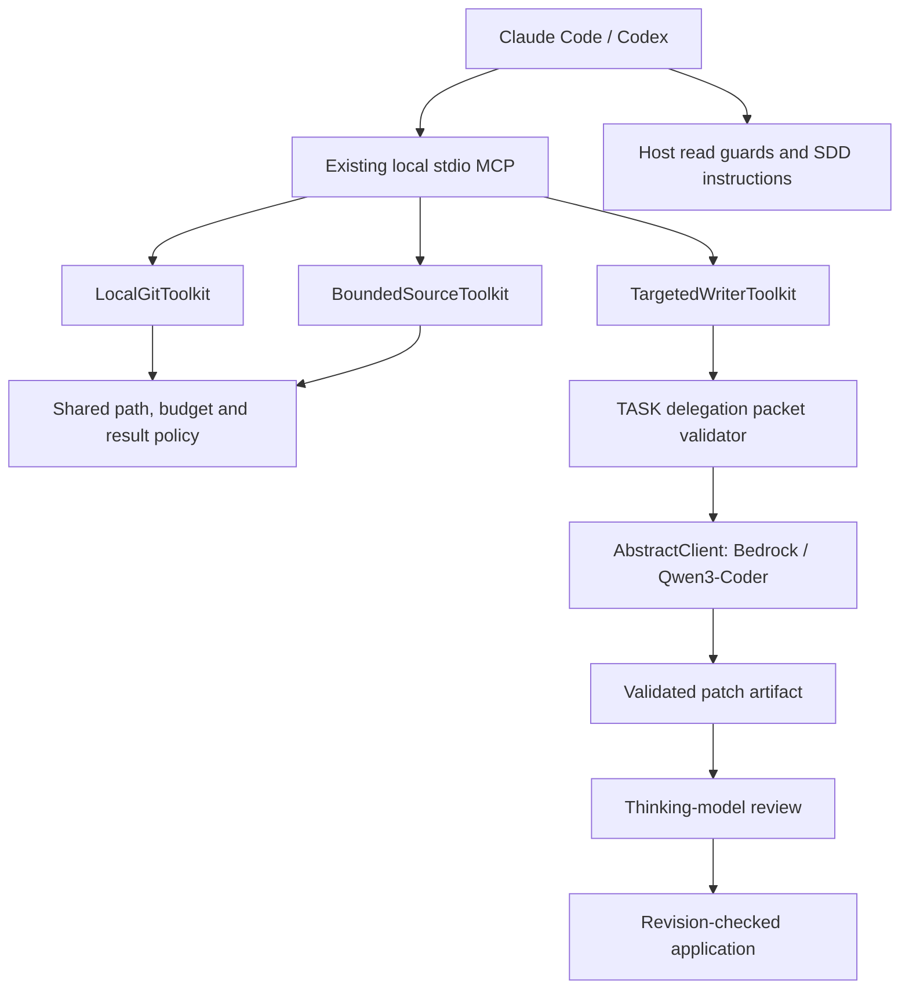

---
# SDD flow type and base branch (FEAT-145).
# - type: feature  (default)  → base_branch: dev (or any non-main branch)
# - type: hotfix              → base_branch MUST be: main
type: feature
base_branch: dev
---

# Feature Specification: Claude Code and Codex Tool Optimizations

**Feature ID**: FEAT-543
**Date**: 2026-09-10
**Author**: Jesus Lara / Codex
**Status**: draft
**Target version**: next
**Brainstorm**: `sdd/proposals/tool-optimizations.brainstorm.md`
**Recommended architecture**: Option B — three focused toolkits with shared policy and TASK contracts

---

## 1. Motivation & Business Requirements

### Problem Statement

Claude Code and Codex spend tokens constructing predictable Git commands, receiving
unnecessarily large source files, and emitting implementation text whose design has
already been decided. Replace these operations with three locally installed MCP
capabilities that are also ordinary AI-Parrot tools in `ai-parrot-tools`.

The edited brainstorm is authoritative. The owner accepted separate Git preparation
and publication, reader limits plus host guards, and generation/review/application
of patches. Delegation uses a configurable AI-Parrot client, initially the Amazon
Bedrock client with Qwen3-Coder. It is restricted to implementing code already
decided in TASK files; the delegate must not invent functionality or resolve design gaps.

### Goals

- Provide deterministic Git workflows with compact, truthful results and no LLM calls.
- Require bounded reads above 350 lines or 64,000 bytes, with explicit continuation.
- Delegate only sufficiently specified TASK work, with thinking-model review before application.
- Reuse existing AbstractTool/AbstractToolkit, local MCP installation and client infrastructure.
- Measure primary-model tokens, delegate tokens, total cost, latency and correctness separately.
- Preserve existing tool APIs, unrelated files, staging intent and host permission policies.

### Non-Goals (explicitly out of scope)

- An autonomous coding agent that explores the repository or chooses a design.
- Guaranteed interception of arbitrary shell programs or every host tool.
- Automatic commits, force push, reset, stash, history rewriting or dependency installation.
- New model SDKs, model hosting, model-weight installation, or a Portal/AiKA dependency.
- Changing the core read-only toolkit into a writer, or rewriting AbstractClient.
- Claiming a token-saving percentage without end-to-end measurements.

---

## 2. Architectural Design

### Overview

Add `parrot_tools.tool_optimizations` with three `AbstractToolkit` subclasses:
`LocalGitToolkit`, `BoundedSourceToolkit`, and `TargetedWriterToolkit`. Their public
methods become `ToolkitTool(AbstractTool)` instances. Use explicit method names
with no additional toolkit prefix, avoiding ambiguity in LLM-dependent filtering.

Expose them through existing `parrot mcp-local <name>` configuration and the
`parrot claude install` / `parrot codex install` managed installation paths.
They are independently enabled, opt-in sections, not globally enabled built-ins.
All paths are relative to an explicitly configured repository root.

### Component Diagram



### Integration Points

| Existing component | Integration type | Notes |
|---|---|---|
| `AbstractToolkit` / `ToolkitTool` | inherits / uses | Tools remain AbstractTool instances with typed schemas |
| `parrot.tools.repo.confinement` | uses | Reuse containment and secret-file checks; add operation-specific checks |
| `parrot.tools.repo.git_tools` | uses | Reuse log format/parser; validate mutation refs more strictly |
| `parrot.mcp.toolkit_config` / `toolkit_server` | extends | Add optional client-construction kwargs without changing old defaults |
| Wiki Claude/Codex installers | uses / extends | Existing MCP entries plus managed read-guard integration |
| `LLMFactory` / `AbstractClient` | uses | Existing provider construction and `ask`; no direct SDK calls |
| SDD templates, skills, commands and worker | modifies | Produce validated delegation packets and enforce review before apply |

### Data Models

All new models use Pydantic v2, forbid unknown packet fields, and reject invalid
ranges and budgets. New models below are proposed contracts, not existing symbols.

| Model | Required fields / behavior |
|---|---|
| `OptimizationPolicy` | `repo_root`; `max_lines=350`; `large_file_bytes=64000`; `max_result_bytes=64000`; `command_timeout_seconds=30`; `network_timeout_seconds=120` |
| `OperationResult` | `status: ok/error/uncertain`; `operation`; bounded `data`; optional structured `error`; `steps`; `truncated`; optional diagnostic artifact; elapsed time |
| `StepResult` | Step name, exit code or timeout, state changed, bounded diagnostics; never infer success from the last command alone |
| `SourceResult` | Relative path, SHA-256 revision, file size, returned inclusive line range, content, `truncated`, next line or EOF; no ambiguous full-file claims |
| `DelegationPacket` | `schema_version=1`, task identity, spec path, `design_complete=true`, allowed files/actions, verified references, decided implementation blocks, acceptance criteria, validation commands and limits |
| `TargetFile` | Relative path; action `create/modify`; expected SHA-256 or expected absence; planned changes; referenced TASK code-block identifiers |
| `ReferenceSlice` | Relative path, SHA-256 of source bytes, inclusive range, purpose; locally loaded, bounded and freshness checked |
| `PatchManifest` | Artifact ID, task/packet hashes, patch hash, before/after hashes, allowed paths, configured/actual model identity, usage, validation state |
| `WriterLimits` | Default packet/context bytes 128,000; patch bytes 128,000; output tokens 8,192; generation deadline 180 seconds; at most one repair |

`max_result_bytes` measures the UTF-8 encoding of the compact JSON domain result,
including metadata and escaped content, before MCP transport wrapping. Do not
truncate JSON bytes into invalid JSON: reduce content/records and serialize again.
Enforce a minimum configured result budget of 4,096 bytes so errors remain useful.
ToolResult/MCP envelope overhead is separately measured in integration tests.

### New Public Interfaces

The following signatures define the intended public surface. Return models are
serialized to JSON-compatible dictionaries at the tool boundary. All methods are async.

| Toolkit | Method signature, excluding `self` | Behavior |
|---|---|---|
| LocalGitToolkit | `git_recent(ref: str = "HEAD", limit: int = 3)` | Bounded structured history; limit 1–50 |
| LocalGitToolkit | `git_fetch(remote: str = "origin", branch: str = "dev", recent: int = 3)` | Fetch named branch, then report fetched SHA and recent commits |
| LocalGitToolkit | `git_preflight()` | Status, unstaged/staged whitespace checks and staged names |
| LocalGitToolkit | `git_prepare_files(paths: list[str])` | Validate staging policy, stage literal files, verify exact staged names and whitespace |
| LocalGitToolkit | `git_pull(remote: str = "origin", branch: str \| None = None)` | Fast-forward-only pull of current branch |
| LocalGitToolkit | `git_push(remote: str = "origin", branch: str \| None = None)` | Non-force push of current branch to the same named remote branch |
| BoundedSourceToolkit | `source_info(path: str)` | Bounded metadata, thresholds and revision, no source content |
| BoundedSourceToolkit | `source_read(path: str, start_line: int \| None = None, end_line: int \| None = None, expected_sha256: str \| None = None)` | Read a small full file or an explicit bounded inclusive range |
| TargetedWriterToolkit | `writer_generate(task_path: str)` | Validate packet, invoke configured model, return patch manifest; never modify target files |
| TargetedWriterToolkit | `writer_apply(artifact_id: str, reviewed_sha256: str)` | Check reviewed patch and source revisions; apply only validated changes |

Constructors take `repo_root: str | Path`, optional policy settings and normal
toolkit kwargs. `TargetedWriterToolkit` additionally accepts
`llm_client: AbstractClient | None = None` and writer limits. Its
`llm_dependent_tools = frozenset({"writer_generate"})`. No model override is exposed
as an ordinary tool argument. A user changes the trusted server configuration.

### Git Contract

1. Discover the repository, Git directory and index via Git commands. Support linked
   worktrees; `.git` may be a file. Reject bare repositories for worktree operations.
2. Use subprocess argument arrays, no shell interpolation, noninteractive Git,
   bounded pipe draining, timeouts and cancellation cleanup. Process output truncation
   must not hide an error or turn a failed operation into success.
3. Accept configured remote names, not arbitrary command-line options or caller URLs.
   Fetch/pull/push branches must be actual branch names, not revision expressions or
   refspecs. Resolve history refs to commits before using them.
4. Fetch failure stops dependent history lookup. Return the fetched commit identity;
   do not assume an old remote-tracking ref was updated. Use an explicit remote-tracking
   destination or the successfully fetched ref, and test freshness.
5. Preflight executes independent read-only checks even when one fails. Use
   machine-readable/NUL-delimited status and path output; report each check result.
6. Prepare accepts nonempty, unique literal file paths, including tracked deletions.
   Reject directories, globs, Git pathspec magic, symlinks, submodules, outside-root
   paths and unmerged indexes. Handle spaces and non-ASCII names without splitting.
7. Before staging, reject any unrelated staged path and any selected file with
   partially staged content that whole-file staging would replace. Already fully
   staged selected files are acceptable. Refusal leaves index and working files unchanged.
8. Stage and check in an isolated index; publish the prepared index only after all
   checks pass, the original index fingerprint remains unchanged, and the normal Git
   index lock is acquired. Respect linked-worktree index paths. Never run `git reset`.
   A failed whitespace check leaves the original staging intact.
9. Pull rejects detached/unborn HEAD, dirty tracked files, staged changes, unmerged
   paths, missing upstream when branch is omitted, mismatching explicit current
   branch, and divergence. Untracked files that would be overwritten must be preserved.
   No stash, implicit rebase or merge commit.
10. Push verifies current branch and configured destination, never pushes all refs
    or forces an update. No commit creation. Return local/remote ref identities and
    rejection details. A timeout after transmission is `uncertain`; do not blindly retry.
11. Serialize cooperating mutations per worktree with a cross-process advisory lock.
    Git locks and revision checks remain necessary because external Git processes
    do not honor the toolkit lock. Do not delete locks owned by another process.
12. Apply host permissions to mutations. No broad automatic-approval installation.
    Reuse `confirming_tools` metadata where appropriate, but a model-settable flag
    does not establish human authorization or require repeated approval already given.

### Bounded Reader Contract

1. Large means **more than** 350 logical lines **or more than** 64,000 on-disk bytes
   by default. Both thresholds are configurable. A request without both range ends
   returns `range_required` for large files, with no source text.
2. Use one coordinate system: 1-based inclusive line numbers. Both range arguments
   are required together; require `1 <= start_line <= end_line` and a requested
   span no greater than `max_lines`. Offset/limit aliases are excluded from v1.
3. Small files may be read without ranges, but the serialized result budget still
   applies. Empty files return empty content and EOF. A start beyond EOF returns
   `range_out_of_bounds`; an end beyond EOF clamps to EOF and reports the actual range.
4. Return only complete lines that fit the serialized budget, plus `next_line`.
   If the next single line cannot fit by itself, return `line_too_large` with its
   location and size; do not silently cut it or invent a byte/line hybrid cursor.
5. Chunking is repeated bounded `source_read` calls using `next_line` and
   `expected_sha256`. There is no call that concatenates every chunk into one result.
6. Compute SHA-256 from source bytes using a bounded-memory scan; recheck file
   identity/size/mtime around scans and reject concurrent modification. Hash-based
   continuation rejects stale content even when line numbers still exist.
7. Perform blocking file work off the event loop. Do not call unbounded `read()` or
   hold the entire file in memory before slicing. A single long line must not cause
   unbounded allocation. Exact line counts may be omitted when only threshold
   detection is needed. Bound wall time for hashing very large files.
8. Read UTF-8 text strictly, preserve CRLF and final-newline behavior in content,
   and report binary/invalid encoding errors. Restrict to regular files; reject
   devices, FIFOs and symlink traversal. Reuse the existing secret-file policy.

### Delegation Packet and Writer Contract

Each eligible TASK contains exactly one `## Delegation Contract` section with one
JSON fenced block representing `DelegationPacket`. Its implementation entries refer
to explicitly labelled code blocks in that same TASK. Missing/duplicate sections,
unknown versions, missing fields and unresolved placeholder code are invalid.

The thinking model owns the complete design: target files, imports, signatures,
algorithm, error handling, integration points, code patterns and tests. Required
implementation blocks contain the already-decided code or fully specified edits.
`design_complete=true` is an eligibility declaration, not proof of correctness;
the validator checks structural completeness and the thinking model verifies semantics.
A CREATE action is allowed only when that new file's implementation is already
specified. The delegate cannot select new files, invent APIs or solve unspecified behavior.

The packet includes the approved scope from the TASK file table, reference hashes
and exact bounded slices, acceptance criteria, and validation commands as argv lists.
No runtime command from a model response is ever executed. The writer itself does
not run tests; `sdd-start`/`sdd-worker` owns authorized validation after review/application.

`writer_generate` must:

1. Resolve TASK and referenced paths under the configured root; validate scope,
   existence/absence, references, packet size and code blocks before a model call.
   A stale or incomplete contract returns to the thinking model without delegate exploration.
2. Build a bounded prompt locally, containing only the packet and its approved
   excerpts. Do not include entire repository files or replay host conversation history.
3. Call the configured AbstractClient with no tools, no research, no conversation
   history, bounded output and temperature appropriate to the configured client.
   Reject any unexpected tool call or model substitution. Never enable automatic fallback.
4. Request a unified text patch. Reject malformed/fenced prose, absolute paths,
   path escapes, duplicate conflicting changes, deletions, renames, binary/mode changes,
   submodule updates, or any target outside the packet. V1 supports CREATE/MODIFY only.
5. Validate application in a temporary staging area against expected source bytes.
   Store normalized patch, before/after hashes and provenance under
   `artifacts/tool-optimizations/<artifact-id>/`. Artifacts must not be executable
   commands; use opaque IDs and restrictive permissions. Never log credentials.
6. Permit at most one repair call for a valid packet's malformed or invalid patch,
   using bounded diagnostics and the same approved context. No repair for missing
   design decisions or stale references. Enforce an overall operation deadline.
7. Return a compact manifest and patch path. The thinking model retrieves the patch
   with bounded reads and reviews every changed hunk before calling `writer_apply`.

`writer_apply` verifies the supplied reviewed patch hash, packet identity and every
target/reference precondition again. It rejects staged target files, changed targets,
unexpected CREATE collisions and edited artifacts. Existing unstaged changes are
allowed only when they were part of the exact hashed baseline in the packet.

Prepare all new file contents before writing. Use a worktree-scoped lock, adjacent
temporary files, per-file atomic replacement and a recovery journal of before/after
hashes. Multi-file filesystem mutation is not globally atomic: on failure, restore
only files still matching this operation's written hash. If concurrent edits or a
crash prevent safe rollback, return `recovery_required`, retain the journal and stop.
Never reset the repository or overwrite a concurrent user's edit during recovery.
Successful reapplication of the same artifact reports `already_applied` after
verifying all after-hashes. Applying never stages, commits or pushes.

### Client Configuration and Lifecycle

Add optional `llm_kwargs: dict[str, Any] = {}` to `ToolkitSection`. Pass these to
`LLMFactory.create(section.llm, **section.llm_kwargs)`. Reject kwargs without `llm`
and collisions with the factory's `llm` argument. Existing configurations preserve
their behavior. Tool model selection remains independent of host reasoning models.

Initial example configuration, using existing repository model aliases:

```yaml
toolkits:
  local-git:
    class: parrot_tools.tool_optimizations.git.LocalGitToolkit
    kwargs:
      repo_root: .
  bounded-source:
    class: parrot_tools.tool_optimizations.reader.BoundedSourceToolkit
    kwargs:
      repo_root: .
  targeted-writer:
    class: parrot_tools.tool_optimizations.writer.TargetedWriterToolkit
    llm: bedrock-converse:qwen3-coder-480b-a35b
    llm_kwargs:
      fallback_model: null
      max_retries: 1
      read_timeout: 120
    kwargs:
      repo_root: .
```

`llm_kwargs` is trusted configuration, not an LLM-callable argument. Use the existing
AWS credential/profile/environment resolution; do not serialize secrets into examples
or diagnostics. Region and model access are deployment settings. This alias is
source-verified, not a claim that every AWS account/region can invoke it.

Explicit `fallback_model: null` is required in the writer's documented Bedrock
configuration because the existing client otherwise selects a fallback. Constructor
validation must reject a writer configuration that permits silent model switching.
Do not change the default fallback behavior of other consumers.

Use existing client context management and ensure acquired resources are released
on success, errors and cancellation. Do not assume MCP shutdown closes toolkit
clients automatically; keep writer calls scoped and serialize shared-client use.
Same-model transport retries and one patch-repair attempt are distinct budgets;
both count toward the operation deadline and recorded usage.

### Host Guards and SDD Workflow

Provide opt-in managed guards for supported Claude Code and Codex installations.
Guard policy uses the same thresholds as the MCP reader. Return concise denials
with the bounded-reader tool name and valid range arguments.

Direct structured Read calls and simple literal `cat`, `head`, `tail`, `less`, `more`
reads are the v1 interception scope. Parse only this documented shell subset; do
not execute commands to inspect them. Bounded flags are checked against configured
limits. A pipe is not automatically safe. Compound scripts, dynamic expansions,
interactive-session input and arbitrary interpreters are documented coverage gaps.
Unrecognized shell forms keep normal host behavior, with no claim of full enforcement.

Managed installation is idempotent and removes only owned entries on uninstall.
Preserve foreign MCP/hook configuration and malformed config files; refuse an
unsafe rewrite with an actionable error. Report whether guards are installed and
supported. Missing hooks never disable mandatory limits inside the MCP reader.

Claude Code and Codex document pre-tool decisions; Codex explicitly notes tool-path
exceptions and that `write_stdin` does not rerun the pre-hook. Test the installed
host version/configuration rather than assuming identical coverage.
[Claude Code hooks](https://code.claude.com/docs/en/hooks),
[Codex hooks](https://learn.chatgpt.com/docs/hooks).

Update both Codex skills and Claude commands/worker:

- `sdd-spec`: identify delegation-eligible modules and include decided implementation
  patterns and exact contracts, keeping architecture decisions with the thinking model.
- `sdd-task`: emit packets only for complete tasks; refresh hashes at execution-time
  validation after dependencies land. Never pretend a placeholder is delegated code.
- `sdd-start` / `sdd-worker`: validate, generate, inspect all patch hunks, apply, run
  real acceptance tests, then update SDD state and commit through the existing workflow.
- Old TASK files remain valid for normal implementation. They are ineligible for
  delegation until explicitly enriched; failure never silently invokes another coder.

---

## 3. Module Breakdown

All new source paths below are proposed. Each module maps to one or more atomic
tasks; task decomposition must assign shared files to one owner.

| Module | Paths | Responsibility / dependencies |
|---|---|---|
| M1: Models and policy | `packages/ai-parrot-tools/src/parrot_tools/tool_optimizations/{__init__,models,policy}.py` | Schemas, result bounds, path policy, locks; existing confinement helpers |
| M2: Local Git | `packages/ai-parrot-tools/src/parrot_tools/tool_optimizations/git.py` | Deterministic Git operations and index transaction; M1 |
| M3: Bounded source | `packages/ai-parrot-tools/src/parrot_tools/tool_optimizations/reader.py` | Streaming ranges, revisions and continuation; M1 |
| M4: Delegation contracts | `packages/ai-parrot-tools/src/parrot_tools/tool_optimizations/contracts.py` | TASK parser, code-block and scope/freshness validation; M1, M3 |
| M5: Writer and artifacts | `packages/ai-parrot-tools/src/parrot_tools/tool_optimizations/{writer,patches}.py` | AbstractClient generation, validation, manifest, apply/recovery; M1, M4 |
| M6: MCP client configuration | `packages/ai-parrot/src/parrot/mcp/{toolkit_config,toolkit_server}.py`; `examples/tool-optimizations-mcp.yaml` | Backward-compatible llm_kwargs, examples and exposure tests; M1–M5 |
| M7: Host integration | New `packages/ai-parrot-tools/src/parrot_tools/tool_optimizations/{hooks,installation}.py`; wiki Claude/Codex installer integration as required | Opt-in guard command/assets, managed installation and status; M3, M6 |
| M8: SDD contracts | `sdd/templates/{spec,task}.md`; `.agents/skills/sdd-{spec,task,start}/SKILL.md`; `.claude/commands/sdd-{spec,task,start}.md`; `.claude/agents/sdd-worker.md` | Planning/delegation/review parity across hosts; M4, M5 |
| M9: Evaluation and docs | `docs/tool-optimizations.md`; `benchmarks/tool_optimizations/`; new tests listed below | Reproducible comparisons, deployment instructions, limitations; M2–M8 |

#### Worktree Strategy

- **Isolation**: per-spec.
- M2 and M3 may proceed independently after M1. M4 precedes M5. M6/M7 integrate
  after public names stabilize. M8 has one coordinated owner for template/skill changes.
- Reuse completed FEAT-484 read-only tooling and FEAT-485 local MCP infrastructure.
  Preserve their APIs and tests. Avoid unrelated changes to existing GitToolkit or CodeToolkit.
- Recheck concurrent modifications to installers, templates and MCP configuration
  before task assignment. No implementation worktree or agents are launched by this spec.

---

## 4. Test Specification

### Unit Tests

Tests live under `packages/ai-parrot-tools/tests/tool_optimizations/` unless noted.

| Test group | Module | Required cases |
|---|---|---|
| `test_policy.py` | M1 | Outside paths, symlinks, secret files, byte limits including JSON escaping, invalid budgets, lock ownership |
| `test_git.py` | M2 | Fetch failure/freshness, recent limit, every preflight result, literal names, deletions, unrelated and partial staging, index preservation on failure, linked worktrees, detached/unborn HEAD, divergence, no-force push and uncertain timeout |
| `test_reader.py` | M3 | 349/350/351 lines; 63,999/64,000/64,001 bytes; CRLF; no final newline; empty file; EOF; stale hashes; long single line; binary/invalid UTF-8; bounded allocations; independent line/byte caps |
| `test_contracts.py` | M4 | Missing/duplicate JSON section, schema version, unknown fields, stale references, scope mismatch, placeholders, underspecified CREATE, invalid command argv, context budget exceeded before any model call |
| `test_writer.py` | M5 | Fake AbstractClient; no tools/history; exact model; fallback disabled; one repair maximum; deadline/cancellation cleanup; invalid patch/scope/path/mode; no target mutation during generation |
| `test_apply.py` | M5 | Hash-gated review, tampered artifact, changed target/reference, staged target refusal, create collision, all-preconditions-first, rollback, concurrent-edit recovery_required, crash journal and idempotent retry |
| Core MCP configuration tests | M6 | Old configuration compatibility; llm_kwargs pass-through, invalid collisions, absent-model filtering and no model import for deterministic toolkits |
| `test_hooks.py`, `test_installation.py` | M7 | Host fixtures, structured reads, supported shell subset, pipe/large-limit cases, coverage gaps, duplicate install, owned uninstall, foreign/malformed config preservation |
| `test_sdd_contracts.py` | M8 | Equivalent host instructions, old TASK fallback, complete packet example, review-before-apply ordering and no delegated SDD mutation |

### Integration Tests

| Test | Description |
|---|---|
| Stdio protocol | Initialize/list/call tools in each server; stdout is JSON-RPC only; every exposed tool is an AbstractTool |
| Raw MCP validation | Send invalid arguments directly over tools/call, not just Python API; policy cannot depend solely on AbstractTool.execute |
| Git lifecycle | Temporary repo + local bare remote + linked worktree; compare refs, files and index bytes across success/failure |
| Writer lifecycle | Complete TASK → fake model → artifact → bounded hunk review → apply → actual pytest acceptance test; record evidence separately from model claims |
| Cross-process coordination | Two toolkit processes target the same index/files; no silent lost update or lock theft |
| Client configuration | Fake factory verifies Bedrock alias, explicit null fallback and constructor kwargs; optional real Bedrock smoke test gated by deployment credentials |
| Host smoke tests | Pin and record installed host versions, exercise guard denial and bounded read, and report unsupported configurations explicitly |

### Test Data / Fixtures

Use deterministic temporary repos, fixed commit metadata, a local bare remote,
preconstructed TASK packets and model-response patches. No live AWS or internet is
required for unit/integration CI. Use a recording fake AbstractClient with usage and
cancellation controls. Generate size-boundary fixtures in tests; do not commit huge files.
Retain test logs in `artifacts/logs/` and compact benchmark reports under
`artifacts/tool-optimizations/benchmarks/`.

### Measurement Protocol

Benchmark identical accepted tasks and repository revisions with baseline and
optimized workflows. Include Git fetch/preflight/preparation, targeted reads from
large files, and decided CREATE/MODIFY tasks. Record at least five runs per scenario
for live model comparisons, with model/configuration, warm/cold context state,
median and p95 latency, acceptance-test outcome and retry counts.

Count tool-schema overhead, planning/packet preparation, primary input/output,
delegate input/output, review and repair. Report missing provider usage as unknown,
not zero. Use configured prices for cost estimates, recording their provenance;
never equate fewer primary tokens with fewer total tokens. Numeric product targets
remain the one unresolved release decision in §8.

---

## 5. Acceptance Criteria

- [ ] AC1: All three independently configurable toolkits expose AbstractTool instances through local stdio MCP for both hosts.
- [ ] AC2: Git operations execute no LLM calls, preserve each step's result, support linked worktrees, and pass failure/staging/ref tests in §4.
- [ ] AC3: Selected-file preparation never resets unrelated staging; rejected or failed preparation preserves the original index.
- [ ] AC4: Pull is fast-forward-only and push never forces or creates commits; uncertain remote outcomes are explicitly reported.
- [ ] AC5: Files above either accepted threshold require explicit ranges; every returned domain result respects its serialized byte budget.
- [ ] AC6: Reader memory use is bounded independently of file/line length; complete-line continuation and stale revision tests pass.
- [ ] AC7: Incomplete or stale TASK packets cause no delegate call; the writer has no repository-exploration or architecture-design mode.
- [ ] AC8: Bedrock/Qwen configuration uses ai-parrot-client-amazon through LLMFactory/AbstractClient, explicitly disables model fallback, and preserves old MCP config behavior.
- [ ] AC9: Generation produces only validated artifacts. Apply requires the reviewed patch hash and matching current source/packet preconditions.
- [ ] AC10: Application preserves unrelated edits/index state and passes rollback, crash recovery, concurrency and idempotency tests.
- [ ] AC11: One repair maximum and configured token/time budgets are enforced; actual model usage is recorded without treating model-written test claims as execution evidence.
- [ ] AC12: Both SDD host workflows produce eligible packets and require review before apply; legacy tasks retain the normal implementation route.
- [ ] AC13: Host guards pass their documented coverage matrix and installer idempotence tests; bypasses and unsupported versions are clearly documented.
- [ ] AC14: Relevant unit, integration, existing MCP/config regression tests and formatting checks pass with logs under artifacts/logs/.
- [ ] AC15: Documentation, example configuration and reproducible baseline/optimized reports are delivered; correctness/scope parity is mandatory. Numeric savings/latency targets must be resolved before release approval, not fabricated in this draft.

---

## 6. Codebase Contract

Source references were re-read against synchronized dev during specification work.
New interfaces in §2 are proposed; the symbols below already exist. Source validation
does not assert live AWS model access or successful provider imports in every environment.

### Verified Imports

```python
from parrot.tools.abstract import AbstractTool  # packages/ai-parrot/src/parrot/mcp/server_base.py:14
from parrot.tools.toolkit import AbstractToolkit  # packages/ai-parrot/src/parrot/tools/repo/toolkit.py:28
from parrot.tools.repo.confinement import resolve_within_root, resolve_readable_path
# definitions: packages/ai-parrot/src/parrot/tools/repo/confinement.py:63 and :115
from parrot.clients.factory import LLMFactory  # packages/ai-parrot/src/parrot/mcp/toolkit_server.py:100
from parrot.clients.amazon import BedrockConverseClient
# export: packages/ai-parrot-client-amazon/src/parrot/clients/amazon/__init__.py:1
```

### Existing Class Signatures

| Existing signature / attribute | Verified source |
|---|---|
| `class ToolkitTool(AbstractTool)` | `packages/ai-parrot/src/parrot/tools/toolkit.py:35` |
| `AbstractToolkit.get_tools(self, permission_context: Optional["PermissionContext"] = None, resolver: Optional["AbstractPermissionResolver"] = None) -> list[AbstractTool]` | `packages/ai-parrot/src/parrot/tools/toolkit.py:486` |
| `confirming_tools: frozenset = frozenset()` / `llm_dependent_tools: frozenset = frozenset()` | `packages/ai-parrot/src/parrot/tools/toolkit.py:275`, `:294` |
| `create_toolkit_mcp_server(name: str, root: Path = Path.cwd(), **overrides: Any) -> StdioMCPServer` | `packages/ai-parrot/src/parrot/mcp/toolkit_server.py:29` |
| `ToolkitSection.class_path`, `enabled`, `kwargs`, `include`, `exclude`, `llm`, `env` | `packages/ai-parrot/src/parrot/mcp/toolkit_config.py:43` |
| `ReadOnlyRepoToolkit.read_file(self, path: str, start: int = 1, end: int = 0) -> RepoReadResult \| RepoToolError` | `packages/ai-parrot/src/parrot/tools/repo/toolkit.py:200` |
| `ReadOnlyRepoToolkit.git_log(self, path: str = "", limit: int = 20) -> dict[str, Any] \| RepoToolError` | `packages/ai-parrot/src/parrot/tools/repo/toolkit.py:527` |
| `resolve_within_root(root: Path, candidate: str) -> Path` | `packages/ai-parrot/src/parrot/tools/repo/confinement.py:63` |
| `resolve_readable_path(root: Path, candidate: str) -> Path` | `packages/ai-parrot/src/parrot/tools/repo/confinement.py:115` |
| `parse_log(stdout: str) -> list[dict[str, str]]`, `LOG_FORMAT` | `packages/ai-parrot/src/parrot/tools/repo/git_tools.py:61`, `:24` |
| `CodingTask.files_in_scope`, `constraints`; `CodingTaskResult` | `packages/ai-parrot-tools/src/parrot_tools/code_toolkit.py:38`, `:43` |
| `CodingProvider.run_task(self, task: CodingTask, model: str \| None = None) -> CodingTaskResult` | `packages/ai-parrot-tools/src/parrot_tools/code_toolkit.py:58` |
| `CodeToolkit.__init__(self, provider: CodingProvider, default_model: str \| None = None) -> None` | `packages/ai-parrot-tools/src/parrot_tools/code_toolkit.py:279` |
| `LLMFactory.create(llm: str, model_args: Optional[Dict[str, Any]] = None, tool_manager: Optional[Any] = None, **kwargs) -> AbstractClient` | `packages/ai-parrot/src/parrot/clients/factory.py:257` |
| `class BedrockConverseClient(BedrockConverseBase)`; provider key `bedrock-converse` | `packages/ai-parrot-client-amazon/src/parrot/clients/amazon/bedrock.py:1650`, `:1665` |
| `BedrockConverseBase.ask(...) -> AIMessage` accepts `prompt`, `model`, `max_tokens`, `temperature`, `system_prompt`, `history`, `tools`, `use_tools` | Full signature at `packages/ai-parrot-client-amazon/src/parrot/clients/amazon/bedrock.py:723`; use only verified named parameters |
| `AIMessage.output`, `response`, `usage` | `packages/ai-parrot/src/parrot/models/responses.py:79`, `:82`, `:118` |
| `CompletionUsage.prompt_tokens`, `completion_tokens`, `total_tokens` | `packages/ai-parrot/src/parrot/models/basic.py:76`, `:79`, `:82` |

### Integration Points

| New component | Connects to | Via | Verified at |
|---|---|---|---|
| Toolkits | AbstractToolkit wrappers | `get_tools()` and public async methods | `packages/ai-parrot/src/parrot/tools/toolkit.py:637` |
| MCP configuration | LLMFactory | Existing `create(section.llm)` extended with llm_kwargs | `packages/ai-parrot/src/parrot/mcp/toolkit_server.py:102` |
| Writer constructor | MCP injection | `kwargs["llm_client"]` | `packages/ai-parrot/src/parrot/mcp/toolkit_server.py:110` |
| Bedrock writer | Existing model alias | `qwen3-coder-480b-a35b` maps to `qwen.qwen3-coder-480b-a35b-v1:0` | `packages/ai-parrot-client-amazon/src/parrot/clients/amazon/models.py:130` |
| No-fallback policy | Bedrock constructor | Explicit null prevents class fallback default | `packages/ai-parrot-client-amazon/src/parrot/clients/amazon/bedrock.py:282` |
| Client resource scope | Context manager | `__aenter__` / `__aexit__` | `packages/ai-parrot/src/parrot/clients/base.py:1021`, `:1033` |
| Claude installation | Existing managed reconciliation | `_install_mcp_json(root)` | `packages/ai-parrot/src/parrot/knowledge/wiki/claude_code/installer.py:276` |
| Codex installation | Existing managed reconciliation | `_install_mcp(root)` | `packages/ai-parrot/src/parrot/knowledge/wiki/codex/installer.py:112` |
| TASK packet production | Existing Codebase Contract / patterns | Extend template and task authoring | `sdd/templates/task.md:43`, `:77`; `.agents/skills/sdd-task/SKILL.md:59` |
| Review/apply workflow | Existing contract verification | Extend execution stages | `.agents/skills/sdd-start/SKILL.md:58`; `.claude/agents/sdd-worker.md:219` |

### Does NOT Exist (Anti-Hallucination)

- `LocalGitToolkit`, `BoundedSourceToolkit`, `TargetedWriterToolkit`,
  `DelegationPacket` and `ToolkitSection.llm_kwargs` are new work, not existing APIs.
- `CodeToolkit` does not accept `llm_client`; its provider contract is useful context,
  but it cannot be passed directly to current MCP injection without adaptation.
- `ReadOnlyRepoToolkit.read_file` is not a bounded-memory source reader: it reads
  the whole file before range slicing (`toolkit.py:227`). Preserve its existing API.
- A `.git` directory is not universal: existing GitToolkit.pull_repo's directory
  check cannot be copied for linked worktrees (`packages/ai-parrot-tools/src/parrot_tools/gittoolkit.py:1671`).
- MCP schema declaration does not guarantee runtime validation. Current adapter
  calls `tool._execute(**arguments)` (`packages/ai-parrot/src/parrot/mcp/adapter.py:79`).
  New toolkit policy must validate raw arguments in `_pre_execute` before wrapper
  argument filtering, and validate direct public calls too. Do not broaden this
  feature into a global adapter rewrite.
- A patch hash proves artifact identity, not semantic review; review is enforced
  by the SDD workflow and actual inspection, not by inventing a human-approval token.
- No existing hook setup guarantees complete mediation of shell reads.

### User-Provided Code

The command examples are preserved as input requirements, not execution recipes:

```text
git fetch origin dev
git status --short && git diff --check && git diff --cached --name-only
git reset HEAD && git add -- {filename} && git diff --cached --name-only && git diff --cached --check
```

The third command only prepares staging. The accepted design replaces its global
reset behavior with refusal on conflicting staging and keeps publication separate.
The full original Claude transcript remains in the brainstorm's Code Context.

---

## 7. Implementation Notes & Constraints

### Patterns to Follow

- Async-first methods, strict types, Pydantic schemas, Black/isort conventions,
  docstrings as tool descriptions, stderr logging for MCP process diagnostics.
- Reuse confinement/log utilities by composition. Preserve the read-only core
  toolkit and existing CodeToolkit/GitToolkit public behavior.
- Keep imports of provider satellites lazy. Git/reader startup must not require
  AWS dependencies or credentials. No new third-party package is needed.
- Validate models and operation policy inside the toolkit execution path; malicious
  raw tools/call input must be rejected before any subprocess/model/file mutation.
- Keep results concise and artifacts recoverable. Bound output while draining
  subprocess pipes to avoid deadlock. Never log full credential-bearing config.

### Known Risks / Gotchas

| Risk | Required mitigation |
|---|---|
| Savings disappear into planning/review overhead | Full-task accounting and baseline reports; no borrowed Shunt percentage |
| Model designs missing behavior | Delegation eligibility, explicit implementation blocks, refusal and thinking-model review |
| Bedrock silently changes model | Explicit null fallback, configured/actual identity checks, fake-client regression tests |
| MCP bypasses AbstractTool.execute validation | Toolkit-boundary validation plus raw MCP integration tests |
| Prompt/code artifacts expose private repository content | Send only approved slices to the configured provider; inherit project data policy |
| Concurrent writers or process crash | Locks, hashes, per-file atomic replace and recovery journal; disclose lack of global filesystem atomicity |
| Installer erases foreign/malformed settings | Refuse malformed config; reconcile only owned entries |
| Host guards cause a false sense of enforcement | Published coverage matrix and supported-host smoke checks |

### External Dependencies

| Package/tool | Existing declaration | Reason |
|---|---|---|
| Pydantic | `2.12.5`, `packages/ai-parrot/pyproject.toml:54` | Typed contracts and validation |
| MCP SDK | `>=1.28.1,<2`, existing optional extra at `packages/ai-parrot/pyproject.toml:475` | Existing local MCP transport |
| `ai-parrot-client-amazon` | Existing workspace satellite | Initial Bedrock writer provider |
| `aioboto3` | `>=13.2.0`, `packages/ai-parrot-client-amazon/pyproject.toml:17` | Already used by Amazon client; no direct toolkit SDK usage |
| Git executable and Python stdlib | Existing project tools | Git, filesystem, hashing, JSON and subprocess operations |

The source-verified model alias is configurable. Deployment must verify its own
account/region access; no live Bedrock request is required to create this spec.

---

## 8. Open Questions

Resolved brainstorm entries marked `[x]` are carried forward verbatim below.
Inline owner answers that remained `[ ]` are also preserved verbatim; their clear
decisions are implemented in §2 and summarized as resolved entries after them.

- [x] Flow metadata — *Owner: maintainer*: `type: feature`, `base_branch: dev` by the brainstorm skill's unanswered defaults; no explicit selection received.
- [x] Tool/MCP architecture — *Owner: maintainer*: User requires all three capabilities as parrot-tools tools inheriting AbstractTool and locally installable MCP capabilities; existing ToolkitTool wrappers provide that inheritance.
- [ ] Release scope and numeric success criteria — *Owner: Jesus Lara*: Ship all three together or stage delivery? Set token/cost targets, acceptable latency, and evaluation task mix. Proposed: retain all three, implement foundations first, require correctness parity.
- [x] Git selected-file semantics — *Owner: Jesus Lara*: Preparation only or commit-and-push? Refuse unrelated staging or explicitly replace it? Proposed: prepare/check with refusal on conflicting staging, separate publicationi.: yes, the proposed
- [x] Reader enforcement scope — *Owner: Jesus Lara*: Are tool-side limits plus tested host guards with documented bypasses sufficient? Proposed: yes; comprehensive interception would expand scope substantially: yes.
- [ ] Writer application policy — *Owner: Jesus Lara*: Generate a reviewed patch or directly modify allowed paths before review? Proposed: generate/review/apply with revision checks.: is safely to generate and review the patch before apply
- [ ] Contract gaps and repair policy — *Owner: Jesus Lara*: Reject incomplete/stale packets or allow worker exploration? Proposed: reject and return to the thinking model, with at most one repair for a valid packet's generated patch.: ok
- [ ] Exact coder configuration — *Owner: maintainer*: Choose the deployed Qwen3-Coder or other provider/model, endpoint, local/cloud data policy, context/output limits, and timeout. Do not silently choose a fallback provider.: is adding a configuration for using a LLM client from ai-parrot (in this case, ai-parrot-client-amazon with bedrock + Qwen3-coder) but only for that code that is already decided to be deployed in TASK- files, not for creating new code.
- [ ] Reader byte and continuation contract — *Owner: spec author*: Confirm byte threshold/result cap, metadata accounting, hash freshness and oversized-line behavior. Proposed starting point: 64,000 bytes and 350 lines; must be validated against fixtures.: yes, validated against fixtures.

### Decisions extracted from inline owner answers

- [x] Writer application — *Owner: Jesus Lara*: Generate and review the patch before applying; enforced in §2.
- [x] Contract gaps and repair — *Owner: Jesus Lara*: Reject incomplete/stale contracts; at most one repair for a valid packet.
- [x] Coder configuration — *Owner: Jesus Lara*: Configure an AI-Parrot client, initially ai-parrot-client-amazon with Bedrock/Qwen3-Coder, only for code already decided in TASK files. Runtime account/region settings remain deployment configuration.
- [x] Reader defaults — *Owner: Jesus Lara*: 64,000 bytes and 350 lines, validated against fixtures; precise continuation is defined in §2.

**Remaining substantive decision:** release bundling and numeric savings/latency targets. This is a draft for review; no target has been represented as owner-approved. All three capabilities remain in scope.

---

## Revision History

| Version | Date | Author | Change |
|---|---|---|---|
| 0.1 | 2026-09-10 | Jesus Lara / Codex | Initial FEAT-543 draft from Option B and inline owner decisions; verified existing MCP and Bedrock contracts |
