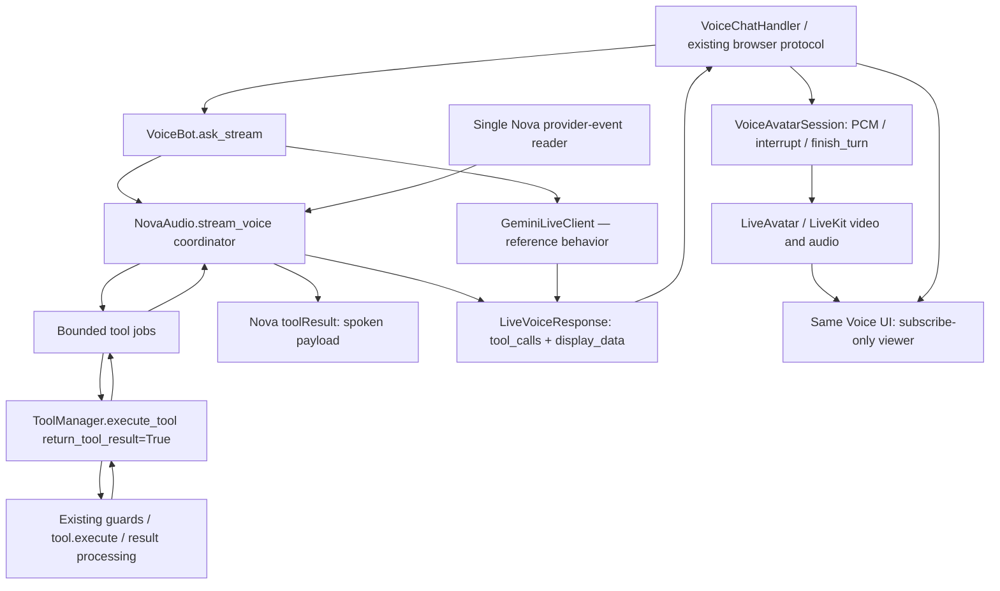

# Feature Specification: VoiceBot — Nova dual output and LiveAvatar in the Voice UI

**Feature ID**: FEAT-536
**Date**: 2026-09-07
**Author**: Jesus Lara (specification prepared with Codex)
**Status**: approved
**Target version**: next planned release after core 1.0.0; no version bump in this feature

Source: accepted [proposal](../proposals/voicebot-liveavatar-implementation.proposal.md), research identity **FEAT-560**. **FEAT-536** is the formal identity returned by the shared ID allocator. These identities have different purposes; do not rename the proposal audit directory or reserve another feature ID during task decomposition.

The user accepted the presented scope with **“continuar con este alcance”**: parity for `ToolResult.voice_text` + `display_data`, including the existing WebSocket and LiveAvatar audio integration. The user subsequently required visible LiveAvatar playback in that same test UI; this is part of the final scope. This specification defines the implementation; approval of the proposal does not mark this new specification approved.

---

## 1. Motivation & Business Requirements

### Problem Statement

Switching `VoiceConfig.provider` already selects Gemini Live or Nova 2 Sonic and produces the common `LiveVoiceResponse` envelope. The remaining tool-result behavior differs:

- Gemini's `LiveToolAdapter.execute_tool()` keeps the complete `ToolResult`, selects `voice_text` for the provider response, and forwards `display_data` through response metadata.
- Nova's `_flush_pending_tools()` uses `AbstractClient._execute_tool()`. That path reduces tool output to a payload; `ToolManager.execute_tool()` has already extracted and potentially compressed `result.result` for `AbstractTool` instances. Nova therefore cannot recover the spoken and visual fields by adding metadata after execution.
- The existing WebSocket handler already emits `display_data` frames and forwards 24 kHz PCM to `VoiceAvatarSession`. These consumers can serve Nova once its result contract is complete. The provider-switch browser page currently handles audio/transcriptions but has no `display_data` or `tool_call` message cases; a small extension to that same page is required to observe dual output live.
- Nova queues completed tool calls until another non-tool event arrives. A provider waiting for a tool result may never send that next event. This is a code-grounded progress risk, not a production incident proven by the proposal's tests.

See §6 and proposal findings F001–F007. The provider-conformance fixtures use preloaded event lists; the Nova tool-result tests replace `_execute_tool()` with a mock. Neither proves the missing end-to-end behavior.

### Goals

- **G1 — Dual output:** the same voice-aware tool produces a provider-facing spoken result and a frontend-facing structured object on both providers.
- **G2 — Execution integrity:** Nova uses the existing tool execution pipeline with its configured permissions, grant/confirmation checks, credential broker, lifecycle and result hooks. Complete result statuses remain observable.
- **G3 — Progress:** execute a completed tool request without waiting for a future provider event, while continuing to receive audio, text and interruption events during asynchronous tool execution.
- **G4 — Delivery:** one streamed tool-result event per invocation and one visual delivery per successful, non-stale invocation that supplies nonempty display data; completion snapshots do not duplicate streamed events.
- **G5 — Visible avatar integration:** exercise VoiceBot → WebSocket → optional LiveAvatar with both providers, and display the avatar video/audio in the existing Voice UI using the current viewer-credential contract.
- **G6 — Regression protection:** retain default ToolManager behavior for existing consumers, Gemini output behavior, provider options, transcription roles, usage and session lifecycle.

- **G7 — Real-live acceptance:** use `examples/clients/voice` as the canonical end-to-end test UI for both real providers, as explicitly requested by the user.

### Non-Goals (explicitly out of scope)

- Native model JSON-schema output without tool-calling; transcripts are not structured output.
- New voice providers, a provider router, avatar FULL-mode services, WebRTC/SIP redesign, a replacement browser UI or translation work. Event display and a LiveAvatar viewer in the existing provider-switch page are included.
- Identical generated audio, wording, native voices or latency across providers; cross-provider conversation migration.
- Nova native STT-only emulation or a redesign of provider capability descriptors.
- Changes to `AbstractClient`'s public or private tool-execution contract, generic text-client output semantics, or conversation-memory ownership.
- Reworking buffered `ask_voice()` aggregation or the raw-client `VoiceSession` demo vocabulary. The supported path here is VoiceBot realtime streaming through `VoiceChatHandler`.
- Making arbitrary blocking implementations of asynchronous tools nonblocking, undoing external tool side effects, or automatically replaying tools after reconnect.

---

## 2. Architectural Design

### Overview

Add a **keyword-only, opt-in complete-result mode** to `ToolManager.execute_tool()`. Nova's voice path calls this mode directly with request-local trusted context. The ordinary manager call and `AbstractClient._execute_tool()` remain compatible.

Within Nova, separate provider-event reception from tool execution and completed-result delivery. Admit a tool call when its TOOL content ends; a coordinator observes both provider events and completed tool jobs. All state belongs to the individual `stream_voice()` invocation. Retain the provider wire adapter and the common voice envelope.

The WebSocket relay tracks which tool IDs it already sent in the current turn. It can retain full completion snapshots for Python consumers while suppressing their duplicate streamed notifications. LiveAvatar continues receiving the existing PCM stream, interruptions and turn completion. A viewer controller in the same Voice UI subscribes to the room returned by the handler; it does not create a second avatar session.

### Component Diagram



### Integration Points

| Existing component | Integration type | Required behavior |
|---|---|---|
| `ToolManager.execute_tool` | additive option | Preserve a complete result before payload reduction; default behavior remains compatible |
| `AbstractTool` | narrow internal addition | A tool-instance lock for complete-result invocations, shared when managers reuse the same instance |
| `NovaAudio` | modifies voice execution/receive loop | Separate tool jobs from provider-event consumption and emit dual-output responses |
| `VoiceBot.ask_stream` | uses existing kwargs forwarding | Python callers may pass trusted `permission_context`; do not derive permissions from model arguments |
| `_HandlerVoiceSession` / `VoiceChatHandler` | modifies relay bookkeeping | Deduplicate streamed tool results across delta and final snapshot; preserve frame keys |
| `VoiceAvatarSession` | reused unchanged | Forward 24 kHz PCM and lifecycle signals |
| Existing provider-switch page | extends | Avatar toggle, viewer card, tool/data events and one audible output source |
| `livekit-client` / admin AvatarViewer | reuses SDK and lifecycle patterns | Subscribe-only browser viewer; voice sessions remain owned by VoiceChatHandler |
| `GeminiLiveClient` | regression reference | No production-code migration to the new manager mode in this feature; compare voice-aware AbstractTool behavior |
| Existing conformance fixtures | extends | Real tool execution with mocked provider transport, including causally gated streams |

### Data Models

Reuse the existing `ToolResult`, `LiveToolCall` and `LiveVoiceResponse`. No new public envelope is needed.

| Layer | Spoken channel | Structured channel | Status/correlation |
|---|---|---|---|
| Tool execution | `ToolResult.voice_text` | `ToolResult.display_data` | `status`, `success`, `error`, metadata |
| Nova wire result | normalized spoken payload serialized by `_send_tool_result` | not automatically copied from `display_data` | original `toolUseId` and the existing content frame sequence |
| Python response | generated `audio_data`; optional transcript in `text` | `metadata["display_data"]` | `LiveToolCall.id`, `session_id`, `turn_id`, `user_id` |
| Browser | existing `response_chunk.audio_base64` | existing `display_data.data` | existing `tool_call` frame shape; relay keeps dedup state internally |
| LiveAvatar | the same PCM bytes | not sent to the avatar | existing interrupt/finish/close methods |

Nova's private pending-job records must retain invocation ID, arrival order, effective arguments, task/result state, and an interruption generation number. Use private typed dataclasses or equivalent typed records inside the Amazon package. These are **new internal implementation details**, not existing imports.

### New Public Interfaces

The following is the **proposed** signature, not the current signature:

```python
async def execute_tool(
    self,
    tool_name: str,
    parameters: Dict[str, Any],
    permission_context: Optional[PermissionContext] = None,
    *,
    return_tool_result: bool = False,
) -> Any
```

Use overloads if needed to express `return_tool_result=True -> ToolResult` without changing the default call signature. Do not introduce a client-specific result type into core.

No new WebSocket message or mandatory VoiceConfig option is introduced. `permission_context`, when supplied by a trusted Python caller through existing `**kwargs`, is local execution context; it must never be sent in a provider prompt, tool argument JSON, or frontend message. Missing context keeps the existing manager behavior; this feature does not invent roles from a browser payload or make transport authentication equivalent to permission-context construction.

### Complete-result execution contract

1. **Default mode:** preserve current raw return values, raised exceptions, early-return statuses, guard order, compression and hook behavior. Existing callers need no changes.
2. **Opt-in mode:** use the same dispatch and enforcement path exactly once. Do not call the private tool implementation, execute twice, bypass the manager, or recover fields from shared “last result” attributes.
3. **`AbstractTool` success:** preserve its envelope; extraction/result hooks observe the same original payload they currently observe, exactly once, before compression. Return a copied envelope with a distinct metadata dictionary whose `result` is the normal postprocessed/compressed payload and whose voice/display fields survive. Do not mutate the tool-owned envelope. Do not compress either voice-specific field.
4. **`ToolDefinition` success:** preserve a returned `ToolResult`; normalize a raw value to `ToolResult(status="success", result=value)`. Do not interpret an arbitrary business dictionary as an envelope merely because it happens to have similar keys. Retain the existing plain-function processing behavior; this feature does not silently add the AbstractTool compression pipeline to default or opt-in plain-function execution.
5. **Non-success envelope:** return the full status/error/metadata in opt-in mode. This includes `error`, `forbidden`, `not_found`, `cancelled`, `timeout`, `pending`, `authorization_required` and other non-success statuses. Do not turn an existing envelope into success because `result` is empty. Preserve the existing error-payload capture hook where it applies. Do not emit successful result hooks for rejected operations.
6. **Exceptions:** resolver/pipeline/dispatch exceptions still fail closed and propagate to the caller; the voice adapter converts them to one controlled tool-error response. `CancelledError` must propagate for task/session cancellation. Preserve the existing `AuthorizationRequired` conversion. Do not create a new credential acquisition flow here.
7. **Output safeguards:** preserving the spoken/visual fields must not bypass configured TOOL_OUTPUT processing. In opt-in mode, process `voice_text` and `display_data` through the existing output-guardrail helper when redaction or an output pipeline is enabled, preserving collected flag reports. Inspect the current helper's return shape; if a visual value no longer has a dictionary shape after blocking/redaction, suppress it. If a newly exposed field cannot be safely processed, suppress that field and report a controlled tool error rather than forwarding its original value. Do not run output processing twice on the `result`/`error`/`metadata` already handled by `AbstractTool.execute()`.
8. **Concurrency:** complete-result calls to the same `AbstractTool` instance must serialize from manager-side pipeline stamping through result copying. Managers can share tool instances after `clone()`, and `AbstractTool.execute()` currently keeps `_current_pctx` on the instance. Use one lazily created internal lock on that tool instance, not per stream or per manager. Different tool instances may run concurrently. The lock is not a tool argument, never part of a schema, and releases on cancellation. The feature does not change ordinary-mode concurrency guarantees.
9. **Plain sync functions:** in opt-in mode execute a synchronous `ToolDefinition.function` off the event loop using the standard-library thread helper; default mode remains unchanged. Cancellation cannot undo a function already running in a thread or its external side effects. Never automatically retry it.

### Nova tool-to-voice mapping

A successful envelope means `status == "success"` and `success is True`. Use this precedence:

| Condition | Provider-facing result | Visual event |
|---|---|---|
| Nonempty `voice_text` | `{"output": voice_text}` | `display_data` when it is a nonempty JSON-serializable dict |
| No spoken override, `result` is a dict | that payload | same visual rule |
| No spoken override, `result` is a string | `{"output": result}` | same visual rule |
| Other successful value | `{"output": str(result)}`; use `"Success"` only for `None` | same visual rule |
| Non-success or exception | controlled `{"error": message, "status": status}` | none |

An empty dictionary in `display_data` remains suppressed, matching Gemini and the existing handler. Preserve false/zero scalar results rather than confusing them with missing data. If the visual payload is not JSON serializable, omit the visual event and emit diagnostic metadata; the valid spoken result must still reach Nova. Do not serialize the whole ToolResult into the spoken channel.

`LiveToolCall.result` contains the normalized provider-facing result and `error` is set on failures. Result timing and execution count update once per invocation. The tool-result delta carries `metadata["tool_status"]`; preserve authorization-related metadata under a tool-scoped internal metadata key without copying it into display data. Existing browser clients are not required to understand this extra Python metadata.

### Trusted execution context

Build a request-local context from the actual `stream_voice()` arguments: `session_id`, `user_id`, `turn_id`; retain an optional trusted `permission_context` from Python kwargs. Use the tool's declared schema/signature to inject only accepted context fields. Model-provided identity values cannot override the trusted values. Reserved internal execution kwargs such as `_permission_context`, `_resolver` and `_broker` must never be accepted from provider arguments.

Use `ToolManager.get_tool()` and verified tool schema/signature attributes; do not reach into a fabricated registry or rely on the base client's merge rule, which currently lets model parameters override context. Record effective arguments without serializing permission objects. Do not store these values on a reusable NovaClient. Two concurrent streams, including managers that share a tool instance, must not exchange identities or results.

### Scheduling, correlation and lifecycle

- A single task reads provider events. The coordinator consumes both provider events and completed tool jobs; it must wake when a tool finishes even if no new provider event arrives.
- `contentEnd(TOOL)` admits a fully parsed call immediately. Track it by the provider invocation ID and content association when supplied. A duplicate completion for an already admitted ID must not re-execute it; IDs are scoped to the stream. Reject malformed or uncorrelatable input with a controlled protocol/tool error.
- With `parallel_tool_execution=False`, execute admitted calls in arrival order with at most one running tool. With `True`, allow up to **4** different tool instances to run; result delivery follows completion order with stable IDs. Same-instance invocations still respect the lock above. Arrival order remains available for the final snapshot.
- Bound admitted unfinished calls to **32** per stream. Reject excess work with a correlated error result rather than blocking provider reception or creating unbounded tasks. Use a **300 s** per-call deadline from admission, consistent with the existing remote-tool default scale; a queued call may expire before starting. Keep these as named private constants, patchable in tests, not new public provider options.
- Serialize outbound SDK writes with a stream-local mechanism. Audio input, tool results and shutdown must not concurrently call the SDK writer. Preserve the existing TOOL `contentStart → toolResult → contentEnd` association; no lock may be held while executing a tool or waiting for the provider. Ensure the writer implementation does not recursively acquire the same lock.
- One completed invocation produces one provider tool result and one Python tool-result delta while the stream is writable. A completed delta must become available before waiting for another provider event. Preserve `toolUseId`/`contentName` wire semantics and schema serialization already implemented.
- Barge-in must be relayed promptly while tools are running. Already admitted operations continue to a bounded result, because cancelling execution cannot undo side effects and the provider still expects a response. Mark their originating generation stale; suppress **late visual data** from a stale generation, but return the tool result to the provider and keep an auditable tool-call event. No completed operation is re-executed.
- On normal provider completion, settle admitted work and result sends before the final snapshot. On user disconnect/cancellation, fatal protocol failure or transport EOF, stop admission, cancel and await owned cooperative tasks, and close resources. Do not attempt results on a closed stream, claim that cancelled side effects were undone, or replay them after reconnect.
- Observe the existing reconnect deadline independently of event arrival. Pending work must not keep an old stream open beyond the reconnect/cleanup policy. On reconnect shutdown, cancel outstanding jobs, report interrupted/incomplete work locally, send correlated cancellation results only if the old stream remains writable within cleanup, and never replay them on the new stream.
- Cleanup may wait at most **5 s** for normal cooperative task shutdown; preserve cancellation propagation and close the transport in `finally`. A non-cooperative tool or already running thread cannot be forcibly stopped; log that limitation without treating it as success.

### Event delivery and completion snapshots

Keep final `LiveVoiceResponse.tool_calls` as a full snapshot for Python consumers. Streaming relay bookkeeping is scoped to the session and turn and keyed by tool invocation ID. A delta emits the existing `tool_call` frame once; the final snapshot only emits IDs not seen earlier. Do not deduplicate by tool name or payload equality. A final-only tool call still emits once. Clear bookkeeping at the next turn/session close; IDs may legitimately be reused in a later turn.

`display_data` is delivered on the successful tool delta, not repeated on completion. Preserve the existing browser frame keys. In `_HandlerVoiceSession`, use `turn_no`/response turn identity for bookkeeping; the direct `_send_voice_response()` path needs equivalent per-connection state where it relays streaming deltas. Do not merge the separate raw-client and VoiceChatHandler protocols.

### Demo interruption controls

The existing page disables recording while awaiting a response. To make the real-live interruption scenario usable, provide an explicit Interrupt / speak-again action that stops local playback and uses the existing `start_recording` path to begin a new VoiceSession turn; do not invent a new WebSocket message. The handler must interrupt an active avatar before replacing its voice turn so queued avatar audio does not outlive the interrupted turn. This explicit replacement cancels the old turn under existing lifecycle semantics; it is distinct from an in-stream provider barge-in event, whose admitted jobs follow the generation policy above. Test both cases.

### Avatar viewer in the existing Voice UI

The viewer is a required addition to `examples/clients/voice/static/dual_provider.html`, with a small new controller module `examples/clients/voice/static/avatar-viewer.js`. Keep the existing page and its provider-switch workflow. Use the admin `AvatarViewer.svelte` only as a verified lifecycle reference; do not import a Svelte component into this standalone HTML page or duplicate its REST-based avatar-session creation flow.

**Controls and media:** add an Avatar on/off control (default off), tenant ID and optional avatar ID settings, a video card with loading/disabled/error state, and an explicit audio control. Use a video element with `autoplay`, `playsinline` and muted video output, plus a separate remote-audio element controlled by the one-source policy below. No camera capture is needed. Keep tool/data panels visible alongside the avatar.

**Request:** when enabled, extend the existing `start_session` message with top-level `avatar: true`, `tenant_id` and optional `avatar_id`. These are not nested under `config`. Select the same `/ws/gemini` or `/ws/nova` route already chosen by the provider toggle. Tenant/agent opt-in remains enforced by the backend. Changing avatar settings during an active session restarts that voice session through the existing stop/start or reconnect flow; disconnect its prior viewer first. Disabling the viewer must also stop the old server voice/avatar session, rather than merely hiding a still-billable session.

**Response:** consume only `session_started.avatar` from the active WebSocket/session. If `active` is true, use `livekit_url` and `client_token` to connect one SDK `Room`. The server also supplies `room` and `audio: "dual"`. If the block is absent, inactive, incomplete or the SDK cannot load, show a concise fallback status and keep voice-only operation working. Do not mint tokens, call LiveAvatar directly from the browser, or request an independent session via the admin avatar REST API.

**Tracks:** attach `RoomEvent.TrackSubscribed` video/audio tracks to the viewer's media elements and detach on unsubscribe. Register listeners **before** connecting so existing room tracks are not missed. Use only subscribed remote tracks; never publish microphone or camera to LiveKit. The existing microphone → PCM16/16k → VoiceChatHandler WebSocket path remains the user's input path.

**Audio policy:** at most one audible output source at any instant. While avatar audio is unavailable, connecting, muted or blocked by autoplay, continue existing WebSocket audio. When the avatar audio track can actually play and the user chooses/defaults to avatar audio, mute the remote element during the transition, stop/clear pending local PCM playback, suppress new local playback, then unmute the avatar element. Text, tools and display data continue over WebSocket. If avatar playback fails/disconnects, mute/detach remote audio and resume **future** WebSocket chunks; do not replay a backlog that duplicates speech. Provide a browser-audio fallback selection and an explicit mute choice; an intentional user mute must not be undone by automatic fallback.

Browser autoplay restrictions are a visible state, not a broken conversation: provide an “Enable avatar audio” click/tap action using `Room.startAudio()` and monitor `RoomEvent.AudioPlaybackStatusChanged` / `canPlaybackAudio`. Keep the fallback until avatar audio becomes playable; do not silence WebSocket audio solely because `avatar.active` is true. The SDK documents these audio methods and the `LivekitClient` browser global in its [official JS reference](https://docs.livekit.io/reference/client-sdk-js/) (accessed 2026-09-07).

**Lifecycle/races:** maintain a connection-generation token. Provider switch, session end, WebSocket close/reconnect, Avatar off and page teardown invalidate the generation, disconnect the old room, remove listeners, detach tracks and clear media elements. A late connection promise or track event from an old generation must not attach media, change active status or unmute audio. These operations are idempotent. A failed room reconnect requests fresh credentials through a new voice session rather than retaining/reusing an expired token. Do not leave two live rooms or two audio sources during rapid provider changes.

**Secrets and ownership:** only viewer credentials already provided by the backend enter the browser. Never expose LiveAvatar API keys, LiveKit API secrets, agent/publisher tokens or avatar-control WebSocket URLs. Keep the client token in memory for the active session; do not put it in localStorage, URLs, screenshots, UI logs or event panels. The server closes its VoiceAvatarSession when the voice session ends; browser `Room.disconnect()` is viewer cleanup, not the server-session owner.

### Delivering the existing LiveKit SDK to the standalone page

`packages/ai-parrot-server/ui/package.json` already declares `livekit-client: ^2.19.2`; its committed `pnpm-lock.yaml` resolves **2.22.1**. Reuse this dependency without adding/upgrading a package or a separate frontend build. The installed dependency was not present in the inspected workspace's node_modules; document installation of the existing locked frontend dependencies as a prerequisite for the avatar demo.

Add one narrowly scoped **new example route**, `/voice-assets/livekit-client.umd.js`, serving only the installed package's `dist/livekit-client.umd.js` from the repository UI dependency location. Resolve the package/symlink path explicitly, verify the file exists, and never expose node_modules as an unrestricted static directory. The upstream package identifies the UMD artifact in its [package manifest](https://raw.githubusercontent.com/livekit/client-sdk-js/v2.22.1/package.json). The upstream 2.22.1 manifest was checked as well as the local lockfile. Verify the artifact in the installed package during implementation and record it in the task evidence; do not silently substitute a latest CDN version.

Expose availability and the asset URL through the example's existing rendered config, without credentials. Load the SDK lazily when enabling the avatar. Missing SDK assets disable only avatar viewing with an actionable message; both voice-provider routes retain their existing behavior. Tests inject a fake Room/SDK into the controller; no cloud or CDN request is required.

---

## 3. Module Breakdown

### Module 1: Complete tool-result execution

- **Paths:** `packages/ai-parrot/src/parrot/tools/manager.py`; narrow internal lock initialization in `packages/ai-parrot/src/parrot/tools/abstract.py`.
- **Responsibility:** opt-in signature, envelope preservation, status handling, per-instance serialization, processing of newly exposed fields; preserve default branch behavior and current exception policy.
- **Tests (new):** `packages/ai-parrot/tests/tools/test_toolmanager_full_result.py`.
- **Depends on:** existing ToolResult, manager enforcement and output helper. No client code changes.

### Module 2: Nova voice result adapter

- **Path:** `packages/ai-parrot-client-amazon/src/parrot/clients/amazon/nova/audio.py`.
- **Responsibility:** call the complete-result mode with trusted local context; map spoken/visual/status fields; correlate IDs and account usage once.
- **Tests (new):** `packages/ai-parrot/tests/clients/test_nova_dual_output.py`.
- **Depends on:** Module 1. Private helpers may replace parts of `_flush_pending_tools`; do not override `_execute_tool` on NovaClient, since that would also change text behavior.

### Module 3: Nova tool scheduling and shutdown

- **Path:** same `audio.py`; keep one owner for Modules 2 and 3 during task execution.
- **Responsibility:** causally independent event/result coordination, bounded jobs, sequential/parallel semantics, write serialization, deadlines, interruption generations and cleanup.
- **Tests:** new `packages/ai-parrot/tests/clients/test_nova_tool_progress.py`; update existing `test_nova_tool_result.py` assumptions and retain protocol, shutdown and interruption regression suites.
- **Depends on:** Module 2. This is a necessary focused rewrite of the current tool batch loop, not a transport replacement.

### Module 4: WebSocket delivery and integration

- **Path:** `packages/ai-parrot-integrations/src/parrot/voice/handler.py`.
- **Responsibility:** per-turn deduplication of streamed tools; stop active avatar speech when an explicit recording action replaces the turn; no new browser envelope; preserve current STT-only gating and avatar error isolation.
- **Tests (new):** `packages/ai-parrot-integrations/tests/voice/test_nova_dual_output_integration.py`.
- **Tests (extend):** `packages/ai-parrot-integrations/tests/voice/test_handler_refactor.py` and `test_voicechat_avatar_integration.py`.
- **Depends on:** Modules 2–3 for end-to-end tests. Production `VoiceAvatarSession` is reused.

### Module 5: Avatar viewer and browser lifecycle

- **Paths (existing):** `examples/clients/voice/static/dual_provider.html`; example asset/config route in `examples/clients/voice/server.py`.
- **Path (new):** `examples/clients/voice/static/avatar-viewer.js`.
- **Responsibility:** Avatar controls, existing start_session/credential handling, subscribe-only Room lifecycle, media attachment, one-source audio policy, fallback and generation-safe cleanup. Expose an SDK-injectable controller so tests can exercise behavior without a real LiveKit room.
- **Unit tests (new, existing Vitest runner):** `packages/ai-parrot-server/ui/src/lib/utils/voice-demo-avatar.test.ts`, importing the controller module under test.
- **Browser tests (new, existing Python Playwright dependency):** `packages/ai-parrot-integrations/tests/voice/test_voice_demo_avatar_browser.py`, using pytest-asyncio plus `playwright.async_api` directly, with fake WebSocket/Room boundaries. Do not require a new pytest browser plugin.
- **Depends on:** Module 4's frame contract and the existing avatar backend. Coordinate changes to server.py with Module 6 in the same worktree; do not assign conflicting edits concurrently.

### Module 6: Provider conformance and user documentation

- **Paths:** `packages/ai-parrot/tests/voice/conftest.py`, `packages/ai-parrot/tests/voice/test_provider_conformance.py`; `examples/clients/voice/server.py`, `examples/clients/voice/static/dual_provider.html`, `examples/clients/voice/README.md`; `docs/frontend/voicebot-realtime-frontend-guide.md`.
- **Responsibility:** tool-aware provider scenarios, a shared deterministic example tool returning speech and visual data, the smallest addition to the existing page for `display_data` and `tool_call` messages, and a real-live acceptance procedure using this UI with both models. Use a real AbstractTool for the voice-aware example so Gemini and Nova both exercise the supported ToolResult route. Instantiate tools per bot factory; share their definition/behavior rather than mutable invocation state.
- **Depends on:** Modules 1–5. Correct the guide's stale Gemini-only statements and old model paths. Reuse the existing page, provider toggle, audio controls and routes; do not build a second UI or add dependencies. Render structured JSON with DOM text content, not unsanitized HTML, and handle unknown display shapes with a readable JSON fallback. Clear event panels on provider/session switch. The raw-client `static/index.html` / `app.js` page is not the target. Document avatar opt-in, LiveKit/LiveAvatar server configuration, locked SDK installation and the new controls; run the real-live matrix from this single page.

---

## 4. Test Specification

### Unit Tests

Names below are **new target tests**, not claims that they already exist.

| Test | Module | Required observation |
|---|---|---|
| `test_default_result_contract_unchanged` | 1 | Existing plain-function raw returns, AbstractTool compression/hooks and failures match baseline |
| `test_full_result_preserves_voice_display_and_status` | 1 | Real AbstractTool/ToolkitTool and ToolDefinition retain their envelope fields; returned envelope and metadata are not mutated through another invocation |
| `test_full_result_preserves_enforcement_order` | 1 | Configured guardrail → grant where applicable → confirmation → resolver/broker path; denied operations never execute |
| `test_full_result_error_and_auth_statuses` | 1 | Error, forbidden, pending, authorization-required and unknown-tool states remain non-success; resolver exceptions propagate |
| `test_full_result_hooks_once_before_compression` | 1 | Original result observed once, payload compressed normally, spoken/visual fields not compressed |
| `test_full_result_output_fields_obey_guards` | 1 | Guard transformation/block/failure affects voice/display and cannot expose the original sensitive field |
| `test_full_result_shared_tool_context_isolation` | 1 | Two managers sharing an AbstractTool instance cannot overlap its mutable invocation state; different instances can overlap |
| `test_nova_dual_output_from_real_tool` | 2 | Full manager/tool executes once; captured Nova toolResult contains spoken output; Python delta contains exact visual object |
| `test_nova_context_overrides_model_identity` | 2 | Trusted IDs win; tools without context parameters still work; reserved kwargs cannot be injected |
| `test_nova_mapping_plain_error_and_empty_values` | 2 | Plain returns, zero, empty visual dict, non-serializable visual payload and non-success envelopes follow §2 |
| `test_tool_result_without_next_provider_event` | 3 | Fake provider waits for matching outbound tool result after TOOL-end; stream makes progress without another event |
| `test_audio_and_interruption_during_slow_tool` | 3 | Incomplete tool waits on a test event; independent audio/interruption reaches consumer before release |
| `test_parallel_completion_correlates_ids` | 3 | Two tools finish out of order; results and visuals associate with their IDs, exactly once |
| `test_sequential_and_same_instance_execution` | 3 | Default serial order; full-mode same-instance lock respected even in parallel mode |
| `test_duplicate_tool_completion_and_final_snapshot` | 3–4 | No re-execution; final snapshot does not duplicate relayed tool frames |
| `test_limits_timeout_disconnect_and_reconnect` | 3 | Queue/deadline limits, input/output errors, EOF, cancel and reconnect clean up tasks; no sends after close or replay |
| `test_stale_visual_after_barge_in_is_suppressed` | 3 | Interrupted-generation tools still settle; their late visual payload does not update the current UI |

### Browser Unit and E2E Tests

Use the existing **Vitest** runner for the controller and **Playwright** for the served HTML integration; SDK and provider sockets are test doubles for automated coverage. Add these behavioral cases:

- Avatar setting produces correct top-level request fields and joins only on a valid active avatar response from the current session.
- Video/audio subscription attaches to the intended elements; unsubscribe detaches them; local publication methods are never called.
- Track playable, autoplay denied, user enable-audio and explicit mute produce the correct single-source routing without losing text/display events.
- Missing SDK, avatar.active=false, malformed credentials or Room.connect failure leave ordinary voice usable and report a visible state without printing tokens.
- Deferred connect from an old generation, rapid provider changes, stale track callbacks, Avatar off, session_ended and page teardown cannot attach old media or leave a second room alive.
- The server exposes only the selected SDK artifact route; missing artifact has a controlled response, and traversal/arbitrary node_modules files are not served.
- A browser test loads the **actual dual_provider.html**, injects mocked session_started + tool/display/track events and asserts visible video container/state, data panel updates and controller cleanup. It must not merely test a hand-written stand-in page.

No browser or cloud tests were run during this specification update. During implementation, record missing browser executables as prerequisites rather than inventing a pass.

### Integration Tests

| Test | Required path and assertion |
|---|---|
| `test_provider_dual_output_conformance` | Parameterize Gemini/Nova; register the same real voice-aware AbstractTool, mock only SDK/transport, compare semantic spoken and visual fields |
| `test_voicebot_nova_websocket_tool_audio_display` | Real VoiceBot and manager → Nova stream → `_AskStreamVoiceClient` / `_HandlerVoiceSession`; capture tool result, audio chunk and exactly one display frame |
| `test_voicebot_nova_avatar_audio_and_lifecycle` | Same path plus real VoiceAvatarSession over mocked AvatarWebSocket/HTTP/room transport; identical PCM delivered, interruption and completion forwarded |
| `test_avatar_failure_preserves_websocket_delivery` | Avatar send/finish raises; browser still receives audio/display/completion |
| `test_two_voice_sessions_do_not_mix_results` | Interleave two stream sessions and tool completions; identities, visual payloads and relay dedup state stay isolated |
| `test_tool_final_only_and_next_turn_id_reuse` | Final-only tool is delivered, previously sent delta is not repeated, reuse in a later turn is allowed |

### Test Data / Fixtures

- A deterministic `AbstractTool` returning a `ToolResult` with a short spoken sentence, a nested JSON visual object, and a bulky result that visibly exercises compression.
- A plain `@tool` function returning raw data and one returning ToolResult; a ToolkitTool route; denied/error/auth/pending variants; malformed arguments and non-serializable display data.
- An async tool controlled with `asyncio.Event` so tests observe behavior before/after completion without timing-dependent sleeps. Use deadline patching to test timeout branches quickly.
- A provider fake with a causal gate: emit tool-use + tool-content-end, then block until the outbound result with the correct ID is observed. Preloaded `completionEnd` cannot stand in for this fixture.
- Provider events with two tool IDs, different completion orders, duplicate delivery, barge-in while running, abrupt EOF and reconnect deadline.
- Patch optional SDK availability at its existing import guard; no live credentials or actual cloud services in automated tests.
- Use actual VoiceBot/tool execution in the integration tests. Do not mock `stream_voice`, `_execute_tool` or `ToolManager.execute_tool` in tests intended to prove the dual-output path. Existing narrow protocol tests may keep their test doubles.

### Verification Commands

Run the focused new tests plus existing manager enforcement/confirmation/compression, Nova tool protocol/shutdown/barge-in and provider-conformance suites. Existing regression anchors are listed in §6. Store logs under `artifacts/logs/`; document the exact command and result in task completion notes.

The proposal baseline was **19 passed, 8 warnings** for `test_live_tool_routing.py` and `test_nova_tool_result.py` (F011). That baseline does not prove this feature and is not a substitute for the new tests. This specification run performs document/contract validation; it does not claim the new tests have passed.

### Real-live acceptance using the existing Voice UI

The user explicitly identified `/home/jesuslara/proyectos/ai-parrot/examples/clients/voice` as the real-live end-to-end test harness. This is a required operational acceptance stage after implementation; mocked conformance tests alone do not establish operational homologation.

Launch `python examples/clients/voice/server.py` in the configured environment and open the served page at `http://localhost:8080/` (or the documented port). `server.py` serves `static/dual_provider.html`; the routes are `/ws/gemini` and `/ws/nova`. Preserve that setup. Do not replace the exercise with the raw-client page.

| Run | Required observation |
|---|---|
| Gemini → tool question | Real tool executes; audible answer uses spoken result; exactly one structured visual update and one tool event are visible |
| Toggle to Nova → same question | Fresh session; same semantic tool/display contract with Nova audio; no frontend parser/config rewrite |
| Second turn on each provider | New request succeeds, no stale display/state from the prior session or turn |
| Slow-tool/interruption scenario | Audio/interruption remains responsive; a late result does not overwrite current-turn visual content |
| Disconnect and reconnect/provider switch | Session closes cleanly and does not replay completed tool actions |
| Gemini with Avatar enabled in this Voice UI | Visible live avatar video and one audible audio source; tool/display panels stay functional |
| Nova with Avatar enabled in this Voice UI | Same viewer behavior and lip-synced audio; interruption/end-of-turn reach the avatar without duplicate browser audio |
| Avatar disconnect, autoplay denial and rapid provider switch | Fallback/enable-audio controls work, old tracks detach, no stale room/video/audio attaches to the new session |

The page does not currently contain a viewer: its `avatar` text is message-bubble markup. Module 5 adds the real viewer in that same page. Both the automated browser checks and real-live avatar scenarios must use this implementation, not a separate admin application.

Record date, commit, provider/model identifiers actually used, Python/SDK versions, browser, scenario results, and the log paths in the feature completion notes. Save logs under `artifacts/logs/`; omit credentials, tokens and sensitive tool payloads. Do not assert identical generated words or audio between providers. If credentials or an external service are unavailable, mark that scenario **not run**, with the reason, and leave operational acceptance pending. Automated CI remains independent of live services; the unavailable smoke must not be reported as a pass.

---

## 5. Acceptance Criteria

- [ ] **AC1:** Selecting Nova in VoiceConfig preserves the existing VoiceBot and browser message contract for realtime voice; no frontend provider-specific parser is required.
- [ ] **AC2:** A real tool's nonempty voice_text reaches the Nova tool result and its visual object reaches `display_data.data`; neither channel is substituted with a transcript or full-envelope string.
- [ ] **AC3:** Complete-result mode is opt-in; existing manager consumers and Gemini regression suites remain compatible. No production changes to AbstractClient.
- [ ] **AC4:** Configured enforcement, credentials and result processing execute once in the documented order. Rejected/failed/pending operations do not emit success visuals. Newly exposed output fields obey configured safeguards.
- [ ] **AC5:** Trusted IDs and optional permission context remain request-local. Provider arguments cannot override identity or internal execution kwargs; shared tool invocations obey isolation.
- [ ] **AC6:** The causally gated provider test obtains a matching tool result without supplying another provider event; slow async tools do not prevent audio or barge-in delivery.
- [ ] **AC7:** Default sequential and opt-in parallel behavior, in-flight/deadline limits, correlation and duplicate handling satisfy §2; usage increments once per invocation.
- [ ] **AC8:** Each successful current-generation invocation with nonempty display data produces one visual update; every settled invocation produces one streamed tool event. Completion snapshots and later turns behave correctly.
- [ ] **AC9:** Disconnect, failure, timeout and reconnect release owned cooperative tasks/streams, avoid writes after close and never replay external tool operations.
- [ ] **AC10:** Nova audio, interruption and turn completion reach LiveAvatar through the existing integration; avatar failures do not break WebSocket delivery.
- [ ] **AC11:** New tests use real tools and the real manager, with mocked provider boundaries; all targeted new and regression tests pass, with logs retained locally.
- [ ] **AC12:** The existing provider-switch page displays tool and structured-data events; the example and frontend guide document the procedure and dependencies. No replacement UI is created.
- [ ] **AC13:** The real-live acceptance matrix in §4 is executed with actual GeminiLiveClient and NovaClient providers via `examples/clients/voice`, including the avatar visible inside that same UI on both providers. Operational homologation remains pending for any required scenario marked not run.
- [ ] **AC14:** Avatar toggle/settings use the existing top-level request fields and session_started viewer credentials. A subscribe-only LiveKit Room renders video/audio in the Voice UI without publishing microphone/camera or creating a second avatar session.
- [ ] **AC15:** Autoplay handling, explicit mute, avatar/browser audio selection and failure fallback maintain at most one audible output source and keep WebSocket text/tool/visual delivery active.
- [ ] **AC16:** Provider/session changes, disable, disconnect and page teardown release viewer media/listeners/rooms; late callbacks cannot revive stale media. Unit/browser tests demonstrate these races, inactive-avatar fallback and the safe SDK asset route.

---

## 6. Codebase Contract

Verified against clean synchronized `dev` at **7d8081911a6559c113648c86e2e5de755cc0f7c3** (includes FEAT-536 reservation). Relevant production code was unchanged between the proposal commit and this base. Paths are current workspace-package paths, not the historical top-level `parrot/` paths.

### Verified Imports

These imports are grounded in definitions/import usage read in this run; no claim of an all-package runtime import smoke is made:

```python
from parrot.tools.abstract import AbstractTool, ToolResult
from parrot.tools.manager import ToolManager, ToolDefinition
from parrot.models.voice import LiveVoiceResponse, LiveToolCall, VoiceStreamOptions
from parrot.auth.permission import PermissionContext
from parrot.clients.amazon.nova import NovaClient
from parrot.clients.google.live import GeminiLiveClient
from parrot.bots.voice import VoiceBot
from parrot.voice.handler import VoiceChatHandler, WebSocketConnection
from parrot.integrations.liveavatar.voice_session import VoiceAvatarSession
```

`ToolResult`/`AbstractTool` are also re-exported by `parrot.tools`; the tests and example read in this run use that public import. The Amazon and Google clients are satellite packages; do not add an Amazon → Google dependency to share the adapter.

### Existing Class Signatures and Definitions

| Path | Existing symbol | Lines |
|---|---|---|
| `packages/ai-parrot/src/parrot/tools/manager.py` | `ToolDefinition` | 29–38 |
| `packages/ai-parrot/src/parrot/tools/manager.py` | `ToolManager` | 249–2276 |
| `packages/ai-parrot/src/parrot/tools/manager.py` | `get_tool` | 1241–1251 |
| `packages/ai-parrot/src/parrot/tools/manager.py` | `execute_tool` | 1514–1875 |
| `packages/ai-parrot/src/parrot/tools/manager.py` | `_run_result_hooks` | 2183–2188 |
| `packages/ai-parrot/src/parrot/tools/abstract.py` | `_run_tool_output_guardrails` | 142–227 |
| `packages/ai-parrot/src/parrot/tools/abstract.py` | `ToolResult` | 250–278 |
| `packages/ai-parrot/src/parrot/tools/abstract.py` | `AbstractTool` | 281–1262 |
| `packages/ai-parrot/src/parrot/tools/abstract.py` | `execute` | 837–1158 |
| `packages/ai-parrot-client-amazon/src/parrot/clients/amazon/nova/audio.py` | `_TurnState` | 152–171 |
| `packages/ai-parrot-client-amazon/src/parrot/clients/amazon/nova/audio.py` | `NovaAudio` | 275–1392 |
| `packages/ai-parrot-client-amazon/src/parrot/clients/amazon/nova/audio.py` | `_end_session` | 515–559 |
| `packages/ai-parrot-client-amazon/src/parrot/clients/amazon/nova/audio.py` | `_build_tool_configuration` | 580–631 |
| `packages/ai-parrot-client-amazon/src/parrot/clients/amazon/nova/audio.py` | `_send_tool_result` | 667–734 |
| `packages/ai-parrot-client-amazon/src/parrot/clients/amazon/nova/audio.py` | `_flush_pending_tools` | 736–823 |
| `packages/ai-parrot-client-amazon/src/parrot/clients/amazon/nova/audio.py` | `stream_voice` | 825–1327 |
| `packages/ai-parrot-client-amazon/src/parrot/clients/amazon/nova/audio.py` | `_audio_sender` | 1329–1392 |
| `packages/ai-parrot-client-google/src/parrot/clients/google/live.py` | `LiveToolAdapter` | 81–320 |
| `packages/ai-parrot-client-google/src/parrot/clients/google/live.py` | `execute_tool` | 226–320 |
| `packages/ai-parrot-client-google/src/parrot/clients/google/live.py` | `stream_voice` | 688–1196 |
| `packages/ai-parrot/src/parrot/bots/voice.py` | `VoiceBot` | 89–830 |
| `packages/ai-parrot/src/parrot/bots/voice.py` | `_create_llm_client` | 281–343 |
| `packages/ai-parrot/src/parrot/bots/voice.py` | `ask_stream` | 475–683 |
| `packages/ai-parrot-integrations/src/parrot/voice/handler.py` | `WebSocketConnection` | 184–256 |
| `packages/ai-parrot-integrations/src/parrot/voice/handler.py` | `_AskStreamVoiceClient` | 296–350 |
| `packages/ai-parrot-integrations/src/parrot/voice/handler.py` | `_HandlerVoiceSession` | 353–537 |
| `packages/ai-parrot-integrations/src/parrot/voice/handler.py` | `build_frames` | 370–508 |
| `packages/ai-parrot-integrations/src/parrot/voice/handler.py` | `_relay` | 510–537 |
| `packages/ai-parrot-integrations/src/parrot/voice/handler.py` | `_run_voice_session` | 1631–1686 |
| `packages/ai-parrot-integrations/src/parrot/voice/handler.py` | `_send_voice_response` | 1688–1804 |
| `packages/ai-parrot-integrations/src/parrot/integrations/liveavatar/voice_session.py` | `VoiceAvatarSession` | 55–276 |
| `packages/ai-parrot-integrations/src/parrot/integrations/liveavatar/voice_session.py` | `speak` | 223–233 |
| `packages/ai-parrot-integrations/src/parrot/integrations/liveavatar/voice_session.py` | `finish_turn` | 235–241 |
| `packages/ai-parrot-integrations/src/parrot/integrations/liveavatar/voice_session.py` | `interrupt` | 243–250 |
| `packages/ai-parrot-integrations/src/parrot/integrations/liveavatar/voice_session.py` | `aclose` | 252–276 |
| `packages/ai-parrot/src/parrot/models/voice.py` | `VoiceStreamOptions` | 150–183 |
| `packages/ai-parrot/src/parrot/models/voice.py` | `LiveToolCall` | 320–338 |
| `packages/ai-parrot/src/parrot/models/voice.py` | `LiveVoiceResponse` | 361–428 |
| `packages/ai-parrot/src/parrot/auth/permission.py` | `PermissionContext` | 81–163 |
| `packages/ai-parrot/src/parrot/clients/protocols.py` | `VoiceCapable` | 17–53 |
| `packages/ai-parrot/src/parrot/voice/session.py` | `VoiceSession` | 36–479 |
| `packages/ai-parrot/src/parrot/voice/session.py` | `_cancel_turn` | 230–236 |
| `packages/ai-parrot/src/parrot/voice/session.py` | `_run_turn` | 255–361 |
| `packages/ai-parrot/src/parrot/voice/session.py` | `build_frames` | 363–464 |

Current signatures most relevant to the change (before implementation):

```python
# tools/manager.py:1514
async def execute_tool(self, tool_name: str, parameters: Dict[str, Any],
                       permission_context: Optional["PermissionContext"] = None) -> Any

# tools/abstract.py:837
async def execute(self, *args, **kwargs) -> ToolResult

# clients/amazon/nova/audio.py:825
async def stream_voice(self, audio_iterator: AsyncIterator[bytes],
                       system_prompt: Optional[str] = None,
                       session_id: Optional[str] = None,
                       user_id: Optional[str] = None,
                       stt_only: bool = False,
                       options: Optional[VoiceStreamOptions] = None,
                       **kwargs) -> AsyncIterator[LiveVoiceResponse]

# clients/amazon/nova/audio.py:667
async def _send_tool_result(self, stream: Any, prompt_name: str,
                           tool_use_id: str, result: Any) -> None
```

### Integration Points and Behavioral Anchors

| Change | Existing contract | Verified location |
|---|---|---|
| Complete envelope | ToolResult fields `result/status/success/error/metadata/voice_text/display_data` | `packages/ai-parrot/src/parrot/tools/abstract.py:250–278` |
| Manager option | Early statuses, branch-specific guards, raw ToolDefinition return | `packages/ai-parrot/src/parrot/tools/manager.py:1514–1779` |
| Preserve processing | AbstractTool result reduction, hooks and compression | same file `:1781–1852` |
| Preserve auth behavior | AuthorizationRequired → ToolResult | same file `:1855–1875` |
| Shared-instance caution | Manager clones share registrations; AbstractTool keeps mutable `_current_pctx` | manager `:2067–2095`; abstract `:892–899` |
| Output fields | Existing guard helper; current scrub block covers result/error/metadata, not voice/display | abstract `:142–227`, `:1041–1092` |
| No base-client rewrite | `_execute_tool` reduces envelopes and uses the opposite context precedence | `packages/ai-parrot/src/parrot/clients/base.py:1416–1467` |
| Gemini reference | Voice/display selection and metadata emission | `packages/ai-parrot-client-google/src/parrot/clients/google/live.py:285–315`, `:1074–1089` |
| Nova scheduling | Flush on next non-tool event; append at TOOL-end | `packages/ai-parrot-client-amazon/src/parrot/clients/amazon/nova/audio.py:1087–1110`, `:1200–1233` |
| Nova final snapshot | Completion carries accumulated tool calls | same file `:1235–1278` |
| Wire invariants | Tool schema, promptStart, result frame sequence and audio sender | same file `:580–734`, `:1329–1392` |
| VoiceBot forwarding | Current tools/manager passed to Nova; kwargs forwarded to stream | `packages/ai-parrot/src/parrot/bots/voice.py:296–312`, `:600–616` |
| Relay continuity | VoiceSession drives adapter into bot rather than bypassing memory/prompt logic | `packages/ai-parrot-integrations/src/parrot/voice/handler.py:296–350`, `:1631–1686` |
| Browser visual/tool frames | Metadata produces display_data and tool-call loops | same file `:437–458`, `:1749–1778` |
| Explicit turn replacement | Existing start_recording starts a fresh VoiceSession turn; add avatar interruption here | `packages/ai-parrot-integrations/src/parrot/voice/handler.py:1274–1295` |
| Avatar request/response | Top-level avatar/tenant_id/avatar_id; active viewer credentials and audio dual | `packages/ai-parrot-integrations/src/parrot/voice/handler.py:1150–1214` |
| Avatar lifecycle | PCM forwarded as-is, finish/interruption/cleanup methods | `packages/ai-parrot-integrations/src/parrot/integrations/liveavatar/voice_session.py:223–276` |

### Existing Test and Documentation Anchors

Files below were read before inclusion. New tests in §3–4 are explicitly prospective.

| Existing file | Verified role |
|---|---|
| `packages/ai-parrot/tests/clients/test_live_tool_routing.py` | Real voice-aware AbstractTool and Gemini result/status baseline |
| `packages/ai-parrot/tests/clients/test_nova_tool_result.py` | Nova result framing/timing with mocked `_execute_tool` |
| `packages/ai-parrot/tests/tools/test_tooldefinition_enforcement.py` | Plain-function/AbstractTool enforcement order and raw-return contracts |
| `packages/ai-parrot/tests/tools/compression/test_manager_integration.py` | Hooks observe original payload before compression |
| `packages/ai-parrot/tests/test_toolmanager_confirmation.py` | Confirmation guard manager tests |
| `packages/ai-parrot/tests/voice/conftest.py` | Mock provider SDK boundaries and provider builder registry |
| `packages/ai-parrot/tests/voice/test_provider_conformance.py` | Options, role, capability and reconnect parity |
| `packages/ai-parrot-integrations/tests/voice/test_handler_refactor.py` | Real relay/connection setup with mocked transports |
| `packages/ai-parrot-integrations/tests/voice/test_voicechat_avatar_integration.py` | Avatar fixture over fake transports; constructed Gemini voice response |
| `examples/clients/voice/server.py` and `README.md` | Shared tool and two VoiceBot/VoiceChatHandler factories; correct rich browser protocol |
| `examples/clients/voice/static/dual_provider.html` | `handleMessage` at lines 1112–1158 handles audio/transcriptions but not display_data/tool_call or an avatar session; `startSession` at 1161–1173 omits avatar fields; local PCM playback starts at 1340–1385 |
| `packages/ai-parrot-server/ui/src/lib/components/agents/avatar/AvatarViewer.svelte` | Existing subscriber lifecycle: Room listeners before connect at 83–116, track attach/detach, audio enable and teardown at 132–185; its REST session ownership is not reused |
| `packages/ai-parrot-server/ui/package.json` / `pnpm-lock.yaml` | Existing livekit-client declaration at package line 45 and locked 2.22.1 at lock lines 92–94; existing Vitest/jsdom runner |
| `packages/ai-parrot-server/ui/vite.config.ts` / `vitest.config.ts` | Existing UI build/tooling and jsdom test runner; no new standalone demo build required |
| `packages/ai-parrot-integrations/src/parrot/integrations/liveavatar/optin.py` | Existing tenant/agent allowlist; viewer must not bypass it |
| `docs/frontend/voicebot-realtime-frontend-guide.md` | Existing frontend/PCM/avatar documentation, with stale Gemini-only statements to correct |

### Does NOT Exist (Anti-Hallucination)

- `ToolManager.execute_tool(..., return_tool_result=True)` does **not** exist yet. It is this feature's proposed option.
- `LiveVoiceResponse.display_data` is **not** a declared field; use the existing `metadata["display_data"]` channel.
- A Nova voice response-schema option is **not** part of `VoiceStreamOptions`; this spec does not introduce one.
- Current Nova voice execution does **not** preserve voice/display fields through its base `_execute_tool` route.
- `packages/ai-parrot/src/parrot/clients/nova/audio.py` and a root `parrot/` source tree are **not** current implementation destinations.
- `VoiceSession.build_frames()`'s raw-client protocol is **not** the `VoiceChatHandler` frontend protocol. Do not substitute one when writing integration tests.
- The current provider-switch page has no LiveAvatar viewer; the admin Svelte viewer is a reference, not an importable widget for standalone HTML. The new controller and example SDK route do not exist yet.
- Provider-conformance passing on preloaded event arrays is **not** proof of causal tool progress or a live AWS/LiveAvatar session.

---

## 7. Implementation Notes & Constraints

### Patterns to Follow

- Async-first orchestration; Pydantic ToolResult at the execution boundary; typed private runtime state; black formatting. No new dependencies.
- Core owns provider-neutral tools/models, the Amazon satellite owns Nova protocol and scheduling, integrations own WebSocket/avatar relay.
- Keep raw result hooks, compression and execution checks in the manager. Never copy its whole enforcement pipeline into Nova or import Gemini from Amazon.
- Private state and locks must not become model-visible tool parameters or schemas. Preserve the existing per-turn memory writer; do not bypass VoiceBot in handler integration tests.
- Existing `session_id`, `turn_id` and tool invocation ID are the correlation keys. Do not add a second session owner or global result cache.

### Known Risks / Gotchas

- Returning a full envelope **after** a reducing execution path loses the data permanently; obtain it within the manager.
- `success` and `status` are separate ToolResult fields; use the explicit combined success rule and a meaningful fallback error message.
- Output guards currently omit the voice-specific fields. The opt-in path must cover the newly exposed channels without double-processing existing fields or changing ordinary output behavior.
- Manager clones share tool instances, and mutable invocation context exists on AbstractTool. Same-instance serialization is required for the new mode; do not claim that changing only a stream-local dictionary resolves this.
- A coroutine worker alone does not prevent a synchronous registered function from blocking the event loop. Opt-in plain sync calls use a thread; arbitrary blocking code hidden inside async tool implementations remains the tool author's responsibility.
- Parallel completion order differs from invocation order. Correlate by ID, retain arrival order for snapshots and test out-of-order completion.
- Cancellation and timeouts are not transaction rollback. A tool may have completed an external operation before the transport closes; never retry it automatically.
- Provider-event EOF does not guarantee successful finalization. Report interrupted/incomplete work locally and close resources instead of fabricating successful tool results.
- A truthful runtime capability difference such as Nova STT-only remains a difference; this feature's parity contract is tools + audio + visual output.

### External Dependencies

| Existing dependency | Repository constraint | Use |
|---|---|---|
| Python / asyncio | core >=3.11 | Tasks, queues, locks, deadlines and offloading |
| Pydantic | core `==2.12.5` | Existing ToolResult model |
| aioboto3 | Amazon satellite `>=13.2.0` | Existing Amazon client dependency |
| google-genai | Google satellite `>=2.18.1` | Existing Gemini conformance reference |
| aws_sdk_bedrock_runtime | optional/manual; repository example documents `==0.7.0`, Python >=3.12 | Existing Nova voice path; not newly added to manifests |
| livekit-client (browser) | existing ^2.19.2 declaration; lock resolves 2.22.1 | Same-origin UMD asset for the demo viewer; no new dependency |
| Vitest / jsdom | UI devDependencies ^3.2.7 / ^29.1.1 | Controller tests with mocked SDK |
| Playwright (Python) | existing core extra ==1.52.0 | Browser E2E over the real demo page; no new browser plugin |
| pytest / pytest-asyncio | workspace pytest >=7.2.2; pytest-asyncio ==1.4.0 | Existing async tests; use resolved workspace environment |

Dependency statements describe the manifests/examples read, not a new assertion about current vendor SDK support. Do not install or upgrade packages as part of this specification. The live smoke must record the actual installed SDK/runtime.

### Worktree Strategy

**Isolation: per-spec.** One feature worktree from `dev`, named using FEAT-536 and this slug by `$sdd-task`. All implementation commits land through that feature flow. No implementation work starts during specification creation.

Sequential dependencies: Module 1 → 2 → 3 → 4 → 5 → 6 for integrated validation. Modules 2–3 share `audio.py` and must have one owner or run serially. Manager and handler changes can be reviewed independently once their contracts are fixed, but task decomposition must not assign overlapping files concurrently. Modules 5–6 share the example page/server and must also avoid overlapping ownership. No subagents were used for this specification.

The specification was prepared in a clean temporary checkout because the shared workspace had unrelated changes. Only the spec file belongs in its content commit; the allocator separately published the mandatory ledger-only reservation. Preserve the shared workspace's other changes and local proposal commit.

---

## 8. Open Questions

- [x] **Structured output scope** — User reply, verbatim: **“continuar con este alcance”**. Carry forward the accepted `ToolResult.voice_text` + `display_data` scope; no model-native JSON-schema output without tools. Routed to G1, non-goals and AC2.
- [x] **LiveAvatar scope** — Same accepted reply: **“continuar con este alcance”**. Validate the existing WebSocket and LiveAvatar audio integration; no new avatar service. Routed to G5, Module 4 and AC10.
- [x] **Real-live UI** — User instruction, verbatim: “en `/home/jesuslara/proyectos/ai-parrot/examples/clients/voice` contamos con una UI de Voice para probar distintos clientes de voz (`GeminiLiveClient` and `NovaClient`) sirve como end-to-end test real-live para usar ambos modelos cuando estén homologados en operación.” Reuse and minimally extend that page; record real-provider acceptance separately from mocked tests. Routed to G7, Modules 5–6, §4 and AC12–AC13.
- [x] **Visible LiveAvatar in the Voice UI** — User instruction, verbatim: “Lo otro que no procesa esa UI es presentar un avatar, hay que modificar la UI pra incorporar la visualización del Avatar de LiveAvatar.” This supersedes the earlier viewer exclusion: add the subscribe-only viewer to the same provider-switch UI. Routed to G5, Module 5, browser tests and AC13–AC16.
- [x] **Complete-result approach** — Design decision in this spec: keyword-only `return_tool_result=False` on the manager, opted into only by Nova voice; preserve default return behavior and execution controls. Reviewer can refine this design before marking the spec approved.
- [x] **Progress and ordering** — Design decision in this spec: independent provider/result coordination, immediate TOOL-end admission, serial default, bounded parallel completion with stable IDs, final snapshots plus relay deduplication.

No unresolved product question blocks task decomposition after specification approval. The implementation must demonstrate the progress risk with its gated test; it is not necessary to claim a live incident to write that regression test.

---

## Revision History

| Version | Date | Author | Change |
|---|---|---|---|
| 0.1 | 2026-09-07 | Jesus Lara / Codex | Formalize accepted proposal FEAT-560 under reserved FEAT-536; define full-result mode, Nova scheduling, delivery and validation |
| 0.2 | 2026-09-07 | Jesus Lara / Codex | Include the user-requested real-live Voice UI harness and an in-page LiveAvatar viewer, audio routing and browser lifecycle tests |
