# Feature Specification: Nova VoiceBot avatar broadcast for multiple browsers

**Feature ID**: FEAT-537
**Date**: 2026-09-07
**Author**: Jesús Lara / AI assistant
**Status**: approved
**Target version**: next minor release after FEAT-536
**Depends on**: [FEAT-536 — voicebot-liveavatar-implementation](voicebot-liveavatar-implementation.spec.md), hard implementation prerequisite

Formal ID reserved by `scripts.sdd.reserve_ids` on `dev`; ledger commit `c313673f0`. The earlier [proposal](../proposals/voicebot-multiroom-heygen-avatar.proposal.md) and [research audit](../state/FEAT-561/) retain their provisional research identity FEAT-561. This is not feature-ID reuse.

### Dependency on FEAT-536

This feature **depends on FEAT-536 being implemented and integrated into `dev`**, including its Nova dual-output/streaming fixes, handler deduplication/interruption behavior and working LiveAvatar viewer in the existing Voice UI. The FEAT-536 specification is approved at the time of this update; approval is not evidence of completed implementation or live validation. Specification/task planning may proceed, but FEAT-537 implementation tasks remain blocked by this external feature dependency until those deliverables are available and verified.

Reuse and extend `examples/clients/voice/static/dual_provider.html`, its FEAT-536 `static/avatar-viewer.js` controller, `examples/clients/voice/server.py` and the same-origin `/voice-assets/livekit-client.umd.js` route. **Do not create a second HTML example or duplicate the avatar viewer.** Add a moderated broadcast mode to the same UI, preserving ordinary Gemini/Nova single-user testing, tool/data panels and FEAT-536 regression coverage. Re-read the merged FEAT-536 code before decomposing exact edits; its planned APIs are a dependency contract, not existing code in the baseline below.

## 1. Motivation & Business Requirements

### Problem Statement

The existing voice WebSocket can forward generated audio to LiveAvatar LITE, but its connection-local avatar session is separate from the REST viewer session store. Additional browsers therefore lack a complete, authorized path to the same voice broadcast. Existing dual playback and publisher identities also prevent a safe audience-wide audio fallback.

“Multi-room” means output fan-out: one conversation, one LiveAvatar generation session, one LiveKit output room, and multiple receiving browsers. The first admitted participant becomes moderator and can grant another participant exclusive permission to speak. Each viewer sees the same live program, subject to normal network and playback-buffer differences. It does not mean forwarding between separate rooms.

### Goals

- Deliver the complete granted-speaker microphone → VoiceBot with Amazon Nova 2 Sonic → LiveAvatar LITE → LiveKit → multiple-browser path.
- Let ai-parrot own speech input, reasoning, tools, conversation history and generated speech. LiveAvatar renders the generated speech as synchronized avatar media.
- Support at most **10 concurrent receiving browsers**, including the moderator and current speaker. Everyone receives the same stream. The first admitted participant becomes moderator; participants can raise their hands and the moderator can grant/revoke the single speaking floor.
- Enforce at most one speaker server-side, with safe handoff and rejection of unauthorized or stale audio. Moderation, speaking permission and backend producer ownership are separate roles.
- Preserve Nova speech in the **same room for every connected viewer** if LiveAvatar cannot start or fails during a turn.
- Ship **one working HTML test page**, with moderator, speaker and viewer states, a runnable Python backend, setup documentation and automated browser coverage.
- Make discovery, admission, authorization, interruption and cleanup work across server processes.

### Non-Goals (explicitly out of scope)

- Simultaneous speakers, automatic acoustic speaker arbitration, cross-room relaying or a new RTC microphone worker. Moderated sequential microphone handoff is explicitly in scope.
- Replacing existing FULL/custom-LLM avatar modes, generating speech with Heygen TTS, or migrating the production Svelte UI.
- Anonymous public broadcast links, recordings, replay, audiences larger than ten, or frame-identical playback across browsers.
- Seamless producer migration after process death or automatic return from audio-only mode to avatar mode.

## 2. Architectural Design

### Overview

Create an authenticated broadcast service around the existing `VoiceChatHandler` protocol and `VoiceBot.ask_stream` path. Use one Nova VoiceBot and one conversation per broadcast, independent of browser socket lifetime. Keep live resources on the process that atomically claims producer ownership; persist scoped metadata, moderation and admission state in Redis so another worker can serve participants or request shutdown. A selected speaker streams microphone audio over WebSocket to this owner through an authenticated internal relay when necessary. Granting a different speaker never creates another VoiceBot, conversation, avatar session or output room.

Allocate the LiveKit room and a distinct direct-audio publisher **before** starting LiveAvatar. The direct publisher remains silent while avatar media is active. Pass the room's separate avatar publisher token to LiveAvatar LITE. Viewer count does not change the number of Nova streams or avatar generation sessions.

On avatar failure, move irreversibly to `audio_only` for this broadcast, stop forwarding audio to LiveAvatar, retire its participant, and route fresh Nova PCM to the direct publisher. Clients select one authoritative audio source, never both. Nova and LiveKit remain necessary for fallback; their failure is a broadcast failure, not a successful degradation.

### Component Diagram

```mermaid
flowchart LR
    C[Granted speaker: microphone] -->|16 kHz PCM, floor epoch| F[Server floor validation / owner relay]
    F --> H[Broadcast-owned VoiceSession]
    M[First participant: moderator] -->|grant / revoke raised hands| API
    H --> B[VoiceBot: Nova 2 Sonic and conversation memory]
    B -->|24 kHz mono PCM16| S[BroadcastSession output routing]
    S -->|avatar mode| A[LiveAvatar LITE control WS]
    A -->|synchronized audio and video| R[One LiveKit room]
    S -->|audio-only mode| P[Distinct direct audio publisher]
    P --> R
    R --> V[1–10 subscribing browsers]
    H -->|transcripts / permitted tool events| C
    API[Authenticated broadcast HTTP API] <--> D[Redis descriptor and admission records]
    S <--> D
    V -->|join / status / leave| API
```



### Vendor contract and implementation gate

The public [LiveAvatar OpenAPI](https://docs.liveavatar.com/openapi.json), retrieved 2026-09-07, defines `LiveKitConfigSchema` with exactly these required string properties:

```json
{"livekit_url":"wss://configured-livekit-host","livekit_room":"allocated-room","livekit_client_token":"server-side-avatar-publisher-jwt"}
```

`LiteSDKSessionTokenConfigDataSchema.livekit_config` references that schema. Preserve these existing repository keys; the configuration guide's differing shorthand is not justification to rename them. Retrieved OpenAPI SHA-256: `8f589bc42cc5829e05ddd9686983bb1ac17a94ff486ef6aae4c684e82482d11a`.

Use LITE `agent.speak` with base64 raw PCM16, mono, 24 kHz, then `agent.speak_end` at the end of the turn. `agent.interrupt` clears scheduled speech. Text stays in application transcripts; do not invent a required text-plus-audio vendor payload. Aggregate across small incoming chunks into bounded frames, respecting the documented 1 MB maximum and approximately one-second chunk recommendation. See [LITE events](https://docs.liveavatar.com/docs/lite-mode/events).

BYO LiveKit transport and broadcaster-to-many-viewer delivery are documented by [LiveAvatar](https://docs.liveavatar.com/docs/lite-mode/configuration) and [LiveKit](https://docs.livekit.io/transport/media/). Their combined behavior is a supported architectural inference, **not a completed live test**. Before finalizing media handling, Module 1 must demonstrate that an actual LITE session accepts Nova PCM and publishes usable, synchronized audio/video in our room to at least two unique subscribers. Capture track identities, kinds, codec/sample-rate observations, speaking events and playback evidence. A failed account/SDK/vendor contract blocks the live acceptance gate; mocks cannot satisfy it.

### End-to-end sequence

1. An authenticated participant creates a pending broadcast for an authorized agent. Creation validates Nova/LiveKit/Redis prerequisites and returns a broadcast ID/share link without media credentials. Creation alone does not determine the moderator: **the first successful seat admission** does.
2. The first successful `POST /viewers` atomically reserves a seat, sets `moderator_lease_id` and initial `speaker_lease_id` to that participant, and claims backend startup once. This participant is moderator and initially has permission to speak. Concurrent first joins cannot create two moderators or producers. Room credentials become available after media initialization; all admitted participants poll/join the same room.
3. The backend owner allocates the room, starts its silent direct publisher, and attempts LiveAvatar startup with a separate publisher identity. The broadcast becomes `avatar` after control readiness and expected media publication; otherwise the startup deadline selects `audio_only`. Participant responses never contain publisher credentials.
4. Later participants receive unique subscribe-only LiveKit credentials and initially cannot send microphone audio. Everyone, including moderator and speaker, consumes the selected room output. Admission reserves no more than ten receiving seats across all roles.
5. The moderator initially sees an enabled microphone control. Other participants can Raise Hand or cancel their request; the moderator sees the ordered queue and can grant one participant or reclaim the floor. The server commits the handoff before enabling a new speaker, as specified below. Microphone permission is requested only after that participant receives a grant and clicks Talk.
6. The current speaker sends existing voice commands `start_recording`, `audio_data` with base64 `data`, and `stop_recording`, extended with a server-issued `floor_epoch`. Every audio/input command is validated against the authenticated participant lease, current speaker, epoch and bound socket. `VoiceSession` feeds `VoiceBot.ask_stream`; input is 16 kHz mono PCM16 and output is 24 kHz mono PCM16. Preserve trailing silence at end of input and bot-owned conversation persistence.
7. The active voice response relay sends audio to the broadcast sink once. Refactor the broadcast branch so the producer session and response task are owned by `BroadcastSession`, not the first participant's connection. Existing `_HandlerVoiceSession._relay` behavior remains the non-broadcast path; shared response translation may be extracted with regression coverage. The broadcast path preserves text, tool and lifecycle events but suppresses duplicate local PCM playback and the old connection-local avatar tee.
8. In `avatar`, send Nova output only to LiveAvatar; in `audio_only`, send it only to `RoomAudioPublisher`. A bounded asynchronous queue separates voice production from vendor sends. All browsers attach existing/new tracks matching the current descriptor, poll status every second, reject old versions/epochs and require a Join/Play gesture for autoplay.
9. A speaker can make multiple turns until they click Finish Speaking or the moderator revokes/reassigns permission. Ending one microphone recording ends that input turn, not the speaking grant. A handoff interrupts any old in-flight turn and queues before accepting the next speaker; it does not recreate the conversation.
10. A viewer leaving releases only their own resources. A non-moderator speaker leaving returns the floor to the moderator. If the moderator leaves, elect the earliest remaining admitted participant and publish the role change; do not stop the broadcast while others remain. Moderator Stop ends the broadcast for everyone. When the last participant leaves, clean up the producer and room.

### Moderation and exclusive speaking floor

- The moderator is the first successfully admitted participant, determined atomically by a server admission sequence, not client clock, broadcast creator identity, browser role selector or URL. The moderator can speak initially, grant/revoke a speaker, dismiss hand requests and stop the broadcast. They cannot bypass the ten-seat limit or tenant/agent authorization.
- Each participant can have one outstanding hand request. Raising a hand never captures microphone audio or grants permission. Store requests with server sequence/timestamp; repeated requests are idempotent. Cancellation, grant and departure remove the request. Show participant display names from trusted profile data, using a safe fallback label.
- Proposed floor state: `speaker_lease_id: str | None`, `floor_epoch: int`, `floor_state: idle | switching | granted`. Moderator controls use compare-and-set on the current broadcast version; lease heartbeat writes do not increment this public version. Simultaneous/stale grants return 409 with current state; they cannot install two speakers. Only an active admitted participant can be granted the floor.
- Grant/revoke/reclaim first enters `switching`, clears the permitted speaker and increments `floor_epoch` atomically. Immediately reject all old-epoch audio, signal the old browser to stop capture, cancel its input/response task, interrupt avatar speech and clear software/native output queues. The producer acknowledges this barrier before setting the new speaker and `granted`. If the barrier fails or times out after 3 seconds, keep the floor idle and expose a retryable error; never accept both sources.
- Validate authority at both ingress and the producer just before queueing PCM. For a socket connected to another worker, an internal aiohttp WebSocket relay authenticates the worker and carries participant/owner/floor epochs in bounded messages. Public clients cannot select an owner address. Resolve it from trusted server configuration/registry, prevent arbitrary URLs, use TLS/service credentials outside loopback, enforce message size/time limits and fence stale owner epochs. No raw microphone audio in Redis pub/sub. Live objects stay on the producer process.
- Bind one microphone WebSocket to the selected participant lease. Duplicate capture sockets fail with 409 `speaker_connection_exists`; refresh/reconnect must revoke the prior binding, increment epoch and pass the barrier before admitting audio. Socket possession, moderator role or a valid LiveKit viewer JWT alone does not authorize microphone input.
- A raised-hand participant denied permission receives `floor_not_granted`; stale epoch input receives `stale_floor_epoch`. Reject before provider processing and count/drop invalid frames without broadcasting them. The moderator also cannot send microphone audio while someone else holds the floor.
- Finish Speaking, revoke, speaker socket loss or confirmed speaker departure clears their grant using the same barrier and returns permission to the connected moderator. If no eligible moderator capture connection is present, mark the moderator as permitted to connect, with no active audio source. No hand request is automatically granted.
- On confirmed moderator departure, choose the earliest remaining admitted participant atomically, clear departed requests/grants, run the barrier and give the new moderator the initial floor. A disconnected moderator does not regain authority automatically on rejoin. Show the successor and reason in every browser. Reconciliation uses participant presence and authenticated control connection health; control sockets send heartbeat every 5 seconds and expire after 15 seconds. Remove an expired control participant from the room before releasing its seat, then elect among remaining admitted participants with healthy control connections. If none remain, end the broadcast; do not grant an unresponsive participant control. During uncertain control ownership, reject microphone input rather than create a second moderator/speaker.
- Shared conversation memory keeps the broadcast's stable conversation key; do not move memory to each new speaker's personal session or bypass VoiceBot. Record authenticated speaker identity per turn in audit/transcript metadata. Build tool permission/execution context from the current speaker through FEAT-536's trusted context path; never reuse the creator/moderator's privileges for another speaker. The stable memory namespace is not an authorization principal. Verify this separation against the merged VoiceBot/Nova adapters before implementation and fail closed if a valid speaker context is unavailable. Preserve tool-result deduplication and suppress late tool/display events from the previous floor epoch. Moderator status changes floor permissions only, not access to additional agent tools or tenant data.
- Durable public state includes current moderator/speaker display IDs, floor epoch/state and raised-hand queue. Each browser observes versions monotonically, stops capture immediately on revoke and uses the server as authority. Polling fallback must disable capture if state freshness exceeds 3 seconds. For responsiveness, send control notifications to connected sockets; Redis is authoritative if notifications are missed.

### Data Models

The following are **new contracts**, implemented as typed Pydantic models; they are not existing imports.

| Model | Fields and invariants |
|---|---|
| `BroadcastDescriptor` | `broadcast_id`, `tenant_id`, `agent_id`, `creator_user_id`, `moderator_lease_id`, `speaker_lease_id`, `floor_epoch`, `floor_state`, `hand_requests`, `voice_session_id`, `room_name`, `owner_worker_id`, `owner_epoch`, `version`, `state`, `output_epoch`, `avatar_identity`, `direct_identity`, selected track IDs, `max_viewers=10`, timestamps, sanitized failure reason, server admission sequence. State is `pending`, `starting`, `avatar`, `audio_only`, `stopping`, `ended` or `failed`. |
| `BroadcastPublicState` | Scoped public projection: broadcast ID, state, monotonically increasing version/output epoch, selected media identity/track IDs, viewer count/limit, moderator/speaker display IDs, floor state/epoch, raised-hand queue and safe reason code. No vendor token, API secret, worker credential, worker address or internal tenant data. |
| `ViewerLease` | Unique lease ID, scoped principal, unique LiveKit identity, pending/active/leaving state, credential expiry, admission deadline, confirmed participant status, admission sequence and control heartbeat. One lease reserves one of ten slots, even before media connection. |
| `ViewerJoinResponse` | Public state, lease ID, LiveKit URL, room, unique subscribe-only token and expiry. Returned only to the admitted principal. |
| `BroadcastAudioFrame` | Owner epoch, authenticated speaker lease ID, floor epoch, turn ID, output epoch, sequence number, PCM bytes and sample count. Reject invalid formats/odd byte lengths and discard stale turn/epoch work. |

Redis stores descriptors, moderation/floor state, lease records, socket-binding hashes and the desired terminal state; it does not store live SDK objects, audio, AWS credentials or LiveAvatar access tokens. Namespace keys by tenant and broadcast ID. A registry interface permits an in-memory fake for unit tests; production and the runnable example use Redis.

### New Public Interfaces

Proposed Python contracts (all asynchronous except pure serialization): `BroadcastRegistry.create`, `claim_owner`, `reserve_viewer`, `release_viewer`, `raise_hand`, `cancel_hand`, `grant_floor`, `revoke_floor`, `elect_moderator`, `get`, `transition`, `request_stop`; `BroadcastSession.start`, `push_audio`, `finish_turn`, `switch_speaker`, `interrupt`, `aclose`; and `register_voice_broadcast_routes(app, service)`. Types are the models above plus the existing authenticated principal and voice response types. Implementation must verify those existing types before importing them.

New HTTP prefix: `/api/v1/agents/{agent_id}/voice-broadcasts`.

| Method and suffix | Authorization and result |
|---|---|
| `POST /` | Authorized agent participant. Create pending broadcast; HTTP 201 with ID and public state. No room/provider credentials or client-selected moderator. |
| `GET /{broadcast_id}` | Authorized participant in the same tenant/agent scope. Return public state. Unknown/out-of-scope IDs return 404. |
| `POST /{broadcast_id}/viewers` | Atomically reserve one seat. First admission selects moderator and starts the producer once. Return 201 with lease/current role; while starting, credentials are absent and `media_ready=false`. Full returns 409 `viewer_limit_reached`; terminal returns 410. |
| `GET /{broadcast_id}/viewers/{lease_id}/connection` | Lease owner only. When ready, return `ViewerJoinResponse`; while starting return retryable 409. Issue once/idempotently per lease with the same identity and bounded credential expiry, never a fresh uncounted seat. |
| `DELETE /{broadcast_id}/viewers/{lease_id}` | Lease owner, idempotent 204. Remove participant and reconcile seat; trigger floor/moderator succession when applicable. Stop producer only if the audience becomes empty. |
| `POST /{broadcast_id}/hands` / `DELETE /{broadcast_id}/hands/me` | Admitted participant, scoped to their own lease. Idempotent raise/cancel; return updated state. No microphone permission change. |
| `DELETE /{broadcast_id}/hands/{lease_id}` | Current moderator only. Dismiss that participant’s pending request without changing microphone permission. |
| `POST /{broadcast_id}/floor` | Current moderator only; body is target `lease_id` (null means revoke) plus `expected_version`. Run switching barrier, then return state; stale/switching conflict 409. Reclaim targets moderator's own lease. |
| `POST /{broadcast_id}/floor/release` | Current speaker only; Finish Speaking returns floor to moderator through barrier. |
| `POST /{broadcast_id}/stop` | Current moderator only; idempotent cross-worker stop, HTTP 202. Other participants get 403 even if they created the broadcast. |

New participant control/input route: `/ws/voice/broadcast/{agent_id}/{broadcast_id}`. Require existing WebSocket authentication plus an owned admitted lease. All participants may receive control state, but only the granted speaker may bind microphone input and use `start_session`/recording commands; these attach to the existing broadcast voice session instead of creating one per socket. An `end_session` from a non-moderator releases their speaking binding, not the producer. Moderator Stop is the explicit broadcast-wide operation. Keep credentials out of URL query strings/logs. Existing `/ws/voice` and legacy REST avatar endpoints retain their behavior.

The HTTP API and WebSocket use the same authorization service. Validate agent access, tenant scope, current moderator/speaker role, lease ownership and floor/socket binding on every operation. A valid login alone is insufficient. Add rate/body limits and origin/CSRF enforcement consistent with actual server authentication. Shared links contain only broadcast ID, not a role claim or credentials.

### Ownership, admission and cleanup

- Pending broadcasts with no admissions expire after 60 seconds without starting resources. First admission, moderator election, producer claim and floor transitions are atomic and use owner/floor epochs. One broadcast has exactly one live producer, one moderator and at most one permitted speaker. Pending seats count toward capacity during startup; if the initial moderator never connects, reconciliation releases/elects or ends an empty broadcast.
- Owner lease refresh is every 5 seconds with a 15-second expiry. A watchdog checks at most every 5 seconds, fences expired owners and tears down room participants. Target fencing and LiveKit/registry cleanup after owner death is at most 30 seconds when Redis and LiveKit are reachable; their outage must remain visible and trigger reconciliation on recovery. Do not migrate a live conversation; end it.
- Cross-worker stop is a durable desired state checked by the owner at least once per second. Redis pub/sub may wake owners but cannot be the sole source of truth. If the owner loses its lease or cannot renew it, it stops publishing before lease expiry.
- Admission is atomic across workers: pending plus active reservations must never exceed ten. Publisher participants do not consume viewer seats; provision room capacity for ten viewers plus both producers.
- Each browser connection gets a fresh identity, independent of user ID. Reusing an identity disconnects the prior participant in LiveKit; see [participant identity rules](https://docs.livekit.io/intro/basics/rooms-participants-tracks/participants/). Tokens grant room join and subscription only, with publishing and data publishing disabled and no administrative grants.
- Viewer credentials expire after 60 seconds for admission. Token expiry does not disconnect an already joined participant and is not revocation. Pending slots are reclaimable only after credentials cannot be used and server participant reconciliation confirms absence. Active slots are released on confirmed disconnect/removal, not an HTTP heartbeat timeout alone.
- Explicit leave invalidates the application lease and removes the participant. Keep an identity tombstone through token validity, reject/remove re-entry, and retain the reservation until reuse cannot over-admit the room. Reconnect obtains a new lease after the prior one is safely released; never reuse another browser's token.
- Use authenticated LiveKit participant events and periodic reconciliation (at most every 5 seconds). Verify event signatures/replays if webhooks are used. On reconciliation uncertainty, retain the slot and fail closed rather than over-admit.
- Cleanup is idempotent and cancellation-safe at every startup stage: close voice task, interrupt/stop avatar, close WebSocket/client keepalive, clear and close native audio source, disconnect publisher, remove viewer participants and retire room/registry state. An ordinary viewer cannot trigger producer cleanup while other participants remain; the current moderator can explicitly stop the broadcast. Retain sanitized terminal state for 5 minutes for polling clients, then expire it.

### Audio routing, failure and interruption

`pending → starting → avatar | audio_only → stopping → ended`; `avatar → audio_only` is one-way. Fatal Nova, LiveKit or ownership failure transitions through cleanup to `failed`. An `ended`/`failed` broadcast cannot restart under the same ID.

- Startup avatar readiness deadline: 15 seconds from the attempt. The Nova/LiveKit path remains usable when credentials are missing, token/start calls fail, the control socket does not become ready, or avatar tracks do not appear by that deadline. Missing Nova/LiveKit/Redis prerequisites instead produce an actionable preflight failure.
- Runtime fallback triggers include control socket close/error, avatar participant or required track loss, vendor fatal event, send timeout, and output progress timeout while speech is expected. Idle silence is not failure. Module 1 establishes which speaking/track signals are available; use a configurable 10-second expected-speech watchdog and a 2-second per-send deadline as initial defaults.
- Keep at most two seconds of queued PCM (96,000 bytes at 24 kHz mono PCM16) plus a bounded in-flight vendor frame. Backpressure or overflow must have a tested policy: change to audio-only if the avatar sink stalls; if the direct sink also cannot keep up, abort the affected turn with an explicit error rather than accumulate or replay stale audio indefinitely.
- On cutover, atomically increment output epoch, fence/cancel old avatar sends, clear queued avatar work, stop the avatar and publish the new public state. Send retained frames that were **never submitted** to the avatar plus subsequent Nova frames to the direct publisher. Do not replay frames whose delivery/playback is ambiguous. A brief gap or loss of the in-flight tail is acceptable; duplicate speech and silent loss of all subsequent speech are not.
- Each browser keeps exactly one audible media element/source selected by the latest descriptor. Before selecting direct audio it mutes/detaches avatar audio and video. Reject old epoch events and late/reconnected avatar tracks. Status older than 3 seconds mutes output until refreshed. `audio_only` remains sticky until a new broadcast. Late joins use current state and handle already published tracks.
- A healthy admitted browser must play fresh direct audio within 3 seconds of the server committing `audio_only`, provided fresh Nova audio is available and autoplay was unlocked. This is a measured implementation target, not a vendor latency guarantee. Measure server detection delay separately.
- On authorized speaker barge-in, floor handoff or Nova `is_interrupted`, cancel the previous turn, increment the turn/output generation, send vendor interrupt, empty software buffers and call native `AudioSource.clear_queue()`. Do this also when cancellation prevents the provider from emitting an interruption marker. Reset browser playback selection/buffers as necessary; stale turn audio must stop within 1 second after the server processes interruption in the controlled test environment. Verify the SDK/remote-buffer behavior in the live gate.
- Await native playout only where appropriate at normal turn completion; never wait for stale audio during cancellation. The current `RoomAudioPublisher.flush()` does not clear the native queue and must be corrected. The relevant SDK operations are documented in [LiveKit AudioSource](https://docs.livekit.io/reference/python/livekit/rtc/audio_source.html).

### Reused HTML example and runnable backend

Extend the **same example delivered by FEAT-536**:

- `examples/clients/voice/static/dual_provider.html`: add a Broadcast mode with authenticated Create/Join, server-assigned moderator/speaker/viewer roles, share link without secrets, participant list, raised-hand queue and current-speaker indicator. Everyone receives remote video/audio and lifecycle state. Viewers have Raise Hand/Cancel/Leave; the moderator has Grant/Revoke/Reclaim/Stop; the granted speaker has push-to-talk and Finish Speaking. Enable microphone capture only after a grant and user gesture. Role changes update the same page without reload.
- `examples/clients/voice/static/avatar-viewer.js` (introduced by FEAT-536): reuse its SDK injection, attachment, autoplay and generation-safe cleanup. Add an explicit broadcast policy/context so room credentials come from the scoped admission API and selected publisher/epoch comes from broadcast state. In broadcast mode, disable its single-user WebSocket-audio fallback and session-restart reconnect behavior: fallback comes from the shared room's Nova publisher, and reconnect obtains an admitted viewer lease without starting a producer. Ordinary single-user behavior remains unchanged.
- `examples/clients/voice/server.py`: extend the existing runnable aiohttp app and Nova factory with the same authenticated broadcast service/routes, explicit `VoiceConfig` (`provider=NOVA`, `model="nova-2-sonic"`, compatible voice such as `matthew`, input16k/output24k), scoped principal mapping and shutdown hooks. Reuse FEAT-536's tool-aware factory, configuration and SDK asset route. Broadcast mode fixes provider selection to Nova for the lifetime of that broadcast; switching to ordinary Gemini/Nova testing first leaves the broadcast and does not change its producer for other participants.
- `examples/clients/voice/README.md` and new `docs/voice/voicebot-multiroom-heygen-avatar.md`: exact tested installation/start commands, Python/SDK requirements, environment variable names, Redis/LiveKit/auth setup, moderator-plus-nine-participants walkthrough, Raise Hand/Grant/Finish Speaking, failure injection and expected cleanup. Link to FEAT-536's shared setup instead of duplicating a divergent backend.

Reuse FEAT-536's pinned installed LiveKit JS bundle and narrow same-origin asset route; no new CDN or browser-held vendor credentials. Reuse the page's capture path, correcting stateful resampling as needed: actual browser capture rate → mono PCM16 at 16 kHz, never merely relabel 48 kHz samples. Browser APIs/AudioWorklet and existing dependencies suffice. Serve via localhost or HTTPS, not `file://`. Generic `ready_to_speak`, completion or error frames must never override server floor permission and accidentally re-enable a viewer microphone. Effective Talk availability requires both the voice turn state and a fresh granted floor.

The example supports application credentials; explicit localhost-only demo mode may map server-configured participant tokens to fixed scoped principals. Moderator/speaker authority still derives from admission/grants. Refuse non-loopback binding in demo mode; do not weaken production authorization. Keep a server-controlled failure-injection hook disabled by default and unavailable on production routes. The HTML is a shared example page with reusable JS assets, not a requirement to inline all code into a new file.

## 3. Module Breakdown

New FEAT-537 components below do not exist in the verified baseline. Reused example paths and planned FEAT-536 additions are distinguished in §6. Modules are implementation boundaries, not code delivered by this spec.

| Module | Paths and responsibility | Dependencies |
|---|---|---|
| 1. Live contract probe | Extend the FEAT-536 live harness using the shared example; add a focused probe helper only if its merged harness cannot express the vendor contract check; sanitized evidence under `artifacts/logs/`; verify schema, actual Nova PCM → LITE → two LiveKit subscribers, track identities, events, interrupt, speaker handoff and native queue behavior. Document account requirements and results. | FEAT-536 integrated and verified; existing wrappers; required incremental live gate. |
| 2. Registry and admission | New `packages/ai-parrot-integrations/src/parrot/integrations/liveavatar/broadcast/{__init__,models,registry}.py`; descriptors, Redis atomic producer/moderator/floor ownership and admission, hand queue, succession, reconciliation and terminal expiry; extend `room_manager.py` with separate viewer-only and identity-specific publisher token minting. | FEAT-536 integrated and verified; existing Redis/LiveKit dependencies. May be implemented independently of Module 1 after the external gate. |
| 3. Media lifecycle and fallback | New `packages/ai-parrot-integrations/src/parrot/integrations/liveavatar/broadcast/session.py`; extend `voice_session.py` to accept allocated room tokens and lifecycle callbacks; `avatar_ws.py` for observable events/close and cross-call chunk aggregation; `room_audio_publisher.py` for real queue flush, failure propagation and source cleanup. | Modules 1 and 2. |
| 4. Voice integration | Extend `packages/ai-parrot-integrations/src/parrot/voice/handler.py` with injectable broadcast service/context, a broadcast-owned voice session and response relay, explicit Nova factory, floor validation, handoff barrier and producer cleanup. New `packages/ai-parrot-integrations/src/parrot/integrations/liveavatar/broadcast/worker_transport.py` provides authenticated bounded speaker/control routing to the owner worker; browser sockets do not own the producer. Preserve non-broadcast behavior. | Module 3; existing VoiceBot and VoiceSession. |
| 5. Server APIs | New `packages/ai-parrot-server/src/parrot/handlers/voice_broadcast.py`; wire `manager/manager.py` to authenticated broadcast/moderation routes and configured Nova factory. Review `handlers/avatar.py` for legacy viewer admission bypass; broadcast IDs must not be accepted via its unbounded token helper. | Modules 2–4. |
| 6. Example and operations guide | Extend `examples/clients/voice/static/dual_provider.html`, FEAT-536 `static/avatar-viewer.js`, `examples/clients/voice/server.py`, and `README.md`; add the guide specified above; dependency-extra adjustment in `packages/ai-parrot-integrations/pyproject.toml` only if needed to expose already-used Redis alongside LiveKit. | Module 5. |
| 7. Verification | New integration-package `tests/voice/test_voice_broadcast_{registry,media,relay}.py`, server `tests/handlers/test_voice_broadcast.py`, and `tests/e2e/test_voicebot_multiroom_heygen_avatar.py`; deterministic tests, Redis cross-worker tests, browser harness and opt-in real-vendor suite. | Modules 2–6; tests accompany each module, final combined gate last. |

## 4. Test Specification

### Unit Tests

| Test group | Required behavior |
|---|---|
| Registry/authorization | Scoped create/join/get/stop; per-speaker tool permissions distinct from stable memory ownership; unique identities; first-join moderator race; floor/socket replay; owner fencing; ten simultaneous admissions; terminal transitions; pending-token tombstones; no privilege in public responses. |
| Actual voice relay | Exercise the broadcast-owned voice session/response relay and the non-broadcast `_HandlerVoiceSession._relay` regression path, not only legacy `_send_voice_response`; Nova selection reaches VoiceBot; text/tool/history survive; broadcast audio is dispatched once and local PCM playback is suppressed. |
| PCM and framing | Input16k/output24k, mono signed little-endian16; odd/truncated frames rejected; small chunks aggregate without reordering; bounded queue and send deadlines; final partial frame and speak-end ordering. |
| Failure/interrupt | Every avatar startup stage rolls back to direct audio; runtime disconnect/track loss/timeout cuts over once; stale events cannot recover avatar; interrupted/cancelled tasks empty both queues; never replay submitted PCM. |
| Resource lifecycle | Source `clear_queue` and `aclose` observed; cancellation during startup; idempotent stop/leave; viewer close leaves producer alive when peers remain; moderator succession and final participant departure; Nova/LiveKit failures reported accurately. |

### Integration Tests

| Test | Required evidence |
|---|---|
| Cross-worker registry | Two independent service instances sharing real Redis: create on A, join/status/stop on B; concurrent requests across both never admit an eleventh viewer; owner death fences publication and cleans up. |
| LiveKit token/admission | Decode issued grants and, in opt-in transport tests, actually join: viewers cannot publish; distinct browsers coexist; producer identities differ; disconnect, reconnect and token replay do not bypass capacity. |
| Three-browser combined path | Real Nova, LITE and LiveKit: one moderator and two independent participants using the supplied HTML. Complete two spoken turns and a tool-enabled turn; all hear/see the same response; observer departure does not stop it; a late join attaches existing media. |
| Moderated handoff | Three browsers: first entrant is moderator, two participants raise hands, moderator grants A then B/reclaims. Verify everyone receives both speakers’ agent responses, only one microphone source reaches Nova, stale/unauthorized audio is rejected and the same conversation/resources survive. Exercise a speaker socket landing on another worker. |
| Moderation races/departure | Concurrent first joins, conflicting grants, duplicate speaker sockets, hand cancellation, viewer/moderator unauthorized commands, moderator departure/election, speaker disconnect and delayed stale control events. Assert role convergence and zero unauthorized PCM admitted. |
| Ten-viewer limit | Moderator plus nine participants receive one broadcast; an eleventh concurrent receiver gets `viewer_limit_reached`. Assert only one Nova conversation and one LiveAvatar generation session. Repeat join race through different HTTP workers. |
| Startup degradation | Invalid/unavailable LiveAvatar with healthy Nova/LiveKit: all admitted browsers receive Nova audio in the original room and show audio-only. No session restart or private controller-only fallback. |
| Runtime degradation | Sever avatar control and separately remove its required media track during speech. Every healthy browser switches within the defined cutover target, has no overlapping sources, hears subsequent speech, and rejects delayed avatar reappearance. Test late join after fallback. |
| Barge-in and lifecycle | Interrupt in both output modes; old speech stops within the target. Moderator Stop ends all viewers; moderator departure elects a successor without restarting media; owner process death meets watchdog deadline; no surviving provider tasks, tracks or admission reservations. |
| Browser permissions | An ungranted participant never requests a microphone; granted participants request it only on Talk; blocked autoplay is visible/recoverable; the current speaker resamples real browser capture; 401/403/404/409/410 states are actionable; tokens never appear in share links or logs. |

### Test Data / Fixtures

Use deterministic PCM ramps/tones for framing and known WAV speech for browser fake microphone input; tag test chunks with sequence/turn IDs in the harness, not vendor payloads. Fake VoiceBot responses include transcripts, tool events, interruption and final completion. Fake vendor sockets expose controllable delays/failures and speaking events. Real Redis runs in an isolated namespace; fake time makes leases deterministic.

Use existing pytest/pytest-asyncio and Python Playwright. Browser test orchestration must create independent browser contexts with unique leases and explicit autoplay gestures. Test output must include decoded video-frame progress and non-zero received audio measurements in each browser; a connected badge or published track alone is insufficient. Compare known audio segments/correlation and inspect a short synchronized A/V capture in the live gate to establish lip-sync. Sanitized recordings are opt-in and must not contain real user conversations.

Keep deterministic tests credential-free. Gate real AWS/LiveAvatar/LiveKit tests behind explicit environment configuration and a live marker; skipped live tests must be reported as **not verified**, not as end-to-end success. Store test logs, timings, track manifests and redacted vendor versions in `artifacts/logs/`. Implementation documentation must publish the exact commands used and distinguish automated assertions from manual lip-sync evidence.

## 5. Acceptance Criteria

- [ ] AC1: The reused FEAT-536 Python backend and `dual_provider.html` execute two turns through actual Nova VoiceBot → LiveAvatar LITE → LiveKit with at least three browsers receiving audio/video. Prompts, tool handling and bot-owned history remain in the path.
- [ ] AC2: Ten receivers (including moderator and current speaker) work concurrently; concurrent eleventh admission is rejected across workers without creating another provider session.
- [ ] AC3: Every viewer has unique subscribe-only credentials; tenant/agent/owner authorization, floor/socket replay and lease ownership tests pass. No vendor or publisher credentials reach the browser.
- [ ] AC4: Viewers can join late, leave and reconnect without starting/stopping the producer; stale credentials cannot bypass admission. One viewer closing leaves other viewers' media running.
- [ ] AC5: Avatar startup and runtime failures preserve subsequent Nova speech for all healthy admitted viewers in the same room, with exclusive audio playback and the measured 3-second post-transition target. No automatic avatar recovery or replay of ambiguous audio occurs.
- [ ] AC6: Interruption/cancellation clears native/software queues and stops stale speech within the measured 1-second target in both modes; delayed avatar events cannot become audible after fallback.
- [ ] AC7: Cross-worker stop, owner fencing, rollback and shutdown tests pass; process-death LiveKit/registry cleanup meets the 30-second target with healthy infrastructure, and orphaned vendor sessions obey the separately verified duration bound. Fatal Nova/LiveKit failures are not mislabeled as working fallback.
- [ ] AC8: The HTML supports server-assigned moderator/speaker/viewer roles, Raise Hand/Cancel, Grant/Revoke/Reclaim, Finish Speaking, real resampling, existing-track attachment and autoplay recovery. Ungranted participants never capture microphone audio.
- [ ] AC9: Scoped deterministic pytest suites, real Redis tests and browser tests pass; existing voice/avatar regression suites remain green. Logs identify exact tested dependency versions and any skipped live cases.
- [ ] AC10: Module 1 and the full three-/ten-browser real-vendor gates have recorded evidence, including media playback and lip-sync assessment. Mock-only results cannot complete this feature.
- [ ] AC11: Setup/authentication/environment/limits/failure-injection documentation is complete, with exact tested commands. Existing FULL/custom-LLM and non-broadcast voice interfaces remain compatible.
- [ ] AC12: Concurrent first joins select exactly one moderator. Raising a hand grants no microphone permission; only the current moderator can grant/revoke/reclaim. The moderator cannot transmit while another participant holds the floor.
- [ ] AC13: Two different participants complete sequential voice turns through the same Nova conversation/avatar/room. Server checks reject unauthorized, stale-epoch and duplicate-socket audio, including during concurrent handoffs and across workers. A failed handoff stays silent with a visible error.
- [ ] AC14: Speaker departure returns the floor to the moderator; moderator departure elects the earliest remaining admitted participant. Rejoining does not restore old privileges. All browsers show the new roles, and the last departure cleans up the broadcast.
- [ ] AC15: FEAT-536 is integrated and verified before FEAT-537 implementation starts; the feature extends its existing HTML/server/viewer/SDK route. No second standalone HTML/backend is introduced, and ordinary Gemini/Nova tool/display/avatar tests remain green.

## 6. Codebase Contract

Verified against clean `dev` at `c313673f0` on 2026-09-07. Relevant implementation paths match the proposal checkout `b2eb83cbb`; line numbers refer to this baseline. Source verification establishes declarations and call sites, not runtime availability of optional dependencies. Re-read changed files before implementing against a later base.

### Verified Imports

| Exact import | Verified source |
|---|---|
| `from aiohttp import web` | `examples/clients/voice/server.py:82` |
| `from parrot.bots.voice import VoiceBot, create_voice_bot` | `packages/ai-parrot-integrations/src/parrot/voice/handler.py:47` |
| `from parrot.models.voice import VoiceConfig` | `packages/ai-parrot-integrations/src/parrot/voice/handler.py:48` |
| `from parrot.models.voice import VoiceCapabilities, VoiceConfig, VoiceProvider` | `examples/clients/voice/server.py:86` |
| `from parrot.voice.session import VoiceSession` | `packages/ai-parrot-integrations/src/parrot/voice/handler.py:52` |
| `from parrot.voice.handler import VoiceChatHandler` | `examples/clients/voice/server.py:88` |
| `from parrot.core.ws_auth import AuthenticatedUser, TokenValidator` | `packages/ai-parrot-integrations/src/parrot/voice/handler.py:74` |
| `from pydantic import BaseModel, Field` | `packages/ai-parrot-integrations/src/parrot/integrations/liveavatar/models.py:15` |
| `import redis.asyncio as aioredis` | `packages/ai-parrot-integrations/src/parrot/integrations/liveavatar/output_transport.py:66` (lazy import) |

### Existing Class Signatures

| Existing declaration | Verified location |
|---|---|
| `VoiceBot.ask_stream(self, audio_input: Union[bytes, AsyncIterator[bytes]], session_id: Optional[str] = None, user_id: Optional[str] = None, stt_only: bool = False, **kwargs) -> AsyncIterator[LiveVoiceResponse]` (async generator) | `packages/ai-parrot/src/parrot/bots/voice.py:475`; Nova dispatch at 205; memory writes at 616. |
| `VoiceSession.start_turn(self) -> None`, `push_audio(self, pcm: bytes) -> None`, `end_turn(self) -> None`, `close(self) -> None` (async) | `packages/ai-parrot/src/parrot/voice/session.py:164`, 180, 188, 226. Re-read annotations when implementing; current end-turn adds paced trailing silence. |
| `VoiceChatHandler.__init__(self, bot_factory: Optional[Callable[[], VoiceBot]] = None, default_config: Optional[Union[BotConfig, Dict[str, Any]]] = None, *, require_auth: bool = False, token_validator: Optional[TokenValidator] = None, secret_key: Optional[str] = None, auth_timeout: float = 30.0, ws_route: str = "/ws/voice", health_route: str = "/health")` | `packages/ai-parrot-integrations/src/parrot/voice/handler.py:586`; `connections` is connection-local at 623. |
| `VoiceAvatarSession.start(cls, *, agent_id: str, session_id: str, tenant_id: str \| None, avatar_id: str \| None = None) -> VoiceAvatarSession` (async classmethod) | `packages/ai-parrot-integrations/src/parrot/integrations/liveavatar/voice_session.py:91`; current injected constructor tokens/client/handle/ws at 73. |
| `LiveKitRoomManager.mint_room_tokens(self, room: str, identity: str) -> LiveKitRoomTokens` (sync) | `packages/ai-parrot-integrations/src/parrot/integrations/liveavatar/room_manager.py:78`; fixed avatar identity at 64. |
| `RoomAudioPublisher.start(cls, tokens: LiveKitRoomTokens, *, sample_rate: int = _SAMPLE_RATE, num_channels: int = _NUM_CHANNELS) -> RoomAudioPublisher` (async classmethod) | `packages/ai-parrot-integrations/src/parrot/integrations/liveavatar/room_audio_publisher.py:115`; PCM capture at 170; flush at 205; close at 221. |
| `LiveAvatarClient.create_session_token(self, cfg: LiveAvatarConfig, *, livekit_config: Optional[Dict[str, Any]] = None) -> AvatarSessionHandle` (async) | `packages/ai-parrot-integrations/src/parrot/integrations/liveavatar/client.py:125`; start at 274, stop at 316. |
| `LiveKitRoomTokens` fields `livekit_url`, `room`, `client_token`, `agent_token` | `packages/ai-parrot-integrations/src/parrot/integrations/liveavatar/models.py:58`. Never serialize this whole model to a viewer. |

### Integration Points

| New component | Existing connection and constraint | Verified at |
|---|---|---|
| Nova factory | `VoiceProvider.NOVA`, explicit `VoiceConfig`, model default `nova-2-sonic`; preserve `VoiceBot.ask_stream`. | `packages/ai-parrot/src/parrot/models/voice.py:51`, 55; `packages/ai-parrot/src/parrot/bots/voice.py:205`. |
| PCM output sink | Nova constants input16000/output24000; interruption has both completion and interruption flags; completion ends a provider turn. | `packages/ai-parrot-client-amazon/src/parrot/clients/amazon/nova/audio.py:303`, 633, 1119, 1160, 1237. |
| Active handler relay | `_AskStreamVoiceClient` delegates to bot; `_HandlerVoiceSession._relay` currently sends browser frames then tees audio to connection-local avatar. Replace this only for broadcast mode; avoid the legacy double tee. | `packages/ai-parrot-integrations/src/parrot/voice/handler.py:312`, 510, 1631, 1688. |
| Wire lifecycle | Existing `start_recording`/`stop_recording`/`audio_data` handlers call `VoiceSession`; `audio_data` reads `message["data"]`. | `packages/ai-parrot-integrations/src/parrot/voice/handler.py:1274`, 1298, 1355. |
| Allocated shared room | Current `VoiceAvatarSession.start` mints its own tokens and uses the verified `livekit_config` keys. Add optional injected credentials without breaking existing callers. | `packages/ai-parrot-integrations/src/parrot/integrations/liveavatar/voice_session.py:151`, 161; credentials property at 208; speak/finish/interrupt at 223/235/243. |
| Observable avatar control | Add events/deadline handling to `AvatarWebSocket`; current handler observes connected state but does not implement broadcast failure routing. | `packages/ai-parrot-integrations/src/parrot/integrations/liveavatar/avatar_ws.py:153`, 168, 207, 221, 283. |
| Fallback publisher | Current publisher connects using `agent_token`, publishes `agent-voice`, catches capture exceptions and does not clear native queue in `flush`. | `packages/ai-parrot-integrations/src/parrot/integrations/liveavatar/room_audio_publisher.py:144`, 148, 170, 205. |
| Viewer admission compatibility | Existing `_mint_viewer_tokens` checks `AVATAR_SESSIONS_KEY`, assumes `room=session_id`, allows batch counts up to 50 and does not establish broadcast ownership. Keep broadcast IDs out of this bypass. | `packages/ai-parrot-server/src/parrot/handlers/avatar.py:560`, 605, 611, 643, 680. |
| Server wiring | `_register_voice_chat_routes` currently instantiates default `VoiceChatHandler`; `_register_avatar_routes` mounts separate legacy handlers. | `packages/ai-parrot-server/src/parrot/manager/manager.py:1816`, 1839, 1844. |
| Cross-worker metadata | Existing `RedisBroadcastForwarder` publishes output envelopes; it is not a durable broadcast registry or admission service. | `packages/ai-parrot-integrations/src/parrot/integrations/liveavatar/output_transport.py:40`, 61, 72. |
| Observer browser lifecycle | Existing `AvatarViewer.svelte` starts a producer and calls stop during cleanup; do not reuse it unchanged as a spectator. Existing JS viewer-token helper is separate. | `packages/ai-parrot-server/ui/src/lib/components/agents/avatar/AvatarViewer.svelte:82`, 130; `packages/ai-parrot-server/ui/src/lib/api/avatar.ts:355`. |

### FEAT-536 dependency and shared example anchors

The following were read in the shared workspace at `f02d03fec` after the user identified the prerequisite. They are additional evidence, not a claim that FEAT-536 implementation is already present on the clean baseline.

| Path / anchor | Verified contract and use |
|---|---|
| `sdd/specs/voicebot-liveavatar-implementation.spec.md:10` | Formal FEAT-536; status approved. Modules 4–6 define handler deduplication/interruption, Nova tool/display delivery and the shared browser harness. |
| `sdd/specs/voicebot-liveavatar-implementation.spec.md:199` | Planned `dual_provider.html` + new `static/avatar-viewer.js`; single-user `session_started.avatar`, one-source playback, SDK injection and generation-safe cleanup. These need explicit broadcast-policy adaptation. |
| `sdd/specs/voicebot-liveavatar-implementation.spec.md:220` | Planned narrow `/voice-assets/livekit-client.umd.js` route; reuse its pinned asset/config contract. |
| `examples/clients/voice/static/dual_provider.html:1112` | Current rich voice `handleMessage`; `startSession` at 1161, recording at 1183, response/local-audio path at 1340. Generic readiness currently enables recording and must be gated by floor permission in broadcast mode. |
| `examples/clients/voice/server.py:165` | Existing `make_nova_bot`; capabilities at 207, rendered config at 239 and app factory at 276. Extend the FEAT-536 version of these paths. |
| `examples/clients/voice/README.md:1` | Existing shared Gemini/Nova setup, runnable server and rich-versus-raw protocol distinction. Extend its walkthrough. |

### Does NOT Exist (Anti-Hallucination)

- The proposed `broadcast/` package, `BroadcastRegistry`, `BroadcastSession`, moderation/broadcast routes and new guide do not yet exist. The existing HTML/server are reused; FEAT-536's planned viewer controller and SDK route must be verified after that dependency lands, not reimplemented here.
- No shared broadcast registry currently bridges `WebSocketConnection.avatar_session` to `AVATAR_SESSIONS_KEY`; neither dictionary is sufficient across processes.
- No demonstrated end-to-end Nova/LITE/ten-browser path, seat admission service, moderator election, exclusive floor/hand queue, cross-worker microphone relay or audience-wide fallback follows from existing helper tests. These are new work.
- `RoomAudioPublisher.flush()` is not a native queue purge in the verified baseline.
- The fixed `avatar-agent` token must not be reused for the direct publisher. Viewer tokens must not be shared between browsers.
- There is no requirement for a vendor text field in LITE `agent.speak`, nor a verified video-only endpoint that removes the need to manage synchronized avatar audio.
- The old Phase C microphone worker was deliberately removed; historical specs/frontend references do not establish an available worker. This feature does not resurrect it.

## 7. Implementation Notes & Constraints

### Patterns to Follow

Use async aiohttp, existing VoiceBot/provider abstractions, typed interfaces and Pydantic structured models. Keep provider/vendor imports lazy and preflight optional dependencies with actionable errors. Use explicit ownership and cancellation boundaries, bounded queues, idempotent cleanup and sanitized reason codes. Never persist credentials in Redis descriptors, expose them in URLs, or log signed WebSocket endpoints.

Preserve the existing VoiceSession turn contract and bot-owned memory; avoid direct Nova SDK calls from the extended shared server/HTML example. Do not change `AbstractClient`, resurrect deleted workers or refactor unrelated avatar modes. Existing transport tests must verify non-broadcast behavior as well as the new opt-in route.

### Known Risks / Gotchas

- API documentation and installed SDK behavior can diverge. The schema is now resolved from OpenAPI; actual media, queue and event semantics remain a mandatory live gate.
- Vendor socket send success is not playback acknowledgement. Permit a bounded cutover gap rather than replaying possibly heard speech; log dropped/ambiguous sample counts.
- Browser jitter buffers and autoplay affect perceived interruption/fallback. Measure real media, not merely server transition timestamps.
- Room participant counts include publishers; the ten-viewer rule is enforced by application reservations, not `max_participants=10`.
- Redis outages, crashed owners and unexpired JWTs require conservative fencing/admission. A TTL alone does not revoke a LiveKit connection.
- Nova output may arrive in bursts faster than playback. Bounded queue/backpressure behavior is part of correctness, and must not silently truncate every response.
- Provisioned AWS model access, LiveAvatar account entitlement/session duration and LiveKit networking remain environment requirements. Persist the vendor session ID for audit, but not its access token. On an orderly stop, confirm vendor stop. After owner process death, the watchdog can remove room participants but may lack the owner-only vendor token; do not claim confirmed vendor termination. Configure and verify a supported maximum LiveAvatar session duration of at most 10 minutes, stop renewing keepalive, and report orphaned-vendor status until termination is confirmed or the documented expiry bound passes. If the account cannot enforce that bound, resolve the cleanup contract in Module 1 before proceeding.

### External Dependencies

| Existing package/contract | Verified declaration | Implementation constraint |
|---|---|---|
| `livekit-api>=1.0`, `livekit~=1.1` | `packages/ai-parrot-integrations/pyproject.toml:94` | Existing `liveavatar` extra; record actual tested versions and verify API methods on those versions. |
| `redis>=5.0` | `packages/ai-parrot-integrations/pyproject.toml:56` | Currently exposed by the msteams extra; reuse it through a focused broadcast extra if necessary, without requiring a Teams installation. |
| `ai-parrot-client-amazon`, `aioboto3`, optional `aws_sdk_bedrock_runtime==0.7.0` | `packages/ai-parrot-client-amazon/pyproject.toml:15` | Existing manifest notes manual Sonic SDK installation and Python >=3.12; document/preflight it. No new provider stack. |
| `livekit-client` `^2.19.2` | `packages/ai-parrot-server/ui/package.json:45` | Serve a pinned installed compatible bundle in the HTML example; report tested resolution. |
| `playwright==1.52.0` | `packages/ai-parrot/pyproject.toml:387` | Reuse existing Python browser-test dependency with pytest/pytest-asyncio. |

No dependencies are installed by this specification. If implementation needs a dependency not already in the workspace, follow repository approval rules before adding it. Nova event/PCM references: [input events](https://docs.aws.amazon.com/nova/latest/nova2-userguide/sonic-input-events.html), [output events](https://docs.aws.amazon.com/nova/latest/nova2-userguide/sonic-output-events.html), accessed during proposal research on 2026-09-07.

## 8. Open Questions

Resolved user answers are preserved verbatim from the proposal clarification record:

- [x] Output topology: “yes, multi-room is for output, multiple connected people via stream can see and hear (receive) the video generated by Heygen Liveavatar at the same time (we need to research if that is possible)” — reflected in §1–2; documented feasibility and mandatory live proof are distinguished.
- [x] Complete delivery: “yes, the spec need to provide us a complete end-to-end combined Nova 2 Audio VoiceBot + LiveAvatar + Livekit Multi-room + multiple-browser path” — reflected in AC1 and AC10.
- [x] Testing example: “yes, the spec need to provide us a complete end-to-end combined Nova 2 Audio VoiceBot + LiveAvatar + Livekit Multi-room + multiple-browser path including one HTML example for testing” — required Module 6 and AC8.
- [x] Audience/failure policy: “small groups: no more than 10 viewers and yes: if liveavatar fails, continue with Nova Audio only” — reflected in admission and AC2/AC5.
- [x] Moderated speaking (subsequent scope addition): “I know there is one up to then receivers, but we can add to the example a control where first in enter will be declared "moderator", can talk with the voice agent and everybody receives the video-stream, but with a feature "raise hand" the moderator can allow other people connected to talk with the agent, at the end we are allowing one single person talks with the agent at the same time, but someone can declared how have the possibility to talk.” — implemented by the server-enforced moderation/floor contract, HTML controls and AC12–AC14. This supersedes the earlier fixed-controller-only design; simultaneous speakers remain out of scope.
- [x] Predecessor and UI reuse: “also, previous feature is working on an html example UI of using voicebot+liveavatar that I think can be re-used (leave this spec dependant of previous one): FEAT-536 - voicebot-liveavatar-implementation” — hard dependency in frontmatter/Worktree Strategy, shared UI/backend reuse in Module 6 and AC15.
- [x] Which LiveKit configuration keys should the implementation use? — OpenAPI confirms `livekit_url`, `livekit_room`, `livekit_client_token`; preserve the existing payload.
- [ ] After FEAT-536 lands, verify actual configured-account Nova → LITE media publication, track identities, lifecycle events and lip-sync in the supplied room — owner: Module 1 implementer; required before completing Module 3/live acceptance.
- [ ] Verify measured cutover/interruption behavior with installed SDK/browser buffers and ten receivers — owner: Modules 1 and 7 implementers; record evidence or explicitly revise the spec if targets cannot be met.

There are no remaining blocking product questions. Counting every participant including moderator/speaker, authenticated tenant-scoped viewing, sticky audio-only mode, moderator succession and timeout values are explicit engineering defaults in this spec, not additional user quotations.

## 9. Worktree Strategy

**Isolation: per-spec.** Implement on one feature worktree branched from synced `dev`, conventionally `feat/FEAT-537-voicebot-multiroom-heygen-avatar`. No worktree or task decomposition is created by this spec. **External hard dependency: FEAT-536**. Task decomposition must record it in the feature/task index and every implementation entry point; do not mark a task runnable merely because its local dependencies are empty. Start implementation only after the FEAT-536 implementation and acceptance evidence are integrated into `dev`. Then Module 1 gates additional media assumptions, Module 2 can proceed independently, Modules 3–6 follow their dependencies and Module 7 completes combined validation.

Shared hot spots are `voice/handler.py`, the shared example HTML/server/viewer module, LiveAvatar lifecycle/token/publisher modules, server manager and integration dependency extras. FEAT-536 owns its baseline changes first; FEAT-537 extends the merged result and must preserve its tool-result deduplication, interruption and visual-output guarantees. Keep their edits in the same worktree and coordinate against any concurrent liveavatar work before implementation. Do not mix unrelated changes or the proposal's provisional FEAT-561 identity into task allocation. The specification was authored in a clean temporary `dev` checkout because the shared workspace had unrelated changes; only this spec belongs in its commit.

## Revision History

| Version | Date | Author | Change |
|---|---|---|---|
| 0.3 | 2026-09-07 | Jesús Lara / AI assistant | Make FEAT-536 a hard prerequisite; extend its existing dual_provider.html, server and avatar viewer instead of creating a second example. |
| 0.2 | 2026-09-07 | Jesús Lara / AI assistant | Added first-admitted moderator, raised-hand queue, exclusive speaker grants, server handoff fencing, cross-worker input routing and moderator succession to the example and acceptance criteria. |
| 0.1 | 2026-09-07 | Jesús Lara / AI assistant | Formal FEAT-537 spec from proposal FEAT-561; verified OpenAPI keys, complete Nova/LITE/LiveKit/browser path, ten-viewer admission, same-room audio fallback, HTML/backend deliverables and mandatory live validation. |
