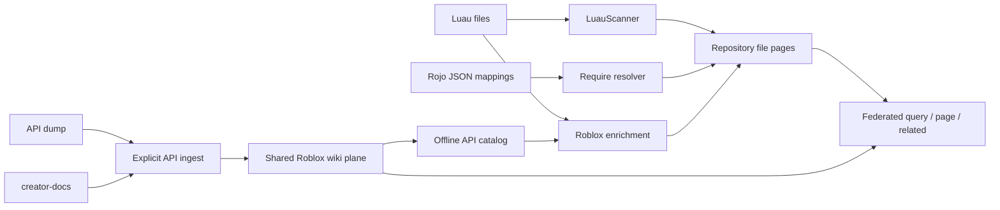

---
# SDD flow type and base branch (FEAT-145).
type: feature
base_branch: dev
---

# Feature Specification: Luau/Roblox support for wikitoolkit

**Feature ID**: FEAT-532
**Date**: 2026-09-06
**Author**: Jesus Lara
**Status**: approved
**Target version**: Next release (number not yet assigned)
**Exploration**: `sdd/proposals/wikitoolkit-luau-roblox.brainstorm.md`
**Isolation**: mixed

## 1. Motivation & Business Requirements

### Problem Statement

Roblox coding agents need both repository knowledge and platform API knowledge.
The current scanner registry has no Luau plugin, and default code suffixes exclude
`.luau` and `.lua`. Roblox script files therefore produce no default file pages,
although an explicit suffix override can admit shallow pages and other supported
files in the same repository remain indexable. Resolving Roblox `require` calls
also requires DataModel-to-file mappings, beyond ordinary filesystem imports.

Platform API definitions have a separate lifecycle from project code. Putting
all platform classes and enums into every project's local search corpus would
mix release state and duplicate acquisition. The authoritative brainstorm selects
Option B: local code pages plus an independently generated, federated Roblox API
plane; borrow DataModel enrichment from Option C without changing file identity.

### Goals

- Index `.luau` and `.lua` through the existing offline build, with comments,
  functions, signatures, exported types and module-table exports in the outline.
- Resolve static requires through `sourcemap.json`, then `default.project.json`
  when the sourcemap is unavailable/invalid, and relative string imports.
- Generate one page per API class and enum from the official dump, enriched with
  creator-docs prose, with no LLM calls or vendored platform dumps.
- Share the API plane under `PARROT_HOME` and query it through namespace `roblox`.
- Link code pages to API pages using `references`, retaining `file:<rel_path>` ids.
- Keep `LanguageScanner` signatures, deterministic/offline extraction, graceful
  degradation, and existing non-Luau behavior intact.

### Non-Goals (explicitly out of scope)

Type inference, running Roblox code, invoking Rojo or luau-lsp, Lua dialect
completeness, ast-grep registration for Luau, Luau `sym:` pages, replacing
repository identities with DataModel identities, background API downloads,
LLM-based API summarization, and unrelated wiki refactors.

## 2. Architectural Design

### Overview

Two independent acquisition paths feed existing wiki retrieval. Local builds never
fetch the API; only the explicit ingestion command acquires upstream data. The
scanner owns source syntax and repository imports. A separate Roblox enrichment
step owns DataModel presentation and API reference candidates, because the frozen
scanner result has no metadata or external-edge fields.



### Local scanning and resolution

Register `LuauScanner` for both suffixes and register `luau: tree_sitter_luau`
in the grammar map. Use the default `language()` callable. Return no symbols or
symbol refs. `mode` is `tree-sitter` when the grammar is available and `heuristic`
otherwise; report individual file guard/fallback reasons separately rather than
claiming structural extraction.

Render leading comments, named/local functions, colon methods, exported and
non-exported type declarations, and assignments to a returned module table.
Preserve written type syntax; do not infer types. Tree traversal skips malformed
subtrees while retaining unrelated declarations. A missing grammar takes the
bounded heuristic path; an unexpected extraction exception returns an empty
`LanguageOutline`. Mask comments and string bodies before heuristic matching so
examples inside them do not become imports or API references.

Build one reference index per scan from `get_scan_root()` and all discovered
paths. Sourcemap nodes carry `name`, `className`, `filePaths`, and `children`;
store one-to-many associations without arbitrarily selecting among duplicates.
Resolve `script.Parent.Foo`, static `game.Service.Path`, and relative strings
against this index. Only unique, existing, in-root, discovered source targets
produce edges. Reject absolute/out-of-root paths, traversal through symlinks,
ambiguous names, numeric asset requires and computed expressions. A valid but
stale sourcemap entry is unresolved, not silently remapped through the project
fallback. Relative strings remain available regardless of mapping mode.

The project-file fallback reads static `tree` / `$path` declarations and maps
ordinary script suffixes and `init` module conventions; unsupported directives
produce diagnostics, never external commands. Test `.luau`/`.lua`, init-file
ambiguity, Script/LocalScript/ModuleScript nodes and duplicated instance names.
Auxiliary JSON size/depth limits and parser resource limits are release gates
specified in section 8; malformed mapping input must not abort a scan.

DataModel instance paths and `className` appear in a dedicated file-page body
section (the existing page model has no arbitrary metadata field). Multiple valid
instance mappings are presented in stable order. Do not infer client/server
execution exclusively from className or folder naming.

### API plane acquisition and publication

User surface: `wikitoolkit ingest roblox-api [--refresh]`. This must coexist with
`wikitoolkit ingest SOURCE` and all document-ingestion flags. Existing `ingest`
is a Click command, not a group. Implement an explicit early dispatch for the
reserved bare source `roblox-api`, before document/LLM imports or mode validation;
`./roblox-api` remains a literal local source. Reject document-specific options
for API ingestion with an actionable error. Keep document behavior for every
other source. Document the reserved-name compatibility detail.

Resolve the Studio version from `https://setup.rbxcdn.com/versionQTStudio`, then
fetch `https://setup.rbxcdn.com/<version>-API-Dump.json`. Acquire creator-docs at
one immutable commit per generation, so the page set cannot mix revisions.
Acquisition strategy/cache defaults remain proposed in section 8. Use aiohttp,
bounded response sizes, bounded concurrency, request timeouts and limited retries.
A missing YAML file for a class is a supported structural-only page; a failed
request, invalid dump or malformed present YAML is not silently equivalent to
that absence. Validate inputs before publication.

Join class/member prose to dump entities by exact names. The dump is authoritative
for existence, inheritance, member kinds, parameters, return types, security,
thread safety and enum items. Creator-docs supplies descriptive text and links.
Do not generate classes solely because documentation mentions them. Render stable
local ids `class/Players` and `enum/Material`; federation qualifies them as
`roblox::class/Players` and `roblox::enum/Material`. Sort entities/edges, preserve
signatures exactly, include provenance and upstream links, and estimate tokens
with the existing store helper. The brainstorm's observed counts are historical
measurements, not fixed acceptance counts.

Render `extends` only when the superclass exists in the same generation; render
`references` for recognized class/enum references that resolve in its catalog.
Do not manufacture pages for missing references. One manifest records Studio
version, creator-docs commit, content hashes, renderer schema version, retrieval
time, counts and skipped/missing-doc diagnostics. All payloads live outside the
repository. Generated page content and edges are deterministic for identical
inputs; acquisition timestamps are manifest metadata, not content changes.

Build an isolated SQLite generation under `parrot_home()/roblox/`, close and
validate it before making it visible. Publish by an atomic namespace-registry
pointer update to an immutable generation directory; never replace an open
SQLite directory in place. Concurrent writers must serialize publication or
compare the observed registry generation before promotion. Preserve the last
good generation on all acquisition/render/publication failures. Retain old
generations for active readers; automatic garbage collection is out of scope.

After success, show the generation location and an explicit namespace-registration
instruction using existing namespace configuration. Do not silently replace a
user's existing `roblox` declaration. Missing namespaces continue to use the
existing NamespaceSkip behavior. The default ingestion is a cache hit if a
validated generation exists; `--refresh` semantics await section 8 review.

### Code-to-API linking: requirements and pending architecture decision

The API catalog is read from local generated state. With no available catalog,
build code pages and local requires, report skipped API linking, and perform no
network access. API availability, namespace selection, source-map content and
renderer version must participate in enrichment invalidation: installing or
refreshing the API or changing a mapping must update edges/body enrichment even
when Luau source bytes are unchanged. Removing an API use must remove its old
outgoing reference; deleting a file must remove its links.

Do not return qualified API ids from `resolve_import`: `build_import_edges`
unconditionally wraps resolved values in `file:`. Add a dedicated enrichment
result and separate external-edge list, attached to source-owned slices during
both bulk and incremental persistence. Do not feed API edges into symbol
resolution or reuse `LanguageOutline.refs` as an external-edge transport.

**Owner decision pending:** extend federation or use local stub pages. No
implementation may choose between these alternatives until the owner resolves
section 8. The recommended federation alternative requires all of the following,
not merely ignoring `::` in a SQL lint query:

- Allow qualified foreign *destinations* on locally owned `references` edges in
  both edge insertion and source-slice replacement; keep foreign source/page
  writes prohibited and foreign stores read-only.
- Route outgoing neighbors to the destination plane, preserve the original
  qualified id, and fetch destination stubs. Current qualification can prepend
  the source namespace to an already foreign-qualified destination.
- Include local incoming references when expanding a qualified API page; do not
  imply reverse access from every unrelated project on the machine.
- Classify resolved foreign targets, absent/unreachable namespaces, and missing
  pages separately. A typo in a known available namespace remains broken; a
  syntactically qualified string is not sufficient evidence of a valid edge.
- Apply health classification at the federated read boundary without weakening
  local backend lint. Audit CLI status/lint consumers that bypass that boundary.
- Test local scope, explicit foreign scope, empty/unbuilt namespaces, malformed
  identifiers, source deletion, and source-slice replacement. Backend-specific
  behavior beyond the shared BaseWikiStore contract requires re-verification.

The stub alternative must define local stub identity, body/provenance, source
ownership and pruning, and how `related` reaches the authoritative foreign page.
It must not add all API pages to the local ranking corpus. This alternative is
recorded for the owner decision, not selected by this draft.

### Integration Points

Paths below are relative to `packages/ai-parrot/src/parrot/knowledge/wiki/`.

| Existing component | Integration type | Notes |
|---|---|---|
| `languages/__init__.py`, `languages/treesitter.py` | extends registries | Luau entry and grammar module |
| `repo_scan.py` | additive integration | Suffixes, source-owned enrichment carrier and DataModel section |
| `cli.py` | extends | Ingest dispatch, build enrichment persistence/invalidation, health routing |
| `store.py` | uses | Existing page, edge and source-slice APIs; schema changes not assumed |
| `project.py` | uses | PARROT_HOME, namespace config, atomic registry persistence |
| `federation.py`, `context.py` | conditional changes | Requires explicit cross-namespace decision |
| `packages/ai-parrot/pyproject.toml` | optional dependency | Add Luau grammar to wiki-languages only |

### Data Models and New Public Interfaces

These are **proposed** new types, not existing imports. Implement them using
Pydantic and explicit type annotations, keeping the LanguageScanner ABC unchanged.

| Proposed type/interface | Contract |
|---|---|
| `LuauScanner(LanguageScanner)` | Existing outline/index/resolve_import/mode signatures; name `luau` |
| `RobloxInstanceIndex` | File-to-instance associations, instance-to-files mappings, mapping digest and diagnostics |
| `RobloxApiManifest` | Studio version, docs commit, schema version, source hashes, acquisition timestamp and counts |
| `RobloxApiCatalog` | Class/enum names to unqualified page ids, generation identity |
| `RobloxFileEnrichment` | Source relative path, rendered DataModel section, candidate API references, dependency digest and diagnostics |
| `RobloxApiIngestResult` | Generation directory, manifest, reuse/publication outcome and diagnostics |
| `ingest_roblox_api(*, refresh: bool = False) -> RobloxApiIngestResult` | Proposed async entry point; no LLM dependency |

## 3. Module Breakdown

1. **Luau scanner** — create `languages/luau.py`; modify registry and grammar
   maps plus `CODE_SUFFIXES`. Own syntax extraction/fallback and mode reporting.
   Depends on existing scanner contracts and the robustness decision.
2. **Roblox project mapping** — create `roblox/project.py` and `roblox/models.py`;
   implement sourcemap/project fallback, safe unique resolution and DataModel
   enrichment. Scanner uses the resolver without importing network acquisition.
3. **API acquisition** — create `roblox/acquire.py` and package `__init__.py`;
   own HTTP inputs, cache, manifest and generation validation. Depends on models
   and acquisition/refresh decisions.
4. **API renderer/publication** — create `roblox/render.py` and `roblox/ingest.py`;
   deterministic page/edge generation, complete replacement generations and
   publication. Depends on module 3 and existing store/project APIs.
5. **CLI ingestion compatibility** — modify `cli.py`; isolate API dispatch from
   document ingestion and document registration. Depends on module 4.
6. **Enrichment and federation** — create `roblox/references.py`; integrate
   `repo_scan.py` and build persistence in `cli.py`, plus federation/context
   changes if chosen. Depends on modules 1–4 and cross-namespace/scope decisions.
7. **Dependencies, tests and docs** — optional grammar declaration and lockfile
   update using the existing workspace tooling; new focused tests under
   `tests/knowledge/wiki/languages/` and `tests/knowledge/wiki/roblox/`, federation
   regression tests in `tests/knowledge/wiki/test_federation.py`, CLI coverage
   alongside existing CLI tests; update `docs/guides/llm-wiki-guide.md`.

All module paths without a package prefix are relative to the wiki directory
identified above. New paths are intentional additions, not verified existing files.

## 4. Test Specification

### Unit Tests

| Test group | Expected behavior |
|---|---|
| Outline extraction | Functions, colon methods, module exports, generics, exported types, comments and signatures |
| Optional grammar | Missing/broken grammar yields bounded heuristics; no import failure or sym pages |
| Parser robustness | Oversize input bypasses parser; malformed small/large input terminates; next valid parse is uncontaminated |
| Grammar recovery | Unsupported attributes/type packs do not discard unrelated declarations |
| Require resolution | Sourcemap, static project fallback, relative strings and init conventions; no guessed ambiguous targets |
| Mapping validation | Missing, malformed, stale, over-depth, multi-path and escaping paths degrade predictably |
| API rendering | Exact member data, structural-only classes, enums, inheritance, links, stable order and identical replay |
| Acquisition | Cache hit makes zero HTTP calls; bounded retry/timeouts/size; partial failure cannot publish |
| Publication | Interrupted/concurrent refresh retains a usable old generation and valid registry |
| API candidates | Comments, strings, shadowed identifiers, local type aliases and unknown names cannot create false references |

### Integration Tests

| Test | Expected behavior |
|---|---|
| Offline build | Synthetic Roblox repository produces stable file pages and require edges without sockets or LLM calls |
| Federated retrieval | Project and API queries return qualified API pages with configurable weight; page/related resolve |
| Cross-plane lifecycle | References survive rebuild; removed use/file removes edge; missing namespace degrades without foreign writes |
| Enrichment invalidation | Mapping/catalog changes refresh unchanged source files; unrelated languages remain unchanged |
| CLI compatibility | New API syntax works; prior ingest SOURCE modes/help/options and literal ./roblox-api remain usable |
| Atomic refresh | API removed between generations disappears only after successful publication; readers retain old generation on failure |
| Polyglot regression | Existing scanner registry, source slices, symbols, local lint and federation access restrictions remain correct |

### Test Data / Fixtures

Use tiny hand-authored Luau files, mapping JSON, API JSON and creator-docs YAML
under test fixtures; never commit an upstream dump. Use temporary PARROT_HOME
and real tiny SQLite planes (existing federation tests provide the pattern).
Mock HTTP acquisition and assert network/LLM paths are unreachable in build.
Generate pathological input deterministically; bound test execution externally
so a parser regression cannot hang CI. Require one CI job with the optional Luau
grammar installed and another forcing grammar absence. Use pytest/pytest-asyncio;
store verification logs under `artifacts/logs/`.

## 5. Acceptance Criteria

- [ ] Both Luau suffixes are discovered by default and retain `file:` identity.
- [ ] Outlines and module imports satisfy module 1/2 fixtures; `symbols` and
      `refs` remain empty for Luau in every mode.
- [ ] `LanguageScanner` method signatures are unchanged; build never performs
      HTTP, executes Roblox code, or invokes external language tools.
- [ ] Resource-guard values and enforcement mechanism are reviewed and tested
      against the pathological corpus before approval for implementation.
- [ ] API ingestion creates one class/enum page for every valid dump entity;
      missing prose is explicit, and source data/provenance remain attributable.
- [ ] Failed refresh and concurrent publication cannot corrupt the last good plane.
- [ ] API plane is independent, reusable, and federated read-only with configurable weight.
- [ ] Code→API references resolve through page/related and have correct lifecycle
      and health classification under the selected cross-namespace design.
- [ ] Changed mappings/API catalogs update enrichment for unchanged Luau sources.
- [ ] Document-ingestion CLI and existing polyglot/federation tests retain behavior.
- [ ] Optional grammar and forced-fallback jobs, focused integration tests, and
      documented robustness checks pass; documentation describes setup and limitations.
- [ ] Section 8 design blockers are resolved before marking the spec approved.

## 6. Codebase Contract

Verified by source inspection on 2026-09-06. Paths are repository-relative; these
are source-level contracts, not a claim that all imports were executed together.
The required wiki query and federation page read also succeeded.

### Verified Imports

```python
from parrot.knowledge.wiki.languages.base import LanguageOutline, LanguageScanner
# packages/ai-parrot/src/parrot/knowledge/wiki/languages/base.py:23,48
from parrot.knowledge.wiki.languages import get_scan_root
# packages/ai-parrot/src/parrot/knowledge/wiki/languages/__init__.py:101
from parrot.knowledge.wiki.languages.treesitter import get_parser
# packages/ai-parrot/src/parrot/knowledge/wiki/languages/treesitter.py:64
from parrot.knowledge.wiki.store import WikiPageRecord, SQLiteWikiStore, create_wiki_store
# WikiPageRecord: store.py:299; SQLiteWikiStore: store.py:711; create_wiki_store: store.py:1795 (see paths below)
from parrot.knowledge.wiki.project import WikiNamespaceConfig, parrot_home
# packages/ai-parrot/src/parrot/knowledge/wiki/project.py:175,940
from parrot.knowledge.wiki.context import split_namespaced_id, qualify_id
# packages/ai-parrot/src/parrot/knowledge/wiki/context.py:54,82
```

### Existing Class Signatures and Integration Points

`W` below expands to `packages/ai-parrot/src/parrot/knowledge/wiki/`.

| Contract | Verified location | Consequence |
|---|---|---|
| `LanguageOutline`: summary, outline, imports, symbols, refs | `W/languages/base.py:23` | No metadata or external-edge slot |
| `outline(self, source: str, rel_path: str) -> LanguageOutline` | `W/languages/base.py:66` | Must never raise; deterministic/offline |
| `build_reference_index(self, rel_paths: Iterable[str]) -> Any` | `W/languages/base.py:83` | All discovered paths, auxiliary files via root accessor |
| `resolve_import(self, spec: str, from_file: str, index: Any) -> str | None` | `W/languages/base.py:100` | Return local relative path only |
| `_SCANNERS`, suffix index | `W/languages/__init__.py:32` | Explicit scanner instance registration |
| `_GRAMMAR_MODULES`, default callable | `W/languages/treesitter.py:30`, `:61` | Add grammar map only |
| `PerlScanner`, `PhpScanner` | `W/languages/perl.py:211`, `W/languages/php.py:123` | Existing extraction/fallback and auxiliary mapping patterns |
| `CODE_SUFFIXES`, `FileSlice`, `RepoScan` | `W/repo_scan.py:68`, `:219`, `:248` | Suffix discovery and explicit carriers |
| `build_import_edges(files, index_paths=None)` | `W/repo_scan.py:803` | Wraps local targets in file ids; not API transport |
| `scan_repository(...) -> RepoScan` | `W/repo_scan.py:1116` | Offline scan entry point |
| `_ingest_files(store, sources, root, scan, force=False)` | `W/cli.py:648` | Source-owned bulk/incremental writes; unchanged-file skip needs enrichment invalidation |
| `WikiPageRecord`: concept_id, node_id, title, category, summary, body, source_id, token_count, origin, asserted_by, updated_at, content_hash | `W/store.py:334` | No arbitrary metadata field |
| `async upsert_pages(self, pages: list[WikiPageRecord]) -> int` | `W/store.py:1134` | Updates page storage and FTS |
| `async add_edges(self, edges: list[tuple]) -> int` | `W/store.py:1154` | Three/four element edges with optional provenance |
| `async replace_source_slice(self, source_id, pages, edges=None)` | `W/store.py:1176` | Source-owned replacement, not whole-plane publication |
| `neighbors(self, concept_id, rel=None, direction='both')` | `W/store.py:1672` | LEFT JOIN returns unknown targets without titles |
| `broken_edges(self)` | `W/store.py:1773` | Local-only destination existence checks |
| `WikiNamespaceConfig`: store, backend, weight, description | `W/project.py:175` | Exactly one source field; weight 0–1 |
| `load_global_registry`, `save_global_registry` | `W/project.py:960`, `:986` | Validated loading and atomic registry replacement |
| `_qualify_row`, `neighbors` | `W/federation.py:552`, `:877` | Qualification currently follows seed namespace |
| `_assert_local`, `_strip_edge`, `add_edges`, `replace_source_slice` | `W/federation.py:947`, `:989`, `:1002`, `:1006` | Explicit prohibition on foreign endpoint writes |
| `FederatedWikiStore.broken_edges` | `W/federation.py:1088` | Delegates directly to local store |
| `ingest(source: str, ...) -> None` | `W/cli.py:3626` | Click command with source argument, not command group |

### Does NOT Exist (Anti-Hallucination)

- `languages/luau.py`, a Lua scanner, and `roblox/` implementation do not exist yet.
- `.lua` / `.luau` are not in default `CODE_SUFFIXES`.
- `WikiPageRecord` is not defined in wiki `models.py`; it has no metadata dict.
- `LanguageOutline` cannot currently emit external-page edges or DataModel metadata.
- `resolve_import()` does not return arbitrary wiki page identities.
- `wikitoolkit ingest roblox-api` is not an existing specialized command.
- Federation does not currently support writing cross-namespace references.
- A wiki `builder.py` module is not the build seam;
  repository scanning and persistence are in `repo_scan.py` and `cli.py`.
- Do not assume `tree_sitter_luau.language_luau()`; the upstream binding exposes
  `language()`. Ast-grep compatibility and LSP declaration parsing are excluded
  based on the brainstorm's experiments, not newly verified capabilities.

## 7. Implementation Notes & Constraints

### Patterns to Follow

Use typed Pydantic models, existing store APIs, and local imports where needed to
avoid loading HTTP/LLM dependencies with a scanner. Keep async acquisition separate
from synchronous extraction. Match Black/isort conventions. Python minimum is
**3.11**, verified in the package metadata; the brainstorm's 3.10+ statement must
not lower the project's supported baseline. No implementation code is part of
this specification commit.

### Known Risks / Gotchas

- A post-parse ERROR-density check cannot interrupt a parser already stuck in
  native code. A pre-parse size cap alone is not proof of a wall-time bound.
  Review version-compatible cancellation/isolation and test the actual mechanism.
- Wall-clock cutoffs can make fallback machine-dependent; distinguish deterministic
  extraction limits from emergency timeouts and record degraded output clearly.
- The shared parser cache must not carry interrupted parse state into the next file.
- A source-map or catalog change is invisible to a source-only freshness hash.
- Foreign-qualified ids can be double-prefixed by current neighbor qualification.
- Current federation write tests deliberately enforce local-only endpoints; revise
  only the selected edge exception, preserving foreign page mutation prohibitions.
- Latest Studio version and creator-docs revision are independent; provenance must
  record both. Do not treat historical counts as stable upstream contracts.
- An API generation must not be half-published, and namespace configuration conflicts
  must never be silently overwritten.

### External Dependencies

| Package | Constraint | Status / reason |
|---|---|---|
| tree-sitter | Existing `>=0.23` optional extra | Parser runtime; exact guard API needs compatibility validation |
| tree-sitter-luau | Proposed `>=1.2` in wiki-languages | New optional grammar; no installation in this spec workflow |
| PyYAML | Existing `>=6.0.2` core | creator-docs decoding; use safe loading |
| aiohttp | Existing runtime import in `W/documents.py:26` | Async acquisition; reuse existing dependency resolution |
| pydantic | Existing `==2.12.5` core | New typed models |

Verified declarations: `packages/ai-parrot/pyproject.toml:55`, `:58`, `:271`.
The grammar dependency was proposed by the authoritative brainstorm; approval of
this spec includes approval to add that optional dependency during implementation.
No external CLI, runtime binary, or additional YAML library is required.

Primary references inspected during specification research:

- [Luau grammar distribution](https://pypi.org/project/tree-sitter-luau/): 1.2.0
  distributions, Python requirement and available platform wheels.
- [Luau Python binding](https://raw.githubusercontent.com/tree-sitter-grammars/tree-sitter-luau/master/bindings/python/tree_sitter_luau/__init__.py): `language()` export.
- [Rojo sourcemap implementation](https://raw.githubusercontent.com/rojo-rbx/rojo/master/src/cli/sourcemap.rs): source-map model reference for implementation validation.
- [Players creator-docs](https://raw.githubusercontent.com/Roblox/creator-docs/main/content/en-us/reference/engine/classes/Players.yaml): prose/member source format.
- [Parser documentation](https://tree-sitter.github.io/py-tree-sitter/classes/tree_sitter.Parser.html): interrupted parse/reset semantics; validate against installed versions.

The browser could not retrieve the Studio version endpoint during this run;
endpoint behavior and dump observations are carried from the brainstorm and must
be covered by mocked fixtures plus an opt-in acquisition smoke check.

### Worktree Strategy

**Recommended isolation: mixed**, carried from the brainstorm. Scanner/mapping
and API acquisition/rendering are independent tracks until enrichment integration.
Use separate implementation worktrees only after task decomposition. Assign
registry/suffix/dependency edits to one owner and serialize final `cli.py` changes.
The federation decision may enlarge the shared integration track. Coordinate with
Perl/ast-grep scanner changes that touch the same registry tables. This workflow
creates a spec only; it does not dispatch implementation agents or worktrees.

## 8. Open Questions

All owner decisions from the 2026-09-06 review round are recorded below.
Every question is settled and binding on its dependent module; no open
questions remain.

### Settled by the owner

- [x] ¿Tipo de flujo y rama base? — *Owner: Jesus Lara*: `feature` sobre `dev`.
- [x] ¿Alcance de v1? — *Owner: Jesus Lara*: código **y** API de Roblox, los dos planos.
- [x] ¿Qué sufijos reclama el scanner? — *Owner: Jesus Lara*: `.luau` y `.lua`.
- [x] ¿Cómo se resuelven los `require`? — *Owner: Jesus Lara*: `sourcemap.json`
      con fallback a `default.project.json` y a requires relativos por string;
      nunca invocando binarios.
- [x] ¿Plano estructural `sym:` en v1? — *Owner: Jesus Lara*: no; degradar a
      `mode="tree-sitter"` (verificado que ast-grep no puede registrar Luau
      desde el wheel).
- [x] ¿Fuente del conocimiento de la API? — *Owner: Jesus Lara*: API dump
      oficial **+** creator-docs.
- [x] ¿Dump vendorizado o descargado? — *Owner: Jesus Lara*: descargado desde la
      CDN con `--refresh`; nada de dumps alojados localmente en el repo.
- [x] ¿Granularidad de las páginas de API? — *Owner: Jesus Lara*: una página por
      clase y por enum.
- [x] ¿Se enlazan los dos planos? — *Owner: Jesus Lara*: sí, con aristas
      `references` desde el código hacia las páginas de la API.
- [x] **Target release** — *Owner: Jesus Lara*: próximo release, aún sin número.
      El campo **Target version** permanece sin número hasta que se asigne.
- [x] **Aristas cross-namespace** — *Owner: Jesus Lara*: **soporte real de
      federación**, no páginas-stub locales. El alcance NO se limita a filtrar
      `broken_edges()`; cubre las cuatro superficies medidas (ver § Blast radius).
- [x] **Umbral del guard de robustez** — *Owner: Jesus Lara*: **una combinación**
      — cota de tamaño **y** densidad de nodos `ERROR` **y** timeout de parseo,
      no un solo criterio.
- [x] **Medición antes que umbral** — *Owner: Jesus Lara*: la medición es
      importante. Los 32 KiB propuestos son una hipótesis de partida, **no** una
      cota de tiempo de pared probada. Se fija el presupuesto de cancelación, el
      límite de entrada del fallback y las cotas del JSON de mapeo **después** de
      medir, antes de aprobar la tarea del scanner.
- [x] **Invalidación del plano Roblox** — *Owner: Jesus Lara*: **sin invalidación
      automática**. `wikitoolkit status` solo indica **cuándo se descargó** el
      plano Roblox (marca temporal + versión registrada) y **nunca** hace red.
      `--refresh` es el único camino que toca la red y el único que regenera.
- [x] **Política de refresco** — *Owner: Jesus Lara*: aceptada. Sin TTL en
      segundo plano y sin llamadas de red desde `status`. Un `--refresh`
      explícito comprueba la versión de Studio **y** el commit de creator-docs,
      reutiliza los payloads si no cambiaron, y regenera cuando cambia
      cualquiera de los dos o el esquema del renderizador. Compatible con la
      decisión anterior: comparar no es invalidar — nada caduca solo.
- [x] **Ámbito del enlace código→API** — *Owner: Jesus Lara*: **todo, incluidos
      los accesos encadenados** (`workspace.Terrain`). Se acepta el coste de
      aristas falsas a cambio de cobertura. Esta decisión **anula** la propuesta
      de dejar los accesos encadenados fuera de v1: entran en v1. Se mantiene la
      exclusión de shadowing y alias locales (una variable local que tape un
      nombre de clase conocida no genera arista), y se mantiene que **no** hay
      tipos inferidos: solo `game:GetService("X")` literal, anotaciones de tipo
      explícitas y accesos encadenados sobre raíces conocidas.

### Settled by the owner (continued)

- [x] **Adquisición de creator-docs** — *Owner: Jesus Lara*: **tarball fijado por
      SHA**. Medición que motivó el cambio frente a la propuesta previamente
      aceptada (625 peticiones raw con ≤8 concurrentes):

      | Enfoque | Descarga | Tiempo | Peticiones | Requiere |
      |---|---|---|---|---|
      | **Tarball fijado por SHA** | **4,78 MB** | **1,04 s** | **1** | solo `aiohttp` |
      | 625 fetches raw | 5,6 MB | ~8 s @8 conc. | 625 | `aiohttp` + reintentos + caché por fichero |
      | Sparse-checkout blobless | 3,2 MB en `.git` | ~5,0 s | — | binario `git` |

      El tarball comprimido resulta **más pequeño** que las 625 piezas sueltas
      (los YAML comprimen ~4:1). Sparse-checkout baja menos bytes pero exige el
      binario `git`, la misma clase de dependencia externa que el diseño ya
      rechazó para `rojo`.

      **Flujo definido** (verificado de punta a punta):

      1. `GET https://api.github.com/repos/Roblox/creator-docs/commits/main`
         → SHA del commit. Única llamada a la API de GitHub; su único propósito
         es fijar la versión. Sin autenticación.
      2. `GET https://codeload.github.com/Roblox/creator-docs/tar.gz/<sha>`
         → 4,78 MB. `codeload` no es la API, así que no consume su cuota de
         60 req/h. Sin autenticación, sin binario `git`.
      3. Extracción **en memoria** con `tarfile` sobre un `io.BytesIO`,
         filtrando `*/content/en-us/reference/engine/classes/*.yaml`:
         625 clases en 0,33 s, **cero escrituras a disco**.
      4. Filtrado a las clases nombradas en el API dump (aplicado tras extraer)
         y parseo YAML.

      Total: **2 peticiones, ~1,4 s**. Desaparecen la concurrencia acotada, los
      reintentos, el backoff y la caché por fichero: no hay 625 fallos parciales
      posibles cuando solo hay una descarga. El SHA resuelto se registra como
      procedencia del plano y es lo que `--refresh` compara.

### Blast radius — cross-namespace federation support (medido)

La relajación no es cosmética: hoy la arista código→API **no se puede
escribir**. `_assert_local()` (`federation.py:947`) lanza
`ValueError("write to namespace 'roblox' requires --ns roblox")` para cualquier
id cualificado en camino de escritura, y `_strip_edge()` lo aplica a **ambos**
extremos. El invariante está declarado en el docstring de `add_edges()`:
*"Write edges into the local plane (no cross-namespace edges)."*

| Superficie | Ubicación | Cambio requerido |
|---|---|---|
| Escritura | `_assert_local` / `_strip_edge` | Relajación **asimétrica**: `src` foráneo sigue prohibido, `dst` foráneo pasa a ser legal |
| Salud | `broken_edges()` (`federation.py:1088` → SQL en `store.py`) | Excluir destinos `ns::` cualificados, o resolverlos contra el namespace declarado |
| Enrutado de vecinos | `neighbors()` (`federation.py:878`) | Enruta por el namespace de la semilla y cualifica las filas con él; una fila local cuyo `dst` ya es `roblox::…` se re-cualificaría → prefijo doble |
| Referencias entrantes | — | No existe hoy. La regla read-only impide escribir aristas inversas en el plano de Roblox |

Superficie de test que fija el comportamiento actual: 1.283 líneas
(`test_federation.py` 657, `test_namespaces_e2e.py` 296,
`test_project_namespaces.py` 199, `test_mcp_server_namespaces.py` 131). Dos
tests afirman explícitamente el rechazo y deben reescribirse de forma
deliberada: `test_federation.py:255` y `test_federation.py:541`
(`pytest.raises(ValueError, match="requires --ns …")`).

**Riesgo residual señalado, no bloqueante**: las referencias entrantes ("¿qué
módulos de mi juego usan `TweenService`?") no tienen solución limpia dentro de
la regla read-only — exigen un índice inverso que no puede vivir en el plano de
Roblox y que en el plano local hay que construir aparte.

## Revision History

| Version | Date | Author | Change |
|---|---|---|---|
| 0.1 | 2026-09-06 | Jesus Lara | Initial FEAT-532 draft from authoritative brainstorm; verified scanner/federation/CLI contracts; pending owner decisions retained |
| 0.2 | 2026-09-06 | Jesus Lara | Owner review round resolved 13 of 14 open questions: real federation support for cross-namespace edges (blast radius measured), combined size+error-density+timeout guard with measurement first, no auto-invalidation (status reports download time only), chained instance accesses IN v1, next release without number. creator-docs acquisition reopened: measurement shows a SHA-pinned tarball (4.78 MB / 1.04 s / 1 request) beats the previously accepted 625-request fetch |
| 0.3 | 2026-09-06 | Jesus Lara | Last open question closed: creator-docs acquired as a SHA-pinned codeload tarball, extracted in memory (2 requests, ~1.4 s, 0 disk writes), replacing the 625-request fetch and its concurrency/retry/cache machinery. Spec has no open questions |
